# Agents Feature

The agents feature owns Lotti's persisted agent runtime. It does not implement
model inference itself. Instead, it combines the `ai` feature's conversation
and profile infrastructure with agent-specific state, wake scheduling, sync,
and human review gates.

At runtime, the journal database remains the source of truth for tasks,
projects, checklist items, labels, and time entries. The agents database stores
agent state and outputs: reports, observations, change proposals, evolution
sessions, token usage, and wake history.

## Runtime Boundary

The feature is gated by `enableAgentsFlag` and initialized by
`agentInitializationProvider`.

When the flag is enabled, startup does this:

1. marks stale `running` wake runs as `abandoned`
2. wires `WakeOrchestrator.wakeExecutor` to the correct workflow for each
   agent kind
3. starts `WakeOrchestrator` on `UpdateNotifications.localUpdateStream`
4. starts `ScheduledWakeManager`, which polls hourly for due
   `scheduledWakeAt` values
5. starts `ProjectActivityMonitor`
6. seeds default agent templates
7. seeds default inference profiles and default skills, then upgrades older
   default profiles with skill assignments
8. restores persisted task-agent subscriptions, project-agent direct-edit
   subscriptions, and persisted throttle deadlines
9. wires the sync event processor if one is registered in `GetIt`

When the flag is switched off, the provider is disposed and the orchestrator is
stopped again.

- Task agent wake prompts include:
  - current task JSON context
  - current report + recent observations
  - parent project context with the latest project-agent `tldr` and full
    report body when the task belongs to a project
  - related tasks in the same parent project, capped to a lightweight
    sibling-task directory with stored task-agent `tldr` values only
  - linked task context
- Task agents also expose a read-only `get_related_task_details` tool for
  on-demand drill-down into a sibling task that was included in the current
  related-task directory. The tool is scoped to the current wake's allowlist;
  it cannot browse arbitrary tasks or other projects.
- Linked task context for agents is built directly in
  `TaskAgentWorkflow._buildLinkedTasksContextJson` (forked from
  `AiInputRepository.buildLinkedTasksJson` for the wake path), and injects
  `latestTaskAgentReport` from each linked task's associated task agent (via
  `agent_task` links + `agentReportHead`).
- Linked-task `latestSummary` payloads are stripped before prompt submission
  and are not used for Task Agent execution.
- Related-task directory rows are built in `AiInputRepository` from the
  current task's parent project, sorted by latest task metadata updates,
  enriched with batched time-spent totals from `JournalDb.getBulkLinkedEntities`,
  and filtered to siblings that have a real stored task-agent `tldr`.
- MTTR chart inputs resolve linked tasks with de-duplicated task fetches to
  avoid repeated journal lookups for shared task links.

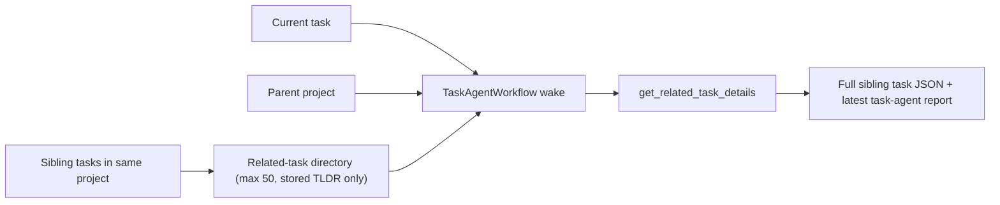
```mermaid
flowchart LR
  Task["Current task"] --> Wake["TaskAgentWorkflow wake"]
  Project["Parent project"] --> Wake
  Siblings["Sibling tasks in same project"] --> Directory["Related-task directory (max 50, stored TLDR only)"]
  Directory --> Wake
  Wake --> Drill["get_related_task_details"]
  Drill --> FullSibling["Full sibling task JSON + latest task-agent report"]
```

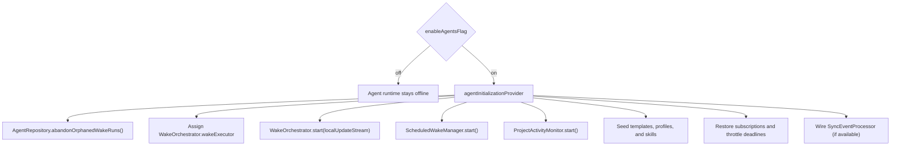
```mermaid
flowchart TD
  Flag{"enableAgentsFlag"} -->|off| Off["Agent runtime stays offline"]
  Flag -->|on| Init["agentInitializationProvider"]

  Init --> Abandon["AgentRepository.abandonOrphanedWakeRuns()"]
  Init --> Wire["Assign WakeOrchestrator.wakeExecutor"]
  Init --> Start["WakeOrchestrator.start(localUpdateStream)"]
  Init --> Sched["ScheduledWakeManager.start()"]
  Init --> Activity["ProjectActivityMonitor.start()"]
  Init --> Seed["Seed templates, profiles, and skills"]
  Init --> Restore["Restore subscriptions and throttle deadlines"]
  Init --> Sync["Wire SyncEventProcessor (if available)"]
```

## Settings Surfaces

`Settings > Agents` is the operator-facing entry point for the feature. The
landing page now exposes three runtime views:

- `Templates`: reusable agent definitions and version heads
- `Souls`: pluggable personality documents with version history and template
  assignments
- `Instances`: persisted agent identities and evolution sessions
- `Pending Wakes`: live wake timers derived from persisted `AgentStateEntity`
  records

The pending-wakes dashboard is intentionally narrower than the full message
log. It shows only wake records that can still fire later:

- `nextWakeAt`: the per-device deferred wake/throttle deadline persisted by
  `WakeOrchestrator`
- `scheduledWakeAt`: the synced scheduled wake used by project agents and
  template improvers

Each pending-wake card owns its own one-second countdown timer and recomputes
the remaining time from `clock.now()` on every tick, so the page does not need
to rebuild the whole list every second and the timer does not drift if frames
arrive late. Deleting a card clears only the represented wake marker:
`nextWakeAt` uses the shared pending-wake cancellation path, while
`scheduledWakeAt` is removed from the agent state.

The instances dashboard stays intentionally lightweight. It exposes kind and
lifecycle filters for task agents, and the task-agent modes now include one
compact aggregate line showing the current counts for total, active, dormant,
and destroyed task-agent identities. The stats line is derived from the same
loaded `AgentIdentityEntity` list as the cards below it, so it tracks the
currently persisted fleet size without adding another query path.

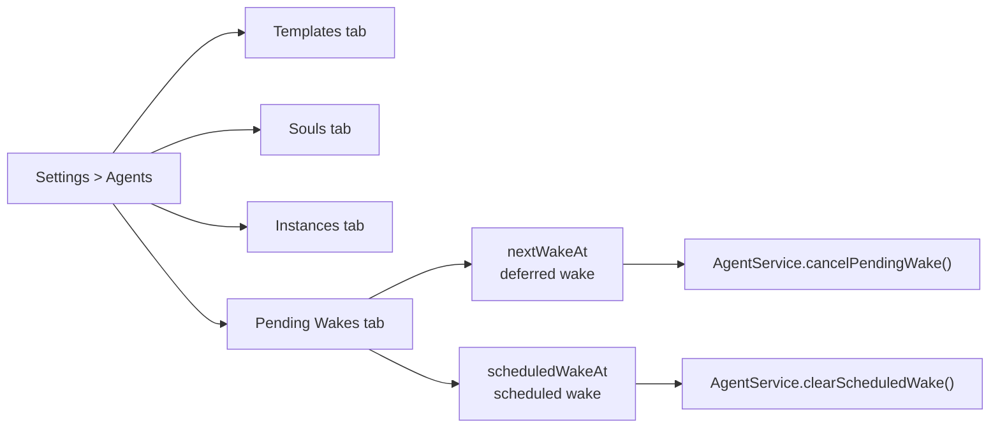
```mermaid
flowchart LR
  Settings["Settings > Agents"] --> Templates["Templates tab"]
  Settings --> Souls["Souls tab"]
  Settings --> Instances["Instances tab"]
  Settings --> Pending["Pending Wakes tab"]

  Pending --> Throttle["nextWakeAt<br/>deferred wake"]
  Pending --> Schedule["scheduledWakeAt<br/>scheduled wake"]

  Throttle --> CancelPending["AgentService.cancelPendingWake()"]
  Schedule --> ClearScheduled["AgentService.clearScheduledWake()"]
```

Templates and Souls are the only tabs that currently expose create FABs. Those
buttons are now wrapped with the shared bottom-navigation clearance so they do
not sink behind the floating app-shell nav on narrow layouts.

## Persistence Model

Agent persistence lives in `agent.sqlite` via Drift
([agent_database.dart](./database/agent_database.dart)). The syncable domain
objects are modeled as `AgentDomainEntity` variants and `AgentLink` variants.
Wake-run history lives in the dedicated `wake_run_log` table.

Persisted agent-side entities include:

- `AgentIdentityEntity` and `AgentStateEntity`
- `AgentMessageEntity` and `AgentMessagePayloadEntity`
- `AgentReportEntity` and `AgentReportHeadEntity`
- `AgentTemplateEntity`, `AgentTemplateVersionEntity`, and
  `AgentTemplateHeadEntity`
- `EvolutionSessionEntity`, `EvolutionSessionRecapEntity`, and
  `EvolutionNoteEntity`
- `SoulDocumentEntity`, `SoulDocumentVersionEntity`, and
  `SoulDocumentHeadEntity`
- `ChangeSetEntity` and `ChangeDecisionEntity`
- `ProjectRecommendationEntity`
- `WakeTokenUsageEntity`

Persisted links include:

- `agent_state`
- `agent_task`
- `agent_project`
- `template_assignment`
- `improver_target`
- `soul_assignment`

The journal database is read on demand during wakes. The agents feature does
not mirror full task or project state into `agent.sqlite`; it persists the
agent's own interpretation and review state.

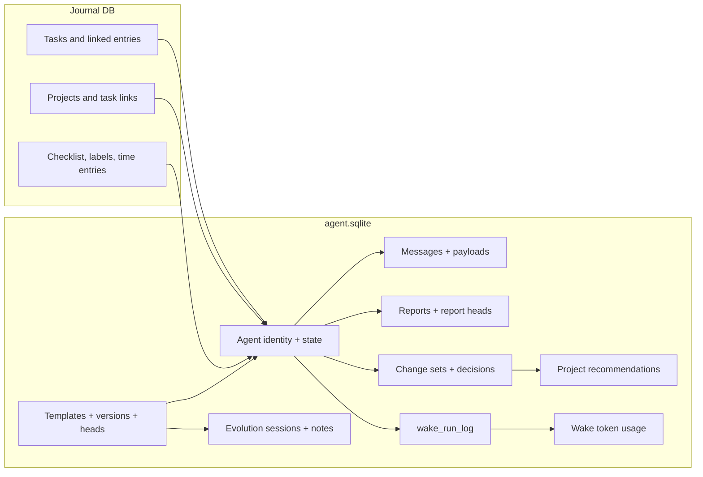
```mermaid
flowchart LR
  subgraph Journal["Journal DB"]
    Task["Tasks and linked entries"]
    Project["Projects and task links"]
    Meta["Checklist, labels, time entries"]
  end

  subgraph AgentDB["agent.sqlite"]
    Agent["Agent identity + state"]
    Msg["Messages + payloads"]
    Report["Reports + report heads"]
    Change["Change sets + decisions"]
    Template["Templates + versions + heads"]
    Evo["Evolution sessions + notes"]
    Reco["Project recommendations"]
    Usage["Wake token usage"]
    Wake["wake_run_log"]
  end

  Task --> Agent
  Project --> Agent
  Meta --> Agent
  Agent --> Msg
  Agent --> Report
  Agent --> Change
  Agent --> Wake
  Template --> Agent
  Template --> Evo
  Change --> Reco
  Wake --> Usage
```

## Memory Model

The feature does not have a hidden memory blob. Memory is split across durable
agent-side records, live journal context, and a small amount of wake-time
derived context.

### Durable memory in `agent.sqlite`

The persisted memory surface includes:

- identity and lifecycle in `AgentIdentityEntity`
- runtime state in `AgentStateEntity`
- slots such as `activeTaskId`, `activeProjectId`, `activeTemplateId`,
  `lastFeedbackScanAt`, `lastOneOnOneAt`, `pendingProjectActivityAt`, and
  scheduling/throttle markers
- the immutable message log: user messages, thoughts, tool actions, and tool
  results
- structured observations, stored as observation messages plus payloads
- reports and report-head pointers
- change sets, decisions, and project recommendations
- template versions, evolution sessions, persisted ritual recaps, and
  evolution notes
- wake token usage and wake-run history

### Live context pulled from the journal domain

The workflows still rebuild fresh operational context on each wake from the
journal-side repositories. Depending on the agent kind, that includes:

- current task or project data
- linked tasks and linked entries
- checklist state
- labels
- time-entry information
- project-to-task relationships

### Retrieval memory

Task-agent reports can also become retrieval memory. When both optional
embedding dependencies are available, `TaskAgentWorkflow` embeds newly
persisted reports after the wake commits so later semantic retrieval can use
the report text.

### Memory compaction: prepared, not active

There is scaffolding for message-span summaries, but no active compaction
pipeline yet.

Prepared model fields include:

- `AgentMessageKind.summary`
- `summaryStartMessageId`
- `summaryEndMessageId`
- `summaryDepth`
- `AgentStateEntity.recentHeadMessageId`
- `AgentStateEntity.latestSummaryMessageId`

Current state:

- task, project, and improver workflows do not write summary messages
- the runtime does not currently compact old message spans into summaries
- the UI can render summary messages if they ever exist, but the production
  wake path still relies on the raw persisted message and report records

## Agent Kinds and Lifecycle

The current persisted agent kinds are:

| Kind | Slot | Primary workflow | Trigger shape |
| --- | --- | --- | --- |
| `task_agent` | `activeTaskId` | `TaskAgentWorkflow` | task notifications, creation, reanalysis |
| `project_agent` | `activeProjectId` | `ProjectAgentWorkflow` | creation, direct project edits, daily scheduled digest |
| `template_improver` | `activeTemplateId` | `ImproverAgentWorkflow` | scheduled ritual |

There is no separate persisted `meta_improver` kind. A meta-improver is a
`template_improver` whose `recursionDepth > 0`.

The lifecycle enum exposes `created`, `active`, `dormant`, and `destroyed`.
Current creation services instantiate agents directly in `active` state, so the
`created` enum value is available in the model but is not the normal service
path today.

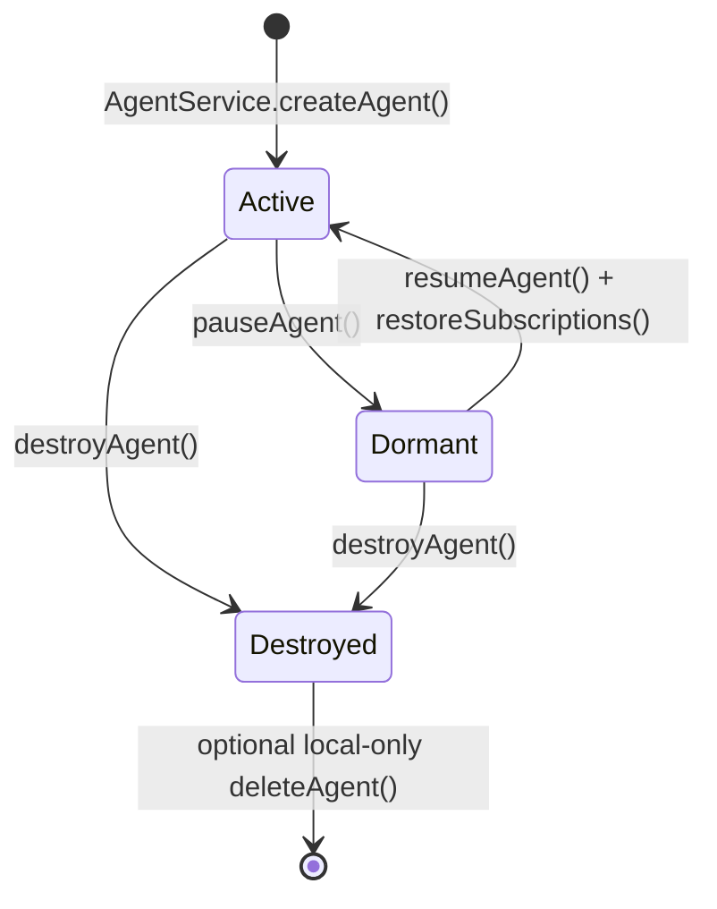
```mermaid
stateDiagram-v2
  [*] --> Active: AgentService.createAgent()
  Active --> Dormant: pauseAgent()
  Dormant --> Active: resumeAgent() + restoreSubscriptions()
  Active --> Destroyed: destroyAgent()
  Dormant --> Destroyed: destroyAgent()
  Destroyed --> [*]: optional local-only deleteAgent()
```

## Wake Orchestration

`WakeOrchestrator` is the central runtime component. It:

- matches notification batches against `AgentSubscription`s
- deduplicates jobs by run key in `WakeQueue`
- merges trigger tokens for already-queued jobs of the same agent
- enforces single-flight execution per agent through `WakeRunner`
- persists wake-run entries before execution
- suppresses self-notifications using vector clocks
- persists and restores subscription-throttle deadlines through
  `AgentStateEntity.nextWakeAt`

The persisted wake reasons are:

- `subscription`
- `creation`
- `reanalysis`
- `scheduled`

Subscription-driven wakes are throttled with a 120 second window. Manual wakes
(`creation`, `reanalysis`, and scheduled jobs enqueued manually by
`ScheduledWakeManager`) bypass subscription matching and that throttle path.

Task agents that were auto-provisioned from category defaults can start with
`awaitingContent = true`. In that mode, the orchestrator skips the wake until
the task or one of its linked entries has meaningful text, then clears the flag
and lets the wake proceed normally.

```mermaid
flowchart TD
  Update["localUpdateStream batch"] --> Match["Match AgentSubscription tokens"]
  Match --> Suppress{"Suppressed by vector-clock tracking?"}
  Suppress -->|yes| Drop["Drop wake"]
  Suppress -->|no| Merge{"Queued job for same agent?"}
  Merge -->|yes| Coalesce["Merge trigger tokens"]
  Merge -->|no| Queue["WakeQueue.enqueue(runKey)"]
  Queue --> Drain["WakeOrchestrator.processNext()"]
  Drain --> Busy{"WakeRunner lock available?"}
  Busy -->|no| Requeue["Requeue job"]
  Busy -->|yes| Content{"awaitingContent gate?"}
  Content -->|skip| Wait["Leave agent dormant until content exists"]
  Content -->|run| Persist["Persist wake_run_log row"]
  Persist --> Exec["Dispatch workflow by agent kind"]
```

### Why the wake design is this defensive

The implementation is explicitly shaped around three background-agent failure
modes:

1. wake storms after rapid local edits
2. self-trigger loops after an agent writes to the same entities it watches
3. duplicate execution when an agent is already running

Current mitigations are:

- `WakeQueue` deduplicates by run key and merges trigger tokens
- `WakeRunner` enforces single-flight execution per agent
- `WakeOrchestrator` persists and restores throttle deadlines through
  `nextWakeAt`
- suppression is pre-registered before execution starts, then replaced with the
  actual mutated-entity vector clocks after execution

That pre-registration step matters because it closes the race window between
"the agent already wrote to the DB" and "the suppression tracker has recorded
the write."

## Task Agents

`TaskAgentService.createTaskAgent()` runs inside an agent-sync transaction and:

1. validates that the task does not already have a task agent
2. resolves a template, defaulting to the seeded Laura template when present
3. creates the agent identity and state
4. sets `slots.activeTaskId`
5. creates `agent_task` and `template_assignment` links
6. registers a task subscription
7. enqueues a creation wake

### Wake Flow

`TaskAgentWorkflow.execute()` is the main production path:

1. load the agent state and resolve `activeTaskId`
2. load the latest report and prior observation messages
3. build task JSON through `AiInputRepository`
4. build linked-task context
5. resolve the assigned template and active version
6. resolve the effective inference profile with `ProfileResolver`
7. fetch pending change sets for the task
8. build the system prompt and user message
9. create a conversation and persist the user message into the agent log
10. run the conversation with `TaskAgentStrategy`
11. persist wake token usage
12. persist the final thought, report, observations, change set, and updated
    agent state
13. optionally embed the persisted report when both embedding dependencies are
    available

The task wake prompt is assembled from:

- current task JSON
- the latest persisted task-agent report, if one exists
- prior observation messages
- linked-task context
- pending change sets for the same task

The linked-task context is not only raw task metadata. The workflow also pulls
in the latest task-agent report for linked tasks when available, so one task
agent can consume another task agent's distilled report.

### Tool Policy

Task agents have two immediate local tools:

- `update_report`
- `record_observations`

The current deferred task tools are:

- `set_task_title`
- `update_task_estimate`
- `update_task_due_date`
- `update_task_priority`
- `set_task_status`
- `set_task_language`
- `add_multiple_checklist_items`
- `update_checklist_items`
- `assign_task_labels`
- `create_follow_up_task`
- `migrate_checklist_items`
- `create_time_entry`

There are no other immediate task-mutating tools today. Non-local task writes
go through `AgentToolExecutor`, which enforces the agent's allowed category set,
captures post-write vector clocks, and persists audit messages for tool actions
and tool results.

`ChangeSetBuilder` is responsible for the deferred path. It:

- explodes batch tools into individually reviewable items
- deduplicates identical proposals within the same wake
- suppresses redundant proposals when they would not change current state

### Confirmation Path

`ChangeSetConfirmationService` applies one change item at a time:

1. re-read the persisted change set to avoid stale UI snapshots
2. persist the user's decision first
3. mark the item confirmed
4. dispatch the tool
5. revert the item to `pending` if dispatch fails

It also resolves follow-up-task placeholder IDs across later migration items
and suppresses rejected label assignments so the same label is not proposed
again immediately.

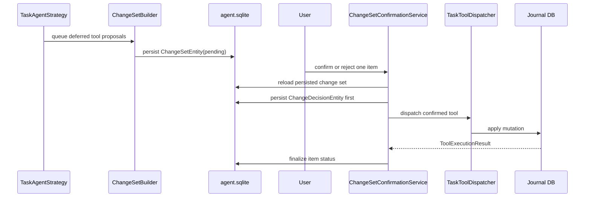
```mermaid
sequenceDiagram
  participant Agent as TaskAgentStrategy
  participant Builder as ChangeSetBuilder
  participant Store as agent.sqlite
  participant User as User
  participant Confirm as ChangeSetConfirmationService
  participant Dispatch as TaskToolDispatcher
  participant Journal as Journal DB

  Agent->>Builder: queue deferred tool proposals
  Builder->>Store: persist ChangeSetEntity(pending)
  User->>Confirm: confirm or reject one item
  Confirm->>Store: reload persisted change set
  Confirm->>Store: persist ChangeDecisionEntity first
  Confirm->>Dispatch: dispatch confirmed tool
  Dispatch->>Journal: apply mutation
  Journal-->>Confirm: ToolExecutionResult
  Confirm->>Store: finalize item status
```

### Proposal Ledger and Agent-Autonomous Retraction

Every task-agent wake is shown a **proposal ledger** — a single
status-sorted view of every `ChangeItem` the agent has ever produced for
the current task, assembled by `AgentRepository.getProposalLedger`. The
ledger replaces the earlier split between "pending proposals" and "recent
user decisions" with one unified section the agent reasons about.

Each ledger entry carries a stable fingerprint (`toolName + args`). Open
entries are rendered in the `AgentSuggestionsPanel` UI for the user to
confirm or reject; resolved entries (user verdicts and agent retractions)
are kept in the LLM prompt within a bounded window so the agent learns
from its own history.

When an open proposal is no longer relevant the agent calls a dedicated
immediate tool, `retract_suggestions`, with one or more
`{fingerprint, reason}` entries. `SuggestionRetractionService` looks each
one up across the task's pending change sets, transitions the item to
`ChangeItemStatus.retracted`, and persists a matching
`ChangeDecisionEntity{verdict: retracted, actor: agent, retractionReason}`.
Retraction is **not user-gated** — the user simply sees the item leave the
active list and surface in the ledger's resolved slice.

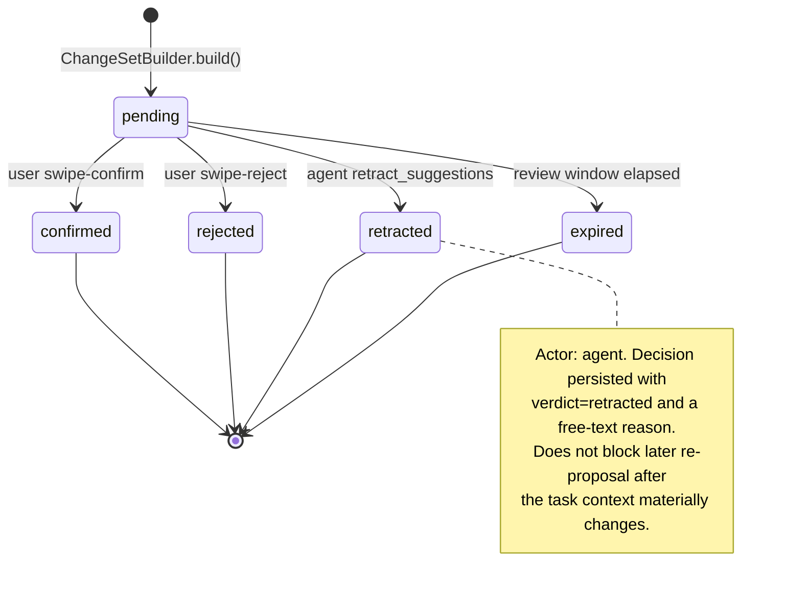
```mermaid
stateDiagram-v2
  [*] --> pending: ChangeSetBuilder.build()
  pending --> confirmed: user swipe-confirm
  pending --> rejected: user swipe-reject
  pending --> retracted: agent retract_suggestions
  pending --> expired: review window elapsed
  confirmed --> [*]
  rejected --> [*]
  retracted --> [*]
  expired --> [*]

  note right of retracted
    Actor: agent. Decision persisted with
    verdict=retracted and a free-text reason.
    Does not block later re-proposal after
    the task context materially changes.
  end note
```

`ChangeSetBuilder` co-operates with retraction by excluding both
`confirmed` and `retracted` items from its dedup basis, while keeping
`pending`, `rejected`, and `deferred` items sticky. The result: the agent
can re-propose something it previously retracted if circumstances change,
but cannot re-propose a user rejection without materially different args.

Feedback-extraction heuristics that read the `rejectionReason` slot to
detect user grievances are explicitly decoupled from the
`retractionReason` slot, so agent self-talk never pollutes the user
feedback signal.

## Project Agents

`ProjectAgentService.createProjectAgent()`:

1. enforces one project agent per project
2. validates the assigned template is a project-agent template
3. creates the agent identity and state
4. sets `slots.activeProjectId`
5. schedules the first digest for the next local 06:00
6. creates `agent_project` and `template_assignment` links
7. registers a direct project-edit subscription
8. enqueues a creation wake

Project agents do not wake on every linked task edit. Task and project-linked
activity is funneled through `ProjectActivityMonitor`, which listens to
`localUpdateStream`, resolves affected project IDs, and sets
`slots.pendingProjectActivityAt` on the corresponding project agent state.

Direct project edits are different: the service registers a direct project
notification token, so explicit project-entity edits can still wake the agent
immediately through the orchestrator.

### Wake Behavior

`ProjectAgentWorkflow.execute()`:

1. loads the agent state and resolves `activeProjectId`
2. checks whether a due scheduled wake can be skipped cheaply
3. loads the project entity
4. loads prior observation messages
5. resolves template/version and inference profile
6. builds linked-task context, including task-agent reports
7. runs the conversation with `ProjectAgentStrategy`
8. persists token usage, final thought, report, observations, deferred
   change set, and updated state

If a scheduled digest is due, a report already exists, and
`pendingProjectActivityAt` is still `null`, the workflow rolls
`scheduledWakeAt` forward and skips the model call. That is how project agents
stay digest-shaped instead of waking on every piece of project-linked traffic.

### Project Tools and Recommendations

Project agents have two immediate local tools:

- `update_project_report`
- `record_observations`

The current deferred project tools are:

- `recommend_next_steps`
- `update_project_status`
- `create_task`

Confirmed `recommend_next_steps` decisions are converted into
`ProjectRecommendationEntity` rows by `ProjectRecommendationService`. Existing
active recommendations for that project are superseded first. Recommendations
then move through `active`, `resolved`, `dismissed`, and `superseded`.

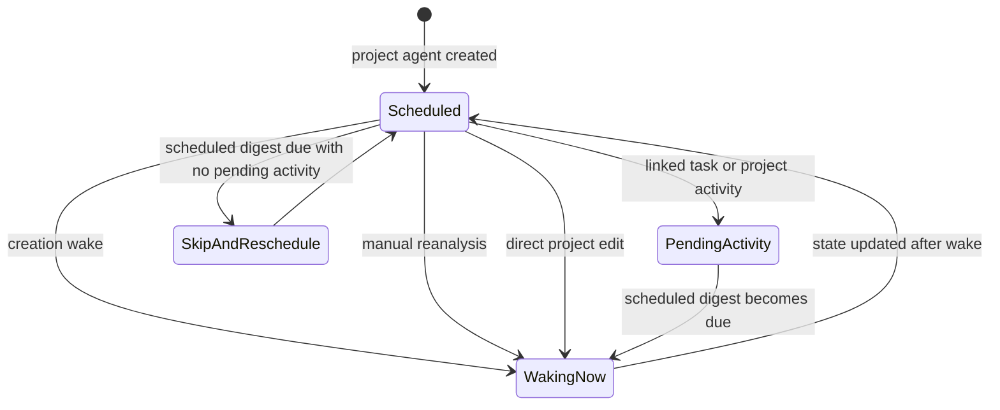
```mermaid
stateDiagram-v2
  [*] --> Scheduled: project agent created
  Scheduled --> WakingNow: creation wake
  Scheduled --> WakingNow: manual reanalysis
  Scheduled --> WakingNow: direct project edit
  Scheduled --> PendingActivity: linked task or project activity
  PendingActivity --> WakingNow: scheduled digest becomes due
  Scheduled --> SkipAndReschedule: scheduled digest due with no pending activity
  SkipAndReschedule --> Scheduled
  WakingNow --> Scheduled: state updated after wake
```

During that final transition, `pendingProjectActivityAt` is cleared only when
no newer project activity arrived during the wake. If fresh activity lands
mid-run, the newer timestamp is retained so the next digest still knows the
summary is stale again.

## Templates, Evolution, and Improvers

Templates are first-class persisted entities with a template row, version rows,
and a head pointer.

`AgentTemplateService.seedDefaults()` currently seeds five named templates:

- `Laura`
- `Tom`
- `Project Analyst`
- `Template Improver`
- `Meta Improver`

The one-on-one UI is split into two surfaces:

- `EvolutionReviewPage`: a history-first ritual home with a pending-session
  card, compact ritual summary metrics, and persisted session history
- `EvolutionChatPage`: the active negotiation loop for the current ritual

The compact summary surface is backed by `ritualSummaryMetricsProvider` and
only exposes the retained signals:

- lifetime wake count
- wakes since the last completed ritual
- token usage since the last completed ritual
- mean time to resolution
- 30-day wake activity buckets

`TemplateEvolutionWorkflow` is the multi-turn session runtime. It handles both
template evolution (skill changes) and soul evolution (personality changes):

1. gathers template context, metrics, and soul context
2. creates an `EvolutionSessionEntity`
3. starts a conversation with `EvolutionStrategy`
4. records evolution notes, structured ritual recap state, and proposal state
5. creates a new template version only after approval (`propose_directives`)
6. can also create a new soul version (`propose_soul_directives`) — this
   affects all templates sharing the soul
7. persists an `EvolutionSessionRecapEntity` from the explicit
   `publish_ritual_recap` tool payload plus the approved-change rationale,
   ratings, and transcript snapshot

Session history cards render only the persisted recap `tldr`. They do not
fall back to `feedbackSummary`.

Only one active evolution session per template is allowed at a time.

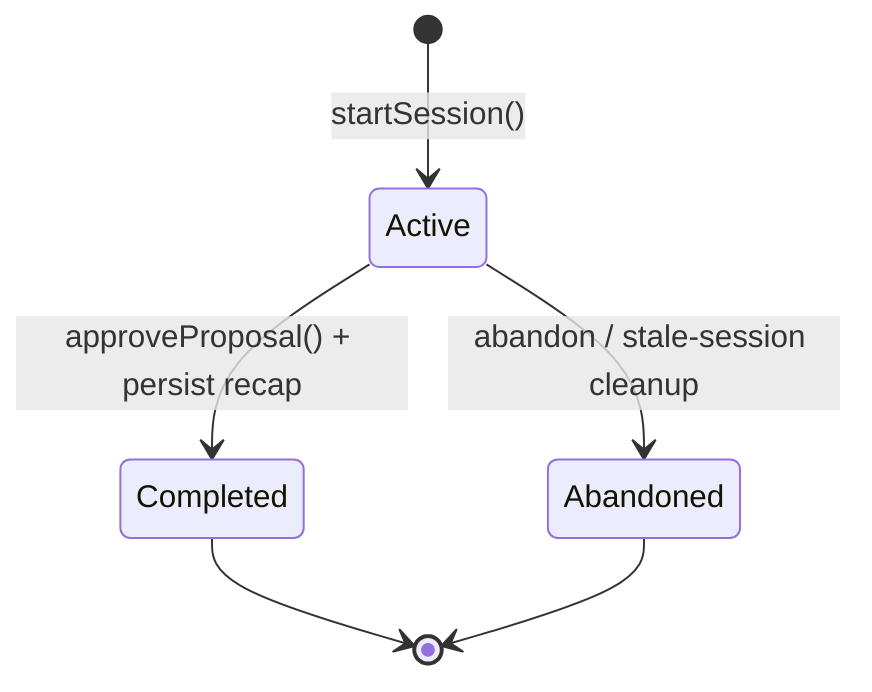
```mermaid
stateDiagram-v2
  [*] --> Active: startSession()
  Active --> Completed: approveProposal() + persist recap
  Active --> Abandoned: abandon / stale-session cleanup
  Completed --> [*]
  Abandoned --> [*]
```

Improver agents are scheduled agents whose job is to open those evolution
sessions with richer context. `ImproverAgentWorkflow`:

1. loads `activeTemplateId`
2. extracts classified feedback since the last watermark
3. skips the ritual when fewer than `3` feedback items are available
4. builds ritual context from feedback, reports, observations, versions, and
   metrics
5. starts `TemplateEvolutionWorkflow.startSession(...)`
6. updates feedback scan watermarks and schedules the next ritual

Meta-improvers reuse the same workflow. They are distinguished only by the
state slot `recursionDepth > 0`.

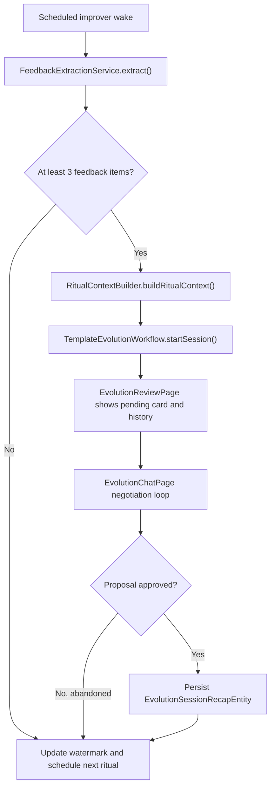
```mermaid
flowchart TD
  Wake["Scheduled improver wake"] --> Feedback["FeedbackExtractionService.extract()"]
  Feedback --> Threshold{"At least 3 feedback items?"}
  Threshold -->|No| Reschedule["Update watermark and schedule next ritual"]
  Threshold -->|Yes| Context["RitualContextBuilder.buildRitualContext()"]
  Context --> Session["TemplateEvolutionWorkflow.startSession()"]
  Session --> Home["EvolutionReviewPage shows pending card and history"]
  Home --> Chat["EvolutionChatPage negotiation loop"]
  Chat --> Approval{"Proposal approved?"}
  Approval -->|Yes| Recap["Persist EvolutionSessionRecapEntity"]
  Approval -->|No, abandoned| Reschedule
  Recap --> Reschedule
```

## Soul Documents

Soul documents decouple agent personality from template skills. A soul contains
four structured personality fields — `voiceDirective`, `toneBounds`,
`coachingStyle`, and `antiSycophancyPolicy` — that define how an agent
communicates. Templates define what an agent does (skills); souls define who it
is (personality).

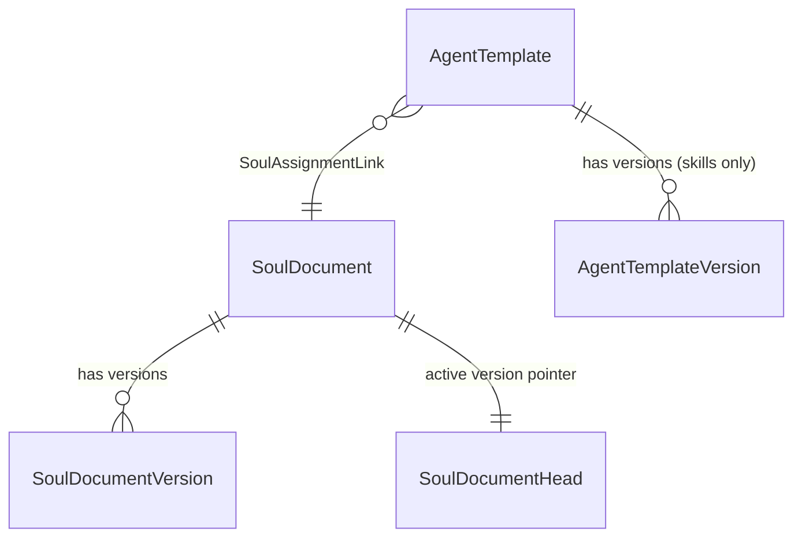
```mermaid
erDiagram
    SoulDocument ||--o{ SoulDocumentVersion : "has versions"
    SoulDocument ||--|| SoulDocumentHead : "active version pointer"
    AgentTemplate }o--|| SoulDocument : "SoulAssignmentLink"
    AgentTemplate ||--o{ AgentTemplateVersion : "has versions (skills only)"
```

Key invariant: one active soul per template. Multiple templates can share the
same soul. Instances inherit their soul through their template assignment.

`SoulDocumentService` manages the lifecycle:

- `createSoul()` → creates entity + initial version + head
- `createVersion()` → archives old versions, creates new active version
- `assignSoulToTemplate()` → creates/replaces `SoulAssignmentLink`
- `resolveActiveSoulForTemplate()` → link → head → version chain
- `getTemplatesUsingSoul()` → reverse lookup

At wake time, `TaskAgentWorkflow` and `ProjectAgentWorkflow` resolve the active
soul for the template and inject personality fields into the system prompt under
`## Your Personality`, while skills go under `## Your Operational Directives`.
Templates without a soul assignment fall back to the legacy
`## Your Personality & Directives` format.

Six seeded souls are available as a personality palette: Laura, Tom, Max, Iris,
Sage, and Kit. Laura and Tom are pre-assigned to their respective templates;
the others are available for manual assignment.

### Standalone Soul Evolution

Soul personality can be evolved in two ways:

1. **During a template ritual** — the template evolution agent can
   opportunistically propose soul changes via `propose_soul_directives`
   alongside skill changes
2. **Standalone soul session** — a dedicated 1-on-1 focused exclusively on
   personality refinement

Standalone soul sessions are started from the soul detail page via the
"Soul 1-on-1" button. The flow:

1. `TemplateEvolutionWorkflow.startSoulSession(soulId)` aggregates feedback
   from all templates sharing the soul via
   `FeedbackExtractionService.extractForSoul()`
2. `SoulEvolutionContextBuilder` builds personality-focused LLM context with
   cross-template feedback grouped by source template
3. Only `propose_soul_directives` is available (no `propose_directives`)
4. `completeSoulSession()` creates a new `SoulDocumentVersionEntity`

The UI mirrors the template evolution flow:

- `SoulEvolutionReviewPage`: history-first home with start card and session
  history
- `SoulEvolutionChatPage`: multi-turn conversation with the personality
  evolution agent
- `SoulEvolutionChatState`: Riverpod notifier managing session lifecycle

Session entities reuse `EvolutionSessionEntity` with `agentId=soulId` and
`templateId=soulId`.

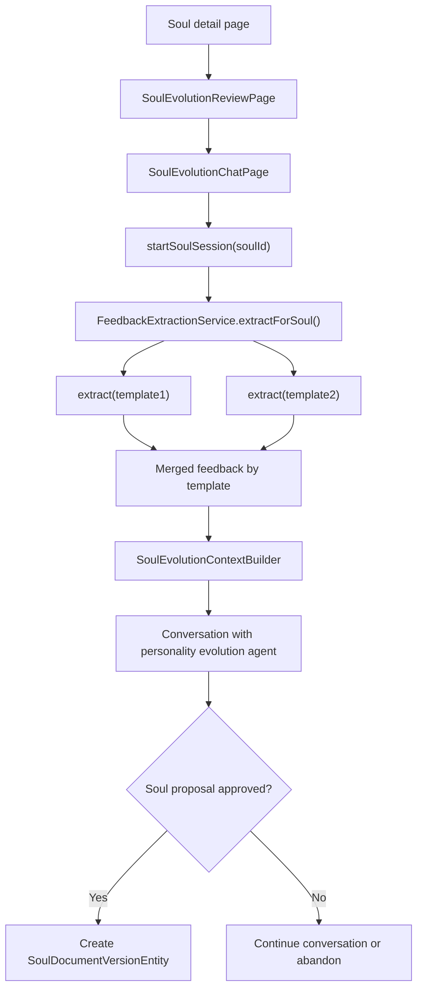
```mermaid
flowchart TD
  SoulDetail["Soul detail page"] --> Review["SoulEvolutionReviewPage"]
  Review --> Chat["SoulEvolutionChatPage"]
  Chat --> Start["startSoulSession(soulId)"]
  Start --> Feedback["FeedbackExtractionService.extractForSoul()"]
  Feedback --> T1["extract(template1)"]
  Feedback --> T2["extract(template2)"]
  T1 --> Merge["Merged feedback by template"]
  T2 --> Merge
  Merge --> Context["SoulEvolutionContextBuilder"]
  Context --> LLM["Conversation with personality evolution agent"]
  LLM --> Approve{"Soul proposal approved?"}
  Approve -->|Yes| Version["Create SoulDocumentVersionEntity"]
  Approve -->|No| Continue["Continue conversation or abandon"]
```

## Sync and Privacy

`AgentSyncService` wraps local agent writes. It stamps vector clocks and buffers
outbox messages until the outermost transaction commits. Nested transactions use
the same zone-local buffer, so rolled-back inner savepoints do not leak sync
messages for writes that never committed.

Incoming sync writes do not pass back through `AgentSyncService`; they write to
`AgentRepository` directly to avoid echo loops. Startup wiring attaches the
sync event processor when the app has one registered.

The wake workflows resolve an inference profile at run time. That means the
same template can be routed through different providers without changing the
agent persistence model. The core wake flows in this feature are text-prompt
flows: task, project, and improver wakes build text context and send it through
the resolved provider.

Local-only data includes:

- `wake_run_log` rows and other runtime bookkeeping that is not modeled as a
  sync entity

Synced agent data includes:

- agent identities and state
- reports, observations, change sets, decisions, recommendations, and token
  usage entities
- template versions and evolution sessions

Provider-facing data includes only:

- the prompt payload assembled for that specific wake

For provider selection and residency details, see [../ai/README.md](../ai/README.md).

## Planned Improvements

One planned improvement is activating message-memory compaction on top of
the summary scaffolding that already exists in the model.

Current state:

- summary message fields exist, but the production wake flows do not compact
  message spans yet

Why that is still on the roadmap:

- it would let long-lived agents retain distilled conversation history instead
  of depending only on raw message logs, reports, and observations
- it would make the existing summary-related entity fields earn their keep
- it would give the runtime a cleaner long-horizon memory path for persistent
  agents

This is not implemented today. The current runtime still resolves behavior from
the existing template and version directive fields, and message history is not
yet compacted into summary messages.

## Code Reading Guide

For the implementation path with the best signal-to-noise ratio, read these in
order:

1. `state/agent_providers.dart`
2. `wake/wake_orchestrator.dart`
3. `wake/wake_queue.dart`
4. `wake/wake_runner.dart`
5. `workflow/task_agent_workflow.dart`
6. `workflow/task_agent_strategy.dart`
7. `service/change_set_confirmation_service.dart`
8. `workflow/project_agent_workflow.dart`
9. `workflow/template_evolution_workflow.dart`
10. `workflow/improver_agent_workflow.dart`
11. `sync/agent_sync_service.dart`

If you need the inference stack that these workflows call into, continue with
[../ai/README.md](../ai/README.md).
