# Agents Feature

The agents feature owns Lotti's persisted agent runtime. It does not implement
model inference itself. Instead, it combines the `ai` feature's conversation
and profile infrastructure with agent-specific state, wake scheduling, sync,
and human review gates.

At runtime, the journal database remains the source of truth for tasks,
projects, checklist items, labels, and time entries. The agents database stores
agent state and outputs: reports, observations, change proposals, evolution
sessions, token usage, and wake history.

## Runtime Boundary

The feature is initialized by `agentInitializationProvider`.

Startup does this:

1. marks stale `running` wake runs as `abandoned`
2. wires `WakeOrchestrator.wakeExecutor` to the correct workflow for each
   agent kind
3. starts `WakeOrchestrator` on `UpdateNotifications.localUpdateStream`
4. starts `ScheduledWakeManager`, which polls hourly for both due
   `scheduledWakeAt` state values and due `ScheduledWakeEntity` records (the
   Daily OS planner's day-scoped pre-warms, ADR 0022)
5. starts `ProjectActivityMonitor`
6. seeds default agent templates
7. seeds default inference profiles, then seeds default soul documents and
   their template assignments, then backfills skill assignments onto older
   default profiles. Skills themselves are not seeded — they live as code in
   the built-in skill registry (`lib/features/ai/skills/built_in_skills.dart`)
8. restores persisted task-agent, day-agent, and project-agent subscriptions,
   and persisted deferred wake jobs
9. wires the sync event processor if one is registered in `GetIt`

- Task agent wake prompts include:
  - current task JSON context
  - current report + recent observations
  - parent project context with the latest project-agent `oneLiner` and `tldr`
    (the full report body is omitted to keep wake prefill small) when the task
    belongs to a project
  - linked task context
  - these blocks are ordered stable-first — label/correction context,
    parent-project and linked-task summaries, then current task context —
    followed by the volatile tail (current report, agent journal, proposal
    ledger, trigger tokens), so the stable header stays byte-identical across
    wakes and a prompt prefix cache can restore it instead of re-prefilling
- Task agents *define* a read-only `get_related_task_details` tool for
  on-demand drill-down into a sibling task in the same parent project, but it
  is **currently disabled** (`enabled: false` in `task_agent_tool_definitions`,
  the only such tool). `_buildToolDefinitions` filters out disabled tools, so it
  is never advertised to the model, and `allowedRelatedTaskIds` is never wired
  (it defaults to the empty set), so even a hallucinated call is rejected. No
  related-task directory section is injected into the wake prompt today, so the
  drill-down has no source to draw from. When enabled it would be scoped to the
  wake's allowlist and same parent project (enforced by
  `AiInputRepository.buildRelatedTaskDetailsJson`) and could not browse
  arbitrary tasks. Re-enabling it (which requires building the directory section
  and wiring the allowlist) or removing it is a deliberate follow-up.
- Task-agent wakes pass the resolved profile's
  `thinkingModel?.geminiThinkingMode` (a `GeminiThinkingMode?`) into
  `CloudInferenceWrapper`. Thinking level is profile-driven; there is no
  Gemini-Flash-specific override or hard-coded budget in this feature. The
  `GeminiThinkingMode` → numeric/`thinkingLevel` mapping lives in
  `GeminiThinkingConfig` in the `ai` feature.
- Linked task context for agents is built directly in
  `TaskAgentWorkflow._buildLinkedTasksContextJson` (forked from
  `AiInputRepository.buildLinkedTasksJson` for the wake path), and injects a
  compact summary (`latestTaskAgentReportOneLiner` / `latestTaskAgentReportTldr`)
  of each linked task's associated task-agent report (via `agent_task` links +
  `agentReportHead`) — not the full report body, to keep wake prefill small.
- Linked-task `latestSummary` payloads are stripped before prompt submission
  and are not used for Task Agent execution.
- Related-task directory rows are built in `AiInputRepository` from the
  current task's parent project, sorted by latest task metadata updates,
  enriched with batched time-spent totals from `JournalDb.getBulkLinkedEntities`,
  and filtered to siblings that have a real stored task-agent `tldr`.
- MTTR chart inputs resolve linked tasks with de-duplicated task fetches to
  avoid repeated journal lookups for shared task links.

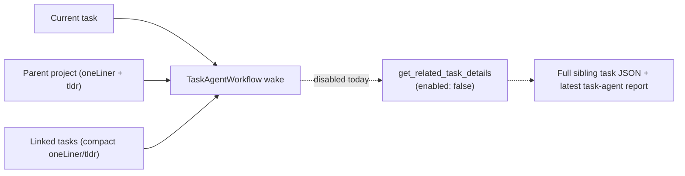
```mermaid
flowchart LR
  Task["Current task"] --> Wake["TaskAgentWorkflow wake"]
  Project["Parent project (oneLiner + tldr)"] --> Wake
  Linked["Linked tasks (compact oneLiner/tldr)"] --> Wake
  Wake -.->|disabled today| Drill["get_related_task_details<br/>(enabled: false)"]
  Drill -.-> FullSibling["Full sibling task JSON + latest task-agent report"]
```

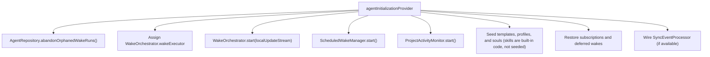
```mermaid
flowchart TD
  Init["agentInitializationProvider"]

  Init --> Abandon["AgentRepository.abandonOrphanedWakeRuns()"]
  Init --> Wire["Assign WakeOrchestrator.wakeExecutor"]
  Init --> Start["WakeOrchestrator.start(localUpdateStream)"]
  Init --> Sched["ScheduledWakeManager.start()"]
  Init --> Activity["ProjectActivityMonitor.start()"]
  Init --> Seed["Seed templates, profiles, and souls (skills are built-in code, not seeded)"]
  Init --> Restore["Restore subscriptions and deferred wakes"]
  Init --> Sync["Wire SyncEventProcessor (if available)"]
```

## Settings Surfaces

`Settings > Agents` is the operator-facing entry point for the feature. The
landing page now exposes five runtime views (`Stats` is the default landing
tab):

- `Stats`: token usage and recent activity
- `Templates`: reusable agent definitions and version heads
- `Instances`: persisted agent identities and evolution sessions
- `Souls`: pluggable personality documents with version history and template
  assignments
- `Pending Wakes`: live wake timers derived from persisted `AgentStateEntity`
  records

The pending-wakes dashboard is intentionally narrower than the full message
log. It shows only wake records that can still fire later:

- `nextWakeAt`: the per-device deferred subscription wake deadline persisted by
  `WakeOrchestrator`
- `scheduledWakeAt`: the scheduled wake used by project agents and template
  improvers
- pending `ScheduledWakeEntity` records (`getPendingScheduledWakeRecords`): the
  Daily OS planner's day pre-warms, which live as their own workspace-scoped
  records rather than on the single `AgentState.scheduledWakeAt` (ADR 0022 — a
  long-lived planner has several outstanding day wakes at once). Their subject
  is the day id, derived from the record's `day:<dayId>` `workspaceKey`.

All three scheduling fields (`nextWakeAt`, `sleepUntil`, `scheduledWakeAt`) are
**device-local** (PR 4 B4): each device schedules its own wakes, so the sync
apply path preserves the local row's scheduling rather than letting a peer's
`AgentStateEntity` overwrite it (`_preserveLocalScheduling`).

Each pending-wake card owns its own one-second countdown timer and recomputes
the remaining time from `clock.now()` on every tick, so the page does not need
to rebuild the whole list every second and the timer does not drift if frames
arrive late. Deleting a card clears only the represented wake marker:
`nextWakeAt` uses the shared pending-wake cancellation path, while
`scheduledWakeAt` is removed from the agent state.

On startup, task-agent and project-agent subscription restoration turns a
persisted `nextWakeAt` back into an in-memory `WakeJob`. Future deadlines
re-arm the deferred drain timer; overdue deadlines enqueue immediately and
clear the persisted marker. A completed subscription wake only writes a new
`nextWakeAt` when follow-up work is still queued, so the Wake Cycles surfaces
show pending work rather than a cooldown with nothing left to run.

The instances dashboard stays intentionally lightweight. It drives the shared
`AgentListingShell` with kind and lifecycle/status filter axes. The toolbar
shows a single result count (`agentInstancesResultCountAll`, or
`agentInstancesResultCountFiltered` once a filter narrows the list), and
grouping by status emits a per-group active-count badge. There is no aggregate
total/active/dormant/destroyed breakdown line.

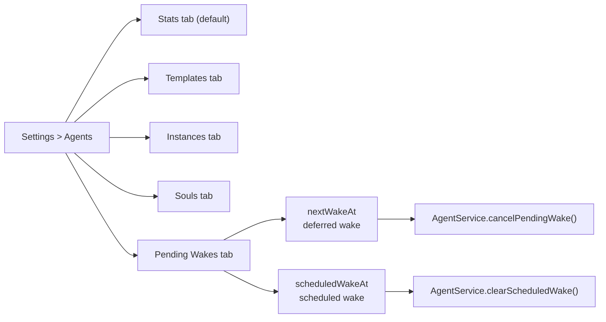
```mermaid
flowchart LR
  Settings["Settings > Agents"] --> Stats["Stats tab (default)"]
  Settings --> Templates["Templates tab"]
  Settings --> Instances["Instances tab"]
  Settings --> Souls["Souls tab"]
  Settings --> Pending["Pending Wakes tab"]

  Pending --> Throttle["nextWakeAt<br/>deferred wake"]
  Pending --> Schedule["scheduledWakeAt<br/>scheduled wake"]

  Throttle --> CancelPending["AgentService.cancelPendingWake()"]
  Schedule --> ClearScheduled["AgentService.clearScheduledWake()"]
```

Templates and Souls are the only tabs that currently expose create FABs. Those
buttons are now wrapped with the shared bottom-navigation clearance so they do
not sink behind the floating app-shell nav on narrow layouts.

### Inline sidebar Wake Queue

`SidebarWakeQueue` (`lib/features/agents/ui/sidebar_wake_queue.dart`) is a
compact ambient surface that lives in the desktop sidebar's `aboveSettings`
slot. It watches the same `pendingWakeRecordsProvider` as the full Pending
Wakes page, surfacing running wakes plus the next three scheduled wakes within
the one-hour sidebar lookahead so the queue is visible
without leaving whatever tab the operator is on:

- a `WAKES N` mono header with the visible count and an open-in-new icon,
- one row per currently running wake with the linked task/project title and
  live elapsed time,
- up to three compact scheduled rows with the linked task/project title and a
  per-row ETA (`now` once due, `m:ss` inside the one-hour lookahead,
  switching to the warning colour inside the last five minutes),
- the header link switches to the Settings tab and beams to
  `/settings/agents/pending-wakes` for the full list.

Rows are driven by the page-scoped `wakeCountdownTickerProvider`, so the
sidebar shares a one-second ticker instead of spawning a timer per row. Wakes
outside the one-hour lookahead stay out of the inline sidebar and remain
visible on the full Wake Cycles page. The collapsed (icon-only) sidebar
suppresses the slot because the header and rows would not fit the narrow
column.

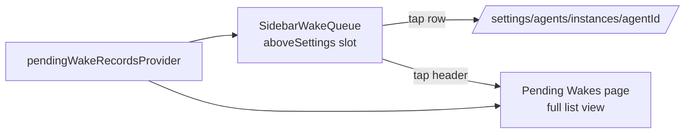
```mermaid
flowchart LR
  Provider[pendingWakeRecordsProvider]
  Provider --> WakeBlock[SidebarWakeQueue<br/>aboveSettings slot]
  Provider --> WakesPage[Pending Wakes page<br/>full list view]
  WakeBlock -->|tap row| InstanceRoute[/settings/agents/instances/agentId/]
  WakeBlock -->|tap header| WakesPage
```

## Persistence Model

Agent persistence lives in `agent.sqlite` via Drift
([agent_database.dart](./database/agent_database.dart)). The syncable domain
objects are modeled as `AgentDomainEntity` variants and `AgentLink` variants.
Wake-run history lives in the dedicated `wake_run_log` table.

Persisted agent-side entities include:

- `AgentIdentityEntity` and `AgentStateEntity`
- `AgentMessageEntity` and `AgentMessagePayloadEntity`
- `AgentReportEntity` and `AgentReportHeadEntity`
- `AgentTemplateEntity`, `AgentTemplateVersionEntity`, and
  `AgentTemplateHeadEntity`
- `EvolutionSessionEntity`, `EvolutionSessionRecapEntity`, and
  `EvolutionNoteEntity`
- `SoulDocumentEntity`, `SoulDocumentVersionEntity`, and
  `SoulDocumentHeadEntity`
- `ChangeSetEntity` and `ChangeDecisionEntity`
- `ProjectRecommendationEntity`
- `AttentionRequestEntity`, `AttentionClaimDispositionEntity`, and
  `AttentionAwardEntity`
- `StandingAgreementEntity`
- `WakeTokenUsageEntity`
- `ScheduledWakeEntity` — a day-scoped persisted scheduled wake for the Daily OS
  planner (ADR 0022). Carries `workspaceKey` + `triggerTokens` and a
  `pending | consumed` status, so several outstanding day pre-warms survive a
  restart with full day context instead of sharing one clobberable
  `AgentState.scheduledWakeAt`.
- `PlannerKnowledgeEntity` — the Daily OS planner's durable knowledge ("memorize
  what I tell you", ADR 0022). Compaction-exempt; the active Head set is a pure
  recency-wins projection over the entries (no separate Head entity). Carries
  optional immutable author-time `tags` (set once at origin, surfaced as chips
  in the "What I've learned" panel).

Persisted links include:

- `agent_state`
- `agent_task`
- `agent_project`
- `agent_day` (**legacy** — the old per-day day-agent identity → its day,
  back-linking `slots.activeDayId`. ADR 0022's single long-lived planner pins no
  `activeDayId` slot and writes no new `agent_day` links; the link type and
  projection remain only to read pre-migration data.)
- `template_assignment`
- `improver_target`
- `soul_assignment`

The journal database is read on demand during wakes. The agents feature does
not mirror full task or project state into `agent.sqlite`; it persists the
agent's own interpretation and review state.

Bulk agent repository lookups keep SQLite's host-variable cap in mind.
`getEntitiesByIds`, `getLatestReportsByAgentIds`, and `getLinksToMultiple`
deduplicate inputs and split large `IN (...)` lists into 900-id chunks. This
keeps linked-task/report context collection on the indexed batch path even when
sync or wake preparation considers thousands of task, agent, or report ids.
The latest-per-agent batch reads are backed by active-row indexes that include
the `(created_at DESC, id DESC)` ranking order for both type-only and
type-plus-subtype lookups, so the window-function query does not need a temp
sort for the final order term.

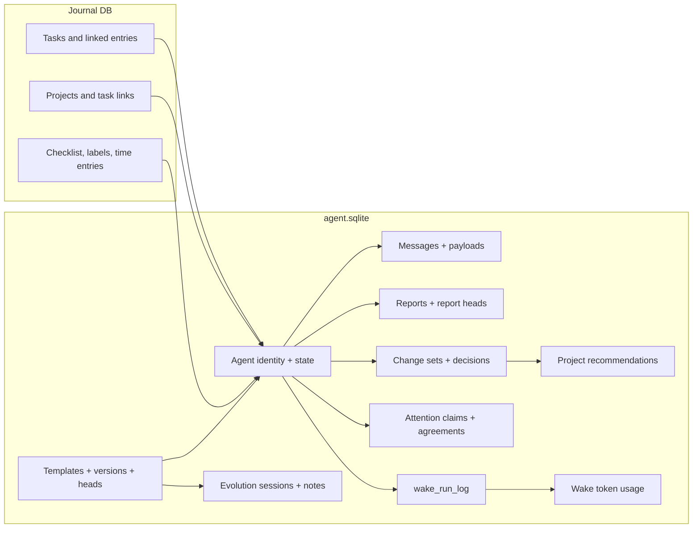
```mermaid
flowchart LR
  subgraph Journal["Journal DB"]
    Task["Tasks and linked entries"]
    Project["Projects and task links"]
    Meta["Checklist, labels, time entries"]
  end

  subgraph AgentDB["agent.sqlite"]
    Agent["Agent identity + state"]
    Msg["Messages + payloads"]
    Report["Reports + report heads"]
    Change["Change sets + decisions"]
    Attention["Attention claims + agreements"]
    Template["Templates + versions + heads"]
    Evo["Evolution sessions + notes"]
    Reco["Project recommendations"]
    Usage["Wake token usage"]
    Wake["wake_run_log"]
  end

  Task --> Agent
  Project --> Agent
  Meta --> Agent
  Agent --> Msg
  Agent --> Report
  Agent --> Change
  Agent --> Attention
  Agent --> Wake
  Template --> Agent
  Template --> Evo
  Change --> Reco
  Wake --> Usage
```

## Memory Model

The feature does not have a hidden memory blob. Memory is split across durable
agent-side records, live journal context, and a small amount of wake-time
derived context.

### Durable memory in `agent.sqlite`

The persisted memory surface includes:

- identity and lifecycle in `AgentIdentityEntity`
- runtime state in `AgentStateEntity`
- slots such as `activeTaskId`, `activeProjectId`, `activeTemplateId`,
  `lastFeedbackScanAt`, `lastOneOnOneAt`, `pendingProjectActivityAt`, and
  scheduling/throttle markers
- the immutable message log: user messages, thoughts, tool actions, and tool
  results
- structured observations, stored as observation messages plus payloads
- reports and report-head pointers
- change sets, decisions, and project recommendations
- attention requests, claim dispositions, awards, and standing agreements used
  by day-planning reads
- template versions, evolution sessions, persisted ritual recaps, and
  evolution notes
- wake token usage and wake-run history

### Live context pulled from the journal domain

The workflows still rebuild fresh operational context on each wake from the
journal-side repositories. Depending on the agent kind, that includes:

- current task or project data
- linked tasks and linked entries
- checklist state
- labels
- time-entry information
- project-to-task relationships

### Retrieval memory

Task-agent reports can also become retrieval memory. When both optional
embedding dependencies are available, `TaskAgentWorkflow` embeds newly
persisted reports after the wake commits so later semantic retrieval can use
the report text.

### Memory compaction & input capture (ADR 0020 + ADR 0017)

The agent's **inputs** are captured into the append-only log so the wake context
becomes a projection of the log rather than a live read of the mutable journal
(ADR 0020), and that log is compacted by **summary checkpoints** over a log
prefix (ADR 0017). The full pipeline — capture, event-log read, LLM-distilled
folds, and compacted prompt assembly — is the active task/project/day agent
read path. When a wake cannot refresh or assemble a trustworthy compacted log,
the workflow falls back to the inline journal prompt for that wake.

**Scope.** The substrate covers task agents (captured journal entries +
observations + proposal verdicts), project agents (captured project-linked
journal entries + observations), and day agents (submitted capture
transcripts + observations, both projected as inline events from
already-synced entities — no payload capture step). Day capture transcripts
are projected as **deferred** inline events (`InputEvent.inlineDeferred`):
position + id are eager — enough to order the log and run the checkpoint
completeness check, which keys on id, not content — while the transcript is
resolved on demand (`AgentLogCompactor.resolveInlineContent`) for only the
post-cutoff tail the wake renders. The single long-lived planner accumulates
captures across every day it plans, so loading every transcript each wake
would be O(all captures ever); instead the workflow loads just the lightweight
metadata (`AgentRepository.getCaptureEventMetaByAgentId` — id + the two
ordering timestamps, no transcript) and the compactor pulls full text only for
the handful of uncovered-tail captures. Folded captures live in the summary
prose and are never reloaded. The **improver** agent is
deliberately out: its wake context is a per-ritual *windowed* snapshot
(feedback since the last scan watermark, instance reports, version history) —
there is no unbounded per-agent input stream to fold, and capturing it would
duplicate other agents' synced data. All workflows share one pipeline,
`AgentWakeMemory` (capture → fold → assemble → read-flip gates), so the failure
isolation and diagnostics are identical everywhere.

**Capture (always on).** Each task wake snapshots the user-content
sources it read — one per linked journal log entry, the rendered text only (an
audio entry contributes its transcript, never the raw audio) — via
`AgentInputCaptureService.captureWakeInputs`:

- `renderTaskSources` turns the task's linked entries into `RenderedSource`s
  (mirrors `AiInputRepository.generate`, keeping each entry id as provenance);
- `reconcileCapture` diffs them against the agent's active **input frontier**
  and appends only the delta;
- each new/changed source becomes a content-addressed `AgentMessagePayloadEntity`
  (id = `ContentDigest.of(content)`, so identical content dedupes across wakes
  *and* agents) plus a `messagePayload` link (`fromId = agentId`) carrying
  provenance (`contentEntryId`) and canonical ordering (`sourceCreatedAt`).
  Many links may point at one shared payload — two sources rendering identical
  bytes, or one source edited back to earlier content — so `agent_links`'
  natural-key uniqueness on `(from_id, to_id, type)` deliberately exempts
  `message_payload` (partial unique index, schema v11);
- a source that vanished is **soft-retracted** by a `system` message tagged
  `metadata.retractsContentEntryId` — the snapshot stays auditable, but the
  active frontier excludes it (a later capture re-adds it).

`projectInputFrontier` folds those links + retractions to the latest,
non-retracted content per source — the **write-side** view `reconcileCapture`
diffs against. The **read side** uses `projectInputEvents` instead: the same
links/retractions (plus the agent's `observation` messages) as an ordered
**event stream**, never folded into per-source state.

**The read model is an append-only event log.** Every capture link is one
event at position `(captureTime, sourceCreatedAt, key)` — a strict total order
over synced metadata, so all devices agree (`sourceCreatedAt` orders a
same-instant batch chronologically instead of by random ids). The rendered
`## Task Log` tail is `visibleTailEvents`: events after the active
checkpoint's cutoff, one line each, **rendered once and frozen forever**.
Every compacted line carries provenance as `id: <sourceId>` so later context
can refer back to the exact source:

- an **edit** appends a new `(id: e1, text, edited)` line at the end — the
  original line never changes (a ticking running-timer duration is excluded
  from capture until final for the same reason);
- the agent's own **observations** interleave as `(id: obs-1, observation)`
  lines —
  single memory substrate, same ordering, same folds (the separate
  `## Agent Journal` section is only present on inline fallback prompts);
- resolved **proposal verdicts** interleave as `(id: cs-1:0, decision)` lines
  (inline events via `decisionEventsFromLedger` — no payload row; their
  content derives from the synced ChangeSet/ChangeDecision entities),
  positioned at resolution time so the narrative reads *user said X → agent
  proposed Y → user rejected it*. The `## Proposal Ledger` section then
  carries only the OPEN proposals (current state: fingerprints for
  `retract_suggestions`, same-wake dedup). Inline fallback prompts still use
  the full legacy ledger shape because they do not have a trusted event-log
  replacement;
- a **retraction** appends `(id: e1, retraction) no longer appears in the
  current task context`. It documents the current absence without stripping
  earlier captured reality or invalidating summaries; a later capture can
  re-add the source as another event.

**Compaction folds a log prefix.** `summary` checkpoint events cover
everything up to a **cutoff position** (persisted as `coverageCutoff` in the
checkpoint payload), not a state snapshot:

- `selectActiveSummary` picks the valid checkpoint with the greatest cutoff.
  A checkpoint dies only when it is **incomplete against the current log**:
  sync can deliver an event positioned *before* an existing cutoff (a
  concurrent capture/observation/verdict/retraction from another device),
  which would otherwise be in neither the prose nor the post-cutoff tail —
  the checkpoint is discarded, the tail re-expands, and the same wake's fold
  re-covers everything including the late arrival. Completeness is checked by
  event id, so a late-arriving *superseded* version of a covered source does
  not invalidate. Edits and retractions after the cutoff just append tail
  events that supersede or qualify the stale prose, keeping the prompt prefix
  byte-stable;
- `planCompaction` decides, against a token budget, which oldest event prefix
  to fold so the most-recent suffix fits;
- `AgentLogLlmSummarizer` (the LLM edge) distills the folded events into
  rolling summary prose with a one-shot generation call, using the **wake's
  resolved model/provider** — the agent summarizes its own memory with the
  brain it thinks with. Oversized fold sets are distilled in chronological
  chunks, rolling the summary through each call; an empty model response
  throws (caught as "no compaction this wake") rather than persisting an empty
  checkpoint that would erase folded memory.

**Cadence (hysteresis) & prefix caching.** `maybeCompact` uses two watermarks:
the *trigger* (`compactionTailBudgetTokens`, default 50000) — no summarization
while the uncovered tail fits it — and the *retain* mark
(`compactionTailRetainTokens`, default 20000) — once triggered, the fold goes
deep, keeping only that much recent verbatim content. So the summarizer runs
roughly once per `trigger − retain` (~30k) tokens of *new* activity (most
tasks never reach the trigger at all), and between folds every wake is a pure
read. The trigger is sized generously because the append-only tail is
prefix-cached: warm wakes pay cache-read rates (local inference with a
persistent KV cache: ~nothing) for the history; the costs that remain are the
cold prefill on a session's first wake and attention quality on very long raw
logs — which is why folding exists at all. Small-context/local deployments
can pass tighter values through the workflow constructor.
Compaction is never destructive: every entry stays in the journal and in the
content-addressed captured payloads — only the *prompt* sees the summary.

**The prompt invariant** (machine-checked by the append-only property tests in
`input_events_test.dart` and the end-to-end prefix tests in the compactor and
workflow tests): between folds, two consecutive wake prompts are byte-identical
up to the end of the `## Task Log` block except for appended lines. Ordering
is strictly by volatility: system prompt and rare-change context blocks, then
the summary (changes once per fold), then the append-only event tail — and
only *below* that the volatile tail: the compact markdown task **state**
(`buildTaskStateMarkdown` — title/status/time/labels/checklist with item ids;
its time fields tick on every working wake, which is why it must sit after the
log), timer, ledger, trigger tokens. One flipped byte upstream voids the
provider prefix cache for every byte after it.

**The report is a projection, not memory.** The prior report's prose is never
injected into the prompt (re-reading its own stale conclusions creates a
feedback loop), and `update_report` is conditional: the agent publishes only
when the report would materially change (the first report is still forced via
a retry). A wake with nothing report-worthy ends with a plain-text note.

**Prompt persistence stores only what isn't derivable (v2 prompt records).**
A compacted wake no longer persists its full rendered prompt: the embedded
log block is a pure function of the synced event log, so the payload stores
just the non-derivable halves (the live-state head and volatile tail) plus a
reconstruction marker — the active checkpoint's summary id and the position
of the last rendered tail event (`prompt_record.dart`). The conversation
view's expandable User row rebuilds the full prompt on demand via
`WakePromptReconstructor` → `AgentLogCompactor.assembleContextAsOf`: the
pinned checkpoint (even if since invalidated — the wake really rendered its
prose) plus the visible events up to the boundary, with inline events
(verdicts, day captures) re-derived from their synced entities. Retractions
are append-only, not suppressing: a retraction past the boundary never reaches
back into the reconstruction, and one inside it renders as its own marker line
beside the content it concerns — the past render stays faithful rather than
retroactively redacted; a late-synced event inside the boundary makes the
reconstruction reflect the CONVERGED log — semantically auditable rather
than forensically byte-exact. The day agent splices its log back as the
JSON `"dayLog"` line (`json-day-log-line` wrap). Inline fallback wakes keep
full blobs because their prompts are live journal renders with nothing to
re-derive.

The dormant model fields now earn their keep: `AgentMessageKind.summary`,
`summaryStartMessageId`/`summaryEndMessageId`/`summaryDepth`,
`AgentStateEntity.recentHeadMessageId`/`latestSummaryMessageId`.

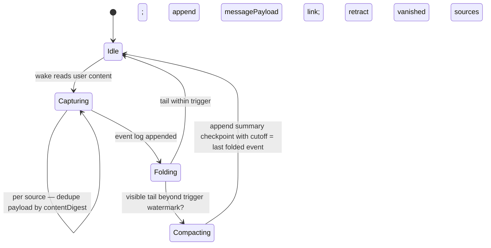
```mermaid
stateDiagram-v2
  [*] --> Idle
  Idle --> Capturing: wake reads user content
  Capturing --> Capturing: per source — dedupe payload by contentDigest; append messagePayload link; retract vanished sources
  Capturing --> Folding: event log appended
  Folding --> Compacting: visible tail beyond trigger watermark?
  Compacting --> Idle: append summary checkpoint with cutoff = last folded event
  Folding --> Idle: tail within trigger
```

**Always-on read path.** Each task/project/day wake (after capture and profile
resolution) runs `AgentLogCompactor.maybeCompact` — folding the oldest event
prefix past the trigger watermark into a `summary` checkpoint via
`AgentLogLlmSummarizer` — and assembles the log as
`AgentLogCompactor.assembleContext` (`active summary + append-only event
tail`). Task-agent prompts replace the full JSON header with the compact
markdown task state (`buildTaskStateMarkdown`) placed in the volatile tail
below the log. Project and day agents attach the same compacted event-log block
to their own prompt shape. The UI renders `summary` messages when they exist.

### State-as-projection: the log is the source of truth (PR 4)

`AgentStateEntity` is a **reconciled cache**, not the authority — the append-only
log (messages + links) is. The convergence-critical, log-backed fields are
event-sourced and folded back over the cache:

- **Watermarks** — every place a wake advances a timestamp watermark also emits a
  `system` message tagged with `AgentMessageMetadata.milestone` (an `AgentMilestone`)
  via `AgentSyncService.appendMilestone(...)`. The watermark derives as the
  `max(createdAt)` of messages carrying that milestone.
- **Active slots** — `activeTask/Project/Day/TemplateId` derive from the agent's
  association links (`agent_task`/`agent_project`/`agent_day`/`improver_target`).

| Watermark | Milestone | Emitted by |
| --- | --- | --- |
| `lastWakeAt` | `wakeCompleted` | task / day / project wakes, incl. the project dormant-skip path |
| `slots.lastDailyWakeAt` | `dailyWakeCompleted` | project wake when the scheduled daily digest was due |
| `slots.lastFeedbackScanAt` | `feedbackScanCompleted` | improver workflow (skip and ritual-started paths) |
| `slots.lastOneOnOneAt` | `oneOnOneCompleted` | `ImproverAgentService.scheduleNextRitual` |
| `slots.lastWeeklyReviewAt` | `weeklyReviewCompleted` | *no emit site yet — the weekly-review feature is unimplemented* |

**Reads are flipped (B6).** Each wake starts by reading
`AgentSyncService.reconciledAgentState(agentId)`, which folds the log's watermarks +
slots over the cached row (`reconcileAgentState`) and self-heals any value the cache
lost to last-writer-wins under a partition — so two devices can't miss or
double-count a ritual. The reconcile is migration-safe: watermarks take
`max(derived, cache)` and slots take `derived ?? cache`, so a value the cache holds
but the log lacks yet (an agent predating the markers/links) is never nulled. It
persists only when something diverged (no churn on the common path). UI/service reads
stay on the raw cache (`AgentRepository.getAgentState`) — eventual and self-healing.
The dual-written counters are convergent G-counters (PR 2b); `awaitingContent` and the
device-local scheduling fields are still cache-only (no backing log event yet). The
milestone markers also show up as `System` rows in the `AgentInternalsBody`
activity log.

### Fork healing: join-by-continuation (PR 6 / ADR 0018 rule 8)

When two devices wake the same agent off a shared head, each appends its own
`messagePrev` child of that head — a **fork**: the DAG now has ≥2 heads. This is
**legal, not corruption**. The projection (`project(canonicalOrder(...))`) is
multi-head tolerant: it returns every tip in `headIds` and context assembly reads
across all of them, so every device converges with or without any coordination.
The cost of an *unhealed* fork is only that the on-device prefix never re-warms
(each branch is a distinct prefix) and context fans out across a widening head set.

**Fork healing** collapses the fork: at wake start, `ForkHealer.maybeHealFork`
folds the agent's full log (`getAgentMessages` + the `messagePrev` edges fetched by
`getLinksFromMultiple(messageIds, type: message_prev)`), and `planJoin` emits a
**join-by-continuation** node when there are ≥2 heads over a *complete* view (no
dangling parents, and no pending join head whose edges are still syncing).
`AgentSyncService.appendJoin` then writes a canonical `system` message that links
(`messagePrev`) to **every** head and advances `recentHeadMessageId` to it — so
the DAG re-converges to one tip and the prefix re-warms.

- **Content-addressed, deterministic.** The join id is
  `computeJoinId(headIds) = ContentDigest.of({'_tag':'join-v1','parents':sortedHeads})`
  and each edge id is `msgprev-${joinId}-${parentId}`. Two devices healing the
  *same* fork mint the same structural row (`threadId == joinId`, empty metadata)
  and edge set, so the log set-unions their concurrent emissions into **one**
  node — no join storm. The join carries no payload and no wall-clock/host/clock
  in its content-addressed identity; the per-device sync envelope (`createdAt`,
  vector clock) is **not yet canonicalized** — reconciliation is deferred because
  it is inert for the projection today, which orders by `(hostId, id)` with
  `hostId = ''` and never re-resolves an immutable join. It becomes load-bearing
  only if `hostIdOf` is ever populated (see the plan's open decisions).
- **Eager at wake start, no cross-wake state.** A fork seen at wake start was
  created by a *prior* cycle (this wake has appended nothing yet), so healing it is
  faithful to ADR 0018's "≥2 heads survive past one wake cycle." Forks never
  self-resolve, so there is nothing to wait out beyond a partially-synced view (a
  node arrived before its parent edge, or a peer's join node arrived before all
  join edges) — which the complete-view and pending-join gates cover. The decision
  is a pure function of the current projection; no marker is persisted.
- **Wiring.** The four wake workflows share no base class but all dispatch through
  the `WakeOrchestrator`, which fires one optional `onWakeStart` hook just before
  the executor (covering every agent kind in one seam). Healing is best-effort and
  non-fatal: a corrupt synced log (cycle / duplicate id) or a slow load is caught
  or timed out (`wakeStartHookTimeout`), and the wake proceeds regardless — healing
  is an optimization, never a correctness mechanism.
- **Flag-gated off.** The hook is always wired but consults the default-off
  `enable_fork_healing` config flag (Settings → Flags → "Agent fork healing")
  **per invocation** — the orchestrator captures the hook at initialization, so
  the flag is read inside it at each wake and a Settings toggle applies on the
  next wake without a restart. Off → the hook returns immediately and wakes are
  byte-identical to before.

```mermaid
stateDiagram-v2
  [*] --> SingleHead
  SingleHead --> Forked: two devices append off the same head (concurrent messagePrev children)
  Forked --> Forked: local view still settling (dangling parent or pending join edges) — defer
  Forked --> Joining: a wake starts and observes ≥2 heads over a complete view
  Joining --> SingleHead: appendJoin (messagePrev → all heads); recentHeadMessageId := joinId; prefix re-warms
  Joining --> SingleHead: peer emitted the same joinId concurrently → set-union merges to one node
```

## Agent Kinds and Lifecycle

The current persisted agent kinds are:

| Kind | Slot | Primary workflow | Trigger shape |
| --- | --- | --- | --- |
| `task_agent` | `activeTaskId` | `TaskAgentWorkflow` | task notifications, creation, reanalysis, transcription-complete |
| `project_agent` | `activeProjectId` | `ProjectAgentWorkflow` | creation, direct project edits, daily scheduled digest |
| `template_improver` | `activeTemplateId` | `ImproverAgentWorkflow` | scheduled ritual |
| `day_agent` | day workspace (`day:<dayId>`), no single active slot (ADR 0022) | `DayAgentWorkflow` | day-scoped `ScheduledWakeEntity` pre-warms and capture wakes |

The day agent is the single long-lived Daily OS planner (ADR 0022). The wake
executor (`agent_providers.dart`) routes `AgentKinds.dayAgent` to
`DayAgentWorkflow`, but the workflow and its service live in
`lib/features/daily_os_next/agents/`, not in this feature. Startup restores
day-agent subscriptions alongside task- and project-agent subscriptions.

There is no separate persisted `meta_improver` kind. A meta-improver is a
`template_improver` whose `recursionDepth > 0`. `recursionDepth` and the ritual
cadence `feedbackWindowDays` live on `AgentConfig` (PR 4 B4 — configuration set
at creation, not mutable state); reads fall back to the legacy `AgentSlots`
fields for agents created before the re-home.

The lifecycle enum exposes `created`, `active`, `dormant`, and `destroyed`.
Current creation services instantiate agents directly in `active` state, so the
`created` enum value is available in the model but is not the normal service
path today.

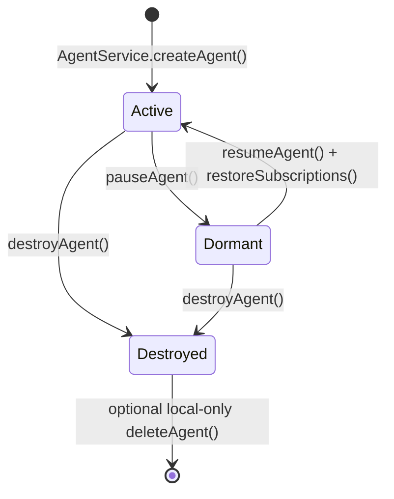
```mermaid
stateDiagram-v2
  [*] --> Active: AgentService.createAgent()
  Active --> Dormant: pauseAgent()
  Dormant --> Active: resumeAgent() + restoreSubscriptions()
  Active --> Destroyed: destroyAgent()
  Dormant --> Destroyed: destroyAgent()
  Destroyed --> [*]: optional local-only deleteAgent()
```

## Wake Orchestration

`WakeOrchestrator` is the central runtime component. It:

- matches notification batches against `AgentSubscription`s
- deduplicates jobs by run key in `WakeQueue`
- merges trigger tokens for already-queued jobs of the same agent **and
  workspace**. `WakeJob.workspaceKey` partitions merging, superseding, and
  cancellation by `(agentId, workspaceKey)` (ADR 0022): the Daily OS planner is
  one identity handling many day workspaces (`day:<dayId>`), so a day-B capture
  wake must never merge into — or cancel — a day-A draft wake. A null workspace
  (task/project/improver agents) only partitions with other null workspaces, so
  their behavior is unchanged. The key partitions queue-level merge/supersede/
  cancellation by `(agentId, workspaceKey)`; it is **excluded** from the
  subscription run-key hash (`RunKeyFactory.forSubscription`) but **included**
  in the manual run-key hash (`RunKeyFactory.forManual`), so two day-scoped
  manual wakes enqueued in the same tick get distinct run keys instead of the
  second being deduped away.
- enforces single-flight execution per agent through `WakeRunner`
- persists wake-run entries before execution
- suppresses self-notifications using vector clocks
- persists and restores deferred subscription wake deadlines through
  `AgentStateEntity.nextWakeAt`, rebuilding the in-memory queue job after
  restart

The persisted wake reasons are:

- `subscription`
- `creation`
- `reanalysis`
- `scheduled`
- `transcriptionComplete` — fired after speech transcription completes for a
  task-linked audio entry; bypasses the throttle so the user does not wait out
  the 120-second coalescing window after speaking

Subscription-driven wakes are throttled with a 120-second window. A
subscription can opt into daily-digest deferral for propagated-only matches;
project-agent subscriptions use that path so linked-task churn waits for the
scheduled project digest, while task-agent subscriptions opt out so child-entry
and task-context updates refresh on the normal 120-second coalesced wake path.
Manual wakes (`creation`, `reanalysis`, and scheduled jobs enqueued manually by
`ScheduledWakeManager`) bypass subscription matching and that throttle path.

Task agents that were auto-provisioned from category defaults can start with
`awaitingContent = true`. In that mode, the orchestrator skips the wake until
the task or one of its linked entries has meaningful text, then clears the flag
and lets the wake proceed normally.

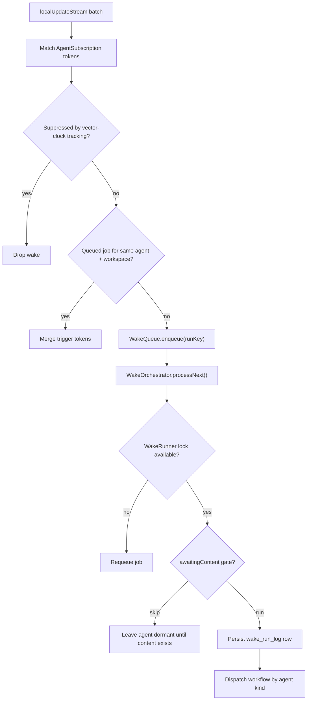
```mermaid
flowchart TD
  Update["localUpdateStream batch"] --> Match["Match AgentSubscription tokens"]
  Match --> Suppress{"Suppressed by vector-clock tracking?"}
  Suppress -->|yes| Drop["Drop wake"]
  Suppress -->|no| Merge{"Queued job for same agent + workspace?"}
  Merge -->|yes| Coalesce["Merge trigger tokens"]
  Merge -->|no| Queue["WakeQueue.enqueue(runKey)"]
  Queue --> Drain["WakeOrchestrator.processNext()"]
  Drain --> Busy{"WakeRunner lock available?"}
  Busy -->|no| Requeue["Requeue job"]
  Busy -->|yes| Content{"awaitingContent gate?"}
  Content -->|skip| Wait["Leave agent dormant until content exists"]
  Content -->|run| Persist["Persist wake_run_log row"]
  Persist --> Exec["Dispatch workflow by agent kind"]
```

### Why the wake design is this defensive

The implementation is explicitly shaped around three background-agent failure
modes:

1. wake storms after rapid local edits
2. self-trigger loops after an agent writes to the same entities it watches
3. duplicate execution when an agent is already running

Current mitigations are:

- `WakeQueue` deduplicates by run key and merges trigger tokens
- `WakeRunner` enforces single-flight execution per agent
- `WakeOrchestrator` persists deferred wake deadlines through `nextWakeAt` and
  reconstructs the in-memory wake job during startup restoration
- suppression is pre-registered before execution starts, then replaced with the
  actual mutated-entity vector clocks after execution

That pre-registration step matters because it closes the race window between
"the agent already wrote to the DB" and "the suppression tracker has recorded
the write."

## Task Agents

`TaskAgentService.createTaskAgent()` runs inside an agent-sync transaction and:

1. validates that the task does not already have a task agent
2. resolves a template, defaulting to the seeded Laura template when present
3. creates the agent identity and state
4. sets `slots.activeTaskId`
5. creates `agent_task` and `template_assignment` links
6. registers a task subscription
7. enqueues a creation wake

### Wake Flow

`TaskAgentWorkflow.execute()` is the main production path:

1. load the agent state and resolve `activeTaskId`
2. load the latest report and prior observation messages
3. build task JSON through `AiInputRepository`
4. build linked-task context
5. resolve the assigned template and active version
6. resolve the effective inference profile with `ProfileResolver`
7. fetch pending change sets for the task
8. build the system prompt and user message
9. create a conversation and persist the user message into the agent log
10. run the conversation with `TaskAgentStrategy`
11. persist wake token usage
12. persist the final thought, report, observations, change set, and updated
    agent state
13. optionally embed the persisted report when both embedding dependencies are
    available

The task wake prompt is assembled from:

- current task JSON
- the latest persisted task-agent report, if one exists
- prior observation messages
- linked-task context
- pending change sets for the same task
- active `AttentionRequestEntity` claims for this task, loaded through
  `AgentRepository.getAttentionClaimsForTarget(targetKind: 'task', ...)` so
  the prompt never scans the append-only `agent_entities` source table
- the active running timer, when one is running. If the timer's source task
  matches the wake's task, the agent gets full details (id, started, tracked
  range, elapsed minutes, current entry text) and is steered toward
  `update_running_timer` instead of a parallel `create_time_entry`. If the
  timer belongs to a different task, only the tracked range is exposed (no
  id, no other-task identity, no entry text) so the agent can avoid
  proposing `create_time_entry` intervals on this task that overlap with
  what is already being tracked elsewhere. See `_buildActiveTimerSection`
  in `task_agent_context_builder.dart` (called from
  `task_agent_prompt_builder.dart`).
- editable historical time entries linked from the current task. The
  `Editable Time Entries` prompt section lists non-running `JournalEntry`
  ids, `dateFrom`, `dateTo`, and current text so the agent can propose
  `update_time_entry` only against concrete entries on this task. The
  active timer row is omitted from this section and remains owned by
  `update_running_timer`.

The linked-task context is not only raw task metadata. The workflow also pulls
in the latest task-agent report for linked tasks when available, so one task
agent can consume another task agent's distilled report.

Task-agent reports may include readable Markdown links to known task ids as
`[Title](/tasks/<taskId>)` when the input context exposed the id and opening the
task helps inspect proof of work. The trailing Links block remains reserved for
external source URLs; internal task links belong inline in the report body.

### Tool Policy

Task agents have four immediate local tools:

- `update_report`
- `record_observations`
- `request_attention` *(writes an evidence-backed `AttentionRequestEntity`
  into the synced agent log; it does not mutate the task or calendar directly)*
- `resolve_attention_request` *(writes an auditable
  `AttentionClaimDispositionEntity` for one of this agent's own active
  planner requests)*

The current deferred task tools are:

- `set_task_title` *(conditionally immediate — see carve-out below)*
- `update_task_estimate`
- `update_task_due_date`
- `update_task_priority`
- `set_task_status`
- `set_task_language` *(conditionally immediate — see carve-out below)*
- `add_multiple_checklist_items`
- `update_checklist_items`
- `assign_task_labels`
- `create_follow_up_task`
- `migrate_checklist_items`
- `create_time_entry` *(for newly dictated work sessions; completed
  sessions may use any valid `endTime > startTime` range, while running
  timers still must start today and not in the future)*
- `update_time_entry` *(proposes text/start/end edits for a non-running
  time entry linked from this task; user-gated and rendered as a diff)*
- `update_running_timer` *(proposes a richer description for the active
  timer when one is running for this task; user-gated; replaces entry text
  outright)*

There are no other immediate task-mutating tools today. `request_attention`
is intentionally immediate because it writes an auditable claim for the day
planner, not a user-visible task/calendar mutation. Non-local task writes go
through `AgentToolExecutor`, which enforces the agent's allowed category set,
captures post-write vector clocks when a journal entity changes, and persists
audit messages for tool actions and tool results.

Attention claims are producer-maintained. Task, project, health, and standing
agreement agents should call `request_attention` during their own scheduled or
event-driven wakes when their facts change or a planning horizon approaches.
Task agents inspect active requests on each wake; terminal tasks
deterministically satisfy or withdraw their own outstanding claims, and the
LLM can call `resolve_attention_request` or a fresh `request_attention` for
nuanced changes.
The day planner only reads already-materialized claim projections; it does not
fan out and wake producer agents synchronously during drafting.

`ChangeSetBuilder` is responsible for the deferred path. It:

- explodes batch tools into individually reviewable items
- deduplicates identical proposals within the same wake
- keeps only the newest `update_running_timer` proposal, retracting older
  pending running-timer text updates before persisting the replacement
- suppresses redundant proposals when they would not change current state

#### Initial-field carve-out

`set_task_title` and `set_task_language` are the deferred tools that can
run on the immediate path on first population. When the strategy resolves
the current task metadata and the corresponding field (`title`, or
`languageCode`) is null or empty-after-trim, the call routes through
`AgentToolExecutor` like any other immediate tool — the value is applied
without a user confirmation prompt so a freshly dictated task gets a
meaningful name (and language) without an empty-looking suggestion sitting
in the panel waiting for approval. The two carve-outs share the same
`_shouldAutoApplyInitialField` check; the language carve-out mirrors the
title logic. If `AgentToolExecutor` rejects that autonomous write with a
category-policy denial, the strategy converts the same tool call back
into a normal change-set proposal instead of returning the denial to the
model. Once the field is present the tool reverts to the normal deferred
path.

The auto-apply check (`_shouldAutoApplyInitialField`) deliberately
re-runs the metadata resolver on every call rather than trusting the
cached snapshot, so a field populated by any source — a concurrent user
edit, a prior auto-apply in the same wake, a synced edit from another
device — is seen before dispatch. After a successful auto-apply or
policy-fallback proposal, the strategy also marks the tool name as
used in `_usedDeferredTools`, so a repeat call in the same wake cannot
re-auto-apply on the pre-write snapshot and instead hits the same
single-use guard as other deferred tools. The dispatcher itself stays
simple: it is the single write path for both auto-applied initial values
and user-confirmed edits, so the "don't overwrite a populated field"
invariant is enforced at the strategy boundary and not at the mutation
boundary (where it would otherwise block legitimate edits).

### Confirmation Path

`ChangeSetConfirmationService` applies one change item at a time:

1. re-read the persisted change set to avoid stale UI snapshots
2. persist the user's decision first
3. mark the item confirmed
4. dispatch the tool
5. revert retryable dispatch failures to `pending`
6. auto-retract non-retryable `update_running_timer` failures when the
   active timer changed before the user accepted the proposal

It also resolves follow-up-task placeholder IDs across later migration items
and suppresses rejected label assignments so the same label is not proposed
again immediately. After a successful user decision, the confirmation service
hands the fresh change set to `ChangeSetNotificationService`: if pending items
remain, the seeded task-suggestion notification is refreshed with the new
count and older open rows for the same task are retracted; if no pending items
remain, every open suggestion notification for that task is marked acted-on so
it leaves the inbox and syncs that lifecycle state to other devices. When the
user taps a task-suggestion notification, navigation also publishes a focus
intent so the open task detail scrolls to this proposal section instead of
only selecting the task.

Running-timer proposals are intentionally stricter than ordinary metadata
edits. `update_running_timer` names a specific live timer ID from the wake
context; if the user stops that timer, starts another task's timer, or the
active timer snapshot otherwise changes before acceptance, retrying the same
proposal cannot succeed. The confirmation service therefore records a
`ChangeDecisionEntity{verdict: retracted, actor: agent, retractionReason}`
after the failed confirm and moves the item to `retracted` instead of leaving
it visible as a dead retry button. The next wake sees the retraction reason in
the proposal ledger and can propose `update_time_entry` for the now-completed
entry when that is the right follow-up.

Only one running-timer update may be open for a task. If a later wake proposes
better timer text, `ChangeSetBuilder` treats it as a superseding replacement:
older pending `update_running_timer` items are recorded as agent retractions
and the latest proposal is the only actionable row. `AiSummaryCard` also
defensively renders only the newest pending running-timer update so historical
duplicate data does not produce multiple accept buttons.

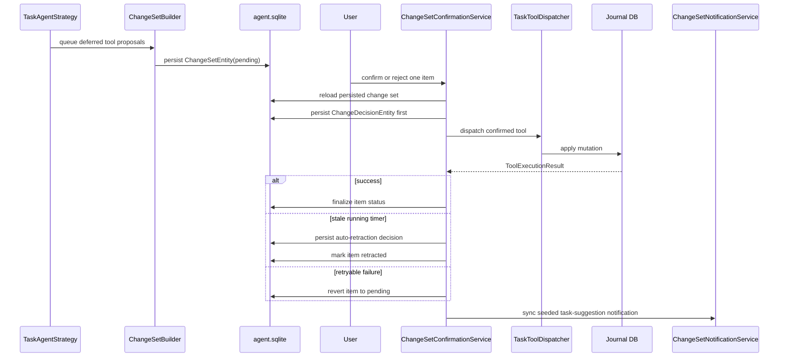
```mermaid
sequenceDiagram
  participant Agent as TaskAgentStrategy
  participant Builder as ChangeSetBuilder
  participant Store as agent.sqlite
  participant User as User
  participant Confirm as ChangeSetConfirmationService
  participant Dispatch as TaskToolDispatcher
  participant Journal as Journal DB
  participant Inbox as ChangeSetNotificationService

  Agent->>Builder: queue deferred tool proposals
  Builder->>Store: persist ChangeSetEntity(pending)
  User->>Confirm: confirm or reject one item
  Confirm->>Store: reload persisted change set
  Confirm->>Store: persist ChangeDecisionEntity first
  Confirm->>Dispatch: dispatch confirmed tool
  Dispatch->>Journal: apply mutation
  Journal-->>Confirm: ToolExecutionResult
  alt success
    Confirm->>Store: finalize item status
  else stale running timer
    Confirm->>Store: persist auto-retraction decision
    Confirm->>Store: mark item retracted
  else retryable failure
    Confirm->>Store: revert item to pending
  end
  Confirm->>Inbox: sync seeded task-suggestion notification
```

### Proposal Ledger and Agent-Autonomous Retraction

Every task-agent wake is shown a **proposal ledger** — a single
status-sorted view of every `ChangeItem` the agent has ever produced for
the current task, assembled by `AgentRepository.getProposalLedger`. The
ledger replaces the earlier split between "pending proposals" and "recent
user decisions" with one unified section the agent reasons about.

Each ledger entry carries a stable fingerprint (`toolName + args`). Open
entries are rendered in the `AiSummaryCard` UI for the user to
confirm or reject; resolved entries (user verdicts and agent retractions)
are kept in the LLM prompt within a bounded window so the agent learns
from its own history.

When an open proposal is no longer relevant the agent calls
`retract_suggestions` with one or more `{fingerprint, reason}` entries.
Retraction is **two-phase** so it commits atomically with the wake's new
proposals:

- `SuggestionRetractionService.plan(...)` runs while the LLM is mid-turn. It
  looks each fingerprint up across the task's pending change sets and returns
  the per-entry outcomes (`retracted` / `notOpen` / `notFound`) for the LLM,
  plus the matched items as `StagedRetraction`s. It **persists nothing**. The
  strategy accumulates the staged retractions (`extractStagedRetractions`) and
  feeds `plan` the keys staged so far so repeated calls in one wake stay
  idempotent without any intervening write.
- `SuggestionRetractionService.applyStaged(...)` runs at end-of-wake inside the
  same transaction as `ChangeSetBuilder.build()` (and just before it, so the
  builder's dedup sees the freshly-retracted statuses). It groups staged
  retractions by parent change set and applies each set in a single re-read →
  flip-all → write, re-validating every target by bounds, status, and
  fingerprint (so a row a concurrent user action already resolved, or one that
  moved under us, is skipped). For each surviving item it transitions it to
  `ChangeItemStatus.retracted` and persists a matching
  `ChangeDecisionEntity{verdict: retracted, actor: agent, retractionReason}`.

**Churn guard.** Weaker models routinely retract an open proposal AND
re-propose an identical one in the same wake. Even committed atomically, that
retract-then-re-add swaps a stable suggestion for a brand-new change item —
which, when the user has just confirmed a sibling, looks like accepting one
suggestion wipes the rest. The workflow therefore passes
`ChangeSetBuilder.proposedFingerprints` as `applyStaged(..., skipFingerprints:
…)`: any staged retraction whose target shares a fingerprint with something
proposed this wake is dropped, and the matching new proposal is then dropped by
the builder's dedup against the still-open original. The original proposal is
left untouched. Stale retractions (not re-proposed) and supersedes (a different
fingerprint, e.g. a new `update_running_timer` text) are unaffected.

Deferring the write is what keeps the suggestion list from flashing empty: the
old behavior persisted each retraction the instant the tool was called, so the
`AiSummaryCard` (which watches the agent update stream) dropped the retracted
rows seconds before the wake's replacement proposals landed. Staging collapses
that into a single end-of-wake update — the list transitions straight from the
old set to the new one. Applying at end-of-wake is also strictly safer: each
retraction re-reads the parent set and skips any item a concurrent user
confirm/reject already resolved. Retraction is **not user-gated** — the user
simply sees the item leave the active list and surface in the ledger's resolved
slice.

The agent is also instructed (see `taskAgentScaffoldTrailing` → *Suggestion
Hygiene*) to retract an open proposal **only when that proposal itself is
stale** — never to withdraw the rest of a batch just because the user acted on
one sibling, and to prefer leaving a good proposal in place over
retract-and-re-add churn.

Ledger reads are defensive against stale snapshots. An item is only exposed
as open when both the parent `ChangeSetEntity` is still `pending` or
`partiallyResolved` and the effective item state is still `pending`.
Decision rows for rejections, deferrals, and agent retractions close stale
embedded item snapshots before the prompt or UI sees them, and retired
resolved-set rows with no decision are filtered out entirely.

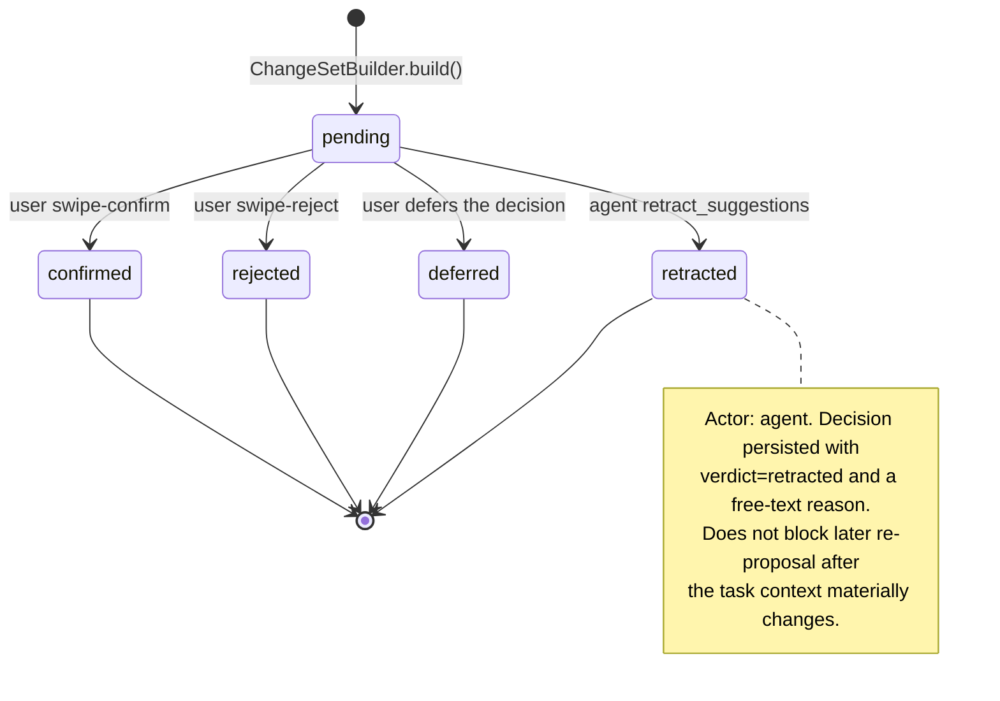
```mermaid
stateDiagram-v2
  [*] --> pending: ChangeSetBuilder.build()
  pending --> confirmed: user swipe-confirm
  pending --> rejected: user swipe-reject
  pending --> deferred: user defers the decision
  pending --> retracted: agent retract_suggestions
  confirmed --> [*]
  rejected --> [*]
  deferred --> [*]
  retracted --> [*]

  note right of retracted
    Actor: agent. Decision persisted with
    verdict=retracted and a free-text reason.
    Does not block later re-proposal after
    the task context materially changes.
  end note
```

`ChangeSetBuilder` co-operates with retraction by excluding both
`confirmed` and `retracted` items from its dedup basis, while keeping
`pending`, `rejected`, and `deferred` items sticky. The result: the agent
can re-propose something it previously retracted if circumstances change,
but cannot re-propose a user rejection without materially different args.
`SuggestionRetractionService` also calls `ChangeSetNotificationService` after
each successful retraction, so a fully retracted change set deletes every open
suggestion notification for the task and a partially retracted set keeps only
one row with the remaining pending count visible.
When several pending change sets are consolidated, the newest set becomes
the survivor and pending items in the retired source sets are marked
`retracted` before those source sets are resolved. That keeps the database
in the same lifecycle shape that the ledger expects: no resolved parent row
contains an actionable-looking pending child.

Feedback-extraction heuristics that read the `rejectionReason` slot to
detect user grievances are explicitly decoupled from the
`retractionReason` slot, so agent self-talk never pollutes the user
feedback signal.

## Project Agents

`ProjectAgentService.createProjectAgent()`:

1. enforces one project agent per project
2. validates the assigned template is a project-agent template
3. creates the agent identity and state
4. sets `slots.activeProjectId`
5. schedules the first digest for the next local 06:00
6. creates `agent_project` and `template_assignment` links
7. registers a direct project-edit subscription
8. enqueues a creation wake

Project agents do not wake on every linked task edit. Task and project-linked
activity is funneled through `ProjectActivityMonitor`, which listens to
`localUpdateStream`, resolves affected project IDs, and sets
`slots.pendingProjectActivityAt` on the corresponding project agent state.

Direct project edits are different: the service registers a direct project
notification token, so explicit project-entity edits can still wake the agent
immediately through the orchestrator.

### Wake Behavior

`ProjectAgentWorkflow.execute()`:

1. loads the agent state and resolves `activeProjectId`
2. checks whether a due scheduled wake can be skipped cheaply
3. loads the project entity
4. loads prior observation messages
5. resolves template/version and inference profile
6. builds linked-task context, including task-agent reports
7. runs the conversation with `ProjectAgentStrategy`
8. persists token usage, final thought, report, observations, deferred
   change set, and updated state

Project-agent reports follow the same inline task-link contract as task-agent
reports. When linked-task context includes a task id, the report may point to
that task with `/tasks/<taskId>` instead of relegating internal navigation to
the external Links block.

If a scheduled digest is due, a report already exists, and
`pendingProjectActivityAt` is still `null`, the workflow rolls
`scheduledWakeAt` forward and skips the model call. That is how project agents
stay digest-shaped instead of waking on every piece of project-linked traffic.

### Project Tools and Recommendations

Project agents have two immediate local tools:

- `update_project_report`
- `record_observations`

The current deferred project tools are:

- `recommend_next_steps`
- `update_project_status`
- `create_task`

Confirmed `recommend_next_steps` decisions are converted into
`ProjectRecommendationEntity` rows by `ProjectRecommendationService`. Existing
active recommendations for that project are superseded first. Recommendations
then move through `active`, `resolved`, `dismissed`, and `superseded`.

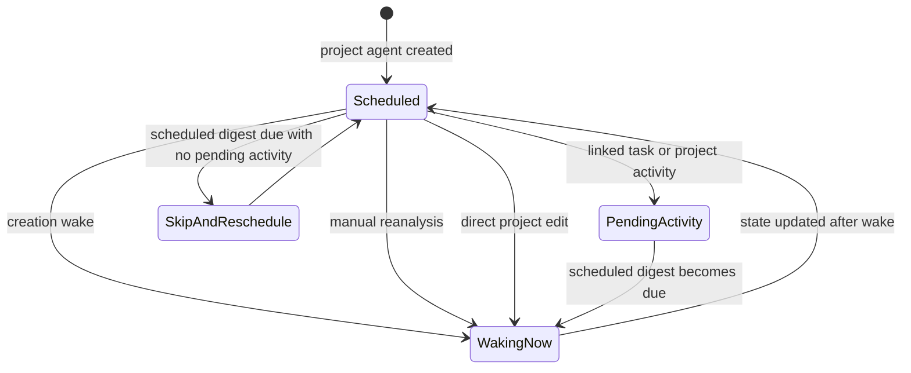
```mermaid
stateDiagram-v2
  [*] --> Scheduled: project agent created
  Scheduled --> WakingNow: creation wake
  Scheduled --> WakingNow: manual reanalysis
  Scheduled --> WakingNow: direct project edit
  Scheduled --> PendingActivity: linked task or project activity
  PendingActivity --> WakingNow: scheduled digest becomes due
  Scheduled --> SkipAndReschedule: scheduled digest due with no pending activity
  SkipAndReschedule --> Scheduled
  WakingNow --> Scheduled: state updated after wake
```

During that final transition, `pendingProjectActivityAt` is cleared only when
no newer project activity arrived during the wake. If fresh activity lands
mid-run, the newer timestamp is retained so the next digest still knows the
summary is stale again.

## Templates, Evolution, and Improvers

Templates are first-class persisted entities with a template row, version rows,
and a head pointer.

`AgentTemplateService.seedDefaults()` currently seeds six named templates:

- `Laura`
- `Tom`
- `Shepherd` (the Daily OS day-agent template, kind `dayAgent`)
- `Project Analyst`
- `Template Improver`
- `Meta Improver`

The one-on-one UI is split into two surfaces:

- `EvolutionReviewPage`: a history-first ritual home with a pending-session
  card, compact ritual summary metrics, and persisted session history
- `EvolutionChatPage`: the active negotiation loop for the current ritual

The compact summary surface is backed by `ritualSummaryMetricsProvider` and
only exposes the retained signals:

- lifetime wake count
- wakes since the last completed ritual
- token usage since the last completed ritual
- 30-day wake activity buckets

`TemplateEvolutionWorkflow` is the multi-turn session runtime. It handles both
template evolution (skill changes) and soul evolution (personality changes):

1. gathers template context, metrics, and soul context
2. creates an `EvolutionSessionEntity`
3. starts a conversation with `EvolutionStrategy`
4. records evolution notes, structured ritual recap state, and proposal state
5. creates a new template version only after approval (`propose_directives`)
6. can also create a new soul version (`propose_soul_directives`) — this
   affects all templates sharing the soul
7. persists an `EvolutionSessionRecapEntity` from the explicit
   `publish_ritual_recap` tool payload plus the approved-change rationale,
   ratings, and transcript snapshot

Session history cards prefer the persisted recap `tldr` and fall back to
`session.feedbackSummary` when the recap `tldr` is absent or empty.

Only one active evolution session per template is allowed at a time.

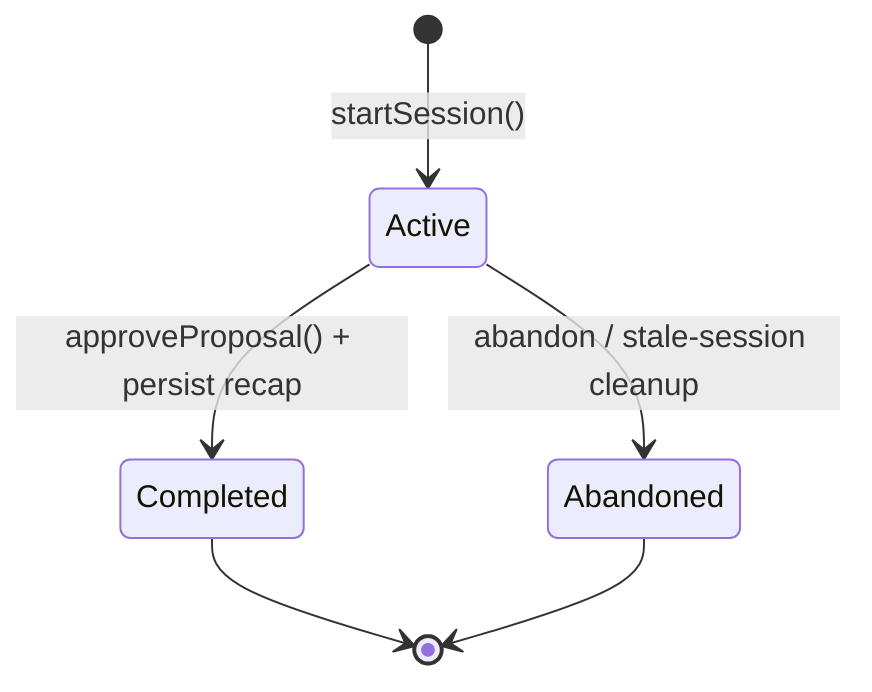
```mermaid
stateDiagram-v2
  [*] --> Active: startSession()
  Active --> Completed: approveProposal() + persist recap
  Active --> Abandoned: abandon / stale-session cleanup
  Completed --> [*]
  Abandoned --> [*]
```

Improver agents are scheduled agents whose job is to open those evolution
sessions with richer context. `ImproverAgentWorkflow`:

1. loads `activeTemplateId`
2. extracts classified feedback since the last watermark
3. skips the ritual when fewer than `3` feedback items are available
4. builds ritual context from feedback, reports, observations, versions, and
   metrics
5. starts `TemplateEvolutionWorkflow.startSession(...)`
6. updates feedback scan watermarks and schedules the next ritual

Meta-improvers reuse the same workflow. They are distinguished only by the
state slot `recursionDepth > 0`.

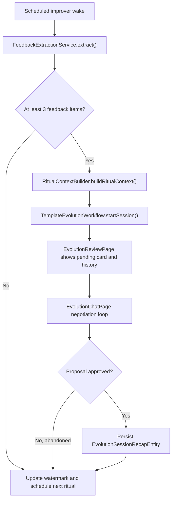
```mermaid
flowchart TD
  Wake["Scheduled improver wake"] --> Feedback["FeedbackExtractionService.extract()"]
  Feedback --> Threshold{"At least 3 feedback items?"}
  Threshold -->|No| Reschedule["Update watermark and schedule next ritual"]
  Threshold -->|Yes| Context["RitualContextBuilder.buildRitualContext()"]
  Context --> Session["TemplateEvolutionWorkflow.startSession()"]
  Session --> Home["EvolutionReviewPage shows pending card and history"]
  Home --> Chat["EvolutionChatPage negotiation loop"]
  Chat --> Approval{"Proposal approved?"}
  Approval -->|Yes| Recap["Persist EvolutionSessionRecapEntity"]
  Approval -->|No, abandoned| Reschedule
  Recap --> Reschedule
```

## Soul Documents

Soul documents decouple agent personality from template skills. A soul contains
four structured personality fields — `voiceDirective`, `toneBounds`,
`coachingStyle`, and `antiSycophancyPolicy` — that define how an agent
communicates. Templates define what an agent does (skills); souls define who it
is (personality).

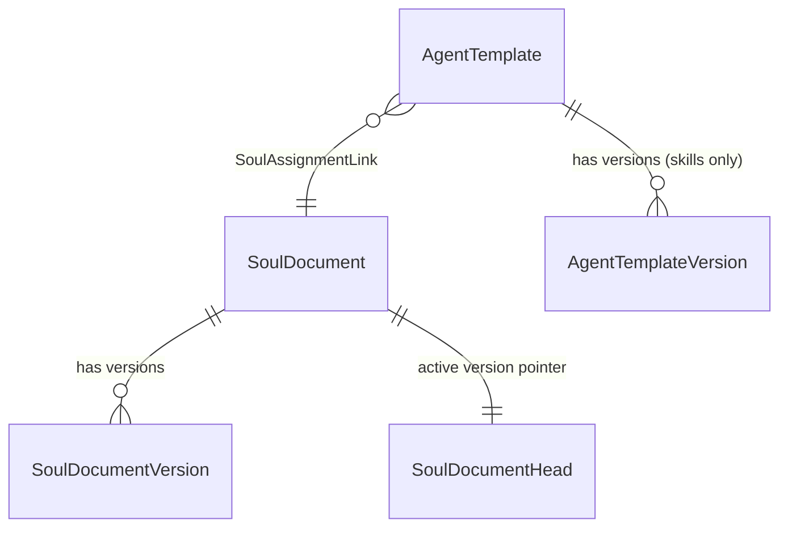
```mermaid
erDiagram
    SoulDocument ||--o{ SoulDocumentVersion : "has versions"
    SoulDocument ||--|| SoulDocumentHead : "active version pointer"
    AgentTemplate }o--|| SoulDocument : "SoulAssignmentLink"
    AgentTemplate ||--o{ AgentTemplateVersion : "has versions (skills only)"
```

Key invariant: one active soul per template. Multiple templates can share the
same soul. Instances inherit their soul through their template assignment.

`SoulDocumentService` manages the lifecycle:

- `createSoul()` → creates entity + initial version + head
- `createVersion()` → archives old versions, creates new active version
- `assignSoulToTemplate()` → creates/replaces `SoulAssignmentLink`
- `resolveActiveSoulForTemplate()` → link → head → version chain
- `getTemplatesUsingSoul()` → reverse lookup

At wake time, `TaskAgentWorkflow` and `ProjectAgentWorkflow` resolve the active
soul for the template and inject personality fields into the system prompt under
`## Your Personality`, while skills go under `## Your Operational Directives`.
Templates without a soul assignment fall back to the legacy
`## Your Personality & Directives` format.

Six seeded souls are available as a personality palette: Laura, Tom, Max, Iris,
Sage, and Kit. Three default soul-to-template assignments are seeded: the Laura
soul to the Laura task template, the Tom soul to the Tom task template, and the
Laura soul to the Project Analyst project template. Max, Iris, Sage, and Kit are
available for manual assignment.

### Standalone Soul Evolution

Soul personality can be evolved in two ways:

1. **During a template ritual** — the template evolution agent can
   opportunistically propose soul changes via `propose_soul_directives`
   alongside skill changes
2. **Standalone soul session** — a dedicated 1-on-1 focused exclusively on
   personality refinement

Standalone soul sessions are started from the soul detail page via the
"Soul 1-on-1" button. The flow:

1. `TemplateEvolutionWorkflow.startSoulSession(soulId)` aggregates feedback
   from all templates sharing the soul via
   `FeedbackExtractionService.extractForSoul()`
2. `SoulEvolutionContextBuilder` builds personality-focused LLM context with
   cross-template feedback grouped by source template
3. Only `propose_soul_directives` is available (no `propose_directives`)
4. `completeSoulSession()` creates a new `SoulDocumentVersionEntity`

The UI mirrors the template evolution flow:

- `SoulEvolutionReviewPage`: history-first home with start card and session
  history
- `SoulEvolutionChatPage`: multi-turn conversation with the personality
  evolution agent
- `SoulEvolutionChatState`: Riverpod notifier managing session lifecycle

Session entities reuse `EvolutionSessionEntity` with `agentId=soulId` and
`templateId=soulId`.

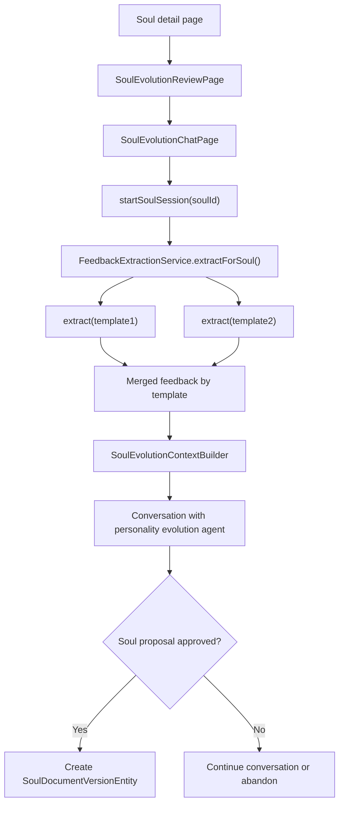
```mermaid
flowchart TD
  SoulDetail["Soul detail page"] --> Review["SoulEvolutionReviewPage"]
  Review --> Chat["SoulEvolutionChatPage"]
  Chat --> Start["startSoulSession(soulId)"]
  Start --> Feedback["FeedbackExtractionService.extractForSoul()"]
  Feedback --> T1["extract(template1)"]
  Feedback --> T2["extract(template2)"]
  T1 --> Merge["Merged feedback by template"]
  T2 --> Merge
  Merge --> Context["SoulEvolutionContextBuilder"]
  Context --> LLM["Conversation with personality evolution agent"]
  LLM --> Approve{"Soul proposal approved?"}
  Approve -->|Yes| Version["Create SoulDocumentVersionEntity"]
  Approve -->|No| Continue["Continue conversation or abandon"]
```

## Sync and Privacy

`AgentSyncService` wraps local agent writes. It stamps vector clocks and buffers
outbox messages until the outermost transaction commits. Nested transactions use
the same zone-local buffer, so rolled-back inner savepoints do not leak sync
messages for writes that never committed.

Incoming sync writes do not pass back through `AgentSyncService`; they write to
`AgentRepository` directly to avoid echo loops. Startup wiring attaches the
sync event processor when the app has one registered.

The wake workflows resolve an inference profile at run time. That means the
same template can be routed through different providers without changing the
agent persistence model. The core wake flows in this feature are text-prompt
flows: task, project, and improver wakes build text context and send it through
the resolved provider.

Local-only data includes:

- `wake_run_log` rows and other runtime bookkeeping that is not modeled as a
  sync entity

Synced agent data includes:

- agent identities and state
- reports, observations, change sets, decisions, recommendations, and token
  usage entities
- template versions and evolution sessions

Provider-facing data includes only:

- the prompt payload assembled for that specific wake

Runtime diagnostics are deliberately content-free. `DomainLogger` and direct
agent `developer.log` calls may record tool names, item indexes, counts, byte
sizes, status names, sanitized IDs, and exception runtime types. They must not
record task titles, notes, timer summaries, prompt text, model output, raw tool
arguments, or arbitrary exception strings. The durable agent message log remains
the agent memory/audit surface described above; it is not copied into runtime
log files.

For provider selection and residency details, see [../ai/README.md](../ai/README.md).

## Planned Improvements

Input capture + log compaction (ADR 0020 + ADR 0017) is fully wired for
task/project/day agents — see *Memory compaction & input capture* above for
the live behavior (event-log read, LLM-distilled summary checkpoints,
decision/observation events). Remaining work:

- **profile-aware watermarks** — derive trigger/retain from the resolved
  model's context window and local-vs-hosted inference instead of the global
  50k/20k defaults (`AgentWakeMemory` params are the seam).

## User-Facing UI Surfaces

The runtime described above is consumed by three concrete UI widgets.
None of them owns business logic — they all read from the providers in
`state/agent_providers.dart` and dispatch through the same services.

Agent markdown is rendered through `AgentMarkdownView`, which wires
`handleMarkdownLinkTap` and `buildMarkdownLink` from `utils/markdown_link_utils`.
That shared handler beams app-local routes such as `/tasks/<id>` or
`lotti://tasks/<id>` through `NavService`; external URLs still use the platform
launcher.

### `AiSummaryCard` — the task-details AI surface

`lib/features/agents/ui/ai_summary_card.dart` is the single AI surface
on the task detail page. It replaced the earlier
`AgentSuggestionsPanel` + `TaskAgentReportSection` split (deleted) with
one deep-teal-tinted-navy card that exposes everything the task-level
agent runtime produces:

- TLDR header (`AgentReportEntity.tldr`, falling back to the report's
  first paragraph) plus an inline expandable Goal / Achieved / Next /
  Learnings block (`AgentReportEntity.content`) under a
  `Read more / Show less` pill
- a `Proposed changes` section that sources its rows from
  `unifiedSuggestionListProvider`. Each row is a
  `PendingSuggestion`; rows can be confirmed or rejected via tap or
  swipe (`> 70px` → confirm, `< -70px` → reject; in-between snaps
  back). All confirms route through `ChangeSetConfirmationService`.
  A `Confirm all` button batches `confirmAll` over distinct change
  sets.
- a `History · N` toggle (`_HistoryToggle`, label `aiCardHistoryToggle`) that
  lazily expands resolved ledger entries, rendered with `Confirmed` /
  `Dismissed` tags and a strikethrough.
- the wake-cycle affordances directly in the header: a running spinner
  while a wake is in flight, otherwise a refresh icon button (calls
  `TaskAgentService.triggerReanalysis`) when no wake is scheduled, or
  a play button + countdown pill (`m:ss` below one hour, `h:mm:ss` once
  the hour cell is needed) + cancel button (calls `cancelScheduledWake`)
  while one is.

The card keeps the last visible suggestion list in widget state while an
agent wake is running. If the provider briefly reloads to an empty or partial
open list without ledger entries resolving the missing fingerprints, the card
merges those unresolved previous rows back into the rendered list. Explicit
resolution still wins: confirmed, rejected, and retracted fingerprints in the
ledger remove the matching row immediately. This avoids the proposals section
blanking out while the LLM is still reasoning, but still lets real retractions
and user decisions update the UI.

The card is the only entry point in `task_form.dart`; the legacy
`AgentSuggestionsPanel` is gone.

### `AgentInternalsPanel` — right-side overlay

`lib/features/agents/ui/agent_internals_panel.dart` is a dismissable
right-side overlay (clamped between 600 and 800 px) reachable from
two affordances inside the AI card: tapping the agent name link in the
header (`onAgentTap`), and the `Open agent internals` pill that appears
under the expanded report (`onOpenInternals`). The
panel itself is a thin shell — header + close button + scrim — that
hosts `AgentInternalsBody` once the `agentIdentityProvider` resolves.
A `barrierDismissible: true` route plus an explicit full-screen
`GestureDetector` cover both pop paths.

### `AgentInternalsBody` — the canonical five tabs

`lib/features/agents/ui/agent_internals_body.dart` is the shared
tabbed body — Stats / Reports / Conversations / Observations /
Activity — used both inside the side panel and as the body of the
standalone `AgentDetailPage`. Each tab is owned by an existing
component (`AgentTokenUsageSection`, `AgentReportHistoryLog`,
`AgentConversationLog`, `AgentObservationLog`, `AgentActivityLog`)
plus a Stats card that wraps the agent's template, profile, controls,
and current `AgentStateEntity`. There is no logic specific to the
panel here; both consumers see the same tabs and behavior.

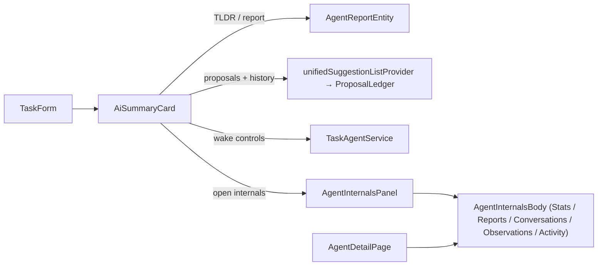
```mermaid
flowchart LR
  Form["TaskForm"] --> Card["AiSummaryCard"]
  Card -->|TLDR / report| Report["AgentReportEntity"]
  Card -->|proposals + history| Ledger["unifiedSuggestionListProvider → ProposalLedger"]
  Card -->|wake controls| Service["TaskAgentService"]
  Card -->|open internals| Panel["AgentInternalsPanel"]
  Panel --> Body["AgentInternalsBody (Stats / Reports / Conversations / Observations / Activity)"]
  DetailPage["AgentDetailPage"] --> Body
```

## Code Reading Guide

For the implementation path with the best signal-to-noise ratio, read these in
order:

1. `state/agent_providers.dart`
2. `wake/wake_orchestrator.dart`
3. `wake/wake_queue.dart`
4. `wake/wake_runner.dart`
5. `workflow/task_agent_workflow.dart`
6. `workflow/task_agent_strategy.dart`
7. `service/change_set_confirmation_service.dart`
8. `workflow/project_agent_workflow.dart`
9. `workflow/template_evolution_workflow.dart`
10. `workflow/improver_agent_workflow.dart`
11. `sync/agent_sync_service.dart`

If you need the inference stack that these workflows call into, continue with
[../ai/README.md](../ai/README.md).
