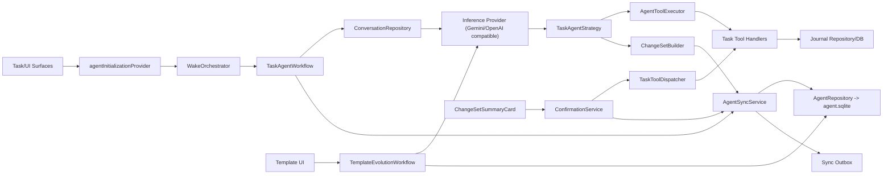
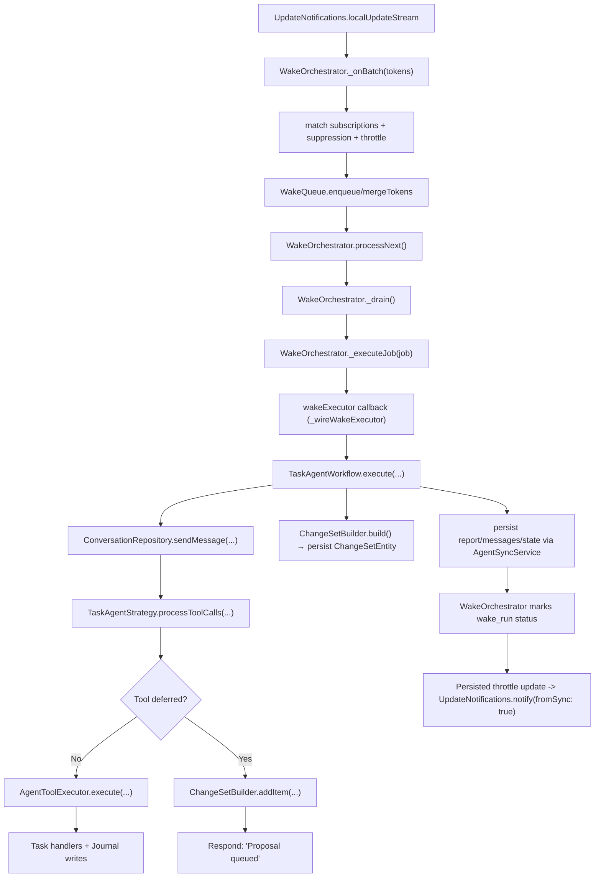
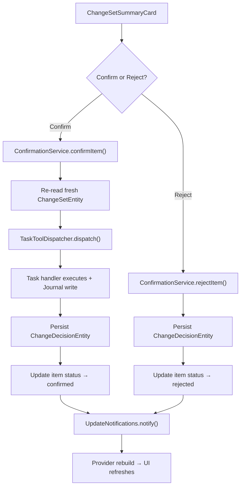
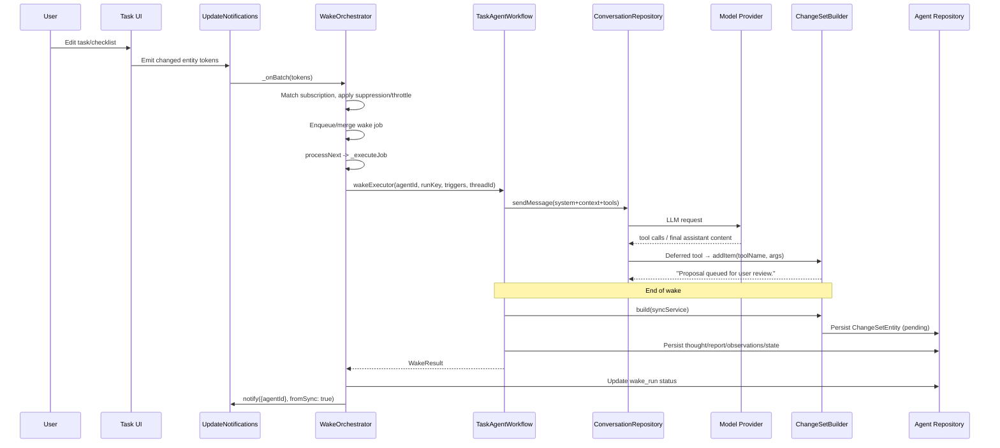
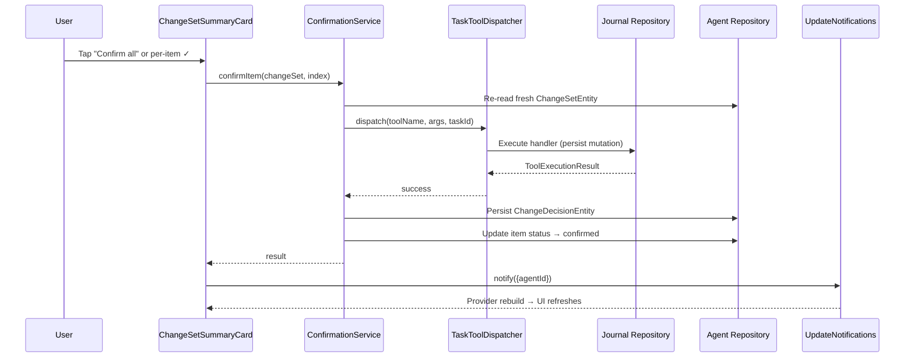

# Agents Architecture

This feature provides persistent, sync-aware agents for Lotti, centered on:

1. Task Agents (production path): wake on task changes, run tool calls, and keep a durable report.
2. Template Evolution Sessions: chat-driven directive evolution with versioned template history.

The system is enabled only when `enableAgents` is true.

## Runtime Scope

- Journal domain (`db.sqlite`): source-of-truth task/checklist/time data.
- Agent domain (`agent.sqlite`): agent identities, state, messages, reports, template versions, wake runs.
- Inference path: template-selected model (`models/gemini-3-flash-preview` default), resolved via AI config.

### Task Context Assembly (Current)

- Task agent wake prompts include:
  - current task JSON context
  - current report + recent observations
  - linked task context
- Linked task context for agents is built directly in
  `TaskAgentWorkflow._buildLinkedTasksContextJson` (forked from
  `AiInputRepository.buildLinkedTasksJson` for the wake path), and injects
  `latestTaskAgentReport` from each linked task's associated task agent (via
  `agent_task` links + `agentReportHead`).
- Linked-task `latestSummary` payloads are stripped before prompt submission
  and are not used for Task Agent execution.
- MTTR chart inputs resolve linked tasks with de-duplicated task fetches to
  avoid repeated journal lookups for shared task links.

## High-Level Architecture

## Call Trees

### 1) Subscription Wake (Task Change -> Agent Run)

### 1b) Change Set Confirmation (User -> Tool Dispatch)

### 2) Manual Reanalysis (Agent Detail -> Immediate Run)

## Sequence Diagrams

### A) Task Edit -> Orchestrated AI Run (with deferred tool confirmation)

### A2) User Confirms Change Set

### B) Template Evolution Chat (UI -> LLM -> Versioning)

## Module Responsibilities

- `wake/`: subscription matching, throttling, queueing, single-flight dispatch, wake-run status.
- `workflow/`: context assembly + LLM orchestration (`TaskAgentWorkflow`, `TemplateEvolutionWorkflow`), change set building (`ChangeSetBuilder`), tool dispatch extraction (`TaskToolDispatcher`).
- `tools/`: declarative tool registry + execution policy/audit wrappers + task tool handlers.
- `service/`: lifecycle APIs for agents/templates, subscription restoration, template versioning/metrics, change set confirmation (`ChangeSetConfirmationService`).
- `sync/`: transaction-aware outbox buffering for agent entity/link writes. All change set operations go through sync for cross-device consistency.
- `state/`: Riverpod DI + read models + initialization wiring + change set providers.
- `ui/`: settings/templates/instances/detail/evolution screens + change set confirmation card (`ChangeSetSummaryCard`).

## Architecture Decision Records

Current-state architecture stays in this README. Decision rationale and
evolution history live in ADRs:

- [`docs/adr/README.md`](../../../docs/adr/README.md)
