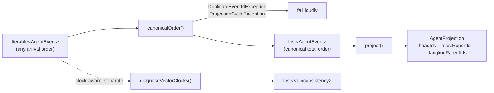
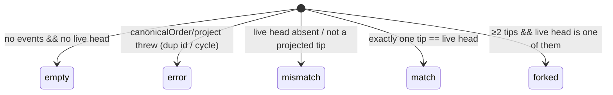

# Projection kernel

A **pure, deterministic** projection over an event-set view of the agent log:
given a *set* of agent events, produce a canonical linear order and fold it into
derived state. The thesis it proves is

> the same event set yields equal projected state regardless of arrival order or
> branching.

If that permutation-invariance holds, the "log is the agent / convergent DAG"
design is real. The kernel (PR 1) still **drives no production read**: PR 3
added the storage adapter and a shadow comparison that run the projection
*alongside* the live mutable rows, but the only importers remain tests and the
diagnostic compare — reads do not flip to the projection until PR 4.

## Files

| File | Responsibility |
| --- | --- |
| `agent_event.dart` | `AgentEvent` — storage-independent causal view + `AgentEventKind`. |
| `canonical_order.dart` | `canonicalOrder()` — deterministic topological sort; `DuplicateEventIdException`, `ProjectionCycleException`. |
| `agent_projection.dart` | `AgentProjection` + `project()` — the clock-free structural fold. |
| `projection_diagnostics.dart` | `diagnoseVectorClocks()` + `VcInconsistency` — vector-clock consistency surface, kept out of the fold. |
| `agent_event_adapter.dart` | `agentEventsFromLog()` — maps persisted `AgentMessageEntity` + `messagePrev` links onto `AgentEvent` (PR 3 bridge). |
| `shadow_projection.dart` | `compareShadowProjection()` + `ShadowProjectionReport`/`Status` — non-throwing compare of the projection against the live head. |

## The causal model (the load-bearing decision)

`causalParents` (the `messagePrev` graph) is the **single canonical source of
truth** for both ordering *and* head detection. Vector clocks are **consistency
metadata** that the kernel *diagnoses* but never orders by.

This matters because the two could otherwise diverge: if vector-clock dominance
drove ordering while heads were reverse-indexed from edges, a missing edge would
leave the order looking causal while the head set was wrong. Deriving both from
one graph makes that divergence impossible by construction. It also means:

- **Cycle detection is a real, reachable, tested path** — a malformed
  `causalParents` cycle makes the topological sort stall and throw. (A
  vector-clock-dominance order is a DAG by construction and could never exercise
  that branch.)
- **Imperfect historical vector clocks do not crash the kernel** — they surface
  as `VcInconsistency` diagnostics for PR 3 to reconcile against live data.

Per ADR 0018 the vector clock remains the cross-device *conflict* signal; here
it is validated, not trusted for order.

## Pipeline

### `canonicalOrder(Iterable<AgentEvent>) → List<AgentEvent>`

Kahn-style topological sort over the parent edges. Among events with no
un-emitted *present* parent, the one with the smallest `(hostId, id)` key is
emitted next — so concurrent branches order deterministically and the result is
identical on every device holding the same set. Cost is `O(V + E)`.

- Takes an `Iterable`, not a `Set`, so duplicate ids are rejected *before* set
  membership could silently collapse or duplicate them.
- Parents referenced but absent from the input (**dangling**) impose no
  constraint — such an event is treated as a root.
- A cycle throws `ProjectionCycleException` rather than emitting a partial order.

### `project(Iterable<AgentEvent> ordered) → AgentProjection`

A pure fold over the canonically-ordered list — **no clocks, no I/O**. Every
field is structural (graph-only):

- `headIds` — events no present event references as a `causalParent` (the DAG
  tips), in canonical order. One chain → one head; a fork → ≥2.
- `latestReportId` — id of the last `report`-kind event in canonical order.
- `danglingParentIds` — referenced-but-absent parent ids, sorted.

### `diagnoseVectorClocks(Iterable<AgentEvent>) → List<VcInconsistency>`

Reports each present parent edge whose `child.vc` does not strictly dominate
`parent.vc`. Deliberately separate from `project()` so the fold stays
clock-free.

## Shadow projection (PR 3)

`agentEventsFromLog(messages, links)` bridges storage to the kernel: each
persisted `AgentMessageEntity` becomes an `AgentEvent` whose `causalParents` are
read from the active `messagePrev` links (the canonical causal graph). A null
message clock maps to an empty clock; `hostId` is left empty, so the tiebreak is
**`id`-only**. That is deliberate and sufficient — event ids are globally-unique
UUIDs, so `id` alone already totally-orders concurrent events; the `hostId` half
of ADR 0018's `(hostId, id)` tuple is the per-replica-counter disambiguator that
a unique id makes redundant for ordering. An explicit authoring-host field is
deferred to the increment that needs it (provenance / per-host accounting / the
PR 7 lease), not synthesized fragilely from the vector clock.

`compareShadowProjection(messages, links, liveHeadId)` runs
`project(canonicalOrder(...))` over that log and compares the projected tips to
the live `recentHeadMessageId`, returning a `ShadowProjectionReport`:

`forked` is *expected* divergence under concurrent multi-device appends, not a
defect — the projection is the more-correct multi-head view while the live
pointer names a single tip. The compare is pure and **never throws**: structural
failures surface as `error`. It drives no production read — only tests and an
optional debug-mode assert.

## Determinism contract

`project(canonicalOrder(S))` is a pure function of the **set of distinct events**
`S` (distinct by `id`). For any ordering or partition two devices might observe,
both compute an equal `AgentProjection`.

## Testing

Pure logic → Glados property tests (tagged `glados`) plus example/edge tests:

- **Permutation-invariance** — sampled random shuffles plus bounded exhaustive
  permutations for small `n`.
- **Causal respect** — every parent precedes its child.
- **Deterministic tiebreak** — concurrent events sort by `(hostId, id)`.
- **Projection determinism & multi-head** — equal projection under any shuffle.
- **Diagnostics** — well-formed DAGs yield none; injected inconsistencies and
  dangling parents are surfaced.
- **Two-device convergence** (`projection_convergence_test.dart`) — the shared
  harness reused by PRs 3–7.
- **Shadow compare** (`shadow_projection_test.dart`) — example statuses plus
  properties: projected heads equal the kernel heads, the status is the
  biconditional of `liveHeadId` vs the projected tips, and the report is
  invariant under input shuffle.
- **Append-path integration** (`append_path_shadow_projection_test.dart`) —
  drives the *real* `AgentSyncService` append path over an in-memory store and
  projects the captured log: a forward corpus reproduces the maintained head
  (`match`), two devices appending off a shared head `fork`, and the fork
  converges order-independently. Properties cover arbitrary chain length and
  fork width.
