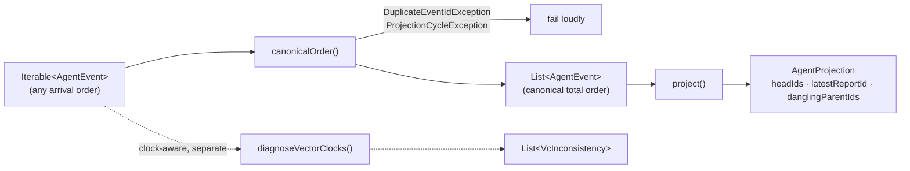
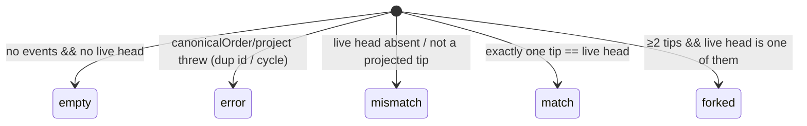

# Projection kernel

A **pure, deterministic** projection over an event-set view of the agent log:
given a *set* of agent events, produce a canonical linear order and fold it into
derived state. The thesis it proves is

> the same event set yields equal projected state regardless of arrival order or
> branching.

If that permutation-invariance holds, the "log is the agent / convergent DAG"
design is real. Foundation A is implemented: PR 3 added the storage adapter and
shadow comparison, PR 4 uses `reconciledAgentState` as the wake-start read, PR 5
uses the content-addressed capture/compaction helpers for wake memory, and PR 6
uses `join_plan.dart` for flag-gated lazy fork healing.

## Files

| File | Responsibility |
| --- | --- |
| `agent_event.dart` | `AgentEvent` — storage-independent causal view + `AgentEventKind`. |
| `canonical_order.dart` | `canonicalOrder()` — deterministic topological sort; `DuplicateEventIdException`, `ProjectionCycleException`. |
| `agent_projection.dart` | `AgentProjection` + `project()` — the clock-free structural fold. |
| `projection_diagnostics.dart` | `diagnoseVectorClocks()` + `VcInconsistency` — vector-clock consistency surface, kept out of the fold. |
| `agent_event_adapter.dart` | `agentEventsFromLog()` — maps persisted `AgentMessageEntity` + `messagePrev` links onto `AgentEvent` (PR 3 bridge). |
| `shadow_projection.dart` | `compareShadowProjection()` + `ShadowProjectionReport`/`Status` — non-throwing compare of the projection against the live head. |
| `derived_agent_state.dart` | `deriveAgentState()` + `DerivedAgentState` — the storage-coupled full-state fold (kernel + watermarks + active slots); `compareDerivedAgentState()` + `DerivedStateReport` — full-state shadow compare (PR 4 B5); `reconcileAgentState()` — folds the log over the cached row for the wake-start read cutover (PR 4 B6). |
| `content_digest.dart` | `ContentDigest.of()` — versioned (`sha256-v1:`) content-addressed digest over canonical JSON; the address for captured inputs, compaction artifacts, and join ids (PR 5 / ADR 0017 §6 / ADR 0020). |
| `input_capture.dart` | `RenderedSource`/`CapturedPayload`/`CaptureReference`/`CaptureResult`; `captureSources()` + `reconcileCapture()` — fold a wake's rendered user content into deduplicated, content-addressed per-source captures (PR 5 / ADR 0020). |
| `input_frontier.dart` | `projectInputFrontier()` + `inputFrontierDigests()` — the active input frontier (latest-wins over `messagePayload` links and retraction markers). |
| `input_events.dart` | `InputEvent` (+ `.inline`/`.inlineDeferred`), `EventPosition`, `InputEventLog`, `projectInputEvents()` — the append-only event-log read model: `messagePayload` links, observations, and retraction markers projected as one position-ordered stream. |
| `decision_events.dart` | `decisionEventsFromLedger()` + `formatResolvedLedgerLine()` — resolved proposal verdicts projected as inline log events so they fold/interleave on the same substrate. |
| `compaction_plan.dart` | `planCompaction()` + `CompactionPlan`/`TailEntry` — fold the oldest tail prefix that overflows a token budget (PR 5 / ADR 0017). |
| `compaction_summary.dart` | `selectActiveSummary()` (event-prefix maximal-complete checkpoint) + `assembleCompactedTaskLog()` — the read side: active summary + uncovered verbatim tail with source ids. |
| `checkpoint_selection.dart` | `selectActiveCheckpoint()` — message-DAG checkpoint selection (deepest summary ancestral to every head). |
| `join_plan.dart` | `computeJoinId()` + `planJoin()`/`JoinPlan` — fork-healing decision (PR 6 / ADR 0018 rule 8): the content-addressed join id and the ≥2-heads-over-a-complete-view gate. |

## The causal model (the load-bearing decision)

`causalParents` (the `messagePrev` graph) is the **single canonical source of
truth** for both ordering *and* head detection. Vector clocks are **consistency
metadata** that the kernel *diagnoses* but never orders by.

This matters because the two could otherwise diverge: if vector-clock dominance
drove ordering while heads were reverse-indexed from edges, a missing edge would
leave the order looking causal while the head set was wrong. Deriving both from
one graph makes that divergence impossible by construction. It also means:

- **Cycle detection is a real, reachable, tested path** — a malformed
  `causalParents` cycle makes the topological sort stall and throw. (A
  vector-clock-dominance order is a DAG by construction and could never exercise
  that branch.)
- **Imperfect historical vector clocks do not crash the kernel** — they surface
  as `VcInconsistency` diagnostics for PR 3 to reconcile against live data.

Per ADR 0018 the vector clock remains the cross-device *conflict* signal; here
it is validated, not trusted for order.

## Pipeline

### `canonicalOrder(Iterable<AgentEvent>) → List<AgentEvent>`

Kahn-style topological sort over the parent edges. Among events with no
un-emitted *present* parent, the one with the smallest `(hostId, id)` key is
emitted next — so concurrent branches order deterministically and the result is
identical on every device holding the same set. Cost is `O(V + E)`.

- Takes an `Iterable`, not a `Set`, so duplicate ids are rejected *before* set
  membership could silently collapse or duplicate them.
- Parents referenced but absent from the input (**dangling**) impose no
  constraint — such an event is treated as a root.
- A cycle throws `ProjectionCycleException` rather than emitting a partial order.

### `project(Iterable<AgentEvent> ordered) → AgentProjection`

A pure fold over the canonically-ordered list — **no clocks, no I/O**. Every
field is structural (graph-only):

- `headIds` — events no present event references as a `causalParent` (the DAG
  tips), in canonical order. One chain → one head; a fork → ≥2.
- `latestReportId` — id of the last `report`-kind event in canonical order.
- `danglingParentIds` — referenced-but-absent parent ids, sorted.

### `diagnoseVectorClocks(Iterable<AgentEvent>) → List<VcInconsistency>`

Reports each present parent edge whose `child.vc` does not strictly dominate
`parent.vc`. Deliberately separate from `project()` so the fold stays
clock-free.

## Shadow projection (PR 3)

`agentEventsFromLog(messages, links)` bridges storage to the kernel: each
persisted `AgentMessageEntity` becomes an `AgentEvent` whose `causalParents` are
read from the active `messagePrev` links (the canonical causal graph). A null
message clock maps to an empty clock; `hostId` is left empty, so the tiebreak is
**`id`-only**. That is deliberate and sufficient — event ids are globally-unique
UUIDs, so `id` alone already totally-orders concurrent events; the `hostId` half
of ADR 0018's `(hostId, id)` tuple is the per-replica-counter disambiguator that
a unique id makes redundant for ordering. An explicit authoring-host field is
deferred to the increment that needs it (provenance / per-host accounting / the
PR 7 lease), not synthesized fragilely from the vector clock.

`compareShadowProjection(messages, links, liveHeadId)` runs
`project(canonicalOrder(...))` over that log and compares the projected tips to
the live `recentHeadMessageId`, returning a `ShadowProjectionReport`:

`forked` is *expected* divergence under concurrent multi-device appends, not a
defect — the projection is the more-correct multi-head view while the live
pointer names a single tip. The compare is pure and **never throws**: structural
failures surface as `error`. The compare itself remains diagnostic; production
reads use the reconciliation and fork-healing paths described below.

## Full derived state (PR 4 B5)

The kernel stays the *minimal causal view* (heads + latest report). The **full**
agent state is a storage-coupled composite, `deriveAgentState(agentId, messages,
links)` → `DerivedAgentState`, that calls the kernel for the structural part and
aggregates the *order-independent* fields directly off the log:

- **watermarks** (`lastWakeAt`, `slots.last{OneOnOne,FeedbackScan,DailyWake,WeeklyReview}At`)
  = `max(createdAt)` of messages whose `metadata.milestone` matches (the B2
  markers);
- **active slots** (`activeTask/Project/Day/TemplateId`) = the `toId` of the
  agent's primary active association link (`agentTask`/`agentProject`/`agentDay`/
  `improverTarget`, `fromId == agentId`, same most-recent tiebreak the live
  services use).

Each is a pure function of the log's *set*, so the whole `DerivedAgentState`
converges across arrival orders and partitions — the property the LWW cache
cannot guarantee. The kernel and `AgentEvent` are deliberately **not** enriched
with this derivation-specific data; it lives in this composite alone.

Deliberately **out** of the fold: per-host G-counter sums (`wakeCounter`,
`totalSessionsCompleted`, `weeklyReviewCount`) are already convergent (PR 2b) and
read as `.value` off the synced row; `awaitingContent` has no backing log event
yet (set by creation mode, cleared by the orchestrator) and stays on the cache;
runtime-local / best-effort fields stay on the cache by design.

`compareDerivedAgentState(messages, links, liveState)` → `DerivedStateReport`
extends the shadow check to the full state: the head via
`compareShadowProjection` (fork-tolerant) plus exact per-field comparison of the
watermarks and slots, listing any `DerivedFieldMismatch`. `equivalent` is the B6
cutover precondition (head reconciles + no field diverges). Drives no production
read.

## The read cutover (PR 4 B6)

`reconcileAgentState(cache, messages, links)` folds the log over the cached
`AgentStateEntity` and returns the corrected row — the read a wake acts on. It is
**not** a blind "log wins": watermarks reconcile to `max(derived, cache)`
(monotonic — never regress a value the cache holds but the log lacks yet, e.g. an
agent predating the B2 markers; self-heal a value lost to LWW under a partition),
and slots to `derived ?? cache` (link-derived wins, cache is the fallback for
agents predating their slot link). The append-maintained `recentHeadMessageId`,
the convergent G-counters, device-local scheduling, and `awaitingContent` are left
on the cache by construction. It returns the cache value-unchanged when nothing
diverged, so callers skip a redundant persist.

`AgentSyncService.reconciledAgentState(agentId)` orchestrates it (load → reconcile
→ persist only if changed) and is the wake-start read in all four wake workflows;
the persist propagates a heal to peers. UI/service reads stay on the raw cache
(eventual). This is what demotes `AgentStateEntity` to a regenerable cache: the
PR 2 resolver still picks a transient LWW value on sync, but the next wake-start
reconcile recomputes the same value on every device, so divergence can no longer
persist.

## Determinism contract

`project(canonicalOrder(S))` is a pure function of the **set of distinct events**
`S` (distinct by `id`). For any ordering or partition two devices might observe,
both compute an equal `AgentProjection`.

## Testing

Pure logic → Glados property tests (tagged `glados`) plus example/edge tests:

- **Permutation-invariance** — sampled random shuffles plus bounded exhaustive
  permutations for small `n`.
- **Causal respect** — every parent precedes its child.
- **Deterministic tiebreak** — concurrent events sort by `(hostId, id)`.
- **Projection determinism & multi-head** — equal projection under any shuffle.
- **Diagnostics** — well-formed DAGs yield none; injected inconsistencies and
  dangling parents are surfaced.
- **Two-device convergence** (`projection_convergence_test.dart`) — the shared
  harness reused by PRs 3–7.
- **Shadow compare** (`shadow_projection_test.dart`) — example statuses plus
  properties: projected heads equal the kernel heads, the status is the
  biconditional of `liveHeadId` vs the projected tips, and the report is
  invariant under input shuffle.
- **Append-path integration** (`append_path_shadow_projection_test.dart`) —
  drives the *real* `AgentSyncService` append path over an in-memory store and
  projects the captured log: a forward corpus reproduces the maintained head
  (`match`), two devices appending off a shared head `fork`, and the fork
  converges order-independently. Properties cover arbitrary chain length and
  fork width.
- **Full derived state** (`derived_agent_state_test.dart`) — per-field fold of
  watermarks (max-per-milestone, deleted/untagged ignored) and active slots
  (most-recent link wins, other-agent/deleted/wrong-type ignored); a property
  that `deriveAgentState` is invariant under input shuffle (two devices on the
  same set converge); and `compareDerivedAgentState` equivalence, field-mismatch
  reporting, and structural-error capture.
- **Reconcile + cutover** (`derived_agent_state_test.dart`) — `reconcileAgentState`
  migration-safety (never nulls a cached watermark/slot the log lacks yet),
  self-heal of a clobbered watermark, slot link-vs-cache fallback,
  non-derived fields untouched; a property that it never regresses a watermark and
  is idempotent; and a partition+heal convergence sim (two divergent caches
  reconcile to the same watermark and most-recent slot). The orchestration
  (`reconciledAgentState`: load → reconcile → persist-only-on-divergence) is
  covered in `agent_sync_service_test.dart`.
