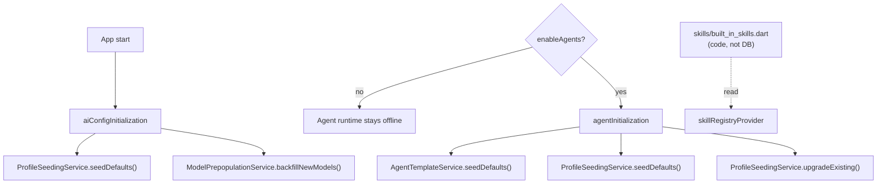
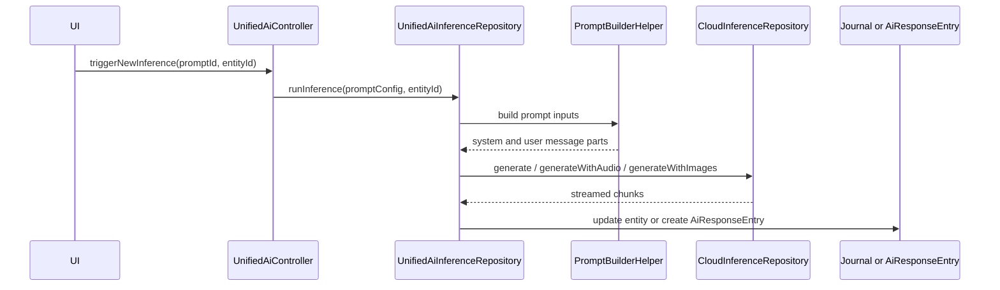
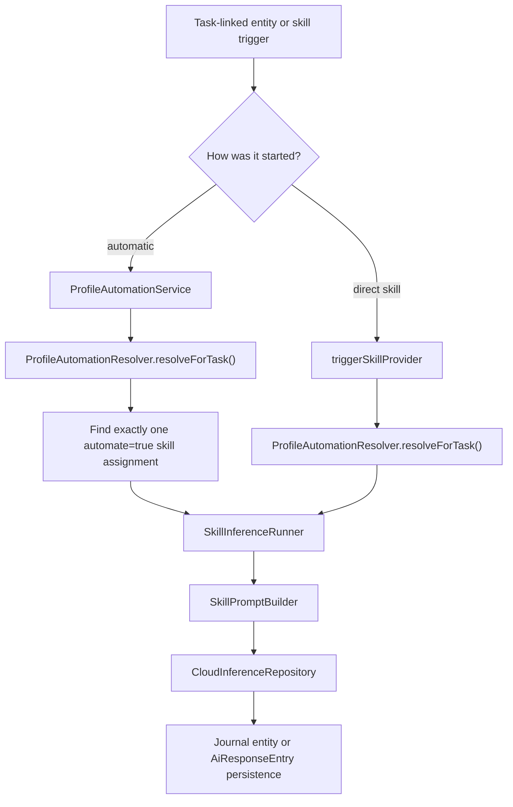
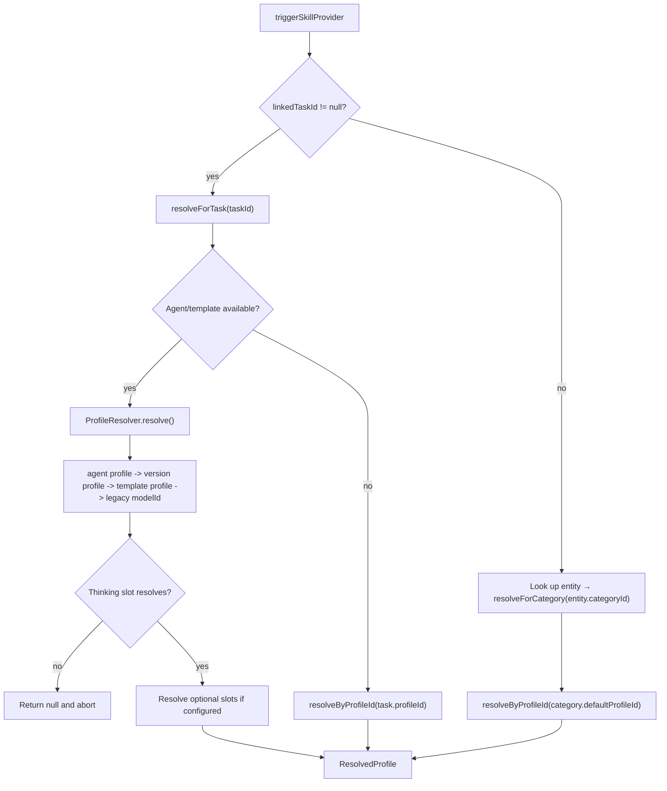
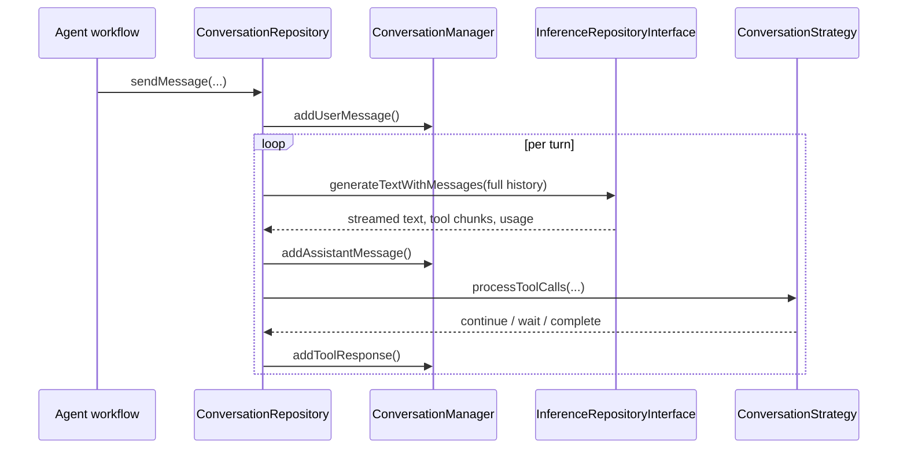
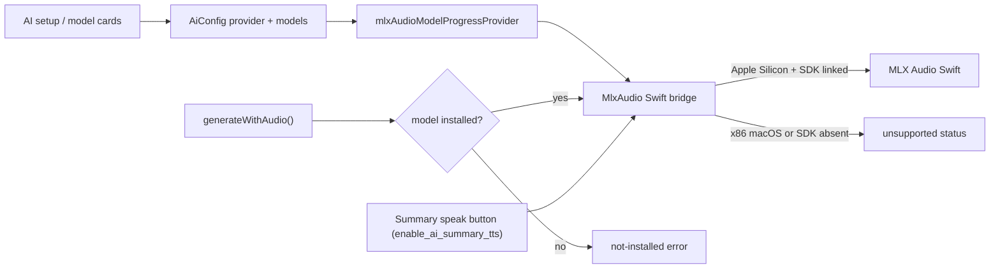

# AI Feature

The `ai` feature contains the shared AI plumbing used by manual prompts, skill-driven flows, agent conversations, and semantic search. It owns configuration persistence, prompt assembly, provider routing, conversation state, and embeddings. It does not decide when an agent wakes or what an agent's lifecycle looks like; that boundary sits in `features/agents`.

## Runtime Boundary

Two startup paths shape the feature:

- `aiConfigInitialization` always runs and seeds default inference profiles plus known models.
- `agentInitialization` runs only when the agents flag is enabled and then seeds templates and upgrades default profiles with skill assignments.

Skills do **not** participate in seeding — they live as code in `skills/built_in_skills.dart` and are read from `skillRegistryProvider` at runtime. The DB-backed `SkillSeedingService` was removed; a future skill-management feature will introduce a separate per-user override layer rather than re-introducing seeding.

## Configuration Model

`AiConfigRepository` persists all AI configuration objects in `AiConfigDb` and syncs changes through the outbox layer. The runtime is built from five config variants plus one resolved runtime object:

| Object | Stored as | Used by |
| --- | --- | --- |
| Provider | `AiConfig.inferenceProvider` | Base URL, API key, and provider type |
| Model | `AiConfig.model` | Provider model ID, modalities, function-calling support |
| Prompt | `AiConfig.prompt` | Legacy/manual prompt execution through `UnifiedAiInferenceRepository` |
| Profile | `AiConfig.inferenceProfile` | Capability slots for thinking, transcription, vision, and image generation |
| Skill | `AiConfig.skill` (defined in code) | Capability contract plus `ContextPolicy`. Built-ins live in `skills/built_in_skills.dart`; not persisted in the DB |
| Resolved profile | `ResolvedProfile` | Runtime profile with providers hydrated from configured model IDs |

The key split is between skills and profiles:

- a skill defines the instructions and how much context to inject
- a profile defines which configured model/provider slot executes that skill

That split is what lets the app move the same skill between providers without rewriting the prompt contract.

## Main Execution Paths

### Legacy prompt path

This is the older prompt-driven flow based on `AiConfig.prompt`.

1. `UnifiedAiController` loads an `AiConfigPrompt`.
2. `UnifiedAiInferenceRepository` validates whether the prompt fits the current entity and platform.
3. `PromptBuilderHelper` prepares prompt-specific task, audio, image, and linked-entity context.
4. `CloudInferenceRepository` routes the request to the correct provider implementation.
5. The result is written back to the journal entity or persisted as an `AiResponseEntry`, depending on `AiResponseType`.

Notes grounded in code:

- `AiResponseType.taskSummary` and `AiResponseType.checklistUpdates` are deprecated and kept for persistence compatibility.
- Prompt generation also exists in the skill path via `SkillInferenceRunner.runPromptGeneration()`.

### Profile and skill path

This is the newer path built around `AiConfig.skill`, `AiConfig.inferenceProfile`, `ProfileResolver`, and `SkillInferenceRunner`.

There are two entry styles:

- automatic profile-driven handling through `ProfileAutomationService`
- direct skill execution through `triggerSkillProvider`

Today the automatic path is narrower than the direct one:

- automatic: `tryTranscribe()` and `tryAnalyzeImage()`
- direct: transcription, image analysis, prompt generation, and image generation

`imagePromptGeneration` is seeded as a skill, but `triggerSkillProvider` does not execute it yet.

The automatic branch is intentionally strict:

- it only handles a skill type when exactly one automated assignment matches
- if multiple automated skills of the same type exist, the profile is treated as ambiguous and automation is skipped
- the resolved profile must expose the required model slot for that skill type

`SkillInferenceRunner` then persists results according to skill type:

- transcription updates `JournalAudio.transcripts` and `entryText`
- image analysis appends text to the `JournalImage` entry
- prompt generation creates an `AiResponseEntry`
- image generation imports a generated image, sets it as task cover art, then triggers automatic image analysis on the generated image

#### Context injection

`SkillPromptBuilder` is the only place that assembles runtime skill messages. It injects context based on `ContextPolicy` and skill type:

- `none`: no extra task context
- `dictionaryOnly`: speech dictionary only
- `taskSummary`: current task summary only
- `fullTask`: task JSON, linked tasks, and other richer context

In practice the builder may also inject:

- speech dictionary terms
- linked task JSON
- current task summary
- audio transcript text
- correction examples
- URL-formatting rules for image analysis

## Profile Resolution

`ProfileResolver` is the shared resolution engine for agent wakes. `ProfileAutomationResolver` wraps it for skill execution and offers two entry points:

- `resolveForTask(taskId)` — task-linked execution. Tries the agent path, then falls back to the task's own `profileId`.
- `resolveForCategory(categoryId)` — standalone entries (no parent task). Reads `CategoryDefinition.defaultProfileId` and resolves it directly through `ProfileResolver.resolveByProfileId`.

`triggerSkillProvider` selects between the two: when `linkedTaskId` is non-null it calls `resolveForTask`; otherwise it looks up the entry, reads its `categoryId`, and calls `resolveForCategory`. Skills whose `contextPolicy` is `fullTask` are filtered out of the popup for standalone entries (see [Skill Filtering](#skill-filtering) below), so the standalone branch only runs `dictionaryOnly` / `taskSummary` / `none` skills.

Resolution order for the agent path:

1. `agentConfig.profileId`
2. `AgentTemplateVersionEntity.profileId`
3. `AgentTemplateEntity.profileId`
4. legacy fallback: `version.modelId ?? template.modelId`

Resolution order for `resolveForTask`:

1. try the agent path above
2. if that fails, try the task's own `profileId`

Resolution for `resolveForCategory`:

1. read `CategoryDefinition.defaultProfileId`
2. resolve it through `ProfileResolver.resolveByProfileId`

Only the thinking slot is fatal. Optional slots resolve best-effort.

Recording-triggered transcription has a direct fallback in
`ProfileAutomationService`: it first tries the profile automation path above,
then scans configured audio-to-text model rows when no profile handles
transcription. The fallback builds an ephemeral `ResolvedProfile` around the
selected model and the built-in `Transcribe (Task Context)` skill; it does not
persist a profile. Candidate ranking prefers the recommended MLX Audio
Qwen3-ASR model, then other MLX Qwen3-ASR rows, then other configured STT
providers that have the required API key. This keeps local/mobile STT available
when the user has installed MLX Audio but the desktop-only local profile is not
available on that device.

### Skill Filtering

`availableSkillsForEntityProvider((entityId, linkedFromId))` filters the skill registry per entity. The popup uses it (via `hasAvailableSkillsProvider`) to decide what to show:

- Modality filter — `Modality.audio` only matches `JournalAudio`, `Modality.image` only matches `JournalImage`, `Modality.text` matches any entity with text content (`JournalAudio` qualifies via its transcript).
- Task-context filter — a skill is considered to "need a task" iff `contextPolicy == ContextPolicy.fullTask`. When the entity is not a `Task` and `linkedFromId` is null (a standalone entry), these skills are hidden. Same skill on a task or on an entry linked from a task remains visible.

The seeded task-context skills (`Transcribe (Task Context)`, `Analyze Image (Task Context)`, `Generate Cover Art`, the coding/design/research prompt generators) are therefore hidden for standalone entries; only their plain counterparts (`Transcribe Audio`, `Analyze Image`) show up. `triggerSkillProvider` also has a defensive guard: a `fullTask` skill triggered without a `linkedTaskId` is captured as an event and aborted — the popup should never offer one in that state, so reaching it is a caller bug.

## Conversation and Tool Calling

`ConversationRepository` and `ConversationManager` provide the reusable multi-turn conversation loop used by agent-style tool calling.

Responsibilities in code:

- preserve conversation history
- emit conversation events for the UI
- accumulate streamed tool calls across chunks
- keep Gemini thought signatures between turns
- re-enter the loop through a `ConversationStrategy` after tool execution

`CloudInferenceWrapper` adapts `CloudInferenceRepository` to `InferenceRepositoryInterface`, so cloud and local providers can participate in the same conversation loop.

Implementation details that matter:

- tool call arguments are buffered by stable tool call ID or index so streamed JSON is reassembled safely
- Gemini-specific thought signatures are stored in `ConversationManager` and replayed on later turns
- the repository has provider-specific handling for Gemini-style multi-call chunks that arrive without stable IDs

## Provider Routing

`CloudInferenceRepository` is the central router despite its name; it also handles local providers such as Ollama, Whisper, Voxtral, and MLX Audio.

| Operation | Dedicated branches | Fallback |
| --- | --- | --- |
| `generate()` | Ollama, Gemini, Mistral | OpenAI-compatible chat streaming |
| `generateWithImages()` | Ollama | OpenAI-compatible multimodal chat |
| `generateWithAudio()` | Whisper, Voxtral, MLX Audio native bridge, OpenAI transcription endpoint, Mistral transcription endpoint | OpenAI-compatible audio chat completions |
| `generateWithMessages()` | Gemini, Ollama, Mistral | OpenAI-compatible full-history chat |
| `generateImage()` | Gemini, Alibaba DashScope | Unsupported for all other provider types |

This routing is implemented in code, not inferred from documentation. If a provider type is not branched explicitly for an operation, it falls through to the compatibility client or throws `UnsupportedError`.

MLX Audio is intentionally not a localhost provider. Flutter owns provider/model
configuration and progress state, while `MlxAudioChannel` talks to platform
Swift over `com.matthiasn.lotti/mlx_audio`. The Swift files compile without the
MLX package and return `unsupported` unless the MLX Audio SDK is linked on
Apple Silicon; that keeps Intel macOS builds working with the feature disabled.
The seeded MLX Audio catalog includes Voxtral Realtime, Qwen3-ASR 0.6B,
Qwen3-ASR 1.7B 4-bit and 8-bit, Parakeet, and Qwen3-TTS.
The setup flow asks which STT model to install first, with Qwen3-ASR 1.7B
8-bit preselected because it is much faster than Voxtral Realtime in
post-recording use. Voxtral remains available as an explicit comparison model.

Download status is centralized in `MlxAudioModelProgressStore`. The store owns
the single native EventChannel subscription, keeps the latest payload by model
id, and exposes `mlxAudioModelProgressProvider(modelId)` to cards and dialogs.
This prevents provider/model overview rows from stealing the native stream from
the modal, and lets a running download be reopened from the model row.

Inference does not implicitly download MLX models. `installModel` is the only
path that downloads from Hugging Face; transcription and realtime start first
verify that the cache contains a complete model and otherwise return a
not-installed failure. This keeps a recording-triggered STT run from starting a
multi-GB background download or loading a partial cache. The Swift bridge also
logs resource snapshots at `transcribe.request`, model load, audio preparation,
and generation stages so native crash reports can be matched to the last MLX
step that ran.

AI-summary TTS remains wired through the native MLX Audio channel on macOS, but
the task card button is hidden unless `enable_ai_summary_tts` is enabled in
config flags. The default is off while local TTS model quality and runtime
behavior are still being evaluated. iOS does not link the upstream
`MLXAudioTTS` product yet because its Moss TTS target is not archive-safe on
iOS; the iOS `speakText` method returns `unsupported` while STT remains linked.

For speech dictionary support, `UnifiedAiInferenceRepository` and
`SkillInferenceRunner` still resolve category dictionary terms through
`PromptBuilderHelper.getSpeechDictionaryTerms()`. The MLX Audio branch forwards
those terms across the channel with the transcription request. Qwen3-ASR uses
that list as prompt context for post-recording transcription today; Mistral
continues to use its dedicated `context_bias` parameter. Decoder-level
dictionary/G2P integration remains a separate native bridge follow-up once that
SDK surface is stable.

## Embeddings and Semantic Search

The feature also owns local embeddings and vector search.

Runtime pieces:

- `EmbeddingService` listens to local update notifications and performs real-time embedding work
- `EmbeddingProcessor` hashes content, chunks text, generates embeddings, and writes them atomically
- `EmbeddingStore` is the storage abstraction
- `ShardedEmbeddingStore` is the production implementation, backed by per-category ObjectBox shards
- `VectorSearchRepository` embeds the query through Ollama and resolves hits back to tasks or entries

Grounded implementation notes:

- the feature is gated by `enableEmbeddingsFlag`
- embeddings currently depend on a resolvable Ollama base URL
- tasks can be embedded with label-enriched text, not just raw title/body
- agent reports are stored with `taskId` metadata so search results can resolve back to the owning task

## Seeded Defaults

`ProfileSeedingService.seedDefaults()` currently seeds these profiles:

- `Gemini Flash`
- `Gemini Pro`
- `OpenAI`
- `Mistral (EU)`
- `Chinese AI Profile`
- `Anthropic Claude`
- `Local (Ollama)`
- `Local Power (Ollama)`

Operational details from the seeded definitions:

- the two local profiles are `desktopOnly`
- `Local (Ollama)` ships with image-analysis automation but no transcription slot
- `Local Power (Ollama)` currently ships with no default skill assignments

`seedDefaults()` is **strictly seed-on-create**: it looks up each profile by its well-known ID and writes only when the row is missing. Once a profile exists, the seeder never touches it again — user edits to model slots, the `isDefault` flag, names, descriptions, and skill assignments survive every restart and app upgrade. Updating a bundled default in code (e.g. swapping the Ollama thinking model) therefore only affects fresh installs; existing installs keep whatever the user has.

`upgradeExisting()` is a one-time backfill that adds default `skillAssignments` to existing default profiles whose `skillAssignments` are still empty (legacy installs from before the field existed). It only ever fills empties — non-empty assignment lists are preserved.

`skills/built_in_skills.dart` currently exposes nine built-in skills:

- `Transcribe Audio`
- `Transcribe (Task Context)`
- `Analyze Image`
- `Analyze Image (Task Context)`
- `Generate Cover Art`
- `Generate Coding Prompt`
- `Generate Image Prompt`
- `Generate Design Prompt` — produces a UI/UX design exploration prompt requesting 5 functional prototypes by default, aligned with any design system mentioned in the task context, with clarifying questions surfaced up front. Output is two-section Markdown ready to paste into Claude / Figma Make / v0.dev.
- `Generate Research Prompt` — produces a structured Markdown research brief (Background, Research Questions, Scope, Deliverables, Source Preferences, expected output format, open questions) ready to paste into Claude with Research or ChatGPT Pro with Deep Research.

The prompt-generation and image-generation skills accept any text-bearing entry — both `JournalAudio` (via its transcript) and `JournalEntry` (typed notes) flow through the same `_resolveEntryContent` resolver in `SkillInferenceRunner`.

## Sharp Edges

- The prompt system and the skill/profile system still coexist. Both are active in the codebase.
- Automatic profile-driven handling currently covers only transcription and image analysis.
- `imagePromptGeneration` is seeded but not wired for execution in `triggerSkillProvider`.
- Image generation is currently implemented only for Gemini and Alibaba providers.
- Data residency is not enforced by code. Most request destinations are whatever `baseUrl` is configured on the selected provider; MLX Audio is the exception and stays inside the app process when supported.
- MLX Audio model inference is compile-gated in Swift. x86 macOS reports the models as unsupported instead of loading Apple Silicon-only libraries.

## Reading Guide

If you are tracing the feature in code, start here:

- `model/ai_config.dart`
- `repository/ai_config_repository.dart`
- `state/ai_config_initialization.dart`
- `util/profile_seeding_service.dart`
- `skills/built_in_skills.dart`
- `util/profile_resolver.dart`
- `services/profile_automation_service.dart`
- `services/skill_inference_runner.dart`
- `helpers/skill_prompt_builder.dart`
- `conversation/`
- `repository/cloud_inference_repository.dart`
- `service/embedding_service.dart`
- `repository/vector_search_repository.dart`
- `ui/settings/` for provider/model/prompt/profile/skill editors

For the lifecycle layer that sits above this plumbing, continue with [../agents/README.md](../agents/README.md).
