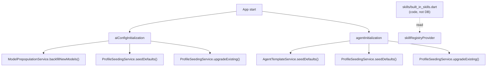
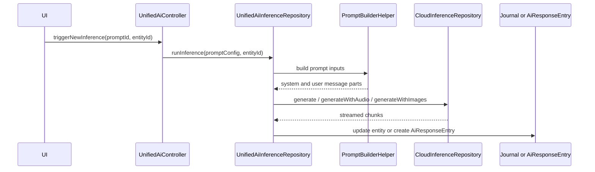
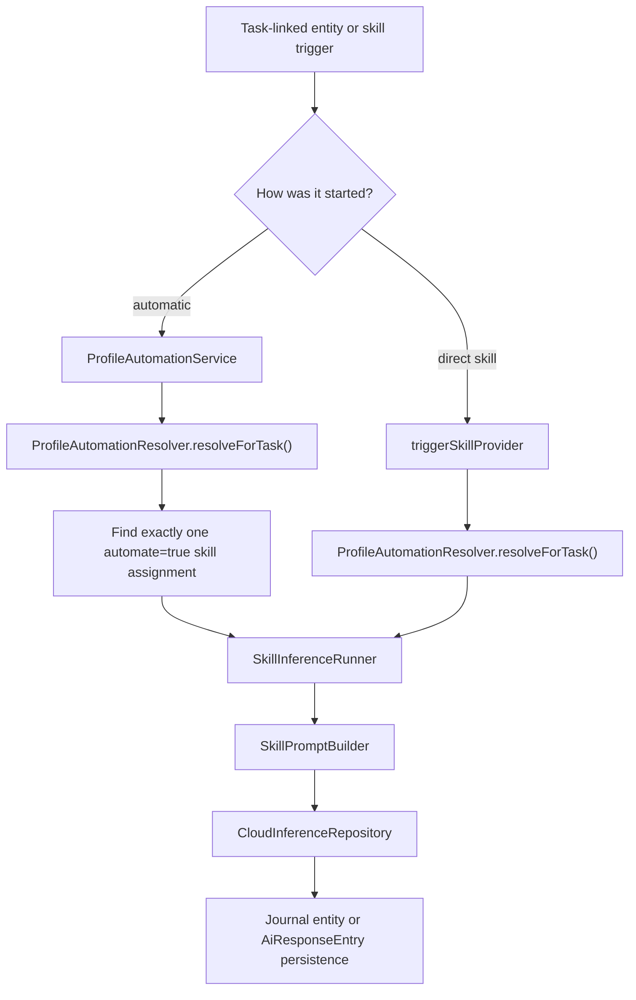
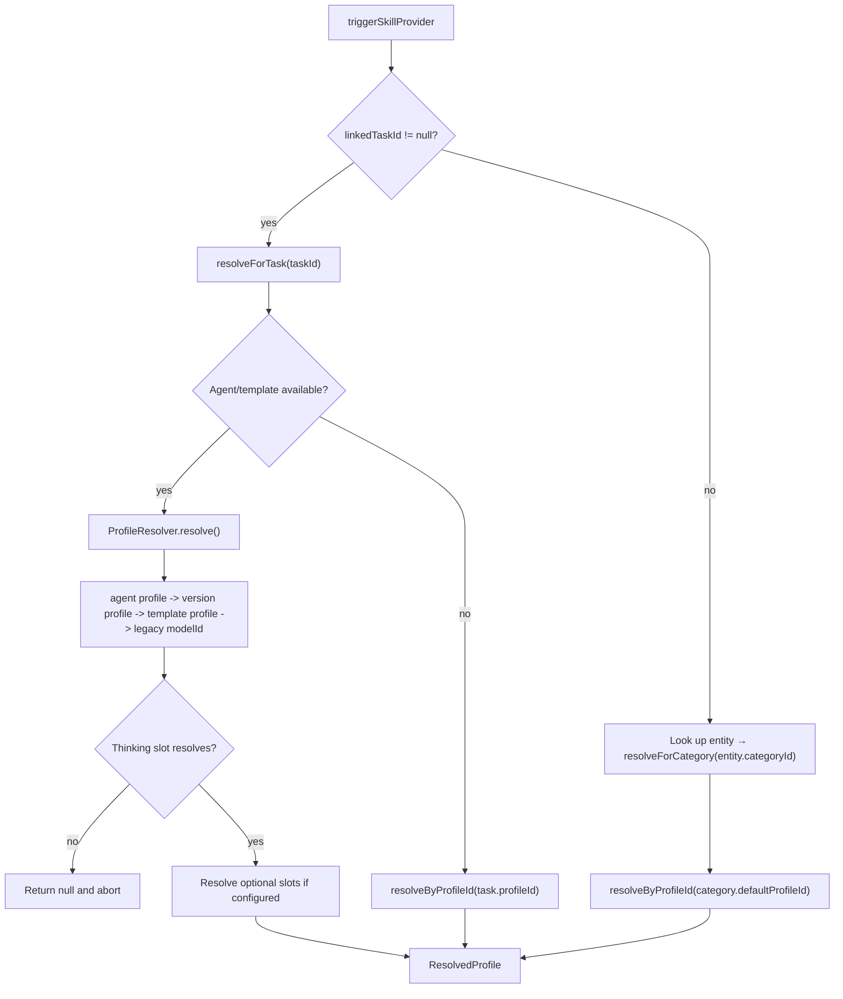
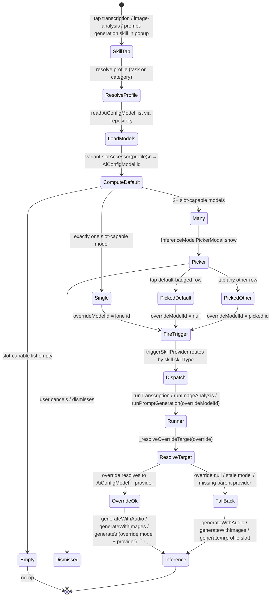
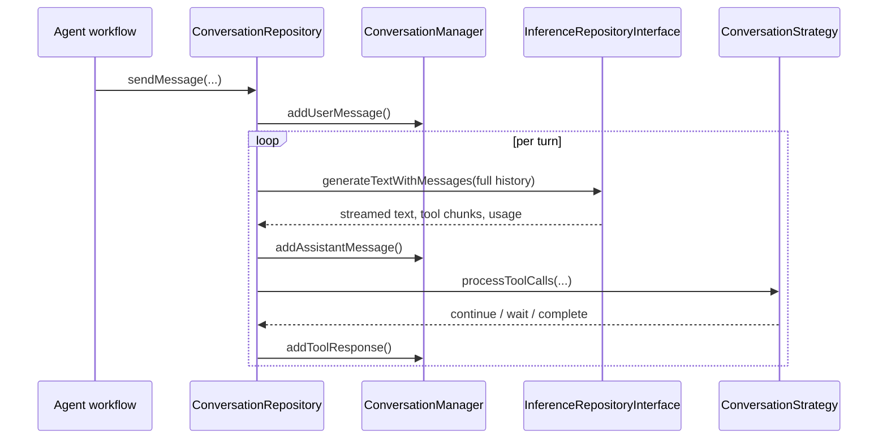
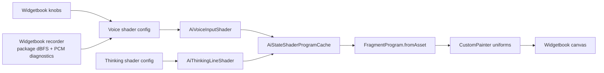
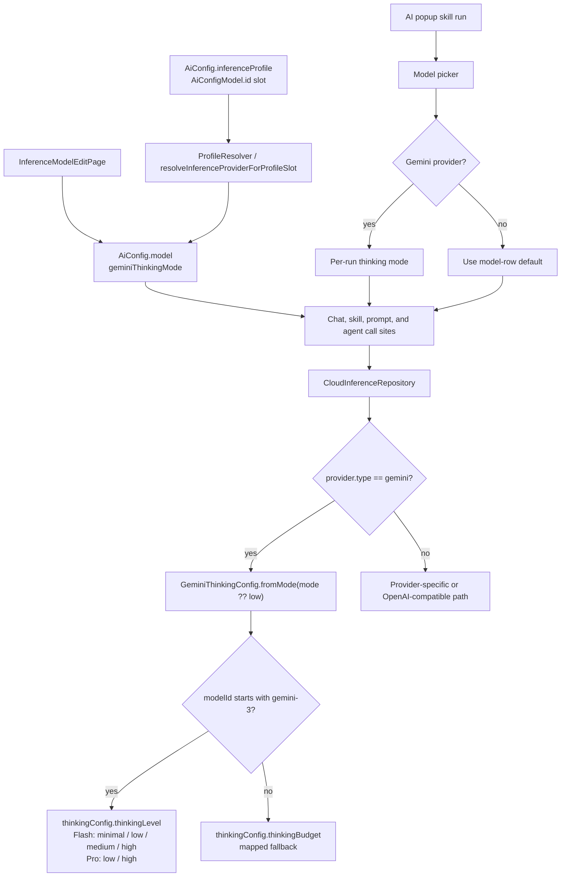
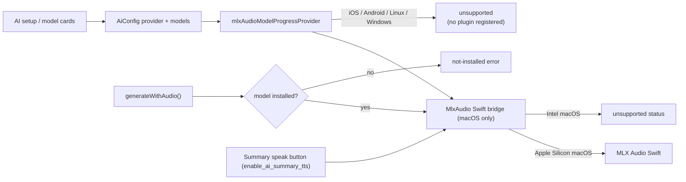

# AI Feature

The `ai` feature contains the shared AI plumbing used by manual prompts, skill-driven flows, agent conversations, and semantic search. It owns configuration persistence, prompt assembly, provider routing, conversation state, and embeddings. It does not decide when an agent wakes or what an agent's lifecycle looks like; that boundary sits in `features/agents`.

## Runtime Boundary

Two startup paths shape the feature:

- `aiConfigInitialization` always runs and seeds default inference profiles plus known models.
- `agentInitialization` also always runs (it is not gated by any flag); it seeds templates and upgrades default profiles with skill assignments.

Skills do **not** participate in seeding — they live as code in `skills/built_in_skills.dart` and are read from `skillRegistryProvider` at runtime. The DB-backed `SkillSeedingService` was removed; a future skill-management feature will introduce a separate per-user override layer rather than re-introducing seeding.

## Configuration Model

`AiConfigRepository` persists all AI configuration objects in `AiConfigDb` and syncs changes through the outbox layer. The runtime is built from five config variants plus one resolved runtime object:

| Object | Stored as | Used by |
| --- | --- | --- |
| Provider | `AiConfig.inferenceProvider` | Base URL, API key, and provider type |
| Model | `AiConfig.model` | Provider model ID, modalities, function-calling support, Gemini thinking mode |
| Prompt | `AiConfig.prompt` | Legacy/manual prompt execution through `UnifiedAiInferenceRepository` |
| Profile | `AiConfig.inferenceProfile` | Capability slots for thinking, transcription, vision, and image generation |
| Skill | `AiConfig.skill` (defined in code) | Capability contract plus `ContextPolicy`. Built-ins live in `skills/built_in_skills.dart`; not persisted in the DB |
| Resolved profile | `ResolvedProfile` | Runtime profile with providers hydrated from configured model IDs |

The key split is between skills and profiles:

- a skill defines the instructions and how much context to inject
- a profile defines which configured model/provider slot executes that skill

That split is what lets the app move the same skill between providers without rewriting the prompt contract.

## Main Execution Paths

### Legacy prompt path

This is the older prompt-driven flow based on `AiConfig.prompt`.

1. `UnifiedAiController` loads an `AiConfigPrompt`.
2. `UnifiedAiInferenceRepository` validates whether the prompt fits the current entity and platform.
3. `PromptBuilderHelper` prepares prompt-specific task, audio, image, and linked-entity context.
4. `CloudInferenceRepository` routes the request to the correct provider implementation.
5. The result is written back to the journal entity or persisted as an `AiResponseEntry`, depending on `AiResponseType`.

Notes grounded in code:

- `AiResponseType.taskSummary` and `AiResponseType.checklistUpdates` are deprecated and kept for persistence compatibility.
- Prompt generation also exists in the skill path via `SkillInferenceRunner.runPromptGeneration()`.

### Profile and skill path

This is the newer path built around `AiConfig.skill`, `AiConfig.inferenceProfile`, `ProfileResolver`, and `SkillInferenceRunner`.

There are two entry styles:

- automatic profile-driven handling through `ProfileAutomationService`
- direct skill execution through `triggerSkillProvider`

Today the automatic path is narrower than the direct one:

- automatic: `tryTranscribe()` and `tryAnalyzeImage()`
- direct: transcription, image analysis, prompt generation, image-prompt generation, and image generation

`promptGeneration` and `imagePromptGeneration` share the same dispatch arm in `triggerSkillProvider`: both route to `runner.runPromptGeneration()`, which derives the persisted response type from `skill.skillType.toResponseType` so the same runner serves both skill types.

The automatic branch is intentionally strict:

- it only handles a skill type when exactly one automated assignment matches
- if multiple automated skills of the same type exist, the profile is treated as ambiguous and automation is skipped
- the resolved profile must expose the required model slot for that skill type

`SkillInferenceRunner` then persists results according to skill type:

- transcription updates `JournalAudio.transcripts` and `entryText`
- image analysis appends text to the `JournalImage` entry
- prompt generation creates an `AiResponseEntry`
- image generation imports a generated image, sets it as task cover art, then triggers automatic image analysis on the generated image

#### Context injection

`SkillPromptBuilder` is the only place that assembles runtime skill messages. It injects context based on `ContextPolicy` and skill type:

- `none`: no extra task context
- `dictionaryOnly`: speech dictionary only
- `taskSummary`: current task summary only
- `fullTask`: task JSON, linked tasks, and other richer context

In practice the builder may also inject:

- speech dictionary terms
- linked task JSON
- current task summary
- audio transcript text
- correction examples
- URL-formatting rules for image analysis

`TaskSummaryResolver` is the shared summary lookup layer for these paths. For
single-task prompt building it checks the current agent report first, then
falls back to legacy `AiResponseType.taskSummary` entries. Bulk linked-task
builders call `resolveMany()` so agent reports are loaded in one batch and the
already-prefetched legacy entries are used only where no usable report exists.

## Profile Resolution

`ProfileResolver` is the shared resolution engine for agent wakes. `ProfileAutomationResolver` wraps it for skill execution and offers two entry points:

- `resolveForTask(taskId)` — task-linked execution. Tries the agent path, then falls back to the task's own `profileId`.
- `resolveForCategory(categoryId)` — standalone entries (no parent task). Reads `CategoryDefinition.defaultProfileId` and resolves it directly through `ProfileResolver.resolveByProfileId`.

`triggerSkillProvider` selects between the two: when `linkedTaskId` is non-null it calls `resolveForTask`; otherwise it looks up the entry, reads its `categoryId`, and calls `resolveForCategory`. Skills whose `contextPolicy` is `fullTask` are filtered out of the popup for standalone entries (see [Skill Filtering](#skill-filtering) below), so the standalone branch only runs `dictionaryOnly` / `taskSummary` / `none` skills.

Resolution order for the agent path:

1. `agentConfig.profileId`
2. `AgentTemplateVersionEntity.profileId`
3. `AgentTemplateEntity.profileId`
4. legacy fallback: `version.modelId ?? template.modelId`

Resolution order for `resolveForTask`:

1. try the agent path above
2. if that fails, try the task's own `profileId`

Resolution for `resolveForCategory`:

1. read `CategoryDefinition.defaultProfileId`
2. resolve it through `ProfileResolver.resolveByProfileId`

Only the thinking slot is fatal. Optional slots resolve best-effort.
Model slots store `AiConfigModel.id` (the local model row ID) with a legacy
`providerModelId` fallback: `resolveInferenceProviderForProfileSlot` first
tries an exact model-row ID match and only then falls back to the old
provider-native lookup for profiles written before the migration. On the
legacy path, when multiple synced model rows share the same `providerModelId`,
provider resolution walks every candidate and uses the first provider row that
still exists, has the required credentials, and matches the provider type that
owns that known model ID. This is intentional sync hygiene: an orphaned
duplicate row from another device must not abort an agent wake when a valid
provider/model pair is still configured locally.

Recording-triggered transcription has a direct fallback in
`ProfileAutomationService`: it first tries the profile automation path above,
then scans configured audio-to-text model rows when no profile handles
transcription. The fallback builds an ephemeral `ResolvedProfile` around the
selected model and the built-in `Transcribe (Task Context)` skill; it does not
persist a profile. Candidate ranking prefers the recommended MLX Audio
Qwen3-ASR model, then other MLX Qwen3-ASR rows, then other configured STT
providers that have the required API key. This keeps local/mobile STT available
when the user has installed MLX Audio but the desktop-only local profile is not
available on that device.

Gemini-backed transcription uses the OpenAI-compatible audio chat-completions
path in `CloudInferenceRepository.generateWithAudio`. Gemini audio requests set
`reasoning_effort` only when the provider is Gemini and the model is a Gemini-3
variant (`GeminiThinkingConfig.isGemini3(model)`); it defaults to `low` unless a
per-invocation thinking mode is passed. Non-Gemini transcription providers (and
non-Gemini-3 Gemini models) leave reasoning effort unset.

## Developer Eval Tool

`tool/qwen_local_inference_eval.sh` is a narrow local oMLX/OpenAI-compatible
tuning helper for Qwen task-agent function-calling checks. It reuses
`CloudInferenceWrapper` and the real task-agent tool definitions, runs a
selected profile/scenario matrix, and writes a compact JSON or Markdown report
containing provider/model provenance, latency, token counts, tool-call names, and
a failure category. It does not write prompts, full responses, API keys, release
gates, attestations, or decision ledgers. The built-in comparison targets
`Qwen3.6-35B-A3B-TurboQuant-MLX-4bit`, `Qwen3.6-35B-A3B-4bit`, and
`Qwen3.6-35B-A3B-MLX-8bit`; set `QWEN_EVAL_BASE_URL` or `OMLX_BASE_URL` when
oMLX is not exposed at the local OpenAI-compatible default.

The direct `AudioTranscriptionService` path used by Daily OS capture/refine
prefers Mistral's non-realtime Voxtral transcription model over MLX Qwen when
both are configured, then falls back to MLX Qwen, Gemini Flash, or the first
remaining audio-capable model. Realtime-only Mistral models stay excluded from
that batch verifier because they require the WebSocket pipeline.

**Synced-audio auto-trigger uses a different path.** When a `JournalAudio`
arrives over Matrix sync (recorded on another device), `SyncedAudioInferenceDispatcher`
runs the inference flow itself rather than calling `AutomaticPromptTrigger`.
The dispatcher bypasses `tryTranscribe` entirely — that path would re-enter the
ranked direct-model fallback above, which can route through cloud providers
(Mistral, OpenAI, Gemini) and silently break the "local-only" promise of a
pinned profile. See [Profile Pinning](#profile-pinning) and the sync
[README](../sync/README.md#sync-node-profile-and-auto-trigger) for the full
flow.

### Profile Pinning

`AiConfigInferenceProfile.pinnedHostId` is the vector-clock host UUID of the
device that should auto-run this profile on synced audio entries. The
`SyncedAudioInferenceDispatcher` (see sync README) consults this field at
trigger time: pinned-or-skip with no fallback. The pinning UI lives in
`lib/features/ai/ui/widgets/profile_pinning_selector.dart`, filters the known
sync-node directory by required capabilities, and is embedded in
`inference_profile_form.dart`.

`profile_locality.dart` defines `profileIsLocal(profile, repo)`: returns true
iff every populated model id resolves to a provider in `{ollama, voxtral,
whisper, mlxAudio}`. **Fail-closed** — a referenced-but-unresolved model id
counts as not local, which prevents a deleted cloud-provider config from
masking the profile as safe-to-auto-route. The dispatcher gates on this
helper after the pin match, so even a buggy pinning UI cannot route synced
audio to a cloud model.

The dispatcher uses `ProfileAutomationResolver.resolveProfileIdForTask` (a
sibling of `resolveForTask` that returns the raw profile id rather than a
`ResolvedProfile`) so it can read `pinnedHostId` and call `profileIsLocal` on
the raw config. It does **not** consult `category.defaultProfileId` directly,
which would skip agent-level overrides and let a category edit retroactively
re-route which device claims an entry.

### Skill Filtering

`availableSkillsForEntityProvider((entityId, linkedFromId))` filters the skill registry per entity. The popup uses it (via `hasAvailableSkillsProvider`) to decide what to show:

- Modality filter — `Modality.audio` only matches `JournalAudio`, `Modality.image` only matches `JournalImage`, `Modality.text` matches any entity with text content (`JournalAudio` qualifies via its transcript).
- Task-context filter — a skill is considered to "need a task" iff `contextPolicy == ContextPolicy.fullTask`. When the entity is not a `Task` and `linkedFromId` is null (a standalone entry), these skills are hidden. Same skill on a task or on an entry linked from a task remains visible.

The seeded task-context skills (`Transcribe (Task Context)`, `Analyze Image (Task Context)`, `Generate Cover Art`, the coding/design/research prompt generators) are therefore hidden for standalone entries; only their plain counterparts (`Transcribe Audio`, `Analyze Image`) show up. `triggerSkillProvider` also has a defensive guard: a `fullTask` skill triggered without a `linkedTaskId` is captured as an event and aborted — the popup should never offer one in that state, so reaching it is a caller bug.

### Per-Invocation Model Overrides

Skill types with a per-invocation override slot (today: transcription, image analysis, prompt generation, and image-prompt generation) open the same `InferenceModelPickerModal` before firing `triggerSkillProvider`, so the user can route a single voice note, photo, or prompt-generation run to any modality-capable model without editing the inference profile. The flow is one parameterised path — the variant table `_modelOverrideConfigs` in `unified_ai_skills_modal.dart` (four entries: `transcription`, `imageAnalysis`, `promptGeneration`, `imagePromptGeneration`) plugs in the per-slot modality filter, profile-slot accessor, and l10n strings. Adding another per-invocation override slot is a one-line entry in that map plus a corresponding `_resolveOverrideTarget` call on the runner.

The user's choice threads through as the optional `overrideModelId` field on `TriggerSkillParams`. `SkillInferenceRunner` dispatches on `skill.skillType` and forwards `overrideModelId` to `runTranscription`, `runImageAnalysis`, or `runPromptGeneration` (the last serves both `promptGeneration` and `imagePromptGeneration`); each one calls its per-slot resolver (`_resolveTranscriptionTarget` / `_resolveImageAnalysisTarget` / `_resolvePromptGenerationTarget`), which delegates to the shared `_resolveOverrideTarget` helper. Each resolver returns an `_InferenceTarget` record of `(AiConfigInferenceProvider? provider, String? modelId, AiConfigModel? model)` — the `model` field carries the resolved `AiConfigModel` row so per-model settings (e.g. Gemini thinking mode) survive resolution — preferring the override when it resolves to a real `AiConfigModel` + parent `AiConfigInferenceProvider`, falling back to the profile slot (with a warning log keyed by `_OverrideSlotKind`) otherwise.

Three short-circuits keep the common case one-tap, applied identically across slot kinds:

- `models.isEmpty` — picker is not shown; the trigger is not fired (defensive path, the popup modality gate should prevent reaching here).
- `models.length == 1` — picker is not shown; the trigger fires immediately with the lone model id.
- `picked == defaultModelId` — the override is collapsed to `null` at the popup callsite, so the runner reads the profile slot and a model deleted between picker and run still falls back gracefully (instead of trying to route to a stale id).

## Conversation and Tool Calling

`ConversationRepository` and `ConversationManager` provide the reusable multi-turn conversation loop used by agent-style tool calling.

Responsibilities in code:

- preserve conversation history
- emit conversation events for the UI
- accumulate streamed tool calls across chunks
- keep Gemini thought signatures between turns
- re-enter the loop through a `ConversationStrategy` after tool execution

`CloudInferenceWrapper` adapts `CloudInferenceRepository` to `InferenceRepositoryInterface`, so cloud and local providers can participate in the same conversation loop.

Implementation details that matter:

- tool call arguments are buffered by stable tool call ID or index so streamed JSON is reassembled safely
- Gemini-specific thought signatures are stored in `ConversationManager` and replayed on later turns
- the repository has provider-specific handling for Gemini-style multi-call chunks that arrive without stable IDs

## AI Activity Visualization

`ui/animation/ai_state_shader_animation.dart` is the barrel for the
shader-based AI activity visualizations. It holds the shader routes, assets,
the program cache, and the shared `aiSetShaderColor` uniform helper, and it
re-exports the voice and thinking widget/painter families from the standalone
`ai_voice_input_shader.dart` and `ai_thinking_line_shader.dart` libraries
(each imports the barrel back for the shared routes/cache/helper).
Widgetbook remains the tuning surface via
`widgetbook/ai_shader_animations_widgetbook.dart`; production task details use
the decoder-bars thinking shader in the task action bar while inference is
running, and Daily OS Next uses the voice tension-loop shader around the record
button while capture or refine listening is active.

Two Flutter runtime-effect shaders are registered in `pubspec.yaml`:

- `shaders/ai_voice_input.frag` renders five transparent elastic-circle voice
  routes: elastic membrane, impact ripples, tension loop, liquid pulse, and
  resonance braid. The public widget accepts a dBFS value (`-80..0` by default),
  matching `record.Amplitude.current` and `computeDbfsFromPcm16`. The routes use
  localized pressure fields, delayed contour layers, edge traces, and traveling
  highlights instead of radial zig-zag spokes, pinwheel-like symmetry, globe
  grids, or filled shader backgrounds. The tension-loop route derives its hot
  bands from the primary teal toward translucent white rather than using an
  alert/red accent.
- `shaders/ai_thinking_line.frag` renders five horizontal thinking routes:
  quiet thread, packet scan, circuit trace, probability band, and decoder bars,
  sized for action-bar use. `AiRunningDecoderBars` selects the decoder-bars
  route and feeds it the same `inferenceRunningControllerProvider` state as the
  legacy Siri-wave wrapper. It animates both the reserved vertical height and
  shader amplitude and opacity when activity starts or stops, then removes the
  shader subtree once the exit animation is fully collapsed.

The Widgetbook use cases expose route pickers plus knobs for speed, intensity,
geometry, colors, randomness, and dBFS. Matrix use cases render every route at
once for side-by-side comparison; the voice playground opens on the tension loop
route because that is the current lead candidate. The voice playground also has a
Widgetbook-only recorder control that starts a `record.AudioRecorder` metered
mic session and polls `AudioRecorder.getAmplitude()` every 20ms for
package-reported dBFS. The shader input runs through a dBFS envelope with
instant attack and slower release so voice onsets stay responsive while short
  dips do not make the rings collapse abruptly.
The default metered path writes only to a temporary file and deletes it when
recording stops. A PCM stream mode remains available as a diagnostic and
fallback dBFS source, with input-device selection and raw peak/RMS diagnostics
to catch silent default devices. The recorder readout uses tabular numeric
features so dBFS and counter changes do not move the surrounding UI. Recorder
voice processing defaults off to match the production realtime recorder path.

## Provider Routing

`CloudInferenceRepository` is the central router despite its name; it also handles local providers such as Ollama, Whisper, Voxtral, and MLX Audio.

It is now a thin **facade**: every public method delegates to one of two collaborators that hold the actual branches — `CloudInferenceGenerate` (text + image) and `CloudInferenceGenerateMore` (audio, multi-turn, image generation, model install/cleanup) — both sharing a single `CloudInferenceRequestHelpers`. The mockable surface and all call sites are unchanged, so the routing table below still reflects the behavior regardless of which collaborator owns each branch.

| Operation | Dedicated branches | Fallback |
| --- | --- | --- |
| `generate()` | Ollama, Gemini, Mistral | OpenAI-compatible chat streaming |
| `generateWithImages()` | Ollama | OpenAI-compatible multimodal chat; Gemini receives `reasoning_effort` for its thinking mode |
| `generateWithAudio()` | Whisper, Voxtral, MLX Audio native bridge, OpenAI transcription endpoint, Mistral transcription endpoint | OpenAI-compatible audio chat completions; Gemini receives `reasoning_effort` for its thinking mode |
| `generateWithMessages()` | Gemini, Ollama, Mistral | OpenAI-compatible full-history chat |
| `generateImage()` | Gemini, Alibaba DashScope | Unsupported for all other provider types |

This routing is implemented in code, not inferred from documentation. If a provider type is not branched explicitly for an operation, it falls through to the compatibility client or throws `UnsupportedError`.

### Gemini Thinking Mode

Gemini thinking effort is stored on the configured model row as
`AiConfigModel.geminiThinkingMode`. The field defaults to `low`, so older model
rows that do not have the JSON key deserialize to the faster setting. This is a
default for the saved model row, not a global policy: popup-triggered skills can
override the Gemini effort for one invocation after the model has been selected.
The model edit form only shows the selector when the row's owning provider is
Gemini.

Runtime routing uses the resolved `AiConfigModel`, not a provider-model-name
lookup table:

`minimal` maps to no captured thought summaries (`includeThoughts=false`);
`low`, `medium`, and `high` capture Gemini thought summaries so the response
modal can still show the Thoughts tab. The old per-model Gemini default helper
was removed: Flash 2.5 no longer receives a special compatibility preset.

MLX Audio is intentionally not a localhost provider. Flutter owns provider/model
configuration and progress state, while `MlxAudioChannel` talks to platform
Swift over `com.matthiasn.lotti/mlx_audio`. The native bridge ships **only on
macOS**: the Swift file compiles without the MLX package and returns
`unsupported` on Intel macOS, and iOS / Android / Linux / Windows do not
register the plugin at all. The Dart channel short-circuits every method when
`Platform.isMacOS` is false — `getModelStatus` returns
`MlxAudioModelStatus.unsupported`, mutation methods (`installModel`,
`transcribeFile`, `transcribeBase64Audio`, `startRealtimeTranscription`,
`speakText`) throw `PlatformException(code: 'UNSUPPORTED')`, no-op methods (`stopSpeaking`,
`appendRealtimePcm`, `stopRealtimeTranscription`,
`cancelRealtimeTranscription`) silently return, and the event streams emit
nothing. The FTUE provider picker hides the MLX Audio tile on non-macOS, the
direct-fallback transcription ranker
(`ProfileAutomationService._fallbackCandidateRank`) demotes MLX rows past
every cloud and local non-MLX candidate on non-macOS, and the sync-node
capability probe — also gated on `Platform.isMacOS` — refuses to advertise
`mlxAudio`. Mobile devices therefore defer audio inference to a capable
desktop via the synced-audio auto-trigger path described below.
The seeded MLX Audio catalog includes Voxtral Realtime, Qwen3-ASR 0.6B,
Qwen3-ASR 1.7B 4-bit and 8-bit, Parakeet, and Qwen3-TTS.
The setup flow asks which STT model to install first, with Qwen3-ASR 1.7B
8-bit preselected because it is much faster than Voxtral Realtime in
post-recording use. Voxtral remains available as an explicit comparison model.

Download status is centralized in `MlxAudioModelProgressStore`. The store owns
the single native EventChannel subscription, keeps the latest payload by model
id, and exposes `mlxAudioModelProgressProvider(modelId)` to cards and dialogs.
This prevents provider/model overview rows from stealing the native stream from
the modal, and lets a running download be reopened from the model row.

Inference does not implicitly download MLX models. `installModel` is the only
path that downloads from Hugging Face; transcription and realtime start first
verify that the cache contains a complete model and otherwise return a
not-installed failure. This keeps a recording-triggered STT run from starting a
multi-GB background download or loading a partial cache. The Swift bridge also
logs resource snapshots at `transcribe.request`, model load, audio preparation,
and generation stages so native crash reports can be matched to the last MLX
step that ran.

AI-summary TTS remains wired through the native MLX Audio channel on macOS, but
the task card button is hidden unless `enable_ai_summary_tts` is enabled in
config flags. The default is off while local TTS model quality and runtime
behavior are still being evaluated. iOS does not ship the MLX Audio bridge at
all: the 1.7B Qwen3-ASR model that gives acceptable accuracy on macOS triggered
immediate OOM on iPhone hardware, so `ios/Runner` no longer links
`mlx-swift` / `mlx-audio-swift` / `swift-huggingface` and no longer registers
the `MlxAudio` plugin. The iOS bundle is correspondingly smaller, and audio
recorded on iOS reaches MLX via the synced-audio auto-trigger flow on a paired
desktop.

For speech dictionary support, `UnifiedAiInferenceRepository` and
`SkillInferenceRunner` still resolve category dictionary terms through
`PromptBuilderHelper.getSpeechDictionaryTerms()`. The MLX Audio branch forwards
those terms across the channel with the transcription request. Qwen3-ASR uses
that list as prompt context for post-recording transcription today; Mistral
continues to use its dedicated `context_bias` parameter. Decoder-level
dictionary/G2P integration remains a separate native bridge follow-up once that
SDK surface is stable.

## Embeddings and Semantic Search

The feature also owns local embeddings and vector search.

Runtime pieces:

- `EmbeddingService` listens to local update notifications and performs real-time embedding work
- `EmbeddingProcessor` hashes content, chunks text, generates embeddings, and writes them atomically
- `EmbeddingStore` is the storage abstraction
- `ShardedEmbeddingStore` is the production implementation, backed by per-category ObjectBox shards
- `VectorSearchRepository` embeds the query through Ollama and resolves hits back to tasks or entries

Grounded implementation notes:

- the feature is gated by `enableEmbeddingsFlag`
- embeddings currently depend on a resolvable Ollama base URL
- tasks can be embedded with label-enriched text, not just raw title/body
- agent reports are stored with `taskId` metadata so search results can resolve back to the owning task

## Seeded Defaults

`ProfileSeedingService.seedDefaults()` currently seeds these profiles:

- `Gemini Flash`
- `Gemini Pro`
- `OpenAI`
- `Mistral (EU)`
- `Chinese AI Profile`
- `Anthropic Claude`
- `Local (Ollama)`
- `Local Power (Ollama)`
- `Local Gemma 4 (Ollama)`
- `Local Gemma 4 Power (Ollama)`

Operational details from the seeded definitions:

- the four local (Ollama) profiles are `desktopOnly`
- `Local (Ollama)` and `Local Gemma 4 (Ollama)` ship with image-analysis automation but no transcription slot
- `Local Power (Ollama)` and `Local Gemma 4 Power (Ollama)` currently ship with no default skill assignments

`seedDefaults()` is **strictly seed-on-create**: it looks up each profile by its well-known ID and writes only when the row is missing. Freshly seeded profiles write `AiConfigModel.id` slot values when the corresponding model rows exist. Once a profile exists, the seeder never overwrites user-edited names, descriptions, flags, or skill assignments.

`upgradeExisting()` backfills two migration-safe pieces after model rows exist: legacy profile slots that still contain provider-native model IDs are rewritten to `AiConfigModel.id` when the match is unambiguous, and default `skillAssignments` are added only to existing default profiles whose `skillAssignments` are still empty. Non-empty assignment lists are preserved.

`ModelPrepopulationService.backfillNewModels()` seeds known model rows for
configured providers at startup. Known model identity is the
`providerModelId`; the local model row ID may be deterministic or a UUID
depending on whether the row came from FTUE, manual setup, or sync. Backfill
therefore skips an already-configured provider model ID instead of only checking
the generated row ID. It only treats rows under the current provider or a
usable provider of the same type as configured, and ignores orphaned rows whose
provider has been deleted so a later valid provider can repair stale synced
state. The FTUE setup and preview modal follow the same provider-native model
identity rule.

`skills/built_in_skills.dart` currently exposes nine built-in skills:

- `Transcribe Audio`
- `Transcribe (Task Context)`
- `Analyze Image`
- `Analyze Image (Task Context)`
- `Generate Cover Art`
- `Generate Coding Prompt`
- `Generate Image Prompt`
- `Generate Design Prompt` — produces a UI/UX design exploration prompt requesting 5 functional prototypes by default, aligned with any design system mentioned in the task context, with clarifying questions surfaced up front. Output is two-section Markdown ready to paste into Claude / Figma Make / v0.dev.
- `Generate Research Prompt` — produces a structured Markdown research brief (Background, Research Questions, Scope, Deliverables, Source Preferences, expected output format, open questions) ready to paste into Claude with Research or ChatGPT Pro with Deep Research.

The prompt-generation and image-generation skills accept any text-bearing entry — both `JournalAudio` (via its transcript) and `JournalEntry` (typed notes) flow through the same `_resolveEntryContent` resolver in `SkillInferenceRunner`.

## Sharp Edges

- The prompt system and the skill/profile system still coexist. Both are active in the codebase.
- Automatic profile-driven handling currently covers only transcription and image analysis.
- Image generation is currently implemented only for Gemini and Alibaba providers.
- Data residency is not enforced by code. Most request destinations are whatever `baseUrl` is configured on the selected provider; MLX Audio is the exception and stays inside the app process when supported.
- MLX Audio model inference ships only on macOS. The iOS / Android / Linux / Windows builds report every model as unsupported; mobile recordings rely on the synced-audio auto-trigger to reach an MLX-capable desktop.

## Reading Guide

If you are tracing the feature in code, start here:

- `model/ai_config.dart`
- `repository/ai_config_repository.dart`
- `state/ai_config_initialization.dart`
- `util/profile_seeding_service.dart`
- `skills/built_in_skills.dart`
- `util/profile_resolver.dart`
- `services/profile_automation_service.dart`
- `services/skill_inference_runner.dart`
- `helpers/skill_prompt_builder.dart`
- `conversation/`
- `repository/cloud_inference_repository.dart`
- `service/embedding_service.dart`
- `repository/vector_search_repository.dart`
- `ui/settings/` for provider and model editors; `ui/` for the inference-profile editors (`inference_profile_form.dart`, `inference_profile_detail_page.dart`, `inference_profile_page.dart`). Skills are code-only (`skills/built_in_skills.dart`); there is no prompt or skill editor page.

For the lifecycle layer that sits above this plumbing, continue with [../agents/README.md](../agents/README.md).
