# AI Feature

The `ai` feature contains the shared AI plumbing used by manual prompts, skill-driven flows, agent conversations, and semantic search. It owns configuration persistence, prompt assembly, provider routing, conversation state, and embeddings. It does not decide when an agent wakes or what an agent's lifecycle looks like; that boundary sits in `features/agents`.

## Runtime Boundary

Two startup paths shape the feature:

- `aiConfigInitialization` always runs and seeds known models plus the default inference profiles whose provider type has a usable provider, then removes orphaned default seeds.
- `agentInitialization` also always runs (it is not gated by any flag); it seeds templates and upgrades default profiles with skill assignments.

Skills do **not** participate in seeding — they live as code in `skills/built_in_skills.dart` and are read from `skillRegistryProvider` at runtime. The DB-backed `SkillSeedingService` was removed; a future skill-management feature will introduce a separate per-user override layer rather than re-introducing seeding.

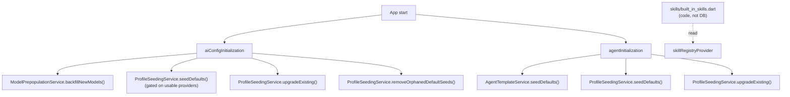

## AI Work Attribution Boundary

The `ai` feature creates output carriers, while `features/ai_consumption` owns
their audit model and interaction ledger. `SkillInferenceRunner` uses the strict
publication saga for transcription, image analysis, prompt generation, and
image generation: it preallocates the carrier id, makes pending state durable,
records reference-only request/response evidence plus cost evidence, waits for
the consumption publication barrier, writes the carrier, and finalizes the
projection.

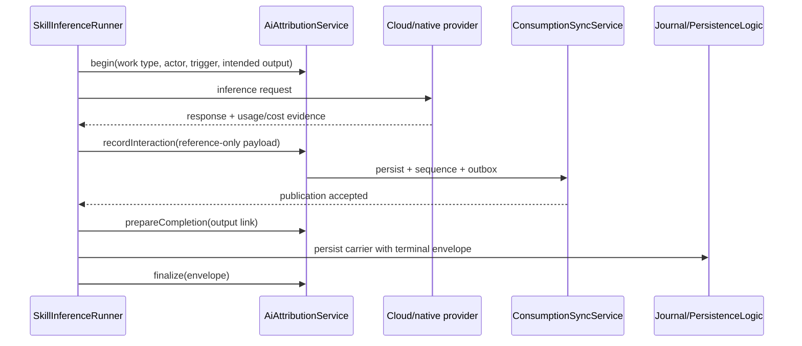

Carrier mapping is uniform: `AiResponseData.aiAttribution` for generated text
and authoritative image-analysis results, `ImageData.aiAttribution` for
generated images, and `AudioTranscript.id/aiAttribution` for transcripts.
`UnifiedAiInferenceRepository` begins before provider invocation, reuses one
owner and output id across automatic language reruns, publishes evidence before
persistence, and finalizes only after the carrier write. Attributed image
analysis is stored as the authoritative `AiResponseEntry` instead of also
duplicating the response into journal entry text. Embedding indexing begins
before its first chunk, records one interaction per chunk with digests only and
a known-zero local-compute cost, and finalizes a typed `embeddingVector` output
after the store replacement succeeds.

## Configuration Model

`AiConfigRepository` persists provider-facing AI configuration objects in
`AiConfigDb` and syncs changes through the outbox layer. Device-local runtime
controls use `AiRuntimeSettingsController` and `SettingsDb` instead. The
runtime is built from five config variants, one resolved runtime object, and
the local dispatch settings:

| Object | Stored as | Used by |
| --- | --- | --- |
| Provider | `AiConfig.inferenceProvider` | Base URL, API key, and provider type |
| Model | `AiConfig.model` | Provider model ID, modalities, function-calling support, Gemini thinking mode |
| Prompt | `AiConfig.prompt` | Legacy/manual prompt execution through `UnifiedAiInferenceRepository` |
| Profile | `AiConfig.inferenceProfile` | Capability slots for thinking, transcription, vision, and image generation |
| Skill | `AiConfig.skill` (defined in code) | Capability contract plus `ContextPolicy`. Built-ins live in `skills/built_in_skills.dart`; not persisted in the DB |
| Resolved profile | `ResolvedProfile` | Runtime profile with providers hydrated from configured model IDs |
| Runtime settings | `SettingsDb` (device-local) | Bounded agent-wake concurrency; defaults to 3 and supports 1 through 8 |

The key split is between skills and profiles:

- a skill defines the instructions and how much context to inject
- a profile defines which configured model/provider slot executes that skill

That split is what lets the app move the same skill between providers without rewriting the prompt contract.

The agent-wake concurrency setting is intentionally local because device and
provider capacity differ. `WakeOrchestrator` reads the controller through a
callback at dispatch time, so changing AI Settings affects new wake cycles
without rebuilding the provider graph. A missing or malformed stored value
uses the default of 3, while out-of-range values are clamped to the supported
range.

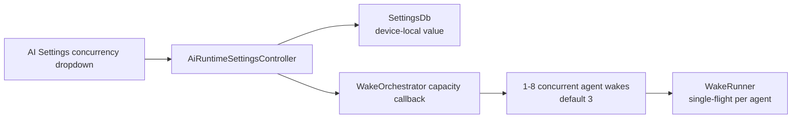

## Configuration Selection UI

AI configuration editors share two design-system selection primitives rather
than owning feature-specific modal rows:

- every profile, provider, model, and Gemini thinking-mode option is a
  `DesignSystemSelectionRow`. This gives terminal choices and provider drill-in
  rows one full-width anatomy with token-backed selection, hover, keyboard
  focus, typography, semantics, and trailing affordances. Homogeneous options
  have no inset dividers that can remain visible through an active row.
- provider and model drill-downs additionally share
  `InferenceProviderSelectionRow` and `InferenceModelSelectionRow`, so branded
  provider tiles, model accent dots, default markers, and selected markers are
  identical in standalone pickers and embedded setup flows.

- `InferenceProfilePickerModal` and its embeddable
  `InferenceProfilePickerList` render named inference profiles for category
  defaults, template settings, agent creation, task-agent setup, and Daily OS
  defaults. The list
  uses the profile description as secondary text and marks the persisted
  selection without exposing internal model IDs.
- `InferenceProviderModelPickerModal` renders model choices for inference-profile
  slots, task-agent overrides, Daily OS planner overrides, and per-invocation
  skill overrides. With multiple
  providers it drills from provider to model; with one provider it opens the
  model list directly. `selectedModelId` identifies the active choice while
  `defaultModelId` independently marks the profile default.
  Callers that require an explicit confirmation even when only one compatible
  model exists pass `autoSelectSingleCandidate: false`; Daily OS uses this so
  a single configured provider/model is still an informed user choice.

All standalone pickers use the adaptive Wolt modal helper: compact layouts get
a bottom sheet and wide layouts get a dialog without changing the content or
selection behavior. Embeddable list bodies let larger flows, notably task-agent
setup, reuse the same rows without opening a modal on top of a modal.

Closed fields use `SettingsPickerField`, so settings pages keep the same label,
value, disabled, and tap affordances. Async Riverpod consumers retain their last
rendered values during background reloads; a provider refresh does not replace
an established picker with a full loading shell.

The standalone legacy inference-profile list still renders `ProfileCard` while
older routes remain available. Its slot labels use the normal caption token,
not the uppercase overline token, and model identifiers use the shared
monospace metadata style. Both are constrained to one line so long capability
names or provider IDs truncate predictably instead of changing the card's row
rhythm.

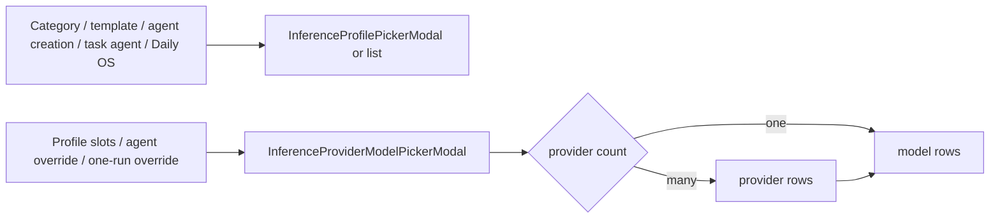

## Main Execution Paths

### Legacy prompt path

This is the older prompt-driven flow based on `AiConfig.prompt`.

1. `UnifiedAiController` loads an `AiConfigPrompt`.
2. `UnifiedAiInferenceRepository` validates whether the prompt fits the current entity and platform.
3. `PromptBuilderHelper` prepares prompt-specific task, audio, image, and linked-entity context.
4. `CloudInferenceRepository` routes the request to the correct provider implementation.
5. The result is written back to the journal entity or persisted as an `AiResponseEntry`, depending on `AiResponseType`.

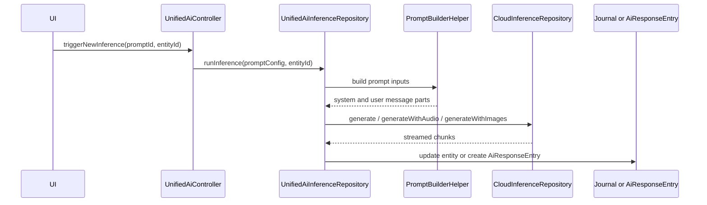

Notes grounded in code:

- `AiResponseType.taskSummary` and `AiResponseType.checklistUpdates` are deprecated and kept for persistence compatibility.
- Prompt generation also exists in the skill path via `SkillInferenceRunner.runPromptGeneration()`.

### Profile and skill path

This is the newer path built around `AiConfig.skill`, `AiConfig.inferenceProfile`, `ProfileResolver`, and `SkillInferenceRunner`.

There are two entry styles:

- automatic profile-driven handling through `ProfileAutomationService`
- direct skill execution through `triggerSkillProvider`

Today the automatic path is narrower than the direct one:

- automatic: `tryTranscribe()` and `tryAnalyzeImage()`
- direct: transcription, image analysis, prompt generation, image-prompt generation, and image generation

`promptGeneration` and `imagePromptGeneration` share the same dispatch arm in `triggerSkillProvider`: both route to `runner.runPromptGeneration()`, which derives the persisted response type from `skill.skillType.toResponseType` so the same runner serves both skill types. When the caller does not pass a parent task id, `triggerSkillProvider` recovers one from the entry-link graph before resolving the profile: it prefers entry -> task links and falls back to task -> entry child links.

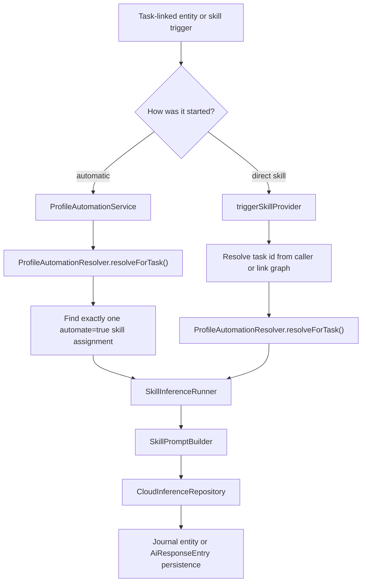

The automatic branch is intentionally strict:

- it only handles a skill type when exactly one automated assignment matches
- if multiple automated skills of the same type exist, the profile is treated as ambiguous and automation is skipped
- the resolved profile must expose the required model slot for that skill type

`SkillInferenceRunner` then persists results according to skill type:

- transcription updates `JournalAudio.transcripts` and `entryText`
- image analysis appends text to the `JournalImage` entry
- coding/design/research prompt generation creates an `AiResponseEntry` linked to the parent task when one resolves, and additionally links it back to the source audio/text entry so the prompt appears in both linked-entries lists (falling back to a single link on the source entry when no task resolves); image-prompt generation keeps the entry link. In linked-entries lists these prompts render under the `Code` activity-filter pill and are exempt from the generic `showAiEntry` gate that keeps transcripts and image analyses collapsed
- image generation imports a generated image, sets it as task cover art, then triggers automatic image analysis on the generated image

#### Context injection

`SkillPromptBuilder` is the only place that assembles runtime skill messages. It injects context based on `ContextPolicy` and skill type:

- `none`: no extra task context
- `dictionaryOnly`: speech dictionary only
- `taskSummary`: current task summary only
- `fullTask`: task JSON, linked tasks, and other richer context

In practice the builder may also inject:

- speech dictionary terms
- linked task JSON
- current task summary
- audio transcript text
- correction examples
- URL-formatting rules for image analysis

`TaskSummaryResolver` is the shared summary lookup layer for these paths. For
single-task prompt building it checks the current agent report first, then
falls back to legacy `AiResponseType.taskSummary` entries. Bulk linked-task
builders call `resolveMany()` so agent reports are loaded in one batch and the
already-prefetched legacy entries are used only where no usable report exists.

## Profile Resolution

`ProfileResolver` is the shared resolution engine for agent wakes. `ProfileAutomationResolver` wraps it for skill execution and offers two entry points:

- `resolveForTask(taskId)` — task-linked execution. Tries the agent path, then falls back to the task's own `profileId`.
- `resolveForCategory(categoryId)` — standalone entries (no parent task). Reads `CategoryDefinition.defaultProfileId` and resolves it directly through `ProfileResolver.resolveByProfileId`.

`triggerSkillProvider` selects between the two: when `linkedTaskId` is non-null it calls `resolveForTask`; otherwise it looks up the entry, reads its `categoryId`, and calls `resolveForCategory`. Skills whose `contextPolicy` is `fullTask` are filtered out of the popup for standalone entries (see [Skill Filtering](#skill-filtering) below), so the standalone branch only runs `dictionaryOnly` / `taskSummary` / `none` skills.

Resolution order for the agent path:

1. `agentConfig.profileId`
2. `AgentTemplateVersionEntity.profileId`
3. `AgentTemplateEntity.profileId`
4. legacy fallback: `version.modelId ?? template.modelId`

Resolution order for `resolveForTask`:

1. try the agent path above
2. if that fails, try the task's own `profileId`

Resolution for `resolveForCategory`:

1. read `CategoryDefinition.defaultProfileId`
2. resolve it through `ProfileResolver.resolveByProfileId`

Only the thinking slot is fatal. Optional slots resolve best-effort.
Model slots store `AiConfigModel.id` (the local model row ID) with a legacy
`providerModelId` fallback: `resolveInferenceProviderForProfileSlot` first
tries an exact model-row ID match and only then falls back to the old
provider-native lookup for profiles written before the migration. On the
legacy path, when multiple synced model rows share the same `providerModelId`,
provider resolution walks every candidate and uses the first provider row that
still exists, has the required credentials, and matches the provider type that
owns that known model ID. This is intentional sync hygiene: an orphaned
duplicate row from another device must not abort an agent wake when a valid
provider/model pair is still configured locally.

Recording-triggered transcription has a direct fallback in
`ProfileAutomationService`: it first tries the profile automation path above,
then scans configured audio-to-text model rows when no profile handles
transcription. The fallback builds an ephemeral `ResolvedProfile` around the
selected model and the built-in `Transcribe (Task Context)` skill; it does not
persist a profile. Candidate ranking prefers the recommended MLX Audio
Qwen3-ASR model, then other MLX Qwen3-ASR rows, then other configured STT
providers that have the required API key. This keeps local/mobile STT available
when the user has installed MLX Audio but the desktop-only local profile is not
available on that device.

Gemini-backed transcription uses the OpenAI-compatible audio chat-completions
path in `CloudInferenceRepository.generateWithAudio`. Gemini audio requests set
`reasoning_effort` only when the provider is Gemini and the model is a Gemini-3
variant (`GeminiThinkingConfig.isGemini3(model)`); it defaults to `low` unless a
per-invocation thinking mode is passed. Non-Gemini transcription providers (and
non-Gemini-3 Gemini models) leave reasoning effort unset.

Melious.ai uses a self-contained provider repository because its OpenAI-compatible
surface also exposes provider-specific model metadata. Settings fetch
`GET /models?include_meta=true` and map each `_meta.type`,
`_meta.input_modalities`, `_meta.output_modalities`, and `_meta.capabilities`
entry into a `KnownModel` row at runtime. The mapping preserves chat, vision,
reasoning, function-calling, audio-input, image-generation, embedding, and
rerank models in the installable catalog instead of relying on a static list.
The request path stays OpenAI-compatible for chat and vision chat; Whisper-class
IDs (`whisper`, `transcribe`, `asr`, or `stt`) route to
`POST /audio/transcriptions`, while Voxtral audio-input IDs route to
`POST /chat/completions`; image-output models route to
`POST /images/generations` and decode the returned `b64_json` image bytes.
Chat callers may opt into an OpenAI-compatible `reasoning_effort`; leaving it
unset preserves the provider's model default. The dedicated Melious path
forwards the same value for streaming and measured non-streaming calls, and the
shared usage parser retains nested reasoning-token counts.
Melious currently documents text-to-image generation there, so reference-image
generation is rejected explicitly rather than silently ignored.

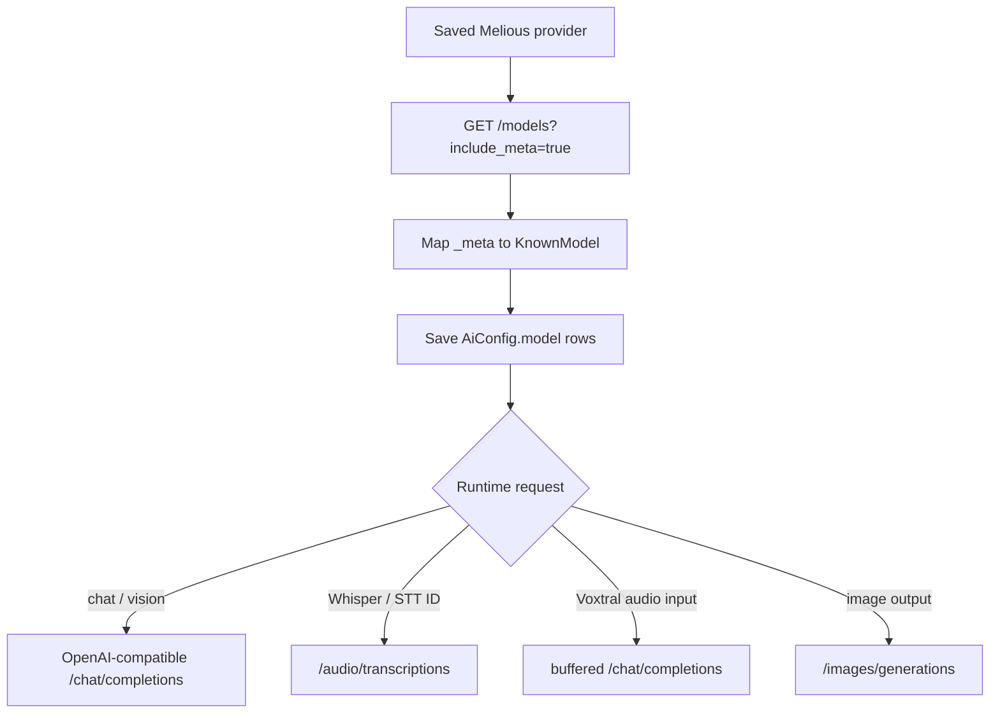

Melious also has a small curated static catalog used for immediate provider
setup before a user installs additional live-catalog rows: `deepseek-v4-pro`,
`glm-5.2`, `gemma-4-26b-a4b`, `minimax-m2.7`,
`mistral-small-4-119b-instruct`, `qwen3.5-122b-a10b`,
`deepseek-v4-flash`, `flux-2-klein-9b`,
`voxtral-small-24b-2507`, `whisper-large-v3`, and `whisper-large-v3-turbo`.
The default Melious profile uses `mistral-small-4-119b-instruct` for thinking
and image recognition, `glm-5.2` for the high-end thinking slot,
`flux-2-klein-9b` for image generation, and `voxtral-small-24b-2507` for
transcription. Melious' chat adapter stalls on the archived M4A bytes produced
by Lotti. Sending decoded PCM WAV fixed short recordings but exceeded the
provider request-size limit for longer recordings, so the provider route now
decodes a temporary copy to PCM WAV, streams normalized samples through LAME in
one-second chunks, and sends a 64 kbps temporary MP3 through buffered
`/chat/completions`. The original M4A is never modified. M4A and WAV decoder
scratch files are removed as soon as decoding finishes, and the MP3 is deleted
after success, provider failure, transport failure, or timeout. The audio block
precedes the text block so the task prompt and category speech dictionary guide
recognition.

Mistral's instruction-following `voxtral-mini-latest`,
`voxtral-small-latest`, and 25.07 Voxtral Mini/Small models use the same
temporary-MP3 lifecycle and buffered chat route. The shared
`temporary_mp3_chat_audio_transcriber.dart` owns the deadline, conversion,
cleanup, request errors, and response normalization for both providers. Only
the JSON audio part differs: Melious uses the OpenAI-compatible
`input_audio: {data, format: mp3}` object, while Mistral's native API expects
`input_audio` to contain the base64 MP3 string directly. Mistral Transcribe 2
and other transcription-only variants remain on `/audio/transcriptions`, where
diarization, timestamps, and native `context_bias` are available.

Decoding uses `audio_decoder` with AVFoundation on iOS and macOS, MediaCodec on
Android, and Media Foundation on Windows. Linux uses Lotti's GStreamer pipeline,
which writes PCM WAV directly and monitors the pipeline bus so missing codecs
cannot leave transcription waiting indefinitely. AAC/M4A decoding requires the
`gstreamer1.0-libav` package on Ubuntu/Debian (`gstreamer1-plugin-libav` on
Fedora and `gst-libav` on Arch); the Flatpak runtime already includes it. When
the decoder is absent, the native channel returns an immediate installation
hint that is surfaced by the transcription request.
MP3 encoding uses the LAME C source bundled by `flutter_lame` on Android, iOS,
Linux, macOS, and Windows. Lotti feeds normalized `Float64List` channel samples
to `LameMp3Encoder`; the package keeps synchronous native encoding on a worker
isolate. No FFmpeg binary is bundled. Conversion failure aborts the request and
surfaces decoder or encoder detail because a transcription-endpoint fallback
cannot apply task context during recognition. Requests reject empty responses,
share one 15-minute long-audio deadline across preparation and HTTP, and
surface structured provider detail with a correlation id. `flutter_lame` does
not ship a Web backend; Lotti currently has no Web application target.

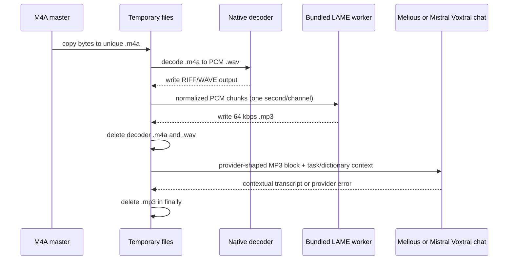

Whisper and explicit transcription model IDs still use the transcription
endpoint. FTUE setup also creates both
Whisper rows so users can switch between the regular and Turbo variants.
Existing untouched default
Melious profiles chain through the upgrade migrations during
`upgradeExisting()` after the model backfill has created the rows: profiles
that predate the image-generation slot, or still point at the legacy Flux 2
Dev default or the previous Whisper Turbo transcription default, move to Flux
2 Klein 9B and Whisper Large v3; profiles still on the DeepSeek V4 Pro
high-end and Whisper transcription defaults then move to GLM 5.2 and Voxtral
Small.

Melious, Mistral, oMLX, Gemini, and OpenAI provider settings also use live
catalogs (`ProviderConfig.supportsDynamicCatalog`). The provider detail page and
edit form render the same `AvailableModelsSection`, so endpoint-backed rows can be
installed from the screen that also shows the provider's configured
`Models · N` count. On the detail page the installed `Models · N` list renders
**above** the searchable catalog, so users see what they already have before
scrolling on to add more. oMLX calls `GET /models` on the configured local
OpenAI-compatible base URL, then maps returned IDs into installable
`KnownModel` rows. IDs that match the bundled oMLX catalog keep their curated
modality and reasoning metadata; Whisper/ASR/STT-looking IDs are treated as
audio-to-text transcription models; unknown local IDs remain installable as text
models.

Gemini uses `GeminiModelsRepository.listModels()`, which fetches Google's
**native** catalog `GET /v1beta/models` rather than the OpenAI-compatible
`/openai/models` surface — the native listing carries `displayName`,
`description`, `inputTokenLimit`/`outputTokenLimit`, `supportedGenerationMethods`
and a `thinking` flag, which the OpenAI-compatible surface flattens away. The
repository rewrites the saved base URL to the native host/path via
`GeminiUtils.buildListModelsUri`, authenticates with the `x-goog-api-key`
**header** (so the key never appears in the request URL), rejects a host-less
base URL up front, follows `nextPageToken` pagination (capped at
`maxCatalogPages`), skips (and logs) any malformed row instead of failing the
whole fetch, and drops rows that don't advertise `generateContent` (e.g.
embedding models). Ids in the curated `geminiModels` list are returned verbatim;
unknown ids are derived from the metadata plus id heuristics: `*image*` →
image-in/out, `*tts*` → text→audio, `gemini-*` → a natively multimodal
(text+image+audio-in) chat model with tools that reasons when `thinking:true` or
the id looks like a 2.5/3 model, and any other family (e.g. Gemma) → a
conservative text-only chat model with no tools.

OpenAI uses `OpenAiModelsRepository.listModels()`, which calls `GET /v1/models`
with bearer auth (rejecting a host-less base URL up front). That endpoint returns
bare ids with no capability metadata, so capabilities are derived from the id:
the `gpt-4o-transcribe` family recognized by
`OpenAiTranscriptionRepository.isOpenAiTranscriptionModel` → audio-to-text,
`gpt-image` → image in+out, `dall-e`/other `*image*` → text→image, legacy
completions ids (`davinci`/`babbage`/`instruct`) → plain text-only, `o1`/`o3`/`o4`
(and `reasoning`/`thinking`) → reasoning, everything else a vision-capable text
chat model with tools. Embedding, moderation, TTS, realtime **and unrouted
transcription models (e.g. `whisper-1`, which the app can't send to
`/v1/audio/transcriptions`)** are dropped as non-installable, malformed rows are
skipped and logged, and curated `openaiModels` ids are returned verbatim.

As with the other dynamic providers, a failed live fetch renders an inline error
banner with a retry control (no silent fall back to the curated list).

Mistral uses a self-contained `listModels()` on `MistralInferenceRepository`
that calls `GET /v1/models` with bearer auth and maps each row's `capabilities`
object into the `KnownModel` shape. Modalities are inferred from the capability
flags plus conservative id heuristics: `vision`/`ocr` add image input, Voxtral
and other transcription-shaped ids (or an `audio` flag) map to audio-to-text,
and `magistral`/`reasoning` ids are flagged as reasoning models. Rows that match
the curated `mistralModels` list keep their hand-tuned names and descriptions,
and live capability metadata refines them when present.

Mistral OCR models (`mistral-ocr-*`) are **not** chat-completion models — they
live on the dedicated `POST /v1/ocr` endpoint and reject `/v1/chat/completions`
with `invalid_model`. `CloudInferenceGenerate.generateWithImages` therefore
special-cases `InferenceProviderType.mistral` + `MistralOcrRepository.isMistralOcrModel(model)`
and routes to `MistralOcrRepository.extractText`, which posts each image as a
base64 `image_url` document, concatenates the per-page Markdown, and emits it as
a single streamed chat-completion chunk so the existing image-analysis skill
runner appends the extracted text to the image entry unchanged. Figure regions
the model detects are referenced in the Markdown as placeholders like
``, resolved by `pages[].images[]`; the request sets
`include_image_base64: false` and those entries are never processed, so the
repository strips the placeholders instead of leaking broken image links into
the journal text. The OCR endpoint ignores the skill's prompt/system message —
it only extracts text.

## Developer Eval Tool

`tool/qwen_local_inference_eval.sh` is a narrow local oMLX/OpenAI-compatible
tuning helper for Qwen task-agent function-calling checks. It reuses
`CloudInferenceWrapper` and the real task-agent tool definitions, runs a
selected profile/scenario matrix, and writes a compact JSON or Markdown report
containing provider/model provenance, latency, token counts, tool-call names, and
a failure category. The default scenarios expose the competing core task-field
tools together and validate both the selected tool and expected argument values.
It does not write prompts, full responses, API keys, release gates,
attestations, or decision ledgers. The built-in comparison targets
`Qwen3.6-35B-A3B-TurboQuant-MLX-4bit`, `Qwen3.6-35B-A3B-4bit`, and
`Qwen3.6-35B-A3B-MLX-8bit`; set `QWEN_EVAL_BASE_URL` or `OMLX_BASE_URL` when
oMLX is not exposed at the local OpenAI-compatible default. The corresponding
app provider type is `InferenceProviderType.omlx`, with default base URL
`http://127.0.0.1:8003/v1`; its known Qwen3.6 rows include
`unsloth/Qwen3.6-35B-A3B-UD-MLX-4bit` and are text+image models, so the same
local model can back thinking and image-recognition slots.

`tool/local_task_agent_inference_eval.sh` is the stronger app-shaped local eval.
It sends a production-style first-wake task-agent prompt through
`ConversationRepository`, the real Task Agent system prompt scaffold, the full
enabled task-agent tool surface, `CloudInferenceWrapper`, and the same
continuation loop used by agent workflows. The default live matrix compares
`Qwen3.6-35B-A3B-4bit` with `gemma-4-26B-A4B-it-QAT-MLX-4bit` on one task
scenario that requires title, estimate, due-date, and priority tool calls plus a
valid final `update_report`. This catches the failure mode the narrow helper
cannot: a model that emits isolated function calls but cannot complete the
actual task-agent wake contract. Set `LOCAL_TASK_AGENT_EVAL_PROFILES` to a
comma-separated `name=model` list to narrow or expand the comparison. The eval
does not mutate the database, execute write dispatchers, render UI, or validate
image input; it validates the local model's behavior inside the app's
conversation and tool-call orchestration layer.

`tool/local_task_agent_workflow_eval.sh` is the app-path local eval. It calls
`TaskAgentWorkflow.execute` with the seeded Laura task-agent directives, lets the
workflow build the real system and user prompts, invokes local oMLX through the
normal `CloudInferenceWrapper`, and then requires production persistence outputs:
a `ChangeSetEntity` containing the expected metadata suggestions and an
`AgentReportEntity` from `update_report`. The surrounding repositories are test
doubles with deterministic task/project context, so this is still not a live UI
or real-user-database replay, but it exercises the same workflow, strategy,
change-set, report-writing, and forced-report retry mechanics that an in-app wake
uses.

`tool/melious_task_agent_model_eval.sh` runs the conversation-level task-agent
evaluator as a Melious model and prompt matrix. The built-in candidates are
Mistral Small 4 119B Instruct, Qwen3.5 122B A10B, DeepSeek V4 Flash, and GLM
5.2. The runner defaults to the dedicated Melious provider path so live evals
exercise the same request and impact-accounting implementation as the app. The
default production-prompt suite contains fourteen synthetic but app-shaped
wakes: twelve core scenarios cover explicit and implicit-plan mutations, noisy
multilingual transcripts, prior reports, no-op background refreshes, stale
evidence, user overrides, checklist deduplication, external links, and long
timelines; two additional held-out scenarios cover deferred scope and active
deployment constraints.
Deterministic checks validate required mutations and report
facts as well as forbidden tools, speculative checklist content, report churn,
and internal-ID leakage. Missing first reports go through the same report-only
forced retry used by `TaskAgentWorkflow`, and each result records whether that
recovery was needed. The live test is deliberately
non-gating unless `LOCAL_TASK_AGENT_EVAL_STRICT=1`, because a comparison run must
persist weak outputs instead of aborting before the other candidates run.

After candidate generation, `tool/task_agent_model_eval_judge.py` can send the
synthetic context and captured tool calls to a separate rubric pass
(`qwen3.5-122b-a10b` by default). It rates grounding, coverage, checklist
quality, summary quality, and format compliance. This automated score is a
diagnostic only: it is not an acceptance signal, and a candidate is not accepted
from a score produced by the same model family. Deterministic checks establish
mutation safety, while report-quality decisions require direct review of the
candidate text. Malformed judge JSON gets one bounded repair turn, and the
artifact retains and aggregates accounting for every paid attempt. Raw and
judged JSON/Markdown artifacts are written to a
unique run directory under `build/task_agent_model_eval/` by default. Set
`LOCAL_TASK_AGENT_EVAL_OUTPUT_ROOT` to a local clone of the private evaluation
archive when a run should be retained; generated reports are not committed to
the application repository. The optional `qualityFocused` prompt variant adds a
report-quality gate for targeted comparisons; it is not a production default.
Additional Melious candidates can be
supplied through `LOCAL_TASK_AGENT_EVAL_PROFILES=name=model,...`, and individual
scenario IDs through `LOCAL_TASK_AGENT_EVAL_SCENARIOS`. Prompt variants are
selected with `LOCAL_TASK_AGENT_EVAL_PROMPT_VARIANTS`. The evaluator also has
orchestration modes selected with
`LOCAL_TASK_AGENT_EVAL_EXECUTION_MODE`. `twoPass` removes `update_report` from
the advertised mutation-pass tools and follows with a forced report-only pass;
`reportRevision` asks the same model to revise its first report against the
source context. `reportEditing` always sends a draft through the configured
editor and remains a historical orchestration control. `productionRouting`
mirrors the shipped Melious path: Mistral always uses the isolated Qwen editor,
clean direct-Qwen reports remain single-pass, and reports matching the narrow
known-regression detector receive a bounded Qwen repair. The production route
resolves the Qwen editor and three-attempt bound automatically. Scenario
metadata supplies existing material due dates, estimates, and priorities to
the editor just as the production workflow supplies current task anchors. The
optional `LOCAL_TASK_AGENT_EVAL_REASONING_EFFORT` accepts the OpenAI-compatible
`minimal`, `low`, `medium`, or `high` values. The generated JSON and Markdown
record the selected effort; leaving it empty records and uses the model default.
The corrected temperature-0 Mistral two-pass rerun improved automated
judge-rated summary prose but passed only 8 of 11 scenarios and used 135,147
candidate tokens, 52% above the single-pass baseline. Neither multi-pass mode
is used by production task agents.

An explicit Mistral `reasoning_effort=high` experiment also failed to justify a
production default. In the matched four-scenario screen, model-default and high
effort both passed 3/4 cases while high effort was 13-15% slower. The full
high-effort run at Mistral's recommended temperature `0.7` passed 7/11 cases,
versus 10/11 in the archived provider-default production run, and was 56%
slower with nearly identical output-token volume. Melious returned no separate
reasoning-token counts for these calls. DeepSeek V4 Flash did not advance past
the same screen: it passed 2/4 cases, made an unauthorized status change, used
2.6x the input tokens, and took about twice as long as the Mistral baseline.
These are one-sample synthetic comparisons, so the artifacts are retained for
reproduction rather than treated as universal model rankings.

The production `evidenceSynthesis` prompt was replicated with Qwen3.5 122B A10B
across repeated synthetic suites at temperature `0.0`. Early direct runs showed
strong mutation handling but recurring report defects: pending work described
as underway, checklist-process narration, deferred-scope leakage, and causal
claims inferred from user checkmarks. Prompt additions alone did not remove
those classes reliably. Production therefore runs a narrow local detector for
these captured regressions. A clean Qwen draft remains single-pass; a matching
draft receives a bounded isolated Qwen repair. Standalone directive-controlled
headings and words such as `Goal`, `Checklist`, and `No blockers` are not
failures. This detector does not establish semantic correctness, score prose
quality, or enforce arbitrary custom report structure.

`qwen3.5-122b-a10b` is part of the curated Melious catalog and is the seeded
Melious thinking default. Existing untouched Melious profiles migrate from
Mistral thinking to Qwen when the provider-owned Qwen model row exists. The
profile stores the applied seed generation, so this migration runs once and a
later deliberate switch back to Mistral is preserved. Foreign providers with a
matching provider model ID cannot satisfy or capture the migration. Mistral
remains in the image-recognition slot because this Qwen endpoint is text-only,
and the resolved profile remains the runtime model selector.

Qwen exposes thinking as an on/off capability rather than distinct native
effort tiers. In one matched state-classifier probe, requesting
OpenAI-compatible `high` effort left the same three failures while adding 11%
input tokens, 6% output tokens, and 6% latency. In the final shared-contract
screen it passed 4/6 rather than 3/6, but retained the same two core grounding
failures and cost differences were within run noise. Production therefore
leaves reasoning at the model or profile default. The permanent evidence-first
workflow supplies the evaluated prompt, extends the tool descriptions, and
selects temperature `0.0` only for the exact evaluated Melious Mistral Small 4
and Qwen3.5 122B model IDs. It replaces the report directive only when the
template still uses the seeded default, so evolved and manually customized
report structure remains authoritative.

The final matched production-routing run on commit `8d34a3088` covered 14
scenarios per route. Direct Qwen and Mistral plus the isolated Qwen editor each
passed 14/14 scenarios and 112/112 deterministic scenario checks. Mistral used
232,322 total tokens and 145.458 seconds; direct Qwen used 233,490 total tokens
and 157.180 seconds. Of twelve direct-Qwen report cases, five passed local
preflight and seven received repair; one repair used all three allowed attempts.
Direct review found Qwen's final reports richer and more natural, while the
Mistral route remained more compact and conservative. These results support the
Qwen default and retain Mistral as a selectable alternative; they do not prove
GLM 5.2 parity or unrestricted reliability on arbitrary user histories.

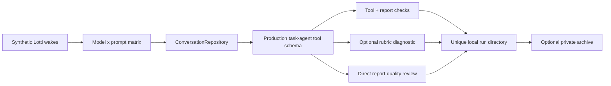

The direct `AudioTranscriptionService` path used by Daily OS capture/refine
prefers a Mistral instruction-following Voxtral chat-audio model, then a
Mistral transcription-only Voxtral model, then any other configured Mistral
audio model. It next considers contextual Melious Voxtral, Melious STT, MLX
Qwen, Gemini Flash, and the first remaining audio-capable model. Realtime-only
Mistral models stay excluded from that batch verifier because they require the
WebSocket pipeline.

**Synced-audio auto-trigger uses a different path.** When a `JournalAudio`
arrives over Matrix sync (recorded on another device), `SyncedAudioInferenceDispatcher`
runs the inference flow itself rather than calling `AutomaticPromptTrigger`.
The dispatcher bypasses `tryTranscribe` entirely — that path would re-enter the
ranked direct-model fallback above, which can route through cloud providers
(Mistral, OpenAI, Gemini) and silently break the "local-only" promise of a
pinned profile. See [Profile Pinning](#profile-pinning) and the sync
[README](../sync/README.md#sync-node-profile-and-auto-trigger) for the full
flow.

### Profile Pinning

`AiConfigInferenceProfile.pinnedHostId` is the vector-clock host UUID of the
device that should auto-run this profile on synced audio entries. The
`SyncedAudioInferenceDispatcher` (see sync README) consults this field at
trigger time: pinned-or-skip with no fallback. The pinning UI lives in
`lib/features/ai/ui/widgets/profile_pinning_selector.dart`, filters the known
sync-node directory by required capabilities, and is embedded in
`inference_profile_form.dart`.

`profile_locality.dart` defines `profileIsLocal(profile, repo)`: returns true
iff every populated model id resolves to a provider in `{ollama, voxtral,
whisper, mlxAudio}`. **Fail-closed** — a referenced-but-unresolved model id
counts as not local, which prevents a deleted cloud-provider config from
masking the profile as safe-to-auto-route. The dispatcher gates on this
helper after the pin match, so even a buggy pinning UI cannot route synced
audio to a cloud model.

The dispatcher uses `ProfileAutomationResolver.resolveProfileIdForTask` (a
sibling of `resolveForTask` that returns the raw profile id rather than a
`ResolvedProfile`) so it can read `pinnedHostId` and call `profileIsLocal` on
the raw config. It does **not** consult `category.defaultProfileId` directly,
which would skip agent-level overrides and let a category edit retroactively
re-route which device claims an entry.

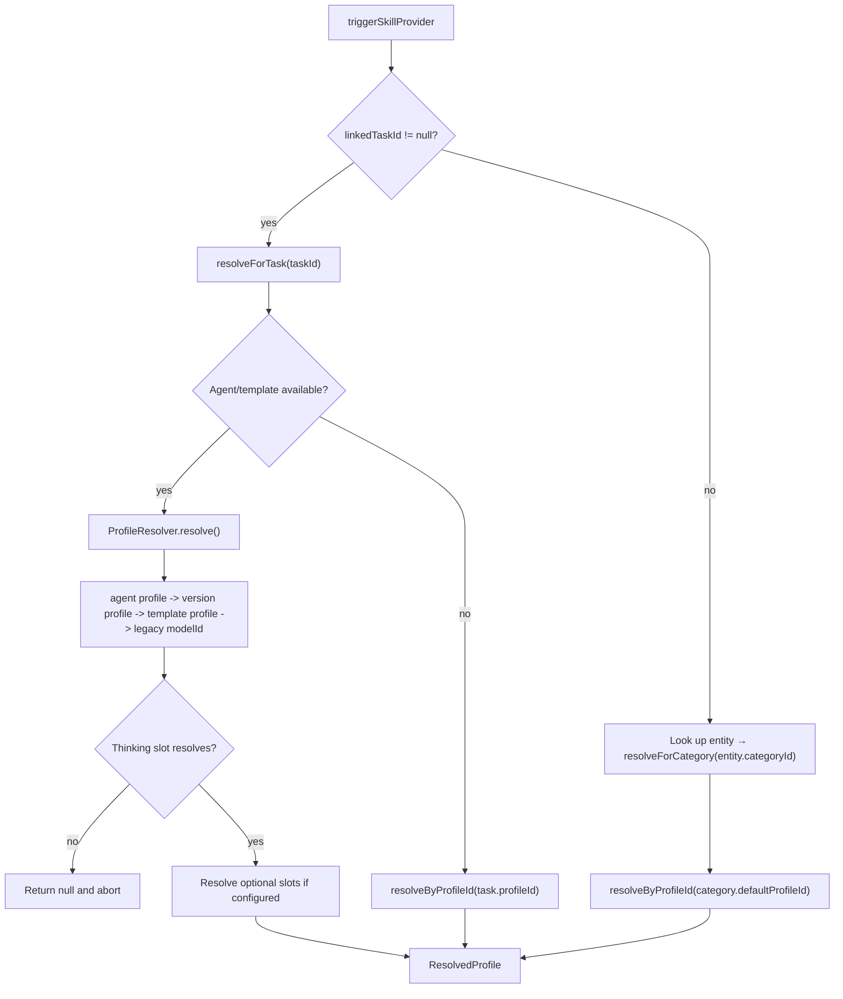

### Skill Filtering

`availableSkillsForEntityProvider((entityId, linkedFromId))` filters the skill registry per entity. The popup uses it (via `hasAvailableSkillsProvider`) to decide what to show:

- Modality filter — `Modality.audio` only matches `JournalAudio`, `Modality.image` only matches `JournalImage`, `Modality.text` matches any entity with text content (`JournalAudio` qualifies via its transcript).
- Task-context filter — a skill is considered to "need a task" iff `contextPolicy == ContextPolicy.fullTask`. Task context is present when the entity is a `Task`, when the caller passes `linkedFromId`, or when the entry-link graph resolves a parent task in either direction (`entry -> task`, then `task -> entry`). Full-task skills are hidden only when all three checks fail.
- Cover-art source filter — `SkillType.imageGeneration` is narrower than the
  general text-modality rule: it is shown only for `JournalEntry` or
  `JournalAudio` sources that also have a task context. The runner imports the
  generated image back onto the linked task, so a task-only popup would have no
  source note and standalone notes would have nowhere to save the cover art.

The seeded task-context skills (`Transcribe (Task Context)`, `Analyze Image (Task Context)`, `Generate Cover Art`, the coding/design/research prompt generators) are therefore hidden for truly standalone entries; only their plain counterparts (`Transcribe Audio`, `Analyze Image`) show up. `triggerSkillProvider` also has a defensive guard: a `fullTask` skill triggered without a resolvable task id is captured as an event and aborted — the popup should never offer one in that state, so reaching it means the caller or link graph is missing task context.

### Per-Invocation Model Overrides

Skill types with a per-invocation override slot (today: transcription, image analysis, prompt generation, and image-prompt generation) open the `InferenceProviderModelPickerModal` before firing `triggerSkillProvider`, so the user can route a single voice note, photo, or prompt-generation run to any modality-capable model without editing the inference profile. The picker filters **first by provider, then by model**: a user with models spread across several providers picks a provider, then one of its models, with a one-tap "Current default" shortcut pinned on top. It is adaptive — no modal for a single capable model, and the provider step is skipped when a single provider owns all the capable models. The flow is one parameterised path — the variant table `_modelOverrideConfigs` in `unified_ai_skills_modal.dart` (four entries: `transcription`, `imageAnalysis`, `promptGeneration`, `imagePromptGeneration`) plugs in the per-slot modality filter, profile-slot accessor, and l10n strings. Adding another per-invocation override slot is a one-line entry in that map plus a corresponding `_resolveOverrideTarget` call on the runner.

The user's choice threads through as the optional `overrideModelId` field on `TriggerSkillParams`. `SkillInferenceRunner` dispatches on `skill.skillType` and forwards `overrideModelId` to `runTranscription`, `runImageAnalysis`, or `runPromptGeneration` (the last serves both `promptGeneration` and `imagePromptGeneration`); each one calls its per-slot resolver (`_resolveTranscriptionTarget` / `_resolveImageAnalysisTarget` / `_resolvePromptGenerationTarget`), which delegates to the shared `_resolveOverrideTarget` helper. Each resolver returns an `_InferenceTarget` record of `(AiConfigInferenceProvider? provider, String? modelId, AiConfigModel? model)` — the `model` field carries the resolved `AiConfigModel` row so per-model settings (e.g. Gemini thinking mode) survive resolution — preferring the override when it resolves to a real `AiConfigModel` + parent `AiConfigInferenceProvider`, falling back to the profile slot (with a warning log keyed by `_OverrideSlotKind`) otherwise.

Three short-circuits keep the common case one-tap, applied identically across slot kinds:

- `models.isEmpty` — picker is not shown; the trigger is not fired (defensive path, the popup modality gate should prevent reaching here).
- `models.length == 1` — picker is not shown; the trigger fires immediately with the lone model id.
- `picked == defaultModelId` — the override is collapsed to `null` at the popup callsite, so the runner reads the profile slot and a model deleted between picker and run still falls back gracefully (instead of trying to route to a stale id).

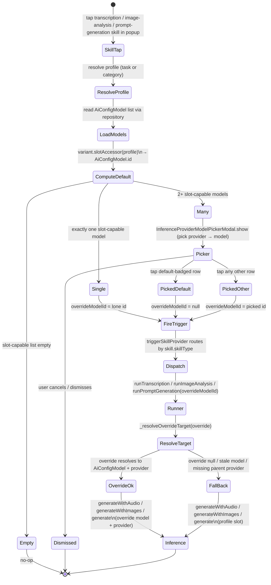

### Cover-Art Model Selection

Cover-art image generation is a separate path (`_handleImageGenerationSkill` → `CoverArtSkillModal`) but now offers the same provider→model choice. Before the reference-image step, the handler loads every model that *outputs* images and opens the same `InferenceProviderModelPickerModal`; the chosen `AiConfigModel.id` threads through `CoverArtSkillModal` → `triggerSkillProvider` → `runImageGeneration` as `overrideModelId`, which `_resolveImageGenerationTarget` resolves against the override (falling back to the profile's `imageGeneration` slot, with a warning log keyed by `_OverrideSlotKind.imageGeneration`) exactly like the other slots. The same short-circuits apply: with fewer than two image-output models the picker is skipped and generation runs on the profile slot as before.

Two built-in image-generation skills share that same runtime path:

- `Generate Cover Art` keeps `ContextPolicy.fullTask` and builds the original
  rich prompt with task JSON, related tasks, task summary, and entry notes.
- `Generate Cover Art (Flux)` uses `ContextPolicy.taskSummary` as a compact
  cover-art mode. `SkillPromptBuilder` recognizes
  `SkillType.imageGeneration + ContextPolicy.taskSummary` and sends only a
  short scene plus mood/task clues and explicit 16:9 / central square-safe
  composition guidance, with no full task JSON, related-task JSON, or
  `**Entry Notes:**` wrapper. This is intended for Flux-style image models that
  perform better with a direct visual story than with application context.
  Melious image generation also passes explicit FLUX dimensions (`1792` x
  `1008`) so the transport-level request matches the 16:9 cover-art prompt.

Image-generation skills are still hidden for standalone entries and task-only
surfaces in `availableSkillsForEntityProvider`; cover art needs a linked text
or audio note as its source and a task so the imported generated image can be
saved back as `TaskData.coverArtId`.

## Conversation and Tool Calling

`ConversationRepository` and `ConversationManager` provide the reusable multi-turn conversation loop used by agent-style tool calling.

Responsibilities in code:

- preserve conversation history
- emit conversation events for the UI
- accumulate streamed tool calls across chunks
- keep Gemini thought signatures between turns
- re-enter the loop through a `ConversationStrategy` after tool execution

`CloudInferenceWrapper` adapts `CloudInferenceRepository` to `InferenceRepositoryInterface`, so cloud and local providers can participate in the same conversation loop.

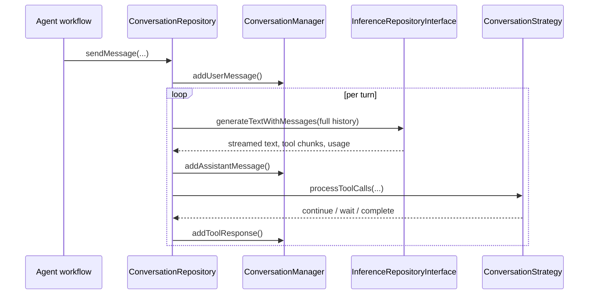

Implementation details that matter:

- tool call arguments are buffered by stable tool call ID or index so streamed JSON is reassembled safely
- Gemini-specific thought signatures are stored in `ConversationManager` and replayed on later turns
- the repository has provider-specific handling for Gemini-style multi-call chunks that arrive without stable IDs

## AI Activity Visualization

`ui/animation/ai_state_shader_animation.dart` is the barrel for the
shader-based AI activity visualizations. It holds the shader assets,
the program cache, and the shared `aiSetShaderColor` uniform helper, and it
re-exports the voice and thinking widget/painter families from the standalone
`ai_voice_input_shader.dart` and `ai_thinking_line_shader.dart` libraries
(each imports the barrel back for the shared cache/helper and thinking routes).
Widgetbook remains the tuning surface via
`widgetbook/ai_shader_animations_widgetbook.dart`; production task details use
the decoder-bars thinking shader in the task action bar while inference is
running, and Daily OS Next uses the voice tension-loop shader around the record
button while capture or refine listening is active.

Skill inference failures are retained separately from the coarse
`InferenceStatus` lifecycle by `inferenceErrorControllerProvider`. The task and
entry activity widgets listen for that detail: when the running animation ends
in an error, they show a design-system error toast containing the provider HTTP
message, timeout, and request id, then consume it so rebuilds do not replay the
same failure.

Two Flutter runtime-effect shaders are registered in `pubspec.yaml`:

- `shaders/ai_voice_input.frag` renders the transparent tension-loop voice orb.
  It contains only that production program: unused experimental variants are
  not compiled into the runtime effect. `AiVoiceInputShader` creates one
  `FragmentShader` for the loaded program and reuses it while animation time and
  live dBFS uniforms change, rather than allocating a native shader every frame.
  The public widget accepts a dBFS value (`-80..0` by default), matching
  `record.Amplitude.current` and `computeDbfsFromPcm16`. Five shared quadrature
  harmonic pairs and four bounded pressure lobes drive every contour; each
  ribbon gets a different phase by mixing those bases rather than evaluating a
  new trigonometric pressure field. The render path contains no `exp` or `pow`.
  It composites two hero ribbons, secondary contours, hairlines, and reusable
  halos into a transparent premultiplied result. The production recording modal
  supplies the design-system interactive teal as the body color and the
  high-emphasis text color to two broader pressure-lit ribbons, resolving those
  tokens through the ambient design-system theme. The accent therefore blooms
  white in dark mode and dark in light mode while the fine structure remains
  teal.
- `shaders/ai_thinking_line.frag` renders five horizontal thinking routes:
  quiet thread, packet scan, circuit trace, probability band, and decoder bars,
  sized for action-bar use. `AiRunningDecoderBars` selects the decoder-bars
  route and feeds it the same `inferenceRunningControllerProvider` state as the
  legacy Siri-wave wrapper. It animates both the reserved vertical height and
  shader amplitude and opacity when activity starts or stops, then removes the
  shader subtree once the exit animation is fully collapsed.

The Widgetbook use cases expose knobs for speed, intensity,
geometry, colors, randomness, and dBFS. The thinking matrix renders every
thinking route at once for side-by-side comparison. The voice playground has a
Widgetbook-only recorder control that starts a `record.AudioRecorder` metered
mic session and polls `AudioRecorder.getAmplitude()` every 20ms for
package-reported dBFS. The shader input runs through a dBFS envelope with
instant attack and slower release so voice onsets stay responsive while short
dips do not make the rings collapse abruptly.
The default metered path writes only to a temporary file and deletes it when
recording stops. A PCM stream mode remains available as a diagnostic and
fallback dBFS source, with input-device selection and raw peak/RMS diagnostics
to catch silent default devices. The recorder readout uses tabular numeric
features so dBFS and counter changes do not move the surrounding UI. Recorder
voice processing defaults off to match the production realtime recorder path.

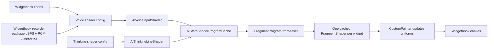

## Provider Routing

`CloudInferenceRepository` is the central router despite its name; it also handles local providers such as Ollama, Whisper, Voxtral, and MLX Audio.

It is now a thin **facade**: every public method delegates to one of two collaborators that hold the actual branches — `CloudInferenceGenerate` (text + image) and `CloudInferenceGenerateMore` (audio, multi-turn, image generation, model install/cleanup) — both sharing a single `CloudInferenceRequestHelpers`. The mockable surface and all call sites are unchanged, so the routing table below still reflects the behavior regardless of which collaborator owns each branch.

| Operation | Dedicated branches | Fallback |
| --- | --- | --- |
| `generate()` | Ollama, Gemini, Mistral, Melious | OpenAI-compatible chat streaming; explicit reasoning effort is forwarded where supported, but omitted from Mistral requests |
| `generateWithImages()` | Ollama, Melious, Mistral OCR (`/v1/ocr` for `mistral-ocr-*`) | OpenAI-compatible multimodal chat; Gemini receives `reasoning_effort` for its thinking mode |
| `generateWithAudio()` | Whisper, Voxtral, MLX Audio native bridge, oMLX/OpenAI/Mistral/Melious transcription endpoints, temporary-MP3 Mistral and Melious Voxtral chat audio | OpenAI-compatible audio chat completions; Gemini receives `reasoning_effort` for its thinking mode |
| `generateWithMessages()` | Gemini, Ollama, Mistral, Melious | OpenAI-compatible full-history chat; explicit reasoning effort is forwarded where supported, but omitted from Mistral requests |
| `generateImage()` | Gemini, Alibaba DashScope, Melious | Unsupported for all other provider types |

This routing is implemented in code, not inferred from documentation. If a provider type is not branched explicitly for an operation, it falls through to the compatibility client or throws `UnsupportedError`.

Audio transcription responses are normalized into chat-completion stream chunks
so downstream skill/unified consumers can collect text and `usage` the same way
for every provider. `completion_usage_parser.dart` accepts the common
OpenAI-compatible token shapes (`prompt_tokens` / `completion_tokens`,
input/output aliases, cached and reasoning token details). Duration-only audio
usage is intentionally ignored because it cannot be represented as token
consumption. Whisper-style `/audio/transcriptions` responses therefore carry
token usage only when the endpoint actually reports it. Voxtral's streaming
adapter also emits final usage-only SSE frames, which lets AI Consumption record
tokens even when the final accounting chunk contains no text delta.

For oMLX, the audio branch is model-sensitive. Regular oMLX Qwen and Gemma
rows still use OpenAI-compatible chat or vision chat routes, while
Whisper/ASR/STT-shaped oMLX model ids use the configured provider base URL plus
`/audio/transcriptions` with multipart audio and bearer authentication. The
static oMLX catalog includes `openai/whisper-large-v3`,
`whisper-large-v3-mlx`, and `whisper-large-v3-turbo` as audio-input,
text-output models so they can be selected for inference-profile transcription
slots on Apple Silicon oMLX installations.

### Gemini Thinking Mode

Gemini thinking effort is stored on the configured model row as
`AiConfigModel.geminiThinkingMode`. The field defaults to `low`, so older model
rows that do not have the JSON key deserialize to the faster setting. This is a
default for the saved model row, not a global policy: popup-triggered skills can
override the Gemini effort for one invocation after the model has been selected.
The model edit form only shows the selector when the row's owning provider is
Gemini.

Runtime routing uses the resolved `AiConfigModel`, not a provider-model-name
lookup table:

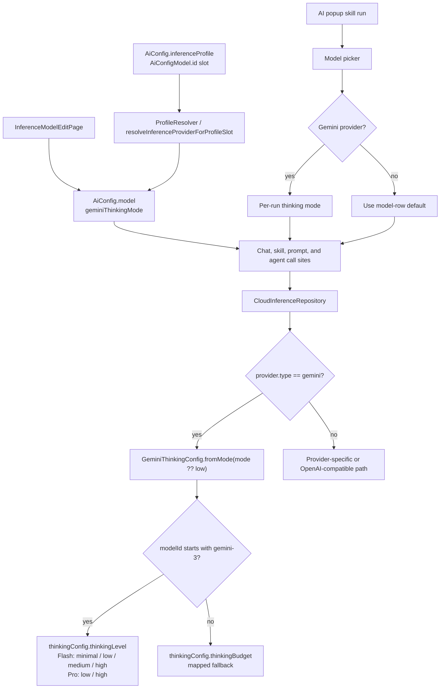

`minimal` maps to no captured thought summaries (`includeThoughts=false`);
`low`, `medium`, and `high` capture Gemini thought summaries so the response
modal can still show the Thoughts tab. The old per-model Gemini default helper
was removed: Flash 2.5 no longer receives a special compatibility preset.

MLX Audio is intentionally not a localhost provider. Flutter owns provider/model
configuration and progress state, while `MlxAudioChannel` talks to platform
Swift over `com.matthiasn.lotti/mlx_audio`. The native bridge ships **only on
macOS**: the Swift file compiles without the MLX package and returns
`unsupported` on Intel macOS, and iOS / Android / Linux / Windows do not
register the plugin at all. The Dart channel short-circuits every method when
`Platform.isMacOS` is false — `getModelStatus` returns
`MlxAudioModelStatus.unsupported`, mutation methods (`installModel`,
`transcribeFile`, `transcribeBase64Audio`, `startRealtimeTranscription`,
`speakText`) throw `PlatformException(code: 'UNSUPPORTED')`, no-op methods (`stopSpeaking`,
`appendRealtimePcm`, `stopRealtimeTranscription`,
`cancelRealtimeTranscription`) silently return, and the event streams emit
nothing. The FTUE provider picker hides the MLX Audio tile on non-macOS, the
direct-fallback transcription ranker
(`ProfileAutomationService._fallbackCandidateRank`) demotes MLX rows past
every cloud and local non-MLX candidate on non-macOS, and the sync-node
capability probe — also gated on `Platform.isMacOS` — refuses to advertise
`mlxAudio`. Mobile devices therefore defer audio inference to a capable
desktop via the synced-audio auto-trigger path described below.
The seeded MLX Audio catalog includes Voxtral Realtime, Qwen3-ASR 0.6B,
Qwen3-ASR 1.7B 4-bit and 8-bit, Parakeet, and Qwen3-TTS.
The setup flow asks which STT model to install first, with Qwen3-ASR 1.7B
8-bit preselected because it is much faster than Voxtral Realtime in
post-recording use. Voxtral remains available as an explicit comparison model.

Download status is centralized in `MlxAudioModelProgressStore`. The store owns
the single native EventChannel subscription, keeps the latest payload by model
id, and exposes `mlxAudioModelProgressProvider(modelId)` to cards and dialogs.
This prevents provider/model overview rows from stealing the native stream from
the modal, and lets a running download be reopened from the model row.

Inference does not implicitly download MLX models. `installModel` is the only
path that downloads from Hugging Face; transcription and realtime start first
verify that the cache contains a complete model and otherwise return a
not-installed failure. This keeps a recording-triggered STT run from starting a
multi-GB background download or loading a partial cache. The Swift bridge also
logs resource snapshots at `transcribe.request`, model load, audio preparation,
and generation stages so native crash reports can be matched to the last MLX
step that ran.

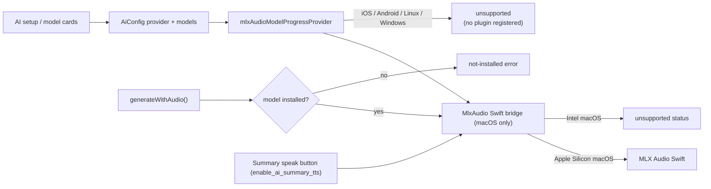

AI-summary TTS remains wired through the native MLX Audio channel on macOS, but
the task card button is hidden unless `enable_ai_summary_tts` is enabled in
config flags. The default is off while local TTS model quality and runtime
behavior are still being evaluated. iOS does not ship the MLX Audio bridge at
all: the 1.7B Qwen3-ASR model that gives acceptable accuracy on macOS triggered
immediate OOM on iPhone hardware, so `ios/Runner` no longer links
`mlx-swift` / `mlx-audio-swift` / `swift-huggingface` and no longer registers
the `MlxAudio` plugin. The iOS bundle is correspondingly smaller, and audio
recorded on iOS reaches MLX via the synced-audio auto-trigger flow on a paired
desktop.

For speech dictionary support, `UnifiedAiInferenceRepository` and
`SkillInferenceRunner` still resolve category dictionary terms through
`PromptBuilderHelper.getSpeechDictionaryTerms()`. The MLX Audio branch forwards
those terms across the channel with the transcription request. Qwen3-ASR uses
that list as prompt context for post-recording transcription today. Chat-audio
requests append the same dictionary block to the user message, including the
temporary-MP3 Mistral and Melious Voxtral paths. Mistral transcription-only
models instead receive the terms through their dedicated `context_bias`
parameter. Decoder-level
dictionary/G2P integration remains a separate native bridge follow-up once that
SDK surface is stable.

## Embeddings and Semantic Search

The feature also owns local embeddings and vector search.

Runtime pieces:

- `EmbeddingService` listens to local update notifications and performs real-time embedding work
- `EmbeddingProcessor` hashes content, chunks text, generates embeddings, and writes them atomically
- `EmbeddingStore` is the storage abstraction
- `ShardedEmbeddingStore` is the production implementation, backed by per-category ObjectBox shards
- `VectorSearchRepository` embeds the query through Ollama and resolves hits back to tasks or entries

Grounded implementation notes:

- the feature is gated by `enableEmbeddingsFlag`
- embeddings currently depend on a resolvable Ollama base URL
- tasks can be embedded with label-enriched text, not just raw title/body
- agent reports are stored with `taskId` metadata so search results can resolve back to the owning task

## Seeded Defaults

`ProfileSeedingService.seedDefaults()` knows these default profile templates, each gated on a provider type (`ProfileSeedingService.providerTypeByProfileId`):

- `Gemini Flash`, `Gemini Pro` — gated on a Gemini provider
- `OpenAI` — gated on an OpenAI provider
- `Mistral (EU)` — gated on a Mistral provider
- `Melious.ai` — gated on a Melious provider
- `Chinese AI Profile` — gated on an Alibaba provider
- `Anthropic Claude` — gated on an Anthropic provider
- `Local (Ollama)`, `Local Gemma 4 (Ollama)`, `Local Gemma 4 Power (Ollama)` — gated on an Ollama provider
- `Local Power (oMLX)`, `Local Gemma 4 (oMLX)` — gated on an oMLX provider

A template is only seeded once a **usable** provider of its gate type exists (`isUsable`: non-blank API key, or — for keyless local types — a non-blank base URL). A fresh install therefore starts with zero inference profiles; connecting a provider seeds exactly its own profile(s). Seeding runs at startup and again right after a provider is created (`addConfig`), updated (`updateConfig`, e.g. adding the API key to a draft), or finishes FTUE setup (`runFtueSetupForType`), so onboarding can bind categories to the profile immediately after the key step.

The retroactive counterpart is `removeOrphanedDefaultSeeds()` (startup only, after `upgradeExisting()`): it deletes default seeds whose gate type has no usable provider — installs that seeded the full catalog before the gate existed, and providers deleted since the last launch. It is deliberately conservative: a profile is only removed while it still looks like an untouched seed (template name — or the legacy `Local Power (Ollama)` name — no description, no pinned host, template flags) and none of its model slots resolve to a model row owned by a usable provider. Renamed, described, pinned, or rewired profiles always survive.

Operational details from the seeded definitions:

- the five local profiles are `desktopOnly`
- `Local (Ollama)` and `Local Gemma 4 (Ollama)` ship with image-analysis automation but no transcription slot
- `Local Power (oMLX)` uses `Qwen3.6-35B-A3B-4bit` for thinking and image recognition, and `whisper-large-v3-turbo` for transcription
- `Local Gemma 4 (oMLX)` uses `gemma-4-26B-A4B-it-QAT-MLX-4bit` for thinking and image recognition, and `whisper-large-v3-turbo` for transcription
- `Melious.ai` uses Qwen3.5 122B A10B for thinking, Mistral Small 4 119B Instruct for image recognition, GLM 5.2 for high-end thinking, Flux 2 Klein 9B for image generation, and Voxtral Small 24B for transcription
- `Local Gemma 4 Power (Ollama)` currently ships with no default skill assignments

`seedDefaults()` is **strictly seed-on-create**: it looks up each gated-in profile by its well-known ID and writes only when the row is missing. Freshly seeded profiles write `AiConfigModel.id` slot values when the corresponding model rows exist. Once a profile exists, the seeder never overwrites user-edited names, descriptions, flags, or skill assignments.

`upgradeExisting()` backfills migration-safe pieces after model rows exist: dangling model slots on default profiles are healed (deleting a provider cascade-deletes its model rows, but the seeded profile kept pointing at the dead row IDs — each such slot resets to the seed template's provider-native default and re-resolves once the rows are recreated; catalog-known provider-native values are treated as pending, not dangling), legacy provider-native slot values are rewritten to `AiConfigModel.id` when the match is unambiguous, the untouched old `Local Power (Ollama)` seed is moved to the oMLX `Qwen3.6-35B-A3B-4bit` model, untouched local oMLX profiles gain the `whisper-large-v3-turbo` transcription slot, and legacy Melious seeds move through the Qwen thinking, GLM 5.2 high-end thinking, Flux 2 Klein 9B image-generation, and Voxtral Small 24B transcription defaults. Melious stores a seed generation after that one-shot migration; later user model choices are never reclassified as legacy defaults, and provider-native slots resolve only against Melious-owned rows. Default `skillAssignments` are added only to existing default profiles whose assignments are still empty. User-edited names, resolvable model slots outside recognized seed generations, and non-empty assignment lists are preserved. Besides startup, `upgradeExisting()` also runs right after a provider is created or re-verified (`runFtueSetupForType`, provider save in the settings form), so reconnecting a provider heals its profile immediately — onboarding's first capture resolves through the profile seconds after the key step.

`ModelPrepopulationService.backfillNewModels()` seeds known model rows for
configured providers at startup. Known model identity is the
`providerModelId`; the local model row ID may be deterministic or a UUID
depending on whether the row came from FTUE, manual setup, or sync. Backfill
therefore skips an already-configured provider model ID instead of only checking
the generated row ID. It only treats rows under the current provider or a
usable provider of the same type as configured, and ignores orphaned rows whose
provider has been deleted so a later valid provider can repair stale synced
state. The FTUE setup and preview modal follow the same provider-native model
identity rule.

`skills/built_in_skills.dart` currently exposes nine built-in skills:

- `Transcribe Audio`
- `Transcribe (Task Context)`
- `Analyze Image`
- `Analyze Image (Task Context)`
- `Generate Cover Art`
- `Generate Coding Prompt`
- `Generate Image Prompt`
- `Generate Design Prompt` — produces a UI/UX design exploration prompt requesting 5 functional prototypes by default, aligned with any design system mentioned in the task context, with clarifying questions surfaced up front. Output is two-section Markdown ready to paste into Claude / Figma Make / v0.dev.
- `Generate Research Prompt` — produces a structured Markdown research brief (Background, Research Questions, Scope, Deliverables, Source Preferences, expected output format, open questions) ready to paste into Claude with Research or ChatGPT Pro with Deep Research.

The prompt-generation and image-generation skills accept any text-bearing entry — both `JournalAudio` (via its transcript) and `JournalEntry` (typed notes) flow through the same `_resolveEntryContent` resolver in `SkillInferenceRunner`.

## Sharp Edges

- The prompt system and the skill/profile system still coexist. Both are active in the codebase.
- Automatic profile-driven handling currently covers only transcription and image analysis.
- Image generation is currently implemented only for Gemini and Alibaba providers.
- Data residency is not enforced by code. Most request destinations are whatever `baseUrl` is configured on the selected provider; MLX Audio is the exception and stays inside the app process when supported.
- MLX Audio model inference ships only on macOS. The iOS / Android / Linux / Windows builds report every model as unsupported; mobile recordings rely on the synced-audio auto-trigger to reach an MLX-capable desktop.

## Reading Guide

If you are tracing the feature in code, start here:

- `model/ai_config.dart`
- `repository/ai_config_repository.dart`
- `state/ai_config_initialization.dart`
- `util/profile_seeding_service.dart`
- `skills/built_in_skills.dart`
- `util/profile_resolver.dart`
- `services/profile_automation_service.dart`
- `services/skill_inference_runner.dart`
- `helpers/skill_prompt_builder.dart`
- `conversation/`
- `repository/cloud_inference_repository.dart`
- `service/embedding_service.dart`
- `repository/vector_search_repository.dart`
- `ui/settings/` for provider and model editors; `ui/` for the inference-profile editors (`inference_profile_form.dart`, `inference_profile_detail_page.dart`, `inference_profile_page.dart`). Skills are code-only (`skills/built_in_skills.dart`); there is no prompt or skill editor page.

For the lifecycle layer that sits above this plumbing, continue with [../agents/README.md](../agents/README.md).
