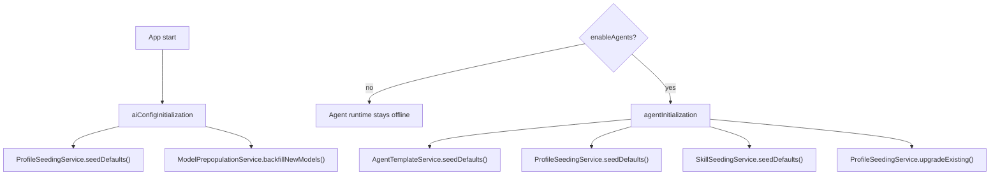
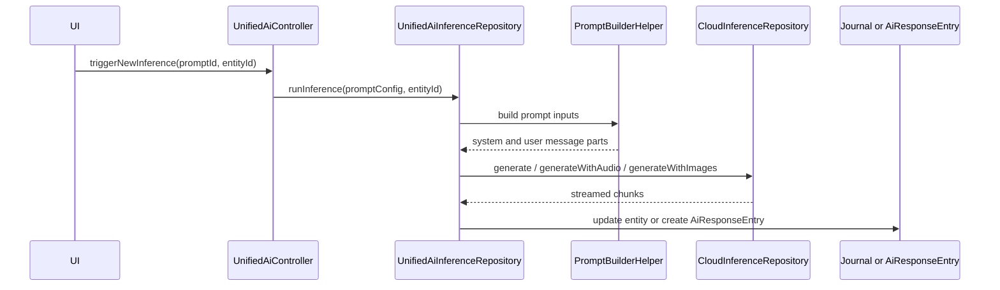
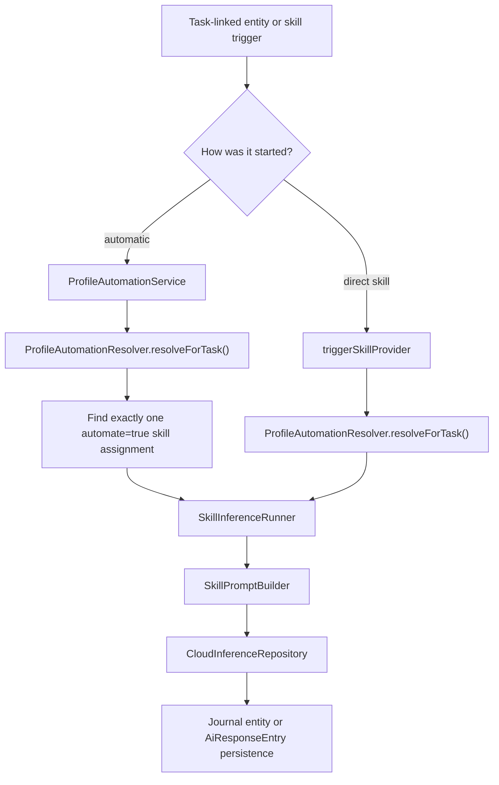
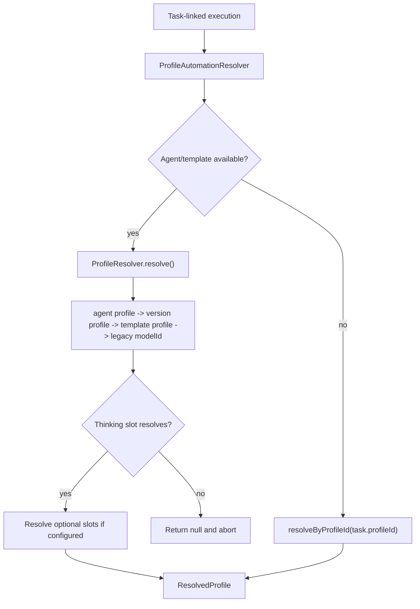
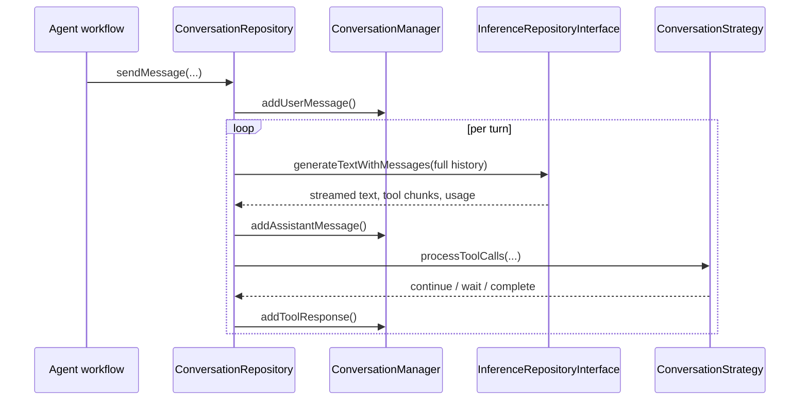

# AI Feature

The `ai` feature contains the shared AI plumbing used by manual prompts, skill-driven flows, agent conversations, and semantic search. It owns configuration persistence, prompt assembly, provider routing, conversation state, and embeddings. It does not decide when an agent wakes or what an agent's lifecycle looks like; that boundary sits in `features/agents`.

## Runtime Boundary

Two startup paths shape the feature:

- `aiConfigInitialization` always runs and seeds default inference profiles plus known models.
- `agentInitialization` runs only when the agents flag is enabled and then seeds templates, skills, and upgrades default profiles with skill assignments.

## Configuration Model

`AiConfigRepository` persists all AI configuration objects in `AiConfigDb` and syncs changes through the outbox layer. The runtime is built from five config variants plus one resolved runtime object:

| Object | Stored as | Used by |
| --- | --- | --- |
| Provider | `AiConfig.inferenceProvider` | Base URL, API key, and provider type |
| Model | `AiConfig.model` | Provider model ID, modalities, function-calling support |
| Prompt | `AiConfig.prompt` | Legacy/manual prompt execution through `UnifiedAiInferenceRepository` |
| Profile | `AiConfig.inferenceProfile` | Capability slots for thinking, transcription, vision, and image generation |
| Skill | `AiConfig.skill` | User-editable capability contract plus `ContextPolicy` |
| Resolved profile | `ResolvedProfile` | Runtime profile with providers hydrated from configured model IDs |

The key split is between skills and profiles:

- a skill defines the instructions and how much context to inject
- a profile defines which configured model/provider slot executes that skill

That split is what lets the app move the same skill between providers without rewriting the prompt contract.

## Main Execution Paths

### Legacy prompt path

This is the older prompt-driven flow based on `AiConfig.prompt`.

1. `UnifiedAiController` loads an `AiConfigPrompt`.
2. `UnifiedAiInferenceRepository` validates whether the prompt fits the current entity and platform.
3. `PromptBuilderHelper` prepares prompt-specific task, audio, image, and linked-entity context.
4. `CloudInferenceRepository` routes the request to the correct provider implementation.
5. The result is written back to the journal entity or persisted as an `AiResponseEntry`, depending on `AiResponseType`.

Notes grounded in code:

- `AiResponseType.taskSummary` and `AiResponseType.checklistUpdates` are deprecated and kept for persistence compatibility.
- Prompt generation also exists in the skill path via `SkillInferenceRunner.runPromptGeneration()`.

### Profile and skill path

This is the newer path built around `AiConfig.skill`, `AiConfig.inferenceProfile`, `ProfileResolver`, and `SkillInferenceRunner`.

There are two entry styles:

- automatic profile-driven handling through `ProfileAutomationService`
- direct skill execution through `triggerSkillProvider`

Today the automatic path is narrower than the direct one:

- automatic: `tryTranscribe()` and `tryAnalyzeImage()`
- direct: transcription, image analysis, prompt generation, and image generation

`imagePromptGeneration` is seeded as a skill, but `triggerSkillProvider` does not execute it yet.

The automatic branch is intentionally strict:

- it only handles a skill type when exactly one automated assignment matches
- if multiple automated skills of the same type exist, the profile is treated as ambiguous and automation is skipped
- the resolved profile must expose the required model slot for that skill type

`SkillInferenceRunner` then persists results according to skill type:

- transcription updates `JournalAudio.transcripts` and `entryText`
- image analysis appends text to the `JournalImage` entry
- prompt generation creates an `AiResponseEntry`
- image generation imports a generated image, sets it as task cover art, then triggers automatic image analysis on the generated image

#### Context injection

`SkillPromptBuilder` is the only place that assembles runtime skill messages. It injects context based on `ContextPolicy` and skill type:

- `none`: no extra task context
- `dictionaryOnly`: speech dictionary only
- `taskSummary`: current task summary only
- `fullTask`: task JSON, linked tasks, and other richer context

In practice the builder may also inject:

- speech dictionary terms
- linked task JSON
- current task summary
- audio transcript text
- correction examples
- URL-formatting rules for image analysis

## Profile Resolution

`ProfileResolver` is the shared resolution engine for agent wakes. `ProfileAutomationResolver` wraps it for task-linked automation and adds one extra fallback to a task-level `profileId`.

Resolution order for the agent path:

1. `agentConfig.profileId`
2. `AgentTemplateVersionEntity.profileId`
3. `AgentTemplateEntity.profileId`
4. legacy fallback: `version.modelId ?? template.modelId`

Resolution order for task automation:

1. try the agent path above
2. if that fails, try the task's own `profileId`

Only the thinking slot is fatal. Optional slots resolve best-effort.

## Conversation and Tool Calling

`ConversationRepository` and `ConversationManager` provide the reusable multi-turn conversation loop used by agent-style tool calling.

Responsibilities in code:

- preserve conversation history
- emit conversation events for the UI
- accumulate streamed tool calls across chunks
- keep Gemini thought signatures between turns
- re-enter the loop through a `ConversationStrategy` after tool execution

`CloudInferenceWrapper` adapts `CloudInferenceRepository` to `InferenceRepositoryInterface`, so cloud and local providers can participate in the same conversation loop.

Implementation details that matter:

- tool call arguments are buffered by stable tool call ID or index so streamed JSON is reassembled safely
- Gemini-specific thought signatures are stored in `ConversationManager` and replayed on later turns
- the repository has provider-specific handling for Gemini-style multi-call chunks that arrive without stable IDs

## Provider Routing

`CloudInferenceRepository` is the central router despite its name; it also handles local providers such as Ollama, Whisper, and Voxtral.

| Operation | Dedicated branches | Fallback |
| --- | --- | --- |
| `generate()` | Ollama, Gemini, Mistral | OpenAI-compatible chat streaming |
| `generateWithImages()` | Ollama | OpenAI-compatible multimodal chat |
| `generateWithAudio()` | Whisper, Voxtral, OpenAI transcription endpoint, Mistral transcription endpoint | OpenAI-compatible audio chat completions |
| `generateWithMessages()` | Gemini, Ollama, Mistral | OpenAI-compatible full-history chat |
| `generateImage()` | Gemini, Alibaba DashScope | Unsupported for all other provider types |

This routing is implemented in code, not inferred from documentation. If a provider type is not branched explicitly for an operation, it falls through to the compatibility client or throws `UnsupportedError`.

## Embeddings and Semantic Search

The feature also owns local embeddings and vector search.

Runtime pieces:

- `EmbeddingService` listens to local update notifications and performs real-time embedding work
- `EmbeddingProcessor` hashes content, chunks text, generates embeddings, and writes them atomically
- `EmbeddingStore` is the storage abstraction
- `ShardedEmbeddingStore` is the production implementation, backed by per-category ObjectBox shards
- `VectorSearchRepository` embeds the query through Ollama and resolves hits back to tasks or entries

```mermaid
flowchart LR
  Change["Entity change notification"] --> Service["EmbeddingService"]
  Service --> Extract["EmbeddingProcessor"]
  Extract --> Chunk["TextChunker.chunk()"]
  Chunk --> Embed["OllamaEmbeddingRepository.embed()"]
  Embed --> Store["EmbeddingStore / ShardedEmbeddingStore"]
  Store --> Search["VectorSearchRepository.search*()"]
  Search --> Resolve["Resolve tasks or entries"]
```

Grounded implementation notes:

- the feature is gated by `enableEmbeddingsFlag`
- embeddings currently depend on a resolvable Ollama base URL
- tasks can be embedded with label-enriched text, not just raw title/body
- agent reports are stored with `taskId` metadata so search results can resolve back to the owning task

## Seeded Defaults

`ProfileSeedingService` currently seeds these profiles:

- `Gemini Flash`
- `Gemini Pro`
- `OpenAI`
- `Mistral (EU)`
- `Chinese AI Profile`
- `Local (Ollama)`
- `Local Power (Ollama)`

Operational details from the seeded definitions:

- the two local profiles are `desktopOnly`
- `Local (Ollama)` ships with image-analysis automation but no transcription slot
- `Local Power (Ollama)` currently ships with no default skill assignments

`SkillSeedingService` currently seeds seven skills:

- `Transcribe Audio`
- `Transcribe (Task Context)`
- `Analyze Image`
- `Analyze Image (Task Context)`
- `Generate Cover Art`
- `Generate Coding Prompt`
- `Generate Image Prompt`

## Sharp Edges

- The prompt system and the skill/profile system still coexist. Both are active in the codebase.
- Automatic profile-driven handling currently covers only transcription and image analysis.
- `imagePromptGeneration` is seeded but not wired for execution in `triggerSkillProvider`.
- Image generation is currently implemented only for Gemini and Alibaba providers.
- Data residency is not enforced by code. The actual request destination is whatever `baseUrl` is configured on the selected provider.

## Reading Guide

If you are tracing the feature in code, start here:

- `model/ai_config.dart`
- `repository/ai_config_repository.dart`
- `state/ai_config_initialization.dart`
- `util/profile_seeding_service.dart`
- `util/skill_seeding_service.dart`
- `util/profile_resolver.dart`
- `services/profile_automation_service.dart`
- `services/skill_inference_runner.dart`
- `helpers/skill_prompt_builder.dart`
- `conversation/`
- `repository/cloud_inference_repository.dart`
- `service/embedding_service.dart`
- `repository/vector_search_repository.dart`
- `ui/settings/` for provider/model/prompt/profile/skill editors

For the lifecycle layer that sits above this plumbing, continue with [../agents/README.md](../agents/README.md).
