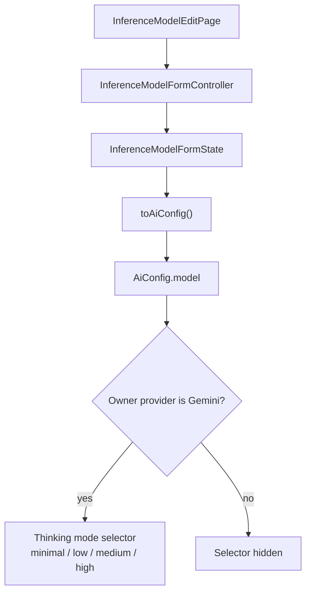
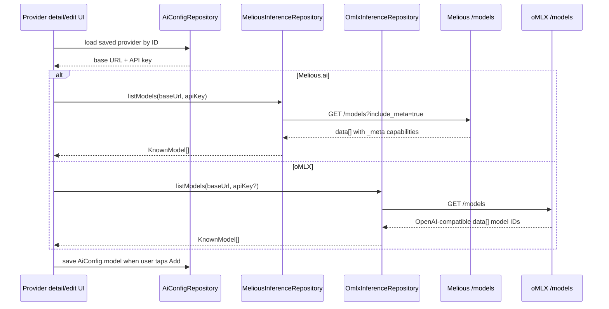
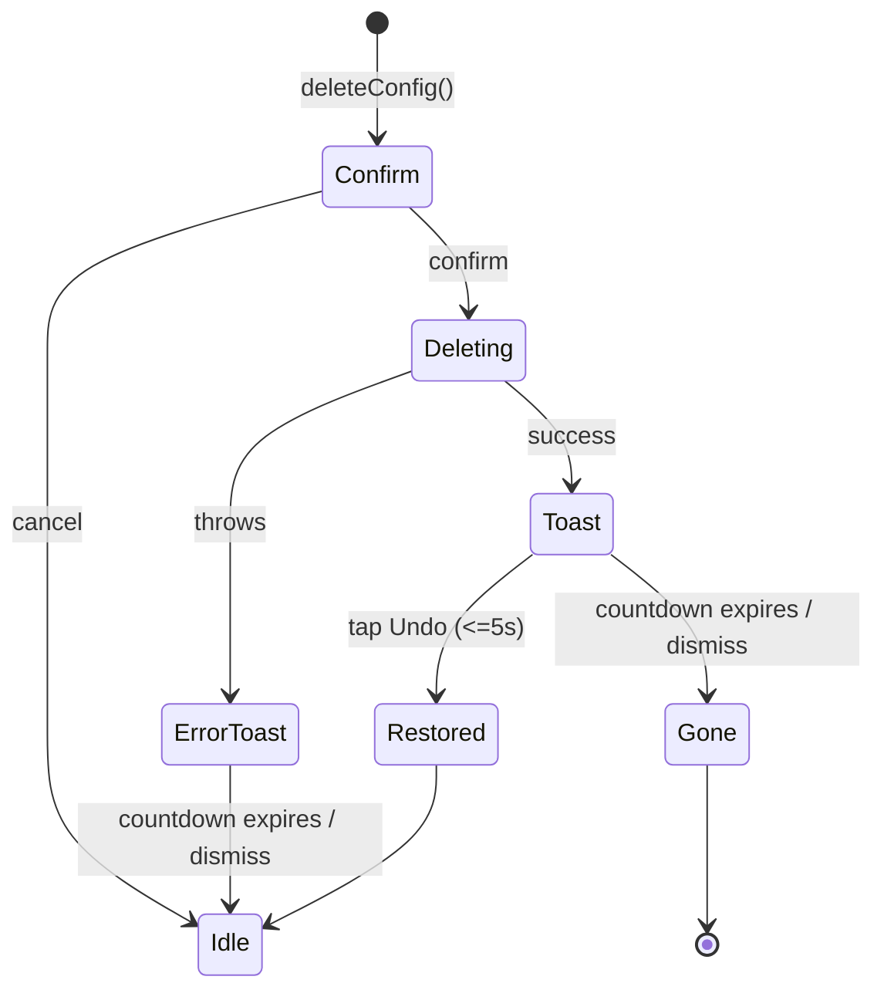

# AI Settings Module

A comprehensive settings interface for managing AI configurations including inference providers, models, and inference profiles.

## Overview

The AI Settings module provides a unified interface for managing all AI-related configurations in the Lotti application. It replaces the previous scattered AI settings buried in advanced menus with a top-level, user-friendly interface.

## Architecture

### Design Principles

1. **Separation of Concerns**: UI, business logic, and state management are clearly separated
2. **Single Responsibility**: Each component has one clear responsibility
3. **Testability**: All components can be unit tested in isolation
4. **Type Safety**: Heavy use of sealed classes and generics for compile-time safety
5. **Documentation**: Comprehensive documentation for maintainability

### Module Structure

This is a curated subset of the directory — the most load-bearing files
for the live page — not an exhaustive listing. The actual directory also
contains the inference edit pages (`inference_model_edit_page.dart`,
`inference_provider_edit_page.dart`,
`inference_provider_form_create.dart` / `_edit.dart`), layout helpers
(`breakpoints.dart`, `form_bottom_bar.dart`,
`embedding_backfill_modal.dart`), the `provider/` subtree (provider
detail page + sections), the `util/` subtree (`active_profile.dart`,
`ai_provider_status.dart`, `ai_provider_visual.dart`,
`ai_settings_back_nav.dart`), and additional `services/` entries
(per-provider `*_ftue_setup.dart`, `ai_setup_prompt_service.dart`,
`gemini_setup_prompt_service.dart`, `ftue_helpers.dart`).

```
lib/features/ai/ui/settings/
├── ai_settings_page.dart                   # Main page component
├── ai_settings_tab_builders.dart           # Per-tab body builders (part of page)
├── ai_settings_filter_state.dart           # Filter state model
├── ai_settings_filter_service.dart         # Filtering business logic
├── ai_settings_navigation_service.dart     # Navigation logic
├── inference_model_edit_page.dart          # Model edit form
├── inference_provider_edit_page.dart       # Provider edit form
├── ai_config_card.dart                     # Legacy config card (unused by page)
├── provider/                               # Provider detail page + sections
│   ├── ai_provider_detail_page.dart        # Intermediate provider detail page
│   ├── ai_provider_connection_section.dart
│   └── ai_provider_models_section.dart
├── util/                                   # Shared status/visual/nav helpers
│   ├── active_profile.dart
│   ├── ai_provider_status.dart
│   ├── ai_provider_visual.dart
│   └── ai_settings_back_nav.dart
├── services/
│   ├── ai_config_delete_service.dart       # Delete + cascade + undo (DS toast)
│   ├── connection_verifier_service.dart    # Live API-key verification
│   ├── ftue_trigger_service.dart           # First-time UX gating
│   ├── provider_prompt_setup_service.dart  # Provider FTUE prompt setup
│   ├── ai_setup_prompt_service.dart        # Setup-prompt service
│   ├── gemini_setup_prompt_service.dart    # Gemini setup-prompt service
│   ├── ftue_helpers.dart                   # Shared FTUE helpers
│   └── *_ftue_setup.dart                   # Per-provider FTUE setup
│                                           #   (alibaba/anthropic/gemini/
│                                           #    mistral/ollama/openai)
├── widgets/
│   ├── ai_settings_search_bar.dart         # Search input (used via v2 header bar)
│   ├── ai_settings_filter_chips.dart       # Models-tab filter chips
│   ├── config_error_state.dart             # Error state UI (used by page)
│   ├── config_loading_state.dart           # Loading state UI (used by page)
│   ├── ai_settings_floating_action_button.dart # Contextual FAB
│   ├── ai_settings_tab_bar.dart            # Legacy tab bar (unused by page)
│   ├── ai_settings_config_sliver.dart      # Legacy sliver config list (unused)
│   ├── ai_settings_fixed_header.dart       # Legacy fixed header (unused)
│   ├── config_empty_state.dart             # Legacy empty state (unused by page)
│   ├── dismiss_background.dart             # Legacy swipe-to-delete background
│   ├── dismissible_config_card.dart        # Legacy dismissible card wrapper
│   ├── ftue/                               # Live add-provider modal flow
│   │   ├── ai_pick_provider_modal.dart         # Step 1: choose a provider
│   │   ├── ai_provider_setup_preview_modal.dart # Step 2: preview rows/models
│   │   ├── ai_provider_setup_preview_rows.dart
│   │   ├── ai_provider_setup_preview_models.dart
│   │   └── ai_provider_setup_result_modal.dart # Step 3: result
│   └── v2/                                 # Live card chrome
│       ├── ai_settings_header_bar.dart     # Search row
│       ├── ai_settings_tab_bar.dart        # Providers/Models/Profiles tabs
│       ├── ai_settings_cards.dart          # Card barrel: AiProviderIconTile + re-exports
│       ├── ai_provider_card.dart           # Providers-tab card (standalone)
│       ├── ai_model_card.dart              # Models-tab card (standalone)
│       ├── ai_profile_card.dart            # Profiles-tab card (standalone)
│       ├── ai_settings_empty_view.dart     # FTUE banner + no-providers card
│       └── ai_card_action_menu.dart        # Per-card ⋯ overflow menu
└── README.md                               # This documentation
```

## Architecture Overview

### Sliver-Based Layout

The AI Settings page renders as a single `CustomScrollView`. None of the
slivers are pinned/sticky — the title strip, search row, and tab bar all
scroll with the content.

**Key Benefits:**
- Smooth, performant scrolling with large lists
- Memory-efficient rendering of configuration lists

**Layout Structure:**
```dart
CustomScrollView(
  slivers: [
    SettingsPageHeader(...),            // Shared settings title strip
    SliverToBoxAdapter(                 // Search row (not pinned)
      child: AiSettingsHeaderBar(...),
    ),
    // _buildBodySlivers():
    SliverToBoxAdapter(                 // v2 tab bar (not pinned)
      child: AiSettingsTabBar(...),
    ),
    // Per-tab content built from the active tab:
    //   providers -> _buildProvidersGrid (AiProviderCard grid)
    //   models    -> AiSettingsFilterChips strip + _buildModelsList (AiModelCard)
    //   profiles  -> _buildProfilesGrid (AiProfileCard grid)
    SliverToBoxAdapter(child: SizedBox(height: 80)),
  ],
)
```

When no providers are configured the body instead shows the
`AiSettingsFtueBanner` and `AiSettingsNoProvidersCard`. Initial-load and
error states render through `ConfigLoadingState` / `ConfigErrorState`
(`SliverFillRemaining`).

## Components

### Core Components

#### `AiSettingsPage`
The main page component that orchestrates the entire AI settings interface.

**Responsibilities:**
- Managing tab state and transitions
- Coordinating filter state with UI
- Handling search query updates
- Delegating navigation to service

**Usage:**
```dart
// Navigate to AI Settings
context.beamToNamed('/settings/ai');

// Or push directly
Navigator.push(context, MaterialPageRoute(
  builder: (_) => const AiSettingsPage(),
));
```

#### v2 Cards (`AiProviderCard`, `AiModelCard`, `AiProfileCard`)

The live page renders one card type per tab from `widgets/v2/`. Each card
widget is its own standalone library (`ai_provider_card.dart`,
`ai_model_card.dart`, `ai_profile_card.dart`); they share the leading
`AiProviderIconTile` widget, which lives in the
`widgets/v2/ai_settings_cards.dart` barrel and is re-exported alongside the
three cards. Importing `ai_settings_cards.dart` brings all three card types
plus `AiProviderCardStatus` (re-exported from `util/ai_provider_status.dart`)
into scope, so existing single-import call sites keep working. Each card
takes a `menuActions` list —
built by the page's `_buildCardMenu` — that populates the per-card `⋯`
overflow menu (`AiCardActionMenuButton`) with `Edit` and `Delete` rows.

- `AiProviderCard` — grid card for the Providers tab. Shows a connection
  status footer (`AiProviderCard.statusFor`) and an optional `onFix`
  action when the stored API key is invalid.
- `AiModelCard` — list card for the Models tab.
- `AiProfileCard` — grid card for the Profiles tab. Takes an `isActive`
  flag that marks the currently-active inference profile.

> Note: `AiConfigCard` (`ai_config_card.dart`, with a `compact` flag) and
> its `DismissibleConfigCard` wrapper are legacy widgets that are no
> longer referenced by the live page.

#### `InferenceModelEditPage`

The model edit form owns user-editable model-row fields: display name,
provider-native model ID, owning provider, modalities, reasoning/function-call
flags, max completion tokens, and the default Gemini thinking mode. The Gemini
thinking selector is conditional on the selected provider resolving to
`InferenceProviderType.gemini`; non-Gemini rows keep the stored default value
but do not render the selector.



Persisted rows that predate the field deserialize with
`GeminiThinkingMode.low`, matching the runtime's low-latency default.

#### Dynamic Provider Catalogs

The provider edit form normally renders the static `knownModelsByProvider`
catalog for the selected provider type. Melious.ai and oMLX are the dynamic
exceptions: for saved providers of either type, `AvailableModelsSection`
fetches the live catalog from the provider's configured base URL. The same
section is also embedded in the provider detail page before the installed
`Models · N` list, so the endpoint-backed catalog is visible where users manage
that provider. Melious uses the saved API key and `/models?include_meta=true`;
oMLX calls the local OpenAI-compatible `/models` endpoint and only sends bearer
auth when an API key is configured. The responses are translated into the same
`KnownModel` shape used by static catalogs, so the UI can reuse the existing
install tile and "Added" state. Live catalogs with more than eight rows render
inside a bounded, searchable list so provider detail pages do not grow by the
full endpoint result size.



#### Per-tab body builders (`ai_settings_tab_builders.dart`)

The per-tab content is built by helpers in `ai_settings_tab_builders.dart`
(a `part` of `ai_settings_page.dart`):

- `_buildProvidersGrid` / `_buildProfilesGrid` — responsive grids
  (1 column on mobile, 2 columns on desktop) of `AiProviderCard` /
  `AiProfileCard`.
- `_buildModelsList` — list of `AiModelCard`, preceded by the
  `AiSettingsFilterChips` strip on the Models tab.
- `_emptyTabSliver` — the empty-state sliver shown by each builder when a
  tab has no configs.

Deletion is wired through the per-card `⋯` overflow menu's `Delete` action
(`_buildCardMenu` → `AiConfigDeleteService`), not via swipe.

#### `AiSettingsHeaderBar` + `AiSettingsTabBar` (v2)

Search and tab navigation are two separate, non-pinned slivers:

- `AiSettingsHeaderBar` (`widgets/v2/ai_settings_header_bar.dart`) — the
  search row only. The "Add" affordance moved to the per-tab
  `AiSettingsFloatingActionButton`.
- `AiSettingsTabBar` (`widgets/v2/ai_settings_tab_bar.dart`) — the
  Providers / Models / Profiles tab strip, with per-tab counts.

> Note: `AiSettingsConfigSliver` (`widgets/ai_settings_config_sliver.dart`,
> with its `ConfigEmptyState` / `DismissibleConfigCard` / swipe-to-delete
> chrome) and `AiSettingsFixedHeader`
> (`widgets/ai_settings_fixed_header.dart`, a pinned search+tabs+filters
> header) are legacy widgets that the live page no longer uses.

#### `AiSettingsFloatingActionButton`
A context-aware FAB that changes based on the active tab.

**Features:**
- Circular design-system FAB (`DesignSystemFloatingActionButton`)
- A single additive `+` glyph on every tab; the per-tab meaning is carried as
  the FAB's `semanticLabel` (screen readers / tooltips), not as a visible inline
  label and not as a per-tab glyph
- Wrapped in shared bottom-navigation clearance so it stays above the floating shell

**Tab Configurations (label only — the glyph is always `+`):**
- Providers: "Add Provider"
- Models: "Add Model"
- Profiles: "Add Profile"

### State Management

#### `AiSettingsFilterState`
Immutable state model using Freezed for all filter criteria.

**Features:**
- Type-safe filter state
- Immutable updates with `copyWith`
- Helper methods for common operations
- Validation for tab-specific filters

**Usage:**
```dart
// Create initial state
final state = AiSettingsFilterState.initial();

// Update search query
final newState = state.copyWith(searchQuery: 'anthropic');

// Check if filters are active
if (state.hasActiveFilters) {
  // Show clear filters button
}
```

### Services

#### `AiSettingsFilterService`
Pure functions for filtering AI configurations.

**Benefits:**
- Easily unit testable
- No side effects
- Consistent filtering logic
- Performance optimized

**Usage:**
```dart
final service = AiSettingsFilterService();
final filtered = service.filterModels(allModels, filterState);
```

#### `AiSettingsNavigationService`
Centralized navigation logic for AI configuration editing.

**Features:**
- Type-safe navigation based on config type
- Consistent edit page routing
- Support for create vs edit modes

**Usage:**
```dart
final navigationService = AiSettingsNavigationService();
await navigationService.navigateToConfigEdit(context, config);
```

**Provider form placement (root navigator on mobile):**
`navigateToCreateProvider` and `navigateToProviderEdit` push the
`InferenceProviderEditPage` onto the **root** navigator on mobile via the
shared `bottomNavSafeNavigatorOf`
(`lib/widgets/nav_bar/bottom_nav_safe_navigator.dart`, gated by
`NavService.isDesktopMode`). The app shell paints its bottom navigation bar
as a floating overlay on top of each tab's page stack, so a form pushed onto
the nested tab navigator would have its sticky save bar hidden behind that
pill — the form would mount but the user couldn't reach "Save". Lifting it
above the whole shell keeps the save action reachable. On desktop there is no
bottom nav (a sidebar drives navigation) and the form is meant to overlay only
the settings panel, so the nested push is kept there. The form's footer is
wrapped in a bottom-only `SafeArea` so the save action clears the home
indicator once it owns the bottom edge.

The same helper backs the agent template/soul editors and the evolution chat
(pushed from review pages); the route-driven counterpart for editors that
*are* their own settings routes is `settingsRouteHidesBottomNav` in
`lib/beamer/beamer_app.dart`.

#### `AiConfigDeleteService`
Single entry point for deleting any `AiConfig` variant. Pairs a
confirmation modal with a design-system warning toast that carries a
5-second undo window. For `AiConfigInferenceProvider` the repository
cascades the delete to associated models; the cascaded model names are
folded into the toast description via `aiDeleteToastCascadeDescription`
(localized plural).

```dart
const AiConfigDeleteService().deleteConfig(
  context: context,
  ref: ref,
  config: config,
);
```

**Delete lifecycle:**



Provider deletes pass the `CascadeDeletionResult` through to the undo
handler so the provider *and* every cascaded model are re-saved on
undo. Other variants restore the single config. Undo failures are
logged via `DomainLogger` under `LogDomain.ai` with subDomain
`DELETE_SERVICE`.

## Key Features

### 1. Unified Interface
- **Before**: AI settings scattered across 3 levels: Settings → Advanced → AI entries
- **After**: Top-level "AI Settings" in main settings menu

### 2. Advanced Filtering
- **Text Search**: Across all configuration names and descriptions
- **Provider Filtering**: Filter models by their inference provider
- **Capability Filtering**: Filter models by capabilities (vision, audio, reasoning)
- **Smart Filtering**: Filters are context-aware (only relevant filters shown per tab)

### 3. Tabbed Navigation
- **Providers Tab**: Manage AI inference providers (OpenAI, Anthropic, etc.)
- **Models Tab**: Manage AI models with advanced filtering options. The
  Models-tab card (`AiModelCard`) shows the name, provider-model id,
  capability chips, and MLX download status — it does not expose the
  Gemini thinking mode. The default Gemini thinking mode is edited inside
  the model edit form (`InferenceModelEditPage`); popup-triggered skills
  can override that default for one invocation.
- **Profiles Tab**: Manage inference profiles

### 4. Card-Tap Navigation
- **Model / Profile cards**: tapping a card beams straight to the edit
  route (`/settings/ai/model/<id>` or `/settings/ai/profile/<id>`) via
  `navigateToConfigEdit`.
- **Provider cards**: tapping a provider card routes through an
  intermediate `AiProviderDetailPage` (`/settings/ai/provider/<id>`) via
  `navigateToProviderDetail`; the user reaches `InferenceProviderEditPage`
  from there. The card's "Fix" affordance (shown when the stored API key
  is invalid) routes to the same detail page with `focusApiKey: true`,
  which pushes the edit form with the key field focused.
- The deprecated swipe-to-delete chrome is gone; deletion runs from the
  per-card `⋯` overflow menu.

## Usage Examples

### Basic Page Usage

```dart
import 'package:lotti/features/ai/ui/settings/ai_settings_page.dart';

// In your route configuration
BeamPage(
  key: const ValueKey('settings-ai'),
  title: 'AI Settings',
  child: const AiSettingsPage(),
),
```

### Custom Filtering

```dart
// Create custom filter state
final customFilter = AiSettingsFilterState(
  searchQuery: 'claude',
  selectedCapabilities: {Modality.image, Modality.audio},
  reasoningFilter: true,
);

// Apply filters
final service = AiSettingsFilterService();
final filteredModels = service.filterModels(allModels, customFilter);
```

### Navigation Integration

```dart
// Navigate to specific config edit page
final navigationService = AiSettingsNavigationService();

// Edit existing config
await navigationService.navigateToConfigEdit(context, existingConfig);

// Create new config
await navigationService.navigateToCreateProvider(context);
```

## Testing

### Unit Tests
All business logic is unit testable:

```dart
// Test filter service
test('filters models by capabilities', () {
  final service = AiSettingsFilterService();
  final filterState = AiSettingsFilterState(
    selectedCapabilities: {Modality.image},
  );

  final result = service.filterModels(testModels, filterState);

  expect(result.every((m) => m.inputModalities.contains(Modality.image)), isTrue);
});
```

### Widget Tests
UI components can be tested in isolation:

```dart
testWidgets('search bar shows clear button when text present', (tester) async {
  final controller = TextEditingController(text: 'test');

  await tester.pumpWidget(
    makeTestableWidgetWithScaffold(
      AiSettingsSearchBar(
        controller: controller,
        hintText: 'Search providers, models, profiles...',
      ),
    ),
  );

  // AiSettingsSearchBar wraps the design system's DesignSystemSearch.
  expect(find.byIcon(Icons.cancel_rounded), findsOneWidget);
});
```

### Integration Tests
Full page functionality:

```dart
testWidgets('switches tabs and updates filters', (tester) async {
  await tester.pumpWidget(createTestApp());

  // Switch to models tab
  await tester.tap(find.text('Models'));
  await tester.pumpAndSettle();

  // Should show model-specific filters
  expect(find.text('Capabilities:'), findsOneWidget);
});
```

## Performance Considerations

### 1. Filtering Performance
- Filters are applied only when state changes
- Uses efficient `where()` operations on lists
- Debounced search to avoid excessive filtering

### 2. Memory Management
- Controllers are properly disposed
- State updates use immutable data structures
- No memory leaks in navigation

### 3. Rendering Performance
- Sliver-based lists for optimal performance
- Lazy loading with SliverList delegates
- Minimal rebuilds with proper state management
- Optimized search field updates with debouncing
- Efficient scroll event propagation

## Accessibility

### 1. Semantic Labels
- All interactive elements have semantic labels
- Screen reader friendly descriptions
- Proper focus management

### 2. Keyboard Navigation
- Tab order follows logical flow
- Search field supports keyboard navigation
- All actions accessible via keyboard

### 3. Color Accessibility
- High contrast color schemes
- No color-only information
- Proper focus indicators

## Migration Guide

### From Old AI Settings

The new AI Settings page replaces several old interfaces:

1. **Advanced Settings → AI Providers** → Now: AI Settings → Providers tab
2. **Advanced Settings → AI Models** → Now: AI Settings → Models tab
3. **Advanced Settings → AI Profiles** → Now: AI Settings → Profiles tab

### Breaking Changes

- Navigation paths have changed (old paths still work but redirect)
- Some filter combinations may behave differently
- Card taps no longer pass through intermediate list pages. Model and
  profile cards beam straight to their edit route; provider cards open an
  intermediate `AiProviderDetailPage` before the edit form.

### Compatibility

- All existing AI configurations continue to work
- Data migration is not required
- Old navigation paths redirect to new interface

## Future Enhancements

### Planned Features

1. **Batch Operations**: Select and edit multiple configurations
2. **Import/Export**: Backup and restore AI configurations
3. **Configuration Validation**: Real-time validation of settings
4. **Usage Analytics**: Show which configs are most used
5. **Configuration Templates**: Quick setup for common scenarios

### Extension Points

The modular architecture allows easy extension:

- Add new filter types in `AiSettingsFilterService`
- Add new navigation targets in `AiSettingsNavigationService`
- Add new UI components in `widgets/` directory
- Extend filter state in `AiSettingsFilterState`
- Create custom state widgets following the pattern of `ConfigErrorState`, etc.
- Add new sliver implementations for different list behaviors

## Widget Extraction Pattern

The AI Settings module follows a consistent pattern of extracting reusable widgets:

1. **State Widgets**: `ConfigErrorState`, `ConfigLoadingState`
   - Used by the page for error / initial-loading states
   - Single responsibility for each state
   - Easy to test in isolation
   - Empty tabs use the page's `_emptyTabSliver` helper; `ConfigEmptyState`
     is legacy (only referenced by `AiSettingsConfigSliver`).

2. **Composite Widgets**: `AiSettingsHeaderBar`, `AiSettingsTabBar` (v2)
   - Combine multiple UI elements
   - Encapsulate complex behavior
   - Reduce parent widget complexity
   - (`AiSettingsFixedHeader` / `DismissibleConfigCard` are legacy.)

3. **Behavioral Widgets**: `AiSettingsFloatingActionButton`
   - Per-tab icon + semantic label
   - Reusable across different contexts
   - Self-contained logic
   - (`DismissBackground` is legacy.)

## Contributing

### Code Style

- Follow existing Dart/Flutter conventions
- Use comprehensive documentation comments
- Add unit tests for all business logic
- Add widget tests for UI components

### Adding New Features

1. Define requirements and design
2. Update relevant state models
3. Implement business logic in services
4. Create/update UI components
5. Add comprehensive tests
6. Update documentation

### Testing Requirements

- Unit tests for all services and utilities
- Widget tests for all UI components
- Integration tests for key user flows
- Accessibility testing for new components
