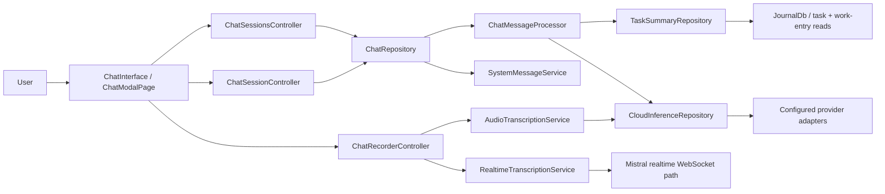
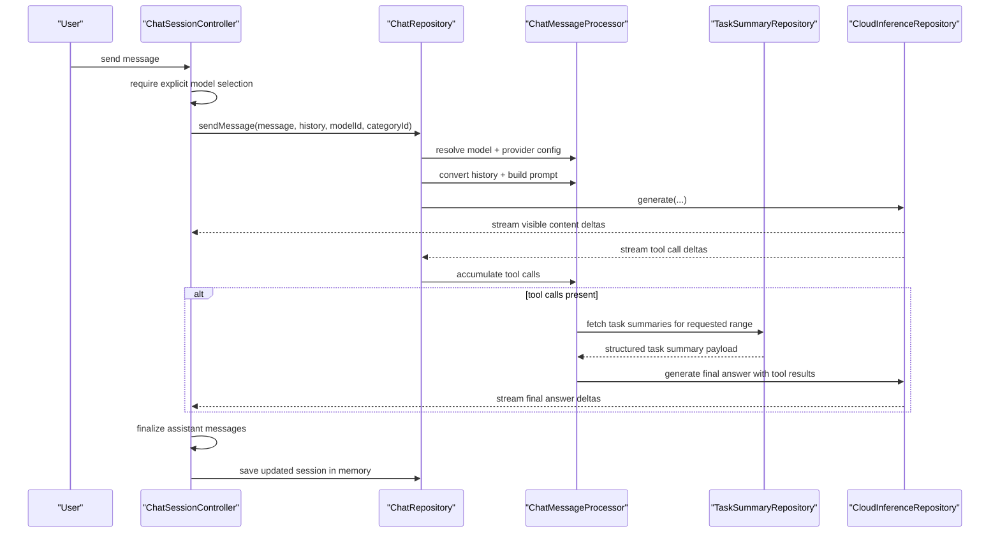
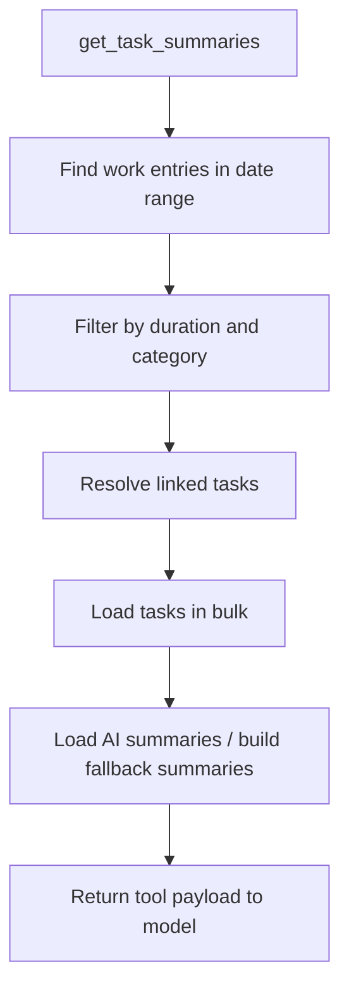
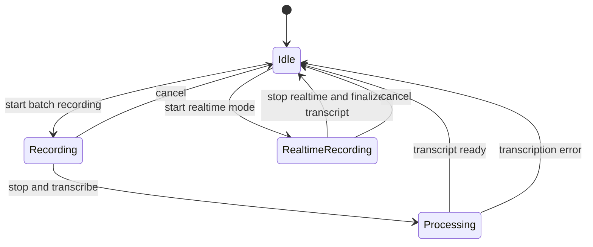
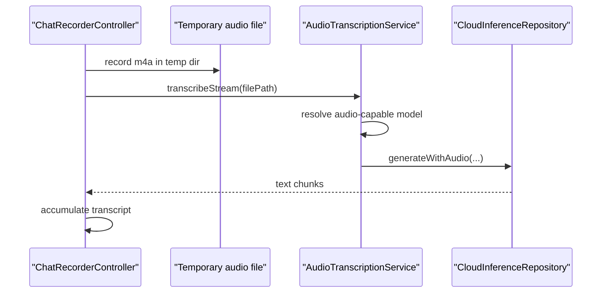
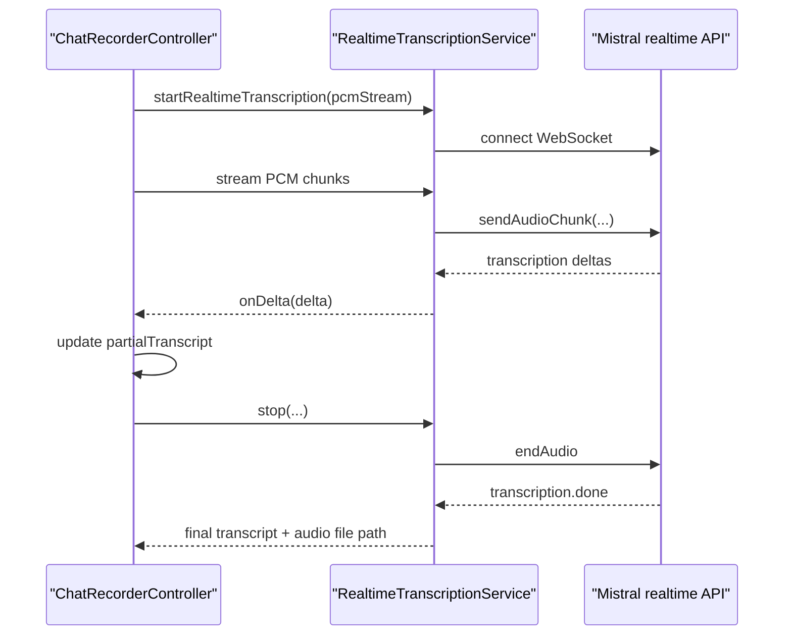

# AI Chat Feature

The `ai_chat` feature is Lotti's interactive question-and-answer surface over task history.

It is not the agent runtime, and it is not the general provider stack. It sits above the `ai` feature and below the chat UI, giving the user a session-scoped way to ask things like:

- what did I finish last week?
- what patterns show up in this category?
- what did I actually spend time on?

And, because typing is not always the mood, it also owns the chat-specific voice input path.

## What This Feature Owns

At runtime, the feature owns five concrete jobs:

1. session and message state for the chat UI
2. explicit model selection for each chat session
3. streaming assistant output, including tool-calling turns
4. the task-summary retrieval tool used by the assistant
5. batch and realtime transcription for chat input

It does not own:

- provider configuration and routing policy
- agent wake cycles or memory
- durable long-term chat persistence

That last point is important: `ChatRepository` currently stores sessions and messages in memory. This feature behaves like an interactive workbench, not like a durable knowledge base.

## Directory Shape

```text
lib/features/ai_chat/
├── models/
├── repository/
├── services/
├── ui/
│   ├── controllers/
│   ├── models/
│   ├── pages/
│   ├── providers/
│   └── widgets/
└── README.md
```

## Architecture



The structure is intentionally split:

- controllers own UI-facing state
- `ChatRepository` orchestrates a chat turn
- `ChatMessageProcessor` holds the testable prompt, tool, and stream logic
- task retrieval stays in `TaskSummaryRepository`
- transcription paths are separated into batch and realtime services

## Runtime Model

### Session layer

There are two controllers, and they do different jobs:

- `ChatSessionsController` manages the session list, recent sessions, creation, deletion, and switching
- `ChatSessionController` manages one active conversation, including streaming flags, selected model, visible messages, and errors

`ChatRepository` sits underneath both and currently stores:

- `_sessions`
- `_messages`

in memory only.

That means:

- recent sessions survive only for the current app lifetime
- there is no database-backed transcript history yet
- deleting or switching sessions is cheap because there is no persistence layer to migrate

### Chat turn flow



The important operational detail is that tool calls are accumulated while visible content is already streaming. This keeps the UI responsive even when the model is still building a tool request behind the curtain.

## The Only Built-In Tool: Task Summaries

The chat feature is deliberately narrow. It does not expose the whole app as an unbounded tool playground.

Right now the assistant's main structured retrieval tool is `get_task_summaries`.

`TaskSummaryRepository` resolves that tool request in several steps:

1. find relevant work entries in the requested date range
2. filter for meaningful work spans
3. resolve linked task relationships
4. load tasks in bulk
5. extract AI summaries where they exist
6. build fallback summaries where they do not



This is one of the reasons the feature feels smarter than a plain chat wrapper. It is not just handing the model a giant pile of journal text and wishing it luck.

## Streaming, Reasoning, and Message Segmentation

`ChatSessionController` does not treat the provider stream as one dumb text blob.

It uses:

- `ChatStreamParser`
- `thinking_parser.dart`
- `ChatStreamUtils`

to separate:

- visible answer text
- hidden reasoning blocks

Behavior that matters:

- visible answer text streams into a dedicated assistant bubble
- reasoning segments are finalized as separate assistant messages
- copying assistant output strips hidden reasoning by default
- Gemini-specific "thinking" behavior is normalized at the provider layer and then hidden or shown by the chat UI

This keeps the UX cleaner than the classic "model dumped its chain-of-thought into the answer and now the user has to scroll past a small novel."

## Chat Recorder State Machine

The chat recorder has its own controller and its own state machine. It is separate from the general speech feature because the chat flow has different output semantics: the transcript either becomes chat input or is auto-sent.



Controller states are:

- `idle`
- `recording`
- `realtimeRecording`
- `processing`

The controller also tracks:

- waveform amplitude history
- `partialTranscript` for live mode
- final `transcript`
- structured error type
- whether realtime mode is selected

## Voice Input Paths

### Batch transcription path

`AudioTranscriptionService`:

- reads AI configs
- finds audio-capable models
- prefers `gemini-2.5-flash` when present
- excludes realtime-only Mistral models
- base64-encodes the local audio file
- calls `CloudInferenceRepository.generateWithAudio(...)`
- yields text chunks as they arrive



### Realtime transcription path

`RealtimeTranscriptionService` bypasses the normal HTTP inference path entirely.

It:

- resolves a Mistral realtime transcription model
- opens the WebSocket session
- streams PCM audio chunks
- computes local amplitude values from PCM
- accumulates text deltas
- on stop, waits for `transcription.done`
- writes buffered audio to WAV and converts it to M4A



### What happens after transcription

The chat feature deliberately distinguishes between:

- "I already selected a model, send this transcript straight into the chat"
- "I have not selected a model yet, put the transcript into the input field so I can inspect it first"

That is a better failure mode than guessing on the user's behalf.

## Model Selection Rules

The feature is strict here on purpose.

- model selection is explicit
- no automatic fallback is used for chat turns
- the selected model must support function calling
- `categoryId` is required for the send path

If the selected model cannot satisfy the tool contract, the chat turn fails early instead of pretending everything is fine and then hallucinating a summary from thin air.

## Privacy and Data Flow

The chat feature does not invent its own privacy policy. It inherits routing from the configured provider/model path:

- batch chat messages and batch transcription go through the selected provider path
- realtime transcription goes through the configured Mistral realtime endpoint
- task retrieval happens locally from Lotti's databases before any tool result is sent upstream

That means the privacy posture depends on the chosen provider configuration, not on the chat UI.

## Current Constraints

- sessions are in-memory only
- the built-in tool surface is intentionally narrow
- chat requires explicit model selection
- realtime transcription currently depends on a configured Mistral realtime model
- hidden reasoning behavior is normalized, but provider quirks still matter at the stream level

## Relationship to Other Features

- `ai_chat` owns the interactive question/answer surface
- `ai` owns providers, model metadata, routing, and multimodal transport
- `speech` owns the app-wide audio entry recorder and player
- `agents` owns long-running autonomous analysis

If `agents` is the part that thinks on its own schedule, `ai_chat` is the part that waits politely for the user to ask first.
