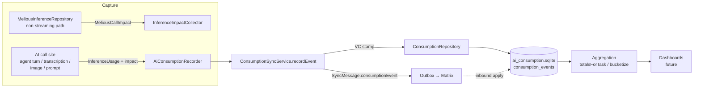
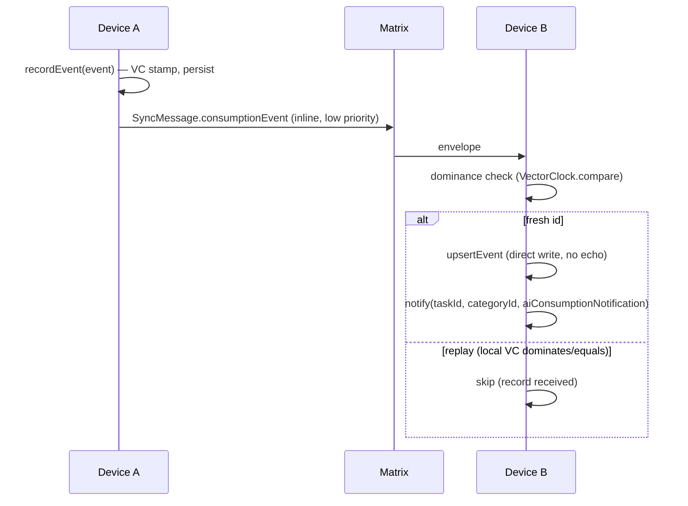

# AI Consumption

Records **what every AI backend call actually burns** — tokens, money, energy,
CO₂, water — as one immutable, append-only row per call, tagged with its owner
(task / category / entry) and the call that caused it. Those rows roll up into
per-task lifetime totals and per-category time-bucketed series, so the app can
answer "how many kWh / € / g CO₂ did this task cost over its lifetime?" and "what
did this category burn this week/month?".

This module is the **data layer + sync + capture mechanism**. It is deliberately
separate from the journal (`db.sqlite`) and agent (`agent.sqlite`) domains so
high-volume diagnostics writes never contend with primary data.

## Architecture

## Data model

One backend call → one `AiConsumptionEvent` (`model/ai_consumption_event.dart`),
persisted in `consumption_events` (`database/consumption_database.drift`).

- **Owners (denormalized, snapshot at call time):** `taskId`, `categoryId`,
  `entryId`, `agentId`, `wakeRunKey`, `threadId`, `turnIndex`, `promptId`,
  `skillId`, `configId`. `parentId` records the causal parent (for an agent turn
  this is the wake's run key).
- **Provider / model:** `providerType` (reuses `InferenceProviderType`),
  `modelId`, `providerModelId`, `responseType`
  (`AiConsumptionResponseType`: agentTurn / textGeneration / audioTranscription /
  imageAnalysis / imageGeneration / promptGeneration), `durationMs`.
- **Tokens:** `inputTokens`, `outputTokens`, `cachedInputTokens`,
  `thoughtsTokens`, `totalTokens`.
- **Cost + impact (nullable — only Melious reports these):** `credits` (≈ EUR),
  `energyKwh`, `carbonGCo2`, `waterLiters`, `renewablePercent`, `pue`,
  `dataCenter`, `upstreamProviderId`. Units are **as delivered** by Melious (kWh,
  grams CO₂, litres, credits) — no lossy conversion.

**Blob-plus-projection** (identical philosophy to `agent_entities`): the
`serialized` JSON column (including `vectorClock`) is the sync source of truth
and round-trips losslessly; the typed columns are a denormalized projection
written on insert purely so aggregation never touches the JSON blob. The Drift
row class is `ConsumptionEvent`; the domain model is `AiConsumptionEvent`
(deliberately different names, mirroring `AgentEntity` vs `AgentDomainEntity`).

Rows are immutable: a fresh UUID `id` is minted once, on the device that made the
call, and never mutated.

## Impact capture (Melious)

Melious returns `environment_impact` + `billing_cost` **only on non-streaming
responses** (verified against the reference service in `../greifswald`;
streaming yields just token `usage`). So the measured Melious calls are issued
non-streaming:

- `MeliousInferenceRepository` gains a raw non-streaming path
  (`_postChatCompletion` + `_asSyntheticChunk`). When a caller passes an
  `InferenceImpactCollector`, the adapter POSTs `stream: false`, parses
  `usage` + `environment_impact` + `billing_cost`, writes the parsed
  `MeliousCallImpact` (`model/ai_call_impact.dart`) to the collector, and
  re-emits the buffered reply as a **single synthetic stream chunk** so existing
  stream consumers are unchanged. Without a collector the original streaming path
  is used verbatim (no behavior change for non-measured calls).
- The `InferenceImpactCollector` is a mutable side-channel that mirrors
  `ThoughtSignatureCollector`: a call site constructs one, passes it down the
  inference call chain, and reads `impact` after the response drains. Non-Melious
  providers never populate it, so their rows carry tokens with impact fields null.

## Persistence & sync

`ConsumptionRepository` (`repository/consumption_repository.dart`) is raw,
append-only, idempotent-by-id persistence. `ConsumptionSyncService`
(`sync/consumption_sync_service.dart`) is the sync-aware write path — it stamps a
vector clock, persists, records the send in the sync sequence log, and enqueues a
`SyncMessage.consumptionEvent` for cross-device replication over Matrix.

Consumption events are a tiny, immutable **inline** sync payload (like
`SyncEntryLink`, not a file attachment). Because they consume the shared per-host
vector-clock counter, they participate in the sequence log and backfill so they
never look like gaps in journal/agent sync. Convergence is trivial: fresh id →
applied; replayed id whose local clock dominates/equals → skipped. Rows never
mutate, so there is no concurrent-merge case.

## Aggregation

- **Per-task lifetime totals** — `ConsumptionRepository.totalsForTask(taskId)`
  runs a single SQL `SUM` (`sumConsumptionByTask`) → `ConsumptionTotals`
  (call count, impact-bearing count, all token sums, credits, energy, carbon,
  water).
- **Per-category time-bucketed series** — `metricRowsInRange({start, end})` reads
  a slim projection (never `serialized`), then pure-Dart `bucketize`
  (`logic/consumption_bucketing.dart`) folds each call additively into a
  `(epochDay, categoryId)` cell → `ConsumptionDayBuckets`. Reuses the Insights
  epoch-day/period machinery and guards its two traps: no `julianday()` on the
  epoch-int `created_at`, and the denormalized `categoryId` means no
  `linked_entries` join fan-out.

The dashboard UI is intentionally **not** built here — this delivers only the
query layer a later dashboard consumes.

## Capture wiring

A call site creates an `InferenceImpactCollector`, threads it down through the
cloud-inference dispatch chain (`CloudInferenceRepository` →
`cloud_inference_generate[_more]` → `MeliousInferenceRepository`), and, after the
response drains, builds an `AiConsumptionEvent` (tokens from the response
`usage`, impact from the collector, owner ids from the local context) and hands
it to `AiConsumptionRecorder`. Recording is guarded end-to-end — a missing
recorder or a record failure can never break an inference.

**Live** — one event per completed call on:

- The legacy unified path (`UnifiedAiInferenceRepository._processCompleteResponse`
  → `_recordConsumption`): text generation, image analysis, audio transcription.
- The modern `SkillInferenceRunner` (all four: transcription, image analysis,
  image generation, prompt generation), each with its own `_recordConsumption`.
- **Agent turns, per turn** — `ConversationRepository.sendMessage` records one
  `agentTurn` event per turn (parent = wake run key), gated on owner ids passed
  by the workflow. The **task agent** (`task_agent_execute`) passes them.

Because a collector is threaded on these paths, Melious calls run
**non-streaming** so their impact is returned. Recording is skipped entirely
when no `AiConsumptionRecorder` is registered, so the wake path carries no
overhead when tracking is off.

**Remaining call sites** (same `sendMessage` mechanism, one guarded block each):
the project / event / day / evolution agent workflows — they call
`sendMessage` identically and just need to pass the (recorder-gated) owner ids.

## Status

Delivered and tested: the storage schema, repository, aggregation query layer,
full Matrix sync integration, the Melious non-streaming impact-capture mechanism
(`MeliousCallImpact` + `InferenceImpactCollector`), the `AiConsumptionRecorder`,
and end-to-end capture on the unified inference path, the skill runner, and
task-agent turns. The dashboard UI and the remaining agent workflows above are
the follow-on work.

## Testing

- `test/features/ai_consumption/` — DB round-trip/idempotency, aggregation
  (`totalsForTask`, `metricRowsInRange` epoch-int guard), pure bucketing
  (example + Glados property), and the sync service (VC stamp + enqueue).
- `test/features/ai/model/ai_call_impact_test.dart` — the Melious impact
  contract parsing.
- `test/features/sync/…` — `SyncMessage.consumptionEvent` round-trip, inbound
  apply/dominance, and backfill (via the generated backfill bench).
