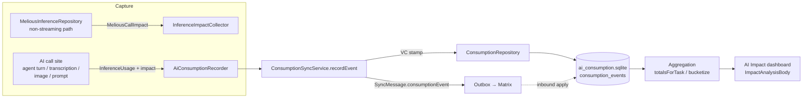
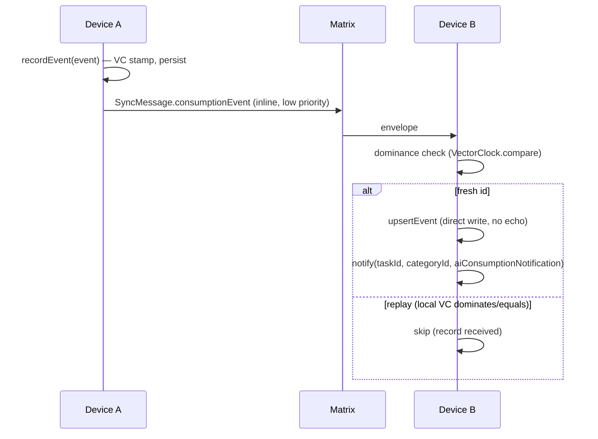
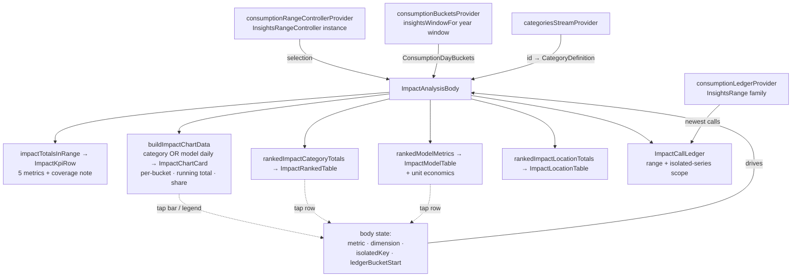

# AI Consumption

Records **what every AI backend call actually burns** — tokens, money, energy,
CO₂, water — as one immutable, append-only row per call, tagged with its owner
(task / category / entry) and the call that caused it. Those rows roll up into
per-task lifetime totals and per-category time-bucketed series, so the app can
per-task lifetime totals and per-category, per-model, and per-location
time-bucketed series, so the app can answer "how many kWh / € / g CO₂ did this
task cost over its lifetime?" and "which categories/models/locations burned what
this week/month?".

This module is the **data layer + sync + capture mechanism**. It is deliberately
separate from the journal (`db.sqlite`) and agent (`agent.sqlite`) domains so
high-volume diagnostics writes never contend with primary data.

## Architecture

## Data model

One backend call → one `AiConsumptionEvent` (`model/ai_consumption_event.dart`),
persisted in `consumption_events` (`database/consumption_database.drift`).

- **Owners (denormalized, snapshot at call time):** `taskId`, `categoryId`,
  `entryId`, `agentId`, `wakeRunKey`, `threadId`, `turnIndex`, `promptId`,
  `skillId`, `configId`. `parentId` records the causal parent (for an agent turn
  this is the wake's run key).
- **Provider / model:** `providerType` (reuses `InferenceProviderType`),
  `modelId`, `providerModelId`, `responseType`
  (`AiConsumptionResponseType`: agentTurn / textGeneration / audioTranscription /
  imageAnalysis / imageGeneration / promptGeneration), `durationMs`.
- **Tokens:** `inputTokens`, `outputTokens`, `cachedInputTokens`,
  `thoughtsTokens`, `totalTokens`.
- **Cost + impact (nullable — only Melious reports these):** `credits` (≈ EUR),
  `energyKwh`, `carbonGCo2`, `waterLiters`, `renewablePercent`, `pue`,
  `dataCenter`, `upstreamProviderId`. Units are **as delivered** by Melious (kWh,
  grams CO₂, litres, credits) — no lossy conversion.

**Blob-plus-projection** (identical philosophy to `agent_entities`): the
`serialized` JSON column (including `vectorClock`) is the sync source of truth
and round-trips losslessly; the typed columns are a denormalized projection
written on insert purely so aggregation never touches the JSON blob. The Drift
row class is `ConsumptionEvent`; the domain model is `AiConsumptionEvent`
(deliberately different names, mirroring `AgentEntity` vs `AgentDomainEntity`).

Rows are immutable: a fresh UUID `id` is minted once, on the device that made the
call, and never mutated.

## Impact capture (Melious)

Melious returns `environment_impact` + `billing_cost` **only on non-streaming
responses** (verified against the reference service in `../greifswald`;
streaming yields just token `usage`). So the measured Melious calls are issued
non-streaming:

- `MeliousInferenceRepository` gains a raw non-streaming path
  (`_postChatCompletion` + `_asSyntheticChunk`). When a caller passes an
  `InferenceImpactCollector`, the adapter POSTs `stream: false`, parses
  `usage` + `environment_impact` + `billing_cost`, writes the parsed
  `MeliousCallImpact` (`model/ai_call_impact.dart`) to the collector, and
  re-emits the buffered reply as a **single synthetic stream chunk** so existing
  stream consumers are unchanged. Without a collector the original streaming path
  is used verbatim (no behavior change for non-measured calls).
- The `InferenceImpactCollector` is a mutable side-channel that mirrors
  `ThoughtSignatureCollector`: a call site constructs one, passes it down the
  inference call chain, and reads `impact` after the response drains. Non-Melious
  providers never populate it, so their rows carry tokens with impact fields null.

## Persistence & sync

`ConsumptionRepository` (`repository/consumption_repository.dart`) is raw,
append-only, idempotent-by-id persistence. `ConsumptionSyncService`
(`sync/consumption_sync_service.dart`) is the sync-aware write path — it stamps a
vector clock, persists, records the send in the sync sequence log, and enqueues a
`SyncMessage.consumptionEvent` for cross-device replication over Matrix.

Consumption events are a tiny, immutable **inline** sync payload (like
`SyncEntryLink`, not a file attachment). Because they consume the shared per-host
vector-clock counter, they participate in the sequence log and backfill so they
never look like gaps in journal/agent sync. Convergence is trivial: fresh id →
applied; replayed id whose local clock dominates/equals → skipped. Rows never
mutate, so there is no concurrent-merge case.

## Aggregation

- **Per-task lifetime totals** — `ConsumptionRepository.totalsForTask(taskId)`
  runs a single SQL `SUM` (`sumConsumptionByTask`) → `ConsumptionTotals`
  (call count, impact-bearing count, all token sums, credits, energy, carbon,
  water).
- **Per-category, per-model, and per-location time-bucketed series** —
  `metricRowsInRange({start, end})` reads a slim projection (never
  `serialized`), then pure-Dart `bucketize`
  (`logic/consumption_bucketing.dart`) folds each call additively into a
  `(epochDay, categoryId)` cell → `ConsumptionDayBuckets.days` and into a
  `(epochDay, modelKey)` cell → `ConsumptionDayBuckets.modelDays`.
  `modelKey` prefers `providerModelId`, falls back to `modelId`, and uses null
  for calls whose endpoint reported usage without a model identifier. Rows with
  provider-reported `dataCenter` also fold into
  `ConsumptionDayBuckets.locationDays`, keyed by the normalized data-centre id
  and an inferred ISO-style country prefix when the id starts with one (`FI`,
  `FI-HEL1`, `SE/stockholm`). Renewable percentages are energy-weighted when
  energy is reported and fall back to a sample average otherwise. Reuses the
  Insights epoch-day/period machinery and guards its two traps: no `julianday()`
  on the epoch-int `created_at`, and the denormalized `categoryId` means no
  `linked_entries` join fan-out.

Adaptive-unit display formatting lives beside the bucketing logic
(`logic/consumption_formatting.dart`): every formatter returns the value
**with** its unit (`€1.23`, `40 Wh`, `1.2 kg`, `12.3K`) so no call site can
mislabel a converted number.

## Impact dashboard (UI)

`ui/impact_analysis_body.dart` (`ImpactAnalysisBody`) is the host-independent
dashboard core. Two hosts embed it:

- `ui/impact_analysis_page.dart` — the `/dashboards/impact` route (a thin
  `Scaffold` around the body), reached under Insights via
  `ui/widgets/impact_sidebar_entry.dart`.
- The Settings `ai-usage` panel (`settings_v2` panel registry), which wraps the
  body in a `SingleChildScrollView`. The body adapts: with bounded height it
  scrolls itself (`ListView`), with unbounded height it shrink-wraps and lets
  the host scroll. It also degrades to phone-width panes (~390 px): the period
  stepper and the five-segment metric toggle are fixed intrinsic-width strips
  that scroll horizontally instead of overflowing, and the KPI tiles reflow to a
  two/three-per-row grid.

The chart, its companion table, and the ledger all read the body's shared
`isolatedKey` / `ledgerBucketStart`, so a tap in any of them moves the others:
one isolate, one drill, one scope chip.

The body is the single provider consumer; the children are dumb value widgets:

- **Metric lens** — `model/impact_dashboard_models.dart` defines
  `ConsumptionMetric { cost, energy, carbon, tokens, requests }` with `valueOf`
  (projects credits / kWh / g CO₂ / total tokens / call count out of a
  `ConsumptionMetrics`), `formatValue` (delegates to the shared formatters),
  and `isCloudOnly` (false only for `requests`). `requests` (call count) is
  the one metric every provider populates — cost/energy/carbon are cloud-only
  and tokens need usage reporting — so it is the dependable lens for
  "favorite models over time". The KPI row shows all five totals (a
  responsive grid) plus a note that cost/energy/CO₂e are measured for cloud
  models only. When the immediately-preceding period is inside the loaded
  window (month/quarter views — a year-to-date view has no loaded prior year),
  each tile also carries a period-over-period trend delta ("▲/▼ N% vs prev"),
  computed from `impactTotalsInRange(buckets, previousPeriod(range, unit))` and
  omitted per-metric when the prior value is zero. The metric toggle (a
  horizontally-scrolling segmented control,
  so five labels never clip on a phone) picks the one the chart + table break
  down.
- **Pure derivations** — `logic/impact_dashboard_data.dart` mirrors the
  Insights `time_bucketing.dart` builders over `ConsumptionDayBuckets`:
  `dailyMetricTotals` (zero-filled per-day maps, zero values dropped),
  `dailyModelMetricTotals` (the same projection over `modelDays`),
  `rankedImpactCategoryTotals` (descending totals for nullable string keys),
  `rankedModelMetrics` (per-model **full `ConsumptionMetrics`** ranked by the
  selected metric, so the model table can show call count + cost-per-million-
  tokens, not just the ranked total), `impactTotalsInRange` (KPI fold),
  `rankedImpactLocationTotals` (range-scoped country/data-centre environmental
  totals), `shareValues` (per-bucket 100 % normalization for the Share view,
  zero-total buckets left at zero), and `buildImpactChartData` (weekly
  aggregation via `weekStartDay`, largest-first stacking, "Other" rollup via the
  Insights sentinel/caps — but a **lone** leftover series is shown by name
  rather than folded into an anonymous "Other").
  Granularity deliberately never goes hourly: consumption cells are
  day-keyed, so a 1-day range renders one day bucket. The Y axis snaps to a
  1/2/5 × 10ⁿ nice ceiling (`impactNiceCeiling`), not the Insights hour
  ladder.
- **Breakdown dimension** — a `Breakdown` toggle (`ImpactBreakdownDimension
  { category, model }`) drives both the chart and its companion table, so
  category and model share one surface instead of stacking two near-identical
  tables. The Model dimension appears only when the period has model-attributed
  calls. Feeding `buildImpactChartData` the model daily series gives the
  Cursor-style "favorite models over time" chart from the same machinery.
- **Chart** — `ui/widgets/impact_chart_card.dart` + `impact_chart_card_charts.dart`
  (`ImpactStackedBars` / `ImpactStackedArea` / `ImpactChartLegend`): a stateful
  fl_chart card with three modes — per-bucket stacked bars, a cumulative stacked
  area ("Running total"), and **Share** (per-bucket 100 % composition, drawn as
  a smooth normalized stacked area — the mix-over-time view — falling back to
  100 % bars below two elapsed buckets). Cumulative falls back to bars until two
  buckets have elapsed so the toggle never produces a lone point. A persistent
  hint caption names the two chart interactions.
- **Series identity (`SeriesResolver`)** — `ui/widgets/series_resolver.dart`
  abstracts key → label + fill/swatch color so the same chart renders any
  dimension. `CategorySeriesResolver` wraps `InsightsCategoryResolver` +
  `chartColorFor`/`swatchColorFor` (category charts stay pixel-identical to
  before). `PaletteSeriesResolver` colors model/location keys from a **derived
  categorical palette** (`seriesPaletteChartColor`/`Swatch` in
  `insights/logic/chart_colors.dart`): ten muted hues spread ~108° apart
  between consecutive slots, assigned by a stable sorted-key order so a model
  keeps one color across the chart, its legend, and the table.
- **Interactions** — isolation and drill state live on the dashboard body and
  are threaded into the chart, legend, table, and ledger together.
  - *Isolate*: tapping a legend entry **or** a breakdown-table row re-baselines
    the chart to that one series (drawn from y=0, axis rescaled), fades the
    other legend/table rows, and scopes the "Recent calls" ledger to that
    model/category.
  - *Drill*: tapping a bar highlights it (accent outline, siblings dimmed) and
    scopes the ledger to that bucket's days. Isolate + drill merge into one
    clearable scope chip that renders in **two** places — directly under the
    chart (an in-viewport confirmation on a long page) and again above the
    ledger it filters. The chip is prefixed with the true scoped call count
    (`scopedCallCount`, e.g. "423 calls · claude-opus-4"). Tapping the same
    target again, or the chip, clears it. Any period change auto-clears both.
  Truncated edge weeks are faded on-chart (except when isolating, so the single
  clean series keeps its hue).
- **Category identity** — reuses `InsightsCategoryResolver` +
  `chartColorFor`/`swatchColorFor`, so both dashboards speak the same
  color/label language ("Uncategorized", "Other", "Deleted category").
- **Model table** — `ui/widgets/impact_model_table.dart` (`ImpactModelTable`)
  renders the ranked model breakdown with a palette swatch matching the chart,
  and a per-row unit-economics line ("N calls · €X/1M tok" — dropped when a
  model reports no tokens/cost, e.g. local transcription). Rows are tappable to
  isolate and carry a chevron affordance; the header reserves the chevron width
  so columns stay aligned. Model keys use provider-native ids where available,
  configured model ids as fallback, and an explicit "Unknown model" row for
  usage rows without either id.
- **Serving-location identity** — `ui/widgets/impact_location_table.dart`
  (`ImpactLocationTable`) renders provider-reported data-centre impact by
  inferred country/data-center, energy, CO₂e and renewable share. It renders
  only when a provider reports a data centre; endpoints such as local Whisper
  that do not report environmental metadata do not create an "unknown" bucket.
- **Per-call ledger** — `ui/widgets/impact_call_ledger.dart`
  (`ImpactCallLedger`) renders the newest individual calls in the selected
  period (time · model · call type · tokens · cost · energy), the
  Cursor-style request table. It watches `consumptionLedgerProvider`
  (family-keyed by the value-equal `InsightsRange`, backed by
  `ConsumptionRepository.newestEventsInRange`, capped at
  `kConsumptionLedgerLimit` = 100 with an explicit "newest N" caption — never
  a silent truncation) itself, so the body integrates it as one child.
  Calls with tokens but no Melious impact omit cost/energy; calls whose provider
  reports no token/cost/energy metrics (for example duration-only local
  transcription endpoints) show "Not reported" rather than leaving the trailing
  cell blank.
- **keepPreviousData** — the buckets provider is year-window keyed; the body
  retains the last fully-loaded generation (buckets + the selection they
  cover) so window switches and failed refetches never flash a loading
  shell. A failed load over retained data shows a slim stale-notice strip; a
  failed *first* load shows the error text. An empty period renders a calm
  icon + explanation card.

## Task header chip

`lib/features/tasks/ui/header/task_consumption_chip.dart`
(`TaskConsumptionChip`) is the per-task surface: a `DsPill` in the task
header's `MetaRow` (`consumptionSlot`) showing the task's lifetime AI cost —
`€0.42 · 12 Wh · 3.4 g` when impact was measured, the token total otherwise —
with the full breakdown (calls/measured, token split, energy/CO₂e/water,
cost) in the tooltip. It watches `taskConsumptionTotalsProvider(taskId)`
(refreshed via `aiConsumptionNotification`) and renders nothing for tasks
without recorded calls, so non-AI tasks carry zero extra chrome.

## Capture wiring

A call site creates an `InferenceImpactCollector`, threads it down through the
cloud-inference dispatch chain (`CloudInferenceRepository` →
`cloud_inference_generate[_more]` → `MeliousInferenceRepository`), and, after the
response drains, builds an `AiConsumptionEvent` (tokens from the response
`usage`, impact from the collector, owner ids from the local context) and hands
it to `AiConsumptionRecorder`. Recording is guarded end-to-end — a missing
recorder or a record failure can never break an inference.

**Live** — one event per completed call on:

- The legacy unified path (`UnifiedAiInferenceRepository._processCompleteResponse`
  → `_recordConsumption`): text generation, image analysis, audio transcription.
- The modern `SkillInferenceRunner` (all four: transcription, image analysis,
  image generation, prompt generation), each with its own `_recordConsumption`.
- **Agent turns, per turn** — `ConversationRepository.sendMessage` records one
  `agentTurn` event per turn (parent = wake run key), gated on owner ids passed
  by the workflow. The **task agent** (`task_agent_execute`) passes them.

Because a collector is threaded on these paths, Melious calls run
**non-streaming** so their impact is returned. Recording is skipped entirely
when no `AiConsumptionRecorder` is registered, so the wake path carries no
overhead when tracking is off.

**Remaining call sites** (same `sendMessage` mechanism, one guarded block each):
the project / event / day / evolution agent workflows — they call
`sendMessage` identically and just need to pass the (recorder-gated) owner ids.

## Status

Delivered and tested: the storage schema, repository, aggregation query layer,
full Matrix sync integration, the Melious non-streaming impact-capture mechanism
(`MeliousCallImpact` + `InferenceImpactCollector`), the `AiConsumptionRecorder`,
end-to-end capture on the unified inference path, the skill runner, and
task-agent turns, and the AI Impact dashboard (five-metric KPI row with a
cloud-only coverage note, a category/model breakdown toggle driving a
per-bucket / running-total / share chart, click-to-isolate and tap-to-drill
that scope the ranked table + call ledger together, per-model unit economics,
location table, and period stepper). The remaining agent workflows above are
the follow-on work.

## Testing

- `test/features/ai_consumption/` — DB round-trip/idempotency, aggregation
  (`totalsForTask`, `metricRowsInRange` epoch-int guard), pure bucketing
  (example + Glados property), and the sync service (VC stamp + enqueue).
- `test/features/ai_consumption/logic/impact_dashboard_data_test.dart` +
  `model/impact_dashboard_models_test.dart` — exact bucket/ranking/model/
  location rollup/ceiling expectations plus Glados properties (chart columns sum to
  range totals, monotone ranking, never-hourly granularity, ceiling bounds).
- `test/features/ai_consumption/ui/` — widget tests for the KPI row, chart
  card (including cumulative running-total tooltip), ranked table, model table,
  location
  table, ledger missing-metric fallback, and the full body (provider-driven:
  stubbed repository rows → formatter-exact KPI/table/model/location figures,
  metric toggle, empty state, first-load error).
- `test/features/ai/model/ai_call_impact_test.dart` — the Melious impact
  contract parsing.
- `test/features/sync/…` — `SyncMessage.consumptionEvent` round-trip, inbound
  apply/dominance, and backfill (via the generated backfill bench).
