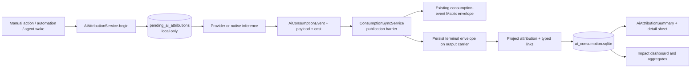
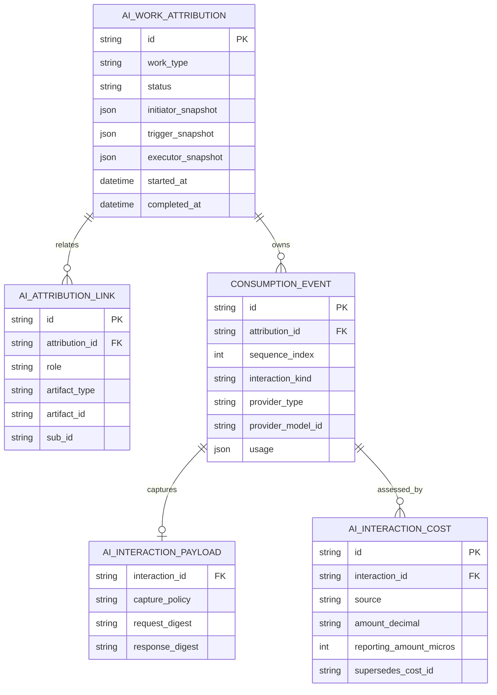
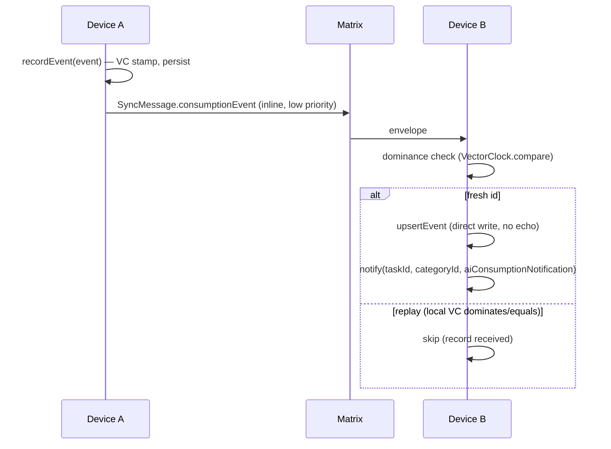
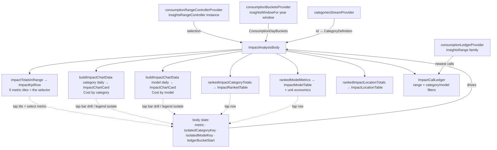

# AI Consumption and Attribution

This feature owns the audit trail for AI work. It answers two related questions:

1. Who or what initiated a logical AI-produced artifact, why did it run, and
   where is the result?
2. Which backend interactions, usage, cost evidence, and environmental impact
   produced that work?

Attribution is stored separately from the journal (`db.sqlite`) and agent
(`agent.sqlite`) domains in `ai_consumption.sqlite`. Journal and agent entities
remain the authoritative output carriers; this database is the queryable local
projection and interaction ledger.

## Runtime architecture

`SkillInferenceRunner` and `UnifiedAiInferenceRepository` provide the strict
saga for coding/design/research prompts, image generation, image analysis, and
transcription. Agent turns share one deterministic attribution per wake; task,
project, and event report writers embed the terminal envelope in report
provenance only after interaction evidence crosses the publication barrier.
Direct batch/realtime transcript writers use
`TranscriptAttributionCoordinator`: a pending session is durable before the
provider/native call, realtime usage is attached to realtime evidence, optional
batch verification is a second interaction in the same attribution, and the
selected transcript is never mislabelled as realtime evidence. Explicit
failures, cancellations, empty results, missing audio carriers, and rejected
persistence terminalize. If interaction publication is uncertain, the pending
saga is preserved for recovery instead of fabricating a second provider call.

`AiInteractionCapture` is the shared pre-call boundary used by unified
inference, AI chat, agent conversations, onboarding structuring, chat audio
input, agent-log compaction, and embedding calls. Carrier-less work terminalizes
as `partial` with `output_carrier_unavailable` rather than claiming an output
link it cannot prove. A chat user message owns one attribution even when a tool
call causes an initial and a final provider interaction. Embedding indexing owns
one attribution per entity/report, one child interaction per chunk, a typed
`embeddingVector` output, reference-only evidence, and known-zero local-compute
cost. The source-controlled inventory in
`model/ai_inference_entrypoint_inventory.dart` classifies all product inference
funnels and their guarantees.

## Domain model

- `AiWorkAttribution` is one immutable logical operation: creator/initiator,
  trigger, executor, work type, status, timestamps, privacy, and typed links.
- `AiConsumptionEvent` is one backend interaction. `attributionId` and
  `sequenceIndex` group multi-call workflows. Legacy rows may be migrated into
  an explicitly partial attribution.
- `AiAttributionLink` points to an output, source, or context artifact using
  `AiArtifactType`, `id`, and optional `subId`. Transcripts therefore have
  stable ids even when several belong to one audio entry.
- `AiInteractionPayload` normalizes request/response evidence. New flows use
  `referenceOnly`: textual/binary content stays in its authoritative carrier
  while SHA-256 digests and sanitized parameters are synchronized.
- `AiInteractionCost` is append-only cost evidence. Unknown is distinct from a
  known zero local-compute charge.

The Drift schema keeps serialized JSON as the round-trip source of truth and
typed projections for lookup and aggregation. Foreign keys and indexes enforce
the interaction, link, payload, and cost relationships.

## Publication saga and recovery

```mermaid
stateDiagram-v2
  [*] --> Prepared: pending row durable before call
  Prepared --> Calling: interaction begins
  Calling --> EvidenceDurable: event/payload/cost committed
  EvidenceDurable --> EvidencePublished: sequence + outbox accepted
  EvidencePublished --> OutputPersisted: carrier written
  OutputPersisted --> [*]: terminal projection; pending row deleted
  Prepared --> Abandoned: stale recovery; no evidence
  EvidencePublished --> Partial: stale recovery; output missing
  Partial --> [*]
  Abandoned --> [*]
```

The strict paths preallocate output ids, persist pending state, and attach a
sanitized recovery capsule to the consumption event. Output persistence is
blocked until `recordEventForPublication` confirms the event was stamped,
stored, added to the sequence log, and accepted by the outbox. Inbound sync
authenticates a capsule against `originatingHostId` before projecting it.
`recoverStale` retries durable evidence and terminalizes interrupted operations
as `partial` or `abandoned`; a failure in one pending saga is logged without
blocking later recoveries, and recovery never fabricates success.

Terminal carriers are:

| Work result | Carrier |
| --- | --- |
| Prompt or analysis response | `AiResponseData.aiAttribution` |
| Generated image | `ImageData.aiAttribution` |
| Transcript | `AudioTranscript.id` + `aiAttribution` |
| Agent report | `AgentReportEntity.provenance[aiAttributionV1]` |

`AttributionCarrierProjector` rebuilds the read model from carriers during
inbound journal/agent sync. `AiAttributionBackfillService` handles existing
data conservatively: embedded carriers remain authoritative; older responses,
transcripts, reports, and events receive deterministic partial records with an
unknown creator/cost rather than guessed lineage. Unmarked historical images
are not inferred to be generated images. Startup maintenance scans journal,
agent, and consumption stores in bounded pages. Audio backfill evaluates each
transcript independently, so a newer embedded carrier does not hide an older
carrier-less sibling.

## Cost semantics

Costs belong to interactions and roll up once per effective interaction. The
system keeps the provider's exact decimal amount/unit and an optional integer
micro-unit reporting amount/currency. `effectiveInteractionCost` validates
supersession chains, rejects cycles and authority downgrades, chooses the
highest-authority concurrent evidence deterministically, keeps currencies
separate, and reports the number of interactions whose cost is unknown.

Authority is: externally reconciled → provider reported → legacy reported →
locally estimated → local compute → unknown. Corrections append a new row with
`supersedesCostId`; original evidence is never overwritten. The older nullable
`credits` projection remains for the existing impact dashboard and migration.
Melious credits are retained as `meliousCredit` evidence and also normalized
with the app's documented `1 credit ≈ 1 EUR` approximation, frozen in the
pricing snapshot for attribution rollups.
The raw JSON decimal lexeme is captured before decoding and converted to
reporting micros with exact, half-even decimal rounding; binary floating-point
values are not the audit source.

## Impact capture (Melious)

Melious returns `environment_impact` + `billing_cost` **only on non-streaming
responses** (verified against the reference service in `../greifswald`;
streaming yields just token `usage`). So the measured Melious calls are issued
non-streaming:

- `MeliousInferenceRepository` gains a raw non-streaming path
  (`_postChatCompletion` + `_asSyntheticChunk`). When a caller passes an
  `InferenceImpactCollector`, the adapter POSTs `stream: false`, parses
  `usage` + `environment_impact` + `billing_cost`, writes the parsed
  `MeliousCallImpact` (`model/ai_call_impact.dart`) to the collector, and
  re-emits the buffered reply as a **single synthetic stream chunk** so existing
  stream consumers are unchanged. Without a collector the original streaming path
  is used verbatim (no behavior change for non-measured calls).
- The `InferenceImpactCollector` is a mutable side-channel that mirrors
  `ThoughtSignatureCollector`: a call site constructs one, passes it down the
  inference call chain, and reads `impact` after the response drains. Non-Melious
  providers never populate it, so their rows carry tokens with impact fields null.

## Persistence & sync

`ConsumptionRepository` (`repository/consumption_repository.dart`) is raw,
append-only, idempotent-by-id persistence. `ConsumptionSyncService`
(`sync/consumption_sync_service.dart`) is the sync-aware write path — it stamps a
vector clock, persists, records the send in the sync sequence log, and enqueues a
`SyncMessage.consumptionEvent` for cross-device replication over Matrix.

Consumption events are a tiny, immutable **inline** sync payload (like
`SyncEntryLink`, not a file attachment). Because they consume the shared per-host
vector-clock counter, they participate in the sequence log and backfill so they
never look like gaps in journal/agent sync. Convergence is trivial: fresh id →
applied; replayed id whose local clock dominates/equals → skipped. Rows never
mutate, so there is no concurrent-merge case.

Inline attribution evidence is bounded to 64 KiB. Oversized inline payloads
drop request/response/provider metadata, retain deterministic SHA-256 evidence
and an overflow marker, and fail closed if the metadata-only form still exceeds
the cap.

## Aggregation

- **Per-task lifetime totals** — `ConsumptionRepository.totalsForTask(taskId)`
  runs a single SQL `SUM` (`sumConsumptionByTask`) → `ConsumptionTotals`
  (call count, impact-bearing count, all token sums, credits, energy, carbon,
  water).
- **Per-category, per-model, and per-location time-bucketed series** —
  `metricRowsInRange({start, end})` reads a slim projection (never
  `serialized`), then pure-Dart `bucketize`
  (`logic/consumption_bucketing.dart`) folds each call additively into a
  `(epochDay, categoryId)` cell → `ConsumptionDayBuckets.days` and into a
  `(epochDay, modelKey)` cell → `ConsumptionDayBuckets.modelDays`.
  `modelKey` prefers `providerModelId`, falls back to `modelId`, and uses null
  for calls whose endpoint reported usage without a model identifier. Rows with
  provider-reported `dataCenter` also fold into
  `ConsumptionDayBuckets.locationDays`, keyed by the normalized data-centre id
  and an inferred ISO-style country prefix when the id starts with one (`FI`,
  `FI-HEL1`, `SE/stockholm`). Renewable percentages are energy-weighted when
  energy is reported and fall back to a sample average otherwise. Reuses the
  Insights epoch-day/period machinery and guards its two traps: no `julianday()`
  on the epoch-int `created_at`, and the denormalized `categoryId` means no
  `linked_entries` join fan-out.

Adaptive-unit display formatting lives beside the bucketing logic
(`logic/consumption_formatting.dart`): every formatter returns the value
**with** its unit (`€1.23`, `40 Wh`, `1.2 kg`, `12.3K`) so no call site can
mislabel a converted number.

## Attribution UI

`AiAttributionSummary` is the shared two-tier disclosure used by every output
surface. It shows creator/trigger/status, model/time/call count, and the
effective cost or explicit unknown state. The complete row is one accessible
tap target. It opens a Wolt bottom sheet on compact layouts and the established
sized side sheet on desktop.

Placement follows the result's reading order:

- prompt/analysis response: below generated content
- generated image: below the image/caption in entry details
- transcript: in the collapsed transcript header
- agent report: below the TLDR/report and before proposals

The widget accepts an embedded terminal envelope for immediate rendering and
also performs typed artifact reverse lookup, which is how conservatively
backfilled records appear. It retains embedded data while the read-model query
loads, so background refresh never replaces established attribution with a
full loading/empty shell.

The detail view shows lifecycle timestamps, executor, privacy, typed artifact
links, each interaction's status/duration/token usage/effective cost and cost
source, plus reference-only request/response digests and provider diagnostics.
Unknown usage and cost remain visibly distinct from known zero.

## Impact dashboard (UI)

`ui/impact_analysis_body.dart` (`ImpactAnalysisBody`) is the host-independent
dashboard core. Two hosts embed it:

- `ui/impact_analysis_page.dart` — the `/dashboards/impact` route (a thin
  `Scaffold` around the body), reached under Insights via
  `ui/widgets/impact_sidebar_entry.dart`. The sidebar entry is a
  design-system `SidebarSubsectionSurface` with a `SidebarSubsectionAction`
  row, matching the Daily OS Time Analysis subsection.
- The Settings `ai-usage` panel (`settings_v2` panel registry), which wraps the
  body in a `SingleChildScrollView`. The body adapts: with bounded height it
  scrolls itself (`ListView`), with unbounded height it shrink-wraps and lets
  the host scroll. It also degrades to phone-width panes (~390 px): the period
  stepper and each chart's mode toggle are fixed intrinsic-width strips that
  scroll horizontally instead of overflowing, and the KPI tiles reflow to a
  two/three-per-row grid.

The category chart pairs with the category table and the model chart with the
model table; each chart isolates its own series independently. Drilling a bar on
either chart scopes the ledger to that week (both charts share
`ledgerBucketStart` and highlight the bucket), and the ledger below filters by
the drilled week ∩ the category isolation ∩ the model isolation.
Attributed ledger events are grouped under their top-level work id and expand
to reveal the child provider calls; legacy events remain individual rows.

The body is the single provider consumer; the children are dumb value widgets:

- **Metric lens** — `model/impact_dashboard_models.dart` defines
  `ConsumptionMetric { cost, energy, carbon, tokens, requests }` with `valueOf`
  (projects credits / kWh / g CO₂ / total tokens / call count out of a
  `ConsumptionMetrics`), `formatValue` (delegates to the shared formatters),
  and `isCloudOnly` (false only for `requests`). `requests` (call count) is
  the one metric every provider populates — cost/energy/carbon are cloud-only
  and tokens need usage reporting — so it is the dependable lens for
  "favorite models over time". The KPI row shows all five totals (a
  responsive grid) plus a note that cost/energy/CO₂e are measured for cloud
  models only. When the immediately-preceding period is inside the loaded
  window (month/quarter views — a year-to-date view has no loaded prior year),
  each tile also carries a period-over-period trend delta ("▲/▼ N% vs prev"),
  computed from `impactTotalsInRange(buckets, previousPeriod(range, unit))`,
  shown **only on the selected tile**, sign-coloured by valence (rising
  cost/energy/CO₂e is caution, falling is positive; tokens/requests neutral —
  the shared `InsightsDeltaChip`) against a named baseline ("vs May"). The KPI
  tiles are themselves the **metric selector** — tapping one drives every chart
  and table, and the active tile carries a teal selected border; there is no
  separate segmented metric toggle.
- **Pure derivations** — `logic/impact_dashboard_data.dart` mirrors the
  Insights `time_bucketing.dart` builders over `ConsumptionDayBuckets`:
  `dailyMetricTotals` (zero-filled per-day maps, zero values dropped),
  `dailyModelMetricTotals` (the same projection over `modelDays`),
  `rankedImpactCategoryTotals` (descending totals for nullable string keys),
  `rankedModelMetrics` (per-model **full `ConsumptionMetrics`** ranked by the
  selected metric, so the model table can show call count + cost-per-million-
  tokens, not just the ranked total), `impactTotalsInRange` (KPI fold),
  `rankedImpactLocationTotals` (range-scoped country/data-centre environmental
  totals), `shareValues` (per-bucket 100 % normalization for the Share view,
  zero-total buckets left at zero), `largestRemainderPercents` (Hamilton
  apportionment so a breakdown table's integer share column sums to exactly 100,
  not the 101 % independent rounding drifts to), and `buildImpactChartData`
  (weekly aggregation via `weekStartDay`, largest-first stacking, "Other" rollup
  via the Insights sentinel/caps — but a **lone** leftover series is shown by
  name rather than folded into an anonymous "Other").
  Granularity deliberately never goes hourly: consumption cells are
  day-keyed, so a 1-day range renders one day bucket. The Y axis snaps to a
  1/2/5 × 10ⁿ nice ceiling (`impactNiceCeiling`) with a nice-number tick step
  (`impactNiceInterval`, so ticks read 10/20/30/40/50, never `ceiling/4`
  = 13/25/38/50), not the Insights hour ladder.
- **Breakdown charts + view picker** — the category and model breakdowns each
  render as their own `ImpactChartCard` + companion table, fed the category and
  model daily series respectively; the model chart is the Cursor-style "favorite
  models over time" view. A `_BreakdownViewPicker` (`ImpactBreakdownView { both,
  category, model }`, default `both`) narrows the page to one breakdown. **`model`
  is the screenshot-safe view** — it renders no category name anywhere, so a
  shared image can't leak private category labels; switching views also clears
  both isolations + the drill so a hidden filter can't linger or leak via the
  ledger chip. The picker only appears when the period has at least one
  identified (non-null) model to switch to.
- **Chart** — `ui/widgets/impact_chart_card.dart` + `impact_chart_card_charts.dart`
  (`ImpactStackedBars` / `ImpactStackedArea` / `ImpactChartLegend`): a stateful
  fl_chart card with three modes — per-bucket stacked bars, a cumulative stacked
  area ("Running total"), and **Share** (per-bucket 100 % composition, drawn as
  a smooth normalized stacked area — the mix-over-time view — falling back to
  100 % bars below two elapsed buckets). Cumulative falls back to bars until two
  buckets have elapsed so the toggle never produces a lone point. A persistent
  hint caption names the two chart interactions.
- **Series identity (`SeriesResolver`)** — `ui/widgets/series_resolver.dart`
  abstracts key → label + fill/swatch color so the same chart renders any
  dimension. `CategorySeriesResolver` wraps `InsightsCategoryResolver` +
  `chartColorFor`/`swatchColorFor` (category charts stay pixel-identical to
  before). `PaletteSeriesResolver` colors model/location keys from a **derived
  categorical palette** (`seriesPaletteChartColor`/`Swatch` in
  `insights/logic/chart_colors.dart`): twelve muted hues on a 30° ring, with the
  first six slots taking the even ring positions so the realistic maximum of six
  concurrent series always land ≥60° apart (no two same-family hues adjacent),
  assigned by a stable sorted-key order so a model keeps one color across the
  chart, its legend, and the table.
- **Interactions** — the body holds one drill bucket plus **independent** per-
  chart isolation (`isolatedCategoryKey`, `isolatedModelKey`).
  - *Isolate*: tapping a legend entry **or** a breakdown-table row re-baselines
    that chart to the one series (drawn from y=0, axis rescaled), fades the
    other legend/table rows, scopes the "Recent calls" ledger, and shows an
    in-viewport chip under that chart prefixed with the true call count
    (`scopedCallCount`, e.g. "423 calls · claude-opus-4"). The two charts
    isolate independently.
  - *Drill*: tapping a bar on either chart highlights that bucket on **both**
    (accent outline, siblings receding via an opaque hue-preserving lerp toward
    the card surface — not a drain to transparency) and scopes the ledger to the
    bucket's days.
  - A single combined chip above the ledger lists every active filter (drilled
    week ∩ category ∩ model) with a clear-all; the ledger filters by the
    intersection. Any period change auto-clears the drill.
  Truncated edge weeks are faded on-chart (except when isolating, so the single
  clean series keeps its hue).
- **Category identity** — reuses `InsightsCategoryResolver` +
  `chartColorFor`/`swatchColorFor`, so both dashboards speak the same
  color/label language ("Uncategorized", "Other", "Deleted category").
- **Model table** — `ui/widgets/impact_model_table.dart` (`ImpactModelTable`)
  renders the ranked model breakdown with a palette swatch matching the chart,
  and a per-row unit-economics line ("N calls · €X/1M tok" — dropped when a
  model reports no tokens/cost, e.g. local transcription). Rows are tappable to
  isolate and carry a chevron affordance; the header reserves the chevron width
  so columns stay aligned. Model keys use provider-native ids where available,
  configured model ids as fallback, and an explicit "Unknown model" row for
  usage rows without either id.
- **Serving-location identity** — `ui/widgets/impact_location_table.dart`
  (`ImpactLocationTable`) renders provider-reported data-centre impact by
  inferred country/data-center, energy, CO₂e and renewable share. It renders
  only when a provider reports a data centre; endpoints such as local Whisper
  that do not report environmental metadata do not create an "unknown" bucket.
- **Per-call ledger** — `ui/widgets/impact_call_ledger.dart`
  (`ImpactCallLedger`) renders the newest individual calls in the selected
  period (time · model · call type · tokens · cost · energy), the
  Cursor-style request table. It watches `consumptionLedgerProvider`
  (family-keyed by the value-equal `InsightsRange`, backed by
  `ConsumptionRepository.newestEventsInRange`, capped at
  `kConsumptionLedgerLimit` = 100 with an explicit "newest N" caption — never
  a silent truncation) itself, so the body integrates it as one child.
  Calls with tokens but no Melious impact omit cost/energy; calls whose provider
  reports no token/cost/energy metrics (for example duration-only local
  transcription endpoints) show "Not reported" rather than leaving the trailing
  cell blank.
- **keepPreviousData** — the buckets provider is year-window keyed; the body
  retains the last fully-loaded generation (buckets + the selection they
  cover) so window switches and failed refetches never flash a loading
  shell. A failed load over retained data shows a slim stale-notice strip; a
  failed *first* load shows the error text. An empty period renders a calm
  icon + explanation card.

## Task header chip

`lib/features/tasks/ui/header/task_consumption_chip.dart`
(`TaskConsumptionChip`) is the per-task surface: a `DsPill` in the task
header's `MetaRow` (`consumptionSlot`) showing the task's lifetime AI cost —
`€0.42 · 12 Wh · 3.4 g` when impact was measured, the token total otherwise —
with the full breakdown (calls/measured, token split, energy/CO₂e/water,
cost) in the tooltip. It watches `taskConsumptionTotalsProvider(taskId)`
(refreshed via `aiConsumptionNotification`) and renders nothing for tasks
without recorded calls, so non-AI tasks carry zero extra chrome.

## Capture wiring

Every migrated funnel makes pending ownership durable before invoking its
provider. `AiInteractionCapture` wraps streamed and unary calls, accumulates the
last usage values, publishes success/failure/cancellation evidence, and accepts
an `InferenceImpactCollector` side-channel for exact Melious decimal cost and
environmental impact. Provider configuration ids, provider model ids, prompt,
skill, task/category, agent, wake, thread, and turn context are stamped on the
child interaction where available.

- `UnifiedAiInferenceRepository` persists attributed `AiResponseEntry` and
  `AudioTranscript` carriers and reuses the same owner/output id for automatic
  language reruns.
- `SkillInferenceRunner` uses the same begin → evidence → carrier → finalize
  contract for transcription, image analysis/generation, and prompt generation.
- `ConversationRepository` records one child interaction per agent turn under
  the deterministic wake attribution. Project/event forced-report retries and
  Daily OS draft/repair retries keep the same wake owner and use strict provider
  error propagation.
- `ChatRepository` begins once per user message, records both the initial and
  post-tool provider calls as children, and terminalizes once.
- `EmbeddingProcessor` begins before the first chunk request and finalizes only
  after the replacement embedding set is stored.

Attribution publication failures are part of output correctness: carrier
writers fail closed or leave the durable pending saga for startup recovery.
Compatibility recording through `AiConsumptionRecorder` remains only for
unmigrated/legacy callers and is not the ownership boundary for these funnels.

## Status

Delivered and tested: the storage schema, repository, aggregation query layer,
full Matrix sync integration, the Melious non-streaming impact-capture mechanism
(`MeliousCallImpact` + `InferenceImpactCollector`), the `AiConsumptionRecorder`,
strict carrier publication for the unified inference and skill-runner paths,
durable pre-call capture for conversation/chat funnels, report-carrier
publication across agent workflows, transcript coordination, embedding output
attribution, and the AI Impact dashboard (five-metric KPI row with a
cloud-only coverage note whose tiles are the metric selector, two always-visible
category and model breakdown charts each with a per-bucket / running-total /
share mode, click-to-isolate and tap-to-drill that scope the call ledger,
per-model unit economics, location table, and period stepper).

## Testing

- `test/features/ai_consumption/` — DB round-trip/idempotency, aggregation
  (`totalsForTask`, `metricRowsInRange` epoch-int guard), pure bucketing
  (example + Glados property), and the sync service (VC stamp + enqueue).
- `test/features/ai_consumption/logic/impact_dashboard_data_test.dart` +
  `model/impact_dashboard_models_test.dart` — exact bucket/ranking/model/
  location rollup/ceiling expectations plus Glados properties (chart columns sum to
  range totals, monotone ranking, never-hourly granularity, ceiling bounds).
- `test/features/ai_consumption/ui/` — widget tests for the KPI row, chart
  card (including cumulative running-total tooltip), ranked table, model table,
  location
  table, ledger missing-metric fallback, and the full body (provider-driven:
  stubbed repository rows → formatter-exact KPI/table/model/location figures,
  metric-selector tiles, two stacked breakdown charts, per-chart isolate +
  shared drill, empty state, first-load error).
- `test/features/ai/model/ai_call_impact_test.dart` — the Melious impact
  contract parsing.
- `test/features/sync/…` — `SyncMessage.consumptionEvent` round-trip, inbound
  apply/dominance, and backfill (via the generated backfill bench).
