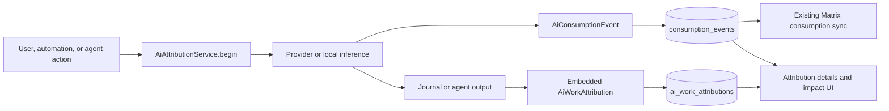
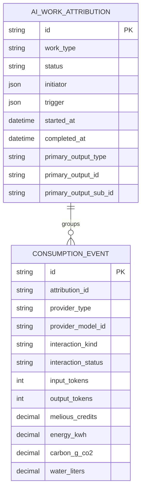
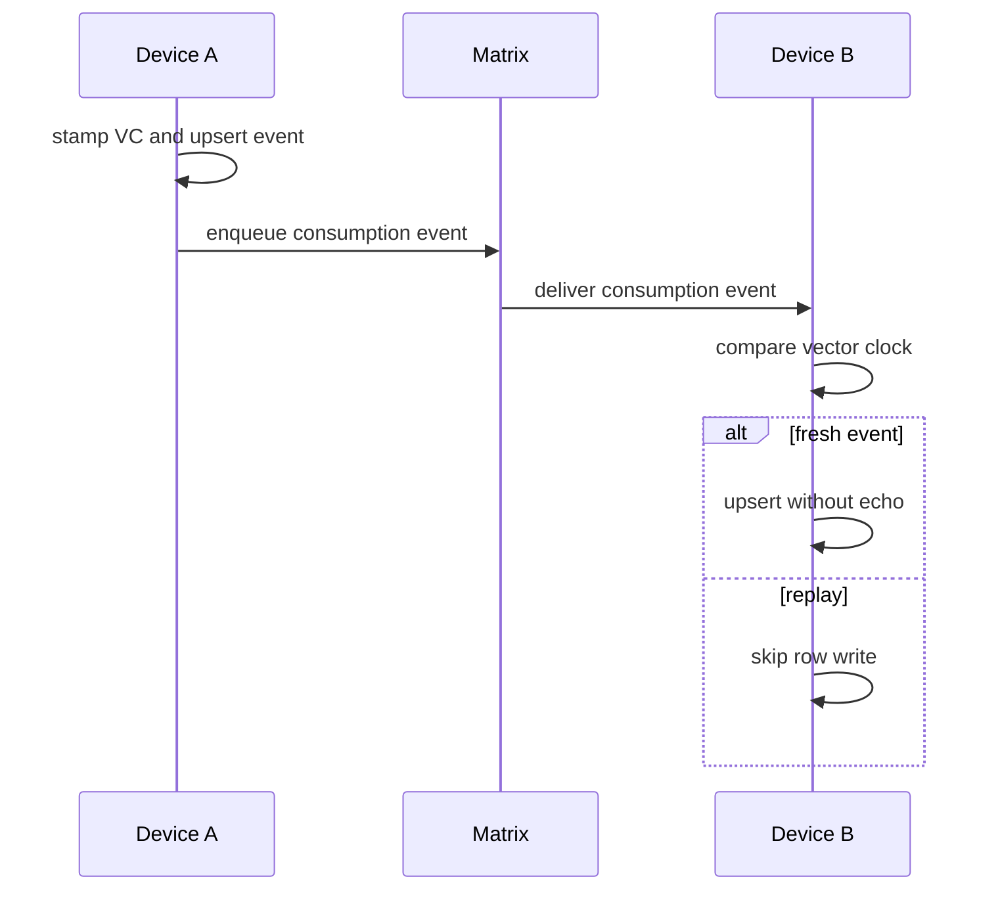

# AI Consumption and Attribution

This feature records two related facts:

1. which creator initiated a logical piece of AI work; and
2. which provider calls, usage, reported cost, and environmental impact
   produced it.

The implementation deliberately keeps those facts small. A completed output
embeds one `AiWorkAttribution`. Every provider call remains one
`AiConsumptionEvent`. Both are linked by `attributionId`; there are no extra
cost, payload, link, or recovery tables.

## Runtime architecture

`AiAttributionSession` is an in-memory value used to carry creator, trigger,
work type, timestamps, and output identity through one operation. It is not a
database transaction or recovery state machine. Provider-call persistence and
output persistence are independent:

- `recordInteraction` writes the consumption event through
  `ConsumptionSyncService`.
- `prepareCompletion` builds the attribution that the caller embeds in the
  output.
- after the output is saved, `finalize` upserts the local query projection.
- inbound journal and agent sync runs `AttributionCarrierProjector`, so an
  embedded carrier repairs a missing local projection.

An outbox failure does not block the generated output. The consumption sync
path already stores the event before attempting enqueue and participates in the
normal sequence-log/backfill mechanism.

## Data model

`ai_consumption.sqlite` remains the existing dedicated consumption database.
Schema version 2 adds only:

- the nullable `consumption_events.attribution_id` column and its lookup index;
- the `ai_work_attributions` projection table.

Serialized JSON remains the lossless sync representation for consumption
events and the round-trip representation for attribution. Typed columns exist
only for lookup and aggregation.

`AiWorkAttribution` contains the facts needed to explain a logical output:

- creator snapshot (`type`, stable id, display name, accountable human id);
- trigger snapshot (manual, automation, schedule, sync, or agent tool plus
  applicable skill/prompt/profile/agent identifiers);
- work type and terminal status;
- start/completion timestamps;
- one primary typed output reference;
- optional task/category/parent attribution and sanitized error fields.

The primary output reference is sufficient for reverse lookup. Multiple SQL
link rows are unnecessary because the generated carrier itself owns the
attribution.

`AiConsumptionEvent` contains one actual backend interaction:

- provider, configured model, provider model, duration, and request id;
- input/output/cached/reasoning/total token usage;
- interaction kind/status and sanitized errors;
- task, category, entry, agent, wake, thread, prompt, and skill identifiers;
- optional SHA-256 request/response digests and sanitized parameters;
- provider-reported monetary and environmental values.

Request and response bodies are never stored by the consumption system. Their
authoritative copies already live in journal/agent output entities. Digests are
non-reversible correlation aids, not payload archives.

## Output carriers

| Work result | Authoritative carrier |
| --- | --- |
| Prompt or analysis response | `AiResponseData.aiAttribution` |
| Generated image | `ImageData.aiAttribution` |
| Transcript | `AudioTranscript.id` + `aiAttribution` |
| Agent report | `AgentReportEntity.provenance[aiAttributionV1]` |

`AttributionCarrierProjector` projects these values after local writes and
inbound sync. Data created before attribution is not assigned a guessed creator
or fabricated cost.

## Actual cost and Melious impact

There is no estimation or reconciliation layer. An event stores only the cost
reported for that call:

- `credits`: numeric Melious credits used by existing aggregates;
- `costCreditsDecimal`: the exact decimal string returned by Melious.

The data layer does not attach currency metadata or perform a conversion. The
UI deliberately keeps the product's established EUR presentation for these
numeric credits. Calls without a provider-reported cost keep both fields null;
local compute does not create a synthetic zero-cost assessment.

The same Melious response also records, when present:

- `energyKwh`;
- `carbonGCo2`;
- `waterLiters`;
- `renewablePercent`;
- `pue`;
- `dataCenter`;
- `upstreamProviderId`.

`MeliousInferenceRepository` uses its non-streaming response path when an
`InferenceImpactCollector` is supplied because the impact and billing objects
arrive on the completed response. It emits the buffered result as a synthetic
stream chunk so existing stream consumers keep the same interface. Other
providers leave unsupported values null.

## Capture integrations

`AiInteractionCapture` is the shared unary/stream boundary. It begins logical
attribution before invoking the provider, accumulates usage, hashes request and
response text, records success/failure/cancellation, and copies
`MeliousCallImpact` values directly onto the event.

The main integrations are:

- `UnifiedAiInferenceRepository` for generated text, image work, and reruns;
- `SkillInferenceRunner` for prompt generation, transcription, image analysis,
  and image generation;
- `ConversationRepository` and AI chat for multi-call conversations;
- agent workflows, which use a deterministic attribution id per wake;
- `TranscriptAttributionCoordinator` for realtime/batch transcript carriers;
- `EmbeddingProcessor`, which groups per-chunk calls under one embedding
  output without inventing monetary cost.

Carrier-less compatibility paths may finish as `partial` because no output
reference can be proven.

## Persistence and sync

`ConsumptionRepository` owns local Drift reads/writes. Consumption events are
append-only and idempotent by UUID. `ConsumptionSyncService` stamps a vector
clock, persists the event, records it in the sequence log, and enqueues the
existing `SyncMessage.consumptionEvent` payload.

Attribution projections do not need a second sync protocol: they are rebuilt
from the journal/agent carriers already synchronized by their owning domains.

## Aggregation and UI

`ConsumptionRepository.totalsForTask` performs SQL aggregation for task-level
calls, tokens, Melious credits, energy, carbon, and water.
`metricRowsInRange` reads the slim typed projection used by
`consumptionBucketsProvider` for category/model/location dashboards.

The impact dashboard shows calls and every metric actually reported by the
provider. Missing values stay missing rather than becoming estimates.
`AiAttributionSummary` appears beside generated outputs and shows creator,
trigger, status, model, time, call count, and actual Melious credit total. Its
detail sheet lists child interactions, token usage, duration, exact reported
cost, and request/response digests.
