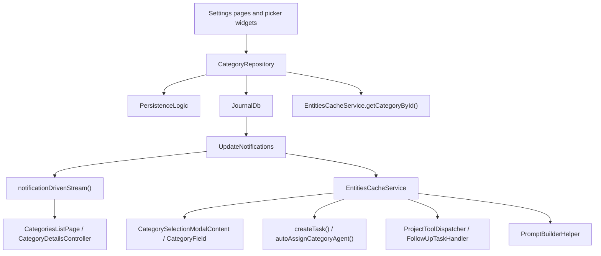
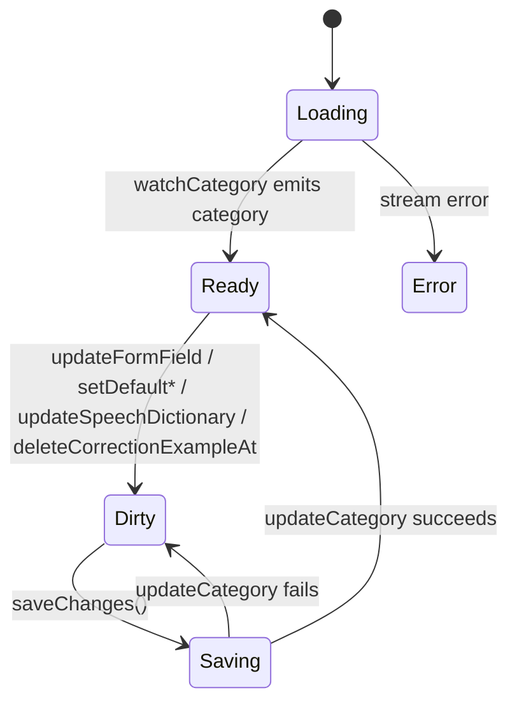
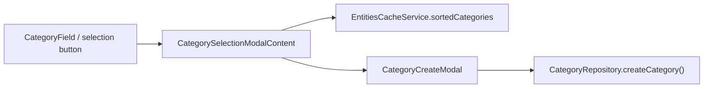
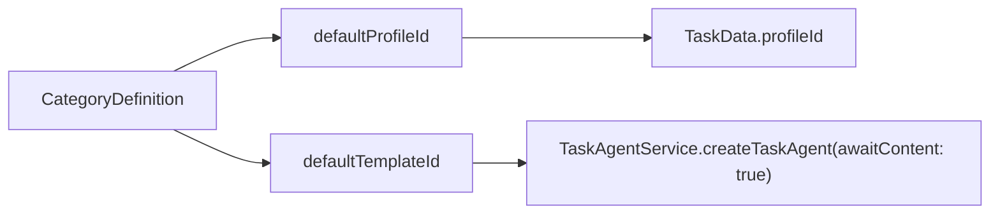

# Categories Feature

Categories are persisted `CategoryDefinition` entities. In the current codebase they do three concrete jobs:

1. power the settings UI for creating, editing, and browsing categories
2. provide reusable category-picking UI used by other features
3. store category-scoped defaults and vocabulary that downstream task, AI, and speech code consumes

## What This Feature Owns

- `CategoryRepository` for create, update, soft delete, stream reads, and task counts
- Settings surfaces: `CategoriesListPage`, `CategoryDetailsPage`, and create mode
- Reusable picker surfaces: `CategoryField`, `CategorySelectionModalContent`, and `CategoryCreateModal`
- Category presentation metadata: `name`, `color`, `icon`
- Category flags: `private`, `active`, `favorite`
- Stored defaults: `defaultLanguageCode`, `defaultProfileId`, `defaultTemplateId`
- Category-scoped AI and speech context: `speechDictionary`, `correctionExamples`

## Current Model Boundaries

- `CategoryDefinition` does not currently contain prompt allowlists such as `allowedPromptIds`.
- The old `automaticPrompts` concept is not part of the current category model.
- In this code sweep, `defaultLanguageCode` is referenced by the categories model, controller, and UI, but I did not find a downstream consumer outside this feature.

## Runtime Architecture



Two read paths matter here:

- repository streams are notification-driven and back the settings pages
- cache lookups are used for synchronous reads in task creation, picker widgets, and prompt-building helpers

## Directory Shape

```text
lib/features/categories/
├── domain/
│   └── category_icon.dart
├── repository/
│   └── categories_repository.dart
├── state/
│   ├── categories_list_controller.dart
│   ├── category_details_controller.dart
│   └── category_task_count_provider.dart
└── ui/
    ├── pages/
    │   ├── categories_list_page.dart
    │   └── category_details_page.dart
    └── widgets/
        ├── category_create_modal.dart
        ├── category_field.dart
        ├── category_selection_modal_content.dart
        ├── category_color_picker.dart
        ├── category_icon_picker.dart
        ├── category_language_dropdown.dart
        ├── category_speech_dictionary.dart
        └── category_correction_examples.dart
```

## Data Model

`CategoryDefinition` lives in `lib/classes/entity_definitions.dart`.

The fields with verified runtime consumers are:

- `name`, `color`, `icon`
  Used throughout list, detail, and picker widgets. `category_icon.dart` centralizes the icon catalog and display constants.
- `private`, `active`, `favorite`
  Used by settings tiles and picker behavior. `EntitiesCacheService.sortedCategories` returns only active categories, while favorite categories are surfaced first in the selection modal.
- `defaultProfileId`
  Copied into `TaskData.profileId` when tasks are created from category-aware entry points.
- `defaultTemplateId`
  Used to auto-create a task agent in content-awaiting mode for new tasks.
- `speechDictionary`
  Editable in the details page, appendable via `SpeechDictionaryService`, and injected into AI/speech flows by `PromptBuilderHelper`.
- `correctionExamples`
  Written by `CorrectionCaptureService`, displayed and deletable in the details page, and formatted back into prompt context later.
- `defaultLanguageCode`
  Persisted and editable in the details page. Current references are inside the categories feature itself.

## Repository and Cache Semantics

`CategoryRepository` is intentionally small:

- `watchCategories()` and `watchCategory()` rebuild on `categoriesNotification` and `privateToggleNotification`
- `getCategoryById()` reads from `EntitiesCacheService`, not directly from the database
- `createCategory()` creates a `CategoryDefinition` with:
  - `private: false`
  - `active: true`
  - `favorite: null`
- `deleteCategory()` is a soft delete that sets `deletedAt` and `updatedAt`
- `getTaskCountsByCategory()` is a batch query used by the list UI

The cache matters because several category consumers need synchronous access:

- `EntitiesCacheService.getCategoryById()` is used by task creation and prompt-building helpers
- `EntitiesCacheService.sortedCategories` is used by picker widgets and returns active categories sorted by lowercase name

## Settings UI

### Categories list

`CategoriesListPage` currently watches `categoriesStreamProvider` directly. The page does not use `CategoriesListController`, even though the controller exists and has its own tests.

The list page behavior is:

- sorts categories alphabetically in the UI layer
- renders a task count per row through `categoryTaskCountProvider`
- batches those counts through `categoryTaskCountsProvider` so tiles share one database query
- shows `private`, `favorite`, and inactive status indicators
- keeps inactive categories visible in settings, even though pickers exclude them

### Category details and create mode

`CategoryDetailsPage` has two distinct modes:

- create mode
  Writes directly through `CategoryRepository.createCategory()` and only captures `name`, `color`, and `icon`. The private and active switches are shown disabled to communicate the default values applied on creation.
- edit mode
  Uses `CategoryDetailsController` and exposes sections for:
  - basic settings
  - default language
  - AI defaults via `ProfileSelector` and `TemplateSelector`
  - optional `CategoryProjectsSection` when `enableProjectsFlag` is enabled
  - speech dictionary
  - checklist correction examples

`CategoryDetailsController` keeps `_originalCategory` and `_pendingCategory` so stream updates do not clobber local form edits.



The non-trivial save behavior is the correction example merge:

- the controller re-fetches the latest category from cache before saving
- remote additions are preserved
- examples explicitly deleted in the UI stay deleted

That protects delayed background writes from `CorrectionCaptureService`.

## Picker and Inline Creation Flow

The categories feature also provides reusable picker UI that other features call into.



Important implementation details:

- the selection modal reads from cache, not a repository stream
- it groups favorites before non-favorites
- it supports both single-select and multi-select
- when search has no match, it can open `CategoryCreateModal` with the search text prefilled
- because it uses `sortedCategories`, inactive categories are not offered in picker flows

This picker is reused outside the settings area, including tasks, projects, labels, AI backfill, and Daily OS widgets.

## Downstream Consumers

### Task defaults and agent assignment

Category defaults are consumed by more than one task creation path.



Verified call sites:

- `lib/logic/create/create_entry.dart`
  - `createTask()` copies `defaultProfileId`
  - `autoAssignCategoryAgentWith()` uses `defaultTemplateId`
- `lib/features/agents/workflow/project_tool_dispatcher.dart`
  - project-created tasks inherit `defaultProfileId`
  - auto-assignment uses `defaultTemplateId`
- `lib/features/agents/tools/follow_up_task_handler.dart`
  - follow-up tasks use the same default-template agent assignment logic

### Speech dictionary

`speechDictionary` is an actively used field.

- `SpeechDictionaryService.addTermForEntry()` resolves a category from a task, audio entry, or image entry, rejects empty and duplicate terms, and appends new terms to the category
- `PromptBuilderHelper.getSpeechDictionaryTerms()` reads category dictionary terms from cache
- `UnifiedAiInferenceRepository` forwards those terms to inference repositories as speech context
- `CloudInferenceRepository` maps them to `contextBias`

### Checklist correction examples

`correctionExamples` is also a live integration point.

- `CorrectionCaptureService` normalizes edits, rejects trivial or duplicate corrections, delays persistence behind a pending-correction workflow, and appends `ChecklistCorrectionExample` values to the category
- `PromptBuilderHelper` sorts examples by `capturedAt`, caps the number injected, and formats them for prompt text
- `features/agents/tools/correction_examples_builder.dart` also formats category examples for agent-facing workflows
- `CategoryDetailsController.deleteCorrectionExampleAt()` uses index-based deletion so duplicate examples can be removed one at a time

## Tests That Define the Contract

The strongest contracts in this feature are covered under `test/features/categories/`:

- repository notification behavior and soft-delete semantics
- `CategoryDetailsController` change tracking and correction-example merge behavior
- task-count batching via `category_task_count_provider.dart`
- list/detail page rendering
- picker, icon, color, language, switch, and speech-dictionary widget behavior

If the implementation changes, this README should be updated together with:

- the controller state machine
- the set of downstream consumers listed above
- the distinction between repository-stream reads and cache-backed reads
