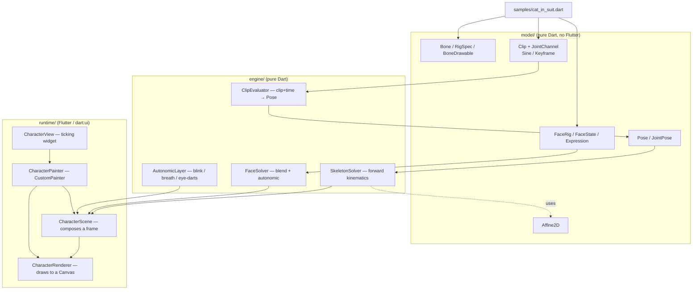
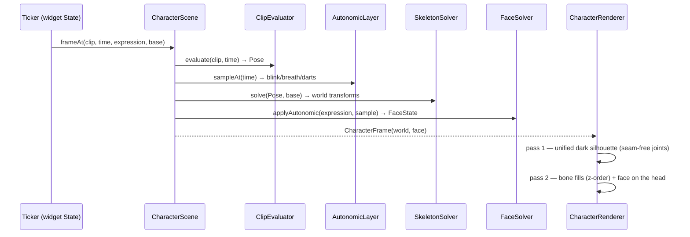
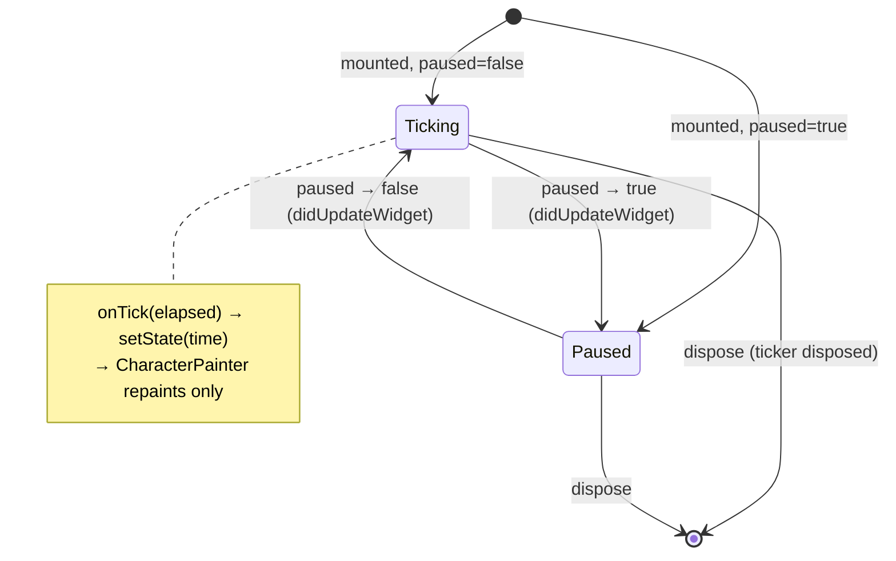

# Character — 2D skeletal ("bones") animation

Programmatic 2D skeletal animation: a rigged character (skeleton + face) driven
by **procedural, data-driven** motion cycles (walk / run / sit / jump) and an
expressive face (smile / frown / surprise / blink). The engine is pure Dart and
deterministic; the same `(clip, time)` always resolves the same frame, so the
live widget and the offline film-strip renderer produce identical pixels.

This is **Phase 1** (proof of concept). The full design — including the offline,
AI-assisted SVG → rig pipeline and the low-end `drawAtlas` runtime — lives in
[`docs/implementation_plans/2026-06-22_bones_animation_framework.md`](../../../docs/implementation_plans/2026-06-22_bones_animation_framework.md).

## Status (Phase 1)

| Area | State |
| --- | --- |
| Pure-Dart engine (math, FK, clips, face, autonomic) | ✅ built + unit-tested |
| Hand-authored "cat in a suit" rig + 5 cycles | ✅ `samples/cat_in_suit.dart` |
| `CustomPainter` runtime drawing bones as vector shapes | ✅ `runtime/` |
| Film-strip render harness (PNG output) | ✅ `test/.../film_strip_test.dart` |
| Offline AI rigging (SVG → rig) | ⛔ not started (Phase 2) |
| Batched `drawAtlas` runtime + degradation ladder | ⛔ Phase 2 |
| Riverpod mood controller / Tamagotchi product | ⛔ separate consumer feature |

Phase 1 deliberately draws bones as **vector shapes** (capsules / ellipses /
rounded rects) rather than a pre-baked sprite atlas. The skeleton, transforms,
cycles and face are exactly what the atlas runtime will use; only the per-bone
paint call changes. This lets us validate motion *before* investing in
rasterization.

## Architecture

The engine is layered so the math stays Flutter-free and trivially testable; only
the runtime touches `dart:ui`.



### Per-frame pipeline



Bones are drawn in **two passes**. Pass 1 paints every outlined bone as a
slightly inflated shape in the *single* outline colour, so overlapping pieces
union into one continuous dark blob — no outline ever crosses into the body at a
joint. Pass 2 paints the fills in z-order on top, leaving only the outer rim
dark. The result is a clean outer outline with seam-free joints, instead of a
stack of individually-outlined parts (which read as robotic).

The hot path is intentionally cheap: evaluate a handful of sinusoids/keyframes,
walk the bone hierarchy composing `Affine2D`s (~20–25 bones), resolve the face.
No SVG parsing, no allocation-heavy work.

### Runtime ticker lifecycle

The `Ticker` lives in the widget `State` (not in a provider — pushing a per-frame
value through Riverpod would rebuild the tree 60×/s). Higher-level state (which
clip, which expression) changes infrequently and flows in as widget fields.



## Core concepts

- **`Affine2D`** — immutable 2D affine transform. `multiply` composes
  parent × local for forward kinematics; `toMatrix4Storage` (buffer-reusing)
  feeds `Canvas.transform`.
- **`Bone`** — id, parent, pivot (joint, in the parent's space), rest
  rotation/scale, z-order, and a `BoneDrawable` (shape, size, colour).
- **`Clip` + channels** — a clip is a sparse map of per-bone channels plus root
  motion. `SineChannel` builds cyclic motion (`bias + amp·sin(2π(p+phase)) +
  harmonic`); `KeyframeChannel` builds eased one-shots. New cycles are **data,
  not code**.
- **`FaceState` / `Expression`** — ~8 continuous "knobs" (mouth shape + open,
  brow raise/angle, eyelid open, gaze). Six presets (neutral, content, happy,
  surprised, sad, angry). Mouths are **shape-swapped**, not deformed.
- **`AutonomicLayer`** — the always-on "alive" signals (asymmetric Poisson
  blink, breathing, micro eye-darts). Deterministic via an internal LCG — never
  `Math.random` / `DateTime.now` — so renders are reproducible.

## Film strips — how to review motion

The film-strip harness renders tiled frame sequences to PNGs for visual review.

```bash
fvm flutter test test/features/character/film_strip_test.dart
```

Outputs land in `build/character_film_strips/` (override with the
`CHARACTER_STRIP_DIR` env var):

| File | Contents |
| --- | --- |
| `walk.png`, `run.png` | one full cycle, 14 frames (loop-continuous) |
| `sit.png`, `jump.png` | one-shot, 16 frames (anticipation → settle) |
| `expressions.png` | the six face presets |
| `blink.png` | an asymmetric blink (fast close, slow open) |

The harness is also a regression test: it asserts every strip actually paints
the character and that identical inputs render byte-identical pixels.

## Testing

Pure-Dart math carries the value and is exhaustively unit-tested (one test file
per source file): `Affine2D` algebra, FK against hand-computed joint positions,
clip phase wrap/clamp + channel sampling, autonomic determinism + bounds, face
blending. Runtime is covered by `CharacterScene`/`CharacterPainter` tests and the
`CharacterView` ticker test (`fakeAsync`-free, `tester.pump(duration)`), plus the
film-strip harness. No `Future.delayed`, no `pumpAndSettle`, no `Math.random`.

```bash
fvm flutter test test/features/character/
```

## Known Phase-1 limitations / next steps

- **Tail** reads a little stiff/horizontal — needs rest-rotation + drag tuning.
- Drag/overlap on secondary bones (tail/tie) is faked with phase-lagged sines;
  Phase 2 replaces it with real spring integration.
- No joint-cap quads or 2-part foot yet (planned in `D5`) — watch for elbow/knee
  seams at extreme bends.
- Runtime is vector-shape paint, not the batched `drawAtlas` low-end path.
- No offline AI rigging, no feature flag, no product surface yet.

See the implementation plan for the full Phase-2 scope and the panel's outcome
rubric.
