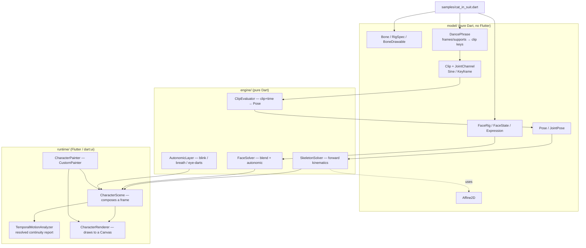
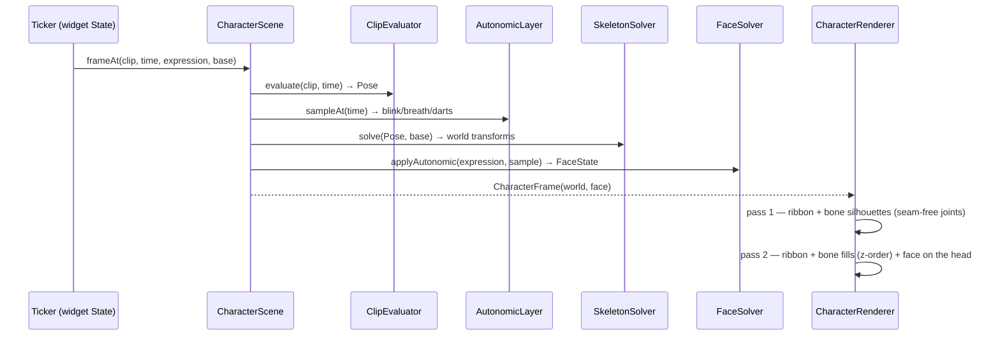
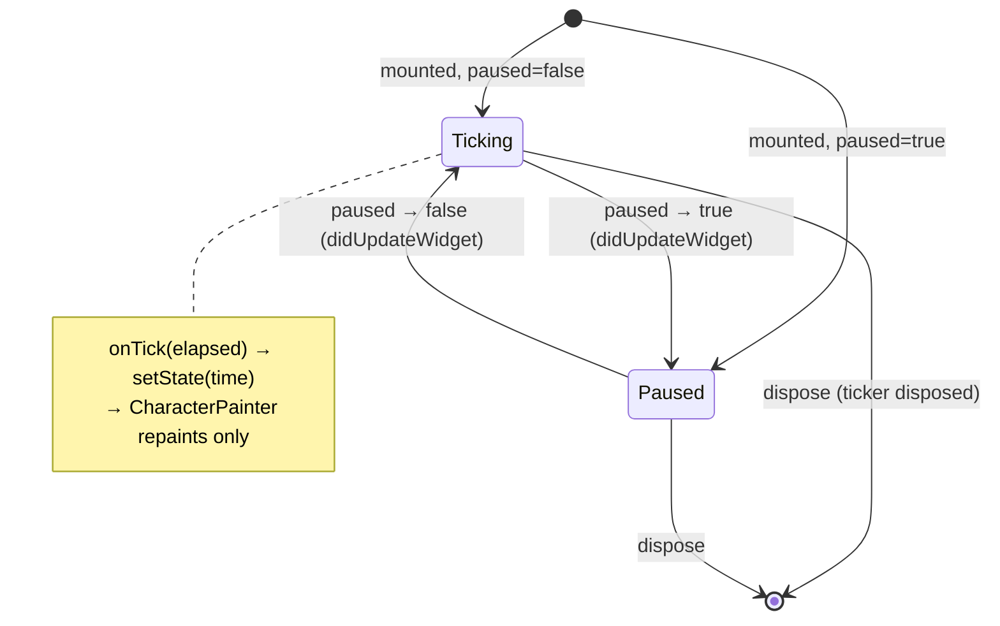
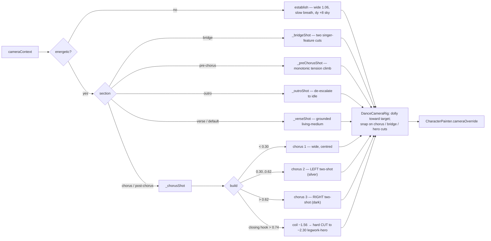
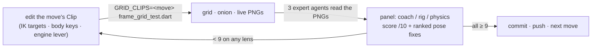
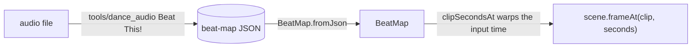
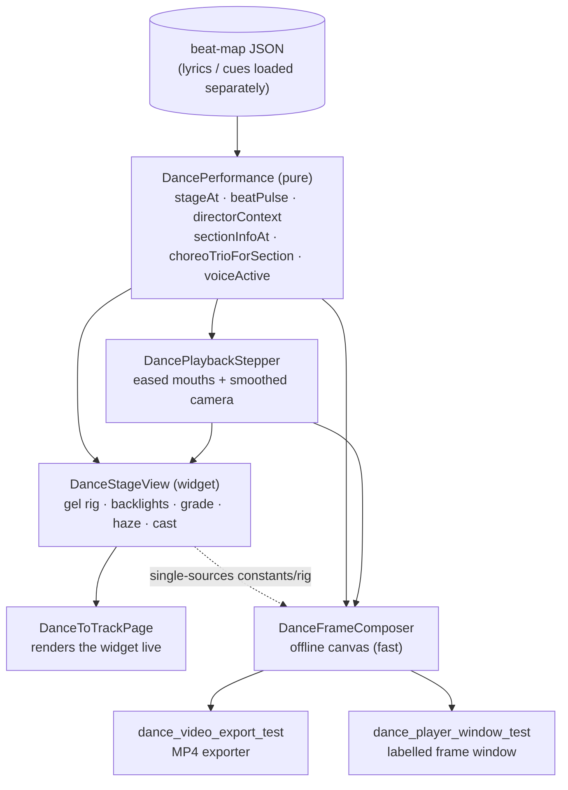

# Character — 2D skeletal ("bones") animation

Programmatic 2D skeletal animation: a rigged character (skeleton + face) driven
by **procedural, data-driven** motion cycles (walk / run / kick / dance / sit /
jump) and an expressive face (smile / frown / surprise / blink). The engine is
pure Dart and deterministic; the same `(clip, time)` always resolves the same
frame, so the live widget and the offline film-strip renderer produce identical
pixels.

This is **Phase 1** (proof of concept). The full design — including the offline,
AI-assisted SVG → rig pipeline and the low-end `drawAtlas` runtime — lives in
[`docs/implementation_plans/2026-06-22_bones_animation_framework.md`](../../../docs/implementation_plans/2026-06-22_bones_animation_framework.md).

Durable design decisions for this feature live in its **own** ADR series under
[`docs/adr/`](./docs/adr/) (numbered from `CHAR-0001`, kept separate from the
repo-wide `docs/adr/` so they travel with the code if it is extracted). The dance
choreography encoding — the Laban-Effort dynamics layer, the move-library /
notation-as-score model, and which Afrobeats moves the catalog encodes — is
[`CHAR-0001`](./docs/adr/CHAR-0001-dance-choreography-encoding-and-move-library.md),
with per-move keying notes under [`docs/research/`](./docs/research/).

## Status (Phase 1)

| Area | State |
| --- | --- |
| Pure-Dart engine (math, FK, clips, face, autonomic) | ✅ built + unit-tested |
| Hand-authored "cat in a suit" rig + base clips (walk/run/idle/dance/kick/sit/jump) | ✅ `samples/cat_in_suit.dart` |
| Afrobeats dance-move catalog — 6 moves, each panel-certified **≥9.0/10** on all 3 lenses | ✅ `samples/cat_in_suit.dart`, [CHAR-0001](./docs/adr/CHAR-0001-dance-choreography-encoding-and-move-library.md), [Dance moves](#dance-moves--the-afrobeats-catalog) |
| Frame-addressed dance phrase authoring | ✅ `model/dance_phrase.dart` |
| `CustomPainter` runtime drawing bones + soft limb ribbons | ✅ `runtime/` |
| Bendy ribbons for arms/legs/tail | ✅ shoulder→bicep→wrist, hip→quad→knee→calf→ankle, and 7-control tail surfaces |
| Tapered tie (`taperedCapsule` shape) | ✅ 2-link draping tie |
| Locomotion — the cat walks/runs across & turns at edges | ✅ `runtime/character_painter.dart` |
| Ground floor + per-foot contact shadows | ✅ `runtime/character_painter.dart` |
| Dance waterfront backdrop, stage lights, and drone-show scenery | ✅ `runtime/character_painter.dart`, `demo/character_dance_to_track_demo.dart`, `features/scenery/` |
| Film-strip + frame-grid + onion + travel + live harness | ✅ `test/.../{film_strip,frame_grid}_test.dart` |
| Interactive audio-backed dance demo | ✅ `demo/character_dance_to_track_demo.dart` |
| Offline audio beat-sync (beat map → on-beat dance) | ✅ `tools/dance_audio/`, `BeatMap`, `DanceToTrackApp` |
| Offline AI rigging (SVG → rig) | ⛔ not started (Phase 2) |
| Batched `drawAtlas` runtime + degradation ladder | ⛔ Phase 2 |
| Quadruped (4-leg) stance + rear-up transition | ⛔ Phase 2 |
| Riverpod mood controller / Tamagotchi product | ⛔ separate consumer feature |

Phase 1 draws bones as **vector shapes** (capsules / ellipses / rounded rects /
tapered capsules) plus optional **soft limb ribbons** rather than a pre-baked
sprite atlas. Ribbons are still cheap `Path` geometry, but they draw a whole limb
as one continuous tapered surface through solved joint positions, so elbows and
knees bend through the silhouette instead of exposing rigid-cardboard hinges.
The skeleton, transforms, cycles and face are exactly what the atlas runtime will
use; only the per-bone paint call changes. This lets us validate motion *before*
investing in rasterization.

The walk/run are **keyframed step cycles** (distinct stance/swing, a weight bob,
a pelvic-list line of action, knee-snap and flat-foot plant). The body
**travels** at a stride-matched `locomotionSpeed` so the planted foot holds its
world position instead of skating; the live painter ping-pongs it across the
stage and flips facing at the edges. Kick and dance are in-place performance
clips for judging pose appeal, balance, squash/stretch and arm/tail arcs without
stage travel hiding the body mechanics. The dance clip is authored through a
32-frame `DancePhrase`: support spans and body/limb keys are addressed by
choreography frame (`0..32`) and then compiled into the regular `Clip`
channels. That keeps the movement review language ("frame 16 right-foot plant",
"count-8 loop pickup") aligned with the runtime data instead of scattering raw
normalized phases through the sample. The current phrase is a compact 12-count
Afrobeats groove: an 8-count pocket plus a 4-count toe-flick bounce, with a
small additive root pulse layered over the keyed body motion so slower tempos
still have off-beat life. The interactive demo is song-first: it plays Omah
Lay's "Moving", maps the authored phrase to the offline beat map, and exposes a
video-editor-style transport with waveform scrubbing and spacebar play/pause.
The frame-grid/film-strip harness remains the isolated clip-review surface. The
audio-synced dance player uses `LayeredBackdrop` from `features/scenery/`: the
scenery is driven by the same audio position as the choreography, with a
cloudless master-derived base, independent parallax cloud WebPs, animated
ocean/lights, and fixed structure layers redrawn over those moving effects. That
same scenery pass now centers a deterministic sky drone show that holds
`Omah Lay` first, then morphs into `Moving`. The tail is a single ribbon driven
by a 7-link drag chain; the tie is a keyed 2-link cloth shape; ears flick a beat
behind the head bob.

## Architecture

The engine is layered so the math stays Flutter-free and trivially testable; only
the runtime touches `dart:ui`.



### Per-frame pipeline



Bones and ribbons are drawn in **two passes**. Pass 1 paints every outlined
surface as a slightly inflated shape in the *single* outline colour, so
overlapping pieces union into one continuous dark blob — no outline ever crosses
into the body at a joint. Pass 2 paints fills in z-order on top, leaving only the
outer rim dark. Rig-declared `LimbRibbonSpec`s hide the rigid upper/lower segment
drawables they replace while keeping terminal hands and shoes visible. The cat
uses this for athletic arms and legs: shoulder → bicep → elbow → wrist, and hip
→ quad → knee → calf → ankle. The tail also renders as one ribbon through its
seven control bones instead of exposing each link as a rigid segment. The hip
itself is a control bone; the suit jacket covers the pelvis and thigh roots so
the legs read as emerging from the body rather than hanging below a separate
block.

**Cel-shading.** A rig may carry a `CelShadeSpec` (`RigSpec.celShade`; the cat
sets one). After each fill the renderer paints a per-shape **three-tone form
shadow** clipped to that volume: a lifted highlight on the side facing the light
(upper-left), the untouched base in the middle, and a cool blue-hour shade on the
far side — derived from the shape's own fill, so no per-bone shadow is authored.
Clipping per shape is what makes each limb/torso/head model as its own form
(unlike a single gradient over the whole figure, which reads flat). The highlight
tone is essential on dark fills: a near-black navy suit shows no darker shade, but
a lifted lit side gives it dimensional form — kept **gentle and narrow**, though,
so thin round shapes (arms, hands, tail) read as soft volumes rather than chroming
out into metallic streaks. On top of the directional ramp an optional
**form-rounding** pass (`CelShadeSpec.roundAmount`/`roundCoverage`) paints a
per-shape inner-edge occlusion — a squashed radial, transparent at the shape's
centre and deepening to a cool shade at its contour — so each volume *bulges* in
the middle and falls into shadow at its edges, reading as a rounded tube instead of
a flat cel terminator across a sticker. This baked cel-shade is the cats'
**primary** form modelling; the concert `bodyGrade` below is tuned NOT to flatten
it. The face features draw after, so they stay crisp and bright over the shaded
head.

The hot path is intentionally cheap: evaluate a handful of sinusoids/keyframes,
walk the bone hierarchy composing `Affine2D`s (~30 bones), resolve the face. No
SVG parsing, no allocation-heavy work.

### Runtime ticker lifecycle

The `Ticker` lives in the widget `State` (not in a provider — pushing a per-frame
value through Riverpod would rebuild the tree 60×/s). Higher-level state (which
clip, which expression) changes infrequently and flows in as widget fields.



## Core concepts

- **`Affine2D`** — immutable 2D affine transform. `multiply` composes
  parent × local for forward kinematics; `toMatrix4Storage` (buffer-reusing)
  feeds `Canvas.transform`.
- **`Bone`** — id, parent, pivot (joint, in the parent's space), rest
  rotation/scale, z-order, and a `BoneDrawable` (shape, size, colour).
- **`LimbRibbonSpec`** — an optional mesh-style surface over a solved joint
  chain. The renderer samples the world origins of its joint bones, builds a
  Catmull-Rom centreline via `limbRibbonPath`, applies the configured width
  profile, and hides the rigid segment drawables named by `hiddenBoneIds`.
- **`Clip` + channels** — a clip is a sparse map of per-bone channels plus root
  motion. `SineChannel` builds cyclic motion (`bias + amp·sin(2π(p+phase)) +
  harmonic`); `KeyframeChannel` builds eased/keyed poses. Root motion can be a
  `SineRootChannel`, `KeyframeRootChannel`, or additive `LayeredRootChannel`
  when a large authored body path needs small rhythmic pulses on top.
  `groundSpans` drive foot-locked locomotion; `contactSpans` damp support-foot
  drift for non-loop stage moves and drive contact shadows for looped in-place
  moves without making kick/dance travel. `LimbIkTarget` adds an optional
  target-based layer for two-bone limbs, so choreography can place a hand or
  foot relative to an anchor bone before the existing contact/head stabilization
  passes run. The dance sample uses this for torso-relative hand paths and
  pelvis-relative foot handoffs. `LayeredIkTargetChannel` lets a dancer keep the
  shared semantic target while adding bounded local offsets, which is the path
  for role/style variation without duplicating an entire coordinate track. New
  cycles are **data, not code**.
- **`DancePhrase`** — choreography-facing authoring for dance clips. It stores
  a phrase length in frames, labelled support-foot windows, load/release frames,
  free-foot identity, pelvis-distance guardrails, pocket compression targets,
  named movement sections, frame-addressed joint/root keys, and synchronized
  body-groove keys for COM, pelvis, and chest. `DanceBodyAccent` adds
  neutralized pulse keys around named hits, so a pocket or rebound can deepen
  root, pelvis, and chest together without hand-editing three separate tracks;
  overlapping body accents merge on the same frame so move blocks can compose
  without duplicate spline keys. `DanceBodyAccentOffset` and
  `DanceMoveBodyAccent` bind those body pulses to move accent frames, which
  keeps named choreography and role styles attached to cue timing instead of
  duplicate raw frame numbers. `DanceMoveJointAccent` does the same for
  role-specific FK shoulder, elbow, and other joint pulses.
  `DanceIkTargetAccent` does the same for local hand/foot target pulses, so a
  lead-hand hit can be layered over the shared semantic hand path without
  duplicating the whole coordinate track. `DanceIkTargetArc` groups named
  hand/foot sweeps as start, peak, settle, and optional control points so
  choreography can point to a move instead of an anonymous run of coordinates.
  `DanceMoveSignature` can own those arcs directly, so a named cue such as a
  camera-answer hand lift carries its own target sweep while still allowing
  exact frame keys to override single silhouette-critical frames.
  `DanceIkTargetOffsetArc` is the role/style counterpart: it emits neutral
  start/end keys around a shaped offset path, so a backup dancer can answer a
  move with a hand arc without dragging that offset through the rest of the
  loop. `DanceMoveTargetOffsetArc` addresses that offset path relative to a
  named cue's accent frame, so role/style choreography follows phrase timing
  edits instead of depending on duplicate raw frame numbers.
  `DanceRoleStyle` groups those body,
  IK-target, and joint accents by dancer role, which keeps backup/alternate
  styles as data overlays instead of separate hand-authored clip forks.
  It compiles those into the same `GroundSpan`, `KeyframeChannel`, and
  `KeyframeRootChannel` primitives the engine already samples. This is the
  handoff point for beat-synced
  choreography, support/weight checks, panel-addressable move windows, and
  future per-character dance styles.
- **`BeatMap` / `BeatLoopBinding`** (`model/beat_map.dart`) — the bridge from the
  authored beat grid to a *real track's* beats. A `BeatMap` (parsed from the
  offline `tools/dance_audio` analysis JSON via `fromJson`) holds detected beat
  and downbeat times; `beatAt` / `timeAtBeat` form a piecewise-linear time warp
  over those anchors, and `clipSecondsAt` maps wall-clock time → clip seconds so a
  looped clip lands on the detected beats — absorbing tempo drift for free.
  `BeatLoopBinding.barAligned` anchors a loop on a real downbeat over whole bars
  (bar-correct); `beatAligned` is the beat-level fallback. It warps only the
  *input time*, leaving `frameAt` untouched. The audio playback demo wires it
  through `BeatLoopBinding.barAligned`; isolated visual review uses the
  frame-grid/film-strip harness (see
  [Audio beat-sync](#audio-beat-sync-offline-tooling--runtime-player)).
- **`TemporalMotionAnalyzer`** — a resolved-frame diagnostic over
  `CharacterScene`. It records per-bone frame-to-frame displacement and
  acceleration after clip evaluation, contact pinning, head stabilization, and
  base transforms, so jumpy dance failures report exact bones, frame pairs and
  phases before panel review.
- **`FaceState` / `Expression`** — ~8 continuous "knobs" (mouth shape + open,
  brow raise/angle, eyelid open, gaze). Six emotion presets (neutral, content,
  happy, surprised, sad, angry). Mouths are **shape-swapped**, not deformed.
- **Eyes** — each open eye is a sclera oval, a large gaze-tracking **iris**
  (`FaceRig.pupilRadius`, sized to fill most of the eye), and a small specular
  **catchlight** offset up toward the key light. The big iris + catchlight read
  as a designed, alive eye rather than a small pupil floating in a blank white
  "googly" sclera; both are clipped to the open eye, so a blink crops the
  catchlight away instead of leaving it on the closed lid line.
- **Singing visemes** — four extra `MouthShape`s for lip-sync: `singAh` (a tall
  open jaw cavity with a dark interior + pink tongue), `singOh` (a narrow round
  ring), `singEe` (a wide flat mouth with a bared upper-teeth band), and
  `teethOnLip` (the tight near-closed F/V consonant). They share one crafted
  cavity renderer parameterised by width/height/tongue/teeth. `mouthOpen` drives
  a real **jaw drop**: the lower snout (muzzle, nose, whiskers, mouth) translates
  down with the opening, so an open vowel articulates instead of punching a hole
  in a rigid face. Below ~0.12 the mouth collapses to a closed lip line.
- **`AutonomicLayer`** — the always-on "alive" signals (asymmetric Poisson
  blink, breathing, micro eye-darts). Deterministic via an internal LCG — never
  `Math.random` / `DateTime.now` — so renders are reproducible.

### Lip-sync — singing to a track

`demo/character_dance_to_track_demo.dart` makes the trio sing along to a song.
The mouth shapes come from an **offline Rhubarb Lip Sync cue track** (real vocal
phonemes; see the `dance-lipsync` skill and `tools/dance_audio/lipsync.py`), not
a per-word guess: each cue letter maps to a viseme + opening, eased fast-attack /
slow-release. The **lyric word tags** (lead vs background, from
`transcribe.py --lyrics`) gate *which* cat shows the cues — the frontman on lead
words, the backups on `(...)` ad-libs and the group-hook sections. The upper face
sings too (brows lift, eyes squint into the loud notes), and
`CharacterPainter.singingHeadMotion` bobs the heads on the beat and dips the
singer's head forward/down into the loud syllables (rotated about the neck joint,
so nothing detaches). The approach was validated by an expert panel (lip-sync /
vocal / animation, 9/10 over composition frames); the shipped opening / squint /
head-bob amplitudes are then deliberately dialed back from that panel-max for a
calmer, less over-acted read.

### Virtual camera — the dance director

The dance-to-track demo's camera is **dolly-first**: a sustained, motivated
camera move reads as higher production value than a cut, so the spine of the
piece is continuous moves and cuts are spent only where the genre asks for them —
the Afrobeats downbeat into each chorus, the two bridge singer hand-offs, and the
one reserved climax. Two pieces split the job:

- **`demo/dance_camera_director.dart` — the director (pure).** A deterministic
  `cameraShot(DanceCameraContext) → Shot` (`Shot = ({double zoom, double dx,
  double dy})`) that emits the camera's *target* framing for the frame. A pure
  function of song position — no wall-clock, no randomness — so it is
  unit-testable and renders identically offline and live.
- **`demo/dance_camera_rig.dart` — the rig (stateful).** A `DanceCameraRig` that
  eases the *live* camera toward the director's target every tick with a
  critically-damped `smoothDamp` (ease-in **and** ease-out, no overshoot), so a
  change of section or home becomes a motivated **dolly**. The eased shot is what
  reaches `CharacterPainter.cameraOverride`. The exceptions are the genre **cuts**,
  where the rig **snaps** to the target on a single frame instead of easing: the
  downbeat into each chorus (`isChorusDrop`), each of the two bridge singer
  features (`isBridgeCut`), and the reserved climax hero (`isHardCut`). Verses,
  pre-choruses and the outro stay dollies.

`cameraContext(...)` derives just what a dolly-first director needs: the
`section`, the normalized `build` (= position in the whole clip), the per-section
`sectionPhase` (drives the continuous moves) and the per-phrase `phrasePhase`
(drives the gentle breathe). `cameraShot` routes on those to a *target*; the rig
turns the stream of targets into moves:



**Stable homes, dollied between.** Each section is a *stable* target (a held
home with a slow breathing push, no per-bar cuts), so across the song the target
makes a handful of big steps — idle → chorus 1 centre → chorus 2 left → verse →
bridge features → chorus 3 right → coil → hero → outro. The rig turns each step into
one deliberate truck across the stage. `smoothTime` (default `0.7s`,
`kDanceCameraSmoothTime`) is the single knob for how grand vs snappy those moves
feel.

**The transform.** The painter scales about a pivot then applies a *clamped*
pan: `dx` is authored in 2560-ref px and rescaled to the stage width; a positive
`dy` lowers content (opens sky on top), a negative `dy` lifts it (crops sky). The
pan range is gated by zoom (`max = size·(zoom−1)/2`), so a vertical nudge with no
zoom has nowhere to go and clamps to zero — vertical headroom is *bought* with
zoom. Every energetic dance frame rides `dy = 0` (feet on the deck, only a thin
sky band); the `dy +8` establish padding (`kHorizonDropPx`) is reserved for the
calm idle tails.

**Pivot split.** The director plants its pivot at the dancers' feet
(`0.88` of the height) so a zoom grows the cast *upward* (head toward the top,
feet held) rather than ballooning about the chest. The legacy built-in
`_danceCamera` keyframes use a head-height `0.56` pivot; the two never mix. The
backdrop lags via `CharacterPainter.danceParallaxTransformForShot`, which reduces
the same shot (zoom→34 %, dx→28 %, dy→18 %) about the *feet* pivot so the
scenery reads as deeper than the dancers under a push.

**Reserve the peak.** Every pre-climax hook is capped around `zoom 1.60`. The
single tightest framing — a `~2.30` **legwork money-shot** that fills the frame
with the lead head-to-toe (Afrobeats peaks on the legs, so the hero celebrates
the footwork rather than craning into a face close-up) — is spent **once**, at the
very end of the final post-chorus. The coil holds ~1.56, then the target steps
straight to 2.30 (with a shallow negative `dy`, `kHeroLegworkLiftRef`, that lifts
the figure just enough to keep the planted feet and the cast shadow in frame) and
the rig snaps, so the money shot lands as a cut into a register the eye has not
seen. The rig then dollies back *out* of the hero into the outro. During the
bridge the lead is silent and the two backups trade the vocal, so the camera
**cuts** between two committed singer-feature two-shots — onto the silver (left)
backup for the first half, then onto the brown (right) backup for the second
(`isBridgeCut`). Each lean is held deep (`0.60` of a full side-cat centring) but
not total, so the off-singer keeps a thin half-figure on the far edge rather than
vanishing — the user flagged a cat leaving frame entirely as reading like a glitch.

The dolly-first design is tested across three files: the rig math
(`dance_camera_rig_test.dart` — convergence, no overshoot, frame-rate
independence, snap-on-cut, momentum-cleared), the director
(`dance_camera_director_test.dart` — per-section example shots, a **continuity**
sweep proving no dollied section jumps mid-move, the three cut predicates
(`isHardCut` agreeing frame-for-frame with the 2.30 hero, `isChorusDrop` firing
only on chorus downbeats, `isBridgeCut` firing on the two bridge singer hand-offs),
plus Glados invariants: the ceiling never exceeds the hero zoom, non-hero frames
stay capped, the pan stays inside its clamp), and the parallax transform
(`character_painter_test.dart`).

### Concert stage lighting and drone show

The dance-to-track demo lights the trio like a stage act, with a **graphic
rim/backlight** look chosen because the cats are flat cartoon shapes — front-lit
colored *cones* read as glowing capsules on a flat fill, but a colored edge
hugging the silhouette reads as real backlight. The whole act (rim/halo, grade,
hero staging, foot anchors, dance camera, music head-bob) is gated on the
centred-trio **concert dance phrase** — `_isTrioDanceClip`, which recognises both
the original `dance` phrase **and the shipping `shaku` phrase the player actually
dances**. (Gating on `'dance'` alone once left the entire system dark in the
running player, since it dances `shaku`; the regression is guarded by a
`shaku`-phrase rim test.) Two halves, sharing one gel source so the body glow and
its floor pool always match:

- **The directional rim/halo lives in `CharacterPainter`** (`memberBacklights`,
  one gel `Color` per lane left→right; the demo weights the centre lane a touch
  hotter and the flankers near full so the lead owns the frame without starving
  the backups of glow). For each backlit member the painter draws it **twice
  behind itself** before the real draw — a `saveLayer` that flattens the member to
  a solid gel silhouette (`ColorFilter.mode(gel, srcIn)`) and blurs it
  (`ImageFilter.blur`), in two passes (`_kBacklightPasses`): a soft outer **bloom**
  (lightly biased toward the source so it still wraps a readable arc) then a tight
  bright **rim** (hard on the source-facing contour). Each pass is **offset toward
  that lane's light source** before blurring (`_kRimDirections`: a fanned
  overhead back-key array — flankers keyed from their outboard-upper corner, the
  hero leaning camera-left). But the offset alone is not enough: where the blur
  radius exceeds the offset the halo wraps the contour fairly evenly. So each pass
  is given a **directional bias** by a `dstIn` gradient mask — full strength on the
  lamp-facing side, dimmed (to ~69%, **not** erased) on the retreating side — so
  the halo still wraps the whole cat (the approved concert-backlight look) but
  reads hotter toward the lamp. The mask split is biased toward the **horizontal**
  (left/right), because the rim directions are mostly vertical (lamps rake down
  from above) and masking straight along them would dim the whole *lower* body
  instead of one side. (An earlier pass zeroed the shadow side outright to satisfy
  a film panel's "symmetric aura" note, but that stripped the glow the look depends
  on, so the bias is now gentle.) Both passes reuse the member's exact transform,
  so the halo tracks the dancer through any camera move or formation for free.
- **`bodyGrade` seats the cat INTO the plate** (mostly static — see below). The
  cat's actual modelled *volume* comes from the rig's baked cel-shade (above);
  this grade only nudges the figure into the plate's exposure and carries the
  stage gel onto the fabric. Inside an isolation layer it composites, masked to the
  cat's own silhouette (`srcATop`): below the collar, a **light cool seat**
  (`_kBodySeat`, ~11% — deliberately faint, since a heavier flat wash would
  compress the baked cel-shade ramp back into uniform grey) that pulls the
  value/saturation down toward the plate's shadow floor; a vertical **twilight
  wrap** (cool sky light up high → warm deck/city bounce down low); a directional
  **gel terminator** aligned to `_kRimDirections` that **kicks the lane's gel onto
  the lit fabric** and ramps to a cool ambient floor (`_kBodyShadowFloor`, not a
  black crush) on the far side; and a short **floor-pool bounce** rising onto the
  shins. Above the collar, a gentle **face split** (a broad, low-contrast
  warm-key→cool-fill gradient along the gel direction) seats the bright warm muzzle
  so it stops reading as the scene's hottest sticker — softer than the body grade,
  but no longer left untouched. A grounded **contact-shadow** ellipse is pressed
  under each dancer's feet so the trio is planted on the painted deck.
- **The floor pools live in `scenery/stage_lights_overlay.dart`** (`StageLightsOverlay`
  → `StageLightsPainter`), an additive (`BlendMode.plus`) screen-space pass over
  the dancers: a gel pool that is **anchored at the foot and rakes forward**
  (downstage, toward camera) with a horizontal shear (`_kPoolLean`) so off-centre
  pools splay along the deck's plank perspective, plus a hot core at the foot
  contact (kept warm, not white-clipped to a blown puddle). Finally a small cool
  near-black **contact occlusion** is punched back into the pool centre (normal
  alpha-over, on top of the additive gel) hugging the sole — the dancer occluding
  the floor light where they stand — so the cat reads as anchored by a real dark
  contact with the gel spilling *around* it, not floating on a bright puddle. The
  occlusion is **beat-independent** (grounding must not pulse). It eases its pool
  toward the live dancer foot (lazy on small moves, fast catch-up on a camera
  cut), tracking the same anchors the painter publishes via `onDancerAnchors`.
- **Hero staging (`heroStaging`, opt-in)** stages the trio as a **V-wedge**: the
  lead is clearly bigger (owning the frame by size) with only a small downstage
  nudge so its feet stay in frame, while the flankers are smaller, set upstage
  (higher = further back) and pulled **inward** toward the lead, so the three read
  as a hero-plus-crew wedge instead of an even row. It is decoupled from
  `bodyGrade` (it only moves geometry) and off by default, so every other surface
  keeps its even trio. The player also drops a soft **aerial-haze band** at the
  waterline (a frame-fixed gradient scrim between the plate and the cats) that
  lifts the distant city/water and separates the foreground cat plane — a cheap
  atmospheric-DoF stand-in.

**Seizure safety — the body never flashes.** A full-figure luminance flash on
every beat is a photosensitive-epilepsy risk (large area, high contrast, near the
3 Hz threshold at fast tempos), so the cats are never strobed. The grade's
**seat, twilight wrap, face split and the baked cel-shade are all static**, held
identical every frame — the figure's value and form never pulse. Only a single
**motivated gel-key term** on the lit fabric (and its matching floor-pool bounce
on the shins) breathes gently with the beat, compressed into a narrow band
(~0.44→0.62 alpha for the hero) so it reads as the stage gel landing a touch
harder on the beat, not a strobe — explainable light on the body, well below a
full-figure flash. Everything else that animates is the stage lighting *around*
the cats — the thin rim halo and the small floor pools — exactly like real concert
footage where the performers stay lit and the rig pulses around them.

Both read their gel + beat-pulsed intensity from one pure scheduler,
`scenery/runtime/stage_lights.dart` (`StageLightRig` → `StageLightSample`): a
discrete gel cycle (warm gold / dusk fuchsia / electric violet, pulled back from
neon so they read as light in the blue-hour world, not arcade decals; the gold is
deepened toward amber so the additive rim/pool stays gold when hot instead of
blowing to white on the beat) that **snaps**
(never lerps) on a `colorPeriod` wired to the track tempo (`60 / bpm`), offset
per lane so the row rotates rather than flashing in unison, plus a base + beat
brightness. The demo samples the rig once per frame and feeds the colors to both
halves, so the whole rig pulses with the music. Reduce-motion freezes it to a
calm static frame. The lead cat is centred in **every** clip (not just the dance)
so the front cat never swaps between the calm intro and the dance. Tested in
`stage_lights_test.dart` (the scheduler maths), `stage_lights_overlay_test.dart`
(pools land/track/pulse) and `character_painter_test.dart` (the rim rings each
lane in its gel — and lights up for the shipping `shaku` phrase, not only
`dance`; `bodyGrade` seats both the body and the face into the plate, the face
more gently).

The background drone show is the spectacle layer: drones launch from the
cable-stayed bridge road line, build a stem, spread through a measured middle
transition, hold compact dot-matrix `Omah Lay`, then morph into `Moving` behind
the city/yacht redraw.

## Dance moves — the Afrobeats catalog

Six Afrobeats/Amapiano moves ship as data in `samples/cat_in_suit.dart`, each a
`CatClips` getter selectable in the demo's motion picker and in the showcase
trio. Each was iterated to **≥9.0/10 on all three lenses** (afrobeats coach +
rigging/mocap + physics) by the frame-by-frame expert panel (the loop below). The
full decision record — encoding, catalog rationale, and the as-built outcome — is
[`docs/adr/CHAR-0001`](./docs/adr/CHAR-0001-dance-choreography-encoding-and-move-library.md).

| Clip | Move | Signature (what reads in profile) | Leans on |
| --- | --- | --- | --- |
| `shaku` | Shaku Shaku | crossed-arm **X** at the chest, one paw high/one low, hit-and-hold then snap each count | hand IK + `easeOutBack` swap; **forearm sleeve band**; `danceHeadBobScale` |
| `zanku` | Zanku / Legwork | per-beat alternating support **ricochet** + ~45° air-kick; chest fists piston; back-lean | per-beat `contactSpans`; foot IK kicks; push-off hop |
| `azonto` | Azonto | bent-knee **hip swivel** (hip-vs-shoulder isolation) + alternating point-out mime arms | committed `rootDx` weight-drop; point-arm `easeOutBack`; head-lag |
| `buga` | Buga | "lo-lo-lo-**BUGA**": three dips then a leg-driven rise + presenting arm | `legLowerL/R` override (load→extend); present overshoot + tail whip |
| `pouncingCat` | Pouncing Cat (Amapiano) | low **gliding** crouch, dead-level head, loose pendulum arms, fast foot-taps | `danceHeadBobScale: 0`; wide lateral glide; pendulum `easeOutBack` |
| `sekem` | Sekem | grounded **stomp**: per-beat pick-up→coil→slam, hip committed over the plant | per-beat `contactSpans`; deep on-beat squash; lateral hip commit |

**Authoring pattern (as-built).** A move is its **own `Clip`** that reuses the
base `dance` channels and overrides only what its signature needs: per-clip
body-groove keys, per-beat support `contactSpans`, and hand/foot **IK targets**
(`LimbIkTarget` + `KeyframeIkTargetChannel`). This direct, per-frame control of
the silhouette is what the panel grind rewarded. (The `DanceMoveSignature` /
`AfrobeatsMove` compiler and the Laban-Effort `DanceDynamics` layer exist and are
unit-tested — see CHAR-0001 — but the shipped moves did not need to route through
them to reach 9/10.)

**Reusable engine levers** (all opt-in per `Clip`; the shipped `dance` stays at
defaults):

- **`Clip.danceHeadBobScale`** (default `1.0`) — scales the dance head treatment
  in `CharacterScene._rigidHeadWorld` (the attitude nod + the vertical *and
  lateral* head counters). Lower → the skull lags more of the lateral sway so the
  tall ears stop sweeping side-to-side (the dominant onion "fan" was a lateral
  sweep, not a vertical bob). `0.0` = the dead-level Pouncing head.
- **`Clip.supportFootWorldAnchor`** (default `false`) — world-anchors the active
  support foot during its contact span so an in-place groove rides *over* a
  planted foot instead of skating it.
- **`Ease.easeOutBack` on a non-smooth `KeyframeIkTargetChannel`** — visible
  anticipation→overshoot→settle on an accent hand/foot (the paw whips past the
  target then settles). `DanceIkTargetKey` carries the `Ease`; the non-smooth
  path applies it.
- **Per-clip `legLowerL/R` + body-key overrides** — visible weight: Buga's
  leg-driven rise (knees extend on the hit), Sekem's deep squash + lateral hip
  commit.
- **The forearm sleeve band** (`cuffL/cuffR`, shared rig) — the one costume
  change: a rolled-up shirt sleeve up the forearm so the crossed-arm X reads
  light against the navy suit instead of as detached paws.

**The constraint that shaped all of it.** Acceptance renders 32 frames that land
on the integer phrase frames = the keyframes, so **sub-frame velocity is invisible
to the panel** — every readability/dynamics fix is a *pose at a sampled frame*,
not a timing tweak (`easeOutBack` reads because its overshoot peak lands on an
intermediate sampled frame; a dense-keyed foot's hard-stop `easeIn`, being purely
between keys, does not — it is kept for the live 60 fps app but is uncertifiable
by the frame panel).



## Reviewing motion — film strips, grids, onions, travel

Two harnesses render to PNGs under `build/character_film_strips/` (override with
`CHARACTER_STRIP_DIR`). Both are also regression tests (every output paints the
character; identical inputs render byte-identical pixels).

```bash
fvm flutter test test/features/character/film_strip_test.dart   # strips + faces
fvm flutter test test/features/character/frame_grid_test.dart   # grids + onions + live + travel
```

`frame_grid_test.dart` is the workhorse and is env-controllable
(`GRID_CLIPS`, `GRID_FRAMES`, `GRID_COLS`, `GRID_SCALE`, `GRID_EXPRESSION`):

| File | Contents |
| --- | --- |
| `<clip>_grid.png` | every sampled frame as a labelled contact sheet |
| `<clip>_onion.png` | all frames superimposed — reveals arcs (crisp = rigid, blur = moving) |
| `<clip>_live.png` | one frame through the real `CharacterPainter` (dance includes the waterfront backdrop; other clips use floor + per-foot contact shadows) |
| `<clip>_travel.png` | locomoting clips overlaid while travelling — planted feet should be **crisp footprints**, a smear means foot-skate |
| `expressions.png`, `blink.png` | the six face presets · an asymmetric blink |

The travel-onion is the instrument for tuning `locomotionSpeed`: a planted foot
that holds its world-x as the body advances reads as discrete footprints; a
mismatched speed smears them ("moonwalk").

Those strips review the **rig in isolation** (a clip sampled by frame). To review
the **whole player at a reported audio position** — the full composite, the
section-driven move selection, the camera, and the beat alignment — use the
position-window harness, which renders through `DanceFrameComposer` (see
[Shared per-frame derivation](#shared-per-frame-derivation--one-source-of-truth)):

```bash
DANCE_POS=73.4 DANCE_BEATMAP=/abs/track.json DANCE_WINDOW=12 DANCE_FPS=60 \
  fvm flutter test test/features/character/dance_player_window_test.dart
```

`DANCE_BEATMAP` (and the optional `DANCE_WORDS` / `DANCE_CUES`) default to local
dev paths; point them at your track's generated files.

It writes numbered full-res frames plus a labelled `window.png` contact sheet to
`DANCE_WINDOW_OUT` (default `build/dance_window`): a grid of the frames around the
position (the reported frame outlined), each annotated with its audio position,
the warped clip-seconds the rig samples, the active move, the fractional beat
index and the beat pulse — so "the foot lands a frame late at X" is inspectable
against the music.

## Testing

Pure-Dart math carries the value and is exhaustively unit-tested (one test file
per source file): `Affine2D` algebra, FK against hand-computed joint positions,
clip phase wrap/clamp + channel sampling, autonomic determinism + bounds, face
blending, frame-addressed dance phrase compilation, and temporal motion
diagnostics. Runtime is covered by `CharacterScene`/`CharacterPainter` tests,
the audio-demo helper tests, and the film-strip harness. No `Future.delayed`, no
`pumpAndSettle`, no `Math.random`.

```bash
fvm flutter test test/features/character/
```

## Audio beat-sync (offline tooling + runtime player)

The dance is authored on a normalized beat grid (`DancePhrase` frames).
`demo/character_dance_to_track_demo.dart` is the interactive runtime surface: it
loads the offline beat-map JSON, opens the audio file, and maps audio playback
position through `BeatLoopBinding.barAligned`, so the loop stays
downbeat-anchored to the real track.

The beat map is an offline analysis of an audio file (beats + downbeats) that
the runtime warps the dance onto.

**Transport + timeline chrome.** The console under the song-first demo's video
stage lives in `demo/dance_transport_bar.dart` as a self-contained, presentational
`DanceTransportBar` widget (no design-system import, so the feature stays
ejectable). It renders the supplied state and reports intent through callbacks —
all playback/seek logic stays in the page. It styles a DAW/NLE-grade transport:
a hero play button, a grouped toggle cluster (loop / captions / backdrop), a
right-aligned readout (tabular timecode, BPM, now-playing section), and a
`CustomPaint` timeline with a time ruler, a tempo-derived bar grid, section
rehearsal-mark pills (collision-collapsed), a mirrored waveform split played/
ahead at the playhead, and a draggable playhead knob. `formatDancePlaybackTimestamp`
and the `DanceWaveformSection` band model live alongside it.

**Steady track vs. drifting track.** Modern Afrobeats/Amapiano is produced to a
DAW grid, so the tempo is steady — and a steady track only needs **two numbers,
BPM and the downbeat offset**, which is exactly what `BeatLoopBinding.barAligned`
consumes; the loop then locks forever. The dense, beat-by-beat drift-absorbing
warp (`BeatMap.clipSecondsAt` over a per-song beat map) only earns its keep on
tempo-*drifting* material (live bands, old recordings, rubato). The warp code is
built and wired; generating a dense per-song map is a documented option, not a
required step for the shipped (steady) demo. See CHAR-0001 D8.



- `model/beat_map.dart` — `BeatMap` (piecewise-linear `beatAt` / `timeAtBeat`
  warp + `clipSecondsAt`, parsed via `fromJson`) and `BeatLoopBinding`
  (`barAligned` = downbeat-anchored whole bars; `beatAligned` = beat-level
  fallback). Pure, deterministic, fully unit-tested (incl. a Glados round-trip
  property). It warps only the *input time*, leaving `frameAt` and the
  film-strip byte-identical invariant untouched.
- `tools/dance_audio/` — the offline Python tool (Beat This! + librosa) that
  produces the beat-map JSON `BeatMap` consumes; see its README for the schema.

In the audio player, the ticker uses the beat-map warp; everything downstream of
`frameAt` is unchanged:

```dart
// audio demo (on-beat, drift-following, bar-anchored):
final binding = BeatLoopBinding.barAligned(beatMap, bars: kDancePhraseBars);
final seconds = beatMap.clipSecondsAt(
  elapsed,
  clipDuration: clip.duration,
  binding: binding,
);
// → scene.frameAt(clip, seconds) exactly as before.
```

### Shared per-frame derivation — one source of truth

The live player and the offline renderers must show the **same** content at a
given audio position, or any render-based review lies about the running app. The
work is split into three single sources of truth:

- **The derivation** — *which* move the trio dances, the warped pose clock it
  samples, the beat pulse, the director's camera context — is a pure
  `DancePerformance` (`demo/dance_performance.dart`). The side-file (lyrics/cues)
  loaders live alongside it in `demo/dance_loaders.dart`.
- **The per-frame orchestration** — the eased singing mouths and the smoothed
  camera (with cuts) — is `DancePlaybackStepper` (`demo/dance_playback_stepper.dart`),
  one stateful integrator each caller `advance`s per frame.
- **The paint** — the whole composite plus its constants (gel rig, backlight
  weights, body grade, haze, cast scale, cast, caption) — is the `DanceStageView`
  widget (`demo/dance_stage_view.dart`). The live player renders it directly; the
  offline canvas renderer single-sources those constants/rig from it.



Both the live `DanceToTrackPage` and the offline `DanceFrameComposer` build an
identical `DancePerformance` from the same derivation (via
`DancePerformance.fromBeatMapJson`) and drive the same `DancePlaybackStepper`, so
they cannot drift on *what* they show. `DancePerformance` and the stepper are
pure/deterministic and unit-tested (`dance_performance_test.dart` — including
Glados property invariants such as "every choreo trio is three cats led by
`ensemble[0]`" — and `dance_playback_stepper_test.dart`); the loaders' parse/IO
split is covered by `dance_loaders_test.dart`.

**Faithful offline render.** `DanceFrameComposer`
(`test/features/character/dance_frame_composer.dart`) paints the production
composite (backdrop → haze → stage lights → scene texture → the trio → captions)
straight to a canvas — the fast path for thousands of frames — single-sourcing
its cast, gel rig and paint constants from `DanceStageView`. Because the camera
rig and mouths are history-dependent, callers **preroll** it (advance without
rendering) from a lead-in up to the first frame of interest, so the framing
matches the running player. The MP4 exporter and the position-window debug
harness both render through it.

The one deliberate difference from the live widget host: the app runs the ambient
stage-light sweep on a wall clock and eases the floor pools via the
`StageLightsOverlay` widget, while the canvas path drives the lights from the
audio position (deterministic) and paints the pools directly — a cosmetic
gel-phase/easing difference, never pose/move/beat/camera.

Design rationale, the tooling survey, and the quality ladder (on-beat → bar-correct
→ structure → choreography) live in
[`docs/implementation_plans/2026-06-27_dance_audio_analysis.md`](../../../docs/implementation_plans/2026-06-27_dance_audio_analysis.md).

## Known Phase-1 limitations / next steps

- Secondary drag (tail/tie/ears) is faked with phase-lagged sines, so it has
  **no inertial settle** when a motion stops (sit/jump freeze their cloth). A
  cheap critically-damped spring post-pass is the next step — but the engine's
  `frameAt(clip, time)` is intentionally pure/stateless (the film strip asserts
  byte-identical renders), so the spring needs deterministic warm-up.
- The character is **front-facing**; a true side/¾ profile part-set would lift
  the walk/run further (a sagittal stride foreshortens head-on). Tracked as the
  staging ceiling.
- Limb ribbons are a deliberately small mesh-deformation step, not full weighted
  vertex skinning. They remove the worst elbow/knee/tail cardboard hinges, but
  body squash/stretch is still future work.
- No 2-part foot (heel/toe roll) yet — the foot plants flat.
- Runtime is vector-shape paint, not the batched `drawAtlas` low-end path.
- No quadruped stance / rear-up transition, no offline AI rigging, no feature
  flag, no product surface yet.

See the implementation plan for the full Phase-2 scope and the panel's outcome
rubric.
