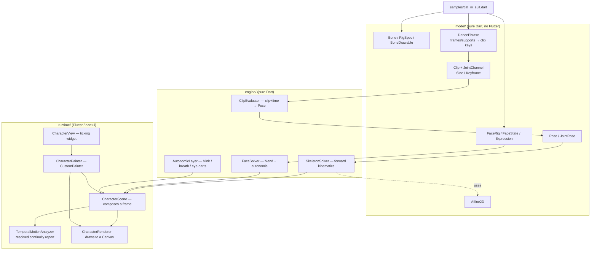
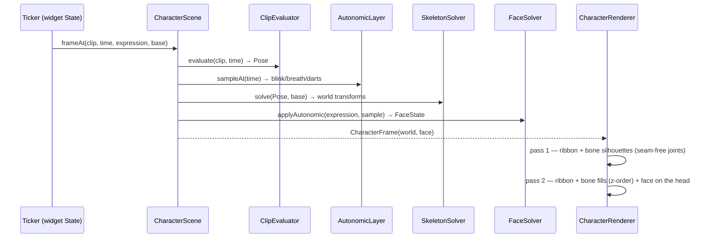
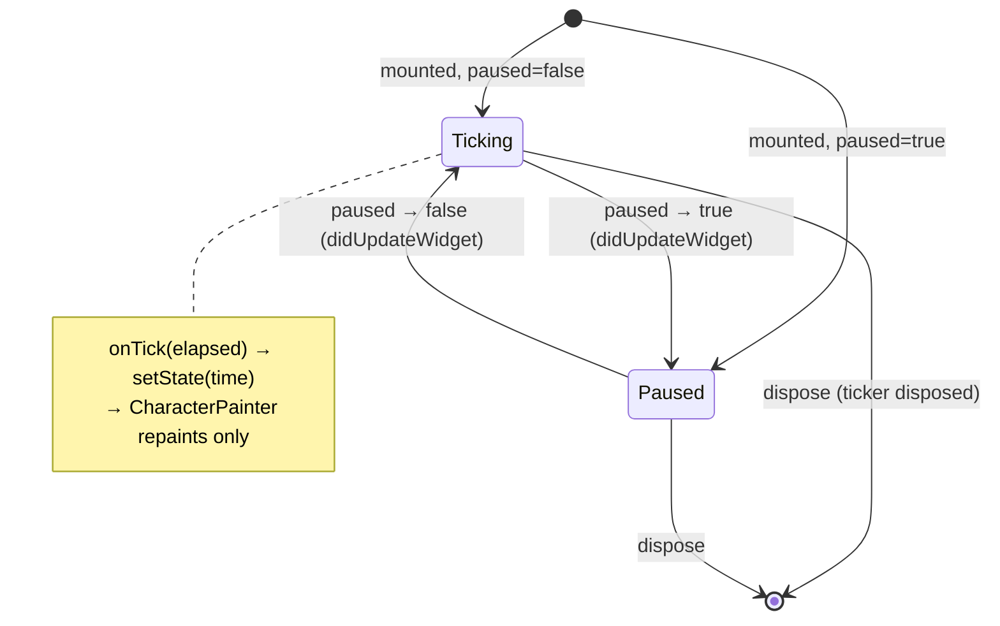
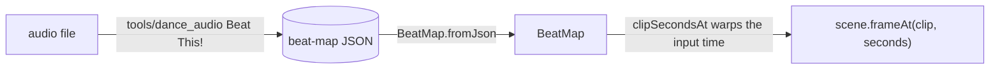

# Character — 2D skeletal ("bones") animation

Programmatic 2D skeletal animation: a rigged character (skeleton + face) driven
by **procedural, data-driven** motion cycles (walk / run / kick / dance / sit /
jump) and an expressive face (smile / frown / surprise / blink). The engine is
pure Dart and deterministic; the same `(clip, time)` always resolves the same
frame, so the live widget and the offline film-strip renderer produce identical
pixels.

This is **Phase 1** (proof of concept). The full design — including the offline,
AI-assisted SVG → rig pipeline and the low-end `drawAtlas` runtime — lives in
[`docs/implementation_plans/2026-06-22_bones_animation_framework.md`](../../../docs/implementation_plans/2026-06-22_bones_animation_framework.md).

## Status (Phase 1)

| Area | State |
| --- | --- |
| Pure-Dart engine (math, FK, clips, face, autonomic) | ✅ built + unit-tested |
| Hand-authored "cat in a suit" rig + 7 clips | ✅ `samples/cat_in_suit.dart` |
| Frame-addressed dance phrase authoring | ✅ `model/dance_phrase.dart` |
| `CustomPainter` runtime drawing bones + soft limb ribbons | ✅ `runtime/` |
| Bendy ribbons for arms/legs/tail | ✅ shoulder→bicep→wrist, hip→quad→knee→calf→ankle, and 7-control tail surfaces |
| Tapered tie (`taperedCapsule` shape) | ✅ 2-link draping tie |
| Locomotion — the cat walks/runs across & turns at edges | ✅ `runtime/character_painter.dart` |
| Ground floor + per-foot contact shadows | ✅ `runtime/character_painter.dart` |
| Dance waterfront backdrop — Lagos lagoon plate, skyline/bridge, yacht, palms, alpha-mask cloud/wave motion | ✅ `runtime/character_painter.dart` + `assets/images/character/` |
| Film-strip + frame-grid + onion + travel + live harness | ✅ `test/.../{film_strip,frame_grid}_test.dart` |
| Interactive demo (clip/expression/blink/wander/BPM keys) | ✅ `demo/character_demo.dart` |
| Offline audio beat-sync (beat map → on-beat dance) | 🚧 tool + `BeatMap` built & tested; **not wired into the runtime yet** |
| Offline AI rigging (SVG → rig) | ⛔ not started (Phase 2) |
| Batched `drawAtlas` runtime + degradation ladder | ⛔ Phase 2 |
| Quadruped (4-leg) stance + rear-up transition | ⛔ Phase 2 |
| Riverpod mood controller / Tamagotchi product | ⛔ separate consumer feature |

Phase 1 draws bones as **vector shapes** (capsules / ellipses / rounded rects /
tapered capsules) plus optional **soft limb ribbons** rather than a pre-baked
sprite atlas. Ribbons are still cheap `Path` geometry, but they draw a whole limb
as one continuous tapered surface through solved joint positions, so elbows and
knees bend through the silhouette instead of exposing rigid-cardboard hinges.
The skeleton, transforms, cycles and face are exactly what the atlas runtime will
use; only the per-bone paint call changes. This lets us validate motion *before*
investing in rasterization.

The walk/run are **keyframed step cycles** (distinct stance/swing, a weight bob,
a pelvic-list line of action, knee-snap and flat-foot plant). The body
**travels** at a stride-matched `locomotionSpeed` so the planted foot holds its
world position instead of skating; the live painter ping-pongs it across the
stage and flips facing at the edges. Kick and dance are in-place performance
clips for judging pose appeal, balance, squash/stretch and arm/tail arcs without
stage travel hiding the body mechanics. The dance clip is authored through a
32-frame `DancePhrase`: support spans and body/limb keys are addressed by
choreography frame (`0..32`) and then compiled into the regular `Clip`
channels. That keeps the movement review language ("frame 16 right-foot plant",
"count-8 loop pickup") aligned with the runtime data instead of scattering raw
normalized phases through the sample. The current phrase is a compact 12-count
Afrobeats groove: an 8-count pocket plus a 4-count toe-flick bounce, with a
small additive root pulse layered over the keyed body motion so slower tempos
still have off-beat life. The demo previews that same authored phrase at 124 BPM
by default, using Omah Lay's "soso" as the current movement reference: warm,
compact, waist-led pocket before bigger stage hits. The BPM slider still spans
80–240 BPM for review. The dance view also uses
`CharacterBackdrop.waterfront`: an asset-backed Lagos-inspired lagoon plate with
a distant skyline/bridge, palms, and a luxury yacht. `CharacterPainter` adds
transparent alpha-mask motion layers for drifting clouds and lagoon glints. The
demo and screenshot harness decode the same assets, so choreography, timing,
contact shadows, and rendered review frames keep one runtime source of truth.
The tail is a single ribbon driven by a 7-link drag chain; the tie is a keyed
2-link cloth shape; ears flick a beat behind the head bob.

## Architecture

The engine is layered so the math stays Flutter-free and trivially testable; only
the runtime touches `dart:ui`.



### Per-frame pipeline



Bones and ribbons are drawn in **two passes**. Pass 1 paints every outlined
surface as a slightly inflated shape in the *single* outline colour, so
overlapping pieces union into one continuous dark blob — no outline ever crosses
into the body at a joint. Pass 2 paints fills in z-order on top, leaving only the
outer rim dark. Rig-declared `LimbRibbonSpec`s hide the rigid upper/lower segment
drawables they replace while keeping terminal hands and shoes visible. The cat
uses this for athletic arms and legs: shoulder → bicep → elbow → wrist, and hip
→ quad → knee → calf → ankle. The tail also renders as one ribbon through its
seven control bones instead of exposing each link as a rigid segment. The hip
itself is a control bone; the suit jacket covers the pelvis and thigh roots so
the legs read as emerging from the body rather than hanging below a separate
block.

The hot path is intentionally cheap: evaluate a handful of sinusoids/keyframes,
walk the bone hierarchy composing `Affine2D`s (~30 bones), resolve the face. No
SVG parsing, no allocation-heavy work.

### Runtime ticker lifecycle

The `Ticker` lives in the widget `State` (not in a provider — pushing a per-frame
value through Riverpod would rebuild the tree 60×/s). Higher-level state (which
clip, which expression) changes infrequently and flows in as widget fields.



## Core concepts

- **`Affine2D`** — immutable 2D affine transform. `multiply` composes
  parent × local for forward kinematics; `toMatrix4Storage` (buffer-reusing)
  feeds `Canvas.transform`.
- **`Bone`** — id, parent, pivot (joint, in the parent's space), rest
  rotation/scale, z-order, and a `BoneDrawable` (shape, size, colour).
- **`LimbRibbonSpec`** — an optional mesh-style surface over a solved joint
  chain. The renderer samples the world origins of its joint bones, builds a
  Catmull-Rom centreline via `limbRibbonPath`, applies the configured width
  profile, and hides the rigid segment drawables named by `hiddenBoneIds`.
- **`Clip` + channels** — a clip is a sparse map of per-bone channels plus root
  motion. `SineChannel` builds cyclic motion (`bias + amp·sin(2π(p+phase)) +
  harmonic`); `KeyframeChannel` builds eased/keyed poses. Root motion can be a
  `SineRootChannel`, `KeyframeRootChannel`, or additive `LayeredRootChannel`
  when a large authored body path needs small rhythmic pulses on top.
  `groundSpans` drive foot-locked locomotion; `contactSpans` damp support-foot
  drift for non-loop stage moves and drive contact shadows for looped in-place
  moves without making kick/dance travel. `LimbIkTarget` adds an optional
  target-based layer for two-bone limbs, so choreography can place a hand or
  foot relative to an anchor bone before the existing contact/head stabilization
  passes run. The dance sample uses this for torso-relative hand paths and
  pelvis-relative foot handoffs. `LayeredIkTargetChannel` lets a dancer keep the
  shared semantic target while adding bounded local offsets, which is the path
  for role/style variation without duplicating an entire coordinate track. New
  cycles are **data, not code**.
- **`DancePhrase`** — choreography-facing authoring for dance clips. It stores
  a phrase length in frames, labelled support-foot windows, load/release frames,
  free-foot identity, pelvis-distance guardrails, pocket compression targets,
  named movement sections, frame-addressed joint/root keys, and synchronized
  body-groove keys for COM, pelvis, and chest. `DanceBodyAccent` adds
  neutralized pulse keys around named hits, so a pocket or rebound can deepen
  root, pelvis, and chest together without hand-editing three separate tracks;
  overlapping body accents merge on the same frame so move blocks can compose
  without duplicate spline keys. `DanceBodyAccentOffset` and
  `DanceMoveBodyAccent` bind those body pulses to move accent frames, which
  keeps named choreography and role styles attached to cue timing instead of
  duplicate raw frame numbers. `DanceMoveJointAccent` does the same for
  role-specific FK shoulder, elbow, and other joint pulses.
  `DanceIkTargetAccent` does the same for local hand/foot target pulses, so a
  lead-hand hit can be layered over the shared semantic hand path without
  duplicating the whole coordinate track. `DanceIkTargetArc` groups named
  hand/foot sweeps as start, peak, settle, and optional control points so
  choreography can point to a move instead of an anonymous run of coordinates.
  `DanceMoveSignature` can own those arcs directly, so a named cue such as a
  camera-answer hand lift carries its own target sweep while still allowing
  exact frame keys to override single silhouette-critical frames.
  `DanceIkTargetOffsetArc` is the role/style counterpart: it emits neutral
  start/end keys around a shaped offset path, so a backup dancer can answer a
  move with a hand arc without dragging that offset through the rest of the
  loop. `DanceMoveTargetOffsetArc` addresses that offset path relative to a
  named cue's accent frame, so role/style choreography follows phrase timing
  edits instead of depending on duplicate raw frame numbers.
  `DanceRoleStyle` groups those body,
  IK-target, and joint accents by dancer role, which keeps backup/alternate
  styles as data overlays instead of separate hand-authored clip forks.
  It compiles those into the same `GroundSpan`, `KeyframeChannel`, and
  `KeyframeRootChannel` primitives the engine already samples. This is the
  handoff point for beat-synced
  choreography, support/weight checks, panel-addressable move windows, and
  future per-character dance styles.
- **`BeatMap` / `BeatLoopBinding`** (`model/beat_map.dart`) — the bridge from the
  authored beat grid to a *real track's* beats. A `BeatMap` (parsed from the
  offline `tools/dance_audio` analysis JSON via `fromJson`) holds detected beat
  and downbeat times; `beatAt` / `timeAtBeat` form a piecewise-linear time warp
  over those anchors, and `clipSecondsAt` maps wall-clock time → clip seconds so a
  looped clip lands on the detected beats — absorbing tempo drift for free.
  `BeatLoopBinding.barAligned` anchors a loop on a real downbeat over whole bars
  (bar-correct); `beatAligned` is the beat-level fallback. It warps only the
  *input time*, leaving `frameAt` untouched, and is **not wired into the runtime
  yet** (see [Audio beat-sync](#audio-beat-sync-offline-tooling--not-yet-wired)).
- **`TemporalMotionAnalyzer`** — a resolved-frame diagnostic over
  `CharacterScene`. It records per-bone frame-to-frame displacement and
  acceleration after clip evaluation, contact pinning, head stabilization, and
  base transforms, so jumpy dance failures report exact bones, frame pairs and
  phases before panel review.
- **`FaceState` / `Expression`** — ~8 continuous "knobs" (mouth shape + open,
  brow raise/angle, eyelid open, gaze). Six emotion presets (neutral, content,
  happy, surprised, sad, angry). Mouths are **shape-swapped**, not deformed.
- **Singing visemes** — four extra `MouthShape`s for lip-sync: `singAh` (a tall
  open jaw cavity with a dark interior + pink tongue), `singOh` (a narrow round
  ring), `singEe` (a wide flat mouth with a bared upper-teeth band), and
  `teethOnLip` (the tight near-closed F/V consonant). They share one crafted
  cavity renderer parameterised by width/height/tongue/teeth. `mouthOpen` drives
  a real **jaw drop**: the lower snout (muzzle, nose, whiskers, mouth) translates
  down with the opening, so an open vowel articulates instead of punching a hole
  in a rigid face. Below ~0.12 the mouth collapses to a closed lip line.
- **`AutonomicLayer`** — the always-on "alive" signals (asymmetric Poisson
  blink, breathing, micro eye-darts). Deterministic via an internal LCG — never
  `Math.random` / `DateTime.now` — so renders are reproducible.

### Lip-sync — singing to a track

`demo/character_dance_to_track_demo.dart` makes the trio sing along to a song.
The mouth shapes come from an **offline Rhubarb Lip Sync cue track** (real vocal
phonemes; see the `dance-lipsync` skill and `tools/dance_audio/lipsync.py`), not
a per-word guess: each cue letter maps to a viseme + opening, eased fast-attack /
slow-release. The **lyric word tags** (lead vs background, from
`transcribe.py --lyrics`) gate *which* cat shows the cues — the frontman on lead
words, the backups on `(...)` ad-libs and the group-hook sections. The upper face
sings too (brows lift, eyes squint into the loud notes), and
`CharacterPainter.singingHeadMotion` bobs the heads on the beat and dips the
singer's head forward/down into the loud syllables (rotated about the neck joint,
so nothing detaches). The approach was validated by an expert panel (lip-sync /
vocal / animation, 9/10 over composition frames); the shipped opening / squint /
head-bob amplitudes are then deliberately dialed back from that panel-max for a
calmer, less over-acted read.

## Reviewing motion — film strips, grids, onions, travel

Two harnesses render to PNGs under `build/character_film_strips/` (override with
`CHARACTER_STRIP_DIR`). Both are also regression tests (every output paints the
character; identical inputs render byte-identical pixels).

```bash
fvm flutter test test/features/character/film_strip_test.dart   # strips + faces
fvm flutter test test/features/character/frame_grid_test.dart   # grids + onions + live + travel
```

`frame_grid_test.dart` is the workhorse and is env-controllable
(`GRID_CLIPS`, `GRID_FRAMES`, `GRID_COLS`, `GRID_SCALE`, `GRID_EXPRESSION`):

| File | Contents |
| --- | --- |
| `<clip>_grid.png` | every sampled frame as a labelled contact sheet |
| `<clip>_onion.png` | all frames superimposed — reveals arcs (crisp = rigid, blur = moving) |
| `<clip>_live.png` | one frame through the real `CharacterPainter` (dance includes the waterfront backdrop; other clips use floor + per-foot contact shadows) |
| `<clip>_travel.png` | locomoting clips overlaid while travelling — planted feet should be **crisp footprints**, a smear means foot-skate |
| `expressions.png`, `blink.png` | the six face presets · an asymmetric blink |

The travel-onion is the instrument for tuning `locomotionSpeed`: a planted foot
that holds its world-x as the body advances reads as discrete footprints; a
mismatched speed smears them ("moonwalk").

## Testing

Pure-Dart math carries the value and is exhaustively unit-tested (one test file
per source file): `Affine2D` algebra, FK against hand-computed joint positions,
clip phase wrap/clamp + channel sampling, autonomic determinism + bounds, face
blending, frame-addressed dance phrase compilation, and temporal motion
diagnostics. Runtime is covered by `CharacterScene`/`CharacterPainter` tests and
the `CharacterView` ticker test (`fakeAsync`-free, `tester.pump(duration)`), plus
the film-strip harness. No `Future.delayed`, no `pumpAndSettle`, no
`Math.random`.

```bash
fvm flutter test test/features/character/
```

## Audio beat-sync (offline tooling — not yet wired)

The dance is authored on a normalized beat grid (`DancePhrase` frames), but the
mapping from those counts to wall-clock seconds is currently a single global
tempo scalar (the demo's BPM slider: `seconds = elapsed × bpm/120`). That has no
phase anchor and assumes constant tempo, so aligning the dance to a real track is
manual and drifts. The path to true on-beat playback is a **beat map**: an
offline analysis of an audio file (beats + downbeats) that the runtime warps the
dance onto.



- `model/beat_map.dart` — `BeatMap` (piecewise-linear `beatAt` / `timeAtBeat`
  warp + `clipSecondsAt`, parsed via `fromJson`) and `BeatLoopBinding`
  (`barAligned` = downbeat-anchored whole bars; `beatAligned` = beat-level
  fallback). Pure, deterministic, fully unit-tested (incl. a Glados round-trip
  property). It warps only the *input time*, so when wired it leaves `frameAt`
  and the film-strip byte-identical invariant untouched. **Not imported by the
  runtime yet** — wiring it into `CharacterView` is a later, deliberate step.
- `tools/dance_audio/` — the offline Python tool (Beat This! + librosa) that
  produces the beat-map JSON `BeatMap` consumes; see its README for the schema.

When wired (the deliberate later step), the ticker swaps its constant scalar for
the beat-map warp — everything downstream of `frameAt` is unchanged:

```dart
// today (constant tempo, no phase anchor):
final seconds = elapsed * (danceBpm / kAuthoredDanceBpm);

// with a beat map (on-beat, drift-following, bar-anchored):
final binding = BeatLoopBinding.barAligned(beatMap, bars: 2);
final seconds = beatMap.clipSecondsAt(
  elapsed,
  clipDuration: clip.duration,
  binding: binding,
);
// → scene.frameAt(clip, seconds) exactly as before.
```

Design rationale, the tooling survey, and the quality ladder (on-beat → bar-correct
→ structure → choreography) live in
[`docs/implementation_plans/2026-06-27_dance_audio_analysis.md`](../../../docs/implementation_plans/2026-06-27_dance_audio_analysis.md).

## Known Phase-1 limitations / next steps

- Secondary drag (tail/tie/ears) is faked with phase-lagged sines, so it has
  **no inertial settle** when a motion stops (sit/jump freeze their cloth). A
  cheap critically-damped spring post-pass is the next step — but the engine's
  `frameAt(clip, time)` is intentionally pure/stateless (the film strip asserts
  byte-identical renders), so the spring needs deterministic warm-up.
- The character is **front-facing**; a true side/¾ profile part-set would lift
  the walk/run further (a sagittal stride foreshortens head-on). Tracked as the
  staging ceiling.
- Limb ribbons are a deliberately small mesh-deformation step, not full weighted
  vertex skinning. They remove the worst elbow/knee/tail cardboard hinges, but
  body squash/stretch is still future work.
- No 2-part foot (heel/toe roll) yet — the foot plants flat.
- Runtime is vector-shape paint, not the batched `drawAtlas` low-end path.
- No quadruped stance / rear-up transition, no offline AI rigging, no feature
  flag, no product surface yet.

See the implementation plan for the full Phase-2 scope and the panel's outcome
rubric.
