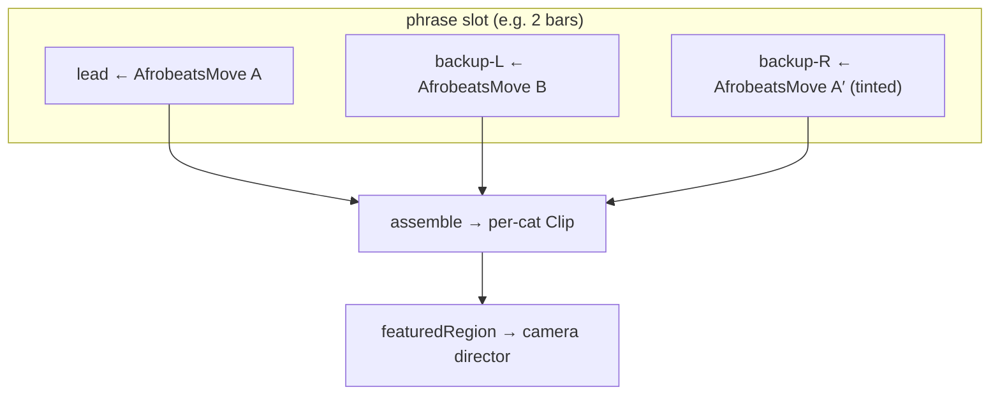

# ADR CHAR-0001: Afrobeats Dance Choreography Encoding & Move Library

> **Series note.** This is ADR **CHAR-0001**, the first record in the
> `character` feature's *own* ADR series (numbered from 0001, `CHAR-` prefixed).
> It is intentionally separate from the repository-wide `docs/adr/` index because
> the character/dance subsystem is expected to be extracted into its own package;
> these records travel with the code. Do not merge this series into the Lotti ADR
> index.

## Status

Proposed (2026-06-28). The Effort-dynamics curve foundation
(`model/dance_dynamics.dart`) is landed; the remainder is planned in the roadmap
(Decision 7).

## Context

The dance-to-track demo (`lib/features/character/demo/`) animates a trio of
chibi cats in suits to an Afrobeats track. Motion is authored data, not code:

- A **per-bone keyframed clip** model (`model/clip.dart`): each bone is a
  `JointChannel` (sine or keyframe) sampled at a normalized phase; root motion is
  a `RootChannel`; hands/feet can hit IK targets. `ClipEvaluator` samples a
  `Clip` at a time into a `Pose`. Channels layer additively
  (`LayeredJointChannel`).
- A **frame-addressed choreography layer** (`model/dance_phrase.dart`): a
  `DancePhrase` (32 frames = 2 bars) compiles named **accents**, support spans,
  sections, and per-move **signatures** down into the clip primitives. The unit
  of authoring is an *accent*: `neutralKey(start) → peakKey() → neutralKey(end)`
  around a beat frame.
- A **beat map** (`model/beat_map.dart`) time-warps the loop onto the song, and
  a **virtual camera director** (`demo/dance_camera_director.dart`, ADR-less but
  documented in the feature README) frames the performance.

The choreography already speaks some Afrobeats — the current routine is built on
**Shaku** (crossed-arm pocket), **Gbese** (toe-flick), and **komole** (dip).

**The gap.** Three weaknesses, all confirmed by prior art (see Related):

1. **Flat dynamics.** Every accent interpolates with a single `easeInOut`. Beat
   hits have no *anticipation* (wind-up before the hit), no *overshoot*
   (follow-through after), and no *snap* control. The poses are good; the
   dynamics *between* them read as weightless — exactly what the animation
   literature says drains life from motion.
2. **A synchronized trio.** The three cats groove in lock-step rather than
   interlocking — they read as clones, not an ensemble.
3. **One hard-coded routine.** Adding a dance means hand-keying a new routine;
   there is no reusable vocabulary of moves.

**Research grounding.** Two fan-outs informed this ADR (preserved under
`../research/`):

- A movement-notation/choreography-theory synthesis (Labanotation, Laban
  Movement Analysis / EMOTE / PERFORM, the 12 animation principles, West-African
  polyrhythm). It converged on one architecture: *keep the keyframed clips, but
  reshape them through a continuous Laban-Effort parameter layer, and stop
  driving the trio in lock-step.*
- A per-move fan-out (one researcher per candidate dance) producing
  count-accurate, side-on-feasibility-flagged keying notes for seven moves.

## Decision

### D1 — Encode dynamics as a continuous Laban-Effort layer over the clips

Keep the keyframed accents; add a small **dynamics** descriptor that reshapes the
*timing* of an accent without changing its authored pose values.

`DanceDynamics` (`model/dance_dynamics.dart`) is a const value type with three
signed dials in `-1..1`, the trustworthy three Effort factors (Effort *Space* is
omitted — the computational-LMA literature found it the least reliable):

| Dial | `-1` | `+1` | Shapes |
| --- | --- | --- | --- |
| `weight` | Light | Strong | **anticipation** — a Strong accent winds up (dips opposite the peak) before driving |
| `time` | Sustained | Sudden | **snap vs. sustain** — Sudden accelerates *into* the peak (steepest late); Sustained eases early |
| `flow` | Bound | Free | **overshoot/follow-through** — Free swings past the peak then settles |

`dynamicsCurve(DanceDynamics) → EaseCurve` realizes these as one analytic
inter-keyframe curve, the EMOTE recipe adapted to a single segment:

- inflection `tᵢ = 0.5 + 0.4·max(strong,sudden) − 0.4·max(light,sustained)`
  (clamped) → a power time-warp that places an `easeInOut`'s steepest point at
  `tᵢ`;
- a Strong `weight` subtracts an early bump so the curve dips **below 0**
  (anticipation);
- a Free `flow` adds a late bump so the curve rises **above 1** then returns to
  exactly 1 (overshoot).

Endpoints are exact (`f(0)=0`, `f(1)=1`) so authored key values are still hit on
the beat. `DanceDynamics.neutral` (all zero) reproduces `easeInOut` exactly, so
the layer is **opt-in and regression-free**.

**Realization choice — analytic curve, not key insertion.** Two options were
weighed: (A) an analytic parameterized curve carried as an optional
`EaseFn` on the keyframe; (B) inserting extra anticipation/overshoot keyframes
and letting the existing Catmull-Rom spline shape velocity. We chose **A**: it
gives direct, documented control of the boundary velocities and inflection, and
the curve is a pure function testable in isolation (it is, in
`dance_dynamics_test.dart`: neutral-equivalence, exact endpoints, the
anticipation dip, the overshoot, the snap-vs-sustain inflection, and Glados
invariants).

**Smooth-channel caveat (important for wiring).** The dance accent channels are
built with `smooth: true` (periodic Catmull-Rom), and that path **ignores per-key
easing**. Therefore a *dynamics-bearing* accent must compile to a **non-smooth**
channel carrying the `EaseFn`; accents *without* dynamics stay on the smooth path
untouched (this is what makes D1 regression-free). The accent layer is already a
separate `LayeredJointChannel` entry from the continuous groove layer, so this
split is local.

```mermaid
flowchart LR
  dd["DanceDynamics(weight,time,flow)<br/>const, lives in choreography data"]
  dd -->|"dynamicsCurve() at assembly"| ec["EaseCurve f(t)<br/>dip&lt;0 · t&#7522; · &gt;1 overshoot"]
  ec -->|"easeFn on peak/settle keys"| acc["accent: neutral → peak → neutral<br/>(non-smooth channel)"]
  acc --> ch["JointChannel / RootChannel"]
  ch --> clip["Clip"]
  clip --> ev["ClipEvaluator → Pose"]
  ev --> scene["CharacterScene → painter"]
```

### D2 — Author moves as a notation-style score: a reusable move library

Treat each popular dance as a reusable **move signature** — a bundle of per-bone
accents over a frame window — rather than baking it into one routine. This is the
"notation as score" idea from Labanotation/LabanDancer made concrete, and it is
largely a *formalization* of types that already exist: `DanceMoveCue` (named beat
window + featured dancer), `DanceMoveSignature` (per-move accents/keys/IK arcs),
and `DanceRoleStyle` (per-cat style derivation).

The promoted unit is `AfrobeatsMove`: a named, self-contained cell carrying its
natural count length, a default `DanceDynamics` (its Effort character), the
per-bone accents / body accents / hand IK arcs it drives, its support /
weight-shift pattern, and a `featuredRegion` tag (legs / arms / chest / feet).
The `featuredRegion` closes the loop with the shipped camera director — a
legs-featured move requests the legwork-hero framing; an arm-mime move requests a
medium where hands read.

Authoring a new dance becomes **adding one data entry**, no engine change.

### D3 — The phrase is a slot timeline with per-cat move assignment

Replace the single 32-frame routine with a sequence of **slots**, each assigning
a move per cat. One structure delivers three research levers at once:

- **call-and-response** — different moves per cat per slot;
- **polyrhythm** — a move's natural count length need not divide the slot evenly,
  so the three cats' weight-shifts deliberately collide and only re-sync at the
  cycle top (West-African cross-rhythm over the shared beat map);
- **personality** — the same move tinted with a different `DanceDynamics` per cat
  (via the existing `DanceRoleStyle` seam).

### D4 — The move catalog (which moves we encode, and why)

Selected for popularity, **side-on** readability, Effort variety (so they
contrast rather than blur), and tone (tasteful suited cats). Full count-accurate
keying notes per move live in
[`../research/2026-06-28-afrobeats-dance-moves.md`](../research/2026-06-28-afrobeats-dance-moves.md).

| Move | Origin | Effort (W/T/F) | Featured | Trio role | Side-on stylization |
| --- | --- | --- | --- | --- | --- |
| **Zanku / Legwork** | Zlatan, NG 2018 | Strong · Sudden · Bound (Free kick) | legs | **lead hero** (the legwork-camera moment) | air-kick reads in profile; roundhouse → sagittal arc |
| **Shaku Shaku** | Lagos/Olamide, NG 2017 | loose body · Sudden legs · Bound arms | legs/medium | baseline pocket (deepen) | half-gallop = fore/aft skid; raise the crossed-arm X across the jaw |
| **Azonto** | Sarkodie, GH 2011 | loose body · Sudden·Direct hands | arms | backup + **call-response** | container + swappable mime; keep boxing/driving/ironing/fishing/phone, skip washing/swimming/praying |
| **Buga** | Kizz Daniel, NG 2022 | Light bounces → Strong·Direct·Sudden hit, holds | chest | **unison hit** | single lead arm angled into the picture plane, not at camera |
| **Pouncing Cat** (Amapiano) | SA, ~2020–23 | Sustained · Bound · Light glide | feet | **gliding contrast** | lateral foot-slides are ideal side-on; it is literally a stalking cat |
| **Sekem** | MC Galaxy, NG 2014 | Strong · Sudden plant · Bound | legs/low | grounded stomp contrast | hands pinned front/back read in profile; the hard stomp + shoulder pump are a stylization of the authentic weight-shift |

**Dropped: Soapy** (Naira Marley, 2019). Its well-known meaning is a
masturbation mime (the artist's stated prison framing); it drew public
condemnation and is off-tone for the piece. Its only mechanical contribution — a
low, grounded, Bound squat — is already supplied by **Pouncing Cat** and
**Sekem**, so nothing is lost.

**Optional: Gwara Gwara** (DJ Bongz, ZA 2016). Mechanically excellent for
side-view (the propeller arm is a sagittal-plane circle), but it is South African
gqom/kwaito, not Nigerian Afrobeats — held as a possible "continental breadth"
flourish, not a core move.

**Side-on stylization principle.** Every cited precedent targets 3D figures; we
render a side-on chibi with faked depth. Lateral/front-plane motion (hip circles,
left↔right weight shifts, front-facing arm thrusts) must be **re-encoded** into
the picture plane (fore/aft rock + vertical drop; arms angled along the stage
direction) or staged as an ensemble offset across the three cats. Every move in
the catalog was vetted for this and carries explicit stylization notes.

### D5 — Taste boundary: body unbounded, faces capped

The owner's taste is **faces-only restraint**: no over-acted/"screaming" faces.
**Body** motion is unbounded — bold amplitude, big weight-shifts, snappy
accents, and polyrhythmic divergence are all in-scope. Practically: when a body
accent would naturally yank the head/mouth into a grimace, the **face** channel
is clamped while the **body** runs full amplitude. Effort amplitudes for the body
are tuned for legibility, not restraint.

### D6 — Effort is a perceptual dial, not a measurement

Inter-rater reliability for Effort/Shape is only weak-to-acceptable; these are
fuzzy authoring knobs, used forward (to author) rather than as ground-truth
measurement. The dynamics constants (`_kAnticipationScale`, etc.) are tuning
values to be confirmed by eye on rendered output, not derived constants.

### D7 — Increment roadmap

1. **Effort dynamics on accents** — `DanceDynamics` + `dynamicsCurve` (✅ landed),
   then the `EaseFn` wiring through `Keyframe`/the accent compiler (non-smooth
   dynamics channels), proved on a few lead accents with `TemporalMotionAnalyzer`
   kinematic tests.
2. **Promote `DanceMoveSignature` → `AfrobeatsMove`** and extract the current
   Shaku/Gbese/komole routine into the first catalog entries (behavior-preserving
   refactor).
3. **Author the catalog moves** (all six) as data entries, each with a render
   check and kinematic tests.
4. **Slot timeline + per-cat assignment** — call-response + polyrhythm +
   personality.

## Consequences

**Positive.**

- Dynamics become a small, reusable, unit-testable vocabulary; restrained or bold
  is a dial, not a re-key.
- New dances are data, not engine changes; the catalog is extensible.
- The trio gains genuine ensemble texture (polyrhythm/personality) for little
  code, reusing the existing `DanceRoleStyle` seam.
- `featuredRegion` ties choreography to the camera director already shipped.
- Self-contained under the feature, so it ejects cleanly with the code.

**Negative / risks.**

- The smooth-channel caveat (D1) means dynamics accents change interpolation mode
  (smooth → non-smooth); the regression guarantee holds only for accents with no
  dynamics. Tests must distinguish "null dynamics ≡ untouched" from "neutral
  dynamics ≡ easeInOut-equivalent."
- 2D stylization is per-move craft; a move can read wrong from the side until its
  stylization is tuned (the research flags the risks but does not remove them).
- Effort constants are perceptual; expect eyeball tuning passes.

**Neutral.**

- No CHANGELOG/user-facing surface — the dance demo is a developer tool.

## Related

- Feature README: [`../../README.md`](../../README.md) (rig, clips, camera
  director).
- Research preserved under `../research/`:
  `2026-06-27-movement-notation-synthesis.md` (notation/Effort/animation-principle
  synthesis) and `2026-06-28-afrobeats-dance-moves.md` (per-move keying notes +
  sources).
- Primary sources behind D1–D3: EMOTE (Chi/Costa/Zhao/Badler, SIGGRAPH 2000),
  PERFORM (Durupinar et al., ACM TOG 2017), computational-LMA formulas (arXiv
  2504.21166, 2006.06071), West-African polyrhythm (SHS Web of Conferences
  etltc2021_05001), the 12 animation principles (Thomas & Johnston).
- Code: `model/dance_dynamics.dart`, `model/dance_phrase.dart`, `model/clip.dart`,
  `samples/cat_in_suit.dart`.
