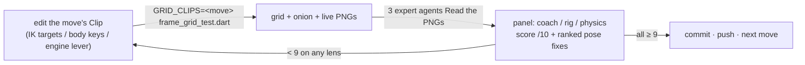
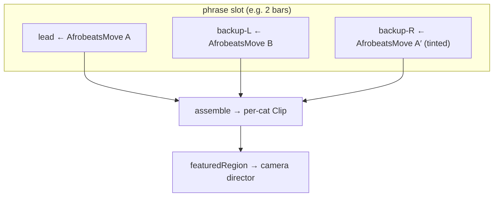

# ADR CHAR-0001: Afrobeats Dance Choreography Encoding & Move Library

> **Series note.** This is ADR **CHAR-0001**, the first record in the
> `character` feature's *own* ADR series (numbered from 0001, `CHAR-` prefixed).
> It is intentionally separate from the repository-wide `docs/adr/` index because
> the character/dance subsystem is expected to be extracted into its own package;
> these records travel with the code. Do not merge this series into the Lotti ADR
> index.

## Status

**Accepted — implemented (2026-06-29).** All six catalog moves (Decision 4) ship
as data and each was certified **≥9.0/10 on every lens** (afrobeats coach +
rigging/mocap + physics) by the frame-by-frame expert panel:

| Move | Coach | Rig | Physics |
| --- | --- | --- | --- |
| Azonto | 9.1 | 9.0 | 9.0 |
| Buga | 9.1 | 9.0 | 9.0 |
| Zanku | 9.1 | 9.0 | 9.0 |
| Sekem | 9.1 | 9.0 | 9.0 |
| Pouncing Cat | 9.1 | 9.0 | 9.1 |
| Shaku | 9.0 | 9.1 | 9.0 |

The Effort-dynamics foundation (D1) and the `AfrobeatsMove` descriptor + sub-frame
timing (D2) landed as designed and are unit-tested. The **shipped moves
themselves**, however, were authored by a more direct path than the planned
`AfrobeatsMove`-compilation — see **[Implementation outcome](#implementation-outcome-as-built-2026-06-29)** for what was actually built, the
reusable engine levers it produced, and where it diverged from the plan below.
The slot timeline (D3) and the audio time-warp (D8) remain unbuilt by design.

## Implementation outcome (as-built, 2026-06-29)

The render→panel→fix grind (below) drove a deliberate divergence from the planned
authoring path. Documenting it honestly so the docs match the code:

**Each move is its own hand-keyed `Clip`, not an `AfrobeatsMove`-compiled cell.**
The six moves live in `samples/cat_in_suit.dart` as separate `CatClips` getters
(`shaku`, `zanku`, `azonto`, `buga`, `pouncingCat`, `sekem`). Each reuses the base
`dance` channels and overrides what its signature needs: per-clip body-groove
keys, per-beat support `contactSpans`, and **hand/foot/limb IK targets**
(`LimbIkTarget` + `KeyframeIkTargetChannel`). This is what the panel grind
rewarded — direct, per-frame control of the silhouette — over routing every move
through the `DanceMoveSignature`/`AfrobeatsMove` compiler. The compiler
infrastructure is built and tested and remains the right path for a future
data-driven catalog, but the current moves did not need it to reach 9/10.

**The reusable engine toolkit the grind produced** (all opt-in per clip, the
shipped `dance` untouched at defaults):

- **`Clip.danceHeadBobScale`** (default `1.0`) — scales the engine's dance head
  treatment in `CharacterScene._rigidHeadWorld`: the head-attitude nod **and**
  the vertical **and lateral** head counters. Lower → the skull lags more of the
  body's lateral sway, so the tall ears stop sweeping side-to-side (the dominant
  onion "fan" on big-amplitude moves was a *lateral* sweep, not a vertical bob).
  Pouncing uses `0.0` for a dead-level head (its signature); Shaku/Azonto use
  `0.2`–`0.3`.
- **`Clip.supportFootWorldAnchor`** (default `false`) — world-anchors the active
  support foot during its contact span so an in-place groove rides *over* a
  planted foot instead of dragging it (the "skate"). Every dance move opts in.
- **`Ease.easeOutBack` on the non-smooth `KeyframeIkTargetChannel`** — the
  systematic way to get visible anticipation→overshoot→settle on an accent limb
  (point-out, piston, arm pendulum): the paw whips *past* the target then settles.
  `DanceIkTargetKey` already carries an `Ease`; switching the channel to
  non-smooth (the default) activates per-key easing. This closed the physics lens
  on Azonto/Shaku/Pouncing. (See the keyframe-sampling note below for *why*
  this — and not an `easeFn` curve — is what reads.)
- **Per-clip leg-lower / foot-IK overrides for visible weight** — a `legLowerL/R`
  keyframe override gives Buga a leg-*driven* rise (knees flex deep through the
  dips, **extend** on the hit); Sekem's deeper on-beat squash + harder lateral
  hip commit (`rootDx`) makes the stomp "sit" over the planting foot.
- **The forearm sleeve band (shared rig, costume)** — Shaku's crossed-X ran the
  navy forearm over the navy torso, so the paws read as detached mitts. The
  light wrist-cuff (`cuffL/cuffR`) was lengthened into a rolled-up shirt-sleeve
  band so the forearm reads light against the body. This was the one shared-rig
  (all-clips) change; it was made with the owner's sign-off because it is a
  character-costume decision, not choreography.

**The decisive constraint — the panel sees only keyframes.** Acceptance is judged
on a 32-frame contact sheet, and those 32 samples land *on the integer phrase
frames = the keyframes*. So **sub-frame velocity is invisible to the panel**:
easing that only changes motion *between* sampled frames (e.g. a dense-keyed
foot's `easeIn` hard-stop) cannot move the score, while anything expressed as a
**pose at a sampled frame** can. This is why `easeOutBack` works (its overshoot
peak lands on an intermediate sampled frame) and why every fix above is a
position/pose change, not a timing tweak. It also means a couple of genuinely
sub-frame qualities (a stomp's contact-velocity "crack") are correct for the live
60 fps app yet uncertifiable by the frame panel — noted, not chased.

**The render→panel→fix loop (the acceptance process).**

## Context

The dance-to-track demo (`lib/features/character/demo/`) animates a trio of
chibi cats in suits to an Afrobeats track. Motion is authored data, not code:

- A **per-bone keyframed clip** model (`model/clip.dart`): each bone is a
  `JointChannel` (sine or keyframe) sampled at a normalized phase; root motion is
  a `RootChannel`; hands/feet can hit IK targets. `ClipEvaluator` samples a
  `Clip` at a time into a `Pose`. Channels layer additively
  (`LayeredJointChannel`).
- A **frame-addressed choreography layer** (`model/dance_phrase.dart`): a
  `DancePhrase` (32 frames = 2 bars) compiles named **accents**, support spans,
  sections, and per-move **signatures** down into the clip primitives. The unit
  of authoring is an *accent*: `neutralKey(start) → peakKey() → neutralKey(end)`
  around a beat frame.
- A **beat map** (`model/beat_map.dart`) time-warps the loop onto the song, and
  a **virtual camera director** (`demo/dance_camera_director.dart`, ADR-less but
  documented in the feature README) frames the performance.

The choreography already speaks some Afrobeats — the current routine is built on
**Shaku** (crossed-arm pocket), **Gbese** (toe-flick), and **komole** (dip).

**The gap.** Three weaknesses, all confirmed by prior art (see Related):

1. **Flat dynamics.** Every accent interpolates with a single `easeInOut`. Beat
   hits have no *anticipation* (wind-up before the hit), no *overshoot*
   (follow-through after), and no *snap* control. The poses are good; the
   dynamics *between* them read as weightless — exactly what the animation
   literature says drains life from motion.
2. **A synchronized trio.** The three cats groove in lock-step rather than
   interlocking — they read as clones, not an ensemble.
3. **One hard-coded routine.** Adding a dance means hand-keying a new routine;
   there is no reusable vocabulary of moves.

**Research grounding.** Two fan-outs informed this ADR (preserved under
`../research/`):

- A movement-notation/choreography-theory synthesis (Labanotation, Laban
  Movement Analysis / EMOTE / PERFORM, the 12 animation principles, West-African
  polyrhythm). It converged on one architecture: *keep the keyframed clips, but
  reshape them through a continuous Laban-Effort parameter layer, and stop
  driving the trio in lock-step.*
- A per-move fan-out (one researcher per candidate dance) producing
  count-accurate, side-on-feasibility-flagged keying notes for seven moves.

## Decision

### D1 — Encode dynamics as a continuous Laban-Effort layer over the clips

Keep the keyframed accents; add a small **dynamics** descriptor that reshapes the
*timing* of an accent without changing its authored pose values.

`DanceDynamics` (`model/dance_dynamics.dart`) is a const value type with three
signed dials in `-1..1`, the trustworthy three Effort factors (Effort *Space* is
omitted — the computational-LMA literature found it the least reliable):

| Dial | `-1` | `+1` | Shapes |
| --- | --- | --- | --- |
| `weight` | Light | Strong | **anticipation** — a Strong accent winds up (dips opposite the peak) before driving |
| `time` | Sustained | Sudden | **snap vs. sustain** — Sudden accelerates *into* the peak (steepest late); Sustained eases early |
| `flow` | Bound | Free | **overshoot/follow-through** — Free swings past the peak then settles |

`dynamicsCurve(DanceDynamics) → EaseCurve` realizes these as one analytic
inter-keyframe curve, the EMOTE recipe adapted to a single segment:

- inflection `tᵢ = 0.5 + 0.4·max(strong,sudden) − 0.4·max(light,sustained)`
  (clamped) → a power time-warp that places an `easeInOut`'s steepest point at
  `tᵢ`;
- a Strong `weight` subtracts an early bump so the curve dips **below 0**
  (anticipation);
- a Free `flow` adds a late bump so the curve rises **above 1** then returns to
  exactly 1 (overshoot).

Endpoints are exact (`f(0)=0`, `f(1)=1`) so authored key values are still hit on
the beat. `DanceDynamics.neutral` (all zero) reproduces `easeInOut` exactly, so
the layer is **opt-in and regression-free**.

**Realization choice — analytic curve, not key insertion.** Two options were
weighed: (A) an analytic parameterized curve carried as an optional
`EaseFn` on the keyframe; (B) inserting extra anticipation/overshoot keyframes
and letting the existing Catmull-Rom spline shape velocity. We chose **A**: it
gives direct, documented control of the boundary velocities and inflection, and
the curve is a pure function testable in isolation (it is, in
`dance_dynamics_test.dart`: neutral-equivalence, exact endpoints, the
anticipation dip, the overshoot, the snap-vs-sustain inflection, and Glados
invariants).

**Smooth-channel caveat (important for wiring).** The dance accent channels are
built with `smooth: true` (periodic Catmull-Rom), and that path **ignores per-key
easing**. Therefore a *dynamics-bearing* accent must compile to a **non-smooth**
channel carrying the ease; accents *without* dynamics stay on the smooth path
untouched (this is what makes D1 regression-free). The accent layer is already a
separate `LayeredJointChannel` entry from the continuous groove layer, so this
split is local.

**Two ease carriers (as-built).** There are two non-smooth paths and they carry
ease differently — the implementation uses whichever the channel exposes:

- **Joint/root keyframes** carry an open-ended `EaseCurve` (`Keyframe.easeFn`),
  which is what `dynamicsCurve(DanceDynamics)` produces (the analytic curve of
  D1, with its sub-0 dip and >1 overshoot).
- **IK-target keyframes** (`IkTargetKeyframe`/`DanceIkTargetKey`, the hand/foot
  paths) carry the **`Ease` enum**, not an `EaseCurve`. The shipped moves get
  their hand/foot anticipation→overshoot→settle from **`Ease.easeOutBack`** on
  the non-smooth IK channel (and, in a few hit accents, an explicit extra
  overshoot keyframe). Same perceptual result, different carrier — see the
  [Implementation outcome](#implementation-outcome-as-built-2026-06-29).

```mermaid
flowchart LR
  dd["DanceDynamics(weight,time,flow)<br/>const, lives in choreography data"]
  dd -->|"dynamicsCurve() at assembly"| ec["EaseCurve f(t)<br/>dip&lt;0 · t&#7522; · &gt;1 overshoot"]
  ec -->|"easeFn on peak/settle keys"| acc["accent: neutral → peak → neutral<br/>(non-smooth channel)"]
  acc --> ch["JointChannel / RootChannel"]
  ch --> clip["Clip"]
  clip --> ev["ClipEvaluator → Pose"]
  ev --> scene["CharacterScene → painter"]
```

### D2 — Author moves as a notation-style score: a reusable move library

Treat each popular dance as a reusable **move signature** — a bundle of per-bone
accents over a frame window — rather than baking it into one routine. This is the
"notation as score" idea from Labanotation/LabanDancer made concrete, and it is
largely a *formalization* of types that already exist: `DanceMoveCue` (named beat
window + featured dancer), `DanceMoveSignature` (per-move accents/keys/IK arcs),
and `DanceRoleStyle` (per-cat style derivation).

The promoted unit is `AfrobeatsMove` (`model/afrobeats_move.dart`): a named cell
carrying an explicit **`feel`** (`DanceFeel` — its relationship to the downbeat:
`onBeat` / `offBeat` / `halfTime`), a **`featuredRegion`** tag (legs / arms /
chest / feet / full), a default `DanceDynamics` (its Effort character), and a
default sub-frame **`swingFrames`** pocket — plus the per-bone accents it drives.
`styleJointAccents(...)` stamps a move's effort and pocket onto bare accents in
one place, so the feel / effort / timing are not repeated per accent.

The `featuredRegion` closes the loop with the shipped camera director — a
legs-featured move requests the legwork-hero framing; an arm-mime move requests a
medium where hands read.

**Explicit, reviewable timing.** A move's downbeat relationship is first-class,
not implicit in where accents happen to land — this is exactly what an Afrobeats
coach judges. Two levers realise it:

- **Accent-frame placement** — a `DanceJointAccent` peaks on its integer `frame`,
  with the anticipation wind-up over `[frame − radius, frame]`. "Hit on the
  downbeat" = peak frame on the beat (0/4/8/…); a `halfTime` move pulses every
  two beats; an `offBeat` accent peaks on an "and".
- **Sub-frame swing** — `DanceJointAccent.microFrames` (and the move's
  `swingFrames`) nudge the whole accent a *fraction* of a frame off the integer
  grid: positive = laid-back pocket (behind the beat), negative = pushed (ahead).
  This is what turns a metronomic, on-grid groove into one that sits in the
  pocket. Routed through `phaseOf` so the integer frame is still range-checked.

Authoring a new dance becomes **adding one data entry**, no engine change.

### D3 — The phrase is a slot timeline with per-cat move assignment

Replace the single 32-frame routine with a sequence of **slots**, each assigning
a move per cat. One structure delivers three research levers at once:

- **call-and-response** — different moves per cat per slot;
- **polyrhythm** — a move's natural count length need not divide the slot evenly,
  so the three cats' weight-shifts deliberately collide and only re-sync at the
  cycle top (West-African cross-rhythm over the shared beat map);
- **personality** — the same move tinted with a different `DanceDynamics` per cat
  (via the existing `DanceRoleStyle` seam).

### D4 — The move catalog (which moves we encode, and why)

Selected for popularity, **side-on** readability, Effort variety (so they
contrast rather than blur), and tone (tasteful suited cats). Full count-accurate
keying notes per move live in
[`../research/2026-06-28-afrobeats-dance-moves.md`](../research/2026-06-28-afrobeats-dance-moves.md).

| Move | Origin | Effort (W/T/F) | Featured | Trio role | Side-on stylization |
| --- | --- | --- | --- | --- | --- |
| **Zanku / Legwork** | Zlatan, NG 2018 | Strong · Sudden · Bound (Free kick) | legs | **lead hero** (the legwork-camera moment) | air-kick reads in profile; roundhouse → sagittal arc |
| **Shaku Shaku** | Lagos/Olamide, NG 2017 | loose body · Sudden legs · Bound arms | legs/medium | baseline pocket (deepen) | half-gallop = fore/aft skid; raise the crossed-arm X across the jaw |
| **Azonto** | Sarkodie, GH 2011 | loose body · Sudden·Direct hands | arms | backup + **call-response** | container + swappable mime; keep boxing/driving/ironing/fishing/phone, skip washing/swimming/praying |
| **Buga** | Kizz Daniel, NG 2022 | Light bounces → Strong·Direct·Sudden hit, holds | chest | **unison hit** | single lead arm angled into the picture plane, not at camera |
| **Pouncing Cat** (Amapiano) | SA, ~2020–23 | Sustained · Bound · Light glide | feet | **gliding contrast** | lateral foot-slides are ideal side-on; it is literally a stalking cat |
| **Sekem** | MC Galaxy, NG 2014 | Strong · Sudden plant · Bound | legs/low | grounded stomp contrast | hands pinned front/back read in profile; the hard stomp + shoulder pump are a stylization of the authentic weight-shift |

**Dropped: Soapy** (Naira Marley, 2019). Its well-known meaning is a
masturbation mime (the artist's stated prison framing); it drew public
condemnation and is off-tone for the piece. Its only mechanical contribution — a
low, grounded, Bound squat — is already supplied by **Pouncing Cat** and
**Sekem**, so nothing is lost.

**Optional: Gwara Gwara** (DJ Bongz, ZA 2016). Mechanically excellent for
side-view (the propeller arm is a sagittal-plane circle), but it is South African
gqom/kwaito, not Nigerian Afrobeats — held as a possible "continental breadth"
flourish, not a core move.

**Side-on stylization principle.** Every cited precedent targets 3D figures; we
render a side-on chibi with faked depth. Lateral/front-plane motion (hip circles,
left↔right weight shifts, front-facing arm thrusts) must be **re-encoded** into
the picture plane (fore/aft rock + vertical drop; arms angled along the stage
direction) or staged as an ensemble offset across the three cats. Every move in
the catalog was vetted for this and carries explicit stylization notes.

### D5 — Taste boundary: body unbounded, faces capped

The owner's taste is **faces-only restraint**: no over-acted/"screaming" faces.
**Body** motion is unbounded — bold amplitude, big weight-shifts, snappy
accents, and polyrhythmic divergence are all in-scope. Practically: when a body
accent would naturally yank the head/mouth into a grimace, the **face** channel
is clamped while the **body** runs full amplitude. Effort amplitudes for the body
are tuned for legibility, not restraint.

### D6 — Effort is a perceptual dial, not a measurement

Inter-rater reliability for Effort/Shape is only weak-to-acceptable; these are
fuzzy authoring knobs, used forward (to author) rather than as ground-truth
measurement. The dynamics constants (`_kAnticipationScale`, etc.) are tuning
values to be confirmed by eye on rendered output, not derived constants.

### D7 — Increment roadmap

1. **Effort dynamics on accents** — `DanceDynamics` + `dynamicsCurve` + the
   `EaseCurve` wiring through `Keyframe.easeFn`/the accent compiler (non-smooth
   dynamics channels), proved with kinematic tests (✅ landed).
2. **`AfrobeatsMove` + explicit timing** — the move descriptor (`feel`,
   `featuredRegion`, `dynamics`, `swingFrames`, `styleJointAccents`) and
   **sub-frame swing** (`DanceJointAccent.microFrames`) (✅ landed, unit-tested).
3. **Author the catalog moves** (all six) to **9/10** on rendered frames (✅
   landed). Authored as **separate hand-keyed clips** via the render→panel grind
   rather than `AfrobeatsMove`-compiled cells — see
   [Implementation outcome](#implementation-outcome-as-built-2026-06-29). Each
   carries a kinematic clip-set test and the engine levers it needed.
4. **Slot timeline + per-cat assignment** — call-response + polyrhythm +
   personality (⬜ **not built**). The shipped showcase trio is three *fixed*
   clips (Shaku lead / Azonto left / Zanku right) on the shared phrase; the
   `DanceRoleStyle` seam for tinting and the per-cat assignment timeline are the
   open extension. A future data-driven catalog would route moves through the
   D2 `AfrobeatsMove` compiler that this increment now justifies.

### D8 — Audio time-warp: built but unnecessary for a steady track

The runtime warp **code is built and wired**: `BeatMap` (`model/beat_map.dart`,
piecewise-linear `beatAt`/`timeAtBeat`/`clipSecondsAt`) and
`BeatLoopBinding.barAligned`, and the audio demo
(`demo/character_dance_to_track_demo.dart`) plays the loop through them so it
stays downbeat-anchored. What was *deferred* — and, per the owner's call
(2026-06-29), is **not needed for the current track** — is generating a dense
per-song beat map and dialing in a full drift-absorbing warp:

- Modern Afrobeats/Amapiano is produced to a DAW grid, so the tempo is steady.
  A steady track only needs **two numbers — BPM and the downbeat offset** —
  which is exactly what `BeatLoopBinding.barAligned` consumes; the loop then
  locks forever.
- The dense beat-by-beat `clipSecondsAt` warp only earns its keep on
  tempo-*drifting* material (live bands, old recordings, rubato). It remains a
  documented option, not a required build step.

So this is closed as **"available, only build the dense map if a drifting track
is ever added."** No further work is required for the shipped demo.

## Consequences

**Positive.**

- Dynamics become a small, reusable, unit-testable vocabulary; restrained or bold
  is a dial, not a re-key.
- New dances are data, not engine changes; the catalog is extensible.
- The trio gains genuine ensemble texture (polyrhythm/personality) for little
  code, reusing the existing `DanceRoleStyle` seam.
- `featuredRegion` ties choreography to the camera director already shipped.
- Self-contained under the feature, so it ejects cleanly with the code.

**Negative / risks.**

- The smooth-channel caveat (D1) means dynamics accents change interpolation mode
  (smooth → non-smooth); the regression guarantee holds only for accents with no
  dynamics. Tests must distinguish "null dynamics ≡ untouched" from "neutral
  dynamics ≡ easeInOut-equivalent."
- 2D stylization is per-move craft; a move can read wrong from the side until its
  stylization is tuned (the research flags the risks but does not remove them).
- Effort constants are perceptual; expect eyeball tuning passes.

**Neutral.**

- No CHANGELOG/user-facing surface — the dance demo is a developer tool.

## Related

- Feature README: [`../../README.md`](../../README.md) (rig, clips, camera
  director).
- Research preserved under `../research/`:
  `2026-06-27-movement-notation-synthesis.md` (notation/Effort/animation-principle
  synthesis) and `2026-06-28-afrobeats-dance-moves.md` (per-move keying notes +
  sources).
- Primary sources behind D1–D3: EMOTE (Chi/Costa/Zhao/Badler, SIGGRAPH 2000),
  PERFORM (Durupinar et al., ACM TOG 2017), computational-LMA formulas (arXiv
  2504.21166, 2006.06071), West-African polyrhythm (SHS Web of Conferences
  etltc2021_05001), the 12 animation principles (Thomas & Johnston).
- Code: `model/dance_dynamics.dart`, `model/dance_phrase.dart`, `model/clip.dart`,
  `samples/cat_in_suit.dart`.
