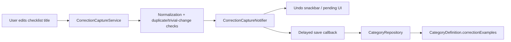
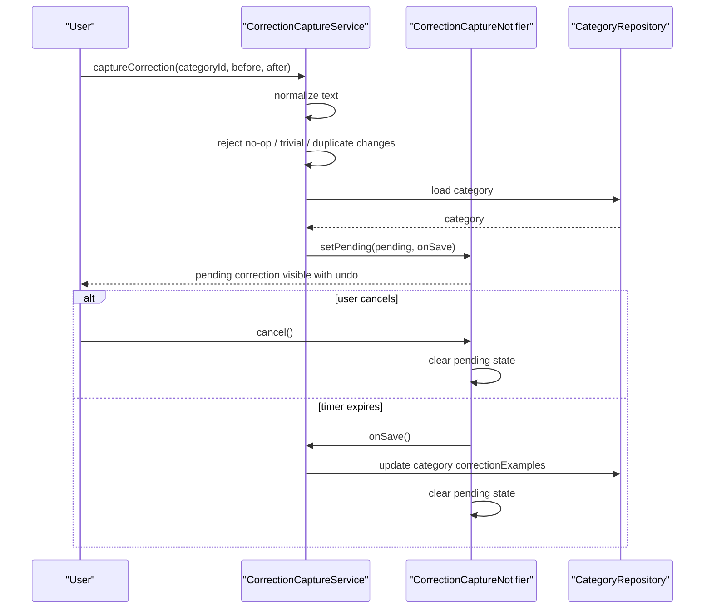
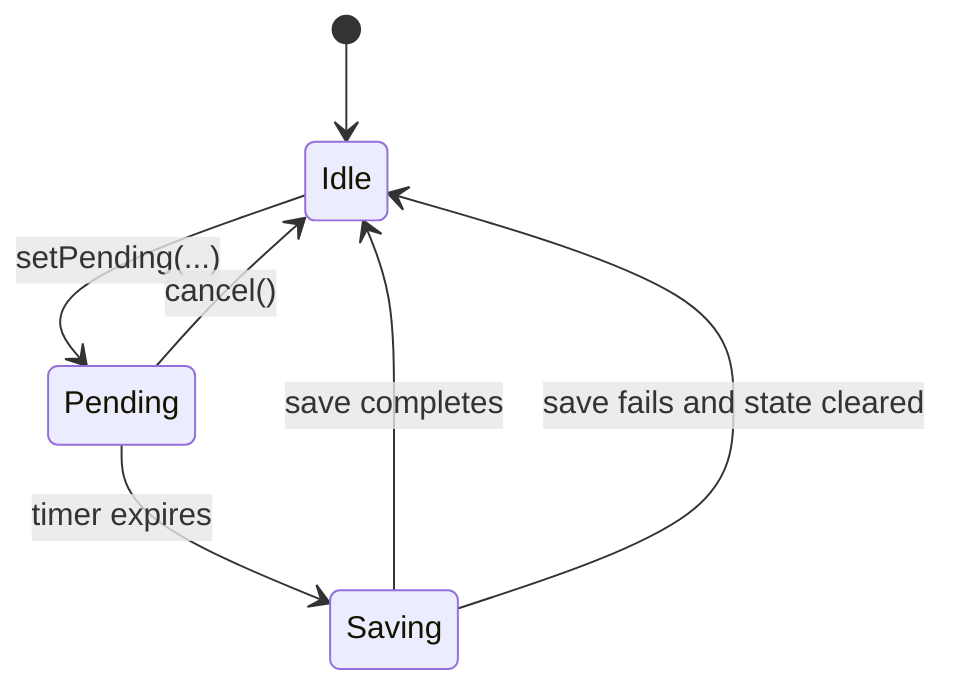

# Checklist Feature

The `checklist` feature is currently a small, focused support feature.

It does not own the checklist UI itself. The visible checklist experience lives under `tasks/`. This feature owns the correction-capture service that learns from user edits to checklist item titles and feeds those corrections back into category-level guidance.

## What This Feature Owns

At runtime, this feature owns:

1. capture of meaningful before/after checklist title corrections
2. delayed-save behavior with undo
3. duplicate and trivial-change filtering
4. persistence of correction examples onto categories

That makes it a learning helper for checklist authoring, not a full checklist subsystem.

## Directory Shape

```text
lib/features/checklist/
└── services/
    └── correction_capture_service.dart
```

## Architecture



The important detail is that the service does not save immediately. It creates a pending correction and gives the user a brief chance to undo it.

## Correction Capture Flow



## Pending-Correction State Machine

This lifecycle is explicit in code.



The save delay is currently `kCorrectionSaveDelay = 5 seconds`.

## What Counts as a Meaningful Correction

`CorrectionCaptureService` deliberately ignores:

- missing category IDs
- changes that normalize to the same text
- trivial edits
- duplicates already stored on the category

That filtering matters because otherwise the feature would happily learn from noise and gradually turn category correction examples into a landfill of whitespace tweaks and accidental taps.

## Persistence Model

Corrections are stored on the category as `ChecklistCorrectionExample` entries. That means the learned correction examples are scoped by category rather than globally across the whole app.

That is a good fit for the problem:

- checklist wording often depends on context
- categories already provide the semantic grouping
- prompt-building layers can later consume category-specific examples

## Relationship to Other Features

- `tasks` owns checklist UI, drag/drop, and item orchestration
- `categories` owns the category entities this feature updates
- `ai` and agentic flows can later consume the stored correction examples as guidance

This feature is intentionally narrow today, but it does a useful job: it turns "the user fixed the wording" into structured signal instead of throwing that knowledge away.
