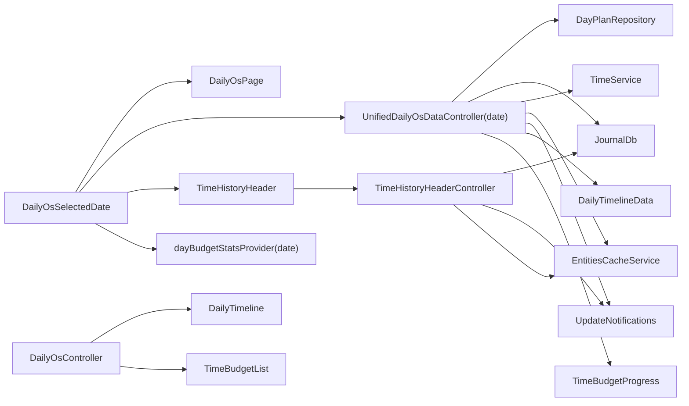
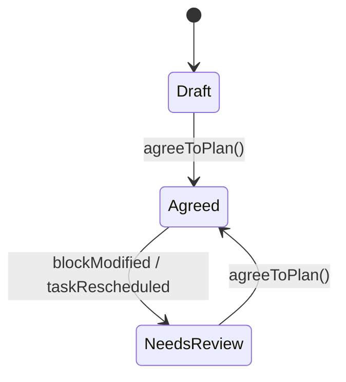
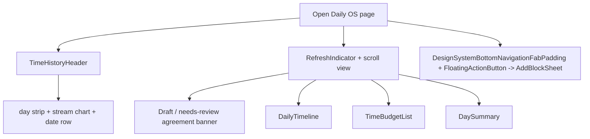
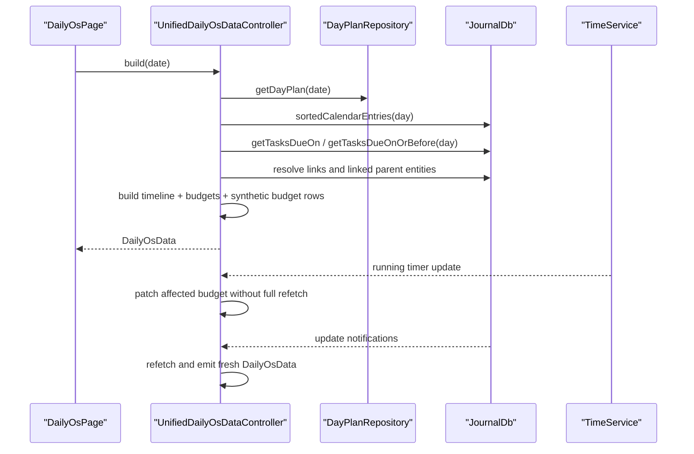
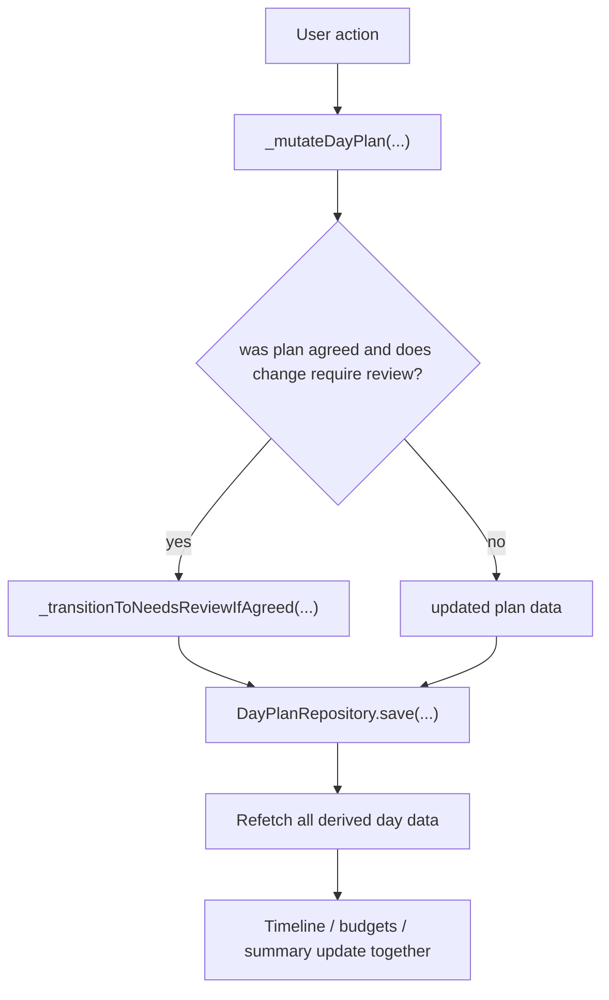
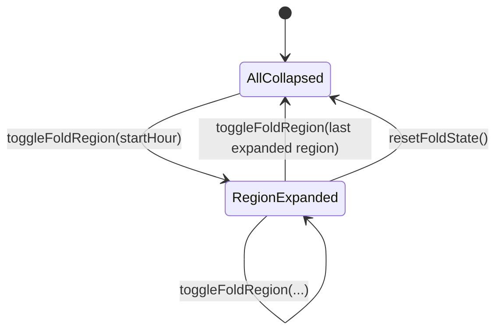
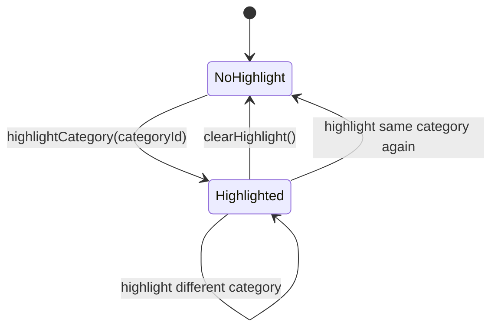

# Daily OS Feature

The `daily_os` feature is Lotti's day-operations workspace.

It combines:

- a day plan
- planned timeline blocks
- actual recorded time
- per-category time budgets
- due-task context
- a day summary

into one screen that answers a practical question: "What is this day supposed to look like, and how is it actually going?"

## What This Feature Owns

At runtime, the feature owns:

1. the selected date plus lightweight Daily OS UI-coordination state
2. lazy day-plan reads and persisted mutations
3. unified day aggregation for timeline, budget cards, and summary stats
4. time-history header aggregation and backward paging
5. per-category task-card view preferences
6. category highlighting, timeline folding, active-focus helpers, and running-timer indicators

It is not just a page. It is a planning-and-feedback layer built on top of tasks, entries, ratings, and categories.

> **Runtime status:** `daily_os` is the original day-operations page and is being
> superseded by the `daily_os_next` feature. The calendar tab root
> (`CalendarRoot` in `lib/beamer/locations/calendar_location.dart`) watches the
> `dailyOsNextEnabledFlag` config flag and renders `DailyOsNextRoot` when it is
> on, falling back to `DailyOsPage` (this feature) when it is off. Treat this
> README as documentation of the current legacy/default path; see
> [`daily_os_next`](../daily_os_next/README.md) for the successor.

## Directory Shape

```text
lib/features/daily_os/
├── repository/
├── state/
├── ui/
│   ├── pages/
│   └── widgets/
├── util/
└── widgetbook/
```

## Architecture



The important split is:

- `UnifiedDailyOsDataController` owns the day's persisted model and derived day data
- `DailyOsController` is a thin UI-coordination layer for highlight and fold behavior
- `DailyOsSelectedDate` stands alone because the page, header, and prefetched day data all key off it directly

That separation matters because the UI does not build its day model by stitching together a pile of small providers. It asks one controller for the day and lets that controller update atomically when something changes.

## Day-Plan Lifecycle

The day plan itself has an explicit status machine in `DayPlanStatus`. The diagram below covers the subset of transitions that Daily OS drives:



Those are real code-backed states:

- `draft`
- `agreed`
- `needsReview`

`DayPlanStatus` defines a fourth state, `committed` (`DayPlanStatusCommitted`), with a documented one-way `Draft -> Committed` transition. That state is driven by the `daily_os_next` day-agent, not by Daily OS, so it is out of scope for the Daily OS mutation paths above.

This matters because the Daily OS page is not just an editor. It has a lightweight commitment model:

- the plan starts as draft
- the user can agree to it
- later changes can invalidate that agreement and mark it for review

`DayPlanReviewReason` also defines `newDueTask` and `manualReset`, but Daily OS's current mutation paths only emit `blockModified` and `taskRescheduled`.

## Daily OS Page Composition



The page is intentionally stacked in that order:

- historical context first
- current-day agreement status
- timeline
- budgets
- summary

That gives the page a clear "past -> plan -> execution" flow instead of making the user hunt for the day model across unrelated panels.

## Unified Data Flow

`UnifiedDailyOsDataController` is the core runtime object here.

It:

- keeps itself alive across navigation
- listens to `UpdateNotifications.updateStream`
- listens to `TimeService` for the currently running timer
- returns a transient empty `DayPlanEntry` when the day has no persisted plan yet
- fetches the day plan, calendar entries, due tasks, entry links, and linked parent entities
- recomputes timeline data, budget progress, and synthetic zero-budget rows together
- refetches after plan mutations so derived state stays consistent



That timer patch path is especially nice: when possible, the controller updates budget progress from the live timer entry instead of performing a full refetch every second.

## Day-Plan Mutation Flow

The controller surface includes mutations such as:

- `agreeToPlan()`
- `markComplete()`
- `setPlannedBlocks(...)`
- `addPlannedBlock(...)`
- `updatePlannedBlock(...)`
- `removePlannedBlock(...)`
- `pinTask(...)`
- `unpinTask(...)`
- `setDayLabel(...)`

Today's page wiring uses `agreeToPlan()` and the planned-block mutation paths directly. `setPlannedBlocks(...)` is the batch planned-block save used by `SetTimeBlocksPage`. The rest are still part of the persisted day-plan API, even if they are not all surfaced from the current page widgets.

All of them eventually go through `_mutateDayPlan(...)` and `_saveDayPlan(...)`.



That "save then refetch derived state" pattern is deliberate. It keeps the UI honest instead of letting different subpanels drift into different interpretations of the same day.

## Daily OS View State

`DailyOsController` is the thin coordination layer that sits on top of `DailyOsSelectedDate` plus the unified day data.

In practice, the behavior that is meaningfully wired today is:

- highlighted category
- expanded fold regions
- derived focus helpers such as `activeFocusCategoryId`
- running-timer category lookup for budget-card indicators

`expandedSection` and `isEditingPlan` still exist in `DailyOsState`, but they are currently more scaffold than core page behavior.

### Daily OS view state machine

There is not one giant monolithic state machine, but there are two real UI-state transitions worth documenting.

#### Timeline fold regions



#### Category highlighting



Those two small pieces are why the page can cross-highlight the same category between timeline and budgets, and compress dead air in the timeline, without introducing a lot of widget-to-widget spaghetti.

## Time History Header

`TimeHistoryHeaderController` builds the data for the multi-day time-history visualization.

It:

- loads an initial ~60-day window centered on today: 30 days back
  (`_initialPastDays`) plus 30 days forward (`_initialFutureDays`)
- aggregates daily time spent by category
- computes stacked heights for rendering
- supports incremental backward loading in 14-day chunks (`_loadMoreDays`); it
  only ever extends the past edge — the window is not "rolling" and never drops
  its leading days
- refreshes on `{textEntryNotification, audioNotification, taskNotification}`
  via a 5-second trailing-throttled stream (skipped while a backward load is in
  flight)

This is a good example of the feature doing real derived-data work rather than just painting raw rows from the database.

## Task View Preferences

`TaskViewPreference` is the notifier that stores a per-category preference for how tasks appear in time-budget cards. The stored value is a `TaskViewMode` enum:

- `list`
- `grid`

That preference is persisted in `SettingsDb` under a category-specific key, which means Daily OS remembers how the user likes each category's task list to look.

## Current Constraints

- day plans are created lazily on first meaningful interaction, not on page open, to avoid unnecessary sync churn and ID conflicts
- the feature depends heavily on correct category and link data, because budgets and timeline grouping are category-centric
- the unified controller creates synthetic zero-budget rows for categories that have due tasks or recorded work but no planned blocks, so the user still sees the work even when the plan is sparse
- some due-task behavior is folded into the unified controller rather than split into a separate service, which keeps the day model coherent but also makes that controller very important

## Relationship to Other Features

- `journal` and `tasks` provide the underlying entries, task metadata, and linked work
- `ratings` are deliberately excluded when resolving a time entry's parent: `RatingEntry` parents are skipped in link resolution and treated as non-navigation targets in the timeline, so they never contribute a category or navigation target to the day model
- `categories` define the buckets that budgets and planned blocks are grouped by
- `user_activity` is used elsewhere to avoid background processing while the user is active; Daily OS itself is mostly a presentation-and-planning layer

If the tasks feature is about individual work units, Daily OS is about the day as a system.
