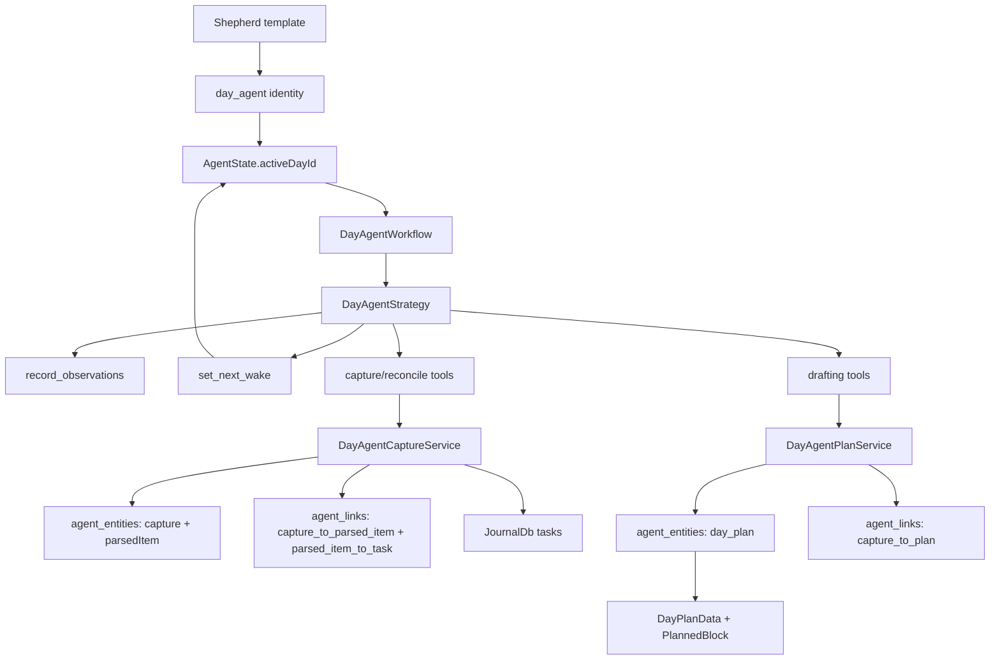
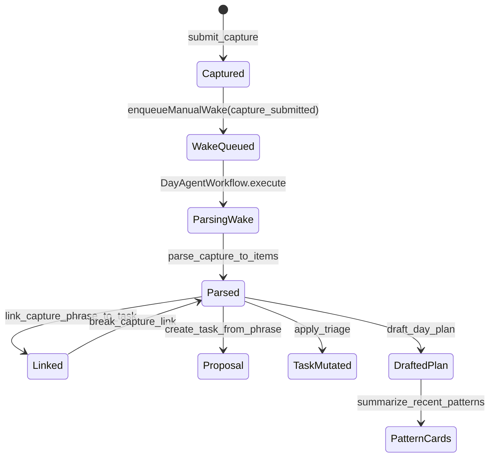

# Daily OS Next

Daily OS Next is the clean-room home for the next Daily OS runtime. New agentic
planning code lives here so it can evolve without depending on the current
`features/daily_os` implementation.

The exception is the shared day-plan aggregate in `lib/classes/day_plan.dart`.
That model is already the durable representation of a day, so Daily OS Next
should extend it instead of creating a second day-plan store. New agent code can
reuse `DayPlanData`, `PlannedBlock`, `PinnedTaskRef`, and `dayPlanId`; it should
not depend on the existing Daily OS UI controllers.

## Agent Runtime

The day-agent layer under `agents/` reuses the shared agent infrastructure from
`features/agents` and adds only the Daily OS Next runtime surface area. The
current backend supports the foundation wake, Capture/Reconcile, and draft
day-plan tool paths; the Flutter UI integration is intentionally separate.

Runtime behavior:

- `DayAgentService` creates one active `day_agent` identity per local calendar
  day.
- `AgentSlots.activeDayId` stores the deterministic day subject ID
  (`dayplan-YYYY-MM-DD`).
- Day-agent lookup is repository-backed by `activeDayId`; the service does not
  hydrate every active day-agent state just to find one calendar day.
- The shared template service seeds the `Shepherd` day-agent template.
- `DayAgentWorkflow` builds the prompt from template directives, recent private
  observations, and, for `capture_submitted:<captureId>` wakes, the submitted
  capture plus a bounded task corpus snapshot.
- `DayAgentStrategy` handles private observations itself and delegates
  `set_next_wake`, Capture/Reconcile tools, and draft plan tools through the
  workflow handler.
- `DayAgentCaptureService` owns direct Capture/Reconcile mutations:
  `submit_capture`, `parse_capture_to_items`, `match_to_corpus`,
  `link_capture_phrase_to_task`, `break_capture_link`,
  `surface_pending_decisions`, `apply_triage`, and
  `create_task_from_phrase`.
- `submit_capture` persists a `CaptureEntity` and enqueues a manual wake with a
  `capture_submitted:<captureId>` trigger token.
- `parse_capture_to_items` persists `ParsedItemEntity` rows and links them to
  the source capture. High-confidence matches (`>= 0.75`) auto-link to tasks,
  medium-confidence matches (`0.5..0.75`) auto-link with `lowConfidence`, and
  low-confidence items stay as new capture items.
- `create_task_from_phrase` writes a pending `ChangeSetEntity` proposal instead
  of directly creating a task.
- `DayAgentPlanService` owns draft plan persistence:
  `draft_day_plan` validates model-emitted blocks, requires a non-empty reason
  for every `PlannedBlockType.ai` block, writes a `DayPlanEntity`, and links it
  back to the source capture when supplied.
- `summarize_recent_patterns` returns transient learning-card payloads from
  recent `DayPlanEntity` rows. It does not persist new state.
- `PlannedBlock` now carries the agent-facing metadata required by the draft
  flow: optional task/title, block origin (`ai`, `cal`, `buffer`, `manual`),
  lifecycle state, and the model's placement reason.
- Wakes consume any `scheduledWakeAt` timestamp that is no longer in the future
  so app restart does not replay an already-fired scheduled wake.
- Future Daily OS Next refine, commit, agenda, and shutdown tools should be
  added under this feature without importing `features/daily_os`.

## Testing Strategy

Pure day-plan and day-agent logic should use Glados property tests whenever an
invariant is easier to state than to cover with examples:

- date normalization and `dayplan-YYYY-MM-DD` identity stability
- Capture/Reconcile confidence threshold classification
- pending-decision dedupe and sort priority
- `DayPlanData` derived durations, category grouping, and JSON round-trips
- draft-plan JSON value objects, required AI block reasons, and positive block
  durations
- future tool validators such as non-overlap rules and commit-state gating
- future diff application/reversion once refine tools produce `ChangeSetEntity`
  proposals

Service and workflow tests should stay deterministic example tests with mocks,
fixed clocks, and no real timers. They should verify transaction boundaries,
wake scheduling, persisted state changes, and tool error paths. Glados belongs
on pure model/validator/diff logic, not on mocked I/O orchestration.
