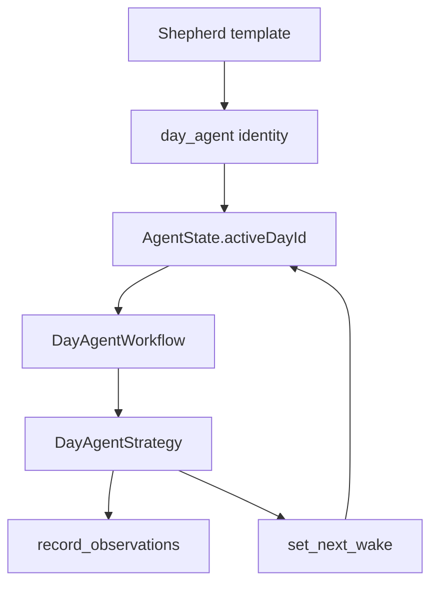

# Daily OS Next

Daily OS Next is the clean-room home for the next Daily OS runtime. New agentic
planning code lives here so it can evolve without depending on the current
`features/daily_os` implementation.

The exception is the shared day-plan aggregate in `lib/classes/day_plan.dart`.
That model is already the durable representation of a day, so Daily OS Next
should extend it instead of creating a second day-plan store. New agent code can
reuse `DayPlanData`, `PlannedBlock`, `PinnedTaskRef`, and `dayPlanId`; it should
not depend on the existing Daily OS UI controllers.

## Agent Foundation

The first slice is the day-agent layer under `agents/`. It reuses the shared
agent infrastructure from `features/agents` and adds only the Daily OS Next
surface area:

Runtime behavior:

- `DayAgentService` creates one active `day_agent` identity per local calendar
  day.
- `AgentSlots.activeDayId` stores the deterministic day subject ID
  (`dayplan-YYYY-MM-DD`).
- The shared template service seeds the `Shepherd` day-agent template.
- `DayAgentWorkflow` runs the foundation wake with only private observations
  and self-scheduled wakes enabled.
- Future Daily OS Next planning, reconcile, refine, commit, and shutdown tools
  should be added under this feature without importing `features/daily_os`.

## Testing Strategy

Pure day-plan and day-agent logic should use Glados property tests whenever an
invariant is easier to state than to cover with examples:

- date normalization and `dayplan-YYYY-MM-DD` identity stability
- `DayPlanData` derived durations, category grouping, and JSON round-trips
- future tool validators such as required AI block reasons, positive block
  durations, non-overlap rules, and commit-state gating
- future diff application/reversion once refine tools produce `ChangeSetEntity`
  proposals

Service and workflow tests should stay deterministic example tests with mocks,
fixed clocks, and no real timers. They should verify transaction boundaries,
wake scheduling, persisted state changes, and tool error paths. Glados belongs
on pure model/validator/diff logic, not on mocked I/O orchestration.
