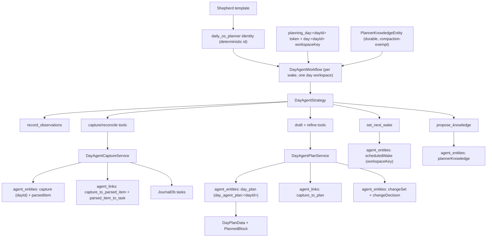
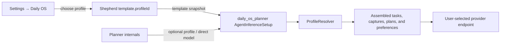
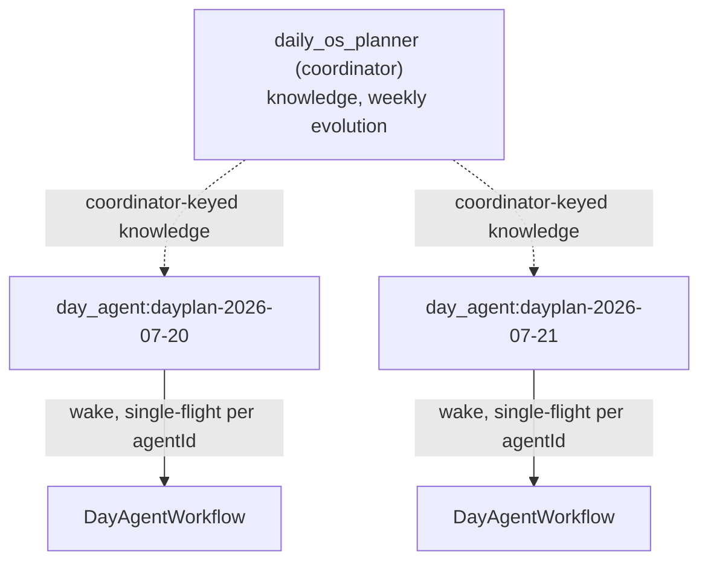
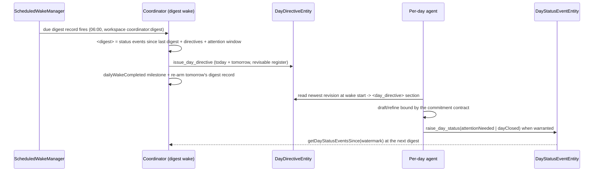
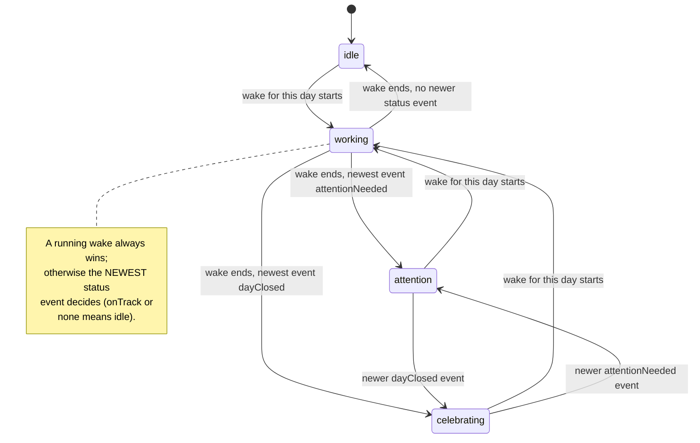
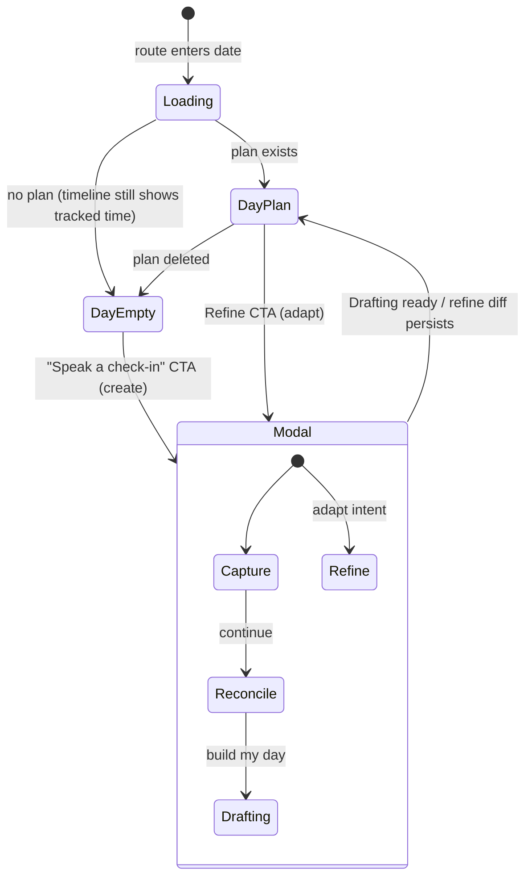
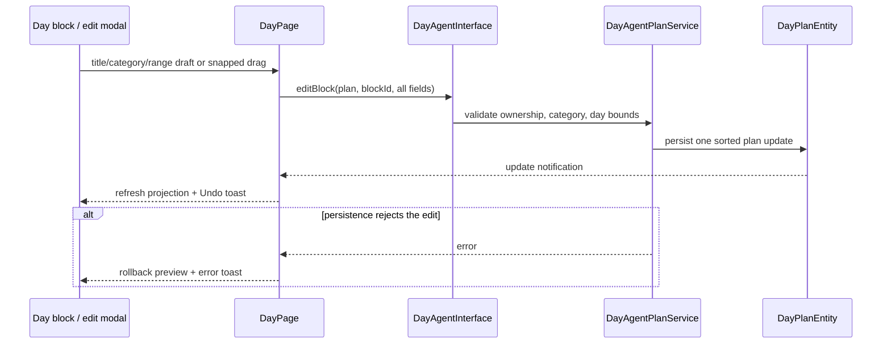
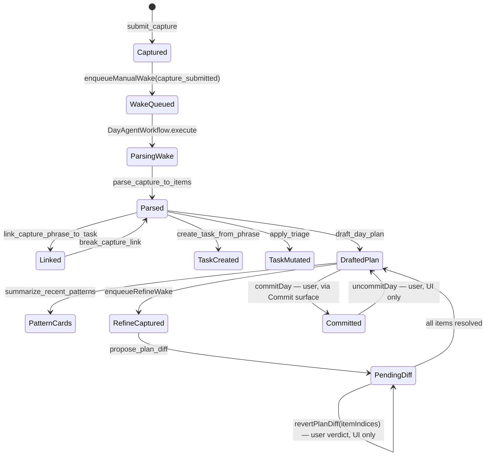
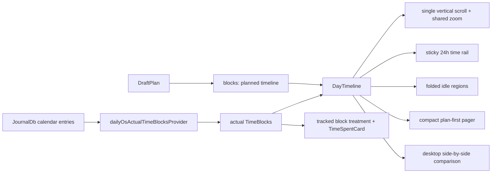
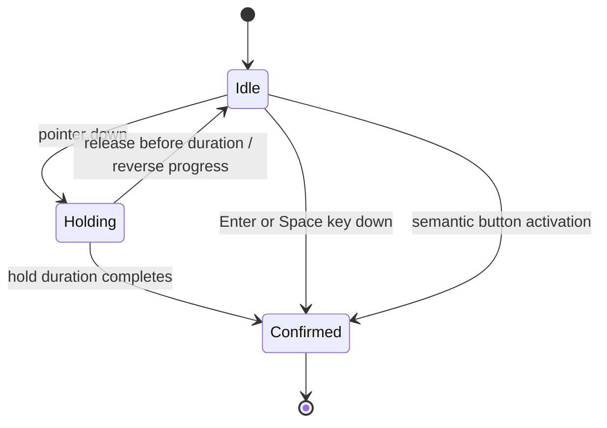

# Daily OS Next

Daily OS Next is the home of the Daily OS runtime and the only Daily OS
surface: `CalendarRoot` (the `/calendar` tab root in `CalendarLocation`)
mounts `DailyOsNextRoot` directly. The legacy `features/daily_os`
implementation has been removed.

The exception is the shared day-plan aggregate in `lib/classes/day_plan.dart`.
That model is already the durable representation of a day, so Daily OS Next
should extend it instead of creating a second day-plan store. New agent code can
reuse `DayPlanData`, `PlannedBlock`, `PinnedTaskRef`, and `dayPlanId`; it should
not depend on the existing Daily OS UI controllers.

## Agent Runtime

The day-agent layer under `agents/` reuses the shared agent infrastructure from
`features/agents` and adds only the Daily OS Next runtime surface area. It
supports the foundation wake, Capture/Reconcile, draft day-plan, refine, and
durable-knowledge tool paths; the Flutter UI integration is intentionally
separate.

### One long-lived planner, explicit day workspaces (ADR 0022)

This section covers the coordinator's own lifecycle (creation, migration,
inference-setup inheritance) — unchanged and still current. For day
*resolution* specifically (which identity a given date wakes/reads under),
this section describes the pre-ADR-0032 model; see "Per-day agents and
durable draft/refine jobs (ADR 0032)" below for the resolver actually in
effect today, which supersedes the "resolves the same planner regardless of
date" claim further down in this section.

The runtime has **one durable coordinator identity** —
`daily_os_planner` (`dailyOsPlannerAgentId`) — that owns cross-day learning
and every day predating the ADR 0032 per-day cutover (see next section). The
planner learns across days; a day it owns is an explicit **workspace**, not a
separate mind. This is the model defined by ADR 0022 (Accepted) and replaced
the pre-0022 per-day `day_agent` identity model (the `kind` string stays
`day_agent` for storage compatibility). ADR 0032 amends this again for new
days: the coordinator stays the sole learning substrate, but new days each get
their own `day_agent:<dayId>` identity sharing the same kind and workflow.



Runtime behavior:

- `DayAgentService.getOrCreatePlannerAgent()` is the single creation entry
  point. It mints the planner under the **deterministic** id
  `daily_os_planner` (via `AgentService.createAgent(agentId: ...)`), so two
  devices that independently create it converge through LWW instead of
  diverging into two identities. It is idempotent — a second call returns the
  existing planner. Under ADR 0022 alone, `getDayAgentForDate(date)` resolved
  the same planner regardless of date (it did not key on any day slot); ADR
  0032 changed this for day resolution specifically — see below.
- The planner pins **no** `activeDayId` slot and writes **no** per-day
  `agent_day` link. A wake's day is carried explicitly by its trigger tokens
  (`planning_day:<dayId>`, plus the mode tokens `drafting:` / `refine:` and
  `capture_submitted:`) and a `day:<dayId>` workspace key on the queued
  `WakeJob`; `DayAgentWorkflow` resolves the day strictly from that context and
  fails the wake when no day can be resolved (no slot fallback).
- `dayAgentIdForDate(date)` (→ `dayplan-YYYY-MM-DD`) is now a **workspace id**,
  not an identity. The `dayplan-YYYY-MM-DD` string is still reused across
  storage namespaces without colliding: the legacy Daily OS `DayPlanEntry.id`
  (journal row), the `planning_day:` workspace token, `CaptureEntity.dayId`,
  and `DayPlanEntity.dayId`. The drafted plan is stored under
  `day_agent_plan:<dayId>` so the agent draft never overwrites the journal row,
  and the `agentId` discriminator separates the planner identity from the plan.
- **Legacy migration** runs on **every** `getOrCreatePlannerAgent` resolve
  (idempotent, best-effort), not only first creation: a legacy `day_agent` that
  syncs in from another device after the planner exists, or one stranded by an
  interrupted first pass, still converges; after the first successful pass the
  active-`day_agent` query is empty and it returns immediately. Every other
  active `day_agent` identity is archived (lifecycle → dormant, its
  `scheduledWakeAt` cleared so it is never re-woken or restored), and its recent
  (≤14-day) `dayPlan` / `capture` / `parsedItem` / `changeSet` entities are
  re-parented to the planner id via normal synced upserts so pre-flip plans
  stay visible. Each legacy agent is migrated under its own try/catch, so one
  failure neither blocks planner creation nor stops the others.
- The shared template service seeds the `Shepherd` day-agent template.
- Daily OS inference settings are split across two synced ownership levels.
  The `Shepherd` template's `profileId` is the general default; the
  `daily_os_planner` identity's typed `AgentInferenceSetup` is the optional
  instance override. `DayAgentService.updateDefaultInferenceProfile` updates
  an existing planner only while it still follows a `templateSnapshot`, so a
  later default change never replaces a user-owned profile or direct model
  override. Clearing the override copies the current template profile back
  into the planner as a new template snapshot.



The settings page lists every configured compatible profile/provider route; it
does not maintain a provider denylist. The selected endpoint determines the
privacy boundary. Daily OS **sends** its assembled planning context to that
provider for processing. Loopback and embedded endpoints are described as
on-device; every other configured endpoint is described as remote with its
provider and host. The Day surface links to these settings from its overflow
menu, blocks a new check-in when no route resolves, and shows a non-blocking
preferred-name prompt when inference is ready but personalization is missing.
- `DayAgentWorkflow` builds the prompt from template directives, the planner's
  durable knowledge (a compact always-on **hook index** plus scoped full
  statements), recent private observations, the day's `day_log`, and — for
  `capture_submitted:<captureId>` wakes — the submitted capture plus a bounded
  task corpus snapshot.
- **The user message is tagged plaintext, not a JSON document.** The payload is
  a set of `<snake_case>` sections (`day_agent_prompt_sections.dart`) rather
  than one `jsonEncode`d map: tags keep JSON's named sections and boundary
  integrity while letting **prose** sections (`day_log`, `knowledge_index`,
  `knowledge_statements`, `recent_days`/`week_ahead`, scalars) carry real
  newlines — which weak local models read far better than newline-escaped
  run-on strings. **Data-shaped, tool-facing** sections stay JSON *inside* their
  tags (`attention_planning`, `capture`, `drafting`, `refine`,
  `recent_observations`, `trigger_tokens`) so the model can copy ids verbatim
  into tool calls. Every interpolation — including the JSON-kept sections, since
  `jsonEncode` does not escape `<`/`>` — runs through a shared sanitizer that
  neutralizes forged tag boundaries; single-line interpolations additionally
  collapse whitespace so a multi-line value cannot fabricate a section.
- Sections are ordered **stable → volatile** so the cacheable prompt prefix is
  maximised for local KV-cache / prefix-cache reuse. The two knowledge tiers are
  split by stability: the always-on `knowledge_index` (global, slow-changing)
  leads the prefix *before* the large `day_log`, while the scope-filtered
  `knowledge_statements` vary by which scopes the wake touches (capture vs
  drafting vs refine) and therefore trail the `day_log`/`attention_planning` — a
  changing statement set must never evict the much larger `day_log` prefix
  behind it. Net order: `day_id`, `plan_date`, `knowledge_index`, `day_log`,
  `attention_planning`, `knowledge_statements`, `recent_days`, `week_ahead`
  (the today-so-far line churns with tracked time, so week context trails the
  knowledge statements), the per-wake mode section, then
  `recent_observations`, `trigger_tokens`, and `current_local_time` last.
  `current_local_time` lets same-day drafting distinguish future plan slots from
  time that has already passed.
- **v2 prompt-record splice (ADR 0020).** Once the read flips to the compacted
  `day_log`, the whole `<day_log>…</day_log>` section is a pure function of the
  synced event log, so the persisted wake record stores only the non-derivable
  head/tail around it (`day-log-section` wrap) and `WakePromptReconstructor`
  re-renders the section on demand for the history UI. Records persisted before
  the tagged-plaintext conversion used a `json-day-log-line` wrap and stay
  decodable.
- `DayAgentStrategy` handles private observations itself and delegates
  `set_next_wake`, `search_memory`, the knowledge tool (`propose_knowledge`),
  Capture/Reconcile tools, draft plan tools, refine tools, and the week-context
  tool (`write_day_summary`) through the workflow handler.

### Per-day agents and durable draft/refine jobs (ADR 0032)

ADR 0032 splits the single planner into a **coordinator** (`daily_os_planner`,
unchanged: cross-day learning, durable knowledge, weekly evolution) and one
**per-day agent** (`day_agent:<dayId>`) per day going forward. Both roles run
under the identical `AgentKinds.dayAgent` kind and `DayAgentWorkflow`; they are
distinguished only by id shape (`lib/features/daily_os_next/agents/domain/day_agent_identity.dart`:
`perDayAgentId`, `isPerDayAgentId`, `isDailyOsDayOwner`).



- **Day-forward cutover, no migration.** `DayAgentService.getOrCreateDayAgentForDate(date)`
  creates a `day_agent:<dayId>` identity lazily on the first write for a day
  (capture submit, draft, refine) — but only when the coordinator does not
  already own that day. Ownership is a cheap probe: a non-deleted
  `day_agent_plan:<dayId>` written by the coordinator, or any coordinator
  capture whose `dayId` matches. If either is true, the coordinator keeps the
  day permanently — there is no seeding/re-parenting of old data onto the new
  identity. `getDayAgentForDate(date)` is the read-only counterpart: per-day
  identity if one exists, else the coordinator, else `null`.
- **Two concurrent wakes, for free.** `WakeRunner` is single-flight *per
  agentId*; distinct day-agent ids therefore run concurrent wakes under the
  orchestrator's existing bounded drain (device concurrency 1–8) with no new
  code. The per-day agent's log is native-scoped — its `CaptureEntity`/
  observation history is exactly that day's, so ADR 0016's projection fold
  never grows with app age the way the coordinator's used to.
- **Knowledge stays coordinator-keyed.** A per-day wake reads durable
  knowledge (`knowledge_index`/`knowledge_statements`) under
  `dailyOsPlannerAgentId`, not its own id — "coordinator-published," per the
  ADR — and any `propose_knowledge` tool call from a per-day wake persists
  under the coordinator id too, so proposals land in the coordinator's weekly
  confirm loop instead of being stranded per-day.
- **Week lookback spans owners.** `DayAgentWeekContextService.buildForDay`
  accepts `<recent_days>`/`<week_ahead>` plan and summary rows from any
  `isDailyOsDayOwner` agent (coordinator or per-day), since neighboring days
  in the same week can be owned by different identities across the cutover.
- **UI keying.** `dayAgentIsRunningProvider(date)` (state/day_agent_provider.dart)
  is true while either the per-day agent for that date or the coordinator is
  running — covers both post-cutover days (per-day wakes) and pre-cutover
  days (still under the coordinator) with one provider. Reconcile's running
  indicator, the drafting/refine action-bar shader, and `capturesForDateProvider`
  (which unions captures from the resolved owner and the coordinator, deduped
  by id, to stay correct across an offline peer syncing in a pre-cutover
  capture after the day-agent exists) all key off this.
- **Not yet implemented:** the `DayDirectiveEntity`/`DayStatusEvent`
  coordinator↔day-agent protocol (ADR 0032 phase 3) and dormancy for closed
  days (no day-close lifecycle exists yet). See the ADR's Amendments section
  for the full list of where implementation diverged from the original text.

**Durable `draftPlan`/`refinePlan` jobs replace in-memory polling (phase 1).**
`RealDayAgent.draftDayPlan`/`proposePlanDiff` used to poll `draftPlanForDay`/
`pendingPlanDiffsForDay` on a timer after firing a wake directly — a process
kill between enqueue and drain lost the request outright, and the UI's only
progress signal was silence until a 60 s timeout. Both now go through the same
device-local processing outbox that transcription uses (`services/day_processing_job.dart`,
`day_processing_outbox_repository.dart`): `DayProcessingJobKind` gained
`parseCapture` / `draftPlan` / `refinePlan` alongside `transcribeAudio`, behind
a sealed `DayProcessingPayload` per kind (`TranscribeAudioPayload`,
`ParseCapturePayload`, `DraftPlanPayload`, `RefinePlanPayload`).

```mermaid
sequenceDiagram
  participant UI as RealDayAgent
  participant Outbox as DayProcessingOutboxRepository
  participant Runtime as DayProcessingRuntime
  participant Executor as DayAgentJobExecutor
  participant Wake as WakeOrchestrator

  UI->>Outbox: enqueueDraftPlan(dayId, payload) / enqueueRefinePlan(...)
  UI->>Runtime: nudge()
  Runtime->>Executor: drain agent-job lane -> claim job
  Executor->>Executor: artifact pre-check (idempotent re-claim)
  Executor->>Wake: enqueueManualWake(resolved agentId, tokens)
  Wake-->>Executor: runCompletions event (completed/failed/aborted)
  Executor->>Outbox: markSucceeded(resultEntityId) / markFailure(class)
  Outbox-->>UI: changes stream fires
  UI->>UI: _awaitJobTerminal resolves; project plan/diff
```

- **`DayAgentJobExecutor`** (`services/day_agent_job_executor.dart`) resolves
  the target agent at *execution* time (never persisted on the job, so
  ownership can change between enqueue and drain without breaking anything),
  runs an artifact pre-check before spending any tokens (idempotency: a
  re-claim after a crash sees the already-written plan/diff and succeeds
  without re-inferring), enqueues the wake, and awaits
  `WakeOrchestrator.runCompletions` — a new broadcast stream of
  `WakeRunCompletion { runKey, agentId, status, error }` emitted at every wake
  finalization point (completed/failed/aborted/no-executor). A refine job
  behind an in-flight draft defers with a short retry rather than racing it.
  `classifyDayAgentJobFailure` maps the workflow's forced-tool-retry
  exceptions to `providerBusy` (worth one more attempt) and caps retries
  (`maxAttempts`, default 5) by downgrading to `deterministic` — unlike
  transcription's free backoff, every agent retry spends model tokens.
- **Two independent drain lanes.** `DayProcessingRuntime`'s composed `drain`
  runs `processor.drain(kinds: {transcribeAudio})` and
  `processor.drain(kinds: dayAgentJobKinds)` concurrently
  (`state/day_processing_runtime_provider.dart`), so a slow agent wake never
  blocks the transcription lane or vice versa.
- **Coalescing differs per kind.** `draftJobId(dayId)` is deterministic and
  **re-armable**: a repeated "draft my day" request re-arms a terminal job
  with a fresh `requestedAt`/payload, or attaches to an already-`running` job
  as-is. `refine_<dayId>_<suffix>` jobs are **never coalesced** — each refine
  carries distinct user input and produces its own ChangeSet. `parseJobId(captureId)`
  is deterministic (one job per capture): a queued/running job attaches, and
  a stuck (`failed`/`waitingForUser`/`waitingForNetwork`) or terminal job is
  re-armed with fresh attempts. `DayAgentCaptureService.submitCapture` and
  `retryCapture` enqueue through it (`outbox.enqueueParseCapture` + a
  deferred runtime nudge) instead of firing a volatile wake directly — the
  executor enqueues the actual wake when the job runs, so a process kill
  between capture submit and parse no longer loses the parse.
- **`RealDayAgent._awaitJobTerminal`** subscribes to the outbox's `changes`
  stream (event-driven, not a poll) and races only a periodic
  cancellation/soft-cap check (1 s tick, 10 min soft cap) against it — never a
  fixed-interval re-read of job state. A caller's `isCancelled` firing (e.g.
  the controller disposes) leaves the durable job running; a fresh request
  for the same day re-enqueues, which coalesces onto (draft) or attaches to
  (refine) the still-live job, so the eventual result is not lost. `failed`
  and `waitingForUser` end the wait (need explicit user action); `waitingForNetwork`
  is left waiting through, since the outbox retries it automatically.

**Directive + status protocol (phase 3).** The coordinator and per-day agents
coordinate through two durable, synced entities — no RPC (ADR 0016/0018/0019):



- **Downward — `DayDirectiveEntity`** (`day_directive:<dayId>`): one revisable
  register per day, coordinator-authored only (`DayAgentDirectiveService`
  rejects other issuers; the tool is only *offered* on coordinator wakes).
  Carries distilled commitments (source, window, minutes, evidence refs), a
  capacity budget (available/already-scheduled minutes + energy bands),
  carry-over items, bounded constraints and attention notes — never
  transcripts. Bounded by validation: ≤12 commitments/carry-over, ≤8
  notes/constraints, 280-char strings, windows inside the day. Revisions
  upsert the deterministic id with a fresh `directiveRevisionId` (LWW,
  `createdAt` preserved). The per-day wake reads it by PK — no projection
  table — and renders `<day_directive>` in the byte-stable prompt prefix
  (after `<knowledge_index>`). The drafting contract makes it **binding**:
  every commitment is placed, traded away in a diff naming the collision, or
  escalated via `raise_day_status` with `status: attentionNeeded` and
  `directiveUnsatisfiable` among its `reasons` (the tool also requires the
  wake's own `dayId`); requested minutes
  reconcile against the capacity budget before drafting.
- **Upward — `DayStatusEventEntity`** (`day_status:<dayId>:<uuid>`):
  append-only typed events (`onTrack | attentionNeeded(reasons) |
  dayClosed`; reasons `overCommitted | directiveUnsatisfiable |
  userDivergence | processingBlocked`). `raise_day_status` may only target
  the wake's own day (`wakeDayId` threaded through the tool dispatch), caps
  at one event per wake (per-`runKey` guard), requires typed reasons with
  `attentionNeeded`, and bounds notes at 500 chars. A new entity variant —
  not an `AgentMessageKind` — so status stays out of the compaction fold and
  scans via the type/subtype index (`getDayStatusEventsSince`, cross-agent,
  oldest-first, served by `idx_agent_entities_active_type_created`).
- **The digest wake** is the coordinator's consumption point: a
  `digest:<dayId>` token wake on the `coordinator:digest` workspace (its own
  lane — never coalesces with day work) assembles `<digest>` with status
  events since the last digest (watermark = newest `dailyWakeCompleted`
  milestone, 48h fallback), today's + tomorrow's current directives, and the
  two-day attention window. Digest rules: react by revising directives —
  never by drafting plans. Completion writes the watermark milestone and
  deterministically re-arms tomorrow's digest record;
  `DayAgentService.restoreSubscriptions` bootstraps the first record (and
  recovers a missed re-arm) whenever the coordinator identity is active.
- **The other two upward channels already existed**: day summaries
  (`write_day_summary` → `<recent_days>`) carry the distilled narrative, and
  `propose_knowledge` is coordinator-keyed even on per-day wakes, so durable
  learnings land in the coordinator's confirm loop directly.

**Visibility + persona (phases 4–5).** The Day page header shows a
`DayAgentStatusChip` when the day's agent has something to say: `working`
(a wake for this day is executing), `attention` (newest status event is
`attentionNeeded`), or `celebrating` (`dayClosed`) — idle renders nothing.


The chip's tooltip adds the per-day token spend for per-day identities
(coordinator-owned days show none: the coordinator's lifetime aggregate
would misattribute other days), and tapping it opens the agent internals —
same destination as the header menu's existing "Inspect agent" entry. Both
facts come from `state/day_agent_persona_provider.dart`:
`dayAgentPersonaStateProvider` (the ADR §7 persona contract the character
animation binds to when it lands) and `dayAgentTokenSpendProvider`
(`getTokenUsageForAgent` by agent id — no new storage). Settings › Agents
already filters/groups day agents via the Type axis.

### Week Context & Day Summaries (ADR 0028)

- **Facts vs testimony.** `<recent_days>` renders one paragraph per day over a
  rolling last-7-days lookback plus the plan date: facts first — deterministic,
  template-rendered planned-vs-recorded minutes per category (integer-tenths
  arithmetic, never doubles), named block-level misses, plan status, total —
  then the agent's own contemporaneous day summary as an `Agent note:` line.
  Facts come exclusively from entities; the note is testimony rendered adjacent
  for self-auditing, and on contradiction the facts line wins. `<week_ahead>`
  carries future days `[planDate+1 .. planDate+5]` that have plans plus claim
  deadlines within `[today, today+5)`. All wording lives in ONE renderer
  (`agents/domain/week_context.dart`); the service
  (`agents/service/day_agent_week_context_service.dart`) assembles inputs —
  one chunked `getEntitiesByIds` for the 21 deterministic plan/summary ids,
  recorded spans via the shared `logic/recorded_time.dart` core over an
  end-of-day-bounded calendar query, claims by visibility window — and is
  fail-soft (a load error logs and the wake proceeds without the sections).
- **Wall-clock day classification.** `today := localDay(clock.now())`, not the
  wake's workspace day: past days render "Missed:", today renders
  "(today so far)" / "Still planned:", days after today render "(upcoming)" —
  never "Missed:" and never fake "Nothing recorded." rest-day lines for days
  that have not happened (drafting-tomorrow wakes see tomorrow as upcoming).
- **`write_day_summary`** persists `AgentDomainEntity.daySummary`
  (`day_agent_summary:<dayId>`) — a keyed mutable register, upserted in place
  within its window (preserving `createdAt`), windowed to the wall clock:
  today or yesterday only, independent of the wake workspace (the sole,
  ADR-governed exception to the workspace-day tool guard — dispatched before
  the blanket dayId rejection). Text is whitespace-normalized and capped at
  500 chars at the write path. Concurrent versions resolve earliest-createdAt
  wins (the most contemporaneous testimony is canonical).
- **Channel partition.** `write_day_summary` is the sole channel for day
  retrospectives; `record_observations` is forward-looking learnings only —
  never day recaps (seeded directive, 2026-06-10).
- **Caps.** Max 6 categories per day (by `max(planned, recorded)`), 5 named
  misses/still-planned items, 10 deadline lines — each truncation renders a
  deterministic overflow marker (`+N more (X.Xh).` / `+N more missed.` /
  `+N more planned.` / `+N more.`).
- **Cost gating.** Week context builds only on wakes whose day came from
  day-carrying tokens (planning-day / drafting / refine / scheduled);
  capture-submitted wakes skip the 8-day journal+links+claims load.
- `search_memory` is the planner's recall + memory-linking tool, handled by the
  workflow itself (`DayAgentWorkflow._searchMemory` over `AgentLogCompactor`).
  With `query` it keyword-scans the **full** immutable capture-and-observation
  log — including detail folded out of the current summary — newest-first and
  bounded (`searchLog`); with `ids` it pulls up specific entries (`resolveByIds`,
  the "follow a link" path). Recall is lazy: the per-wake assembly resolves only
  the tail, and `search_memory` is the one reader that scans beyond it, and only
  when the agent explicitly recalls.
- **Author-time memory links (convergence-safe A-MEM, Phase 0).** Notes the
  agent writes (observations, knowledge) may cite a related entry inline as
  `[[relation:id]]` — `refines` / `supersedes` / `contradicts` / `relates`
  (`lib/features/agents/memory/memory_links.dart`). The token is plain content
  of an append-only entry, so it never mutates history, never touches the cached
  prompt prefix, and stays convergent because the cited id is the synced entity
  id. `search_memory` resolves each hit's outgoing links — validating existence
  (a hallucinated id renders as `(not found)`, never followed; a non-`supersedes`
  link to a superseded entry forward-follows to the live version, rendered
  `relation:old → live`) — and flags an entry that a newer note supersedes,
  giving the agent a navigable, append-only memory graph without an explicit
  edge store or any in-place rewrite. Validation is widened with the planner's
  durable-knowledge keys (passed as `extraKnownIds`), so a cross-tier link to a
  knowledge entry — e.g. a **Map of Content** keyed `moc-<topic>` whose statement
  curates `[[relates:id]]` links to a topic's entries — resolves rather than
  reading as dead. The system prompt fosters the Zettelkasten habits this
  enables: atomic, keyword-led notes; superseding rather than overwriting;
  distilling captures into linked permanent observations; maintaining MOCs; and
  actually following links via `search_memory(ids:)`. See ADR 0026 and
  `docs/implementation_plans/2026-06-08_convergence_safe_a_mem.md`.
- `DayAgentCaptureService` owns direct Capture/Reconcile mutations:
  `submit_capture`, `parse_capture_to_items`, `match_to_corpus`,
  `link_capture_phrase_to_task`, `break_capture_link`,
  `surface_pending_decisions`, `apply_triage`, and
  `create_task_from_phrase`. `apply_triage` and `create_task_from_phrase`
  both enforce the planner identity's category allow-list: the planner
  cannot close, re-date, or create tasks outside its configured categories.
- `submit_capture` persists a `CaptureEntity` and enqueues a manual wake with a
  `capture_submitted:<captureId>` trigger token. The caller supplies the
  selected planning day independently of the recording timestamp, so reusing a
  retained check-in from a past or future Day Activity view cannot enqueue work
  into the wrong workspace.
- The selected local plan date lives in `dailyOsNextSelectedDateProvider`
  (`state/selected_date_provider.dart`); `DailyOsNextRoot` watches it and keeps
  the date strip visible on the Day surface, while the desktop sidebar's month
  calendar (shown beneath the active Daily OS nav row) drives the same provider.
  `DailyOsNextRoot` always renders `DayPage` for the selected date — the real
  plan when one exists, otherwise the empty Day surface. The
  Capture → Reconcile → Drafting ritual runs inside a full-height
  **day-planning modal** (`showDayPlanningModal`,
  `ui/pages/day_planning_modal.dart`), a Wolt multi-page sheet pushed on the
  root navigator — a full-height bottom sheet on phones (covering the bottom
  nav) and a right-anchored full-height **side panel** on wide screens
  (`SizedWoltSideSheetType`, 45% of the window clamped to 480–720 px), so the
  day surface stays visible beside the conversation. The modal is opened from
  the empty surface's footer CTA (`DayPlanningCreate`) and from the Day
  surface's Refine CTA (`DayPlanningAdapt`). Each step submits against the selected date for
  day-agent routing; on create the Drafting step closes the whole modal once
  the plan is ready and invalidates `currentDraftPlanProvider` so the root
  re-renders the new plan. Background agent or sync updates reload the current
  plan stale-while-revalidate: the root keeps rendering the last Day surface
  while the provider re-fetches, and only shows the loading shell for the
  initial route load. The same Riverpod contract applies inside the modal's
  Reconcile and Drafting steps, Shutdown, and the Day captures panel: if an
  `AsyncValue` still has a previous value, the UI renders that value instead of
  replacing the section or page with a spinner.
- The root surface is identical on every no-plan day (design handoff v2,
  item 2): `DailyOsNextRoot` mounts `DayPage` in **empty mode**
  (`hasPlan: false` with a synthetic `DraftPlan.emptyForDay`) so any recorded
  sessions stay visible in Activity's `TimeSpentCard` without creating a plan
  first. Empty
  mode renders an honest "No plan yet" stat strip (neutral `CapacityDonut` over
  tracked minutes, tracked legend), swaps the Refine/Commit footer for a single
  "Speak a check-in" CTA that opens the day-planning modal, and hides the
  delete-plan menu entry. The modal's Capture step still shows the "Today so
  far" `TimeSpentCard` for the day's tracked time, fed by
  `dailyOsActualTimeBlocksProvider`.



- The "Today so far" tracked-time block is one shared widget,
  `TimeSpentCard` (design handoff v2, item 1): calm eyebrow + right-aligned
  mono summary (`4h 35m · 3 done`), one row per recorded session (category
  dot, truncating title, mono clock range, green check when done), bounded to
  3 rows on desktop / 2 on mobile with a ghost "N earlier sessions" expander
  that keeps the most recent sessions visible. Capture pins it at the top of
  its column (with a date-neutral title for non-today dates); the Agenda tab
  reuses it as the empty-state body under a dashed "No plan yet" hint card.
- Agenda items and Day blocks always show the task-linked vs standalone
  distinction (design handoff v2, item 3): task-linked rows carry a blue
  `LinkBadge` and task-linked Day blocks prefix an info-blue link icon;
  standalone rows carry the neutral `StandaloneTag` ("Time block"). Both
  projections resolve task identity through the lightweight
  `liveTaskMetadataProvider`. It subscribes to task and category database
  notifications, re-fetches the task plus its current category directly from
  `JournalDb`, and overlays the live title/category name/category color on the
  stored day-plan snapshot. A task rename, category reassignment, or category
  name/color edit therefore reaches the visible Agenda and timeline on the
  next frame; a missing task renders the localized missing-entry title while
  category metadata falls back to the persisted plan snapshot.
- Standalone titles remain click-to-edit through `EditableTitle` (pencil
  reveals on hover, Enter/blur saves, Esc cancels). Every editable planned
  block also carries an explicit edit icon that opens `DayBlockEditModal`, a
  responsive Wolt multi-page editor built from design-system form sections,
  inputs, buttons, and the shared glass footer. Standalone blocks can change
  title, category, and time atomically. Its picker uses the same strict
  `filterDayPlanCategories` universe as Capture, and the persistence boundary
  revalidates that opt-in before writing. Task-linked title/category fields are
  read-only because the task is their source of truth, and the modal submits
  no identity fields for those blocks; it offers `Open task`, while Start & end
  remains editable. The time subpage reuses the public `EntryDateTimeEditor`
  and modal sizing contract from time-recording entries.
- The timeline toolbar's Arrange action expands folded regions and enables
  direct manipulation on planned non-calendar blocks: drag the body to move,
  or drag the top/bottom handles to resize. Preview motion is optimistic and
  snaps to fifteen-minute increments within the plan day. The final range is
  persisted through the same atomic `editBlock` contract as the modal; a
  failed/cancelled gesture rolls back, while a successful edit refreshes the
  plan and shows a countdown Undo toast.


- Typography follows the calm system (design handoff v2, item 6) through the
  design-system helpers in
  `lib/features/design_system/theme/typography_helpers.dart`:
  `calmEyebrowStyle` (11/600/0.04em) for every overline,
  `calmPageTitleStyle` (23/600) for greetings/page titles, `calmHeroStyle`
  (34/500) for the Capture headline, `calmDisplayStyle` (26/600) for the
  Commit lead-in and LockInScene captions, and `calmGreetingStyle` (12/500)
  for quiet helper lines. No daily-os-next surface uses the legacy
  12/700/+8-tracking overline token directly.
- `DailyOsPreferencesController` persists Daily OS personalization in
  `SettingsDb`. The user's display name is edited from the Daily OS settings
  page (Settings > Daily OS) and read by the Capture greeting. It syncs across
  the user's devices: an edit stamps a last-write timestamp and enqueues a
  debounced `SyncMessage.dailyOsUserName`, and an inbound synced change reloads
  the name here under last-write-wins (mirroring theming). A name that exists
  locally but was never published — a pre-sync name, or one edited while the
  outbox was unavailable — is bootstrapped once on load (stamped as the
  oldest-possible write, so an explicit edit elsewhere always wins) so it still
  reaches other devices without a re-edit. Category exclusions
  are edited from the processing filter button and stay device-local;
  `ReconcileController` applies the same preference to parsed capture items and
  pending decisions before the user sees them.
- Day-plan category availability is strictly opt-in via the category editor's
  "Day planning" switch (`CategoryDefinition.isAvailableForDayPlan`). The pure
  predicates in `logic/day_plan_availability.dart` define the day-plan
  universe: `filterDayPlanCategories` (active, non-deleted, flag on) feeds the
  processing filter button's category list, layered UNDER the session-scoped
  exclusion preference above (exclusions are scoped to the day-plan
  universe: confirming the picker rebuilds the persisted exclusion set from
  the currently flagged categories, so exclusions of since-unflagged
  categories are dropped). Projects are tiered via `dayPlanProjectPriority`:
  `active` forms the scheduled pool; `open`/`monitoring`/`onHold` remain
  available at lower (opportunistic) priority so something noticed in them
  can still be planned; `completed`/`archived` are unavailable.
  `filterDayPlanProjects` orders the scheduled tier first. The helpers are not yet
  wired into the planner identity: `AgentIdentity.allowedCategoryIds` treats
  an EMPTY set as allow-all, so passing the strict (possibly empty) opt-in set
  there would invert the semantics. Wiring the agent layer needs an explicit
  "constrained" marker first; the per-wake prompt already derives its
  `touchedScopes` from attention claims and the baseline plan's categories, not
  from `allowedCategoryIds`.
- Capture supports both voice and typed intake. The idle copy exposes a real
  "type instead" action that moves the controller directly to the editable
  transcript state without opening the microphone. When Capture is opened for a
  previous selected date, the screen renders a prompt asking whether there is
  still time to track for that concrete day. The captured-state editor is a
  grow-with-content `DesignSystemTextarea`: multiline recognition uses the
  available middle zone instead of stopping after an arbitrary five or six
  lines, while the surrounding template scrolls on genuinely short screens.
- **Batch-first durable capture.** Every voice session fixes its context
  before the microphone opens: a fresh recording-session id, a deterministic
  UUIDv5 activity id, the selected `dayId`/`planDate` (never the wall clock at
  stop), the capture intent (`dayPlan`/`dayRefine`), and the host id when
  available. The platform recorder writes a plain `.m4a`; stop follows a
  strict local-first commit order — persist the `JournalAudio` with its
  `DayAudioContext` provenance, enqueue-and-claim the durable transcription
  job, then run foreground batch transcription through that job's state
  machine. A transcription or network failure keeps the saved recording and
  hands retries to the background runtime; it is displayed as a saved-pending
  warning, never as a successful empty capture or a lost recording.
  Controller lifecycle epochs fence each start boundary: reset, route
  disposal, or a superseding start cannot resurrect an obsolete microphone
  session. There is no streaming/realtime transcription path and no live
  transcript; the orb caption carries listening/transcribing status, and the
  waveform freezes dimmed in its slot (deliberately no inference-bars
  animation on the recorder surface). The Reconcile step is where the wait
  is made visible: the sticky action bar's top-edge `DayPlanningThinkingShader`
  runs while the initial snapshot loads or the parse wake executes — keyed by
  `dayAgentIsRunningProvider(date)` (ADR 0032: true while either the day's
  per-day agent or the coordinator is running, covering both sides of the
  cutover) — and the empty Heard column carries the same shader strip; the
  standalone page's loading view keeps its own copy since it has no glass
  bar.

  ```mermaid
  stateDiagram-v2
    [*] --> Listening
    Listening --> Error: permission denied / recorder start fails
    Listening --> Transcribing: stop
    Transcribing --> Error: journal persist rejected (audioPersistFailed)
    Transcribing --> SavedPendingTranscription: transcription fails after commit
    Transcribing --> Captured: transcript attached, job succeeded
    SavedPendingTranscription --> Captured: background retry / reviewed text
  ```

  After `JournalAudio` commits, a checksummed device-local processing job is
  published before derived work proceeds. The app-wide
  `DayProcessingRuntime` repairs journal/outbox gaps (rebuilding jobs from
  persisted `dayContext` provenance), reclaims expired leases, resumes
  network waits on interface changes and periodic safety probes, and writes a
  job-correlated `AudioTranscript` receipt before acknowledging success.

  ```mermaid
  stateDiagram-v2
    [*] --> Queued
    Queued --> Running: fenced claim
    Running --> WaitingForNetwork: offline / socket failure
    WaitingForNetwork --> Queued: interface event / safety probe / manual retry
    Running --> WaitingForUser: inference setup required
    WaitingForUser --> Queued: manual retry after setup
    Running --> Failed: deterministic provider response
    Failed --> Queued: manual retry
    Running --> Succeeded: receipt attached to JournalAudio
    Running --> Queued: lease expires / retryable failure / asset not synced yet
    Succeeded --> [*]
  ```

  The Day header now exposes Agenda, Day, and Activity. Activity is a local
  chronological projection over day-scoped `JournalAudio`, outbox state,
  typed and voice `CaptureEntity` check-ins, and the generated plan. The same surface keeps the day's already-tracked sessions visible in a
  `TimeSpentCard`, including before the first plan exists. It remains available
  offline and keeps the prior list visible during
  background refresh. A saved recording can be played, retried, deleted
  (cancel job, then soft-delete the journal entry), edited **in place**
  through the shared journal editor, or routed into the existing
  Reconcile/Refine flow. A submitted capture remains a
  visible durable continuation handle: reopening it re-enqueues parsing after
  a process restart.
  Each unsubmitted recording card embeds `EditorWidget` keyed by the
  recording's journal id — the same Quill editor, toolbar, and save path used
  everywhere else in the app; there is no separate text dialog. Because that
  save flows through generic journal persistence, `DayAudioReviewFence`
  (started with the processing runtime) listens to journal audio update
  notifications and terminalizes any non-terminal transcription job whose
  recording now carries user-authored `entryText` via
  `satisfyWithReviewedText`. "User-authored" is derived, not flagged:
  non-empty text that no machine transcript on the entity produced
  (`journalAudioReviewedText`). The transcript writer applies the same
  invariant, so a late-arriving machine transcript is recorded as a receipt
  but never overwrites reviewed wording, and a claim revoked mid-attempt
  (reviewed text or deletion) surfaces as
  `DayProcessingClaimRevokedException`, which the processor treats as a
  benign deferral.
  `JournalAudio` writes denormalize `dayContext.dayId` and
  `dayContext.recordingSessionId` into indexed journal columns. Activity and
  outbox repair therefore perform bounded day/session lookups instead of
  deserializing the full audio history; the schema migration backfills existing
  rows and preserves one canonical owner for each stable recording session.
  Async card actions expose progress and local failures without hiding the
  retained entry. Reviewed text satisfies pending transcription work, so it is
  not overwritten or followed by unnecessary inference. Missing local audio is
  reported to both Activity and the agent context, and setup-required rows link
  directly to AI settings. The list opens on the newest activity while older
  entries remain reachable by scrolling.

  Later planner wakes load metadata for every persisted day recording plus
  bounded reviewed/correlated text into `<day_entries>`, even before a
  `CaptureEntity` exists. Pending recordings therefore remain discoverable
  without fabricated transcript content. Submitted capture events and
  `search_memory` are filtered to the wake's selected day, preventing the
  long-lived planner from mixing daily workspaces. See
  [`2026-07-18_resilient_day_planning_capture_and_timeline.md`](../../../docs/implementation_plans/2026-07-18_resilient_day_planning_capture_and_timeline.md)
  for the architecture, data lifecycle, UI wireframe, retry policy, and
  degraded-network test matrix.
- When Capture attaches the transcript to the persisted `JournalAudio`,
  `TranscriptAttributionCoordinator` has already created an in-memory
  attribution session before inference (whenever the coordinator is
  available, independently of the concrete transcriber implementation). The
  resulting `AudioTranscript` carries a stable sub-id and embedded
  attribution; unreported provider cost stays null. Attribution is projected
  only after the journal update confirms it applied, while the embedded
  carrier remains authoritative. Provider failures, empty transcripts,
  rejected transcript persistence, and user cancellation terminalize without
  a carrier; process interruption leaves no fabricated terminal record.
- Capture and Refine share one **anchored voice template**: a per-phase
  headline at the top (the state narrator — "What's on your mind …", "I'm
  listening.", "Writing that down…", "Does this look right?"), a flexible
  middle zone, and a fixed-height `VoiceOrbZone`
  (`ui/widgets/voice_orb_zone.dart`: always-reserved waveform slot + orb +
  single-strut status caption) pinned directly above the sticky glass action
  bar. The orb **never moves between phases** — the live transcript grows
  *upward* from just above the orb inside the bounded middle zone
  (`LiveTranscriptView`: bottom-pinned, reverse-scrolled, top fade), the
  editable transcript takes the same zone after capture, and Refine's idle
  zone shows the read-only current-plan rows. On viewports shorter than the
  template's minimum the body scrolls instead of overflowing
  (`_CaptureFlowBody._minBodyHeightFor`).

  ```text
  headline (state narrator)        ← copy cross-fades in place
  middle zone                      ← transcript / editor / plan / diff rows
  waveform slot · orb · caption    ← fixed height, orb stays put
  sticky glass action bar          ← never empty; all actions live here
  ```

- `CaptureState` keeps two live audio signals while the mic is open:
  normalized `amplitudes` for the compact waveform bars and raw `dbfs` for the
  shader voice affordance. `VoiceButton` mounts the AI tension-loop shader only
  during `listening`, wraps it around the record button, and removes the
  shader subtree for the other phases. The glyph is bound to the state
  machine — mic (idle/error), an inverted stop mark (listening — the filled
  teal disc drops away and the stop square is itself drawn in the orb's teal,
  sitting in the shader field; hosts may supply a themed center surface when
  the surrounding panel needs extra edge definition), dimmed mic
  (transcribing), outlined mic
  (captured — demoted so the advance CTA carries the primary weight). Presses
  scale the core down with an overshoot release
  and the ink ripple paints *above* the gradient (via `Ink`), so taps read as
  alive.
- The modal's sticky glass bar is populated in every phase: idle/error →
  "Type instead"; listening → a teal "Done" pill mirroring the orb's stop
  action in the thumb zone; transcribing → a quiet "Cancel"; captured →
  "Re-record" + "Review". On the desktop side panel the pills render at
  intrinsic width aligned to the trailing edge instead of stretching
  edge-to-edge, and bar content is capped at the 560 px content width.
- Reconcile's first frame is never visually idle. `ReconcileLoadingView`
  renders the same GPU-backed decoder-bars shader used by later AI waits plus
  localized "Listening back and matching your day…" copy immediately after
  Review is pressed. The Build my day action stays disabled until parsed and
  pending decisions resolve. The modal owns one indicator in the body (no
  duplicate footer animation); the standalone Reconcile page reuses the same
  component.
- The Drafting wait is carried by a hero thinking moment instead of skeleton
  shimmer: the decoder-bars shader (`AiThinkingShaderPresence`) over a
  `DraftingStatusTicker` — a deterministic ~21 s rotation of localized
  narration lines ("Reading your check-in…", "Placing deep work first…") that
  cross-fade in place — with yesterday's learning cards below as real content
  to read while waiting. `DraftingProgressTimeline` adds a deterministic stage
  trail (queued → reading → matching → blocks → validating → saving) because the
  backend only exposes completion, not individual tool checkpoints. If draft
  creation fails before the modal can auto-advance, `DraftingErrorRecovery`
  keeps the user in context with Retry and Back to decisions actions. The
  drafting step has no sticky bar while active (it offers no actions and
  auto-advances when the draft is ready).
- The modal's Refine step (`RefineModalContent`) runs on the same anchored
  template: idle shows the current plan (eyebrow + category-dot rows) where
  the spoken words will land, the diff rows render in the middle zone with
  inline accept/reject, and the bar carries "Revert" (enabled once a diff is
  pending) and "Looks good" (closes the modal). The standalone `RefinePage`
  keeps its two-pane timeline + side-panel layout for the route-level flow.
  `DayPlanningAdapt` may also receive an `initialTranscript`: quick review
  buttons on the Day surface open Refine and immediately submit that prompt
  through the normal diff/accept/revert path, so "Too much", "Move lighter",
  and "Add buffer" are shortcuts over the same user-gated refine machinery.
- Agenda and Commit surfaces use the `CapacityDonut` ring (86 px on the Agenda
  stat strip, 62 px on the Commit recap): a 5 px stacked **category ring**
  whose slices mirror the legend dots (via `categoryTotalsFor`, shared by
  both so they can't disagree) over a faint remainder track, with the
  *remaining* capacity in the center over a LEFT/OVER eyebrow whose word is
  always honest (days without a capacity show the scheduled total with no
  eyebrow). Pressure wording lives in the stat card's overline; the ring
  only changes color when the day is genuinely over capacity (error tone,
  half-alpha over-arc). Callers without segments (Commit) get a single teal
  arc. The honest no-plan strip passes `neutral: true`, which keeps the calm
  color but never flips OVER into LEFT.
  UI projections derive scheduled minutes from the non-dropped blocks they
  render. Buffers count because they reserve real time; dropped blocks do not.
  This keeps stale persisted totals from making the capacity reading disagree
  with the agenda rows.
- Sticky action bars on Day, Reconcile, and Shutdown use
  `DesignSystemGlassStrip`, the same hairline, blur, and footer gradient used
  by the task details action bar. The page-level buttons keep their own layout,
  but the background treatment stays shared through the design system component.
- Drafted Day plans add `_PlanReviewStrip` above the Day footer actions. It
  surfaces up to two block reasons from the persisted draft ("Why this plan"),
  then owns the commit affordance through "Looks good" plus quick refinement
  prompts for making the plan smaller, moving work lighter, or adding buffer;
  the lower footer keeps only the freeform Refine action while a draft is still
  provisional. At large accessibility text sizes, the refinement prompts fold
  into one compact "Adjust" menu so the sticky footer stays reachable. Committed
  plans do not show the strip because their footer shifts to wrap-up/shutdown
  behavior.
- Agenda rows resolve live task metadata through `liveTaskMetadataProvider` before
  rendering. `AgendaView` keeps draft/manual block timing as the source of truth,
  then passes the task title, status, estimate, category, `coverArtId`, and
  `coverArtCropX` into `AgendaCard`. Active and completed rows both use
  `CoverArtThumbnail` for the square task image when one exists and fall back
  to a bare order number when it does not, so the list keeps a stable leading
  column without hiding task identity after completion.
- Agenda rows and Day timeline blocks use a quiet metadata grammar: a bare
  sparkle icon (that item's persisted reason in the tooltip), bare
  clock+estimate text, a neutral "In progress" caption
  (amber is reserved for overdue, the one state that earns a tinted pill),
  a green check glyph for done, and a 2 px progress bar only while
  genuinely mid-flight. Task-linked rows carry the `LinkBadge`; standalone
  rows are the unmarked default. **Done items collapse to receipt rows**
  (task thumbnail/order · title · check) so in-progress and upcoming work
  remain visually dominant without stripping completed tasks of their cover
  identity. On desktop the agenda column is capped at a 760 px reading width.
- Proposed planner knowledge surfaces on the Day page as the
  `KnowledgeNudge` chip ("N things I noticed — review", rendered only when
  proposals exist) between the captures panel and the plan view; tapping it
  — or the header menu's permanent "What I've learned" entry — opens the
  `KnowledgePanel` in the standard modal container (bottom sheet on phones,
  dialog on desktop) where entries are confirmed, edited, or retracted. The
  Shutdown page keeps its inline panel.
- `parse_capture_to_items` persists `ParsedItemEntity` rows and links them to
  the source capture. High-confidence matches (`>= 0.75`) auto-link to tasks,
  medium-confidence matches (`0.5..0.75`) auto-link with `lowConfidence`, and
  low-confidence items stay as new capture items. Stale or older overdue corpus
  tasks are allowed candidates, but the workflow prompt tells the model to use
  a strong match only when the capture phrase clearly refers to that task; when
  the evidence is ambiguous, it should emit a low-confidence match or NEW item
  so Reconcile can surface the choice.
- Reconcile "heard" rows use a quiet title-first hierarchy in `ParsedCard`:
  the interpreted task title is primary, the spoken phrase is secondary, linked
  tasks render as compact inline chips with a break-link affordance, and the
  footer carries kind/category/estimate/time-anchor metadata. Confidence is
  shown only when the parse is not high confidence. Time anchors wrap inside
  their metadata row instead of forcing a horizontal overflow, including at
  200% accessibility text scaling.
- `ReconcileController` watches capture-id update notifications, so the
  "heard" column re-reads parsed items when the asynchronous parsing wake
  persists them.
- `RealDayAgent` uses the same notification stream after enqueueing draft and
  refine wakes: it waits for relevant planner/day-plan update ids and falls
  back to the old short delay only when no notification arrives. The user still
  sees the same timeout/cancellation semantics, but successful wakes can surface
  as soon as persistence notifies instead of waiting for a fixed poll interval.
- `create_task_from_phrase` creates a real task from a NEW capture phrase,
  returns its `taskId`, and links the parsed item when `captureItemId` is
  supplied. Drafting should use that returned `taskId` on the matching block so
  Agenda rows can open the backing task.
- `DayAgentPlanService` owns draft plan persistence:
  `draft_day_plan` validates model-emitted blocks, requires a non-empty reason
  for every `PlannedBlockType.ai` block, writes a `DayPlanEntity`, and links it
  back to the source capture when supplied. `DayPlanEntity.captureId` is the
  authoritative pointer from a plan to the capture that spawned it (used for
  inline lookups); the `captureToPlan` `AgentLink` exists for the reverse
  direction (graph traversal from a capture to every plan it produced) and is
  written in the same transaction. Treat the field as canonical and the link
  as derived — do not mutate one without the other.
- `DayAgentPlanService` also owns `commitDay` / `uncommitDay`: `commitDay`
  flips `DayPlanStatus.draft → committed` and walks every drafted block to
  `PlannedBlockState.committed` (the agent shifts to shepherding; further edits
  need an explicit refine); `uncommitDay` reverses it, leaving
  `inProgress`/`completed`/`dropped` blocks untouched. Both are **idempotent**.
  Committing is a **user** action, driven from the Commit surface
  (`ui/pages/commit_page.dart` → `RealDayAgent.commitDay`). These verdicts —
  like `acceptPlanDiff`/`revertPlanDiff` — are **structurally unreachable from
  the model**: they have no LLM tool definitions and the plan-tool dispatcher
  rejects their old wire names as unknown (ADR 0006; the user confirms, the
  model only proposes).
- For today's plan, `draft_day_plan` rejects new drafted `ai` or `manual`
  blocks whose start is before `current_local_time`. It still accepts earlier
  blocks when their state is `inProgress`, `completed`, or `dropped`, because
  those represent what actually happened rather than new future planning.
- `dailyOsActualTimeBlocksProvider` projects recorded journal entries for the
  selected local day into `TimeBlock`s without importing the legacy Daily OS UI
  controllers. It reads `JournalDb.sortedCalendarEntries` across the
  midnight-to-midnight day, follows entry links back to tasks where available,
  resolves categories through `EntitiesCacheService`, and refreshes from every
  non-empty database update batch so newly stopped timers appear in the Actual
  lane.
- What counts as recorded time is decided once, in
  `logic/recorded_time.dart`: `resolveTimeEntries` skips tombstones and
  zero-length entries and resolves each survivor's linked-from entity (a linked
  Task wins, ratings never count, otherwise the first surviving non-rating
  link — candidates are ordered by link `(createdAt, fromId)` first, since the
  backing query has no ORDER BY, so the pick is device-stable), yielding
  `ResolvedTimeEntry` pairs with derived `categoryId`/`taskId`/`duration`. The Actual lane projects these pairs into UI `TimeBlock`s; the
  planner's week context derives prompt span buckets from the same pairs, so
  the two can never disagree on what was recorded.
- The Day timeline spans `00:00` to `00:00` and folds idle regions instead of
  cropping the day. Folding is calculated from the union of planned and actual
  blocks, so gaps on either side compress into the same folded-paper region
  with a shared zigzag edge and faint compressed-hour marks. Plan and Actual
  share one vertical `SingleChildScrollView`, one minute-density zoom value, and
  one sticky 24-hour time rail. Compact layouts keep the plan-first horizontal
  pager with an Actual peek; desktop-width layouts default to side-by-side.
  Two-finger vertical pinch and trackpad pinch zoom both lanes together, while
  the toolbar/horizontal pinch toggles paged versus side-by-side comparison.
  The scroll viewport's top/bottom dissolve is isolated inside an
  `EdgeFade` repaint boundary and uses an alpha-only `BlendMode.dstIn` mask;
  the mask cannot contaminate the desktop navigation/sidebar compositor layer.
  Blocks follow the **paint-by-numbers** contract: planned blocks are the
  faint sketch (5% category tint composited opaquely over the canvas, a
  45%-alpha category stripe, muted titles, and — while drafted — a
  category-tinted dashed `DsDashedBorder` outline); recorded sessions in
  the Actual lane are the filled-in paint (full category stripe, 18% tint
  dark / 30% light, strong titles, a green check when done) — doing is
  what makes a block alive. Both lanes share one mono `HH:mm–HH:mm`
  subtitle voice, and neither renders a why affordance (placement reasons
  live on the agenda's sparkle tooltip). Block content is height-tiered so glyphs
  never shear: micro blocks show fill+stripe only, short blocks one
  centered title line, taller blocks add the subtitle and a second title
  line. The timeline is clock-injectable (`package:clock` by default), and
  on open it auto-centers the now-line at ~45% of the viewport when "now"
  falls inside the day's window. `DayBlock` opens `/tasks/<taskId>` for any
  planned or actual block whose `TimeBlock.taskId` is present; standalone
  calendar and buffer block bodies stay inert, while their explicit edit
  affordance remains available where the block type permits it.
- `surface_pending_decisions` intentionally limits overdue carryover to the
  last seven days. Due-today tasks and in-progress work still surface, but
  weeks-old overdue rows are left out of daily proposals unless the user brings
  them back through search, capture, or an explicit task decision.
- `PlannedBlock` now carries the agent-facing metadata required by the draft
  flow: optional task/title, block origin (`ai`, `cal`, `buffer`, `manual`),
  lifecycle state, and the model's placement reason.
- `DayAgentService.enqueueDraftingWake({dayDate, captureId?, decidedTaskIds,
  decidedCaptureItemIds})` is the UI's entry point for asking the agent to
  draft. The wake fires with `drafting:<dayId>` plus optional
  `capture_submitted:<id>`, `decided_task:<taskId>`, and
  `decided_capture_item:<parsedItemId>` tokens. The workflow surfaces the
  baseline plan, hydrated decided tasks, and `decidedCaptureItems` under the
  `<drafting>` section (JSON inside its tag). Items in `decidedCaptureItems`
  are approved NEW/unlinked capture items; the model must call
  `create_task_from_phrase` first and place the returned task id.
- Day-agent wakes forward the resolved profile model's `geminiThinkingMode`
  into their `CloudInferenceWrapper` instance
  (`resolvedProfile.thinkingModel?.geminiThinkingMode`); the task and project
  agent workflows pass the same value the same way, so there is no
  day-agent-specific override. For Gemini 3.x models this serializes to the
  `thinkingLevel` wire parameter; the value comes from the model's own config,
  which defaults to `GeminiThinkingMode.low`, and the default day-agent template
  model (`models/gemini-3-flash-preview`) inherits that `low` default rather
  than an explicit per-workflow opt-in.
- Drafting wakes must finish by calling `draft_day_plan`. If the model stops
  after reconcile work or emits prose instead, `DayAgentWorkflow` sends one
  forced retry with `tool_choice` pinned to `draft_day_plan`; if that still
  misses the tool, the wake fails instead of letting the UI poll until timeout.
- Refine is the explicit plan-amendment surface. `DayAgentService.enqueueRefineWake(
  {dayDate, transcript})` pre-checks that a non-deleted plan exists, persists the
  refine transcript as a `CaptureEntity` (id prefixed `refine_capture:`,
  skipped when the transcript is blank), and fires a manual wake with
  `refine:<dayId>` (and `capture_submitted:<captureId>` when a capture was
  written). The workflow attaches a `refine` block carrying the current
  `baselinePlan` to the user message so the model can reference existing
  blockIds. This is allowed after a plan is agreed/committed because the
  amendment still lands as a pending diff that the user must accept.
- The Refine UI uses the same `CaptureController` recording/transcription path
  as the initial capture screen. It never injects a scripted transcript; when
  transcription produces no text, the screen returns to idle without proposing
  a diff. Final refine transcripts stop in the same editable review field as
  initial capture, and the controller submits its current reviewed text to
  `propose_plan_diff` so stale widget parameters cannot drop the user's edits.
  From Day, the Refine CTA opens the shared day-planning modal with a
  `DayPlanningAdapt` intent (`showDayPlanningModal`), whose Refine step hosts
  `RefineModalContent` on the anchored voice template (full-height bottom
  sheet on narrow screens, right side panel on wide); the full `RefinePage`
  remains as a direct-route fallback. Failed or empty proposals
  keep the review field open and show inline feedback instead of silently
  closing. Proposed changes render as independent suggestion cards, matching
  task-agent approval affordances: each row can be accepted or rejected, then
  collapses to an applied/rejected confirmation pill while unresolved rows stay
  actionable.
- `DayAgentPlanService.proposePlanDiff` persists each model-emitted change as
  a `ChangeItem` (tool name `move_block` / `add_block` / `drop_block`) on a
  new pending `ChangeSetEntity` keyed by the plan id. Optional
  `baselinePlanId` guards against stale diffs; optional `captureId` is
  stashed in the first item's args so the change set is discoverable from a
  refine-transcript capture.
- `acceptPlanDiff` / `revertPlanDiff` resolve some or all items atomically
  (default = all pending). The Refine controller passes `itemIndices` for
  per-card decisions. Accept mutates the plan in place: it overlays
  block moves, adds new blocks, drops by id, then re-sorts blocks by start
  time, recomputes `scheduledMinutes`, and rebuilds `pinnedTasks`. Energy
  bands, capacity, and plan status are left intact. Revert leaves the plan
  untouched. Both write `ChangeDecisionEntity` records per resolved item
  with `actor: user` and `verdict: confirmed | rejected`. Added blocks inherit
  `committed` state when the amended plan was already agreed/committed.
- Attention negotiation has an indexed **read** path into planning.
  Task agents can call `request_attention`, which writes an evidence-backed
  `AttentionRequestEntity` into the synced agent log after checking existing
  active claims for the same task through `attention_claim_index`. The day
  agent loads `AgentRepository.getAttentionPlanningInputsForWindow(...)` for
  the planning day, which returns window-visible claims plus active
  `StandingAgreementEntity` records through projection indexes rather than
  source-table JSON scans, and surfaces them in the prompt. The
  `AttentionAwardEntity` model (plus its `attention_award_request` /
  `attention_award_plan` link types and db/sync conversions) exists for a
  future award path, but the planner does not yet write awards: when proposing
  blocks it writes only `ChangeSetEntity` plan diffs (via
  `DayAgentPlanService.proposePlanDiff`) and `DayPlanEntity` rows (via
  `persistDraftPlan`).
  Per ADR 0021, the planner behavior is LLM-mediated claim weighing; there is
  no standalone deterministic arbitrator fallback in production. The day
  agent must not wake task/project/health agents during drafting to manufacture
  fresh claims; producer agents maintain claims ahead of time during their own
  wake lifecycle, and drafting reads only the already-materialized projection.
  Task-agent wakes now resolve their own stale claims when terminal task state
  makes the request obsolete, and can use `resolve_attention_request` for
  LLM-mediated claim maintenance.
- `set_next_wake` persists each pre-warm as a day-scoped `ScheduledWakeEntity`
  record (deterministic id per `(agentId, workspaceKey)`) carrying its
  `workspaceKey` and `planning_day:<dayId>` trigger tokens — **not** the single,
  clobberable `AgentState.scheduledWakeAt`. A long-lived planner has several
  outstanding day wakes at once, and each must restore after a restart with its
  own day context. `ScheduledWakeManager` fires due records
  (`getDueScheduledWakeRecords`), enqueues them with their persisted tokens +
  workspace, then flips `status` to `consumed` in place (LWW, never
  hard-deleted) so a duplicate device delivery cannot re-fire it. The daily
  pre-warm cap is keyed by `(dayId, date)` so an active multi-day planner can
  pre-warm each day independently. The Settings → Agents → Pending Wakes
  diagnostic surfaces these records (`getPendingScheduledWakeRecords`) labelled
  by their day.
- Durable knowledge ("memorize what I tell you", ADR 0022 Decisions 9–10) is a
  separate, **compaction-exempt** store: `propose_knowledge` writes a
  `PlannerKnowledgeEntity` that always lands `proposed` — the model-attested
  `source` (`userStated`/`agentInferred`) is provenance only and never
  confirms, because capture transcripts flow into the prompt and a
  self-attested "the user said this" would let transcript content write
  straight into durable memory. The user gates entries through the panel:
  `DayAgentKnowledgeService` exposes confirm / retract / edit. The active "Head" set is a pure projection over the
  entries (`activePlannerKnowledge` — most-recent confirmed per `key`,
  recency-wins, a retraction resurfaces the prior entry); there is no second
  Head entity. Knowledge is injected into every wake as a compact hook index
  plus scope-filtered full statements (global always; `category:`/`project:`
  scopes only when the wake touches them), and entries past their `reviewAfter`
  resurface for re-confirmation. Because it is a domain entity that never enters
  the compaction fold, durable knowledge survives summarization untouched. An
  entry also carries optional author-time `tags` (A-MEM construction attributes
  the agent supplies on `propose_knowledge`) — normalized once at origin
  (trim/dedup/cap) and carried forward immutably across confirm/edit, surfaced
  as `DsPill` chips under each entry in the "What I've learned" panel.
- `summarize_recent_patterns` returns transient learning-card payloads from
  recent `DayPlanEntity` rows under the one planner — bounded by a
  `lookbackDays` window (default 7) ending at `asOf`, not all of the planner's
  history — the deliberate cross-day learning the single identity enables. It
  does not persist new state.
- Future Daily OS Next agenda and shutdown tools should be added under this
  feature (commit/uncommit already ship — see the `DayAgentPlanService` notes
  above).
- **Shutdown is still mock-backed.** `ShutdownController` and every Shutdown
  method (`surfaceShutdownData`, `generateTomorrowNote`, `recordReflection`,
  `recordCarryoverDecision`) route through `MockDayAgent` — the entire Shutdown
  data path is scripted/unimplemented today, unlike Capture/Reconcile/Draft
  which run on the real `DayAgentWorkflow`.

The planner identity's lifecycle (ADR 0022) — one durable mind, many day
workspaces, with legacy day agents archived on first flip:

```mermaid
stateDiagram-v2
  [*] --> Created: getOrCreatePlannerAgent (deterministic id)
  Created --> Migrating: archive legacy day agents + re-parent recent entities
  Migrating --> Active: planner ready
  state Active {
    [*] --> Idle
    Idle --> DayWake: planning_day:&lt;dayId&gt; wake (capture / draft / refine / pre-warm)
    DayWake --> Idle: wake completes (one day workspace touched)
    Idle --> Learning: propose_knowledge (agent) / confirm/retract/edit (user panel)
    Learning --> Idle: Head set updated (compaction-exempt)
  }
  Active --> Active: convergent re-creation on another device merges via LWW
```



The Day view is a projection over one `DraftPlan` rather than a second planner
store:



While the Daily OS tab is active, its desktop sidebar row expands into
`DailyOsSidebarSection`: a design-system `SidebarSubsectionSurface` containing
the month calendar plus the Time Analysis action. The calendar itself is
`SidebarMonthCalendar` wrapped by `DailyOsSidebarCalendar` and mounted through
the destination's `expandedChildBuilder` — the same slot the Tasks row uses for
saved filters. Today is highlighted teal, days with a persisted plan carry a
dot (`dailyOsPlanDaysProvider` — one batched `getEntitiesByIds` lookup over the
month's deterministic `day_agent_plan:<dayId>` ids), and tapping a day selects
it via `dailyOsNextSelectedDateProvider`, which the already visible Daily OS
surface reacts to directly.

## Keyboard and Accessible Commit Confirmation

`CommitPage` uses `HoldToConfirm` as its final user-owned transition. Pointer
input retains the timed hold and reverse-on-early-release behavior. Once the
control has focus, Enter or Space confirms immediately; the semantic button
activation does the same. Keyboard and assistive-technology users are never
required to simulate a long pointer press, and every path shares the same
exactly-once `_done` guard and `onConfirmed` callback.



The focus ring uses the existing design-system text and spacing tokens; the
pointer progress animation and localized Hold/Keep holding/Committed copy are
unchanged.

## Onboarding walkthrough — substrate & contracts

A first-time Daily OS user lands on a real but unexplained empty `DayPage`
(`hasPlan: false`, one "Speak a check-in" CTA). The onboarding walkthrough
teaches that real `DayPlanningCreate` ritual in place; the full design lives in
[`docs/implementation_plans/2026-07-09_daily_os_onboarding.md`](../../../docs/implementation_plans/2026-07-09_daily_os_onboarding.md).

> **Status.** Phases **0–2c** are implemented end-to-end and the walkthrough is
> in a **dark launch**: a session coordinates it, `AppScreen` auto-arms it
> (sequenced
> behind What's New and the FTUE welcome) by starting a date-bound session +
> switching to the Daily OS tab, the spotlight mounts over the empty-Day CTA,
> the coach strips render inside the create modal (recording stage events), and
> the modal's typed result drives completion (retiring the cadence) or a skip.
> `dailyOsOnboardingProviderReadyProvider` reflects the **real** readiness the
> drafting flow needs — the exact planner template, model/profile, and provider
> chain must resolve a thinking route — so the walkthrough auto-shows to a
> genuinely new Daily OS user on today's unplanned surface once a suitable
> provider is connected and a tester enables `dailyOsOnboardingEnabledFlag`.
> The flag seeds **off**, and the prepared all-install rollout lever also stays
> off until production testing concludes (see
> [Onboarding › Rollout and production testing](../onboarding/README.md#rollout-and-production-testing)).
> Still **deferred**: the completion **celebration** beat and
> the Settings **replay** entry (Phase 3). This section documents what exists in
> code today.

| Piece | File | Role |
|---|---|---|
| `isDailyOsOnboardingEligible` | `state/daily_os_onboarding_trigger_service.dart` | Pure candidate-eligibility predicate over already-resolved inputs — fully unit-testable across every branch. |
| `shouldAutoShowDailyOsOnboardingProvider` | same | Read-only async check that resolves the predicate's inputs (its config flag, selected-date-is-today, today's/ever plan existence, readiness seam, cadence bookkeeping). |
| `dailyOsOnboardingProviderReadyProvider` + `hasResolvableDailyOsPlannerThinkingRoute` | `state/daily_os_planner_readiness.dart` | The readiness seam: waits for agent initialization so the default template/version are seeded, then resolves the exact thinking route a drafting wake would use (read-only — never creates the planner; before the first capture it mirrors `DayAgentService.getOrCreatePlannerAgent` with a transient config from the seeded template). Its own library because both the Daily OS gate and the independent one-shot Welcome backfill consume it. |
| `DailyOsOnboardingCadence` | `state/daily_os_onboarding_trigger_service.dart` | Mutation side: `recordShown()` / `markCompleted()`, persisted under a private `daily_os_onboarding_` `SettingsDb` key prefix (four shows within fourteen days), mirroring the general FTUE cadence. |
| `AgentRepository.countEntitiesByAgentAndType` | `features/agents/database/agent_repo_evolution.dart` | The "has a plan ever existed for `daily_os_planner`" query. Deliberately **includes soft-deleted tombstones** (unlike `getEntitiesByIds`), so a returning user who deleted their only plan is not mistaken for a new user. |
| Daily OS event vocabulary + `DailyOsOnboardingFunnelState` | `features/onboarding/model/onboarding_event.dart` | Six `dailyOs*` events reuse the shared `OnboardingMetricsDb`, but the two funnel derivations are **partitioned by vocabulary** so Daily OS events never shift the general FTUE active-day or activation metrics. |
| `DayPlanningResult` + `attributeCreatedTaskIds` | `ui/pages/day_planning_result.dart` | `showDayPlanningModal` now resolves to a typed result instead of `Future<void>`: `DayPlanningCreated` (drafted plan + task ids newly materialized from approved capture items), `DayPlanningAdapted` (Refine result), or `null` on dismissal. Attribution reconstructs the created task ids from `ParsedItem.matchedTaskId` transitions on the approved capture items — best-effort, empty when it can't be established. |
| `DailyOsOnboardingSession` | `state/daily_os_onboarding_session.dart` | Walkthrough session contract: stable id, target date, `auto`/`replay` origin, tips-visible state, and exactly-once guards for the stage and skip events (emission injected via a callback so it is testable in isolation). Held by `DailyOsOnboardingSessionController` (`state/daily_os_onboarding_session_controller.dart`); read through that controller by `DayCheckInSpotlightHost` and by `DailyOsOnboardingCoachSlot`, which `day_planning_modal.dart` mounts at its three coach points. The `replay` origin is defined but not yet constructed — no Settings replay entry exists (Phase 3). |
| `DailyOsOnboardingSpotlight` | `ui/widgets/daily_os_onboarding_spotlight.dart` | Presentational full-screen coaching overlay: dims the surface, cuts a highlight hole around a measured target rect (the check-in CTA), and floats a glass card with one primary action. Tap-inside-target and the card's action both proceed; scrim taps dismiss. Attention ring pulses under normal motion, static under `MediaQuery.disableAnimationsOf`. Copy/callbacks/rect all injected — the wiring layer (Phase 2b) measures the CTA and inserts it into an `Overlay`. |
| `DailyOsOnboardingCoachStrip` | `ui/widgets/daily_os_onboarding_coach_strip.dart` | Presentational static glass banner narrating one modal beat, with an optional injected "hide tips" affordance. No motion, no session/metrics logic of its own. |
| `DailyOsOnboardingSessionController` | `state/daily_os_onboarding_session_controller.dart` | Holds the single active session (or null). `start`/`end` own the lifecycle; `complete` records the materialized-task bucket + completion and retires the cadence; `dismiss` records the skip. Wires the session's events to `OnboardingMetricsRepository` (best-effort, tagged by origin). |
| `DailyOsOnboardingCoachSlot` | `ui/widgets/daily_os_onboarding_coach_slot.dart` | Session-aware slot inserted at each modal beat: renders the coach strip only while a session is active, and records its stage event once on mount. Collapses to nothing for normal users. |
| `DayCheckInSpotlightHost` | `ui/widgets/day_check_in_spotlight_host.dart` | Mounts the spotlight over the measured empty-Day CTA while a session is active; "Try it" opens the real modal (session persists for the coach strips), a scrim/"Not now" dismissal records the skip and ends the session. Inert for normal users. |

Eligibility (all must hold): `dailyOsOnboardingEnabledFlag` on (the Daily OS
surface itself is always available — it has no config flag); the selected date
is local today; today has no
active plan (so the real CTA exists); no plan has ever existed for the planner
(soft-deleted included); the planning flow reports a usable provider/profile;
the walkthrough is not completed; it has shown fewer than four times; and it is
still within fourteen days of the first show. The predicate takes
`hasUnseenWhatsNew` and `welcomeStillOwed` as inputs, so it can never race the
other two auto-shown surfaces; `AppScreen`'s `ref.listen` on
`shouldAutoShowDailyOsOnboardingProvider` grants the actual slot, and the
welcome's `markCompleted`/`onDismiss` invalidate this gate so it re-evaluates in
the same session.

The QA reset under Settings › Advanced › Onboarding Metrics clears the Daily OS
cadence and metrics but deliberately leaves plan entities untouched. Because
eligibility counts soft-deleted plans too, use a clean profile/device to retest
the complete first-run walkthrough after any plan has existed.

## Testing Strategy

Pure day-plan and day-agent logic should use Glados property tests whenever an
invariant is easier to state than to cover with examples:

- date normalization and `dayplan-YYYY-MM-DD` identity stability
- Capture/Reconcile confidence threshold classification
- pending-decision dedupe and sort priority
- `DayPlanData` derived durations, category grouping, and JSON round-trips
- draft-plan JSON value objects, required AI block reasons, and positive block
  durations
- plan-diff change validation (moved/added/dropped action-specific required
  fields, in-day timestamp guards, unknown-blockId rejection)
- future tool validators such as non-overlap rules and commit-state gating

Service and workflow tests should stay deterministic example tests with mocks,
fixed clocks, and no real timers. They should verify transaction boundaries,
wake scheduling, persisted state changes, and tool error paths. Glados belongs
on pure model/validator/diff logic, not on mocked I/O orchestration.

The opt-in screenshot suites under `test/features/daily_os_next/` are manual
review harnesses, not goldens. They render the complete planning ritual and a
busy plan-vs-actual day at phone and desktop breakpoints with deterministic
data when `LOTTI_SCREENSHOT_DIR` is set. Shader-dependent manual assets use
`integration_test/daily_os_manual_screenshots_test.dart` on a real Flutter
device renderer; this is also the regression path for compositor isolation
that software widget screenshots cannot prove.
