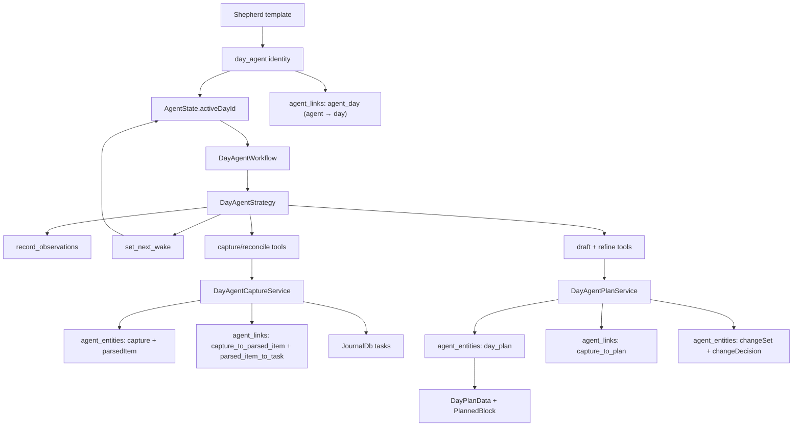
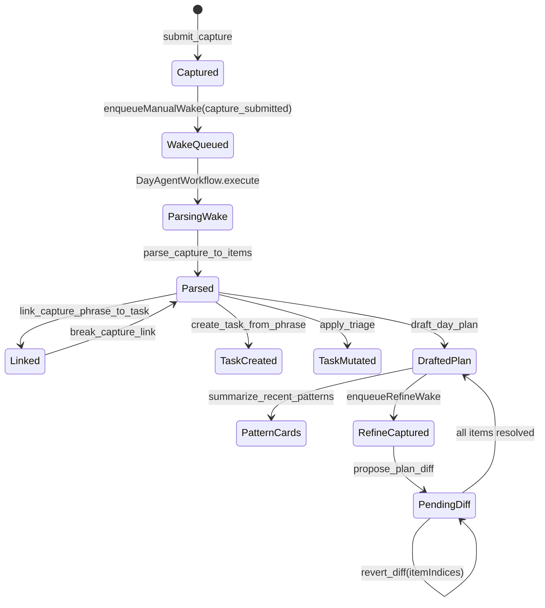

# Daily OS Next

Daily OS Next is the clean-room home for the next Daily OS runtime. New agentic
planning code lives here so it can evolve without depending on the current
`features/daily_os` implementation.

The exception is the shared day-plan aggregate in `lib/classes/day_plan.dart`.
That model is already the durable representation of a day, so Daily OS Next
should extend it instead of creating a second day-plan store. New agent code can
reuse `DayPlanData`, `PlannedBlock`, `PinnedTaskRef`, and `dayPlanId`; it should
not depend on the existing Daily OS UI controllers.

## Agent Runtime

The day-agent layer under `agents/` reuses the shared agent infrastructure from
`features/agents` and adds only the Daily OS Next runtime surface area. The
current backend supports the foundation wake, Capture/Reconcile, draft
day-plan, and refine tool paths; the Flutter UI integration is intentionally
separate.

Runtime behavior:

- `DayAgentService` creates one active `day_agent` identity per local calendar
  day.
- `AgentSlots.activeDayId` stores the deterministic day subject ID
  (`dayplan-YYYY-MM-DD`).
- The `dayplan-YYYY-MM-DD` token is reused in three distinct places. They are
  intentionally collapsed onto one string so a single date keys the entire
  day-agent surface, but the storage namespaces keep them from colliding:
  the legacy Daily OS `DayPlanEntry.id` (journal row), the day-agent identity
  subject ID surfaced as `AgentSlots.activeDayId`, and `DayPlanEntity.dayId`
  on the drafted plan. The plan entity itself is stored under
  `day_agent_plan:<dayId>` so the agent draft never overwrites the journal
  row, and the `agentId` discriminator separates the identity from the plan.
- Day-agent lookup is repository-backed by `activeDayId`; the service does not
  hydrate every active day-agent state just to find one calendar day.
- Creation also writes an `agent_day` link (agent → day) alongside the
  `activeDayId` slot, mirroring the `agent_task`/`agent_project` slot links, so
  the slot can be derived from the synced log (State-as-Projection, PR 4 B3).
  The slot remains the read source until that cutover.
- The shared template service seeds the `Shepherd` day-agent template.
- `DayAgentWorkflow` builds the prompt from template directives, recent private
  observations, and, for `capture_submitted:<captureId>` wakes, the submitted
  capture plus a bounded task corpus snapshot. Every wake user message also
  carries `currentLocalTime` so same-day drafting can distinguish future plan
  slots from time that has already passed.
- `DayAgentStrategy` handles private observations itself and delegates
  `set_next_wake`, Capture/Reconcile tools, draft plan tools, and refine
  tools through the workflow handler.
- `DayAgentCaptureService` owns direct Capture/Reconcile mutations:
  `submit_capture`, `parse_capture_to_items`, `match_to_corpus`,
  `link_capture_phrase_to_task`, `break_capture_link`,
  `surface_pending_decisions`, `apply_triage`, and
  `create_task_from_phrase`.
- `submit_capture` persists a `CaptureEntity` and enqueues a manual wake with a
  `capture_submitted:<captureId>` trigger token.
- `DailyOsNextRoot` owns the selected local plan date and keeps the date strip
  visible on Capture and Day surfaces. Capture submissions use that selected
  date for day-agent routing, Reconcile carries it into pending decisions, and
  Drafting returns to the root after the plan persists so the date-aware shell
  remains in control. Background agent or sync updates reload the current plan
  stale-while-revalidate: the root keeps rendering the last Capture or Day
  surface while the provider re-fetches, and only shows the loading shell for
  the initial route load. The same Riverpod contract applies inside
  Reconcile, Drafting, Shutdown, and the Day captures panel: if an `AsyncValue`
  still has a previous value, the UI renders that value instead of replacing
  the section or page with a spinner.
- `DailyOsPreferencesController` persists Daily OS personalization in
  `SettingsDb`. The user's display name is edited from Settings > Advanced >
  About and read by the Capture greeting. Category exclusions are edited from
  the processing filter button; `ReconcileController` applies the same
  preference to parsed capture items and pending decisions before the user sees
  them.
- Capture supports both voice and typed intake. The idle copy exposes a real
  "type instead" action that moves the controller directly to the editable
  transcript state without opening the microphone. When Capture is opened for a
  previous selected date, the screen renders a prompt asking whether there is
  still time to track for that concrete day.
- The Capture voice path asks realtime transcription to prefer Mistral cloud
  realtime before MLX local realtime, then verifies the final editable
  transcript against the saved full recording via the batch transcriber when
  realtime output looks truncated. Refine uses the same Mistral-preferred
  realtime path but disables the full-file batch verifier for that session so a
  reviewed Mistral transcript is not replaced by an MLX fallback.
- `CaptureState` keeps two live audio signals while the mic is open:
  normalized `amplitudes` for the compact waveform bars and raw `dbfs` for the
  shader voice affordance. `VoiceButton` mounts the AI tension-loop shader only
  during `listening`, wraps it around the fixed-size record button, and removes
  the shader subtree for idle, transcribing, captured, and error phases.
- Agenda and Commit surfaces use a linear capacity meter. UI projections derive
  scheduled minutes from the non-dropped blocks they render. Buffers count
  because they reserve real time; dropped blocks do not. This keeps stale
  persisted totals from making the capacity meter disagree with the agenda rows.
- Sticky action bars on Day, Reconcile, and Shutdown use
  `DesignSystemGlassStrip`, the same hairline, blur, and footer gradient used
  by the task details action bar. The page-level buttons keep their own layout,
  but the background treatment stays shared through the design system component.
- Agenda rows resolve live task metadata through `taskLiveDataProvider` before
  rendering. `AgendaView` keeps draft/manual block timing as the source of truth,
  then passes the task title, status, estimate, category, `coverArtId`, and
  `coverArtCropX` into `AgendaCard`. The row uses `CoverArtThumbnail` for the
  square task image when one exists and falls back to the numbered category badge
  when it does not, so the compact mobile list keeps a stable leading column.
- `parse_capture_to_items` persists `ParsedItemEntity` rows and links them to
  the source capture. High-confidence matches (`>= 0.75`) auto-link to tasks,
  medium-confidence matches (`0.5..0.75`) auto-link with `lowConfidence`, and
  low-confidence items stay as new capture items. Stale or older overdue corpus
  tasks are allowed candidates, but the workflow prompt tells the model to use
  a strong match only when the capture phrase clearly refers to that task; when
  the evidence is ambiguous, it should emit a low-confidence match or NEW item
  so Reconcile can surface the choice.
- `ReconcileController` watches capture-id update notifications, so the
  "heard" column re-reads parsed items when the asynchronous parsing wake
  persists them.
- `create_task_from_phrase` creates a real task from a NEW capture phrase,
  returns its `taskId`, and links the parsed item when `captureItemId` is
  supplied. Drafting should use that returned `taskId` on the matching block so
  Agenda rows can open the backing task.
- `DayAgentPlanService` owns draft plan persistence:
  `draft_day_plan` validates model-emitted blocks, requires a non-empty reason
  for every `PlannedBlockType.ai` block, writes a `DayPlanEntity`, and links it
  back to the source capture when supplied. `DayPlanEntity.captureId` is the
  authoritative pointer from a plan to the capture that spawned it (used for
  inline lookups); the `captureToPlan` `AgentLink` exists for the reverse
  direction (graph traversal from a capture to every plan it produced) and is
  written in the same transaction. Treat the field as canonical and the link
  as derived — do not mutate one without the other.
- For today's plan, `draft_day_plan` rejects new drafted `ai` or `manual`
  blocks whose start is before `currentLocalTime`. It still accepts earlier
  blocks when their state is `inProgress`, `completed`, or `dropped`, because
  those represent what actually happened rather than new future planning.
- `dailyOsActualTimeBlocksProvider` projects recorded journal entries for the
  selected local day into `TimeBlock`s without importing the legacy Daily OS UI
  controllers. It reads `JournalDb.sortedCalendarEntries` across the
  midnight-to-midnight day, follows entry links back to tasks where available,
  resolves categories through `EntitiesCacheService`, and refreshes from every
  non-empty database update batch so newly stopped timers appear in the Actual
  lane.
- The Day timeline spans `00:00` to `00:00` and folds idle regions instead of
  cropping the day. Folding is calculated from the union of planned and actual
  blocks, so gaps on either side compress into the same folded-paper region
  with a shared zigzag edge and faint compressed-hour marks. Plan and Actual
  share one vertical `SingleChildScrollView`, one minute-density zoom value, and
  one sticky 24-hour time rail. Compact layouts keep the plan-first horizontal
  pager with an Actual peek; desktop-width layouts default to side-by-side.
  Two-finger vertical pinch and trackpad pinch zoom both lanes together, while
  the toolbar/horizontal pinch toggles paged versus side-by-side comparison.
  The summary card above the tracks groups actual minutes by category and
  counts completed task blocks. `DayBlock` opens `/tasks/<taskId>` for any
  planned or actual block whose `TimeBlock.taskId` is present; standalone
  calendar and buffer blocks stay inert.
- `surface_pending_decisions` intentionally limits overdue carryover to the
  last seven days. Due-today tasks and in-progress work still surface, but
  weeks-old overdue rows are left out of daily proposals unless the user brings
  them back through search, capture, or an explicit task decision.
- `summarize_recent_patterns` returns transient learning-card payloads from
  recent `DayPlanEntity` rows. It does not persist new state.
- `PlannedBlock` now carries the agent-facing metadata required by the draft
  flow: optional task/title, block origin (`ai`, `cal`, `buffer`, `manual`),
  lifecycle state, and the model's placement reason.
- `DayAgentService.enqueueDraftingWake({dayDate, captureId?, decidedTaskIds,
  decidedCaptureItemIds})` is the UI's entry point for asking the agent to
  draft. The wake fires with `drafting:<dayId>` plus optional
  `capture_submitted:<id>`, `decided_task:<taskId>`, and
  `decided_capture_item:<parsedItemId>` tokens. The workflow surfaces the
  baseline plan, hydrated decided tasks, and `decidedCaptureItems` under the
  `drafting` block in the user message JSON. Items in `decidedCaptureItems`
  are approved NEW/unlinked capture items; the model must call
  `create_task_from_phrase` first and place the returned task id.
- Day-agent wakes that resolve to Gemini 3 Flash use a `thinkingLevel: LOW`
  override through their `CloudInferenceWrapper` instance. The shared Gemini
  Flash default remains unchanged; workflows opt into this latency profile
  explicitly instead of changing the global model default.
- Drafting wakes must finish by calling `draft_day_plan`. If the model stops
  after reconcile work or emits prose instead, `DayAgentWorkflow` sends one
  forced retry with `tool_choice` pinned to `draft_day_plan`; if that still
  misses the tool, the wake fails instead of letting the UI poll until timeout.
- Refine is the explicit plan-amendment surface. `DayAgentService.enqueueRefineWake(
  {dayDate, transcript})` pre-checks that a non-deleted plan exists, persists the
  refine transcript as a `CaptureEntity` (id prefixed `refine_capture:`,
  skipped when the transcript is blank), and fires a manual wake with
  `refine:<dayId>` (and `capture_submitted:<captureId>` when a capture was
  written). The workflow attaches a `refine` block carrying the current
  `baselinePlan` to the user message so the model can reference existing
  blockIds. This is allowed after a plan is agreed/committed because the
  amendment still lands as a pending diff that the user must accept.
- The Refine UI uses the same `CaptureController` recording/transcription path
  as the initial capture screen. It never injects a scripted transcript; when
  transcription produces no text, the screen returns to idle without proposing
  a diff. Final refine transcripts stop in the same editable review field as
  initial capture, and the controller submits its current reviewed text to
  `propose_plan_diff` so stale widget parameters cannot drop the user's edits.
  From Day, refinement opens in a Wolt modal over the existing plan surface
  (bottom sheet on narrow screens, dialog on wider screens); the full
  `RefinePage` remains as a direct-route fallback. Failed or empty proposals
  keep the review field open and show inline feedback instead of silently
  closing. Proposed changes render as independent suggestion cards, matching
  task-agent approval affordances: each row can be accepted or rejected, then
  collapses to an applied/rejected confirmation pill while unresolved rows stay
  actionable.
- `DayAgentPlanService.proposePlanDiff` persists each model-emitted change as
  a `ChangeItem` (tool name `move_block` / `add_block` / `drop_block`) on a
  new pending `ChangeSetEntity` keyed by the plan id. Optional
  `baselinePlanId` guards against stale diffs; optional `captureId` is
  stashed in the first item's args so the change set is discoverable from a
  refine-transcript capture.
- `acceptPlanDiff` / `revertPlanDiff` resolve some or all items atomically
  (default = all pending). The Refine controller passes `itemIndices` for
  per-card decisions. Accept mutates the plan in place: it overlays
  block moves, adds new blocks, drops by id, then re-sorts blocks by start
  time, recomputes `scheduledMinutes`, and rebuilds `pinnedTasks`. Energy
  bands, capacity, and plan status are left intact. Revert leaves the plan
  untouched. Both write `ChangeDecisionEntity` records per resolved item
  with `actor: user` and `verdict: confirmed | rejected`. Added blocks inherit
  `committed` state when the amended plan was already agreed/committed.
- Attention negotiation now has an indexed read/write path into planning.
  Task agents can call `request_attention`, which writes an evidence-backed
  `AttentionRequestEntity` into the synced agent log after checking existing
  active claims for the same task through `attention_claim_index`. The day
  agent loads `AgentRepository.getAttentionPlanningInputsForWindow(...)` for
  the planning day, which returns window-visible claims plus active
  `StandingAgreementEntity` records through projection indexes rather than
  source-table JSON scans. Planner awards still flow through the existing
  human-gated `ChangeSet` path: a planner may write `AttentionAwardEntity`
  records linked back to requests and concrete day plans when proposing blocks.
  Per ADR 0021, the planner behavior is LLM-mediated claim weighing; there is
  no standalone deterministic arbitrator fallback in production. The day
  agent must not wake task/project/health agents during drafting to manufacture
  fresh claims; producer agents maintain claims ahead of time during their own
  wake lifecycle, and drafting reads only the already-materialized projection.
- Wakes consume any `scheduledWakeAt` timestamp that is no longer in the future
  so app restart does not replay an already-fired scheduled wake.
- Future Daily OS Next commit, agenda, and shutdown tools should be added
  under this feature without importing `features/daily_os`.

The Day view is a projection over one `DraftPlan` rather than a second planner
store:

## Testing Strategy

Pure day-plan and day-agent logic should use Glados property tests whenever an
invariant is easier to state than to cover with examples:

- date normalization and `dayplan-YYYY-MM-DD` identity stability
- Capture/Reconcile confidence threshold classification
- pending-decision dedupe and sort priority
- `DayPlanData` derived durations, category grouping, and JSON round-trips
- draft-plan JSON value objects, required AI block reasons, and positive block
  durations
- plan-diff change validation (moved/added/dropped action-specific required
  fields, in-day timestamp guards, unknown-blockId rejection)
- future tool validators such as non-overlap rules and commit-state gating

Service and workflow tests should stay deterministic example tests with mocks,
fixed clocks, and no real timers. They should verify transaction boundaries,
wake scheduling, persisted state changes, and tool error paths. Glados belongs
on pure model/validator/diff logic, not on mocked I/O orchestration.
