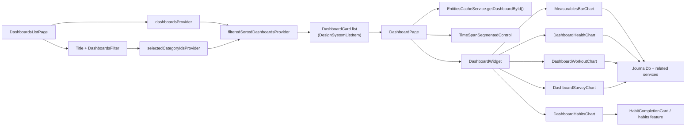
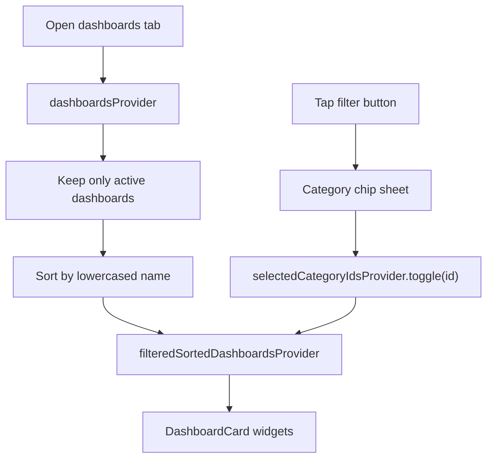
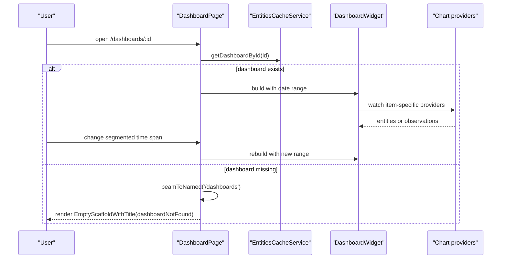
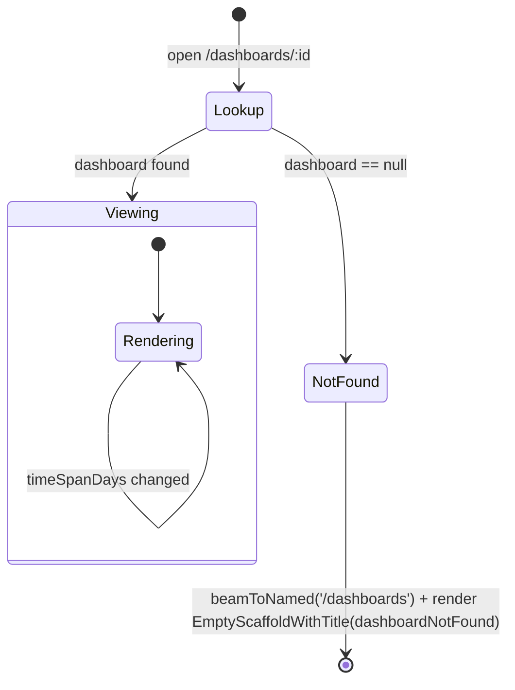
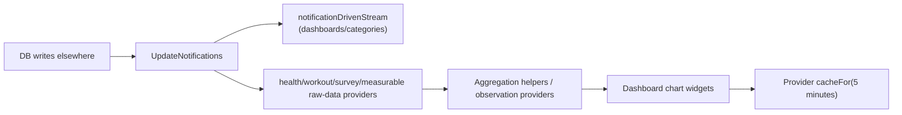

# Dashboards Feature

The `dashboards` feature powers the app's dashboard/insights surface. It reads
stored `DashboardDefinition` entities, routes each `DashboardItem` to the right
chart widget, and keeps those charts refreshed from journal-backed data.

This is a view layer, not a separate analytics warehouse with grand ambitions.
The source data still lives in the journal database and neighboring features.
The dashboards feature mostly assembles and visualizes it. "Mostly" is doing a
bit of work here, because a few charts can also launch capture flows directly.

## Runtime Responsibilities

At runtime, this feature owns:

- listing active dashboards with `dashboardsProvider`
- locally filtering that list by category with
  `selectedCategoryIdsProvider`
- opening a single dashboard page and switching its visible time span
- routing dashboard items to measurement, health, workout, survey, and habit
  widgets
- keeping chart providers warm for 5 minutes via
  `cacheFor(dashboardCacheDuration)`

It does not own:

- dashboard authoring UI, which lives under
  `lib/features/settings/ui/pages/dashboards/`
- the underlying journal, survey, workout, or habit records
- a generic reporting/query engine

## What A Dashboard Actually Is

`DashboardDefinition` is a stored entity with metadata such as `name`,
`description`, `categoryId`, `active`, `private`, and `days`, plus a list of
`DashboardItem`s.

At render time, `DashboardWidget` currently supports exactly these item types:

- `DashboardMeasurementItem`
- `DashboardHealthItem`
- `DashboardWorkoutItem`
- `DashboardSurveyItem`
- `DashboardHabitItem`

So this feature is broader than "health charts". If an item lands in one of
those five switch cases, the page knows how to render it.

## Directory Shape

```text
lib/features/dashboards/
├── config/                      # Health/workout lookup maps
├── state/                       # Riverpod providers, fetchers, aggregators
├── ui/
│   ├── pages/                   # List page and single dashboard page
│   └── widgets/
│       ├── charts/              # Chart shells and chart-specific widgets
│       │   └── time_series/     # Time-series chart helpers
│       └── ...                  # Filter, list, card widgets
├── widgetbook/                  # Dev-only Insights design showcase + mock data
└── README.md
```

Most of the real behavior lives in `state/` and `ui/widgets/charts/`. The page
widgets stay fairly thin on purpose.

## High-Level Architecture



The feature splits cleanly into two halves:

- dashboard discovery and filtering
- item-specific chart rendering for a selected dashboard

## Dashboard List Flow

The list scaffold is a `CustomScrollView` with a title row containing the
category filter button, followed by a grouped rounded-card container of
`DesignSystemListItem`-based `DashboardCard`s. The old `SliverAppBar` has been
removed in favour of a lightweight inline header.

`DashboardsListPage` branches on `isDesktopLayout(context)`. On mobile it returns
the list scaffold alone and tapping a card beams to `/dashboards/:id`. On desktop
it becomes a master/detail split: a sized list pane (width from
`paneWidthControllerProvider`), a `ResizableDivider` that drives
`paneWidthControllerProvider.updateListPaneWidth`, and an `Expanded` detail pane.
The detail pane is a `ValueListenableBuilder` on
`getIt<NavService>().desktopSelectedDashboardId` that embeds `DashboardPage`
directly for the selected id, or renders `DesktopDetailEmptyState` when nothing
is selected.



Code-backed details worth knowing:

- `dashboardsProvider` reads all dashboards from `JournalDb`, then filters to
  `active == true`
- category filtering is purely local UI state; no database query changes
- `DashboardsFilter` is an `IconButton` whose icon toggles between
  `Icons.filter_alt_rounded` (when at least one category is selected) and
  `Icons.filter_alt_outlined` (when none are); tapping it opens a bottom sheet of
  category `ActionChip`s that toggle `selectedCategoryIdsProvider`
- `DashboardsListPage` wires its scroll controller into
  `UserActivityService.updateActivity`, so even scrolling quietly counts as user
  activity

## Single Dashboard Page Lifecycle

`DashboardPage` is a `ConsumerStatefulWidget` with a single piece of local page
state:

- `timeSpanDays`, defaulting to `90`

The visible date range is the only range control; the time-span segmented
control covers it. There is no pinch/scroll zoom gesture.



The page has a simple two-state lifecycle driven by `EntitiesCacheService.getDashboardById()`, which is a synchronous cache lookup:



Important reality checks:

- the page title comes from `EntitiesCacheService.getDashboardById()`
- the visible date range is derived from `DateTime.now()` and midnight helpers
- `DashboardDefinition.days` exists on the entity, but `DashboardPage` does not
  currently use it; the UI always starts at 90 days until the user changes the
  segmented control

## Item Rendering Matrix

| Dashboard item | Widget | Data path | Notes |
| --- | --- | --- | --- |
| `DashboardMeasurementItem` | `MeasurablesBarChart` | `measurableDataTypeControllerProvider` -> `aggregationTypeControllerProvider` -> `measurableChartDataControllerProvider` -> `measurableObservationsControllerProvider` | Renders a line chart for `AggregationType.none`, otherwise a bar chart. The header can open `MeasurementDialog`. |
| `DashboardHealthItem` | `DashboardHealthChart` | `HealthChartDataController` -> `HealthObservationsController` | `BLOOD_PRESSURE` and `BODY_MASS_INDEX` branch to special widgets. Health refresh is nudged in the background via `HealthImport.fetchHealthDataDelta(...)`. |
| `DashboardWorkoutItem` | `DashboardWorkoutChart` | `WorkoutChartDataController` -> `WorkoutObservationsController` | Aggregates daily sums for the selected workout type/value kind. Also triggers `HealthImport.getWorkoutsHealthDataDelta()`. |
| `DashboardSurveyItem` | `DashboardSurveyChart` | `SurveyChartDataController` + `surveyLines(...)` | Multi-line chart. The `+` button only knows how to launch CFQ11, PANAS, and GHQ12 survey flows. |
| `DashboardHabitItem` | `DashboardHabitsChart` | delegates to `HabitCompletionCard` in the habits feature | No local dashboard-specific fetcher here; this is pragmatic reuse of habit UI. |

## Refresh And Caching Model

There are two refresh styles in play:

1. list-level streams for dashboards and categories
2. item-level providers for chart data and aggregated observations



In concrete terms:

- dashboard and category lists use `notificationDrivenStream(...)`
- measurement, health, workout, and survey controllers subscribe to
  `UpdateNotifications.updateStream` and refetch on matching keys
- most providers call `ref.cacheFor(dashboardCacheDuration)`, which currently
  means 5 minutes
- some health-related controllers opportunistically kick off background imports
  while building, so opening a dashboard can also serve as a polite "please go
  refresh that data" nudge

## Chart-Specific Notes

The chart widgets are not all built from one abstract chart super-engine, and
that is fine.

- the bar, line, multiline, and blood-pressure charts share one bottom date axis
  cadence via `shouldShowDateLabel(rangeInDays, day)` in
  `ui/widgets/charts/time_series/utils.dart` (the 1st always shows; the 15th
  below 92 days; the 8th and 22nd below 30 days). Every bottom `SideTitleWidget`
  uses `fitInside` so the leading/trailing labels never clip the plot edge.
- measurement charts resolve aggregation from either the dashboard item or the
  measurable type definition. The card caption is a single phrase: the
  measurable description when present, otherwise the humanized aggregation
  (`aggregationDisplayLabel`), otherwise nothing — never an "[agg] · [desc]"
  stack.
- health charts use the `healthTypes` config map for display names, units, and
  aggregation behavior
- the `BODY_MASS_INDEX` item plots WEIGHT only, so its card title is the WEIGHT
  display name rather than the configured type's "Weight vs. Body Mass Index"
- workout charts always render as bars after aggregating daily totals
- the blood-pressure chart's value axis steps by 20 (≈80/100/120) while the
  dashed 80/120 reference lines still land on those gridlines
- survey charts build `LineChartBarData` locally from survey score keys
- habit charts intentionally reuse `HabitCompletionCard` rather than copying
  habit chart logic into this feature

This is a pragmatic switchboard, not a shrine to abstraction purity.

## Current Constraints And Quirks

- only active dashboards appear in the list
- category filters are client-side only
- `dashboardByIdProvider` watches `dashboardsProvider` for invalidation, but the
  actual lookup still comes from `EntitiesCacheService`
- the stored dashboard `days` value is currently ignored by the runtime page
- survey launch actions are hard-coded to a small known set of surveys
- health and workout chart configs still rely on local lookup maps rather than a
  more generic registry

None of that is mysterious. It is just the shape of the current code.

## Related Code Outside This Folder

- `lib/features/settings/ui/pages/dashboards/` edits dashboard definitions
- `lib/widgets/charts/habits/` provides the habit chart (`DashboardHabitsChart`)
  reused here, which in turn renders `HabitCompletionCard` from
  `lib/features/habits/ui/widgets/`
- `lib/features/surveys/tools/run_surveys.dart` backs the survey `+` actions
- `lib/services/entities_cache_service.dart` provides fast dashboard lookups for
  page routing/title rendering
- `lib/database/database.dart` remains the real source of dashboard data

If you want to change how dashboards look, start here. If you want to change
where the underlying numbers come from, this feature is mostly the messenger.
