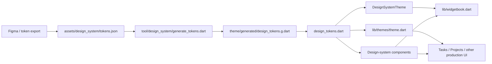
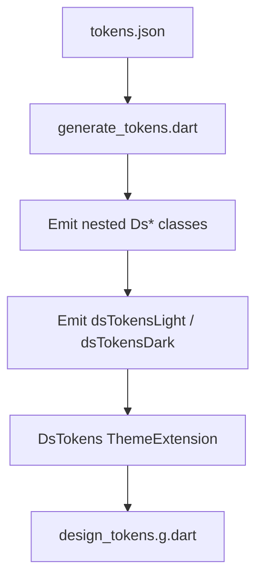
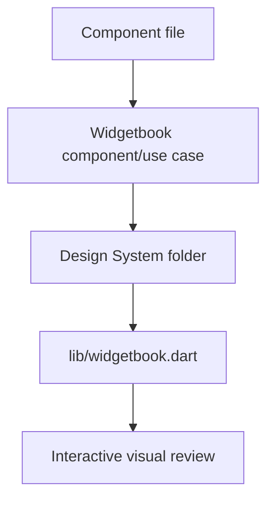

# Design System Feature

This feature is the app's token-driven UI lab: part generated theme layer, part reusable component library, part Widgetbook review surface. Its job is to make visual decisions explicit enough that people stop "just nudging" spacing, color, and control behavior in random feature files.

It exists to keep visual decisions centralized, typed, and previewable.

## Core Responsibilities

- import token data from `assets/design_system/tokens.json`
- generate typed Flutter token classes in `theme/generated/`
- expose those tokens through a `ThemeExtension`
- provide a standalone design-system `ThemeData` for Widgetbook
- implement reusable DS components and a few feature-shaped composites
- give downstream features a shared token API via `context.designTokens`

## High-Level Model



The generated token file is the spine. Components and feature UI are supposed to consume typed tokens, not freelance their own palette and spacing system on a Friday afternoon.

## Directory Shape

```text
lib/features/design_system/
├── components/
│   ├── avatars/
│   ├── badges/
│   ├── buttons/
│   ├── calendar_pickers/
│   ├── chips/
│   ├── dropdowns/
│   ├── navigation/
│   ├── task_filters/
│   ├── task_list_items/
│   └── ...
├── theme/
│   ├── design_system_theme.dart
│   ├── design_tokens.dart
│   └── generated/
│       └── design_tokens.g.dart
├── utils/
│   └── disabled_overlay.dart
├── widgetbook/
└── design_system.dart
```

### Practical Reading Guide

- `theme/` is the token and theming layer
- `components/` is the widget implementation layer
- `widgetbook/` is the preview and review layer
- `design_system.dart` is the curated public barrel, not an export of every DS-adjacent file in the tree

## Token Model

The current generator reads exactly four top-level groups from `assets/design_system/tokens.json`:

- `color`
- `typography`
- `spacing`
- `borderRadius`

That becomes a generated `DsTokens` tree with light and dark instances:

- `dsTokensLight`
- `dsTokensDark`

The current typed surface is therefore:

- colors
- typography
- spacing
- radii

Notably, the current importer does not generate separate sizing or motion groups yet. If the token export grows, the seam to update is the generator, not every component downstream.

## Import Pipeline

`make design_system_import` does two things:

1. runs `tool/design_system/generate_tokens.dart`
2. formats `lib/features/design_system/theme/generated/design_tokens.g.dart`

The generator:

- reads `assets/design_system/tokens.json`
- converts the JSON into nested typed classes
- emits `DsTokens` as a `ThemeExtension`
- writes the generated file into source control



## Theme Integration

There are two distinct runtime paths for these tokens.

### `DesignSystemTheme`

`DesignSystemTheme.light()` and `.dark()` build a standalone `ThemeData` from `dsTokensLight` and `dsTokensDark`.

That theme:

- maps token colors into a `ColorScheme`
- maps token typography into a `TextTheme`
- attaches the active `DsTokens` instance as a `ThemeExtension`

This is the design-system-native theme used by Widgetbook.

### App Theme Integration

The production app does not need to swap wholesale to `DesignSystemTheme` in order to use DS tokens. `lib/themes/theme.dart` also injects `dsTokensLight` or `dsTokensDark` into the app theme's `extensions`, which means production widgets can call:

```dart
final tokens = context.designTokens;
```

That split matters:

- `DesignSystemTheme` is the clean standalone sandbox
- the main app theme is the integration path that exposes the same token tree to production features

## Token Access API

`design_tokens.dart` exports the generated file and adds the main convenience API:

```dart
extension DesignTokensBuildContextExtension on BuildContext {
  DsTokens get designTokens {
    final tokens = Theme.of(this).extension<DsTokens>();
    if (tokens == null) {
      throw StateError('DsTokens extension is missing from the active theme.');
    }
    return tokens;
  }
}
```

The explicit null check and `StateError` is deliberate. Missing token injection is a wiring bug, not something the widget should quietly improvise around.

## Component Surface

This folder contains both low-level controls and feature-shaped composites.

Representative primitive-ish components:

- buttons
- checkboxes
- radio buttons
- toggles
- text inputs and textareas
- chips, badges, avatars, dividers, tooltips
- dropdowns, lists, spinners, progress bars, scrollbars

Representative composite or feature-shaped components:

- task filters
- task list items
- navigation tab bar and showcase mobile chrome
- calendar and time pickers
- file upload surface

That mix is intentional. The current DS is not only a box of atoms; it also includes a few opinionated composites that encode real app interaction patterns.

## Public Surface

The main barrel is:

```dart
import 'package:lotti/features/design_system/design_system.dart';
```

That barrel exports:

- `DesignSystemTheme`
- token access via `design_tokens.dart`
- a curated set of shared components

It does not currently export every file under `components/`. Some specialized modules, including task-filter and navigation-related widgets, are still imported directly from their own paths.

So the barrel is a public surface, but not yet the entire surface.

## Component Patterns

A few implementation patterns repeat across the DS and are worth treating as contract rather than coincidence.

### Token-First Sizing and Styling

Representative components such as `DesignSystemButton`, `DesignSystemCheckbox`, and `DesignSystemSplitButton` derive padding, radii, icon size, and text style from `context.designTokens`, not local magic numbers.

### Explicit Accessibility Hooks

Several components enforce accessible naming at construction time. Examples:

- `DesignSystemButton` asserts that either `label` or `semanticsLabel` is provided
- `DesignSystemSplitButton` resolves explicit semantics labels for primary and dropdown actions
- `DesignSystemCheckbox` requires either a visible label or a semantics label
- `DesignSystemTooltipIcon` maps tooltip text into semantics by default

This is not universal policy machinery hidden somewhere central. It is encoded directly in component constructors and `Semantics` wrappers, which is better because the rule stays close to the widget that can violate it.

### Shared Disabled Treatment

`utils/disabled_overlay.dart` provides the small `withDisabledOpacity()` extension used across multiple controls. It is a narrow utility, but it keeps disabled-state treatment consistent without each widget re-implementing the same opacity wrapper.

## Widgetbook Structure

The design system preview surface lives inside the shared `lib/widgetbook.dart` app.

Important nuance: Widgetbook is not DS-only. The top-level app includes folders for:

- Design System
- My Daily
- Projects
- Tasks
- a few standalone task widgets

The design-system folder itself is built by `buildDesignSystemWidgetbookFolder()` in `widgetbook/design_system_button_widgetbook.dart`, which acts as the registry for DS component stories and sorts them alphabetically.



This means Widgetbook serves two purposes at once:

- isolated DS component review
- a broader preview environment where DS components are also exercised inside feature-level showcases

## Widgetbook Commands

Useful targets from `Makefile`:

```sh
make widgetbook_macos_build
make widgetbook_macos_upload
make widgetbook_macos_publish
```

Artifacts are exported under:

- `build/widgetbook_macos_export/Lotti_Widgetbook.app`
- `build/widgetbook_macos_export/Lotti_Widgetbook.app.zip`

After unzipping, you can open the app bundle from Finder:

```sh
open "build/widgetbook_macos_export/Lotti_Widgetbook.app"
```

Because the app is unsigned, macOS may warn on first launch. In that case, use Finder's right-click `Open` action, or remove the quarantine attribute from the command line:

```sh
xattr -dr com.apple.quarantine "build/widgetbook_macos_export/Lotti_Widgetbook.app"
```

## Production Adoption

The DS is already used beyond Widgetbook. Production files in tasks and projects import `context.designTokens` directly, and some feature UIs import DS components such as:

- search
- scrollbars
- task filter modals and sheets
- navigation components

So this feature is not only a showcase library. It is already part of the live rendering path for parts of the app.

## Boundaries With The Rest Of The App

This feature is both a library and a policy seam.

The intended discipline is:

- prefer DS tokens over hard-coded visual literals
- prefer DS components when a matching abstraction already exists
- improve the token source or DS component when the current abstraction is missing

What this feature should not become:

- a polite wrapper around arbitrary old widgets
- a dumping ground for one-off visual exceptions
- a fake public API that claims more stability than the exports actually provide

## How To Extend It Safely

When adding or updating a DS component:

1. check whether the needed token already exists in `tokens.json`
2. update the generator only if the token shape itself needs to expand
3. build the widget against `context.designTokens`
4. add or update Widgetbook coverage
5. verify semantics and disabled behavior
6. only then adopt it in production code

When a value is missing, the preferred fix is upstream or at the DS seam. Sneaking in a one-off visual literal because it "looked close enough" is exactly how design systems turn into decorative fiction.

## Current Scope

The current DS covers a broad cross-section of UI:

- text and form controls
- buttons and split actions
- chips, badges, avatars, captions, tooltips
- lists and task list items
- filters, dropdowns, navigation, and pickers
- feedback surfaces like toasts, spinners, and progress bars

The important part is not the component count. The important part is that the system already has a real token pipeline, a real preview surface, and real production consumers. That makes it useful, but it also means the README has to stay concrete, because this is infrastructure, not moodboard copy.
