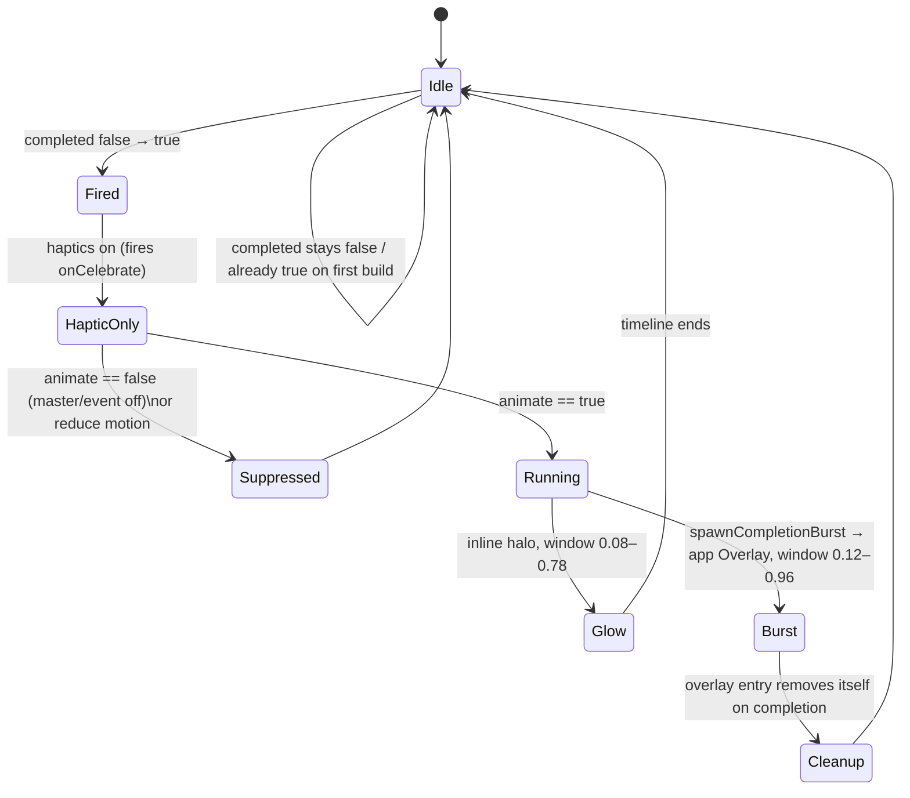

# Completion celebration

The flourish the app plays when you finish something — close a task, complete a
habit, check off a checklist item. One shared choreography (a soft glow bloom
plus a particle burst, with an optional anchor pop and a completion haptic),
driven by a single timeline so the beats cascade instead of firing on the same
frame. The particle field is **selectable per content type** (the *variant*) —
sparks for a closed task, confetti for a habit, bubbles for a checklist item by
default — but everything around it is shared, so switching style only swaps the
painter.

Nothing here uses an animation package — the burst is hand-rolled
`CustomPainter` work and the glow is an animated `BoxShadow`. All particle motion
is **index-seeded** (a deterministic function of the particle index and the
timeline), never `Random`, so a given frame renders identically every time. That
is what makes golden capture, the filmstrip harness, and the expert-panel rating
loop possible.

## Pieces

| File | Role |
| --- | --- |
| `celebration_variant.dart` | `CelebrationVariant` enum (`sparks`, `fireworks`, `confetti`, `embers`, `bubbles`), its storage parsing (`fromStorage` / nullable `tryFromStorage`), warm/cool flag, and per-variant `durationScale` (bubbles run slower). |
| `celebration_burst_painters.dart` | The abstract `CelebrationBurstPainter`, one concrete painter per variant, the `celebrationPalette()` colour sets, and the `buildCelebrationBurstPainter()` dispatch. |
| `completion_burst.dart` | `CompletionBurst` — the widget that picks a painter by variant and paints one frame at a given `progress`. |
| `completion_glow.dart` | `CompletionGlow` — the soft halo that blooms and fades; optionally tinted warm. |
| `completion_celebration.dart` | `CompletionCelebration` — wraps a child, runs the timeline on the `false → true` "completed" edge, renders the glow inline and fires the burst into the app `Overlay` via `spawnCompletionBurst()`. |
| `../../settings/state/celebration_preferences_controller.dart` | `CelebrationPreferences` + controller: the master switch, per-event switches, the independent haptics switch, and a **per-content-type variant** (`tasksVariant` / `habitsVariant` / `checklistItemsVariant`), persisted in `SettingsDb`. |
| `../../settings/ui/widgets/celebration_variant_picker.dart` | The (presentational) style picker — one live-preview card per variant; takes a `selected` + `onSelect`. |
| `../../settings/ui/widgets/celebration_style_section.dart` | The Style assignment UI: a surface selector (Tasks / Habits / Checklist items, each showing its assigned style) over a single picker re-bound to the selected surface. |
| `../../settings/ui/widgets/celebration_preview_stage.dart` | The "Try it" stage — dummy Done / checklist / habit controls that each replay their own content type's variant. |

## Where it fires

| Surface | Trigger | Call site |
| --- | --- | --- |
| Task **Done** | status pill enters `TaskDone` | `tasks/ui/header/desktop_task_header_meta.dart` |
| **Checklist item** | a box is checked (tap, AI proposal, or sync) | `tasks/ui/checklists/checklist_item_row_state.dart` |
| **Whole checklist** | completion rate reaches 100% (glow only, no burst) | `tasks/ui/checklists/checklist_card.dart` |
| **Habit** | a success completion is recorded | `habits/ui/widgets/habit_action_row.dart` |

The habit row runs its own controller (it has bespoke streak/button choreography)
but reuses `CompletionGlow` and `CompletionBurst`; the other three use
`CompletionCelebration` directly.

## Gating model

Two independent axes decide what plays. Call sites read the *combined* getters,
never the raw per-event field.

```
visual celebration  =  enabled (master)  AND  the per-event switch
completion haptic    =  haptics (its own switch, independent of enabled)
```

- `CelebrationPreferences.animateTasks` / `animateHabits` / `animateChecklistItems`
  fold the master switch into each per-event switch — that boolean is passed as
  `CompletionCelebration.animate` (or gates the habit row's controller).
- The completion haptic is gated only by `haptics`, so a user can keep the buzz
  with the flash off, or the flash with the buzz off. (On habits the same
  low-level haptic also fires for the non-celebratory "missed" swipe; that path
  is unaffected — only the *completion* haptic honours the switch.)
- The system **reduce-motion** setting independently suppresses the burst and
  freezes the glow to an opacity-only fade, regardless of the switches above.

Everything defaults on. Each content type has its own default style — `sparks`
for tasks, `confetti` for habits, `bubbles` for checklist items — so the
celebrations feel deliberately different out of the box. On upgrade from the
earlier single-style build, a previously chosen global variant (the legacy
`CELEBRATE_VARIANT` key) **migrates** onto every per-content-type key that was
never set, so the user's choice is preserved everywhere; a per-type key always
wins over the legacy one. All configurable in Settings → Advanced → Animations.

## Lifecycle of one celebration



The burst is fired **imperatively into the `Overlay`**, not rendered in the
widget tree. The geometry is read synchronously while the anchor is still
mounted, then the burst lives in the overlay with its own controller — so it
survives the anchor collapsing in the same frame (e.g. completing the last
checklist item hides its row immediately) and is never clipped by a row, card, or
scroll viewport.

## Variants

`buildCelebrationBurstPainter()` maps a `CelebrationVariant` to its painter; the
shared `CelebrationBurstPainter` base carries the common inputs (`progress`,
`origin`, `palette`, `count`, `sizeScale`, `clearCenter`, `reach`) and the
`shouldRepaint` contract. Each painter draws a distinct particle language:

- **sparks** — fine accent comet motes flung radially in two depth tiers (the
  original look; the default).
- **fireworks** — a rocket streak, then a multi-colour shell that bursts into a
  twinkling ring with heavy fallout.
- **confetti** — tumbling rectangular ribbons that pop up, sway, and fall under
  gravity while spinning.
- **embers** — warm motes that surge up, wobble, and cool from gold through
  orange to red. The only *warm* variant — its glow blooms warm too.
- **bubbles** — iridescent membranes that swell, rise, and pop. They read slower
  than the fine particle variants, so `durationScale` stretches their burst
  window (1.4×) wherever it fires, applied once in `spawnCompletionBurst` (and in
  the habit row's timeline) rather than per call site.

Palettes come from existing app colour constants (the accent token plus the
gold/status palette), so the festive variants stay on-brand without inventing new
hex.

## Settings UI

`CelebrationSettingsBody` composes three sections: the switches (master + three
per-event + the independent haptics), the **style section**
(`CelebrationStyleSection`), and the **"Try it" stage** (`CelebrationPreviewStage`
— dummy Done / checklist / habit controls that each fire a real overlay burst of
their own content type's variant).

The style section avoids stacking one full picker per content type (three
near-identical 5-card grids). Instead a **surface selector** (Tasks / Habits /
Checklist items — each segment showing the style currently assigned to it) sits
above a **single** `CelebrationVariantPicker` that re-binds to whichever surface
is selected; tapping a card assigns it to that surface and plays the preview. So
all three assignments are visible at a glance while only five style cards are ever
on screen. The selector, picker, and preview grey out and stop responding when the
master switch is off; the haptics switch stays live.

## Filmstrip harness (for review)

Because a still can't show motion, `celebration_filmstrip_harness_test.dart`
renders each variant's burst as a strip of PNG stills across the timeline. A
fast smoke test always asserts each variant paints and *progresses* (a mid-burst
frame differs from the empty rest frame, and from an earlier frame). Set
`LOTTI_SCREENSHOT_DIR` and run with `--tags filmstrip` to also write every frame
to `<dir>/celebration_filmstrip/<variant>/frame_<ms>.png` — the artifact a panel
of reviewers (or a model that can't watch motion) rates when iterating on a
variant's look.
```
LOTTI_SCREENSHOT_DIR=/tmp/shots fvm flutter test --tags filmstrip \
  test/features/design_system/components/celebration/celebration_filmstrip_harness_test.dart
```
