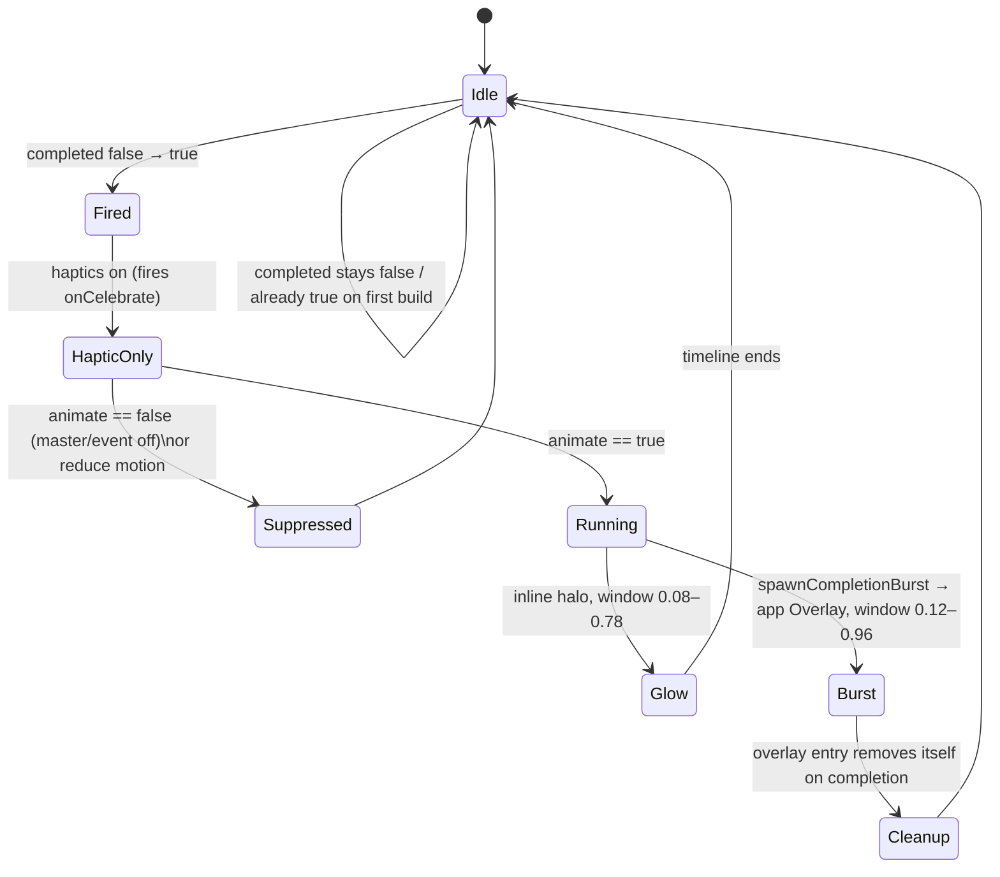

# Completion celebration

The flourish the app plays when you finish something — close a task, complete a
habit, check off a checklist item. One shared choreography (a soft glow bloom
plus a particle burst, with an optional anchor pop and a completion haptic),
driven by a single timeline so the beats cascade instead of firing on the same
frame. The particle field is **selectable per content type** (the *variant*) —
sparks for a closed task, confetti for a habit, bubbles for a checklist item by
default — but everything around it is shared, so switching style only swaps the
painter.

Each variant is also **deeply tunable**: every shape constant a painter used to
hard-code (particle count, size, reach, gravity, twinkle, sway, spin, swell, …)
is exposed as a slider in a per-variant playground and persisted globally. And a
content type can be set to one of two **surprise modes** instead of a fixed
variant: **Random** (a fresh variant every completion) or **Combine two** (a
fresh layered pair every completion), so "you never know what you get".

Nothing here uses an animation package — the burst is hand-rolled
`CustomPainter` work and the glow is an animated `BoxShadow`. All particle motion
is **index-seeded** (a deterministic function of the particle index and the
timeline), never `Random`, so a given frame renders identically every time. That
is what makes golden capture, the filmstrip harness, and the expert-panel rating
loop possible.

## Pieces

| File | Role |
| --- | --- |
| `celebration_variant.dart` | `CelebrationVariant` enum (`sparks`, `fireworks`, `confetti`, `embers`, `bubbles`), its storage parsing (`fromStorage` / nullable `tryFromStorage`), warm/cool flag, and per-variant `durationScale` (bubbles run slower). |
| `celebration_params.dart` | `CelebrationParams` — the tunable look of a variant as a flat `id → value` map (shared `count`/`size`/`reach`/`clearCenter` plus per-variant physics knobs), the `celebrationSliderSpecs()` knob table (id, range, default), `defaultsFor()` (defaults = the original hard-coded constants), and JSON encode/`tryDecode` with range-clamping. |
| `celebration_selection.dart` | `CelebrationSelection` — what a content type fires: `FixedSelection(variant)`, `RandomSelection`, or `CombineSelection`. Deterministic seed-driven `resolve()` → `ResolvedCelebration` (one variant, or a distinct pair for combine); a token for storage; `nextCelebrationSeed()` so surprise modes re-roll on every completion. |
| `celebration_burst_painters.dart` | The abstract `CelebrationBurstPainter` (reads every shape constant from `CelebrationParams`), one concrete painter per variant, `CombinedBurstPainter` (layers two for combine), the `celebrationPalette()` colour sets, and the `buildCelebrationBurstPainter()` dispatch. |
| `completion_burst.dart` | `CompletionBurst` — paints one frame from `params` (and an optional `secondParams` for combine) at a given `progress`. |
| `completion_glow.dart` | `CompletionGlow` — the soft halo that blooms and fades; optionally tinted warm. |
| `completion_celebration.dart` | `CompletionCelebration` — wraps a child, resolves its `selection` on the `false → true` edge (fresh seed), runs the timeline, renders the glow inline (tinted by the resolved variant) and fires the burst into the app `Overlay` via `spawnCompletionBurst()`. |
| `../../settings/state/celebration_preferences_controller.dart` | `CelebrationPreferences` + controller: the master switch, per-event switches, the independent haptics switch, a **per-content-type selection** (`tasksSelection` / `habitsSelection` / `checklistItemsSelection`), and a **global tuned-params map** (`paramsFor()`), all persisted in `SettingsDb`. |
| `../../settings/ui/widgets/celebration_variant_picker.dart` | The (presentational) style picker — a grid of live-preview variant cards (each with a corner "tune" affordance, `onTune`, that opens the playground) over two full-width Random / Combine option rows. Takes a `selected` selection + `onSelect`. |
| `../../settings/ui/widgets/celebration_style_section.dart` | The Style assignment UI: a shared `DsSegmentedToggle` surface selector (Tasks / Habits / Checklist items) over a single picker re-bound to the selected surface; routes the "Customize" affordance to the playground. |
| `../../settings/ui/widgets/celebration_preview_stage.dart` | The "Try it" stage — dummy Done / checklist / habit controls that each replay their own content type's selection. |
| `../../settings/ui/widgets/celebration_preview_hero.dart` | The playground's large in-context preview — real sample checklist rows (e.g. "Finish the report") with one highlighted live row carrying a play glyph; tapping it (or releasing a slider, via `replayTick`) fires a burst of the working params so you see the spread around surrounding rows. `neighbours` controls how many inert context rows flank the live one (the playground drops it to 0 on phones); `framed: false` omits the card chrome when it sits inside the editor card. Honours reduce-motion. |
| `../../settings/ui/pages/advanced/celebration_playground_page.dart` | The full-screen per-variant editor: one framed surface card holding a pinned heading + live-and-global note + capped preview + Replay button, over knob sliders grouped into Shape / Motion / Look sections (a two-column grid past `_kTwoColumnMinWidth`, single column on phones). Each knob is a label + an editable value **chip** (drag the slider **or** tap the chip to type an exact, range-clamped value) plus a plain-language description (`celebrationKnobDescription`). Writes through `setVariantParams` (persists globally) and re-fires the preview on release; Reset-to-default lives in the AppBar with an Undo snackbar. |

## Where it fires

| Surface | Trigger | Call site |
| --- | --- | --- |
| Task **Done** | status pill enters `TaskDone` | `tasks/ui/header/desktop_task_header_meta.dart` |
| **Checklist item** | a box is checked (tap, AI proposal, or sync) | `tasks/ui/checklists/checklist_item_row_state.dart` |
| **Whole checklist** | completion rate reaches 100% (glow only, no burst) | `tasks/ui/checklists/checklist_card.dart` |
| **Habit** | a success completion is recorded | `habits/ui/widgets/habit_action_row.dart` |

The habit row runs its own controller (it has bespoke streak/button choreography)
but reuses `CompletionGlow` and `CompletionBurst`; the other three use
`CompletionCelebration` directly.

## Gating model

Two independent axes decide what plays. Call sites read the *combined* getters,
never the raw per-event field.

```
visual celebration  =  enabled (master)  AND  the per-event switch
completion haptic    =  haptics (its own switch, independent of enabled)
```

- `CelebrationPreferences.animateTasks` / `animateHabits` / `animateChecklistItems`
  fold the master switch into each per-event switch — that boolean is passed as
  `CompletionCelebration.animate` (or gates the habit row's controller).
- The completion haptic is gated only by `haptics`, so a user can keep the buzz
  with the flash off, or the flash with the buzz off. (On habits the same
  low-level haptic also fires for the non-celebratory "missed" swipe; that path
  is unaffected — only the *completion* haptic honours the switch.)
- The system **reduce-motion** setting independently suppresses the burst and
  freezes the glow to an opacity-only fade, regardless of the switches above.

Everything defaults on. Each content type has its own default style — `sparks`
for tasks, `confetti` for habits, `bubbles` for checklist items — so the
celebrations feel deliberately different out of the box. On upgrade from the
earlier single-style build, a previously chosen global variant (the legacy
`CELEBRATE_VARIANT` key) **migrates** onto every per-content-type key that was
never set, so the user's choice is preserved everywhere; a per-type key always
wins over the legacy one. All configurable in Settings → Advanced → Animations.

## Lifecycle of one celebration



The burst is fired **imperatively into the `Overlay`**, not rendered in the
widget tree. The geometry is read synchronously while the anchor is still
mounted, then the burst lives in the overlay with its own controller — so it
survives the anchor collapsing in the same frame (e.g. completing the last
checklist item hides its row immediately) and is never clipped by a row, card, or
scroll viewport.

## Variants

`buildCelebrationBurstPainter()` maps the `CelebrationParams.variant` to its
painter; the shared `CelebrationBurstPainter` base carries the common inputs
(`progress`, `origin`, `palette`, the tuned `params`, and an optional pixel
`reachOverride`) and the `shouldRepaint` contract. Each painter reads its shape
constants from `params` (so the sliders drive them) and draws a distinct particle
language:

- **sparks** — fine accent comet motes flung radially in two depth tiers (the
  original look; the default).
- **fireworks** — a rocket streak, then a multi-colour shell that bursts into a
  twinkling ring with heavy fallout.
- **confetti** — tumbling rectangular ribbons that pop up, sway, and fall under
  gravity while spinning.
- **embers** — warm motes that surge up, wobble, and cool from gold through
  orange to red. The only *warm* variant — its glow blooms warm too.
- **bubbles** — iridescent membranes that swell, rise, and pop. They read slower
  than the fine particle variants, so `durationScale` stretches their burst
  window (1.4×) wherever it fires, applied once in `spawnCompletionBurst` (and in
  the habit row's timeline) rather than per call site.

Palettes come from existing app colour constants (the accent token plus the
gold/status palette), so the festive variants stay on-brand without inventing new
hex.

## Customization & surprise modes

**Tuning.** `CelebrationParams` holds a variant's look as a flat `id → value`
map: the four shared knobs (`count`, `size`, `reach`, `clearCenter`) plus that
variant's characteristic physics (e.g. sparks `gravity`/`trail`, fireworks
`launch`/`fallout`/`twinkle`, confetti `spread`/`sway`/`spin`, embers
`fanSpread`/`wobble`, bubbles `swell`/`pop`). Every default equals the constant
the painter used before parameters existed, so an untouched install — and a
"Reset to default" — renders exactly the original look. The knob table
(`celebrationSliderSpecs`) carries each knob's range and default, so the
playground builds its slider stack generically and adding a knob is a one-line
edit. Tuned params are stored **per variant, globally** (one tuned "confetti"
reused wherever confetti plays) under `CELEBRATE_PARAMS_<variant>`, read via
`CelebrationPreferences.paramsFor()`.

**Surprise modes.** A content type's choice is a `CelebrationSelection`, not a
bare variant:

- `FixedSelection(variant)` — that variant every time.
- `RandomSelection` — a fresh variant on every completion.
- `CombineSelection` — a fresh distinct pair, layered (`CombinedBurstPainter`),
  every completion.

`resolve(seed:)` is deterministic in the seed; the live surfaces pass a fresh
`nextCelebrationSeed()` per fire so Random/Combine re-roll each time (and tests
stay reproducible by passing a fixed seed). The selection serializes to a token —
a variant name, or the `__random__` / `__combine__` sentinel — stored under the
same per-content-type key, so values written before surprise modes existed decode
straight to a `FixedSelection`.

## Settings UI

`CelebrationSettingsBody` composes three sections: the switches (master + three
per-event + the independent haptics), the **style section**
(`CelebrationStyleSection`), and the **"Try it" stage** (`CelebrationPreviewStage`
— dummy Done / checklist / habit controls that each fire a real overlay burst of
their own content type's variant).

The style section avoids stacking one full picker per content type (three
near-identical grids). Instead a **surface selector** — the shared
`DsSegmentedToggle` (Tasks / Habits / Checklist items), the same segmented
control the Time Analysis and Daily OS switches use, so its radii and selected
fill line up — sits above a **single** `CelebrationVariantPicker` that re-binds
to whichever surface is selected; tapping a card assigns it to that surface and
plays the preview. Below the five variant cards, two full-width option rows offer
the **Random** and **Combine two** surprise modes (with a one-line explanation
each), and every variant card carries a corner **tune** affordance that opens the
playground (`CelebrationPlaygroundPage`) — a large in-context hero preview
(`CelebrationPreviewHero`, fake list rows with the live one highlighted) over one
slider per knob, persisting each change globally for that variant with a
Reset-to-default. The selector, picker, and preview grey out and stop responding
when the master switch is off; the haptics switch stays live.

## Filmstrip harness (for review)

Because a still can't show motion, `celebration_filmstrip_harness_test.dart`
renders each variant's burst as a strip of PNG stills across the timeline. A
fast smoke test always asserts each variant paints and *progresses* (a mid-burst
frame differs from the empty rest frame, and from an earlier frame). Set
`LOTTI_SCREENSHOT_DIR` and run with `--tags filmstrip` to also write every frame
to `<dir>/celebration_filmstrip/<variant>/frame_<ms>.png` — the artifact a panel
of reviewers (or a model that can't watch motion) rates when iterating on a
variant's look.
```
LOTTI_SCREENSHOT_DIR=/tmp/shots fvm flutter test --tags filmstrip \
  test/features/design_system/components/celebration/celebration_filmstrip_harness_test.dart
```
