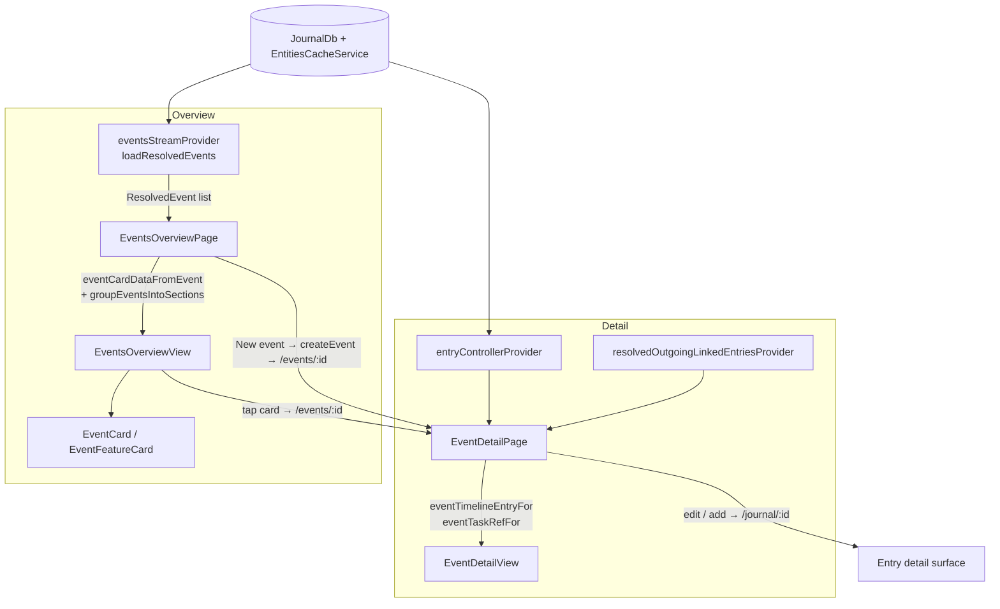

# Events

A first-class home for **events** — the meaningful moments (a birthday, a trip, a
wedding, an upcoming race) you want to remember and revisit, not just another
row in the logbook. The feature promotes events from a bare journal entry type
to their own destination with a memory-forward overview and a photographic
detail page.

Gated behind the `enableEventsFlag` config flag (Settings → Advanced → Flags →
"Enable Events"). When on, an **Events** destination appears in navigation
(under *More* on mobile, as a sidebar item on desktop) alongside the existing
event entry-type creation.

## Why an entity, not a Task subtype

An event stays its own `JournalEntity.event` (`EventData`) — it is *not* a Task
subtype. It reuses the generic infrastructure that tasks happen to use rather
than inheriting task semantics:

- **Timeline** → the event's outgoing `EntryLink`s (photos, notes, audio),
  resolved via `resolvedOutgoingLinkedEntriesProvider`.
- **Associated tasks** → linked `Task` entries (prep / follow-up), surfaced in
  their own section instead of subtyping.
- **Cover art** → `EventData.coverArtId` / `coverArtCropX`, mirroring the
  Task/Project cover-art pattern.
- **Summary** → the latest linked AI response, falling back to the event's own
  note.

This keeps the agent, knowledge-graph, and task-list code free of "tasks that
are really events" special cases.

## Architecture

The visual layer is pure and deterministic: presentational widgets render plain
view models (`event_view_data.dart`). Pages own the glue — they watch providers,
apply the locale-dependent labelling/grouping the view models can't, and feed
the result to the widgets. The pure mapping/grouping logic lives in
`state/event_view_mapping.dart` and is unit-tested in isolation.

### Overview

`EventsOverviewView` is a photo-led wall: a width-filling responsive grid of
`EventCard`s, with the *Upcoming* section promoted to a full-bleed
`EventFeatureCard` hero (which degrades to a vertical card on phones). A search
bar and category-filter chips sit in the header; the primary "New event" action
is a header button on wide layouts and a FAB on phones.

`groupEventsIntoSections` splits resolved cards into a featured **Upcoming**
section (events dated after now, soonest first) followed by past events grouped
by year, newest first.

### Detail

`EventDetailView` leads with a capped photographic hero (cover, title,
when/where, category, rating over a strong scrim), then an AI summary card (the
newest linked `AiResponseEntry` by `meta.dateFrom`, else the event note), a
vertical timeline of linked entries (lead photo + supporting cluster + caption,
notes, voice notes), and a linked-tasks section. On wide screens the body splits
into a main column (summary + timeline) and a tasks rail; on phones it stacks.

Each timeline row carries the source entry's id and is tappable when the page
wires `onOpenTimelineEntry` (it beams to `/journal/<entryId>`); the trailing
"open" chevron renders only when that handler is present, so the affordance
always matches the behavior.

#### Inline editing

The detail page is a full editor, not a viewer — nothing bounces to the old
entry form. `EventDetailView` is presentational and surfaces every mutation as a
callback; `EventDetailPage` wires them to `EntryController` and the shared
pickers/create flows:

- **Title** — tap to swap in a borderless field; commit on submit/blur →
  `updateEventTitle`.
- **Category / Status** — the hero pills open `showCategoryPicker` /
  `showEventStatusPicker` → `updateCategoryId` / `updateEventStatus`. The
  category pill shows a "set category" placeholder when none is assigned yet.
- **Rating** — the hero stars are interactive → `updateRating`.
- **Cover** — while the event has no cover, an "add cover photo" action opens the
  create-entry menu; the first linked photo then becomes the cover automatically.
- **Add to timeline / Add task** — open the shared `CreateEntryModal` scoped to
  the event (`linkedFromId`) / `createTask(linkedId:)`, so new notes, photos,
  audio and tasks link straight back.
- **Delete** — the overflow menu confirms via the standard delete sheet →
  `delete(beamBack: true)`.

When a callback is null the corresponding control is read-only (or hidden), so
the same widget renders cleanly in screenshots and tests. Empty events still
render the Timeline and Tasks section scaffolding with tappable "add" hints
rather than a blank void.

## Files

| Path | Role |
| --- | --- |
| `ui/model/event_view_data.dart` | Pure presentation view models. |
| `ui/widgets/event_cover_image.dart` | Cover image: crop + scrim variants + category-tinted fallback. |
| `ui/widgets/event_overlay_pill.dart` | Translucent pill for chrome over a cover. |
| `ui/widgets/event_card.dart` | Overview card + cover overlay + meta/footer. |
| `ui/widgets/event_feature_card.dart` | Full-bleed featured hero (→ vertical card when narrow). |
| `ui/widgets/events_overview_view.dart` | Overview layout: header, search, chips, sections, grid. |
| `ui/widgets/event_detail_view.dart` | Detail layout: inline-editable hero, summary, timeline, tasks. |
| `ui/widgets/event_status_picker.dart` | `showEventStatusPicker` modal + `eventStatusLabel` helper. |
| `state/event_view_mapping.dart` | Pure entity→view-model mapping, date labels, grouping. |
| `state/events_controller.dart` | `eventsStreamProvider` + `loadResolvedEvents` (DB → resolved events). |
| `ui/pages/events_overview_page.dart` | Route page: provider → localized sections → view. |
| `ui/pages/event_detail_page.dart` | Route page: event + links → `EventDetailData` → view. |

Navigation is registered in `lib/beamer/locations/events_location.dart`
(`/events`, `/events/:eventId`), `lib/beamer/beamer_delegates.dart`,
`lib/services/nav_service.dart`, and `lib/beamer/beamer_app.dart`.

## Localization

User-visible strings are localized via `context.messages`: `navTabTitleEvents`,
`eventsPageTitle`, `eventsSearchHint`, `eventsNewEvent`, `eventsFilterAll`,
`eventsSectionUpcoming`, `eventsSummaryTitle`, `eventsTimelineSection`,
`eventsTasksSection`, `eventsAddLabel`, `eventsRegenerateSummary`,
`eventsVoiceNote`, `eventsTitleHint`, `eventsAddCoverPhoto`, `eventsDeleteEvent`,
`eventsTimelineEmpty`, `eventsTasksEmpty`. (The event status picker reuses
`EventStatus.label`; the category picker reuses `habitCategoryLabel`.)

## Testing

The pure layers carry the bulk of coverage: `event_view_mapping_test`
(grouping, date labels, entity→view-model mapping for every timeline/task kind)
and the widget tests for each presentational widget. `events_controller_test`
covers DB query + cover/category resolution; the page tests cover the
provider-driven glue (sections, filtering, loading/error states). Screenshots
of the surfaces are produced on demand with the `app-screenshots` workflow.
