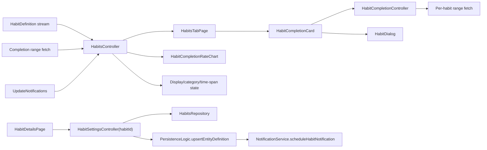
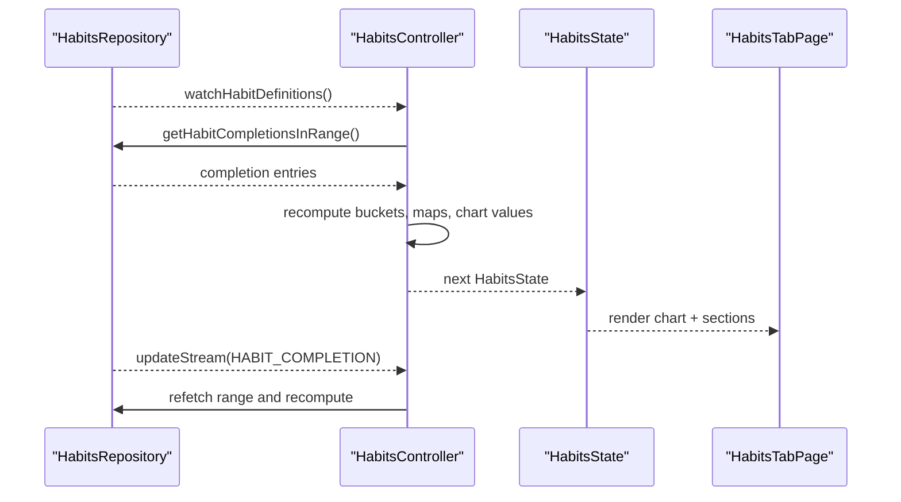
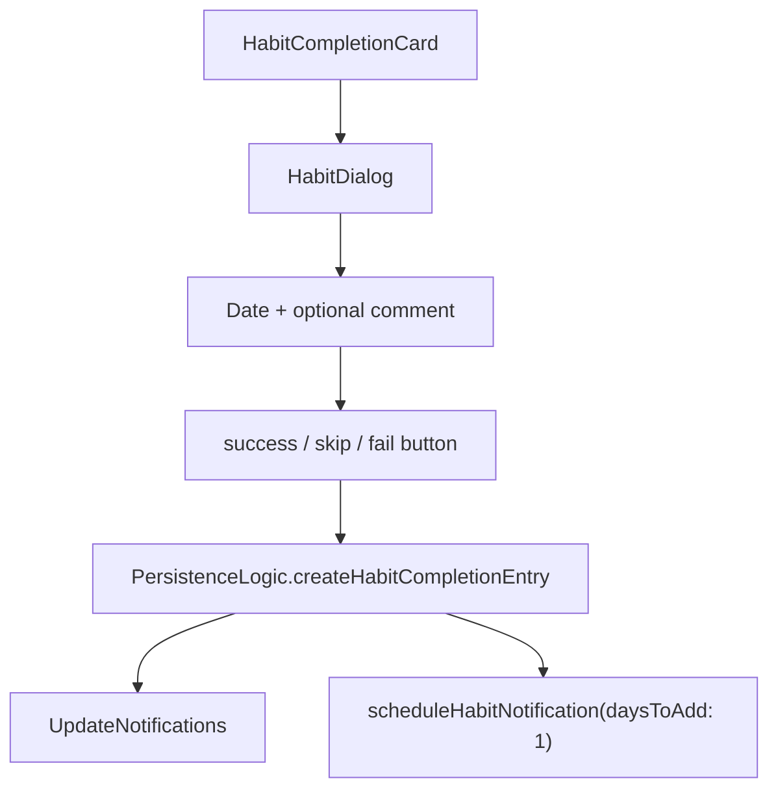
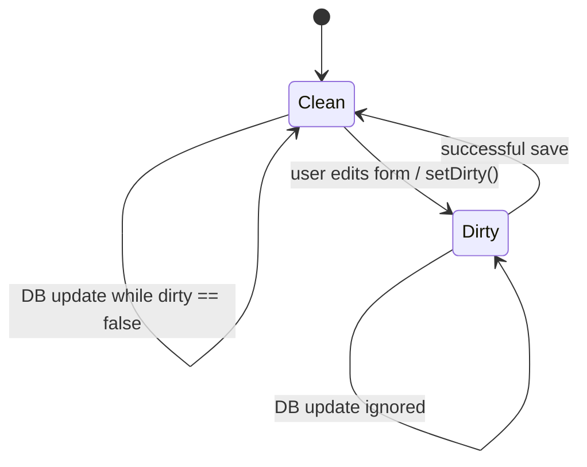

# Habits Feature

The `habits` feature sits on top of two different records:

- `HabitDefinition`, which describes the recurring thing
- `HabitCompletionEntry`, which records what happened on a concrete day

Most of the feature exists to reconcile those two streams into "what should the user see right now?" That is why the code is much more about derivation than about CRUD.

## What This Feature Owns

At runtime, the feature owns:

1. the habits tab and its derived sections (`openNow`, `pendingLater`, `completed`)
2. completion-rate chart state and day-level breakdowns
3. per-habit completion history strips on each card
4. habit settings state for create/edit flows
5. category and dashboard assignment from the habit settings form
6. completion capture via the habit bottom sheet

It does not own every habit write path by itself.

- Read-side access is abstracted behind `HabitsRepository`.
- Habit-definition saves currently go through shared `PersistenceLogic`.
- Completion writes also go through shared `PersistenceLogic`.
- Notification scheduling lives in `NotificationService`.

That split is deliberate. Habits get a focused read model, but writes still pass through the shared persistence pipeline that already knows how to stamp metadata, emit update notifications, and coordinate scheduling.

## Code Map

```text
lib/features/habits/
├── repository/
│   └── habits_repository.dart
├── state/
│   ├── habit_completion_controller.dart
│   ├── habit_settings_controller.dart
│   ├── habits_controller.dart
│   └── habits_state.dart
└── ui/
    ├── habits_page.dart
    └── widgets/

Related code outside this folder:
lib/features/settings/ui/pages/habits/
lib/pages/create/complete_habit_dialog.dart
lib/widgets/charts/habits/
```

That "related code" matters. The habits tab lives in this feature, but the settings pages are mounted under the broader settings feature, and the completion dialog is a shared create-flow surface outside `lib/features/habits/`.

## Runtime Architecture



There are two different read models on purpose:

- `HabitsController` owns the whole tab-level query model.
- `HabitCompletionController` owns one habit card's history strip for a specific date range.

That keeps the tab state coherent without turning every card refresh into a full-page recomputation.

## Core Data Model

`HabitDefinition` carries the durable configuration:

- `name` and `description`
- `habitSchedule`
- `active`, `private`, `priority`
- `activeFrom` and `activeUntil`
- `categoryId` and `dashboardId`
- optional `autoCompleteRule`

`HabitCompletionData` carries the event-side record:

- `habitId`
- `dateFrom` / `dateTo`
- optional `completionType`

The important modeling choice is that completion is append-only journal data, not a mutable field on the definition. That makes history cheap to preserve and lets the UI answer range questions without mutating the definition itself.

### Schedule Reality Today

The model supports `daily`, `weekly`, and `monthly` schedules, but the current habits UI is effectively daily-first:

- new habits are created with `HabitSchedule.daily(requiredCompletions: 1)`
- the settings page only exposes `showFrom` and `alertAtTime` for daily habits
- `showHabit()` only checks the daily `showFrom` time when deciding whether a habit belongs in `openNow` or `pendingLater`

So the data model is more ambitious than the current editing surface. The README should reflect that honestly instead of pretending the weekly/monthly UI already exists here.

## Repository Layer

`HabitsRepository` is the read boundary around `JournalDb` plus `UpdateNotifications`.

It currently provides:

- `watchHabitDefinitions()`
- `watchHabitById()`
- `getHabitCompletionsInRange()`
- `getHabitCompletionsByHabitId()`
- `watchDashboards()`
- `updateStream`

In practice:

- definition streams react to `habitsNotification` and `privateToggleNotification`
- dashboard streams react to `dashboardsNotification` and `privateToggleNotification`
- completions are fetched by range, then refreshed when update notifications arrive

The repository also exposes `upsertHabitDefinition()`, but the current settings save path does not call it. `HabitSettingsController.onSavePressed()` writes through `PersistenceLogic.upsertEntityDefinition()` instead. So the repository is currently a read-heavy abstraction, not the single write gateway for the feature.

## Main Tab Controller

`HabitsController` is the habits tab's query engine.

It is `keepAlive`, and that choice matches the code:

- the tab stores display filter state
- it stores category selections
- it stores search text and time-span selections
- it caches derived completion maps and chart inputs

Throwing that away on every tab switch would mean redoing work and resetting UI state the user just configured.

### What it actually derives

From active habit definitions plus completion entries in the selected range, it computes:

- `completedToday`
- `successfulToday`
- `openHabits`
- `openNow`
- `pendingLater`
- `completed`
- `successfulByDay`
- `skippedByDay`
- `failedByDay`
- `allByDay`
- `shortStreakCount`
- `longStreakCount`
- chart day labels and `minY`

One important grounding detail: the controller immediately filters definitions to `habit.active == true`. Archived habits still exist in settings and storage, but the main tab only derives from active definitions.

### Refresh lifecycle



The controller does not run a timer for "open now" logic. Instead, it recomputes when:

- definitions change
- habit completion notifications arrive
- the time span changes
- the selected category set changes
- the tab becomes visible again through `VisibilityDetector`

That last part is worth calling out. `showHabit()` depends on `DateTime.now()`, so visibility-triggered recomputation is the feature's lightweight answer to "time passed while the tab was off-screen." It refreshes the due/later split without keeping a background ticker alive.

### Search vs. category filtering

The current implementation splits filtering in two places:

- category filtering happens in `HabitsController`
- text filtering happens in `HabitsTabPage`

That is easy to miss if you only read the state shape. The controller stores `searchString`, but the page applies it over `openNow`, `pendingLater`, and `completed` by matching `name` and `description`.

## Chart and Day Breakdown

`HabitCompletionRateChart` is driven entirely from `HabitsState`.

It renders three layered series:

- successful
- successful + skipped
- successful + skipped + failed

Tapping the chart sets `selectedInfoYmd`, which updates the summary row above the chart with:

- success percentage
- skipped percentage
- recorded fail percentage

That selected day is cleared with a 15-second debounce in the controller. The chart is interactive, but it is intentionally not sticky forever.

The chart can also toggle between a zero-based Y axis and a cropped minimum Y value when the computed minimum is high enough to make that useful.

## Per-Card Completion History

Each `HabitCompletionCard` asks `HabitCompletionController` for a habit-specific range and renders a day strip.

That controller:

- fetches completions only for one habit ID and range
- listens to `updateStream`
- refreshes only when the affected IDs include that habit ID

That narrower refresh path is the main reason this controller exists separately from `HabitsController`.

The strip itself is synthesized day by day:

- recorded completion entries overwrite the day's status
- active days without a recorded entry stay `open`
- the final result is a compact history view used both for scanning and for tapping into backfilled completions

## Completion Flow

`HabitCompletionCard` opens `HabitDialog`, which is the actual write surface for success, skip, and fail.



Two grounded details here matter:

- backfilled completions are supported because the dialog lets the user choose the effective date
- if the habit has a `dashboardId`, the dialog shows the related dashboard behind the bottom sheet

That second choice is not decorative. It makes the completion moment contextual: the user can see the related dashboard while deciding how to record the habit.

## Settings Flow

The create/edit state lives in `HabitSettingsController`, but the screens themselves live under `lib/features/settings/ui/pages/habits/`.

The controller is a Riverpod family keyed by `habitId`, which lets the same code handle both:

- create flow with a new UUID
- edit flow with an existing definition stream

### Dirty-state synchronization



This is one of the key reasons the settings controller exists at all.

- When the form is clean, incoming DB updates can replace the in-memory definition.
- Once the form is dirty, the controller stops applying external updates.

That prevents the classic form bug where a live stream rewrites the field the user is typing into.

### What the settings screen actually exposes

The current details page allows editing:

- name
- description
- category
- dashboard
- priority
- private flag
- archived flag
- active-from date
- daily `showFrom`
- daily `alertAtTime`

Save behavior is also grounded in the code:

- validate form
- copy form fields into the `HabitDefinition`
- write through `PersistenceLogic.upsertEntityDefinition()`
- reset `dirty`
- schedule the habit notification through `NotificationService`

Delete is a soft delete via `deletedAt`, not a hard remove.

## Current Constraints And Reality Checks

- The model has `autoCompleteRule`, and the settings controller still has rule-removal helpers, but the autocomplete widget is currently commented out on the details page.
- `shortStreakCount` and `longStreakCount` are still computed in `HabitsController`, but `HabitStreaksCounter` currently renders only "`X out of Y habits completed today`". The streak text is commented out.
- Text search is local page filtering, not repository querying.
- The "due now" split is based only on daily `showFrom` and current clock time.

Those are not flaws in the README. They are the current implementation boundaries, and the docs should say so plainly.

## Why It Is Structured This Way

Habits look simple until the UI needs to answer questions like:

- what is due right now versus later today?
- what happened over the last 7 or 14 days?
- what percentage of active habits were completed on a given day?
- which single habit card needs to refresh after one new completion?

Those are derived-state questions, not just persistence questions.

So the architecture leans into that:

- repository for focused reads
- a keep-alive page controller for whole-tab derivation
- a smaller per-card controller for one habit's history strip
- shared persistence services for writes, notifications, and metadata stamping

That keeps the UI declarative, keeps time-sensitive logic out of widget trees, and avoids forcing every habit interaction through one giant monolithic state object.
