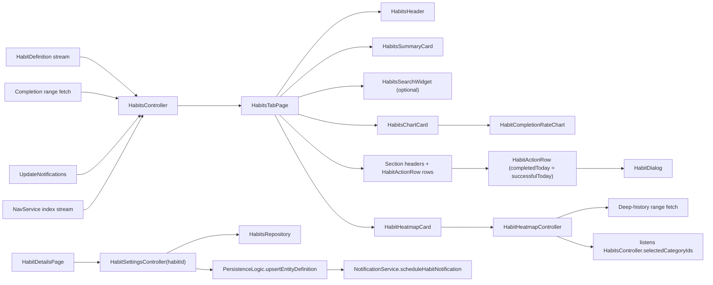
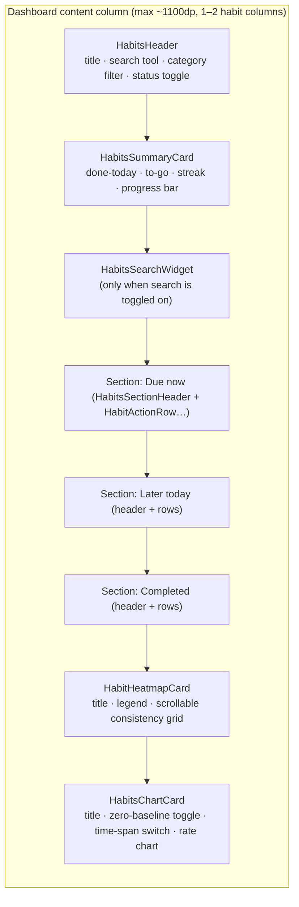
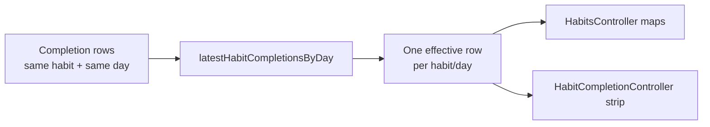
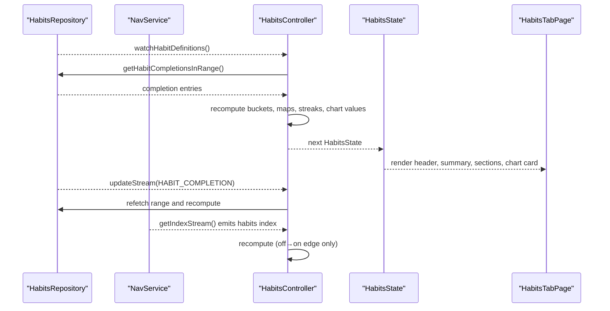
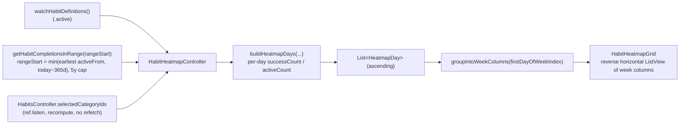
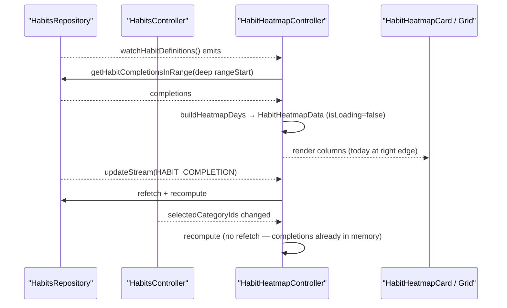
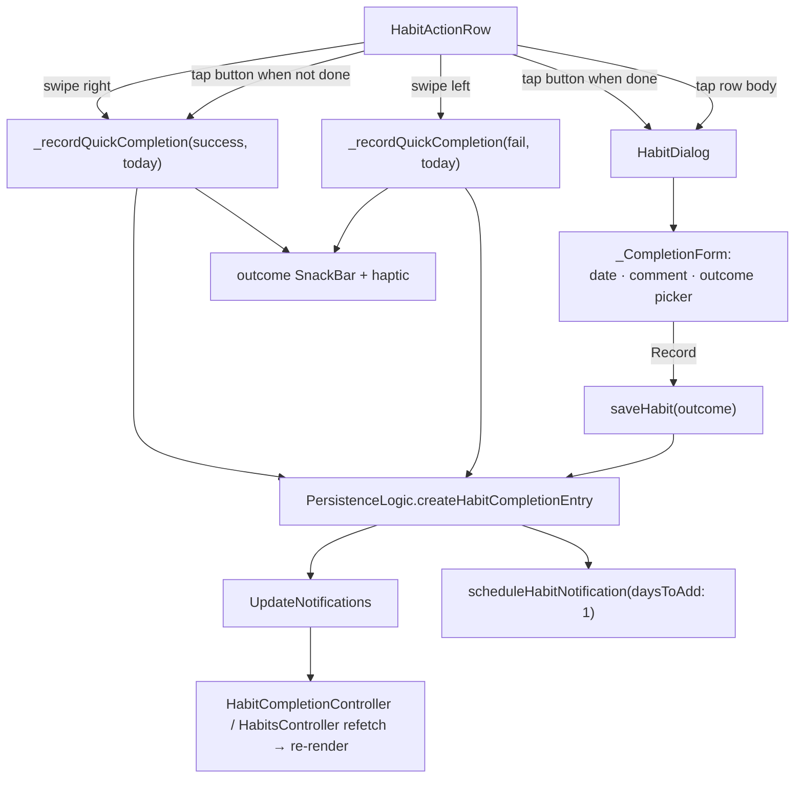
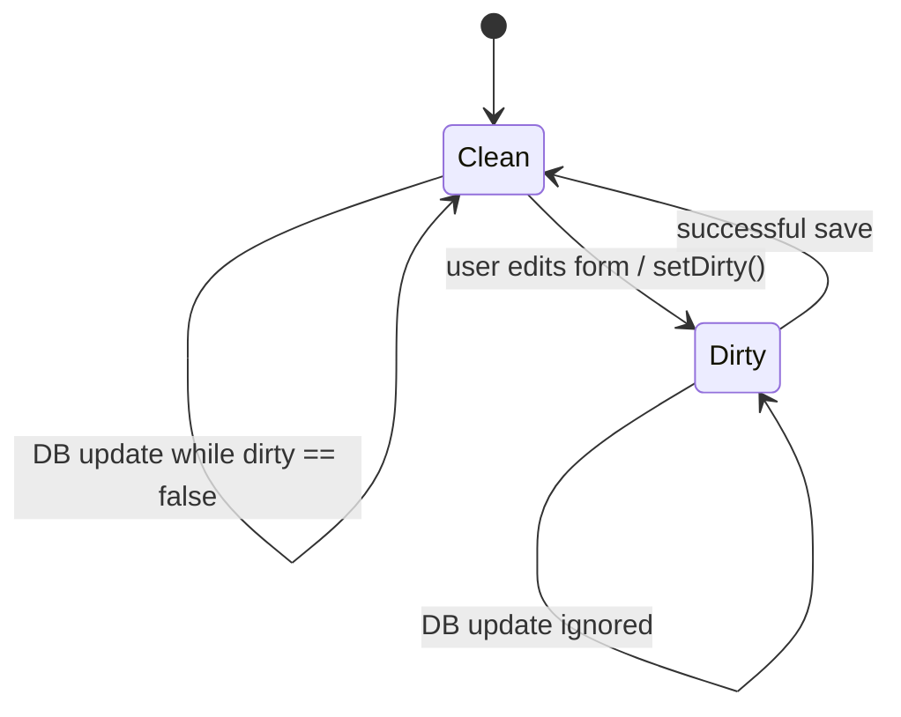

# Habits Feature

The `habits` feature sits on top of two different records:

- `HabitDefinition`, which describes the recurring thing
- `HabitCompletionEntry`, a `JournalEntity` variant that wraps a `HabitCompletionData` payload to record what happened on a concrete day

Most of the feature exists to reconcile those two streams into "what should the user see right now?" That is why the code is much more about derivation than about CRUD.

## What This Feature Owns

At runtime, the feature owns:

1. the habits tab and its derived sections (`openNow`, `pendingLater`, `completed`)
2. the gain-framed daily summary card (done-today count, "to go" caption, streak badge, progress bar)
3. the combined **consistency heatmap** — a scrollable, deep-history calendar of per-day completion intensity across all habits
4. completion-rate chart state, the time-span switch, and day-level breakdowns
5. quick completion capture (swipe + one-tap button) and the detailed completion dialog
6. habit settings state for create/edit flows
7. category and dashboard assignment from the habit settings form

The tab's habit rows are lean **action rows** (`HabitActionRow`): icon, name, swipe, one-tap complete — no per-row history. Per-day history reads from the heatmap instead. The older per-row history strip still exists, but only inside the dashboard habit chart (`HabitCompletionCard`, see [Dashboard Per-Habit History](#dashboard-per-habit-history)).

It does not own every habit write path by itself.

- Read-side access is abstracted behind `HabitsRepository`.
- Habit-definition saves currently go through shared `PersistenceLogic`.
- Completion writes also go through shared `PersistenceLogic`.
- Notification scheduling lives in `NotificationService`.

That split is deliberate. Habits get a focused read model, but writes still pass through the shared persistence pipeline that already knows how to stamp metadata, emit update notifications, and coordinate scheduling.

## Surfaces And Elevation Language

The tab speaks the same calm "card-on-canvas" elevation language as the Time Analysis surface, single-sourced in the design-system theme layer:

- `dsPageSurface(context)` — the page canvas behind everything (`HabitsTabPage`'s `Scaffold` background)
- `dsCardSurface(context)` — the elevated card/row surface, always a step lighter than the page

Both live in `lib/features/design_system/theme/ds_surface_elevation.dart`. They swap which `background` level is "page" vs "card" by `Theme.brightness`, because the background ramp runs in opposite directions per theme: in dark mode `level02` (#222222) is lighter than the `level01` (#181818) base, but in light mode `level02` (#F1F4F3) is *darker* than the white `level01`. Reading one fixed token for both would recess the cards in light mode. The swap keeps "cards lighter than the page" true either way.

`insights_surfaces.dart` no longer owns this logic — `insightsPageSurface` / `insightsCardSurface` are now thin aliases that delegate to the shared `ds*Surface` helpers, so Habits and Time Analysis cannot drift apart.

## Code Map

```text
lib/features/habits/
├── repository/
│   └── habits_repository.dart                  # Repository interface and implementation
├── state/
│   ├── heatmap/
│   │   ├── habit_heatmap_data.dart               # Pure: HeatmapDay, buildHeatmapDays, groupIntoWeekColumns
│   │   └── habit_heatmap_controller.dart         # Deep-history heatmap controller (keepAlive)
│   ├── habit_completion_controller.dart         # Per-habit completion history controller (dashboard card)
│   ├── habit_settings_controller.dart           # Habit settings form state (freezed)
│   ├── habits_controller.dart                   # Main habits page state controller
│   └── habits_state.dart                        # Freezed state class with helpers (activeBy, totalForDay)
└── ui/
    ├── habits_page.dart                         # Main habits tab page (HabitsTabPage)
    └── widgets/
        ├── heatmap/
        │   ├── habit_heatmap_card.dart           # Card shell: title + legend + grid + empty state
        │   └── habit_heatmap_grid.dart           # Week-column × weekday-row scrollable grid
        ├── habit_action_row.dart                 # Shared lean action row: swipe, name, one-tap, optional history slot
        ├── habit_category.dart                  # Category display widget
        ├── habit_completion_card.dart            # Dashboard-only: HabitActionRow + per-day history strip
        ├── habit_completion_color_icon.dart      # Completion status icon
        ├── habit_dashboard.dart                  # Dashboard integration widget
        ├── habits_chart_card.dart                # Completion-rate chart card (title + time-span + zero-baseline)
        ├── habits_filter.dart                    # Category pie filter (opens multi-picker)
        ├── habits_header.dart                    # Title + search tool button + filter + status toggle
        ├── habits_search.dart                    # Habit search field
        ├── habits_section_header.dart            # Section label + count pill ("Due now", …)
        ├── habits_summary_card.dart              # Daily KPI summary card (done / to go / streak / progress)
        ├── habits_tool_button.dart               # Circular token-styled icon toggle (search)
        └── status_segmented_control.dart         # Status filter via shared DsSegmentedToggle

Related code outside this folder:
lib/features/design_system/theme/ds_surface_elevation.dart   # dsPageSurface / dsCardSurface
lib/features/settings/ui/pages/habits/                       # create/edit screens
lib/pages/create/complete_habit_dialog.dart                  # HabitDialog completion surface
lib/widgets/charts/habits/                                   # HabitCompletionRateChart, HabitResult
lib/widgets/misc/timespan_segmented_control.dart             # TimeSpanSegmentedControl
```

That "related code" matters. The habits tab lives in this feature, but the settings pages are mounted under the broader settings feature, the completion dialog is a shared create-flow surface outside `lib/features/habits/`, and the chart + `HabitResult` model live under the shared charts widgets.

## Runtime Architecture



There are three different read models on purpose:

- `HabitsController` owns the whole tab-level query model (buckets, summary, chart, streaks).
- `HabitHeatmapController` owns the combined consistency heatmap over a multi-year range.
- `HabitCompletionController` owns one **dashboard** habit card's history strip for a specific date range (`HabitCompletionCard`, reached from `DashboardHabitsChart`, not the tab).

That keeps the tab state coherent without turning every card refresh into a full-page recomputation, and keeps the heatmap's deep fetch off the tab's completion hot path.

## Page Composition

`HabitsTabPage` is a `CustomScrollView` built from **three slivers**, an editorial layout that uses the window width without stranding the reading content. The reading content (header, summary, single-column habit list, chart) sits in a centred column capped at `maxReadingWidth = 820`: once the window clears that plus side padding, the horizontal padding becomes `(width - 820) / 2`, otherwise `tokens.spacing.step6`. Between the list and the chart, the **consistency heatmap breaks out to the full window width** (its own sliver, `step6` padding only) so a wide screen shows more history — the width-using centrepiece the user asked for, while the action content stays a comfortable column. The habit list is single-column (`Column(stretch)` of `HabitActionRow`s — no orphan rows). The `Scaffold` background is `dsPageSurface(context)`.



The grouped sections only render when the relevant bucket is non-empty **and** the active `displayFilter` selects it (or the filter is `all`). When the filter is `all`, each visible bucket is preceded by a `HabitsSectionHeader` (a bold subtitle label plus a quiet count pill); otherwise a single filtered bucket is shown without a header (just top spacing). The action list is followed by the dashboard band: the scrollable consistency heatmap and then the completion-rate chart card (both at the bottom, action-first).

Each habit row is a `HabitActionRow` keyed by habit id, with `completedToday` passed in from the controller's `successfulToday` set (success **or** skip today) — *not* `completedToday` (which also includes a recorded `fail`), so a failed-today habit still reads as not-done while bucket placement is unchanged.

### Header

`HabitsHeader` is the calm title-plus-controls band that mirrors the Time Analysis surface:

- the page title (`settingsHabitsTitle`) on the left
- a `HabitsToolButton` (circular, token-styled icon toggle) that flips `showSearch`
- `HabitsFilter` — the category pie-ring `IconButton` that opens the category multi-picker and commits the whole selection on Apply via `setSelectedCategoryIds`
- below the row, the `HabitStatusSegmentedControl` (due / later / done / all) in a horizontal `SingleChildScrollView` so its four segments never overflow a narrow phone

The status control is the shared `DsSegmentedToggle`, so it speaks the same visual language as the Time Analysis chart-mode switch and the Daily OS plan-view toggle instead of a default-Material `SegmentedButton`.

### Summary Card

`HabitsSummaryCard` is the daily KPI card — the analogue of the Time Analysis "TOTAL" card — and it answers "how am I doing today?" at a glance. It surfaces three things the controller already computes but that no widget rendered before this card:

- **Gain-framed done count.** The completed-today count carries the accent ink (the win the eye lands on), shown as a `"{done} / {total}"` fraction so the big numeral can't be misread; a caption on its own line beneath reads `"{n} to go"` (`habitsToGoCount`) while work remains, or `"All done today"` (`habitsAllDoneToday`) when finished — momentum framing, not a deficit.
- **Streak pill.** A flame chip in a quiet pill showing the longest active streak. It prefers the 7-day streak (`longStreakCount`, the bigger win), falls back to the 3-day streak (`shortStreakCount`), and otherwise nudges with `habitsStartStreakToday`. The pill sizes to its content (one line) while the fraction takes the remaining width. This is where the previously-unused `shortStreakCount` / `longStreakCount` reach the screen — surfacing "don't break the chain" makes the habit loop's reward visible (per-habit streaks additionally live on each row's chip).
- **Progress bar.** A token-styled quiet track with an accent fill at the completion fraction (`done / total`), so the day's progress reads both numerically and visually (low-vision support).

## Core Data Model

`HabitDefinition` carries the durable configuration:

- `name` and `description`
- `habitSchedule`
- `active`, `private`, `priority`
- `activeFrom` and `activeUntil`
- `categoryId` and `dashboardId`
- optional `autoCompleteRule`

`HabitCompletionData` is the data payload inside a `HabitCompletionEntry`. It carries the event-side record:

- `habitId`
- `dateFrom` / `dateTo`
- optional `completionType`

The important modeling choice is that completion is append-style journal data, not a mutable field on the definition. A user can still record the same habit/day more than once. The durable contract is **last write wins per habit/day**: read models collapse repeated `HabitCompletionEntry` rows by `(habitId, dateFrom.ymd)` and keep the entry with the newest metadata write timestamp before deriving UI state.



That resolver is intentionally pure and covered by both example tests and Glados properties. It protects the tab-level maps, streak inputs, card history strips, repository reads, and direct `JournalDb` habit completion reads from database row-order differences when multiple writes share the same effective day.

### Schedule Reality Today

The model supports `daily`, `weekly`, and `monthly` schedules, but the current habits UI is effectively daily-first:

- new habits are created with `HabitSchedule.daily(requiredCompletions: 1)`
- the settings page only exposes `showFrom` and `alertAtTime` for daily habits
- `showHabit()` only checks the daily `showFrom` time when deciding whether a habit belongs in `openNow` or `pendingLater`

So the data model is more ambitious than the current editing surface. The README reflects that honestly instead of pretending the weekly/monthly UI already exists here.

## Repository Layer

`HabitsRepository` is the read boundary around `JournalDb` plus `UpdateNotifications`.

It currently provides:

- `watchHabitDefinitions()`
- `watchHabitById()`
- `getHabitCompletionsInRange()`
- `getHabitCompletionsByHabitId()`
- `watchDashboards()`
- `updateStream`

In practice:

- definition streams react to `habitsNotification` and `privateToggleNotification`
- dashboard streams react to `dashboardsNotification` and `privateToggleNotification`
- completions are fetched by range, then refreshed when update notifications arrive

The repository also exposes `upsertHabitDefinition()`, but the current settings save path does not call it. `HabitSettingsController.onSavePressed()` writes through `PersistenceLogic.upsertEntityDefinition()` instead. So the repository is currently a read-heavy abstraction, not the single write gateway for the feature.

## Main Tab Controller

`HabitsController` is the habits tab's query engine.

It is `keepAlive`, and that choice matches the code:

- the tab stores display filter state
- it stores category selections
- it stores search text and the chart time span
- it caches derived completion maps and chart inputs

Throwing that away on every tab switch would mean redoing work and resetting UI state the user just configured.

### What it actually derives

From active habit definitions plus completion entries in the selected range, it computes:

- `completedToday`
- `successfulToday`
- `openHabits`
- `openNow`
- `pendingLater`
- `completed`
- `successfulByDay`
- `skippedByDay`
- `failedByDay`
- `allByDay`
- `shortStreakCount` (habits completed every day of the trailing 3-day window)
- `longStreakCount` (habits completed every day of the trailing 7-day window)
- chart day labels and `minY`

Streaks are derived by `countHabitsWithStreak`, which counts habits whose success-day set covers *every* day in the window — a single missing day disqualifies the habit. Skips and `null`-type completions count toward a streak the same as explicit successes; only an explicit `fail` (or a missing day) breaks it.

One important grounding detail: the controller immediately filters definitions to `habit.active == true`. Archived habits still exist in settings and storage, but the main tab only derives from active definitions.

### Refresh lifecycle



The controller does not run a timer for "open now" logic. Instead, it recomputes when:

- definitions change
- habit completion notifications arrive
- the time span changes
- the selected category set changes
- the habits tab becomes the active top-level tab again (off→on edge on `NavService.getIndexStream()`)

That last part is worth calling out. `showHabit()` depends on `DateTime.now()`, so the tab-active recomputation is the feature's lightweight answer to "time passed while the tab was off-screen." It refreshes the due/later split (and refetches first, so a midnight rollover is reflected) without keeping a background ticker alive. The trigger is wired by subscribing to `NavService.getIndexStream()` inside `HabitsController.build()` and comparing the emitted index to `NavService.habitsIndex` in `_handleNavIndex` — the controller tracks the previous active state and only recomputes on the inactive→active edge, so a stream of repeated active emissions costs nothing.

### Search vs. category filtering

The current implementation splits filtering in two places:

- category filtering happens in `HabitsController` (applied during `_determineHabitSuccessByDays`)
- text filtering happens in `HabitsTabPage`

That is easy to miss if you only read the state shape. The controller stores `searchString` and the category selection, but the page applies the text filter over `openNow`, `pendingLater`, and `completed` by matching `name` and `description` — and only when `showSearch` is on.

## Chart and Day Breakdown

The completion-rate chart lives inside `HabitsChartCard` at the bottom of the page — a titled, bordered `dsCardSurface` card. The card supplies the title (`habitsCompletionRateTitle`), the time-span switch, and the zero-baseline toggle; the chart (`HabitCompletionRateChart`) supplies a headline, a single trend line, and — when a day is tapped — that day's breakdown.

- **Time span** is a `TimeSpanSegmentedControl` over `[14, 30, 90]` days, always visible in the card header (no longer hidden behind a calendar toggle). Selecting a span calls `setTimeSpan`, which refetches the range and recomputes. `HabitsChartCard.timeSpans` is the single source for the offered windows. The chart also drives the day window for each dashboard row's history strip via the page's shared `rangeStart` / `rangeEnd`.
- **Zero-baseline toggle** only appears when `state.minY > 20` (i.e. the lowest day clears the 20% floor, where cropping the axis is actually meaningful). It flips `zeroBased`, switching between a zero-based Y axis and the cropped minimum.

### Headline, trend line, and stats

`HabitCompletionRateChart` is driven entirely from `HabitsState` through the pure `habitChartStats(state)` aggregator (`habit_chart_stats.dart`, unit-tested directly). From the per-day `successfulByDay` / `allByDay` maps it derives:

- **`dailyRates`** — each day's completion rate, `success / totalForDay`, clamped to 100 (the same `totalForDay` denominator the heatmap uses, so the two surfaces can't disagree);
- **`rollingAverage`** — the trailing 7-day mean of `dailyRates` (a partial window on the early days), the chart's hero line;
- **`currentAverage`** — the latest rolling value, shown as the big headline number;
- **`trendDelta`** — the last-7-days mean minus the prior 7, rendered as a tinted ±% chip and only once ≥14 days of data exist;
- **`pointsToGoal` / `isAtGoal`** — how far `currentAverage` is below the 80% target; the headline reads "`N` points from your 80% goal" (or "On track, above 80%"). This is a forward-looking, gain-framed companion to the average — deliberately **not** a pass/fail day count, which would contradict a healthy, climbing average;
- **laggard** (`laggardName` / `laggardKept` / `laggardActive`) — the single below-target habit that was active for at least half the window, gain-framed as "kept K of A". The half-window gate keeps a sparse or brand-new habit from being singled out.

The plot is one hero **rolling-average** line (`successColor`, curved, with a green→transparent gradient fill) over the raw daily rates drawn as faint same-green dots (so they read as the un-smoothed values the line averages), with the ≥80% "on track" zone shaded via a `HorizontalRangeAnnotation` and a dashed target line at 80%. The Y axis runs 0–100% (cropped to `state.minY` when the zero-baseline toggle is off); the X axis labels 3–4 dates inset from the edges; vertical gridlines are dropped. Above the plot sits the headline (big average + `7-day avg` label + points-to-goal + trend chip); the laggard "opportunity" line is a quiet `💡`-prefixed footnote **below** the chart, so the lowest performer never sits next to and undercuts the hero number.

Tapping the chart sets `selectedInfoYmd`, which swaps the headline for that day's success / skipped / recorded-fail percentages — computed by the pure `dayPercentages` helper, which clamps the failed band to the remaining headroom (`100 - success - skipped`) so the three never sum above 100. The selected day clears on a 15-second debounce in the controller — interactive, but intentionally not sticky forever.

## Consistency Heatmap

The heatmap is the tab's history surface: one combined, GitHub-contributions-style calendar of **week columns × weekday rows**, fixed-size day cells, horizontally scrollable through deep history with today pinned to the right edge. Each cell is shaded by that day's **completion intensity** = (active habits with a `success` that day) / (habits active that day). It respects the tab's category filter and is deliberately decoupled from the chart's short time-span window.

### Data flow



The denominator reuses the tab's own convention — the union of `activeBy(ymd)` and habits with any recorded completion that day, exactly like `totalForDay` in `habits_state.dart` — so the heatmap can never disagree with the completion-rate chart. The numerator counts only `success` (the green "did it" signal); skips and fails raise the denominator but not the intensity. Days before any habit existed have a zero denominator and render a quiet neutral, never a miss. All of `habit_heatmap_data.dart` is pure (no Flutter, no wall clock — `today`/range come in as `YYYY-MM-DD` strings), so the bucketing and week-alignment math are unit-tested directly.

### Controller lifecycle



State is a plain `HabitHeatmapData` (`days` + `hasHabits` + `isLoading` + `streaksByHabit`), seeded `HabitHeatmapData.empty()`. After the first recompute the controller never republishes a loading state, so a background refresh never blanks the grid (stale-while-revalidate, the structural analogue of the dashboard card's `_lastResults`). `rangeStart` is recomputed from the earliest active habit, floored at a one-year minimum and capped at five years so a single ancient `activeFrom` can't produce a decade-wide grid. The same deep history feeds `currentStreaksByHabit` — each habit's current consecutive-kept-day streak (success or skip, ending today or yesterday) — which the page reads to render the per-row **streak chips**, so a habit's own chain isn't capped by the tab's short fetch window.

### Grid, colour, and accessibility

- **Rendering.** `HabitHeatmapGrid` is a pure widget: a fixed weekday-label gutter (Mon/Wed/Fri only — distinct initials, never the ambiguous Tue/Thu "T", placed at their rows for the region's first day) and a **month-label band** (one abbreviation at the first column of each month) above a horizontal `ListView.builder(reverse: true)` of week columns. `reverse: true` anchors today's column at the right edge on first paint and builds older columns lazily, so years of history cost nothing until scrolled to.
- **Colour.** Intensity is snapped to **four discrete buckets** by quartile (`heatmapFillColor`: `successColor` at alpha `0.42 / 0.62 / 0.81 / 1.0`) rather than a continuous ramp, so adjacent days stay distinguishable on the dark canvas and the lowest lit step is unmistakably green — the sanctioned data-viz shading pattern, shared by the cells and the card's five-swatch "Less → More" legend (`heatmapLegendIntensities`). Zero-intensity and pre-existence days are `decorative.level01`, never red. Today's cell carries a 2px `interactive.enabled` ring.
- **Accessibility.** Every in-range cell exposes a `Tooltip` (date · `n/m`) and a `habitHeatmapDaySemantic(date, done, total)` screen-reader label, so magnitude never depends on colour alone. The empty state (`habitsHeatmapEmpty`) shows only when the user has no habits at all; an empty category filter still renders a neutral grid rather than the placeholder.

## Dashboard Per-Habit History

The tab no longer renders a per-row history strip — that history now lives in the heatmap. The strip survives in one place: the **dashboard** habit chart (`DashboardHabitsChart → HabitCompletionCard`), where seeing one habit's chain over the dashboard's range is the point.

Both surfaces share one widget. `HabitActionRow` is the lean, presentational action row (swipe, category icon, priority star, name, an optional **streak chip**, a trailing one-tap button, and an optional `history` slot). On the tab the chip shows the habit's `currentStreak` (≥ 2) from the heatmap controller, and the trailing button is a hollow accent **"＋" ring** when the habit isn't done (unmistakably "tap to log") that becomes a green **check-circle** once done (tap to review, never a silent duplicate). The tab uses the row bare; `HabitCompletionCard` is a thin `ConsumerStatefulWidget` wrapper that watches `HabitCompletionController`, builds the `_HistoryStrip`, derives `completedToday` from the latest in-range result, and injects the strip into the row's `history` slot. So the swipe / quick-complete / dialog logic lives once, in `HabitActionRow`.

Each `HabitCompletionCard` asks `HabitCompletionController` for a habit-specific range and renders a read-only day strip.

That controller:

- fetches completions only for one habit ID and range
- listens to `updateStream`
- refreshes only when the affected IDs include that habit ID

That narrower refresh path is the main reason this controller exists separately from `HabitsController`. The card retains the last loaded `HabitResult` list (`_lastResults`) so changing the time span re-keys the provider without blinking the row to nothing (stale-while-revalidate); the cache is only dropped when the card is rebound to a different `habitId`.

The strip itself (`_HistoryStrip`) is synthesized day by day by `habitResultsByDay`:

- recorded completion entries overwrite the day's status
- if there are multiple entries for the same habit/day, the newest metadata write timestamp wins
- active days without a recorded entry stay `open`

### Read-only strip + colour-independent encoding

The strip is a glanceable record, **not** a control. It carries no per-cell tap targets — tapping anywhere on the row (or the complete button) opens the dialog, where any past day is backfilled via the date field. That keeps tiny tap targets from fighting the swipe gesture.

Each cell is a size-capped square (`_maxCell = 24`) laid out from the start, so the strip stays a quiet footprint instead of stretching into wide "pill bars" on desktop. On dense ranges the cells shrink, and the outcome glyph drops out below a legibility floor (`_glyphFloor = 14`).

State is encoded by colour **and** shape, never colour alone (`_cellAppearance`):

- **success** — the only saturated fill (`successColor`), `check_rounded` glyph
- **skip** — neutral grey (`background.level03`), `remove_rounded` glyph
- **fail** — a light tint (`alarm` at 32% alpha, never a solid red block), `close_rounded` glyph
- **open / not yet recorded** — the faintest neutral (`decorative.level01`), no glyph — so "not done yet" never reads as "failed"

The on-fill glyph ink is chosen by actual WCAG contrast ratio against the fill *composited over the card surface* (`_glyphInk`), not a naive `luminance > 0.5` test — the mid-tone fills would otherwise pick the lower-contrast ink.

### Accessibility

- Each cell exposes a semantic label via `habitDayStatusSemantic(habitName, statusWord)`, where `statusWord` is the localized outcome word (success / skip / fail / not recorded). So the glyph's meaning is conveyed non-visually too; the date tooltip is excluded from semantics to avoid doubling up.
- The trailing complete button is a 48dp circular target (`spacing.step9`), clearing the accessible minimum, with its own `habitCompleteSemanticLabel` button semantics.

## Completion Flow

Completions can be captured three ways from a `HabitActionRow` (the shared row used by both the tab and the dashboard card), all funnelling into the same `PersistenceLogic.createHabitCompletionEntry` write:

1. **Swipe** the row — right (`startToEnd`) records a **success**, left (`endToStart`) records a **missed/fail**. The `Dismissible` uses `confirmDismiss` to fire `_recordQuickCompletion` and then returns `false`, so the row snaps back and reflects the new state via its host's state — it is never removed from the list. A coloured `_SwipeActionBackground` (outcome colour + icon + label) makes the gesture's effect legible before the user commits.
2. **One-tap complete button** — when the habit is *not* done, the trailing 48dp button is a hollow accent **"＋" ring** that records **success today** directly via `_recordQuickCompletion` — visually distinct from a completed row so "tap to log" never reads as "already done". When the habit *is* already done it becomes a green check-circle that opens the dialog to review/adjust, never a silent duplicate.
3. **Row body / detailed dialog** — tapping the row body opens `HabitDialog` for the full capture (date, comment, outcome picker, linked dashboard).

The quick paths (swipe + button) fire light haptic feedback and confirm with a brief floating outcome `SnackBar` (the habit name plus a check/cancel icon) so the action is acknowledged instantly, before the provider round-trips and the tab re-renders (the habit moves between buckets / the heatmap recolours).



### The completion dialog

`HabitDialog` hosts `_CompletionForm`, the actual write surface for success, skip, and fail. The form shows the habit name, optional description, the date being recorded (`DateTimeField`), an optional comment, an **outcome segmented picker**, and a single primary **Record** button (`habitsRecordButton`).

- The outcome picker is a `DsSegmentedToggle<HabitCompletionType>` with **Success | Skip | Missed** in positive-first reading order, defaulting to `success` (the overwhelmingly common case), so the happy path is a single tap. The selected outcome drives both the Record button and the desktop Cmd+S shortcut.
- Backfilled completions are supported because the date field lets the user choose the effective date; picking a non-today date sets `_started` to the end of that day.
- If the habit has a `dashboardId` **and** the card was not opened from within that same dashboard, the dialog scrolls the linked dashboard **above** the form (the form is no longer floated over a transparent embed). When the card is rendered inside that dashboard (via `DashboardHabitsChart`, which passes `showLinkedDashboard: false`), the embed is suppressed — re-opening the dashboard the user is already viewing would be redundant — and the form aligns to the bottom on a transparent background. The flag is threaded `DashboardHabitsChart → HabitCompletionCard.showLinkedDashboard → HabitDialog.showLinkedDashboard`, and both the card's sheet background and the dialog's embed gate apply the same "only when it will actually show" rule.

## Settings Flow

The create/edit state lives in `HabitSettingsController`, but the screens themselves live under `lib/features/settings/ui/pages/habits/`.

The controller is a Riverpod family keyed by `habitId`, which lets the same code handle both:

- create flow with a new UUID
- edit flow with an existing definition stream

### Dirty-state synchronization



This is one of the key reasons the settings controller exists at all.

- When the form is clean, incoming DB updates can replace the in-memory definition.
- Once the form is dirty, the controller stops applying external updates.

That prevents the classic form bug where a live stream rewrites the field the user is typing into.

### What the settings screen actually exposes

The current details page allows editing:

- name
- description
- category
- dashboard
- priority (shown as a "Favorite" star toggle, matching the list row's star)
- private flag
- active flag (an "Active" visibility toggle; ON = visible, stored as `active`)
- active-from date
- daily `showFrom`
- daily `alertAtTime`

Save behavior is also grounded in the code:

- validate form
- copy form fields into the `HabitDefinition`
- write through `PersistenceLogic.upsertEntityDefinition()`
- reset `dirty`
- schedule the habit notification through `NotificationService`

Delete is a soft delete via `deletedAt`, not a hard remove.

## Current Constraints And Reality Checks

- The model has an optional `autoCompleteRule`, and `HabitSettingsState` carries an `autoCompleteRule` field, but that field is always initialized to `null` and never mutated by `HabitSettingsController`; no autocomplete editing widget is wired up — only a dead `// const HabitAutocompleteWrapper(),` reference remains at `lib/features/settings/ui/pages/habits/habit_details_page.dart:197`, and there is no `HabitAutocompleteWrapper` class anywhere in the codebase.
- Streaks **are now displayed**: `shortStreakCount` / `longStreakCount` surface in `HabitsSummaryCard`'s streak badge. (Previously these were computed but never rendered.)
- The tab's per-day history is the combined **consistency heatmap**; the per-row history strip now exists only on the **dashboard** habit chart. Both are **read-only** — backfilling a past day is done through the dialog's date field, not by tapping a cell.
- The heatmap shades by **success only** and uses the same `activeBy` ∪ recorded denominator as the chart. Weekly/monthly per-period targets (`requiredCompletions`) are still not surfaced — the heatmap measures daily success, not cadence.
- The chart **time span** lives in the chart card's header (`TimeSpanSegmentedControl`, `[14, 30, 90]`), not behind a calendar/visibility toggle. `state.showTimeSpan` is still in the state but no longer gates the switch.
- Text search is local page filtering (only when `showSearch` is on), not repository querying.
- The "due now" split is based only on daily `showFrom` and current clock time.

Those are not flaws in the README. They are the current implementation boundaries, and the docs say so plainly.

## Why It Is Structured This Way

Habits look simple until the UI needs to answer questions like:

- what is due right now versus later today?
- how am I doing today, and is a streak alive?
- what happened over the last 7, 14, or 30 days?
- what percentage of active habits were completed on a given day?
- which single habit card needs to refresh after one new completion?

Those are derived-state questions, not just persistence questions.

So the architecture leans into that:

- repository for focused reads
- a keep-alive page controller for whole-tab derivation
- a separate keep-alive heatmap controller for combined deep-history derivation (its own range, off the tab's hot path)
- a smaller per-card controller for one *dashboard* habit's history strip
- one shared `HabitActionRow` so swipe / quick-complete / dialog logic lives once, with history as an optional slot
- shared persistence services for writes, notifications, and metadata stamping
- a shared design-system elevation language so the calm card-on-canvas surfaces stay consistent with Time Analysis

That keeps the UI declarative, keeps time-sensitive logic out of widget trees, and avoids forcing every habit interaction through one giant monolithic state object.
