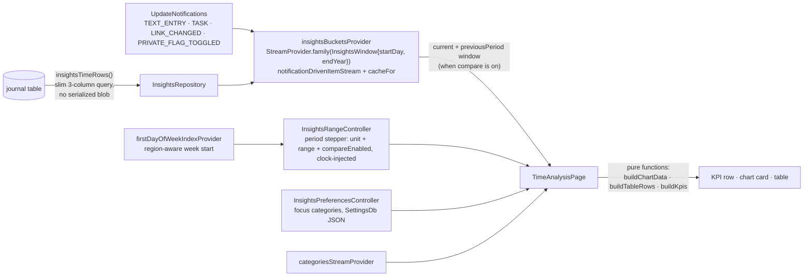
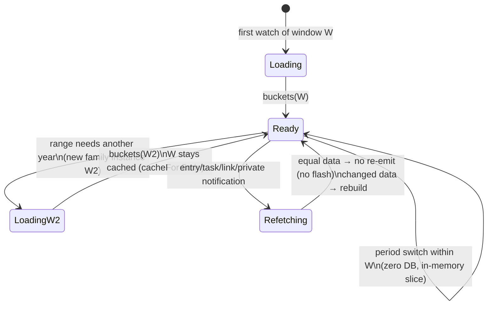

# Insights — Time Analysis

A desktop-only, full-screen time-analysis dashboard under the Daily OS tab
(route `/calendar/time`), opened from a sidebar sub-entry beneath the Daily
OS month calendar. It answers three questions —
*Where did my time go this week? How much time did I spend per category per
day? What is the cumulative vs. non-cumulative time spent?* — over 10k+ time
entries with instantaneous (sub-200ms, measured ~5ms) range switching.

## Architecture

Layering:

- **`logic/`** — pure, Flutter-free functions (`time_bucketing.dart`;
  `period_navigation.dart` for the stepper's calendar snapping;
  `range_presets.dart` for the fetch-window key) plus the chart color
  derivation (`chart_colors.dart`). Exhaustively property-tested with Glados.
- **`model/`** — hand-rolled immutable value types with deep equality
  (no codegen). Deep equality is load-bearing: an unchanged background
  refetch produces an equal `InsightsDayBuckets`, so Riverpod never
  re-notifies and the UI never flashes.
- **`repository/`** — thin mapping over `JournalDb.insightsTimeRows`
  (mixin `_JournalDbInsightsQueries`, part of `database.dart`).
- **`state/`** — providers; the page is the single consumer and passes
  plain values to dumb widgets.
- **`ui/`** — design-system tokens throughout; `fl_chart` for the stacked
  bar (daily) and pre-stacked cumulative area charts.

## Period navigation

The range is browsed period by period (with MTD/YTD shortcut pills for the
two most useful jumps). `InsightsRangeController`
holds an `InsightsPeriodSelection` — a granularity (`InsightsPeriodUnit`:
day / week / month / quarter / year) plus the resolved `InsightsRange` it
points at, and a `compareEnabled` flag (see *Comparison* below).
`period_navigation.dart` snaps a date to the containing period
(region-aware weeks; calendar month / quarter / year bounds) and shifts by
whole periods. Snapping (`periodContaining`) takes the first weekday;
shifting (`shiftPeriod`) does not — an aligned week stays aligned under a
±7-day move, so week stepping shifts the bounds directly and is independent
of the first weekday (which matters because it resolves asynchronously).
The `InsightsPeriodStepper` renders `‹ [unit ▾] label › MTD YTD`: the
dropdown re-derives the period for a new granularity (keeping the current
anchor), the chevrons step one period at a time, and forward is disabled
once the period reaches today. Every step is an in-memory slice within the
year window (below), so the dashboard updates with no database round trip.

**MTD / YTD shortcuts.** Two pills on the stepper row jump straight to the
current month-to-date / year-to-date via
`InsightsRangeController.selectToDate`, which sets the unit to month/year
and the range to `periodToDate` — period start through today inclusive,
rather than the full calendar period (so the chart isn't padded with empty
future days and avg/day divides by elapsed days only). A pill lights up
when the selection equals its to-date period; the period label shows the
actual day span (`Jun 1 – 10`, `Jan 1 – Jun 10`) instead of naming the
whole month/year. Stepping back from a to-date range lands on the full
previous period (the stepper's `shiftPeriod` re-snaps month/quarter/year).

**Region-aware week start.** Week periods (and the calendar grid) start on
the device region's first weekday — Monday across most of Europe, Sunday in
the US — rather than a fixed day. `period_navigation.dart` takes a
`firstDayOfWeekIndex` (`0 = Sunday` … `6 = Saturday`, default Monday) for
its week snapping; `InsightsRangeController` reads it from the app-wide
`firstDayOfWeekIndexProvider` (`utils/device_region.dart`, the same source
the Daily OS sidebar calendar uses). The provider is a `FutureProvider`
(native region lookup on macOS), so the controller `ref.read`s it once in
`build` (Monday until it resolves) and holds the index in a field —
**watching** would re-run `build` on resolution and discard any
step/jump/compare the user made in that window. A `ref.listen` re-anchors
instead: when the region resolves it re-derives the period under the new
first weekday **only while the user is still on the current period**,
preserving the unit and compare toggle and never clobbering navigation.

Tapping the period label opens the **calendar picker**
(`insights_period_picker.dart`, a Wolt modal sheet wrapping the
design-system `SidebarMonthCalendar`): the grid uses the same
`firstDayOfWeekIndex`, and picking a day calls
`InsightsRangeController.jumpTo`, which snaps to the period of the current
granularity that contains it. The sheet stays open and the dashboard
updates live behind the dimmed scrim, so you can browse days and watch the
data change before dismissing.

## Comparison

The stepper's Compare toggle flips `compareEnabled`. When on, the page
watches a second window for the controller's `previousComparisonRange` — the
period immediately before the current one, derived purely from the
already-aligned `state.range` via `shiftPeriod` (so it never re-snaps and
can't drift out of step with the current range, even if the first weekday
resolves after the range was built — the page used to re-derive it with a
Monday default and misaligned the comparison for Sunday/Saturday regions).
For a partial to-date range (MTD/YTD), `previousPeriod` truncates the
previous period to the same number of elapsed days — MTD compares against
the same days of last month, YTD against the same days of last year, never
a 10-day range against a full month.
The KPI
tiles render an `InsightsDeltaChip` (sign and color convey direction;
`insightsDeltaPercent` returns `null` for a zero baseline, shown as "new"),
and the per-category table swaps its share / average / bar columns for
**Previous** and **Δ%** columns. Both windows are ordinary in-memory slices,
so toggling compare and stepping stay database-free.

The chart joins the comparison too. `alignedPreviousTotals` projects the
previous period's per-bucket totals onto the current period's x-axis (extra
current buckets — a longer month — zero-fill; extra previous buckets drop),
and the daily bar chart becomes **grouped bars**: each bucket pairs the
current stacked-by-category bar with a single muted ghost bar for the
previous total. The daily/cumulative toggle hides while comparing (the
comparison is a per-bucket total view, where cumulative stacking would only
muddy it), the legend gains a *Previous* swatch, and the current-bar tooltip
appends a `Previous … Δ%` footer in the same accents as the delta chip.

## Data semantics

- **What counts as time:** non-deleted `JournalEntry` rows with
  `date_to > date_from`. `JournalAudio` is excluded (a recording made during
  a running timer would double-count — same rule as the Daily OS time
  history). There is **no minimum-duration floor**: the legacy 15-second
  floor in `workEntriesInDateRange` is a JournalEntry noise heuristic, not a
  totals semantic.
- **Category attribution:** the linked task's category wins, the entry's own
  category is the fallback (matches `actualTimeBlocksForEntries`). The SQL
  resolves the link with a correlated subquery (`ORDER BY t.date_from DESC,
  t.id LIMIT 1`) — never a joined fan-out, which would double-count entries
  with multiple incoming links.
- **Integer-seconds arithmetic:** `date_from`/`date_to` are stored as Unix
  seconds. `julianday()` on these columns returns NULL and silently drops
  every row; the duration guard is `j.date_to > j.date_from`.
- **Union-merge:** overlapping intervals within one (day, category) cell are
  merged before summing, so nested/parallel entries in the same category
  don't double-count. Overlaps *across* categories count toward each
  category (whole-day totals can exceed wall-clock; standard for
  category breakdowns).
- **Midnight splitting:** entries are split at local midnights using
  calendar-constructor arithmetic (`DateTime(y, m, d + 1)`), which is exact
  across 23h/25h DST days. Property tests assert duration conservation.
- **Day keys** are epoch-day ints derived through a UTC anchor — pure
  calendar indices, immune to DST offsets.
- **Private visibility:** the query gates entries AND linked-task
  attribution on the global `private` config flag (same idiom as
  `workEntriesInDateRange`); the provider refetches on
  `privateToggleNotification` and `linkNotification` (link create/unlink
  re-attributes time immediately). The v43 migration backfills the
  denormalized `journal.category` column from serialized JSON so
  pre-2024-07 history attributes correctly.

## Window caching & refresh

- The fetch window is **January 1st of the range-start year through the end
  of tomorrow, capped at January 1st after the range-end year** — a
  past-year period loads only its own year(s). The Riverpod family
  key is a value-equal `({startDay, endYear})` record; every period within
  one year shares one in-memory bucket cache, so range switching never
  touches the database (measured: all five period granularities in ~2-8ms
  on a 10k-entry year; cold fetch+bucketize ~35ms —
  `test/database/insights_performance_test.dart`).
- A different year is a different provider instance — there is no mutable
  shared window, hence no stale-write races. `notificationDrivenItemStream`
  serializes refetches and throttles them (5s trailing edge — typing fires
  a notification batch every ~100ms, each refetch costs a full window
  query); `cacheFor(dashboardCacheDuration)` keeps recently used windows
  alive across tab switches.

## Visualization (Stephen Few rules)

- Stacked bars per bucket (daily) / pre-stacked cumulative area, toggleable;
  a caption under the title states what the chart shows. No pies, no
  donuts, zero-based axes, horizontal gridlines only.
- Granularity tiers: hourly for 1-day ranges, daily up to 120 days, weekly
  beyond (a full year ≈ 52 x-points). Partial edge weeks are flagged in tooltips.
- At most 6 series plus a slate **Other (+N)** rollup; uncategorized time is
  a distinct neutral gray. Series order (largest on the baseline), legend
  order, and table order are all descending by total.
- Chart fills are **muted derivations** of the user-picked category colors
  (hue preserved, saturation/lightness clamped per theme brightness); the
  saturated original appears only in small swatches. Cumulative bands carry
  contrast edge strokes (lightened in dark theme, darkened in light theme) so
  adjacent fills stay separable.
- Tooltips read out every non-zero band for the hovered bucket, largest
  first, with the bucket total in the header.
- The table is the precise lookup: swatch · category · total (`h:mm`, mono,
  right-aligned) · share (`<1%` guard) · avg/day (over days in range,
  `<0:01` guard, hidden for 1-day ranges) · data bar normalized to the
  largest row.
- KPI tiles are plain numbers. Focus/Other tiles render only once focus
  categories are configured (stored as a JSON list in SettingsDb,
  local-only); until then a compact affordance opens the picker, and the
  FOCUS tile lists its member categories inline.

## Navigation

`/calendar/time` is a dedicated pattern in `CalendarLocation`, pushed as a
full-screen `BeamPage` on top of the Daily OS root (the same pattern as
`/calendar/set-time-blocks`) — the analytics surface gets the entire
content area, never a split pane. The location is the single writer of
`NavService.desktopShowTimeAnalysis`; the `InsightsSidebarEntry` rendered
beneath the Daily OS month calendar (via the destination's
`expandedChildBuilder`) reads it for its highlight and beams to the route
on tap.

## Testing

- `test/features/insights/logic/` — unit + Glados property tests (tagged
  `glados`): duration conservation under midnight/DST splits, union-merge
  idempotence, monotone cumulative series, period-snapping invariants,
  chart/table/KPI total agreement.
- `test/database/database_insights_queries_test.dart` — fan-out,
  precedence, window-edge, and floor semantics against a real in-memory DB.
- `test/database/insights_performance_test.dart` — 10k-entry benchmark for
  the cold fetch and the in-memory period-switch budget.
- `test/features/insights/ui/time_analysis_screenshots_test.dart` — renders
  ten scenarios at desktop size with real fonts for design review
  (opt-in: `LOTTI_SCREENSHOT_DIR=<dir> fvm flutter test …` — the font
  loading leaks process-wide, so it never runs in normal suites).

## Future work (deliberately out of v1)

- Group-by project (the slim query can reach `project_id`).
- Click-to-isolate a category / legend hover isolation.
- Sortable table headers.
- CSV export.
