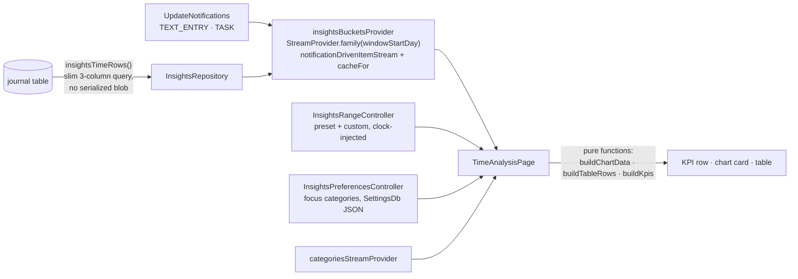

# Insights — Time Analysis

A desktop-only time-analysis dashboard living as a pinned sub-entry under the
Insights tab (route `/dashboards/time`). It answers three questions —
*Where did my time go this week? How much time did I spend per category per
day? What is the cumulative vs. non-cumulative time spent?* — over 10k+ time
entries with instantaneous (sub-200ms, measured ~5ms) range switching.

## Architecture

Layering:

- **`logic/`** — pure, Flutter-free functions (`time_bucketing.dart`,
  `range_presets.dart`) plus the chart color derivation
  (`chart_colors.dart`). Exhaustively property-tested with Glados.
- **`model/`** — hand-rolled immutable value types with deep equality
  (no codegen). Deep equality is load-bearing: an unchanged background
  refetch produces an equal `InsightsDayBuckets`, so Riverpod never
  re-notifies and the UI never flashes.
- **`repository/`** — thin mapping over `JournalDb.insightsTimeRows`
  (mixin `_JournalDbInsightsQueries`, part of `database.dart`).
- **`state/`** — providers; the page is the single consumer and passes
  plain values to dumb widgets.
- **`ui/`** — design-system tokens throughout; `fl_chart` for the stacked
  bar (daily) and pre-stacked cumulative area charts.

## Data semantics

- **What counts as time:** non-deleted `JournalEntry` rows with
  `date_to > date_from`. `JournalAudio` is excluded (a recording made during
  a running timer would double-count — same rule as the Daily OS time
  history). There is **no minimum-duration floor**: the legacy 15-second
  floor in `workEntriesInDateRange` is a JournalEntry noise heuristic, not a
  totals semantic.
- **Category attribution:** the linked task's category wins, the entry's own
  category is the fallback (matches `actualTimeBlocksForEntries`). The SQL
  resolves the link with a correlated subquery (`ORDER BY t.date_from DESC,
  t.id LIMIT 1`) — never a joined fan-out, which would double-count entries
  with multiple incoming links.
- **Integer-seconds arithmetic:** `date_from`/`date_to` are stored as Unix
  seconds. `julianday()` on these columns returns NULL and silently drops
  every row; the duration guard is `j.date_to > j.date_from`.
- **Union-merge:** overlapping intervals within one (day, category) cell are
  merged before summing, so nested/parallel entries in the same category
  don't double-count. Overlaps *across* categories count toward each
  category (whole-day totals can exceed wall-clock; standard for
  category breakdowns).
- **Midnight splitting:** entries are split at local midnights using
  calendar-constructor arithmetic (`DateTime(y, m, d + 1)`), which is exact
  across 23h/25h DST days. Property tests assert duration conservation.
- **Day keys** are epoch-day ints derived through a UTC anchor — pure
  calendar indices, immune to DST offsets.
- **Private visibility:** the query gates entries AND linked-task
  attribution on the global `private` config flag (same idiom as
  `workEntriesInDateRange`); the provider refetches on
  `privateToggleNotification` and `linkNotification` (link create/unlink
  re-attributes time immediately). The v43 migration backfills the
  denormalized `journal.category` column from serialized JSON so
  pre-2024-07 history attributes correctly.

## Window caching & refresh

- The fetch window is **January 1st of the range-start year through the end
  of tomorrow**; the Riverpod family key is the window start day (an int).
  Every preset within one year shares one in-memory bucket cache, so range
  switching never touches the database (measured: all six presets in ~5ms
  on a 10k-entry year; cold fetch+bucketize ~35ms —
  `test/database/insights_performance_test.dart`).
- A different year is a different provider instance — there is no mutable
  shared window, hence no stale-write races. `notificationDrivenItemStream`
  serializes refetches and throttles them (5s trailing edge — typing fires
  a notification batch every ~100ms, each refetch costs a full window
  query); `cacheFor(dashboardCacheDuration)` keeps recently used windows
  alive across tab switches.

## Visualization (Stephen Few rules)

- Stacked bars per bucket (daily) / pre-stacked cumulative area, toggleable;
  a caption under the title states what the chart shows. No pies, no
  donuts, zero-based axes, horizontal gridlines only.
- Granularity tiers: hourly for 1-day ranges, daily up to 120 days, weekly
  beyond (YTD ≈ 52 x-points). Partial edge weeks are flagged in tooltips.
- At most 6 series plus a slate **Other (+N)** rollup; uncategorized time is
  a distinct neutral gray. Series order (largest on the baseline), legend
  order, and table order are all descending by total.
- Chart fills are **muted derivations** of the user-picked category colors
  (hue preserved, saturation/lightness clamped per theme brightness); the
  saturated original appears only in small swatches. Cumulative bands carry
  lightened edge strokes so adjacent fills stay separable.
- Tooltips read out every non-zero band for the hovered bucket, largest
  first, with the bucket total in the header.
- The table is the precise lookup: swatch · category · total (`h:mm`, mono,
  right-aligned) · share (`<1%` guard) · avg/day (over days in range,
  `<0:01` guard, hidden for 1-day ranges) · data bar normalized to the
  largest row.
- KPI tiles are plain numbers. Focus/Other tiles render only once focus
  categories are configured (stored as a JSON list in SettingsDb,
  local-only); until then a compact affordance opens the picker, and the
  FOCUS tile lists its member categories inline.

## Navigation

`/dashboards/time` is special-cased in `DashboardsLocation` **before** the
UUID check (`time` can never collide with dashboard ids). The location is
the single writer of the desktop pane selection: it maps the URL onto
`NavService.desktopShowTimeAnalysis` and `desktopSelectedDashboardId`,
keeping them mutually exclusive. The pinned list entry renders only in
desktop layout; a deep link on a narrow window still pushes the page rather
than dead-ending.

## Testing

- `test/features/insights/logic/` — unit + Glados property tests (tagged
  `glados`): duration conservation under midnight/DST splits, union-merge
  idempotence, monotone cumulative series, preset well-formedness,
  chart/table/KPI total agreement.
- `test/database/database_insights_queries_test.dart` — fan-out,
  precedence, window-edge, and floor semantics against a real in-memory DB.
- `test/database/insights_performance_test.dart` — 10k-entry benchmark for
  the cold fetch and the in-memory preset-switch budget.
- `test/features/insights/ui/time_analysis_screenshots_test.dart` — renders
  ten scenarios at desktop size with real fonts into
  `screenshots/insights/` (gitignored) for design review; assertions guard
  rendering, the PNGs feed critique rounds.

## Future work (deliberately out of v1)

- Group-by project (the slim query can reach `project_id`).
- Click-to-isolate a category / legend hover isolation.
- Sortable table headers.
- CSV export.
