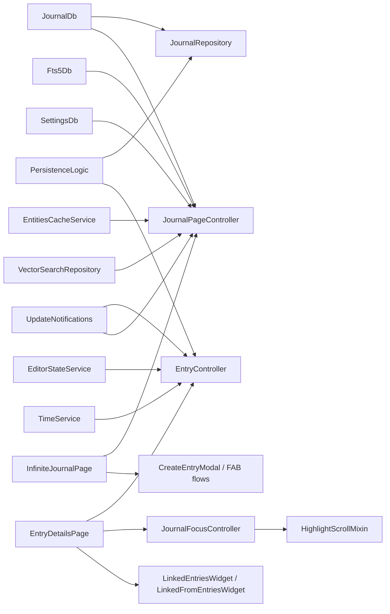
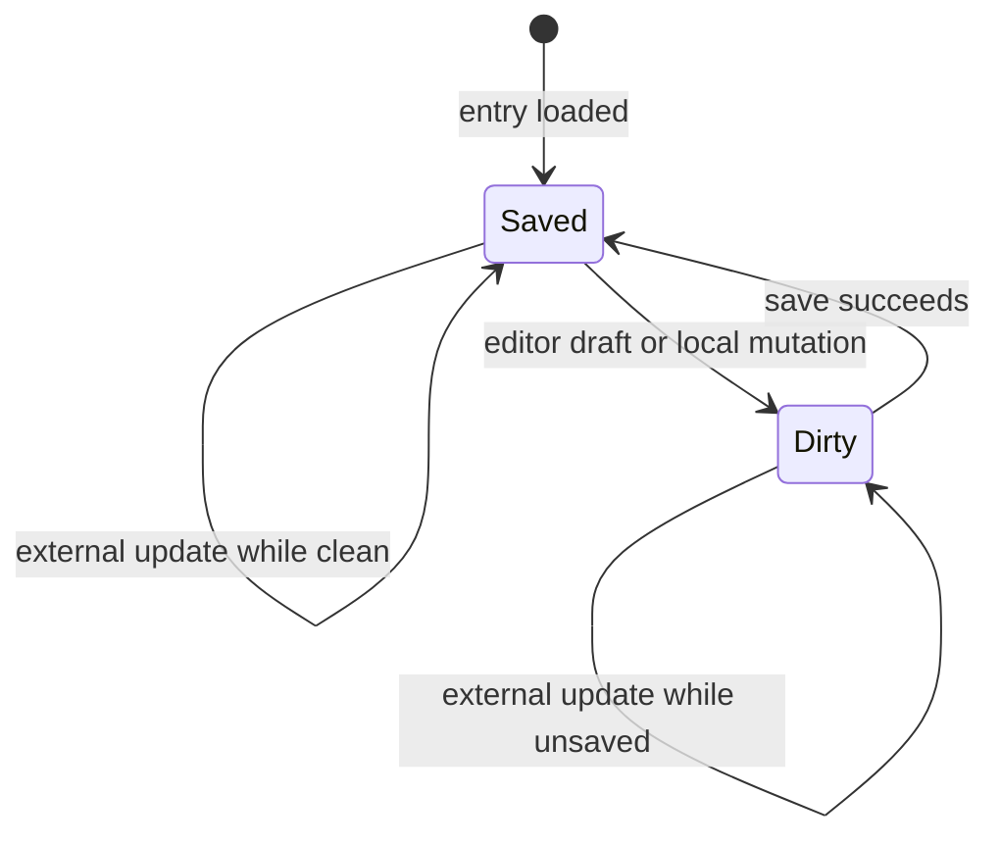
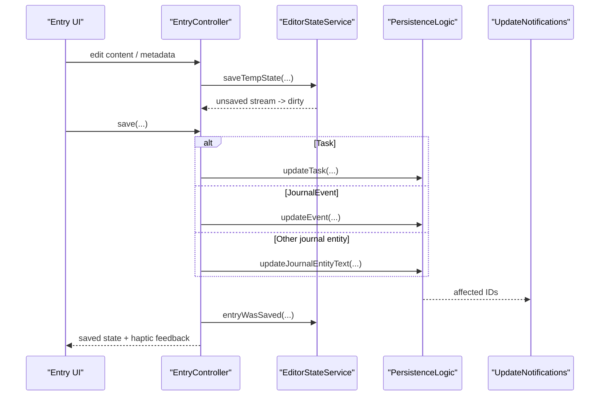
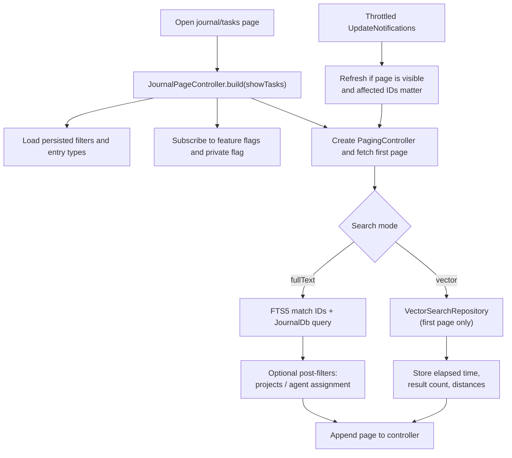
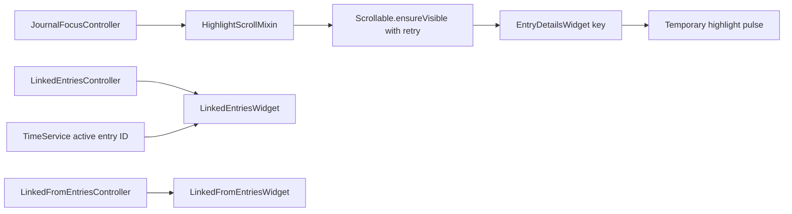

# Journal Feature

The `journal` feature is Lotti's entry workspace layer.

Most other product features eventually end up depending on it, because this is where entries are loaded, created, edited, paged, filtered, linked, highlighted, and deleted. Even when another feature owns the domain-specific widget, the journal feature usually still owns the surrounding runtime: the page shell, the controller, the repository facade, the linked-entry plumbing, or the list/browse substrate.

It is not the whole app, but it is the closest thing the app has to a canonical entry surface.

## What This Feature Owns

At runtime, the journal feature owns:

- single-entry detail pages and the shared detail controller
- the paged journal/tasks browse controller and its persisted filter state
- full-text and vector-search orchestration for journal-style pages
- create/import entry surfaces, including clipboard and drag-and-drop entry points
- linked-entry rendering, link mutation, focus intents, and scroll highlighting
- repository helpers for common entry and link mutations

It does not own every entity-specific summary or form. Tasks, ratings, speech, AI, measurements, and projects all plug their own UI into the journal surface. The journal feature is the switchboard they plug into.

## Directory Shape

```text
lib/features/journal/
├── model/
├── repository/
├── state/
├── ui/
│   ├── mixins/
│   ├── pages/
│   └── widgets/
├── util/
└── utils/
```

## Runtime Centers



The feature has two real controller centers:

- [`EntryController`](state/entry_controller.dart) for one entry detail surface
- [`JournalPageController`](state/journal_page_controller.dart) for paged browse and search surfaces

Everything else is mostly glue around those two: entry-type dispatch, linked-entry composition, create/import actions, and scroll/focus behavior.

## The Core Model Boundary

The journal layer operates on `JournalEntity` variants, not on one canonical entry type.

That includes, among others:

- `JournalEntry`
- `Task`
- `JournalEvent`
- `JournalAudio`
- `JournalImage`
- `MeasurementEntry`
- `SurveyEntry`
- `WorkoutEntry`
- `HabitCompletionEntry`
- `Checklist`
- `ChecklistItem`
- `AiResponseEntry`
- `RatingEntry`

That breadth is why this feature feels large. It is not "the text note feature". It is the shared create/edit/browse substrate for a whole family of entry types.

## Detail Surface

[`entry_details_page.dart`](ui/pages/entry_details_page.dart) is the outer detail-page shell.

It composes:

- [`EntryDetailsWidget`](ui/widgets/entry_details_widget.dart) for the main entry body
- [`LinkedEntriesWithTimer`](ui/widgets/linked_entries_with_timer.dart) for outgoing linked entries
- [`LinkedFromEntriesWidget`](ui/widgets/entry_detail_linked_from.dart) for reverse links
- checklist-specific linked-from widgets when the current item is a checklist or checklist item
- a floating add action button scoped to the current entry and category
- a drag-and-drop target for media import
- an AI-running overlay card at the bottom of the page

`EntryDetailsWidget` is the central type dispatcher. It renders the shared header, labels, editor, footer, and then switches into the right feature-specific summary or form for the current `JournalEntity`.

That is the real boundary: the journal feature owns the page frame and the switching logic, while other features supply some of the per-type payload UI.

## Entry Controller

[`entry_controller.dart`](state/entry_controller.dart) is the detail-side brain for one entry.

It:

- loads the current `JournalEntity`
- restores editor content from draft state when available
- listens to unsaved-draft state from `EditorStateService`
- listens to `UpdateNotifications` for external DB changes touching the same entry
- keeps focus and editor-toolbar visibility in sync with the active editor
- registers desktop `Cmd+S` hotkeys while the relevant focus nodes are active
- routes save operations to the correct persistence path
- exposes focused mutations such as task status/priority, event stars, checklist ordering, cover art, privacy, starring, flagging, copying, and deletion

### Detail State Machine

`EntryState` is a sealed union with only two real states:



Deletion does not produce a third `EntryState`. The controller clears its async state to `null`, which is an exit from the state machine rather than another node inside it.

### Save Path



The branching is intentionally boring:

- tasks save through `updateTask`
- events save through `updateEvent`
- everything else uses `updateJournalEntityText`

That is a good thing. The controller is not trying to invent a second write model on top of the persistence layer.

A few detail-level behaviors are worth calling out because they are easy to miss:

- updating a category from the detail controller also propagates that category to currently linked outgoing entries
- saving with `stopRecording: true` updates the text first and then stops the timer after a short delay
- when an external update arrives and the entry is not dirty, the editor controller is rebuilt from the saved value
- when the entry is dirty, the controller keeps the user's unsaved editor state instead of bluntly resetting it

## Browse Surface

[`infinite_journal_page.dart`](ui/pages/infinite_journal_page.dart) is the shared browse page used for both the journal tab and the tasks tab.

Its job is mostly composition. The heavy lifting sits in [`journal_page_controller.dart`](state/journal_page_controller.dart).

The controller owns:

- the `PagingController`
- filter state
- search mode
- feature-flag gating for entry types and vector search
- private-entry visibility
- persisted filter state in `SettingsDb`
- update-driven refresh behavior
- vector-search timing and distance metadata for the UI

### Browse and Search Flow



### What The Page Controller Persists

The controller persists more than a plain search string. It stores:

- selected entry types
- category filters
- task status filters
- project filters
- label filters
- priority filters
- task sort option
- visual toggles such as creation date, due date, cover art, projects header, and vector distances
- agent-assignment filter

Tasks filter persistence is tab-aware. The controller writes to per-tab settings keys and still mirrors the tasks tab state to the legacy `TASK_FILTERS` key while that migration remains in place.

### Search Modes

The controller supports two modes:

- `fullText`
- `vector`

Vector mode is feature-gated. If the vector-search flag is disabled while the controller is in vector mode, it falls back to full-text mode instead of leaving the UI in a dead state.

Vector search also behaves differently from normal paging:

- it bypasses the DB paging pipeline
- it only runs on the first page
- it stores elapsed time, result count, and per-entry distance values in `JournalPageState`

### Post-Filter Pagination

Two filters are not pushed directly into the main task query:

- selected projects
- agent assignment filter

When those are active, the controller fetches raw task pages from `JournalDb`, filters them in memory, and tracks a separate raw offset so pagination does not repeat or skip rows.

That is a small implementation detail with a large bug-prevention payoff.

### Sorting Constraint

Due-date sorting is also a practical compromise:

- due dates are stored inside serialized task data rather than an indexed DB column
- tasks are therefore fetched in a simpler DB order and sorted by due date in memory
- ordering is correct within each loaded page, but not guaranteed globally across page boundaries

That is the current behavior.

## Linked Entries, Focus, and Highlighting

The journal feature owns the generic linked-entry machinery used in detail pages.

That includes:

- outgoing link lookup via [`LinkedEntriesController`](state/linked_entries_controller.dart)
- reverse-link lookup via [`LinkedFromEntriesController`](state/linked_from_entries_controller.dart)
- hidden-link and AI-entry visibility toggles
- timer-aware highlighting of active linked entries
- scroll-to-entry focus intents and temporary highlight pulses



The important runtime details are:

- outgoing links are fetched from `JournalRepository.getLinksFromId(...)`
- hidden links can be included or excluded without changing the rest of the page
- outgoing links are ordered by the linked entity's editable `dateFrom`, not by link creation time
- `LinkedEntriesWithTimer` only reacts to active timer entry ID changes, not every timer tick
- `HighlightScrollMixin` retries scroll-to-entry until the target widget is actually mounted, then applies a temporary highlight pulse

This is one of those features that feels trivial until it breaks. Then it immediately becomes obvious why it exists.

## Create, Import, and Paste Paths

The journal feature also owns the generic entry-creation surfaces that sit above domain-specific creation logic.

The main pieces are:

- [`CreateEntryModal`](ui/widgets/create/create_entry_action_modal.dart)
- [`FloatingAddActionButton`](ui/widgets/create/create_entry_action_button.dart)
- [`create_entry_items.dart`](ui/widgets/create/create_entry_items.dart)
- [`ImagePasteController`](state/image_paste_controller.dart)

Supported entry points include:

- create text entries
- create tasks
- create events
- start audio recordings
- create timer entries when already inside a parent entry
- import images
- create screenshots
- paste images from the clipboard
- drag and drop media onto the detail page

Two integration details are worth documenting because they are easy to miss:

- image import and paste flows can trigger automatic image-analysis callbacks supplied by the AI feature
- creating a timer from a linked context polls for the new linked entry and then publishes a focus intent so the page scrolls to the freshly created timer entry

## Repository Responsibilities

[`journal_repository.dart`](repository/journal_repository.dart) is intentionally an app-facing facade, not a second persistence layer.

It handles:

- loading entries by ID
- updating category IDs
- updating entry dates
- soft-deleting journal entities
- updating full entities
- creating text entries
- creating image entries
- updating links
- removing links
- fetching outgoing linked entities, reverse-linked entities, and linked images for tasks

It delegates the actual storage and sync work to:

- `JournalDb`
- `PersistenceLogic`
- `VectorClockService`
- `OutboxService`
- `NotificationService`
- `TimeService`

## Side Effects That Matter

The journal feature looks like basic CRUD until you follow the side effects.

Some of the important ones already wired here are:

- deleting an image clears any task `coverArtId` that references it
- deleting a currently running entry stops the timer
- deleting an entry updates the badge through `NotificationService`
- updating a link emits `UpdateNotifications`
- updating a link also writes a sync outbox message with a fresh vector clock
- creating image entries can invoke higher-level callbacks such as automatic analysis

That is normal for this feature. It is the app's entry hub. Quiet side effects would be stranger than visible ones.

## Current Constraints

- the journal feature owns the shared surface, not every per-entity widget
- browse state for journal and tasks still lives in one controller because the underlying pagination and search substrate is shared
- vector search depends on the embedding stack being available and only runs as a first-page search mode
- due-date sorting is page-local rather than globally stable across all pages
- some cross-feature behaviors, especially AI, ratings, tasks, and speech, are layered onto journal surfaces rather than reimplemented elsewhere

## Relationship To Other Features

- `tasks` adds task-specific forms, checklists, labels, priorities, and progress behavior
- `speech` adds recording and playback around `JournalAudio`
- `ratings` plugs `RatingSummary` and post-session prompts into journal detail surfaces
- `ai` adds analysis, automatic image handling, nested AI responses, and vector search infrastructure
- `sync` propagates entry and link mutations across devices

If you want to understand where an entry is created, loaded, edited, searched, linked, or deleted, start here first. Even when another feature owns the headline behavior, there is a good chance the journal feature is still holding the floorboards together.
