# Journal Feature

The `journal` feature is Lotti's entry workspace layer.

Most other product features eventually end up depending on it, because this is where entries are loaded, created, edited, paged, filtered, linked, highlighted, and deleted. Even when another feature owns the domain-specific widget, the journal feature usually still owns the surrounding runtime: the page shell, the controller, the repository facade, the linked-entry plumbing, or the list/browse substrate.

It is not the whole app, but it is the closest thing the app has to a canonical entry surface.

## What This Feature Owns

At runtime, the journal feature owns:

- single-entry detail pages and the shared detail controller
- the paged journal/tasks browse controller and its persisted filter state
- full-text and vector-search orchestration for journal-style pages
- create/import entry surfaces, including clipboard and drag-and-drop entry points
- linked-entry rendering, link mutation, focus intents, and scroll highlighting
- repository helpers for common entry and link mutations

It does not own every entity-specific summary or form. Tasks, ratings, speech, AI, measurements, and projects all plug their own UI into the journal surface. The journal feature is the switchboard they plug into.

## Directory Shape

```text
lib/features/journal/
├── model/
├── repository/
├── state/
├── ui/
│   ├── mixins/
│   ├── pages/
│   └── widgets/
│       ├── create/         # entry-creation affordances
│       ├── editor/         # rich-text editor widgets
│       ├── entry_details/  # detail body + header/ subtree
│       └── list_cards/     # journal list row cards
├── util/
└── utils/
```

## Runtime Centers

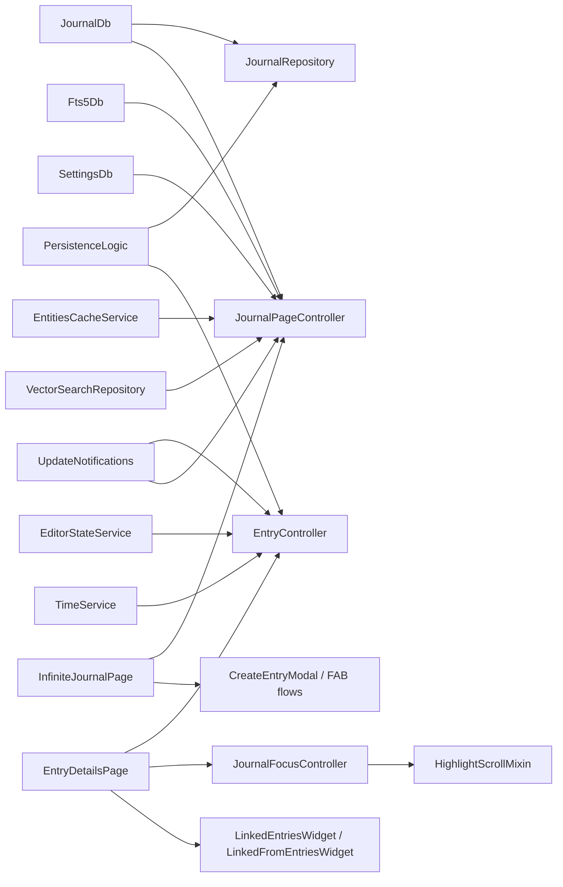

The feature has two real controller centers:

- [`EntryController`](state/entry_controller.dart) for one entry detail surface
- [`JournalPageController`](state/journal_page_controller.dart) for paged browse and search surfaces

Everything else is mostly glue around those two: entry-type dispatch, linked-entry composition, create/import actions, and scroll/focus behavior.

## The Core Model Boundary

The journal layer operates on `JournalEntity` variants, not on one canonical entry type.

That includes, among others:

- `JournalEntry`
- `Task`
- `JournalEvent`
- `JournalAudio`
- `JournalImage`
- `MeasurementEntry`
- `SurveyEntry`
- `WorkoutEntry`
- `HabitCompletionEntry`
- `Checklist`
- `ChecklistItem`
- `AiResponseEntry`
- `RatingEntry`

That breadth is why this feature feels large. It is not "the text note feature". It is the shared create/edit/browse substrate for a whole family of entry types.

## Split Layout and Routing

[`journal_root_page.dart`](ui/pages/journal_root_page.dart) is the responsive entry point mounted at `/journal`. Below the shared `kDesktopBreakpoint` (960px) it is just the full-width `InfiniteJournalPage`, and `JournalLocation` pushes `EntryDetailsPage` as its own route on entry taps — the mobile behavior. On desktop it renders the same list beside a resizable detail pane, mirroring `TasksRootPage`/`ProjectsTabPage`: `ListDetailFocusTraversal(list + ResizableDivider + detail)`, with the pane width coming from `paneWidthControllerProvider.journalListPaneWidth` (its own persisted `PANE_WIDTH_JOURNAL_LIST` key, independent of the tasks/projects list width).

Selection is URL-driven: journal-entry rows `beamToNamed('/journal/<id>')`, while task and event rows route to their home tabs instead (`/tasks/<id>`, `/events/<id>`); `JournalLocation` branches on `NavService.isDesktopMode` and either pushes the details route (mobile) or writes `NavService.desktopSelectedEntryId` in a microtask (desktop). `CardWrapperWidget` listens to the same notifier to highlight the selected row, and the detail pane cross-fades between entries with an `AnimatedSwitcher` (`MotionDurations.short4`, 200ms, matching tasks).

There is one non-URL write: `_AutoSelectNewestEntry` (in `journal_root_page.dart`) watches the feed's paging controller and, whenever the selection is null and the feed has loaded, selects the newest non-task/non-event entry post-frame — so the desktop split opens on "read the latest entry" with zero taps. Tasks and events are skipped because they open in their own tabs; their rows carry a small trailing `open_in_new` glyph (medium emphasis, destination tooltip) to signal that.

Empty states share one grammar via `DesignSystemEmptyState` (design-system component: glyph, `subtitle1` title, `caption` hint, optional action). The list's zero-state (`_LogbookEmptyState`) distinguishes a genuinely empty logbook — first-run copy plus an inline "Create new entry" button wired to the same `CreateEntryModal` as the FAB, while the corner FAB hides so there is a single create affordance — from a search/filter-narrowed feed ("No entries match" + recovery hint, no CTA). The desktop detail pane's empty state shows whenever no eligible entry is selected — a genuinely empty feed, but also one whose loaded entries are all tasks/events, since those are never auto-selected — and defers with a caption-tier "New entries will open here." hint instead of echoing the list's title.

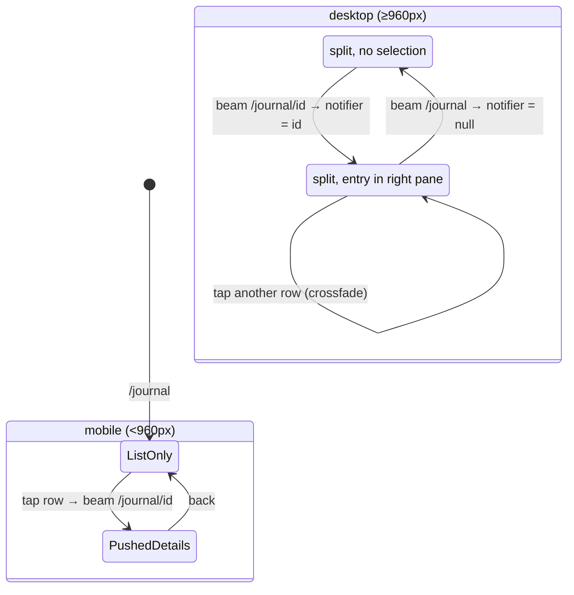

In the desktop split the detail page is embedded with `showBackButton: false` and `showFloatingActionButton: false` — the list pane provides both the way back and the create FAB, so the pane renders neither.

## Detail Surface

[`entry_details_page.dart`](ui/pages/entry_details_page.dart) is the outer detail-page shell.

It composes:

- [`EntryDetailsWidget`](ui/widgets/entry_details_widget.dart) for the main entry body
- [`LinkedEntriesWithTimer`](ui/widgets/linked_entries_with_timer.dart) for outgoing linked entries
- [`LinkedFromEntriesWidget`](ui/widgets/entry_detail_linked_from.dart) for reverse links
- checklist-specific linked-from widgets when the current item is a checklist or checklist item
- media entry Actions menu items for images and audio, including
  file-manager reveal actions on desktop platforms
- a floating add action button scoped to the current entry and category and
  lifted above the shared bottom-navigation shell (suppressed in the desktop
  split, where the list pane owns the FAB)
- a drag-and-drop target for media import
- an AI-running overlay card at the bottom of the page

The page paints `dsPageSurface` (`#181818` in dark) as its scaffold and pinned-app-bar background — one unified canvas shared with the logbook list column — and `EntryDetailsWidget` wraps the entry body in a `DesignSystemSectionCard` (`#222222`), the same card-on-canvas recipe the list rows use. Content is centered under `kDetailContentMaxWidth` (760px), the shared reading measure also used by the tasks detail pane. The duration footer sits under a hairline `decorative.level01` divider inside the card so it reads as chrome, not as another sentence of the entry.

`EntryDetailsWidget` is the central type dispatcher. It renders the shared header, labels, editor, footer, and then switches into the right feature-specific summary or form for the current `JournalEntity`.

That is the real boundary: the journal feature owns the page frame and the switching logic, while other features supply some of the per-type payload UI.

### Detail Header Action Rail

[`EntryDetailHeader`](ui/widgets/entry_details/header/entry_detail_header.dart)
keeps the editable date/time cluster on the leading edge and assembles the
right-side controls from the current entry: optional collapse, AI, rating-edit,
and flagged controls, then the consistently anchored favorite and overflow
controls. AI is included only when an applicable skill is available, so a
zero-width AI placeholder cannot consume layout space.

For collapsed linked entries, the preview row is one disclosure control. Its
semantic label uses the localized generic **Expand entry** action plus the
entry's full date; the thumbnail, timestamp, duration, and chevron are
excluded from the child semantics tree so screen readers do not announce
competing actions for the same row.

Every action keeps its 48px-wide tap target. The inter-control gap always uses
the design-system `spacing.step2` (4px), so the timestamp gets the maximum
available width without hiding or clipping an action.

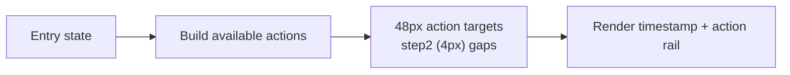

### Image Viewer

[`EntryImageWidget`](ui/widgets/entry_image_widget.dart) renders a downsampled inline `JournalImage` preview and pushes `HeroPhotoViewRouteWrapper` on tap. The route is non-opaque with a scrim barrier, so the detail page remains visible but darkened behind the viewer. `PhotoView` still owns pinch-zoom and panning; the viewer chrome drives the same `PhotoViewController` and `PhotoViewScaleStateController` for button zoom, reset, and the visible scale readout.

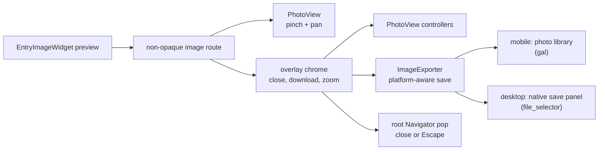

The save action always copies the original image file, not the resized preview, to a platform-appropriate destination via the [`ImageExporter`](util/image_export_service.dart) typedef (`defaultImageExporter()` picks the implementation; the widget accepts an injected one for tests):

- **mobile** (`saveImageToGallery`) writes to the OS photo library / camera roll through the `gal` plugin, requesting photo-add permission first and surfacing a "permission denied" message if it is refused;
- **desktop** (`saveImageViaDialog`) opens the native save panel through `file_selector`, so the user chooses the folder and filename and the sandbox grants write access to exactly that location. Dismissing the panel is treated as a silent cancellation, not an error.

The earlier `getDownloadsDirectory()` + `Downloads/Lotti` copy was desktop-only: it failed on iOS (no user-facing downloads directory) and on the sandboxed macOS build (no write access to `~/Downloads`). Any unexpected save error is logged through `LoggingService` and shown to the user as a generic failure snackbar.

## Entry Controller

[`entry_controller.dart`](state/entry_controller.dart) is the detail-side brain for one entry.

It:

- loads the current `JournalEntity`
- restores editor content from draft state when available
- listens to unsaved-draft state from `EditorStateService`
- listens to `UpdateNotifications` for external DB changes touching the same entry
- keeps focus and editor-toolbar visibility in sync with the active editor
- routes save operations to the correct persistence path
- exposes focused mutations such as task status/priority, event stars, checklist ordering, cover art, privacy, starring, flagging, copying, and deletion

[`EditorWidget`](ui/widgets/editor/editor_widget.dart) contributes the
lifecycle-bound `Primary+S` handler next to the reusable rich-text editor, so
the same command reaches `EntryController.save()` whether the editor is shown
on the entry page, in a journal card, or inside a task form. `Primary` resolves
to Command on macOS and Control on Windows/Linux.

### Detail State Machine

`EntryState` is a sealed union with only two real states:

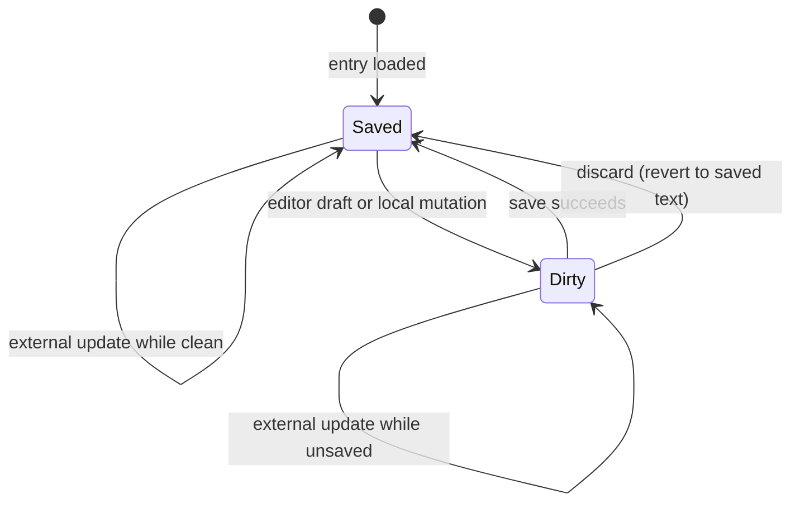

Deletion does not produce a third `EntryState`. The controller clears its async state to `null`, which is an exit from the state machine rather than another node inside it.

### Save Path

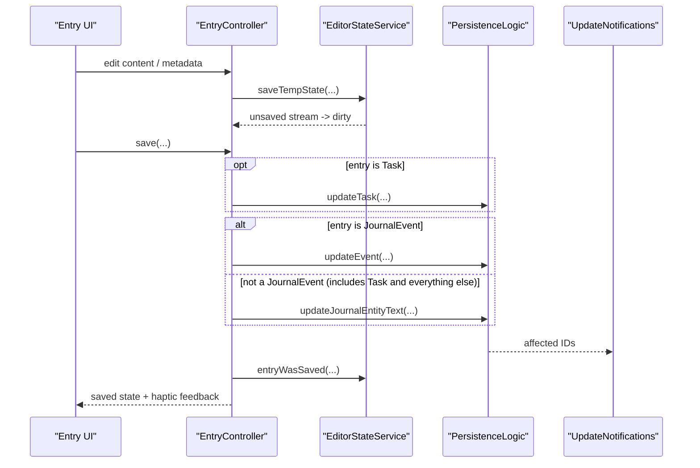

The branching uses two independent `if` blocks rather than one exclusive switch:

- a `Task` is persisted via `updateTask` (its own `if (entry is Task)` block, with no `else`)
- the second block is `if (entry is JournalEvent) updateEvent else updateJournalEntityText`

Because a `Task` is not a `JournalEvent`, it falls into the trailing `else` as well, so a task save performs two persistence writes: `updateTask` for the task data and `updateJournalEntityText` for the editor text. Events save through `updateEvent` only; every other entity type saves through `updateJournalEntityText` only.

The controller is not trying to invent a second write model on top of the persistence layer.

A few detail-level behaviors are worth calling out because they are easy to miss:

- updating a category from the detail controller also propagates that category to currently linked outgoing entries
- saving with `stopRecording: true` updates the text first and then stops the timer after a short delay
- when an external update arrives and the entry is not dirty, the editor controller is rebuilt from the saved value
- when the entry is dirty, the controller keeps the user's unsaved editor state instead of bluntly resetting it
- `discard()` is the inverse of `save()` without persisting: it drops the in-memory and persisted draft (`EditorStateService.dropDraft`), rebuilds the editor controller from the saved text, drops focus, hides the toolbar, and clears the dirty flag. The editor toolbar surfaces it as a discard control that appears beside Save only while there are unsaved changes.

### Start/End Date-Time Editor

[`entry_datetime_multipage_modal.dart`](ui/widgets/entry_details/entry_datetime_multipage_modal.dart) edits an entry's `dateFrom`/`dateTo` and commits them via `EntryController.updateFromTo`. Its Wolt modal has two reusable pages rather than stacking a date dialog over the editor:

1. the overview shows a full-weekday date control, optional separate end date,
   paired Start/End time wheels, endpoint-specific **Now** actions, and the live
   range status;
2. activating either date transitions to an in-sheet calendar page with Back,
   Close, Today, and Done controls.

The editable model is the pure, testable [`EntryDateTimeRange`](ui/widgets/entry_details/entry_datetime_range.dart) — a `startDate` (day only) + `startTime` + `endTime` + an optional `endDateOverride` — from which `dateFrom`/`dateTo` are *derived* (they can never desync). Date decomposition and recomposition retain the entry's timezone semantics, including UTC, device-local, and named zones. **Now** and **Today** read the injectable clock and normalize it to that same timezone before changing an endpoint, so shortcuts are deterministic in tests and cannot mix timezone kinds. Endpoint-level **Now** actions preserve the opposite absolute endpoint; if **Start Now** moves past the stored end, the model exposes that exact inverted range as invalid instead of silently rolling the end into tomorrow. The glass Save footer remains fixed while the regular Wolt page owns overflow scrolling. Its content padding reserves the footer's occupied height, and the status reserves the next-day chip row in both states, so neither crossing midnight nor exposing the chip moves the sheet. Save stays disabled until the range both changed and is valid.

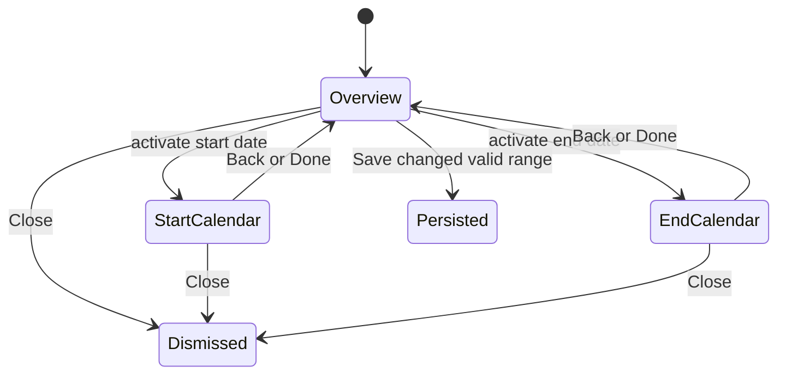

`EntryDateTimeRange.fromBounds` decides which mode an existing entry opens in:

```mermaid
stateDiagram-v2
    [*] --> SharedDate: ordered bounds AND end day == start day
    [*] --> SharedDate: end day == start+1 AND end clock < start clock (plain overnight)
    [*] --> DifferentDates: otherwise (inverted, multi-day, or exact-24h same-clock next day)

    SharedDate --> SharedDate: select date / spin times / use Now
    note right of SharedDate
      one date control + two time wheels.
      end clock < start clock auto-rolls
      dateTo to the next day and shows a
      teal next-day chip (overnightAuto).
    end note

    SharedDate --> DifferentDates: toggle separate end date ON\n(freeze endDateOverride = current end day)
    DifferentDates --> SharedDate: toggle OFF\n(clear endDateOverride; end collapses onto start date)
    note right of DifferentDates
      reveals a second End date control;
      either date opens the same calendar page.
      Save is gated on dateTo >= dateFrom.
    end note
```

## Browse Surface

[`infinite_journal_page.dart`](ui/pages/infinite_journal_page.dart) is the journal-tab browse page. It is hardcoded to `journalPageControllerProvider(false)` (`showTasks=false`) and is wired only into the journal route. The tasks tab has its own page widget, `TasksTabPage` in the tasks feature (`lib/features/tasks/ui/pages/tasks_tab_page.dart`), which watches `journalPageControllerProvider(true)`. What is shared between the two tabs is the controller (`JournalPageController`, keyed by `showTasks`), not the page widget.

The page body is a `Column`: the shared `TabSectionHeader` (the same titled header Tasks and Projects use — "Logbook" title, notification bell, compact search field, accent filter icon), an optional [`LogbookSearchModeRow`](ui/widgets/logbook_search_mode_row.dart) when the vector-search flag is on, and the paged feed in an `Expanded` scroll view. The filter icon opens the two-page Wolt filter modal via [`showLogbookFilterModal`](ui/widgets/logbook_filter_modal.dart), which also hosts `JournalFilter` (the starred/flagged/private pills) and `LogbookFilterSheet`. There is no sliver app bar on this page anymore.

Its job is mostly composition. The heavy lifting sits in [`journal_page_controller.dart`](state/journal_page_controller.dart).

The controller owns:

- the `PagingController`
- filter state
- search mode
- feature-flag gating for entry types and vector search
- private-entry visibility
- persisted filter state in `SettingsDb`
- update-driven refresh behavior, including retained loaded-page refreshes that
  keep visible rows mounted until replacement data resolves
- vector-search timing and distance metadata for the UI

### List Row Cards

Each browse row is rendered by [`CardWrapperWidget`](ui/widgets/list_cards/card_wrapper_widget.dart), the per-row dispatcher: images go to `ModernJournalImageCard`, every other entry type — including tasks — to `ModernJournalCard`, so the feed keeps one card anatomy. On desktop the wrapper also listens to `NavService.desktopSelectedEntryId` and passes `selected` down, so the row whose entry fills the split-pane details renders `ModernBaseCard`'s activated fill + accent border (tasks and events are excluded — they open in their own tabs). Row typography sits on the tasks list scale: titles/previews at `subtitle2` (14px), secondary lines at `others.caption` (12px), with token-based card padding (`step4`) and margins. Both cards share one visual anatomy so the feed reads as a single system:

- a leading ~40dp **glyph tile** (`TintedTypeGlyph`) — the icon identifies the entry type, and the tile is tinted by the entry's **category** color (via `_categoryColor`), so the feed's left rail also colour-codes life-area at a glance;
- a **content-first title** — the entry's own content (note preview, task/event title, humanized metric name) as the brightest element;
- a **de-emphasized meta line**: a locale-aware relative date (`entryDateLabel`) plus an optional category dot;
- type-specific **metric chips** (`ModernStatusChip`) on their own row.

Structured types are humanized rather than surfacing storage values: health/quantitative shows `humanHealthTypeName` + a `value unit` chip (e.g. `Systolic Blood Pressure` · `122 mmHg`, never the raw `HealthDataType.*`/`HealthDataUnit.*` enum); workout shows the sport name + duration/energy/distance chips; measurement shows the measurable name + value; survey shows the instrument name + compact score chips. Checklist rows surface `done/total` progress (via `checklistCompletionControllerProvider`) with a thin progress bar; habit-completion rows resolve the habit name and show an explicit status chip (Completed / Skipped / Failed). `ModernJournalCard` is also reused on detail and linked-from surfaces, where the same anatomy renders with `showLinkedDuration` / `removeHorizontalMargin`.

### Browse and Search Flow

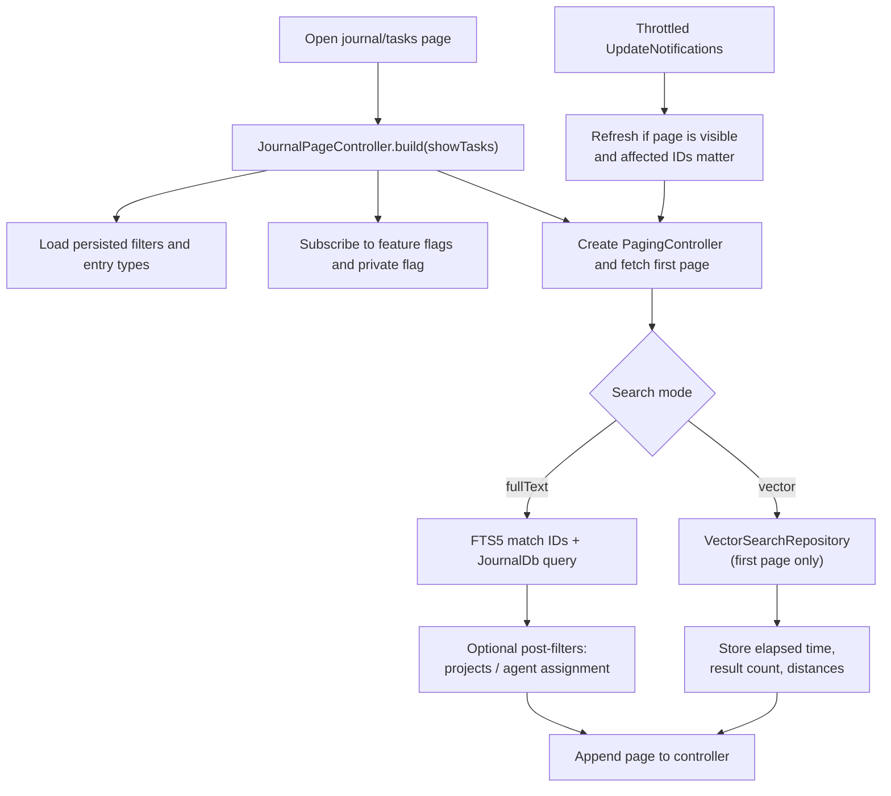

When a visible browse page already has rows on screen, the controller now
replaces the currently loaded page window only after the refreshed pages
resolve. That avoids the `PagingController.refresh()..fetchNextPage()` path that
would otherwise clear the list immediately and produce a visible desktop flicker
during saves or live updates, while still allowing regrouping when task ordering
changes.
For the normal offset-based path, those already-loaded pages are refreshed in
parallel; the slower sequential reload is kept only for post-filtered task
queries where project or agent filters consume raw rows before returning a
page. Visible task-row updates also bypass the extra leading-page probe and
refresh the retained page window directly.

### What The Page Controller Persists

The controller persists more than a plain search string. It stores:

- selected entry types
- category filters
- task status filters
- project filters
- label filters
- priority filters
- task sort option
- visual toggles such as creation date, due date, cover art, projects header, and vector distances
- agent-assignment filter

Tasks filter persistence is tab-aware. The controller writes to per-tab settings keys (`TASKS_CATEGORY_FILTERS` for the tasks tab, `JOURNAL_CATEGORY_FILTERS` for the journal tab).

### Search Modes

The controller supports two modes:

- `fullText`
- `vector`

Vector mode is feature-gated. If the vector-search flag is disabled while the controller is in vector mode, it falls back to full-text mode instead of leaving the UI in a dead state.

Vector search also behaves differently from normal paging:

- it bypasses the DB paging pipeline
- it only runs on the first page
- it stores elapsed time, result count, and per-entry distance values in `JournalPageState`

### Post-Filter Pagination

Two filters are not pushed directly into the main task query:

- selected projects
- agent assignment filter

When those are active, the controller fetches raw task pages from `JournalDb`, filters them in memory, and tracks a separate raw offset so pagination does not repeat or skip rows.

That is a small implementation detail with a large bug-prevention payoff.

### Sorting

Due-date sorting is done in SQL, not in memory:

- the v41 migration backfilled a denormalized `due_at` column for every task with a non-null `data.due`, regardless of status
- the partial `idx_journal_tasks_due_open` index covers the open-task subset; closed tasks stream from the priority/date task indexes
- `JournalQueryRunner` routes `TaskSortOption.byDueDate` to `JournalDb.getTasksSortedByDueDate`, a raw SQL query that orders by `CASE WHEN due_at IS NULL THEN 1 ELSE 0 END, due_at ASC, date_from DESC` with `LIMIT`/`OFFSET`

Because the ordering happens in the database against the indexed column, results are globally stable across page boundaries. The static in-memory `JournalQueryRunner.sortByDueDate` helper still exists but is exercised only by tests, not by the live query path.

## Linked Entries, Focus, and Highlighting

The journal feature owns the generic linked-entry machinery used in detail pages.

That includes:

- outgoing link lookup via [`LinkedEntriesController`](state/linked_entries_controller.dart)
- reverse-link lookup via [`LinkedFromEntriesController`](state/linked_from_entries_controller.dart)
- hidden-link, AI-entry, and flagged-only visibility toggles
- timer-aware highlighting of active linked entries
- scroll-to-entry focus intents and temporary highlight pulses

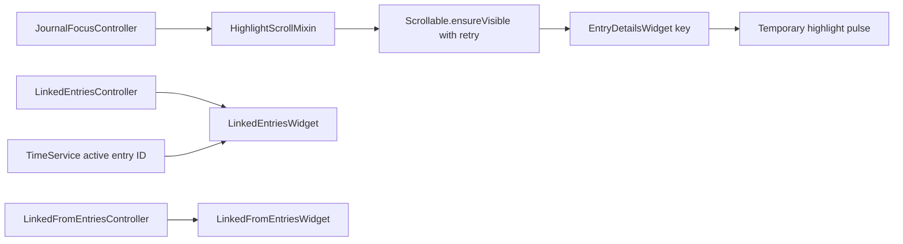

The important runtime details are:

- outgoing links are fetched from `JournalRepository.getLinksFromId(...)`
- hidden links can be included or excluded without changing the rest of the page
- the Filter & Sort modal can narrow the outgoing list to flagged entries only (`meta.flag == EntryFlag.import`); the check runs per row in `LinkedEntriesWidget` against the watched entry, so flagging or unflagging an entry updates the filtered list reactively
- outgoing links are ordered by the linked entity's editable `dateFrom`, not by link creation time, with a user-selectable direction (newest-first / oldest-first) via `LinkedEntriesSortController`, exposed as sort pills in the linked-entries Filter & Sort modal (links whose target has not yet resolved fall back to `link.createdAt`)
- the activity and sort controls reuse the same 28 px bordered `DsPill` shell as the task header, including its bounded hover treatment. Active activity pills apply their Timer, Audio, Images, or Code accent to both the icon and outline; inactive pills return to the quiet `decorative.level02` outline, while the sort trigger always keeps that neutral border. Labels stay at medium text emphasis. The Code pill only exists when at least one linked entry contains a coding prompt. Pills wrap as compact units rather than expanding into full-width rows
- the sort trigger includes a visible count when Hidden or Flagged-only is active, while its semantics name enumerates those active filters
- the Filter & Sort modal snapshots sort, hidden, and flagged state into one route-local draft. Done commits all three controller values together; barrier/back dismissal discards the draft. The notifier lives until Wolt removes the route subtree, so its exit fade cannot observe disposed state
- `LinkedEntriesWithTimer` only reacts to active timer entry ID changes, not every timer tick
- `HighlightScrollMixin` retries scroll-to-entry until the target widget is actually mounted, then applies a temporary highlight pulse

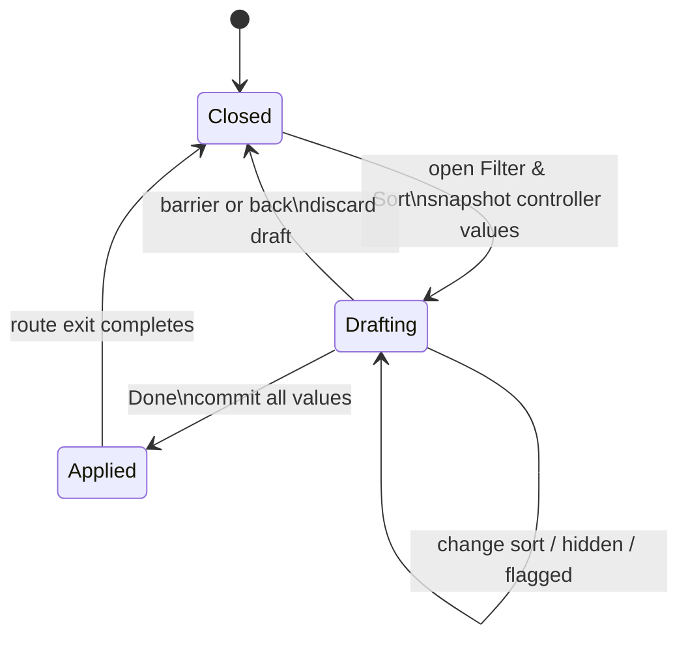

This is one of those features that feels trivial until it breaks. Then it immediately becomes obvious why it exists.

## Create, Import, and Paste Paths

The journal feature also owns the generic entry-creation surfaces that sit above domain-specific creation logic.

The main pieces are:

- [`CreateEntryModal`](ui/widgets/create/create_entry_action_modal.dart)
- [`FloatingAddActionButton`](ui/widgets/create/create_entry_action_button.dart)
- [`create_entry_items.dart`](ui/widgets/create/create_entry_items.dart)
- [`ImagePasteController`](state/image_paste_controller.dart)

Supported entry points include:

- create text entries
- create tasks
- create events
- start audio recordings
- create timer entries when already inside a parent entry
- import images
- create screenshots
- paste images from the clipboard
- drag and drop media onto the detail page

Two integration details are worth documenting because they are easy to miss:

- image import and paste flows can trigger automatic image-analysis callbacks supplied by the AI feature
- drag-and-drop, photo-library and clipboard image imports preserve JPEG and PNG bytes; on platforms with HEIC/HEIF conversion support, high-efficiency inputs are converted to JPEG unless the HEIF metadata declares an alpha auxiliary image, in which case they are converted to PNG so transparency survives
- creating a timer from a linked context polls for the new linked entry and then publishes a focus intent so the page scrolls to the freshly created timer entry
- image and audio entries add a desktop-only file-manager reveal action to the
  existing entry Actions sheet without changing the underlying entity model

## Repository Responsibilities

[`journal_repository.dart`](repository/journal_repository.dart) is intentionally an app-facing facade, not a second persistence layer.

It handles:

- loading entries by ID
- updating category IDs
- updating entry dates
- soft-deleting journal entities
- updating full entities
- creating text entries
- creating image entries
- updating links
- removing links
- fetching outgoing linked entities, reverse-linked entities, and linked images for tasks

It delegates the actual storage and sync work to:

- `JournalDb`
- `PersistenceLogic`
- `VectorClockService`
- `OutboxService`
- `NotificationService`
- `TimeService`

## Side Effects That Matter

The journal feature looks like basic CRUD until you follow the side effects.

Some of the important ones already wired here are:

- deleting an image clears any task `coverArtId` that references it
- deleting a currently running entry stops the timer
- deleting an entry updates the badge through `NotificationService`
- updating a link emits `UpdateNotifications`
- updating a link also writes a sync outbox message with a fresh vector clock
- creating image entries can invoke higher-level callbacks such as automatic analysis

That is normal for this feature. It is the app's entry hub. Quiet side effects would be stranger than visible ones.

## Current Constraints

- the journal feature owns the shared surface, not every per-entity widget
- browse state for journal and tasks still lives in one controller because the underlying pagination and search substrate is shared
- vector search depends on the embedding stack being available and only runs as a first-page search mode
- some cross-feature behaviors, especially AI, ratings, tasks, and speech, are layered onto journal surfaces rather than reimplemented elsewhere

## Relationship To Other Features

- `tasks` adds task-specific forms, checklists, labels, priorities, and progress behavior
- `speech` adds recording and playback around `JournalAudio`
- `ratings` plugs `RatingSummary` and post-session prompts into journal detail surfaces
- `ai` adds analysis, automatic image handling, nested AI responses, and vector search infrastructure
- `sync` propagates entry and link mutations across devices

If you want to understand where an entry is created, loaded, edited, searched, linked, or deleted, start here first. Even when another feature owns the headline behavior, there is a good chance the journal feature is still holding the floorboards together.

## Desktop Keyboard Commands

The infinite journal page owns contextual refresh, search focus, and creation
handlers. The reusable rich-text editor owns the focus-local save handler on
every surface where it is embedded; the entry detail page also keeps a
page-level save handler for the rest of that surface. Neither controller
registers a process-global hotkey; the handlers exist only with their widget
scope.

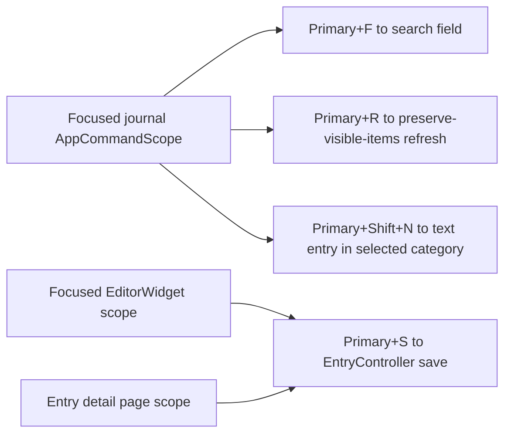

Global Primary+6 navigation and Primary+N text-entry creation are provided by
the app shell. This separation keeps page context—such as the currently
selected category—inside the journal feature while global creation remains
available from every destination.
