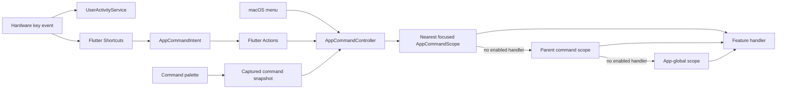
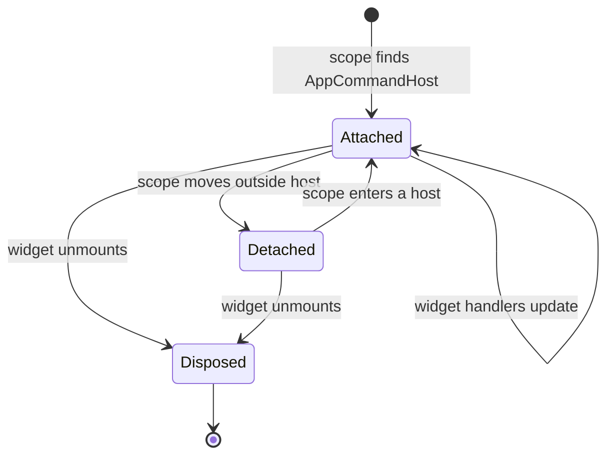
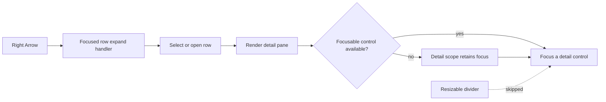

# Desktop Keyboard Commands

The keyboard feature is Lotti's desktop command layer. It turns platform key
combinations into typed `AppCommandId` values, resolves those commands against
the focused feature scope, and exposes the same command metadata to Flutter
shortcuts, the macOS menu bar, the command palette, and localized help.

It deliberately does not provide OS-global hotkeys. Commands exist only while
Lotti is active, and feature handlers exist only while their widgets are
mounted.

## Runtime architecture

`AppCommandCatalog` is the single source of truth for command identity,
category, context, bindings, palette visibility, destructive status, and repeat
policy. `AppCommandText` resolves localized labels, while
`ShortcutLabelFormatter` renders the exact active-platform notation.

`AppCommandHost` lives inside the localized `MaterialApp.router` builder. It
owns the dispatcher and focus-region registry, installs global shortcuts, and
reports key-down/key-repeat activity without consuming the event. The host's
resolved desktop platform is inherited by every nested scope, so global and
contextual bindings cannot disagree about whether Primary means Command or
Control.

## Scope lifecycle and resolution

`AppCommandScope` stores handlers in a mutable lifecycle node behind an
inherited marker. Registration reads the host without subscribing to dispatcher
notifications, avoiding registration/notification rebuild loops.

Resolution starts at the nearest scope containing primary focus. When native
macOS menus temporarily take focus away from Flutter, the dispatcher retains
the last nearest focused scope. Captured palette snapshots stop resolving as
soon as their scope is detached or disposed. One-shot commands reject
concurrent re-entry; only catalog commands marked `allowRepeat` accept key
repeats.

## Global desktop bindings

“Primary” means Command on macOS and Control on Windows/Linux.

| Command | Binding |
| --- | --- |
| Open command palette | Primary+K |
| Open shortcut help | Primary+? or F1 |
| New text entry | Primary+N |
| New task | Primary+T |
| Capture screenshot | Primary+Alt+S |
| Tasks / Daily OS / Projects / Habits | Primary+1 / 2 / 3 / 4 |
| Dashboards / Journal / Events / Settings | Primary+5 / 6 / 7 / 8 |
| Zoom in / out / reset | Primary+Plus / Minus / 0 |
| Next / previous focus region | F6 / Shift+F6 |

The numbered navigation map is semantic and does not shift with feature flags.
If an optional destination is disabled, its number remains an intentional gap.

Feature scopes add contextual bindings such as Primary+S (save), Primary+R
(refresh), Primary+F (focus search), and Primary+Shift+N (create in context).
Conventional control bindings—arrows, Home/End, Enter/Space, F2, Delete,
Escape, and Alt+Up/Down—are cataloged for tree, list, modal, and reorderable
surfaces. A control only registers the handlers that it implements.

## Palette, help, and native menus

The command palette captures the focused scope before its search field takes
focus. It filters out unavailable contextual commands and searches localized
labels, localized categories, and the exact platform notation shown in each
row (`Ctrl+S`, `⌘S`, `F6`, and so on; spaces and `+` separators are ignored).
Rows are traversed in the same category order in which they are rendered:
Up/Down wrap, Home/End jump to the limits, and every keyboard selection is
scrolled fully into view. Selecting a result closes the dialog, restores the
invoking focus node, and then invokes the captured command.

The quick help overlay and Settings > Keyboard shortcuts render from the same
catalog. The persistent page includes commands that are hidden from the
palette, such as local interaction grammar, so it is the complete reference.
Its read-only rows keep normal text emphasis without pretending to be buttons,
and Arrow/Page/Home/End keys scroll the reference while its search field owns
focus.

On macOS, File, View, Go, and Help menus are adapters over the catalog and
dispatcher. They do not own duplicate callbacks or shortcut definitions.

## Focus regions and interaction primitives

`KeyboardFocusRegion` registers desktop panes for F6 traversal, remembers the
last focused descendant, and falls back to the first traversable descendant.
When a region is temporarily empty, its scope owns focus until content renders;
normal traversal can then enter the new descendants without falling back to the
previous pane. The desktop shell registers navigation and active content
regions and excludes inactive `IndexedStack` destinations from focus.

`ListDetailFocusTraversal` gives desktop list/detail layouts a private pair of
focus regions around their resize divider. A focused row can invoke the typed
`expand` command, update the selected route, and then focus the first real
available control in the detail pane after that frame. If the detail is still
loading, the detail scope retains focus until its controls render. The divider
stays independently focusable for deliberate resizing, but it is not an
intermediate stop in this row-to-detail transition.

Reusable interactions extended by this feature include:

- keyboard-resizable `ResizableDivider` instances with slider semantics;
- Task and Project list rows whose Right Arrow transition enters the detail
  region without giving the divider accidental ownership;
- Settings tree rows with Up/Down traversal and Left/Right collapse/expand;
- `HoldToConfirm`, where pointer users retain hold confirmation while
  Enter/Space and accessibility activation follow normal button semantics.

Editor surfaces—including journal/project forms, task and checklist titles,
the shared settings-detail shell, and AI provider/model forms—register save
and cancel handlers in their nearest `AppCommandScope`. Their command
availability follows the same validity, dirty, and in-flight predicates as
their visible actions. Control-specific text gestures such as bare Enter or
Primary+Enter remain local because they are not app commands.

## Adding a command handler

1. Reuse an existing `AppCommandId`, or add a typed definition and localized
   copy when the command is genuinely new.
2. Wrap the smallest focused surface that owns the behavior in
   `AppCommandScope`.
3. Register only enabled handlers for that surface; keep destructive
   confirmation inside the feature workflow.
4. Add a source-mirrored widget test that sends the real key combination or
   invokes a captured snapshot.
5. If visible copy changes, update all six primary ARBs and regenerate l10n.

Do not register process-global callbacks from controllers or dialogs. Do not
duplicate key combinations in feature code or help text.

## Verification

Pure tests cover catalog completeness, conflicts, platform resolution, repeat
policy, and localized formatting. Widget tests cover nearest-scope dispatch,
global fallback, re-entry, scope disposal, native-menu context retention,
keyboard activity, F6 traversal, palette visual-order traversal, selected-row
visibility, shortcut-string search, help scrolling, focus restoration,
settings help, scoped editor save/cancel, tree navigation, keyboard resizing,
and accessible confirmation.
