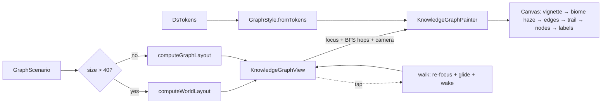

# Knowledge-Graph Explorer — Proof of Concept

Phase-0 spike for the knowledge-graph explorer described in
[ADR 0029](../../../docs/adr/0029-knowledge-graph-explorer.md) (research:
[`docs/research/2026-06-18_knowledge_graph_visualization_panel.md`](../../../docs/research/2026-06-18_knowledge_graph_visualization_panel.md)).

A **walkable** knowledge-graph view drawn with a 2D `CustomPainter`. You "stand
on" a focus node; its 1–2-hop neighborhood is framed and bright while the rest of
the world recedes into faint, category-tinted "horizon stars". Tap a node and the
camera **walks the link** to it — it becomes the new focus, its neighbors expand
in, and a trail + ghost ring mark where you came from. A side **inspector**
previews the focus node (cover, type, category, age, links, TL;DR).

This is a throwaway visual/interaction spike: it runs on **synthetic,
deterministic scenarios**, not real `JournalEntity`/`EntryLink` data, so the
explorer could be reviewed independently of the data plumbing. A four-discipline
expert panel (information visualization, ontology/graph-DB, open-world game
design, Flutter rendering) reviewed it across several iterations to a **9.2/10
consensus on interaction *and* looks** (every reviewer ≥ 9.0).

## Design (what the panel signed off on)

- **Ego / degree-of-interest, never the whole graph.** The focus is framed;
  emphasis falls off with BFS graph-distance, so a ~120-node world reads as a
  legible local neighborhood plus a faint horizon — no hairball.
- **Walk-the-link navigation.** Tap → the camera glides (emphasized easing + a
  "travel dolly" that pulls back mid-move and settles) to the new focus; a
  brightening **wake trail** and a **ghost ring** make the traversal read as
  travel. **Back / Recenter** controls + history. Free pan / pinch-zoom anytime.
- **Relation class drives edge styling.** Containment = thick near-white
  backbone; the generic `BasicLink` association splits into *linked-task*
  (dashed + arrow) vs *note/log*; AI provenance = cyan dash; rating/evaluation =
  pink dot-dash. Edge hues are kept **outside** the node-category palette.
- **Encoding.** Category → node hue; type → glyph; degree → size; recency →
  luminance within the node's own hue; graph-distance → atmospheric depth dimming
  of nodes and the edges reaching them.
- **Atmosphere ("place").** Radial vignette + faint star-field; soft
  category-tinted **biome haze** behind clusters (so you can aim at distant
  regions); lit-sphere nodes with a glow; the focus on a contact-shadow seat. No
  streaks / XP / badges.
- **Inspector preview.** Center-right card: category-gradient cover + glyph,
  title, type · category, created + link count, TL;DR; updates as you walk.

All colors and text styles come from the design-system tokens (`DsTokens`); the
painter takes a plain `GraphStyle` value object so it never needs a
`BuildContext`. The overlay is wrapped in a transparent `Material` so widget text
renders cleanly outside a `Scaffold`.

## Files

| File | Role |
|------|------|
| `domain/graph_models.dart` | `GraphNode` / `GraphEdge` / `GraphScenario`, type enums, `degreeMap`. |
| `domain/graph_scenarios.dart` | Deterministic scenarios: `exploreWorldScenario` (~120 nodes) + the task ego-views (`taskEgoNetworkScenario`, `busyTaskScenario`, `lightTaskScenario`). |
| `domain/graph_layout_engine.dart` | `computeGraphLayout` (ego sector seed + FR relax) and `computeWorldLayout` (world-scale FR). Deterministic, seeded. |
| `ui/graph_style.dart` | Token-backed `GraphStyle`, node glyphs, type labels, and the relation-class → `EdgeVisual` mapping. |
| `ui/knowledge_graph_painter.dart` | The `CustomPainter`: atmosphere, biome haze, edges, walk trail, lit nodes, ghost ring, labels. |
| `ui/knowledge_graph_view.dart` | Host: layout choice, fit/walk camera, pan/zoom/tap, history, title + controls + inspector + legend. |
| `dev_main.dart` | Standalone dev entrypoint to explore interactively. |

## Pipeline



## Previewing

Interactive (pan / pinch-zoom / tap-to-walk, with a scenario + theme switcher):

```bash
fvm flutter run -t lib/features/knowledge_graph_poc/dev_main.dart -d linux   # or macos / a device
```

Deterministic screenshots (mobile + desktop), via the screenshot harness:

```bash
fvm flutter test \
  test/features/knowledge_graph_poc/ui/knowledge_graph_screenshots_test.dart \
  --update-goldens
# PNGs → test/features/knowledge_graph_poc/ui/screenshots/ (gitignored)
```

## Status & next steps

POC complete and panel-approved on both interaction and looks. Not wired into app
routes and not real data. The path to a shippable feature (per ADR 0029) is
Phase 1 — bind to real `linked_entries` (an adapter projecting a task's links into
this graph model) and add an entry affordance from the task UI — then the perf
spike (Barnes–Hut layout in an isolate, `drawRawAtlas` batching, viewport
culling) before scaling past the local neighborhood. Non-blocking polish the panel
flagged for later: keep biome haze legible at the pulled-back zoom (aiming from
out in the field), a touch more ghost-ring contrast, and larger control hit
targets.
