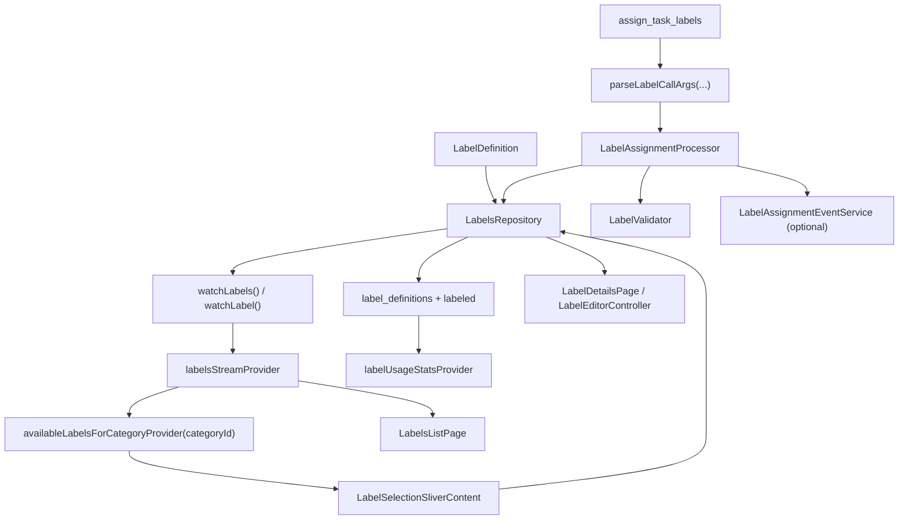
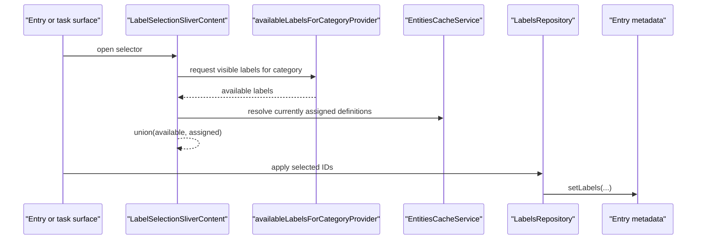
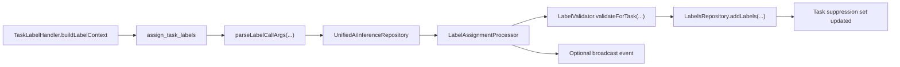

# Labels Feature

Labels are the app's lightweight taxonomy layer: more flexible than a single status, less structural than categories, and cheap enough to attach directly to journal entries. In practice they matter most around tasks, but the assignment plumbing is intentionally reusable across entry types.

The feature keeps two concerns separate:

- label definitions: what labels exist, how they look, whether they are private, and which categories they apply to
- label assignment: which entry metadata currently carries which label IDs, plus which labels AI should stop suggesting for a specific task

## What This Feature Owns

At runtime, the feature owns:

1. label definition CRUD
2. visibility-aware label definition streams
3. category-scoped availability filtering
4. label usage counts from the `labeled` lookup table
5. reusable label display and modal-opening helpers
6. task-side AI assignment validation, suppression, and add-only persistence

It does not own every concrete label UI surface. The shared modal helper lives here, but the main task picker and task wrapper live under `features/tasks`.

## Directory Shape

```text
lib/features/labels/
├── constants/
│   ├── label_assignment_constants.dart
│   └── label_color_presets.dart
├── repository/
│   └── labels_repository.dart
├── services/
│   ├── label_assignment_event_service.dart
│   ├── label_assignment_processor.dart
│   └── label_validator.dart
├── state/
│   ├── label_editor_controller.dart
│   └── labels_list_controller.dart
├── ui/
│   ├── pages/
│   │   ├── label_details_page.dart
│   │   └── labels_list_page.dart
│   └── widgets/
│       ├── entry_labels_display.dart
│       ├── label_chip.dart
│       ├── label_editor_sheet.dart
│       └── label_selection_modal_utils.dart
└── utils/
    ├── assigned_labels_util.dart
    └── label_tool_parsing.dart
```

Important label-adjacent files outside this folder:

- `lib/features/tasks/ui/labels/label_selection_modal_content.dart`
- `lib/features/tasks/ui/labels/task_labels_wrapper.dart`
- `lib/features/agents/tools/task_label_handler.dart`
- `lib/features/ai/repository/unified_ai_inference_repository.dart`

## Runtime Architecture



Labels are not just colored chips. They are synced definitions, category-scoped availability rules, a cheap lookup path for filtering, and a task-side suppression mechanism so rejected AI suggestions do not keep coming back.

## Core Model

The core entity is `LabelDefinition` from `entity_definitions.dart`.

Fields this feature actively uses:

- `id`
- `name`
- `color`
- `description`
- `private`
- `applicableCategoryIds`
- `deletedAt`
- `createdAt`
- `updatedAt`

`sortOrder` exists on the entity, but the current UI does not expose ordering controls. Most label surfaces sort alphabetically by name instead.

Category scope is intentionally simple:

- `null` or empty `applicableCategoryIds` means the label is global
- a non-empty list means the label is only in scope for those categories

## Persistence Model

There are three persistence concerns in play:

1. label definitions in `label_definitions`
2. assignment lookup rows in `labeled`
3. per-task AI suppression in `Task.data.aiSuppressedLabelIds`

The `labeled` table exists because filtering and usage counts need to stay cheap. Recomputing label membership from serialized entity blobs on every filter change would be the wrong trade.

Suppression is task-local state, not definition state. It records "do not suggest this label again for this task" after a user or workflow explicitly rejects it.

## Repository Boundary

`LabelsRepository` is the feature's write boundary.

It handles:

- streaming all label definitions
- reading single labels and usage counts
- creating, updating, and soft-deleting definitions
- building `{id, name}` tuples for display or AI context
- adding, removing, and replacing assigned label IDs on entries
- maintaining task suppression state as label assignments change

### Definition Writes

Create and update normalize category scope before persisting:

- trim category IDs
- drop empties
- remove duplicates
- discard unknown categories
- sort surviving category IDs by category name for stable diffs

Delete is soft-delete. `deleteLabel()` sets `deletedAt` and re-upserts the definition instead of hard-removing it.

### Assignment Writes

Assignment writes are stricter than a generic chip picker:

- `addLabels()` appends only missing IDs
- `removeLabel()` removes one label ID
- `setLabels()` replaces the full set, resolves only existing non-deleted labels, dedupes the result, and stores IDs sorted by label name

For tasks, assignment writes also update suppression:

- removing a label adds it to `aiSuppressedLabelIds`
- adding a label removes it from `aiSuppressedLabelIds`
- `setLabels()` computes the diff and updates suppression in both directions

That coupling is deliberate. "I removed this label from this task" is useful feedback for later AI suggestions.

## Read Side And Visibility

The feature's read side is small and compositional.

### `labelsStreamProvider`

`labelsStreamProvider` combines:

- `LabelsRepository.watchLabels()`
- the current private-mode flag from `showPrivateEntriesProvider`

It returns the visible label-definition set for ordinary UI surfaces. Private labels disappear when private mode is off.

### `availableLabelsForCategoryProvider(categoryId)`

This provider takes the visible label stream and delegates category filtering to `EntitiesCacheService.filterLabelsForCategory()`.

The result is:

- all visible global labels
- plus visible labels explicitly scoped to the current category

Deleted labels are filtered out in this step by `EntitiesCacheService.filterLabelsForCategory()`.

### `labelUsageStatsProvider`

The Settings list page also watches label usage counts derived from the `labeled` table. That count is display data, not definition state.

## Definition UI

There are two editor shells backed by the same controller:

- `LabelDetailsPage` for the full Settings route
- `LabelEditorSheet` for quick-create from the assignment picker

Both are driven by `LabelEditorController`.

### `LabelEditorController`

The controller owns local form state:

- name
- description
- color
- privacy toggle
- selected category IDs
- `isSaving`
- `hasChanges`
- inline error message

It also enforces a few semantics that are easy to get subtly wrong:

- names are trimmed before validation and persistence
- duplicate names are rejected case-insensitively
- descriptions are sanitized for stray invisible characters
- in update mode, `null` means "leave description unchanged" while an empty string means "clear it"

That last rule matters because route-backed editing and bottom-sheet quick-create do not share the same widget lifecycle, but they do share the same persistence semantics.

## Settings Surfaces

### `LabelsListPage`

The list page is the label-management surface in Settings. It provides:

- search by name or description
- usage counts
- route-based creation when a search query has no exact match
- navigation into per-label details
- a create FAB that is lifted above the shared bottom-navigation shell

Rows show more than the chip itself:

- label preview
- raw hex color
- private badge when applicable
- scoped category pills
- description preview
- usage count

### `LabelDetailsPage`

The details page is the route-backed editor for create and edit flows. It supports:

- name and description editing
- color picking from presets or custom color
- multi-category scoping
- privacy toggle
- soft delete in edit mode

## Assignment UI

Assignment UI is reusable and not task-exclusive, even though tasks are the most important caller.

The main pieces are:

- `EntryLabelsDisplay` for showing assigned chips on generic entry surfaces
- `LabelSelectionModalUtils` for opening the shared modal shell and sticky action bar
- `LabelSelectionSliverContent` in `features/tasks` for the actual selectable list
- `TaskLabelsWrapper` in `features/tasks` for the task-specific "Add Label" surface

`LabelChip` itself is intentionally modest: neutral chip chrome, a colored dot, and a tooltip that prefers the description over the bare name.

## Assignment Flow



Two runtime rules matter here:

- the selector unions currently assigned labels back into the list, even when they are now out of scope, so the user can still remove them
- inline quick-create is allowed from the selector, and a newly created label is immediately selected

Without the first rule, category scoping would create stranded labels that the UI can hide but not undo. That would be software being clever in exactly the wrong direction.

## AI Label Assignment

Task-side AI assignment is layered on top of the general label system rather than baked into the picker.

### Tool Shape

The AI-facing tool is `assign_task_labels`.

The preferred payload is:

```json
{
  "labels": [
    {"id": "bug", "confidence": "very_high"},
    {"id": "backend", "confidence": "high"}
  ]
}
```

Legacy `labelIds` input is still accepted, but current parsing prefers structured labels with confidence.

### Runtime Flow



There are two practical entry points:

- `TaskLabelHandler` builds label context for agent prompts and can process structured task-tool arguments directly
- `UnifiedAiInferenceRepository` parses tool-call arguments during inference execution and delegates the real decision to `LabelAssignmentProcessor`

### Guardrails

The AI path is intentionally add-only and defensive:

- if a task already has 3 or more labels, the task-side handler and processor no-op
- low-confidence labels are dropped during parsing
- the parser currently forwards at most 3 candidate IDs, ordered by confidence
- the processor still dedupes, rejects already-assigned IDs, and applies its own per-call cap as a second guard
- labels must exist, must not be deleted, must be in category scope, and must not be suppressed for that task

The current prompt context builder also includes:

- suppressed labels that must not be proposed
- available labels that are in scope and not already assigned

So the feature tries to stop bad assignments both before and after the model speaks.

### Suppression Semantics

Suppression is per task, not global:

- manual removal suppresses that label for that task
- manual re-add unsuppresses it
- rejected agent change-set items can explicitly call `suppressLabelOnTask()`
- the inference path hard-filters suppressed IDs before processor validation, and the processor checks again for defense in depth

### `LabelAssignmentEventService`

The processor publishes a `LabelAssignmentEvent` when labels are assigned and the service is registered. In the current code this is an integration seam, not a source of truth. Persistence still lives in the repository and task metadata.

## Private Labels

Private labels follow the same visibility rule as other private entities:

- when private mode is on, they participate normally
- when private mode is off, list and picker surfaces filter them out

Entry display widgets apply the same rule when resolving assigned label chips from `EntitiesCacheService`.

## Sync And Delete Behavior

Label definitions are regular synced entity definitions, so create, update, and soft-delete go through the usual definition persistence path.

That means:

- label definitions sync like other entity definitions
- deleting a label is represented as definition state, not a local-only UI gesture
- assignment rows remain a separate lookup concern

Assignment itself lives on entry metadata plus the `labeled` table, so synced entries carry their assigned label IDs through the normal journal update flow.

## Why The Feature Is Structured This Way

Labels are supposed to feel lightweight in the UI, not in the implementation. Once they drive filtering, category scope, AI suggestions, and per-task suppression, the only sane move is to keep the seams explicit.

This feature does that by splitting:

- definition management
- visibility filtering
- category scoping
- reusable entry assignment
- task-specific AI assignment and suppression

instead of pretending everything is just "some chips on a card."

## Testing

Run the label-related tests with:

```sh
fvm flutter test test/features/labels/
```
