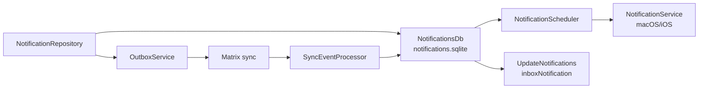
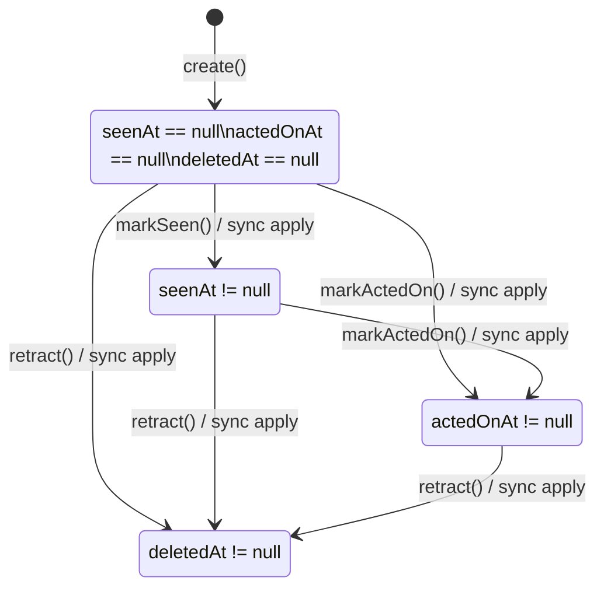

# Synced Notifications

Synced notifications are durable app-level alerts stored outside the journal
database. They carry AI/task suggestions across devices, then use monotonic
state timestamps to converge when a user dismisses, acts on, or retracts an
alert on any device.

## Runtime Shape

- `NotificationEntity` is a Freezed union in
  `lib/classes/notification_entity.dart`.
- `NotificationMeta` stores the synced row identity, scheduled delivery time,
  vector clock, origin host, optional category, and monotonic state fields.
- `NotificationsDb` is a separate Drift database. Notification writes do not
  take the `JournalDb` writer lock.
- Full notification payloads sync as `SyncNotification` with a JSON attachment
  under `/notifications/<id>.json`.
- State changes sync as `SyncNotificationStateUpdate` inline messages so a
  dismiss/action/retract does not resend the full payload.

## Lifecycle

`seenAt`, `actedOnAt`, and `deletedAt` are one-way fields. When two devices set
the same field offline, merge keeps the earliest non-null timestamp. Mutable
content fields use last-writer-wins on `meta.updatedAt`; notifications are
ephemeral and do not route through the journal conflict UI.

## Scheduling

`NotificationScheduler` reads pending rows and bridges them to
`NotificationService`. Rows scheduled in the future use
`scheduleNotificationAt`, which preserves the full date. Due rows use
`showNotificationNow`; they do not reuse the legacy `scheduleNotification`
method because that method intentionally schedules for "today at HH:mm:ss".

OS notification IDs are derived from the notification UUID with stable
FNV-1a-32 masked to 31 bits, so cancellation survives app restarts.
