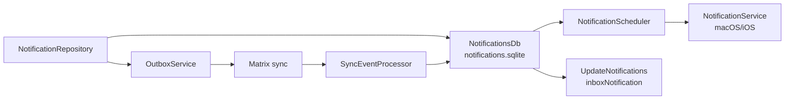
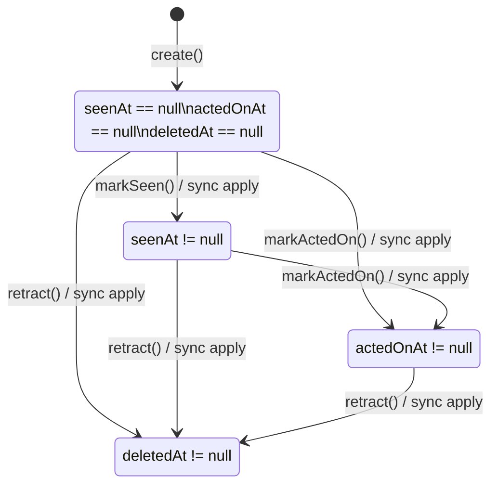
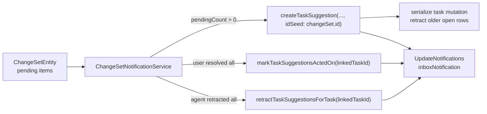

# Synced Notifications

Synced notifications are durable app-level alerts stored outside the journal
database. They carry AI/task suggestions across devices, then use monotonic
state timestamps to converge when a user dismisses, acts on, or retracts an
alert on any device.

## Runtime Shape

- `NotificationEntity` is a Freezed union in
  `lib/classes/notification_entity.dart`.
- `NotificationMeta` stores the synced row identity, scheduled delivery time,
  vector clock, origin host, optional category, and monotonic state fields.
- `NotificationsDb` is a separate Drift database. Notification writes do not
  take the `JournalDb` writer lock.
- Full notification payloads sync as `SyncNotification` with a JSON attachment
  under `/notifications/<id>.json`.
- State changes sync as `SyncNotificationStateUpdate` inline messages so a
  dismiss/action/retract does not resend the full payload.

## Lifecycle

`seenAt`, `actedOnAt`, and `deletedAt` are one-way fields. When two devices set
the same field offline, merge keeps the earliest non-null timestamp. Mutable
content fields use last-writer-wins on `meta.updatedAt`; notifications are
ephemeral and do not route through the journal conflict UI.

## Agent Proposal Bridge

Task-agent proposal notifications may be seeded with the `ChangeSetEntity.id`
so a fresh wave can create a new durable row after an older row was acted-on or
retracted. The active inbox invariant is still task-scoped:
`NotificationRepository.createTaskSuggestion` serializes the task's notification
mutation, writes (upserts) the new row, then retracts every other open
`taskSuggestion` row for the same linked task (excluding the row it just wrote),
so the bell can never show multiple suggestion rows for the same task. The bell
projection also deduplicates by
`(type: taskSuggestion, linkedTaskId)` so stale rows left by older app versions
cannot render as duplicate inbox entries or inflate the badge count.

After the user confirms or rejects a proposal,
`ChangeSetConfirmationService` calls `ChangeSetNotificationService`; after the
agent retracts stale proposals, `SuggestionRetractionService` calls the same
bridge. The bridge refreshes the row when pending items remain and clears every
open suggestion row for the task when the change set has no pending items:

Tapping a `taskSuggestion` inbox row publishes a `TaskFocusTarget.suggestions`
intent before opening the linked task. If the task detail is already mounted,
it consumes that intent and scrolls directly to the proposals section; if the
task detail is created by the navigation, it consumes the same intent after the
proposal widget appears. The tap marks only the inbox row as seen; it does not
mark suggestions acted-on and notification lifecycle writes are emitted through
the UI-only notification stream, so opening the task cannot wake its task agent.

## Scheduling

`NotificationScheduler` reads pending rows and bridges them to
`NotificationService`. Rows scheduled in the future use
`scheduleNotificationAt`, which preserves the full date. Due rows use
`showNotificationNow`; they do not reuse the legacy `scheduleNotification`
method because that method intentionally schedules for "today at HH:mm:ss".

OS notification IDs are derived from the notification UUID with stable
FNV-1a-32 masked to 31 bits, so cancellation survives app restarts.
