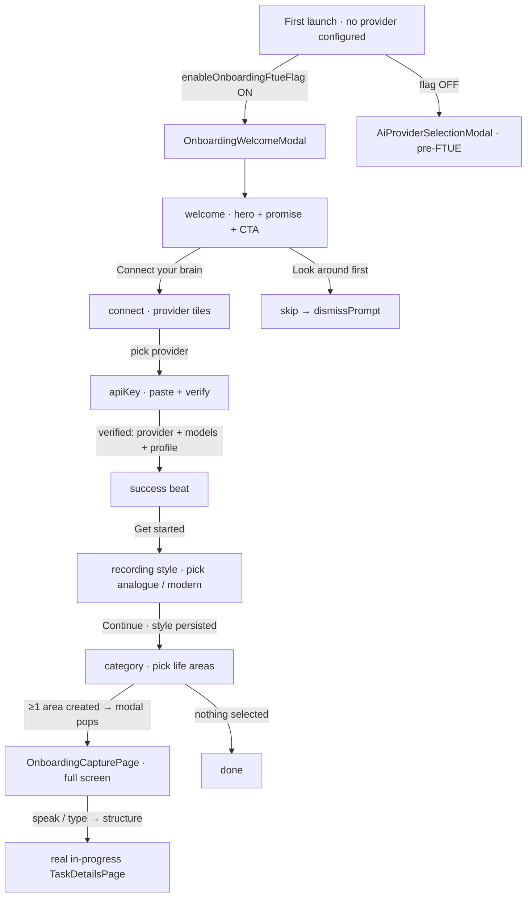
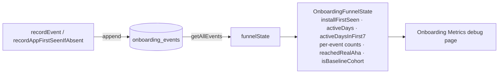
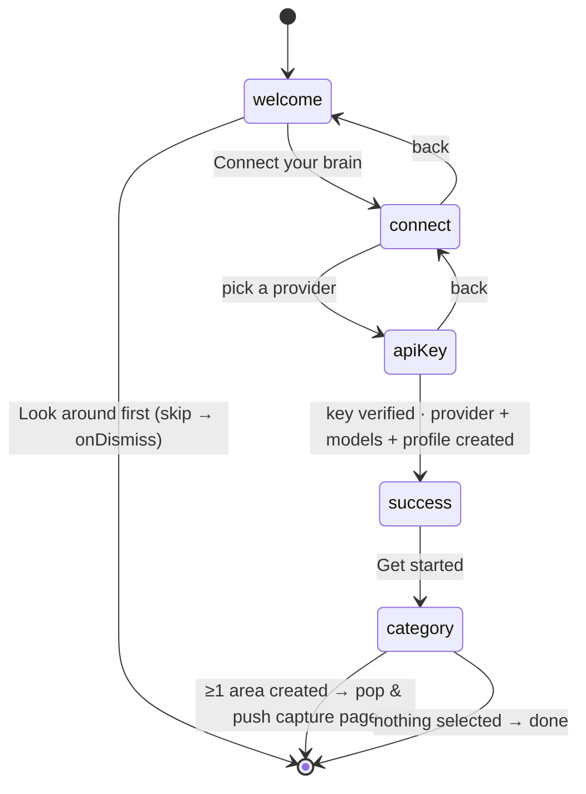
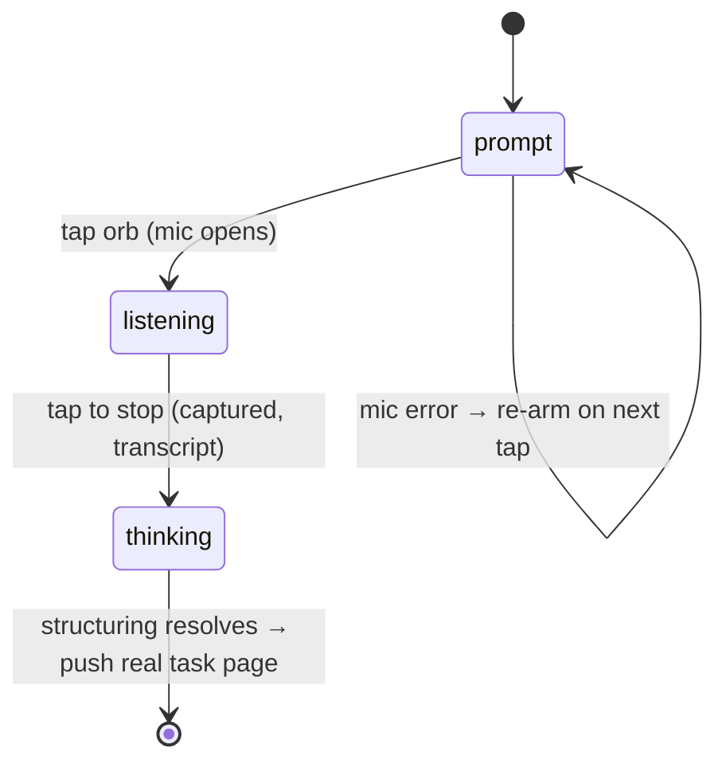

# Onboarding (FTUE)

First-time-user-experience for Lotti. The goal is to guide a brand-new user to the
core "aha" — *speak a thought, watch it become a structured task* — and to lift
D3/D7/D30 retention. The full design and phased build plan live in
[`docs/implementation_plans/2026-06-21_ftue_onboarding.md`](../../../docs/implementation_plans/2026-06-21_ftue_onboarding.md).

> **Status.** **Phase 0** (measurement substrate), **Phase 1** (welcome +
> connect-your-brain front door) and **Phase 2** (the live voice→task aha) are
> implemented. The **D1 return loop** (Phase 3) is forthcoming. The whole flow is
> gated behind the `enableOnboardingFtueFlag` config flag (default **off**) while
> it is finished — until that flag is enabled, first-run AI setup falls back to
> the pre-FTUE `AiProviderSelectionModal`, so end users see no change yet. This
> README documents what exists in code today and is updated as each phase lands.

## End-to-end flow

The welcome → category steps live inside **one transparent, barrier-dismissible
full-screen route** (`OnboardingWelcomeModal`). The capture page is pushed as a
**separate** full-screen route once the modal pops, because its full-bleed
Spacer-based layout needs the whole viewport (not the modal's scroll view).

## Phase 0 — measurement substrate

The substrate is built **before** any onboarding UI so the funnel is queryable and
the retention goal is falsifiable. It records a content-free event log and derives
the funnel state from it.

### Why a dedicated store

`captureEvent`/`LoggingService` only appends to text log files, and
`UserActivityService` is in-memory — neither can answer conversion questions. So
the funnel needs a queryable store. It lives in its own Drift database
(`OnboardingMetricsDb`) rather than the heavily-shared `SettingsDb`, mirroring the
other small single-purpose DBs (`NotificationsDb`, `EditorDb`).

### Components

| Piece | File | Role |
|---|---|---|
| `OnboardingMetricsDb` | `lib/database/onboarding_metrics_db.dart` (+ `.drift`) | Append-only `onboarding_events` table + queries. **Source of truth.** |
| `OnboardingEventName` / `OnboardingFunnelState` | `model/onboarding_event.dart` | Event vocabulary + derived-state model + `onboardingDayBucket` helper. |
| `OnboardingMetricsRepository` | `repository/onboarding_metrics_repository.dart` | Records events (injected clock/id/platform) and derives funnel state. |
| `OnboardingMetricsPage` / `OnboardingMetricsBody` | `ui/onboarding_metrics_page.dart` | Read-only debug surface under Settings → Advanced → Onboarding Metrics. |

### Privacy

The event table is **content-free by construction**: it stores only event names, a
coarse UTC day bucket, and a small fixed set of low-cardinality dimensions
(`platform`, `provider`, `reason`) plus an already-bucketed integer. No transcript,
audio, or thought text is ever written.

### Derivation: event log → funnel state

`OnboardingFunnelState` is computed on demand from the full event log — it is never
persisted as a second store.

### Baseline cohort

`recordAppFirstSeenIfAbsent()` runs once at startup (wired in `get_it.dart`, before
any onboarding UI shows) so that **pre-FTUE users upgrading into this build are
tagged as the baseline cohort** even if they never trigger the welcome. A user is
baseline when they had existing journal data at first record (`existing_user`) or
their first launch predates `kFtueReleaseDateUtc`. This gives a clean before/after
denominator for the retention comparison.

### Telemetry

Each recorded event also emits a `LogDomain.onboarding` line (toggle under
Settings → Advanced → Logging) for grep-friendly diagnostics, independent of the
queryable store.

## Phase 1 — welcome → connect → category

A transparent full-screen route hosts a small, locally-owned step machine
(`_OnboardingFlow` in `ui/onboarding_welcome_modal.dart`). Steps crossfade with an
`AnimatedSwitcher` + `AnimatedSize`; keeping the step state local (rather than
nested routes) keeps the in-panel back buttons reliably hittable.

- **`OnboardingWelcomeModal.show`** opens the transparent `PageRouteBuilder`
  (`opaque: false`, `barrierDismissible: true`, dim barrier). Tapping the dim
  barrier closes it, matching the app's modal convention. It records the
  connect-funnel events and, on success, pushes the capture page in its place.
- **Native provider creation.** Unlike a settings deep-link, the flow creates the
  provider **in place**: `OnboardingApiKeyPanel` runs the existing per-provider
  FTUE setup (`runFtueSetupForType` → `performXxxFtueSetup`), which creates the
  provider, ensures its known **models** exist, and reuses the startup-seeded
  inference **profile**. Crucially it passes `createDefaultCategory: false` — the
  onboarding category step owns category creation instead of auto-seeding a
  throwaway "Test Category".
- **Connect does not celebrate.** A quiet `OnboardingSuccessView` beat (checkmark
  scale-in + glow) acknowledges the connection; the celebration burst is reserved
  for the task payoff alone (one owner of the peak).
- **Step widgets** (`ui/widgets/`): `OnboardingHeroPanel` + `NeuralConstellation`
  (the always-dark cinematic welcome and its animated hero), `OnboardingConnectPanel`
  (provider tiles), `OnboardingApiKeyPanel` (key paste + verify), `OnboardingSuccessView`
  (connect beat), `OnboardingCategoryView` (the category step's presentational view).
- **Providers** — Gemini / Mistral / Qwen as co-equals (no default) + OpenAI /
  Ollama behind "More options". MLX is excluded from the FTUE (multi-GB download);
  it stays available in Settings. Visuals reuse `ai_provider_visual.dart`.
- **Funnel events** — `welcomeShown`, `providerModalShown`, `providerConnected`,
  `welcomeSkipped`.

### The category step

`_OnboardingCategoryStep` teaches the app's core model — *which AI runs is chosen
per category* — instead of silently creating a throwaway category. The user
multi-selects life areas (Work / Fitness / Family / Friends, or adds their own); a
"Why areas?" disclosure explains the per-category-provider mechanism. On continue,
each selected area becomes a real `CategoryDefinition` bound to the just-connected
provider's seeded inference profile (`onboardingSeededProfileId`), so every chosen
area can actually run inference.

`OnboardingCategoryView` renders the areas as a uniform two-column grid of chips
over the shared alive backdrop. Unselected chips are **teal-tinted frosted glass**
(a translucent brand-teal gradient painted over a `BackdropFilter`, under a crisp
hairline) so the colour lives in the chip material and the enriched backdrop reads
through; the selected chip fills solid brand with a trailing check. The shared
`_FrostedGlass` surface is reused by the quieter "+ Add your own" chip so the grid
reads as one glass family.

## Recording-style step

Between the success beat and the category step, a personalization step lets the
user pick how the mic looks during capture — and persists the choice for the real
capture (and a future Settings toggle).

- **`OnboardingRecordingStyleStep`** (`ui/widgets/`, ConsumerStatefulWidget) hosts
  the presentational **`OnboardingRecordingStyleView`** and owns the level source:
  a looping **simulated** signal by default (gated off under reduced motion), or
  the **live mic** when "Try with your voice" is on — recorded to a throwaway file
  via `AudioRecorderRepository` (levels only, never transcribed/saved; deleted on
  stop), falling back to the simulation if the mic can't start.
- Two themed pairs, each a live recording visual: **Modern** (the
  `AiVoiceInputShader` orb + a brand-tinted `LiveWaveform`) and **Analogue** (the
  skeuomorphic `AnalogVuMeter` + a neutral `LiveWaveform`). Only the selected card
  animates; the other rests on a calm static waveform.
- The choice is persisted by **`recordingStyleProvider`** (`state/recording_style.dart`,
  an `AsyncNotifier` over `AppPrefs`, default `modern`).

## Phase 2 — the live voice→task aha

`OnboardingCapturePage` (`ui/pages/`) hosts the presentational
`OnboardingCaptureView` on a full-screen dark surface and wires it to the **shared**
`captureControllerProvider` (the same mic/realtime pipeline the Daily OS capture
screen uses — no bespoke audio wiring) and to the
`onboardingCaptureToTaskServiceProvider` orchestrator.

The page maps the controller's `CapturePhase` onto the view's
`OnboardingCapturePhase` (prompt / listening / thinking). On reaching `captured`
with a non-empty transcript it records `firstAudioCaptured` once, then calls the
orchestrator **exactly once per capture** (guarded against double-fire). There is
no in-page reveal: when a real task lands, the page hands its id to `onTaskCreated`
and the host navigates to the **real `TaskDetailsPage`**.

- **Structuring** — `OnboardingTaskStructuringService` resolves the chosen
  category → profile → thinking model → provider and runs a single-shot
  `CloudInferenceRepository.generate` returning `{title, checklist[]}`.
  `OnboardingCaptureToTaskService` then materializes a real task **already in
  progress** (`PersistenceLogic.createTaskEntry` with `TaskStatus.inProgress` +
  `AutoChecklistService`) and emits the funnel events (`makeTaskTapped`, `realAha`,
  `structuringFailed`, `structuringFloorUsed`). On LLM failure it **soft-lands** on
  a title-only task (tagged `floor`, never counted as the real aha).
- **Real-task payoff** — the page navigates (replacing the capture route) to the
  in-app `TaskDetailsPage` for the new task — its own animated checklist + audio
  affordance — rather than a synthetic reveal, so the user lands on the real thing
  they just made. (`CrystallizeHero` lives on only as the hero-gallery
  `crystallize` style.)
- **Destination picker** — when the user created more than one area, a compact
  `_CategoryPicker` ("Where should this land?") appears above the prompt so they
  choose which area the task lands in. It shows only while the capture is still
  being composed (prompt / listening); once structuring starts the destination is
  locked and rides the resolved card.
- **Escape hatches** — a "Rather type?" path opens a typed-capture dialog routed
  through the same structuring pipeline, and an always-present close button
  finishes onboarding (the user can capture later).

## Accessibility — reduced motion

The shared voice visuals honor the OS "reduce motion" setting. The governing
principle is **kill the clock-driven looping animation, keep direct voice-level
feedback** (a volume response is information, not decoration):

- **`VoiceButton`** stops its idle-breath ticker (`_syncBreath`) while keeping the
  dBFS-driven core swell.
- **`AiVoiceInputShader`** holds its time ticker still and renders one calm static
  frame (still tinted by the live level).
- **`LiveWaveform`** ignores the live amplitudes and rests on a flat baseline
  (`LiveWaveformPainter.reducedMotion`), so the strip never dances.
- **`OnboardingRecordingStyleStep`** holds its simulated previews on a static
  frame under reduced motion.

The welcome hero (`NeuralConstellation`) and `CompletionCelebration` already
carry their own reduced-motion fallbacks.

`NeuralConstellation` paints a seeded, deterministic branching organism rather
than a proximity graph. The default topology is one root-like soma and spine:
secondary branches fork from stable parents, dim hairline offshoots probe
outward, and travelling activation tips move along the curved tendrils. The
welcome page opts into the denser variant (`vineCount` + `entanglement`): several
spines cross through shared convergence clusters, faint cross-links connect only
nearby separate vines, and the foreground branches draw as bundled strands so the
hero reads as neural tissue instead of a flat dot mesh. Later steps keep the
single-vine topology, lower alpha, fewer pulses, a smaller upward-shifted
composition, and a panel-coloured content scrim so provider cards and forms stay
dominant. The painter loops **seamlessly**:
every oscillation (node drift, breath, branch activation, and travelling pulses)
runs an integer number of cycles per loop and is driven off the controller's
normalized value, so the frame at the loop wrap is identical to the start — no
snap (`neuralPulseCyclesForLoop`, `NeuralNode`, `neuralPulseEnvAt`,
`neuralBranchProgressAt`).
