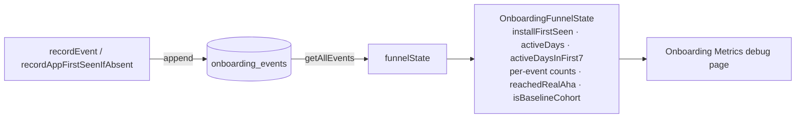
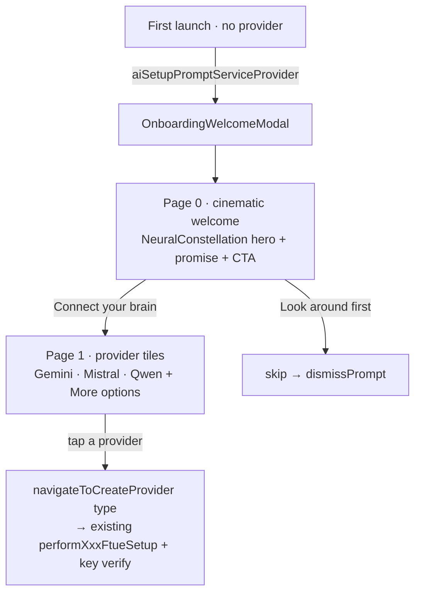

# Onboarding (FTUE)

First-time-user-experience for Lotti. The goal is to guide a brand-new user to the
core "aha" — *speak a thought, watch it become a structured task* — and to lift
D3/D7/D30 retention. The full design and phased build plan live in
[`docs/implementation_plans/2026-06-21_ftue_onboarding.md`](../../../docs/implementation_plans/2026-06-21_ftue_onboarding.md).

> **Status.** **Phase 0 (measurement substrate)** and **Phase 1 (welcome +
> connect-your-brain front door)** are implemented. The voice→task crystallize
> hero (Phase 2) and the D1 return loop (Phase 3) are forthcoming. This README
> documents what actually exists in code today and is updated as each phase
> lands.

## Phase 0 — measurement substrate

The substrate is built **before** any onboarding UI so the funnel is queryable and
the retention goal is falsifiable. It records a content-free event log and derives
the funnel state from it.

### Why a dedicated store

`captureEvent`/`LoggingService` only appends to text log files, and
`UserActivityService` is in-memory — neither can answer conversion questions. So
the funnel needs a queryable store. It lives in its own Drift database
(`OnboardingMetricsDb`) rather than the heavily-shared `SettingsDb`, mirroring the
other small single-purpose DBs (`NotificationsDb`, `EditorDb`).

### Components

| Piece | File | Role |
|---|---|---|
| `OnboardingMetricsDb` | `lib/database/onboarding_metrics_db.dart` (+ `.drift`) | Append-only `onboarding_events` table + queries. **Source of truth.** |
| `OnboardingEventName` / `OnboardingFunnelState` | `model/onboarding_event.dart` | Event vocabulary + derived-state model + `onboardingDayBucket` helper. |
| `OnboardingMetricsRepository` | `repository/onboarding_metrics_repository.dart` | Records events (injected clock/id/platform) and derives funnel state. |
| `OnboardingMetricsPage` / `OnboardingMetricsBody` | `ui/onboarding_metrics_page.dart` | Read-only debug surface under Settings → Advanced → Onboarding Metrics. |

### Privacy

The event table is **content-free by construction**: it stores only event names, a
coarse UTC day bucket, and a small fixed set of low-cardinality dimensions
(`platform`, `provider`, `reason`) plus an already-bucketed integer. No transcript,
audio, or thought text is ever written.

### Derivation: event log → funnel state

`OnboardingFunnelState` is computed on demand from the full event log — it is never
persisted as a second store.

### Baseline cohort

`recordAppFirstSeenIfAbsent()` runs once at startup (wired in `get_it.dart`, before
any onboarding UI shows) so that **pre-FTUE users upgrading into this build are
tagged as the baseline cohort** even if they never trigger the welcome. A user is
baseline when they had existing journal data at first record (`existing_user`) or
their first launch predates `kFtueReleaseDateUtc`. This gives a clean before/after
denominator for the retention comparison.

### Telemetry

Each recorded event also emits a `LogDomain.onboarding` line (toggle under
Settings → Advanced → Logging) for grep-friendly diagnostics, independent of the
queryable store.

## Phase 1 — welcome + "connect your brain"

The first visible step: an adaptive two-page modal that owns first-run framing
but reuses the existing per-provider FTUE setup downstream.

- **`OnboardingWelcomeModal`** (`ui/onboarding_welcome_modal.dart`) — the
  two-page `WoltModalSheet`. It does **not** reimplement provider setup: on a
  tile tap it hands the chosen `InferenceProviderType` to the caller's
  `onProviderSelected`, which `beamer_app.dart` wires to the existing
  `navigateToCreateProvider` → `performFtueSetupWorkflow` (model/category/profile
  seeding + key verification). Skipping reuses the existing
  `ai_setup_prompt_dismissed` flag.
- **`OnboardingHeroPanel`** + **`NeuralConstellation`** (`ui/widgets/`) — the
  always-dark cinematic welcome panel and its animated hero: drifting "external
  brain" nodes + synapse lines + a travelling thought pulse (pure
  `CustomPainter`, reduced-motion static fallback).
- **First-run hook** — `beamer_app.dart`'s `_showAiSetupPrompt` now shows this
  welcome instead of the legacy `AiProviderSelectionModal`, reusing the same
  gating (no provider configured, What's New dismissed, not previously skipped).
- **Funnel events** — `welcomeShown`, `providerModalShown`, `welcomeSkipped`.
- **Providers** — Gemini / Mistral / Qwen as co-equals (no default) + OpenAI /
  Ollama behind "More options". MLX is excluded from the FTUE (multi-GB
  download); it stays available in Settings. Visuals (accent/surface/icon) reuse
  `ai_provider_visual.dart` so brand colours stay consistent.
