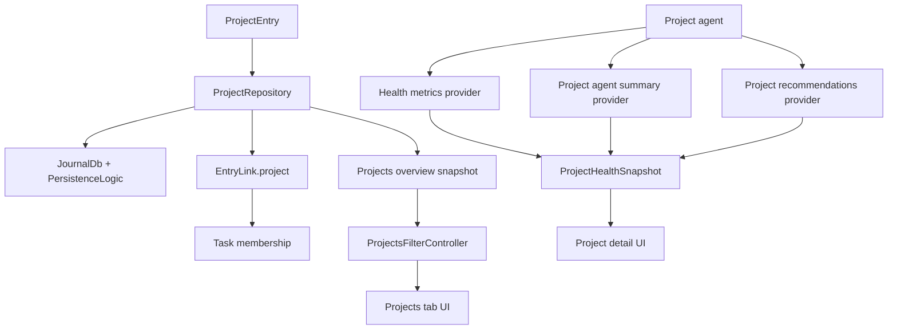
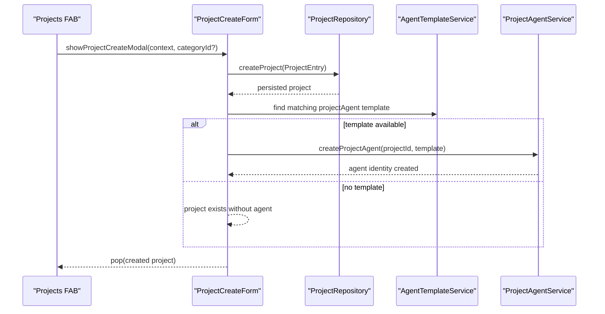
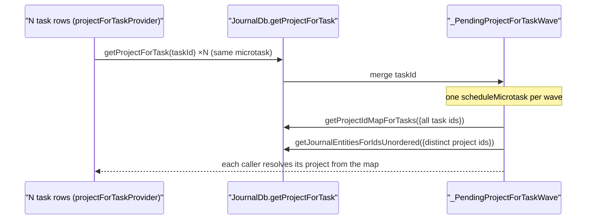
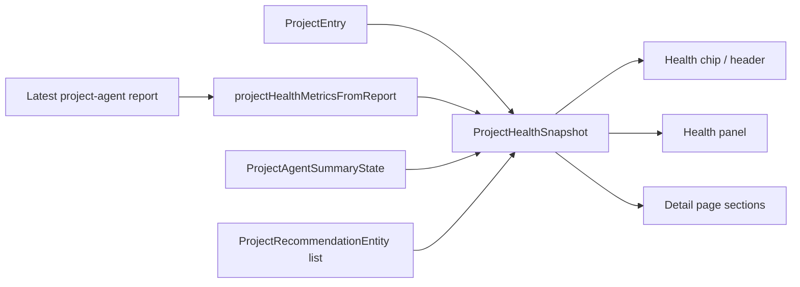
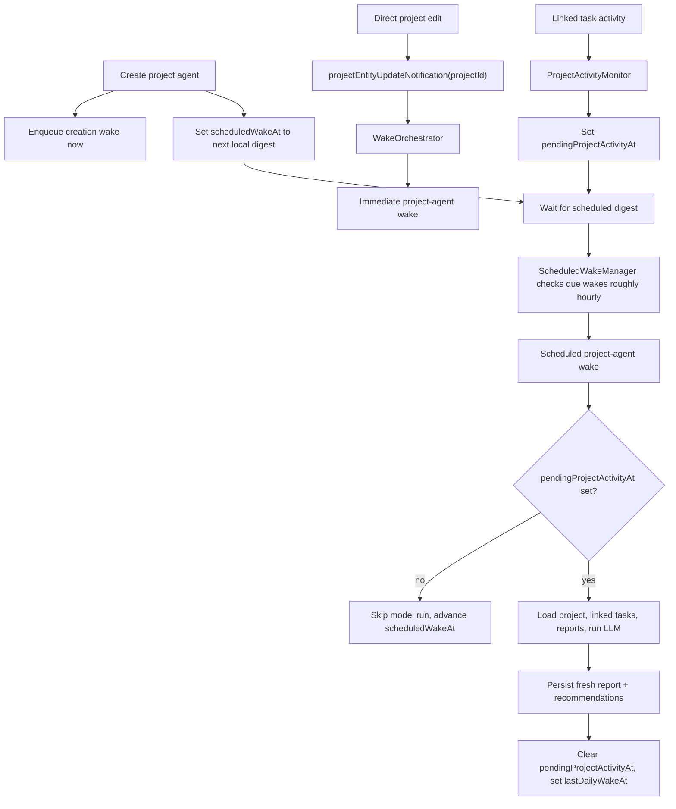
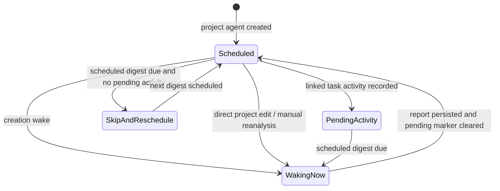

# Projects Feature

Projects provide the middle layer between categories and tasks.

They group related tasks, power the dedicated projects tab, and integrate with
the agent system so a project can accumulate health signals, recommendations,
and scheduled digests instead of just acting as a nicer folder.

## What This Feature Owns

- `ProjectEntry` persistence and editing
- Task-to-project linking
- The top-level projects overview tab
- Both project detail pages
- Project health built from project-agent reports
- The filters and grouped list models used by the projects tab

## Feature Flag

The visible project experience is controlled by `enableProjectsFlag`
(config key `enable_projects`).

When the flag is off:

- no top-level projects tab
- no category projects section
- no task project chip

Routes may still exist, but the normal ways into the feature are hidden.

## Architecture



Projects are therefore both:

- a journal-backed grouping feature
- a view of project health built from project-agent data

## Directory Shape

```text
lib/features/projects/
├── model/
├── repository/
│   └── project_repository.dart
├── state/
│   ├── project_providers.dart
│   ├── project_detail_controller.dart
│   ├── project_detail_record_provider.dart
│   ├── project_health_metrics.dart
│   └── project_one_liner_provider.dart   # AI one-liner subtitle for overview rows
├── ui/
│   ├── pages/
│   ├── model/
│   └── widgets/
│       └── showcase/                      # widgetbook palette + status helpers
└── widgetbook/
```

## Core Data Model

Projects are stored as `ProjectEntry`, a `JournalEntity.project` variant.

The important user-facing fields live in `ProjectData`:

- `title`
- `status`
- `statusHistory`
- `targetDate`
- `dateFrom`
- `dateTo`

`ProjectStatus` has six variants: `open`, `active`, `monitoring`, `onHold`
(with a required reason), `completed`, and `archived`. `monitoring` marks a
project that is not closed but has no time actively scheduled — it is only
touched when something comes up before it can be declared done. Day planning
tiers projects by status
(`lib/features/daily_os_next/logic/day_plan_availability.dart`): `active`
projects form the scheduled pool, while `open`/`monitoring`/`onHold` projects
stay available at lower priority so something noticed along the way can still
be planned; `completed`/`archived` are not available.

Projects can also carry free-form body text through `entryText`. The newer
top-level detail page uses that text as fallback text when no project-agent
TL;DR exists yet.

Tasks are linked to projects through `EntryLink.project`. The database also
maintains a denormalized `project_id` on tasks so overview queries do not need
to rediscover the relationship expensively every time. That column is the read
path for the "project of a task" lookup too: `JournalDb.getProjectForTask`
resolves through `journal.project_id` (indexed by `idx_journal_project_id`)
rather than joining `linked_entries` and sorting — the column is kept in
lock-step with the latest non-hidden `ProjectLink` on every link/entity write,
so the result is identical to the old join without its `USE TEMP B-TREE FOR
ORDER BY` sort.

## Create Flow

Project creation is where project data and the agent system connect. It runs
in a responsive overlay launched from the Projects list FAB —
`showProjectCreateModal` reuses `ModalUtils.showSinglePageModal`, which renders
a draggable bottom sheet on narrow (mobile) layouts and a centered dialog on
wide (desktop) ones. There is no full-screen create page or `/projects/create`
route; a stale deep link to that path degrades to the list.



The template lookup prefers category-scoped project-agent templates and falls
back to global ones. If no matching template exists, the project still exists
just fine. It simply starts life without an agent until one is created later.
The modal resolves to the freshly created `ProjectEntry` (or `null` when
dismissed); the list refreshes on its own because it watches
`projectsOverviewProvider`.

## Repository Responsibilities

`ProjectRepository` owns the data-heavy part of the feature:

- fetch one project
- fetch projects for a category
- fetch tasks for a project
- fetch the project for a task
- create and update projects
- link and relink tasks
- remove task links
- compute grouped overview snapshots
- watch overview snapshots against update notifications

Two design choices matter here:

1. linking enforces both the same-category rule and the single-project-per-task rule
2. project overview queries are batched and grouped so the top-level tab can stay fast

### Read coalescing & refetch debounce

Two hot read paths are shaped to survive sync bursts and list fan-out:

- **`getProjectForTask` is microtask-coalesced.** `projectForTaskProvider` is a
  `FutureProvider.autoDispose.family`, so a task list mounts one lookup per
  visible row. Instead of N single-task queries, concurrent callers in the same
  microtask merge into one wave (`_PendingProjectForTaskWave` in
  `database_project_queries.dart`): one `project_id` lookup for all task ids,
  then one bulk project fetch. Each caller pulls its task's project out of the
  shared result.



- **`watchProjectsOverview` debounces refetches.** The grouped overview re-runs
  the project rollup aggregate when a relevant `projectNotification` /
  `taskNotification` batch arrives. `UpdateNotifications` already coalesces sync
  bursts (~1s) and local edits (100ms); the repository adds a short debounce
  (`projectsOverviewRefetchDebounce`, default 300ms) so any remaining
  back-to-back batches collapse into a single rebuild. The first fetch on
  subscribe stays immediate, and the existing in-flight `fetching` /
  `pendingRefetch` guard is preserved.

## Overview Tab Model

The top-level projects tab is driven by grouped DTOs rather than raw entities:

- `ProjectsOverviewSnapshot`
- `ProjectCategoryGroup`
- `ProjectListItemData`
- `ProjectTaskRollupData`
- `ProjectsFilter`

That lets the tab UI render grouped rows without recomputing counts,
categories, and task rollups in each widget.

## Filter Model

`ProjectsFilterController` is small, but important.

It stores:

- selected status IDs
- selected category IDs
- text query
- search mode

The current production UI only drives `disabled` and `localText`. The enum also
already has a `vector` case, but it is not wired into the projects UI yet.

Local text search runs over the already-loaded grouped snapshot. That is the
current tradeoff: cheap, deterministic, and good enough until vector search is
actually worth adding here.

## Detail State

The two detail routes do different jobs:

- `/settings/projects/:projectId` is the edit page driven by `ProjectDetailController`
- `/projects/:projectId` is the newer detail page built from `ProjectRecord` via `projectDetailRecordProvider`

`ProjectDetailController` follows the same pattern as the other edit pages:

- keep an original copy
- keep a pending copy
- compute `hasChanges`
- only append status history when save actually persists

That last point prevents status-history inflation when users flip between statuses during editing.

## Project Health Composition

The health state is assembled across `project_providers.dart` and
`project_detail_record_provider.dart`.

The detail pages pull from a few separate inputs:

- project entity data
- linked tasks
- latest project-agent report
- parsed health metrics from that report
- summary freshness and scheduled wake state
- active recommendation entities
- derived `ProjectRecord` presentation data
- project-agent wake controls on the report section, including a refresh
  action, optional cancel action, and a countdown label formatted as `m:ss`
  below one hour or `h:mm:ss` once an hour cell is needed



This is why project health is agent-authored rather than locally guessed. If
the latest project-agent report has no parseable health payload yet, the app
shows no health state instead of falling back to invented local heuristics.

## UI Surfaces

### Top-Level Projects Tab

The tab renders grouped project rows using the shared overview content and list
widgets.

Each category group is rendered as one rounded grouped-card surface with:

- a shared grouped-card background color
- a 1 px border using `ShowcasePalette.border(context)`
- internal row dividers that disappear under the selected or hovered row fill

It is responsible for:

- grouped category sections
- search
- filter modal
- navigation into project details
- floating create action that opens the responsive create overlay
  (`showProjectCreateModal`) in place, so creation stays inside the Projects
  tab; an optional `categoryId` argument prefills the category

### Project Detail Pages

There are currently two detail routes in play:

- the newer top-level `/projects/:projectId` path
- the older settings-scoped detail path used by category-driven flows

The newer top-level route is not just a renamed editor. It assembles a
`ProjectRecord` and renders the shared detail widgets
(`ProjectMobileDetailContent`, `HealthPanel`, `ProjectTasksPanel` /
`ProjectTasksSliverPanel`), which keeps the production surface aligned with
Widgetbook.

When the derived `ProjectRecord` reloads because linked tasks or task-agent
reports changed, the page keeps rendering the previous `ProjectRecord` until the
new one is ready. This avoids flashing a full-page loading state and preserves
the current scroll position during live updates.

The top-level detail route now uses a `CustomScrollView` with slivers instead of
one large `SingleChildScrollView` body. The static header, health panel, and AI
report stay boxed in `SliverToBoxAdapter`s, while the task list is rendered by
`ProjectTasksSliverPanel` on a lazy `SliverList`. That keeps large projects
from eagerly laying out every task row and reduces the scroll shudder that
showed up when fast-scrolling long project task lists.

`ProjectTasksPanel` renders each task row as:

- title in `bodySmall` with regular weight
- optional agent-authored `oneLiner` subtitle in `caption` with low-emphasis text
- a `step1` (2 px) gap between title and subtitle, then a `step4` (12 px) gap before metadata
- metadata on the next line
- duration text in `bodySmall`
- status glyph tinted by task state
- status label rendered with the same compact `bodySmall` text style as duration

The subtitle comes from the latest task-agent report for that task. The detail
provider bulk-loads those latest reports for all linked task IDs in one
repository call, then joins the results into `TaskSummary.oneLiner` before the
panel renders. That keeps the detail page on the batched query path instead of
triggering a per-row report lookup when a project has dozens of tasks.

On the top-level `/projects/:projectId` route those task rows are also rendered
through a sliver-backed panel, so only the visible slice of the task list is
built while scrolling.

Task-agent wake completion also emits the owning task ID and parent project ID
through `UpdateNotifications`, so an open project detail page refreshes as soon
as a task-agent report finishes instead of waiting for the user to leave and
re-enter the page.

### Category and Task Integrations

Projects surface in:

- task metadata via the `DesktopTaskHeaderConnector` project row, which renders
  the linked project as a `DesktopTaskHeaderProject` crumb (project title with a
  folder icon) and opens `ProjectSelectionModalContent` through
  `ModalUtils.showSinglePageModal`. No project health is surfaced on the task
  page.

## When the Project Agent Actually Wakes

Plainly: the project agent is not supposed to wake for every microscopic ripple
in a linked task.

It has three real wake paths:

1. Creation wake. `ProjectAgentService.createProjectAgent()` provisions the agent, sets `scheduledWakeAt` to the next local digest time, and immediately enqueues a `creation` wake.
2. Immediate direct-project wake. The agent is subscribed to `projectEntityUpdateNotification(projectId)`, so explicit project edits can enqueue an orchestrated wake immediately. Manual reanalysis uses the same immediate path.
3. Scheduled digest wake. Linked task activity does not wake the model immediately. `ProjectActivityMonitor` resolves affected project IDs and writes `pendingProjectActivityAt` on the agent state instead.

That third path is the key design choice. Task churn marks the summary as stale
now, and the digest decides later whether the model should spend tokens on a
fresh project report.



### Project-agent state machine



What the digest actually does:

- every project agent gets a `scheduledWakeAt` when created
- `ScheduledWakeManager` scans for due wakes on startup and then on a periodic timer with a default one-hour check interval
- when the wake is due, `ProjectAgentWorkflow` checks whether a report already exists and whether `pendingProjectActivityAt` is still `null`
- if there is no pending activity, the workflow performs a cheap skip: it updates `lastWakeAt`, increments the wake counter, and rolls `scheduledWakeAt` forward without calling the model
- if pending activity exists, the workflow loads the project, linked tasks, and task-agent reports, runs the conversation, persists a fresh project report and deferred recommendations, clears the pending marker, records `lastDailyWakeAt`, and schedules the next digest

So the short version is:

- project creation: wake now
- direct project edit or manual reanalysis: wake now
- task churn inside the project: mark stale now, think later

That is an intentional tradeoff. The project feature is meant to summarize
meaningful change, not narrate every checkbox toggle.

## Why The Feature Looks Like This

Projects are not just "tags but bigger". They sit between category-level organization and task-level execution, and they aggregate agent outputs into something a human can scan quickly.

That requires:

- proper persistence
- strict linking rules
- grouped overview models
- filtered list state
- project health built from agent reports, freshness state, and recommendations

Without those pieces, the feature would collapse into a nice-looking list of vague nouns. With them, it becomes an actual project layer.
