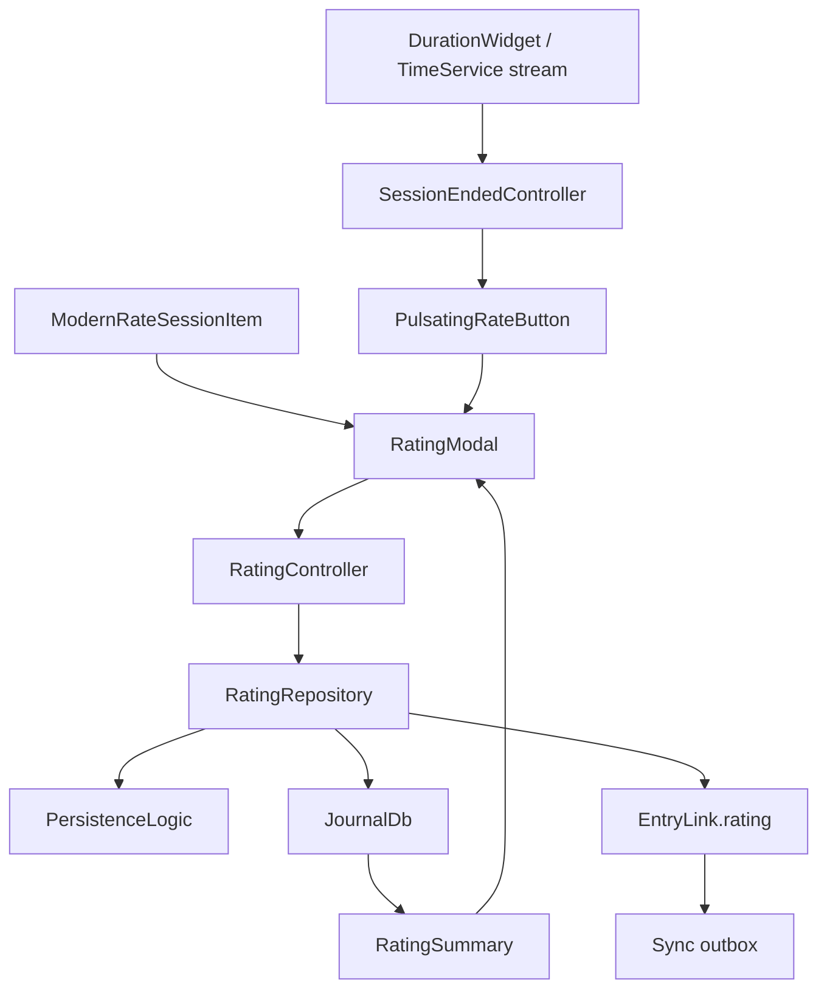
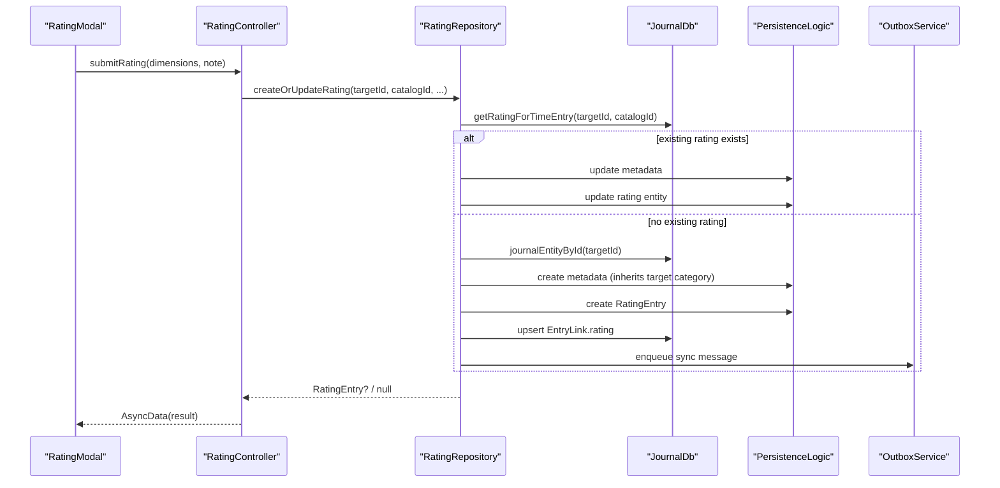
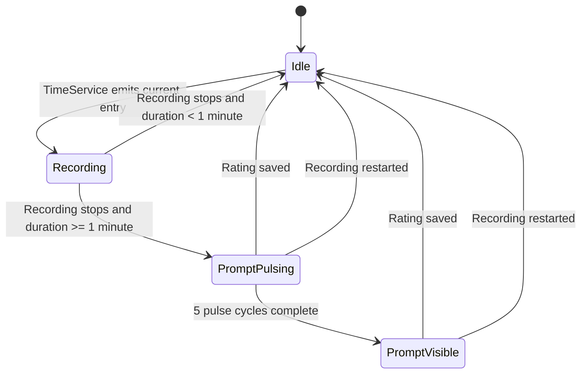

# Ratings Feature

Ratings let Lotti attach a structured judgment to another entry without baking the question set into the UI.

Right now the shipped catalog is session-focused, but the feature is already built around a generic `(targetId, catalogId)` model. The important part is not the star button or the modal. The important part is that the catalog defines the questions, the UI snapshots enough metadata to survive catalog drift, and the repository persists the result as a first-class `RatingEntry` plus a link back to the rated entity.

## What This Feature Owns

- The rating catalog registry in [`rating_catalogs.dart`](/Users/mn/github/lotti/lib/features/ratings/data/rating_catalogs.dart)
- The modal used to create, review, and re-open a rating
- Persistence of `RatingEntry` records through [`rating_repository.dart`](/Users/mn/github/lotti/lib/features/ratings/repository/rating_repository.dart)
- The `EntryLink.rating` that connects a rating back to its target entry
- The "session just ended" prompt state used by the timer UI
- Read-only rendering for ratings whose catalog is not known on the current client

## Runtime Shape

This is a small feature, but it crosses more boundaries than it first appears to. The prompt comes from the timer flow, the editor is catalog-driven, persistence is journal-backed, and rendering must still work when the local catalog is missing.

## Core Model

### `RatingQuestion`

Defined in [`rating_question.dart`](/Users/mn/github/lotti/lib/classes/rating_question.dart), a `RatingQuestion` is catalog schema, not stored rating data.

It contains:

- `key`: stable identifier such as `productivity`
- `question`: localized user-facing label
- `description`: English semantic explanation of the scale, intended for downstream interpretation such as LLM use
- `inputType`: currently `tapBar` or `segmented` in the shipped catalog
- `options`: normalized labeled values for segmented questions

### `RatingData`

Defined in [`rating_data.dart`](/Users/mn/github/lotti/lib/classes/rating_data.dart), this is the payload stored inside a `RatingEntry`.

It contains:

- `targetId`: serialized under the legacy wire key `timeEntryId`
- `dimensions`: the captured answers
- `catalogId`: identifies which catalog produced the rating
- `schemaVersion`: defaults to `1`
- `note`: optional free text

The repository treats `(targetId, catalogId)` as the uniqueness boundary. That means one target can have multiple ratings overall, but only one stored record per catalog.

### `RatingDimension`

Each stored dimension is intentionally self-describing. Besides `key` and `value`, it may snapshot:

- `question`
- `description`
- `inputType`
- `optionLabels`
- `optionValues`

That snapshotting is the feature's main architectural decision. A synced rating remains readable even if the catalog wording changes, the catalog disappears locally, or future clients introduce new catalogs older clients do not know yet.

## Catalog Registry

[`rating_catalogs.dart`](/Users/mn/github/lotti/lib/features/ratings/data/rating_catalogs.dart) maps `catalogId` values to localized factory functions.

At the moment the registry contains a single catalog:

- `session`

The session catalog defines four dimensions:

- `productivity`
- `energy`
- `focus`
- `challenge_skill`

The first three use `tapBar`. `challenge_skill` uses a segmented scale with explicit values `0.0`, `0.5`, and `1.0`.

The question text is localized. The semantic descriptions are intentionally English and stable across locales.

## Persistence Flow

## Repository Guarantees

[`rating_repository.dart`](/Users/mn/github/lotti/lib/features/ratings/repository/rating_repository.dart) is where the feature stops being just "some modal" and starts behaving like proper journal data.

- Existing ratings are looked up by `(targetId, catalogId)`.
- New ratings are stored as `JournalEntity.rating`.
- New rating metadata inherits the target entry's `categoryId` when one exists.
- New rating IDs are derived from `['rating', targetId, catalogId]`, which keeps the identity deterministic at the repository layer.
- A new rating also creates an `EntryLink.rating` from the rating entry to the target entry.
- Link creation is best-effort consistent: if the rating entity is persisted but link creation fails, the repository soft-deletes the orphaned rating entry instead of leaving dangling data behind.
- Sync outbox enqueueing is intentionally non-transactional with local persistence. A sync enqueue failure is logged, but it does not roll back the local link that already succeeded.

## UI Flow

### `RatingModal`

[`session_rating_modal.dart`](/Users/mn/github/lotti/lib/features/ratings/ui/session_rating_modal.dart) resolves the catalog at build time and then chooses between two modes.

- Known catalog: editable form, pre-populated from any existing rating
- Unknown catalog: read-only rendering of the stored dimensions

On submit, the modal snapshots catalog metadata into `RatingDimension` objects before writing anything. That includes the localized question, the English description, the input type, and segmented option labels and values where applicable.

Save is only enabled when every question in the active catalog has an answer.

### `RatingSummary`

[`rating_summary.dart`](/Users/mn/github/lotti/lib/features/ratings/ui/rating_summary.dart) is the compact renderer for persisted ratings in entry details.

For labels it uses this fallback chain:

1. Stored `dimension.question`
2. Catalog lookup for the current locale
3. Raw `dimension.key`

For segmented values it uses this fallback chain:

1. Stored `optionLabels` and `optionValues`
2. Catalog lookup
3. Percentage fallback such as `37%`

The summary always exposes the modal action. If the catalog is known, reopening is effectively editing. If the catalog is unknown, reopening still works, but only in read-only mode.

### Input Widgets

[`rating_input_widgets.dart`](/Users/mn/github/lotti/lib/features/ratings/ui/rating_input_widgets.dart) currently implements the two interaction primitives the shipped catalog actually uses:

- `RatingTapBar`: continuous `0.0` to `1.0` capture with drag support
- `RatingSegmentedInput`: fixed labeled options mapped to normalized values

The data model reserves `boolean` as a possible input type, but the current ratings feature only ships and renders `tapBar` and `segmented` catalogs.

## Session-End Prompt Lifecycle

The ratings feature is not only the modal. It also owns the ephemeral state that decides whether the timer UI should nudge the user to rate the just-finished session.

The concrete pieces are:

- [`DurationWidget`](/Users/mn/github/lotti/lib/features/journal/ui/widgets/entry_details/duration_widget.dart) listens to `TimeService` and detects the recording-to-stopped transition
- [`SessionEndedController`](/Users/mn/github/lotti/lib/features/ratings/state/session_ended_controller.dart) persists the set of entry IDs whose sessions have just ended
- [`PulsatingRateButton`](/Users/mn/github/lotti/lib/features/ratings/ui/pulsating_rate_button.dart) shows the prompt, pulses for five cycles, then stays visible until a rating is saved or recording restarts

There are two deliberate cleanup paths:

- Starting a new recording on the same entry clears the "session ended" state immediately
- Saving a rating also clears that state, so the prompt disappears without waiting for another timer event

## Integration Points Outside `features/ratings`

- [`duration_widget.dart`](/Users/mn/github/lotti/lib/features/journal/ui/widgets/entry_details/duration_widget.dart) triggers the post-session prompt flow
- [`modern_action_items.dart`](/Users/mn/github/lotti/lib/features/journal/ui/widgets/entry_details/header/modern_action_items.dart) adds a menu action that says either "Rate session" or "View rating"
- [`entry_details_widget.dart`](/Users/mn/github/lotti/lib/features/journal/ui/widgets/entry_details_widget.dart) renders `RatingSummary` for `RatingEntry`

The prompt button and action-menu entry are both gated by the `enable_session_ratings` config flag.

## Unknown Catalog Behavior

This fallback path is not optional polish. It is the part that keeps sync from turning into silent data loss.

If a device receives a rating with a `catalogId` it does not recognize:

- the summary still renders from stored metadata
- the modal still opens
- the modal switches to read-only mode
- the user can inspect the rating, but not modify it against a catalog the client does not understand

That tradeoff is deliberate. Editable unknown data sounds flexible right up until you overwrite someone else's schema with a best guess.

## Extending The Feature

Adding a new catalog is mostly configuration work, as long as the new question set still fits the existing interaction model.

1. Add a catalog factory to [`rating_catalogs.dart`](/Users/mn/github/lotti/lib/features/ratings/data/rating_catalogs.dart)
2. Register it under a stable `catalogId`
3. Add the localized question strings
4. Open `RatingModal` with that `catalogId`

No storage migration is required just to add another catalog. The whole design is built to avoid that.

## Practical Constraints

- Ratings are persisted as first-class journal entities, not embedded on the target entry
- A target can have more than one rating overall, but only one per `catalogId`
- Snapshot metadata should stay rich enough to render old data without catalog lookups
- Unknown catalogs must remain viewable
- The current shipped UX is session-first even though the model is broader

That is why this feature looks a little more deliberate than the UI alone would suggest. Underneath the modal, it is solving for sync, backwards compatibility, and future catalogs at the same time.
