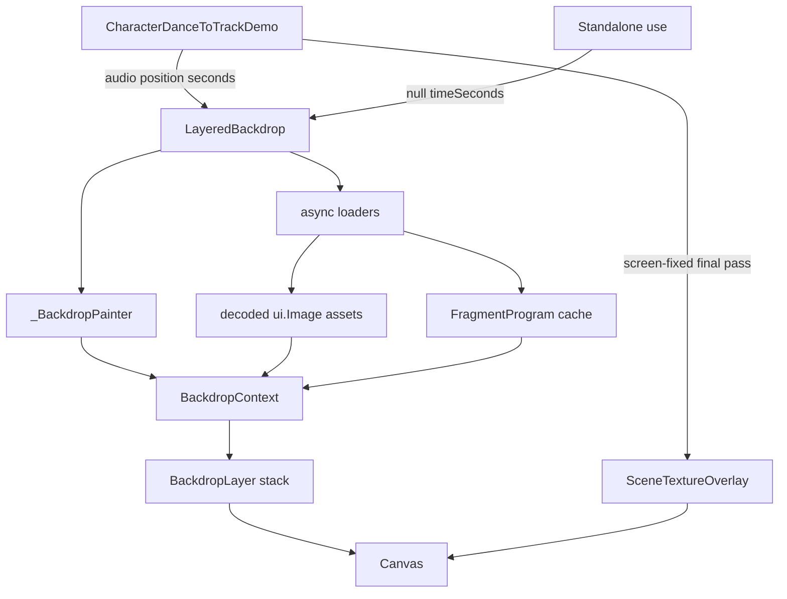
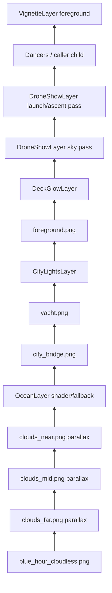
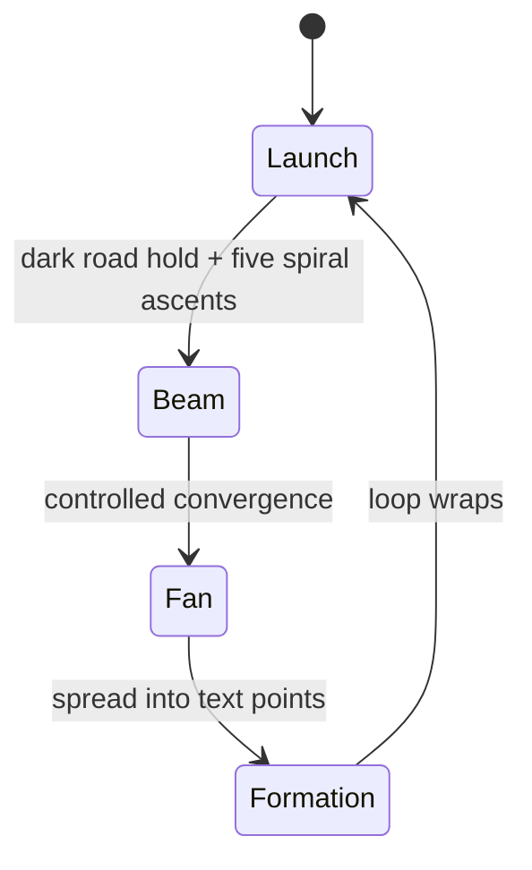
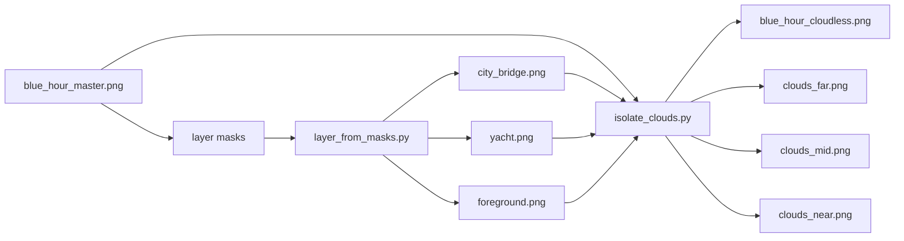

# Scenery

Reusable animated backdrops for character/demo surfaces. The current production
scene is the Lagos-inspired blue-hour waterfront used by
`CharacterDanceToTrackDemo`: a generated bitmap plate split into full-frame PNG
layers, with shader and canvas effects composited between those layers.

The module is deliberately independent from `features/character`. Consumers pass
a clock and optional child into `LayeredBackdrop`; scenery code owns image/shader
loading, reduced-motion handling, and layer composition.

## Runtime Architecture



`LayeredBackdrop` has two clock modes:

- External clock: pass `timeSeconds`, used by the audio dance player so scenery
  seeks, pauses, and resumes with playback.
- Self clock: leave `timeSeconds` and `timeOverride` null; the widget starts its
  own `Ticker`.

`MediaQuery.disableAnimationsOf(context)` freezes the scene at
`kSceneryCalmFrameSeconds`. Tests can pin `timeOverride`.

## Layer Stack

`BackdropScene.blueHourWaterfront()` defines the current stack. Every bitmap is
authored at `kSceneryCanvasSize` (`2560x1440`) and cover-fit into the viewport.
The same cover-fit mapping is used by bitmap layers, cloud drift, ocean band
placement, and city/yacht light sampling.



The ordering is the important contract:

- The base is `blue_hour_cloudless.png`, not the original master plate.
- Clouds are reintroduced as transparent full-frame PNGs and drift with
  `CloudParallaxLayer`.
- `OceanLayer` adds animated foam/glint over the painted lagoon.
- `city_bridge.png` and `yacht.png` are redrawn after the moving clouds and
  ocean so clouds and foam never slide across solid structure.
- `CityLightsLayer` draws additive windows, yacht lamps, and beacon glows on top
  of the structure layers.
- `foreground.png` and `DeckGlowLayer` sit over the animated water/deck area.
- `DroneShowLayer.sky()` and `DroneShowLayer.launchRoad()` are the highest
  background art passes. The ascent starts as small unlit aircraft dots, then
  switches on above the cable-stayed bridge; drawing both passes here keeps
  bridge cables, palms, and deck masks from cutting artificial gaps through the
  show.
- Foreground layers, currently the vignette, paint over the caller child.

`CharacterDanceToTrackDemo` additionally paints `SceneTextureOverlay` in screen
space, outside the backdrop camera transform and below the dancers. That pass is
not an authored art layer: it is a final tiny grain/edge-sink treatment that
keeps the whole viewport, including parallax side bands, from reading cleaner
than the centre.

## Bitmap Assets

`SceneryAssets` names the runtime assets:

- `blue_hour_master.png`: immutable full-frame source plate.
- `blue_hour_cloudless.png`: source plate with selected cloud pixels removed or
  blended toward sky color.
- `clouds_far.png`, `clouds_mid.png`, `clouds_near.png`: exact-size transparent
  cloud plates derived from the master. They are not cropped.
- `city_bridge.png`, `yacht.png`, `foreground.png`: structure/occluder layers
  cut from same-size masks.
- `city_windows.png`: sampled window field used by `CityLightsLayer`.

Full-frame assets are intentional. Cropping would require independent alignment
metadata and creates visible drift errors when layers are cover-fit at different
viewport ratios.

## Cloud Parallax

`CloudParallaxLayer` shifts one full-frame transparent cloud plate horizontally
and wraps it with three draws (`-1`, `0`, `+1` art widths). The movement is
one-way and cyclic. `dxPerSecond` is a fraction of the cover-fitted art width per
second; `0.001` equals 12% of the art width over a two-minute track.

Vertical motion is a very small sine "breathing" offset. Cloud bands use
different phases and speeds:

- Far/dark upper clouds: subtle but now visible motion.
- Mid clouds: slightly faster.
- Near/bright cloud details: most visible motion.

The current asset extraction keeps the left skyline-adjacent cloud band mostly
baked into the base. That is a deliberate quality tradeoff: those clouds overlap
tall tower silhouettes in the source art, and moving them independently makes
building-shaped artifacts read as drifting architecture.

## Shader And Canvas Layers

`SceneryShaderProgramCache` loads:

- `scenery_sky.frag`: procedural fallback scene for
  `BackdropScene.proceduralBlueHour()`.
- `scenery_ocean.frag`: additive lagoon foam and glint.
- `scenery_city_lights.frag`: additive window and yacht-cabin lighting.

Shader load failure is non-fatal. Layers either use CPU fallback rendering or
no-op until their programs/assets load.

`CityLightsLayer` also paints canvas beacons and yacht lamps. It maps normalized
art anchors through `coverFit`, so lights stay attached to the painted structures
on desktop and phone aspect ratios.

## Drone Show

`layers/drone_show_layer.dart` is a deterministic background performance layer,
not a bitmap asset. It samples normalized drone positions from the scene clock
and paints additive glows in the sky. The current show is aircraft-paced rather
than particle-paced: 280 drones hold a dense, evenly spaced cable-stayed
bridge-road launch line as dark aircraft dots, rise through five local spiral
columns, switch lights on progressively above the bridge cables, converge into a
controlled beam, fan out, hold compact dot-matrix `Omah Lay`, collapse through a
coordinated staging row, then form `Moving` over a 144-second cycle.



The pure functions are the contract:

- `droneShowTimelineAt(timeSeconds)` resolves the current phase and local
  progress inside the repeatable loop.
- `droneShowFormationPoints()` generates destination points for either
  dot-matrix message (`Omah Lay` by default, or `Moving` for the final hold).
- `sampleDroneShow(timeSeconds)` returns per-drone normalized positions,
  opacity, radius, and phase; reduced-motion samples a static formation frame.
  During formation, drones settle into `Omah Lay`, hold, transition into
  `Moving` through a thin staging row, then hold again so lettering remains
  readable. The tests also bound one-second normalized travel so retunes do not
  accidentally make the aircraft move like fireworks.

The runtime scene uses two configured layer instances:
`DroneShowLayer.sky()` for beam/fan/text phases and
`DroneShowLayer.launchRoad()` for launch/ascent only. Both draw above the fixed
structure redraw, but the launch samples stay visually dark until they clear the
cable-stayed bridge. That keeps the aircraft readable as physical objects on the
bridge while preventing the bridge-cable alpha mask from slicing holes through
the show.

## Stage Lighting

The dance-to-track demo lights the trio like a stage act with a **graphic
rim/backlight** look (chosen because the cats are flat cartoon shapes — front-lit
colored cones read as glowing capsules, but a colored edge hugging the silhouette
reads as real backlight). One scheduler drives two halves so the body glow and
its floor pool always share a gel:

- **`runtime/stage_lights.dart` — `StageLightRig` (pure).** A deterministic,
  canvas-free scheduler: feed it the scene time + the 0..1 beat envelope and it
  returns each light's gel `color`, pool `targetX` and `intensity`. The gel cycle
  (`kStageGelCycle`: warm gold / dusk fuchsia / electric violet, pulled back from
  neon toward the plate's lantern-amber / dusk-magenta so the gels read as light in
  the blue-hour world rather than arcade decals; the gold is deepened toward amber
  so the additive rim/pool stays gold when hot instead of blowing to white on the
  beat) **snaps** (never lerps) on a `colorPeriod` wired to the track tempo
  (`60 / bpm`), offset per lane so the row rotates rather than flashing in unison;
  brightness is `baseIntensity + beatBoost * beat` (a lifted base so the calm intro
  is never underlit, a tempered boost so the beat punches without blowing out).
  `leadGoldIndex` pins one lane (the centre/lead) to the hero gold every frame
  while the flankers keep cycling, so the lead reads as a consistent star colour.
- **The directional rim/halo + body grade are drawn by `CharacterPainter`**
  (`memberBacklights` + `bodyGrade` + `heroStaging`, not in this module): each cat
  is rendered as a blurred, solid-gel silhouette behind itself (a soft bloom + a
  tight rim pass), each pass **offset toward that lane's light source** so the rim
  is directional with a real shadow side. `bodyGrade` then grades the body into the
  twilight plate (a cool→warm ambient wrap + a directional gel terminator), clipped
  below the neckline so the face stays natural, and `heroStaging` pushes the lead
  bigger/downstage. It reuses the member transform, so the rim tracks the dancer
  through any camera move. The whole act activates for the centred-trio concert
  dance phrase — both `dance` and the shipping `shaku` (what the player dances).
- **`stage_lights_overlay.dart` — `StageLightsOverlay` / `StageLightsPainter`.**
  The grounding half: an additive (`BlendMode.plus`) screen-space pass over the
  dancers drawing a gel pool that is anchored at the foot and **rakes forward**
  (downstage) with a horizontal shear (`_kPoolLean`) so off-centre pools lie along
  the deck's plank perspective, plus a hot core at the foot contact. It eases its
  pool toward the live dancer foot (lazy on small moves, fast catch-up on a camera
  cut), tracking the anchors the painter publishes via `onDancerAnchors`.

The demo samples the rig once per frame and feeds the gels to both halves, so the
whole rig pulses with the music. The cat **bodies never pulse with the beat** (a
full-figure flash would be a photosensitivity risk): only the rim halo and floor
pools animate, while `bodyGrade` stays a static grade. Reduce-motion freezes the
rig to a calm static frame.

## Asset Preparation

The generated PNG stack lives under `assets/scenery/`; the tooling lives under
`tools/scenery_art/`.



Regenerate with:

```bash
python3 -m venv /tmp/lotti-scenery-opencv
/tmp/lotti-scenery-opencv/bin/python -m pip install -r tools/scenery_art/requirements.txt
make -C tools/scenery_art PYTHON=/tmp/lotti-scenery-opencv/bin/python blue-hour
```

Preview/debug outputs go to `tmp/scenery_work/` and are not runtime assets. See
`tools/scenery_art/README.md` for the mask-generation details and visual QA
checks.

## Tests

Focused checks for this feature:

```bash
fvm flutter analyze lib/features/scenery lib/features/character/demo/character_dance_to_track_demo.dart test/features/scenery/layers/cloud_parallax_layer_test.dart test/features/scenery/model/backdrop_scene_test.dart test/features/scenery/scenery_assets_test.dart
fvm flutter test test/features/scenery/runtime/scenery_shaders_test.dart test/features/scenery/layers/cloud_parallax_layer_test.dart test/features/scenery/layers/drone_show_layer_test.dart test/features/scenery/model/backdrop_scene_test.dart test/features/scenery/scenery_assets_test.dart
```

Coverage responsibilities:

- `backdrop_scene_test.dart`: layer order and declared assets.
- `scenery_assets_test.dart`: full-frame asset geometry and alpha sanity.
- `cloud_parallax_layer_test.dart`: deterministic offset/wrap math.
- `scenery_shaders_test.dart`: registered shader assets compile through Flutter's
  runtime-effect compiler.
- `runtime/stage_lights_test.dart`: the `StageLightRig` gel-cycle / sweep /
  beat-intensity maths.
- `stage_lights_overlay_test.dart`: the floor pools land their gel, track the
  dancer foot (lazy follow) and pulse on the beat.
- `drone_show_layer_test.dart`: drone timeline phases, `Omah Lay` → `Moving`
  formation bounds, deterministic sampling, and paint contract.
- `scene_texture_overlay_test.dart`: screen-fixed finishing grain covers both
  vertical side strips and preserves a gentle edge sink.
