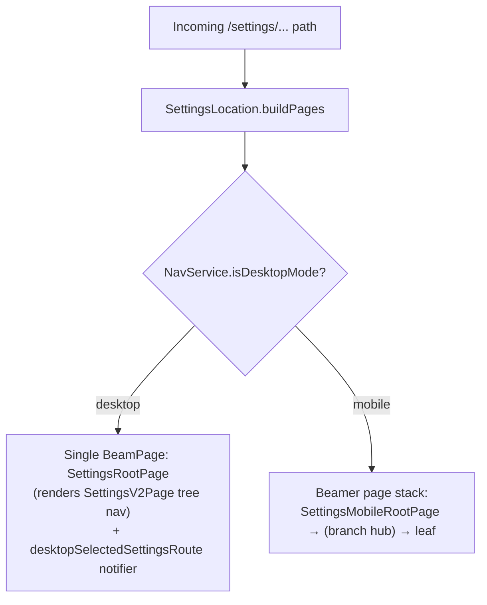
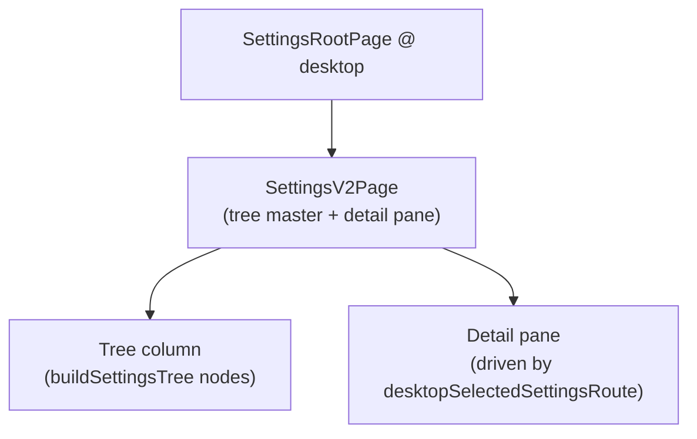
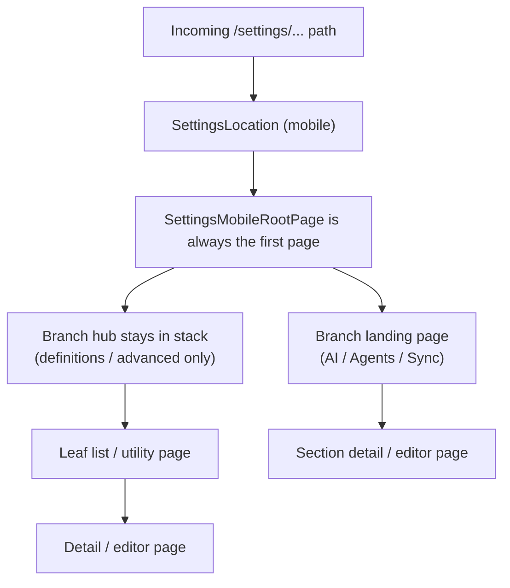
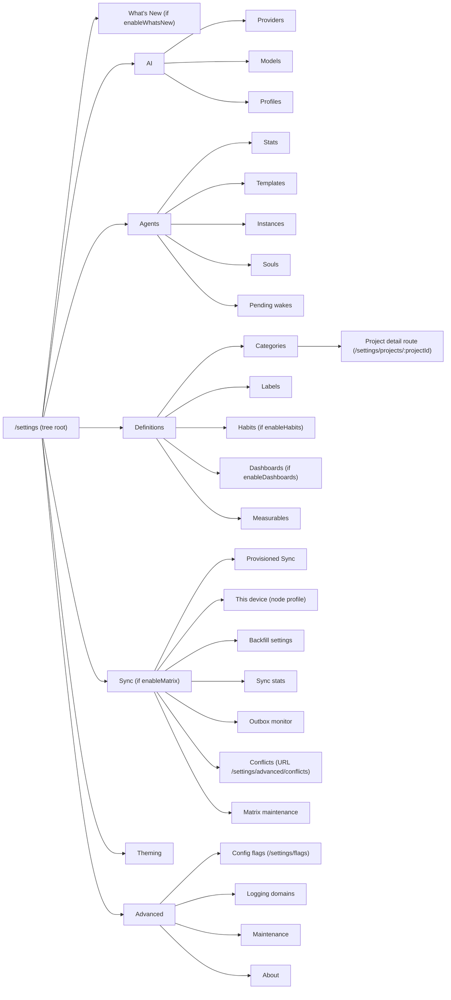
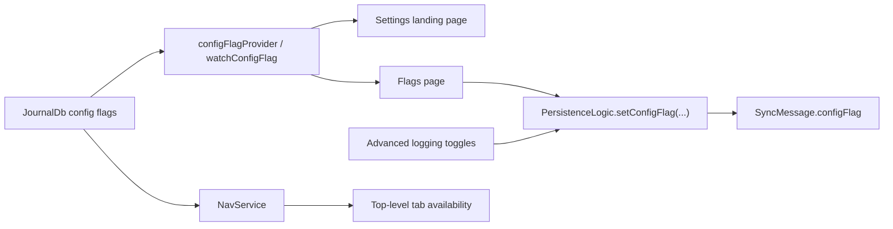
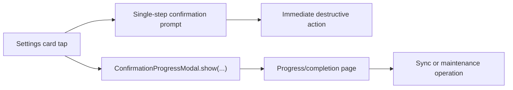

# Settings Feature

Settings is the app's control room. It mostly does not own the engines. It owns the switches, the route stack, the "are you sure?" moments, and a few utility pages that would otherwise be left wandering the halls.

If another feature needs a configuration surface, Settings is often where the user enters. That does not mean Settings owns the underlying domain. It usually means Settings owns the doorway and knows when to stop pretending it is the whole building.

## Core Job

In the current codebase, Settings does four concrete things:

1. Renders the `/settings` landing surface and drives the drill-down into every section.
2. Assembles the Beamer stack for every `/settings/...` route in [`lib/beamer/locations/settings_location.dart`](../../beamer/locations/settings_location.dart).
3. Turns config flags into visible or hidden navigation.
4. Hosts a small set of actual settings-owned pages: theming, flags, advanced utilities, health import, about, and shared editor scaffolding for several definition types.

That last point matters. Settings is mostly a router, but not only a router.

One thing Settings no longer does is hand-maintain its own menu. The landing
list and the section hubs are no longer bespoke widgets with hard-coded item
arrays. They render from a single declarative tree — `buildSettingsTree(...)`
in [`lib/features/settings_v2/domain/settings_tree_data.dart`](../settings_v2/domain/settings_tree_data.dart)
— which the desktop tree-nav already consumed. Mobile and desktop now read the
same structure, so the two surfaces can never disagree about which settings
exist, how they are grouped, or which flags gate them.

## Ownership Boundaries

### Settings owns

- The layout fork in [`ui/pages/settings_root_page.dart`](ui/pages/settings_root_page.dart) (mobile drill-down vs. desktop tree)
- Route composition in [`lib/beamer/locations/settings_location.dart`](../../beamer/locations/settings_location.dart)
- Shared settings presentation widgets in [`ui/widgets/`](ui/widgets/)
- Shared list/detail scaffolding such as [`ui/pages/definitions_list_page.dart`](ui/pages/definitions_list_page.dart)
- Utility pages such as:
  - [`ui/pages/theming_page.dart`](ui/pages/theming_page.dart)
  - [`ui/pages/flags_page.dart`](ui/pages/flags_page.dart)
  - [`ui/pages/advanced/logging_settings_page.dart`](ui/pages/advanced/logging_settings_page.dart)
  - [`ui/pages/advanced/maintenance_page.dart`](ui/pages/advanced/maintenance_page.dart)
  - [`ui/pages/advanced/about_page.dart`](ui/pages/advanced/about_page.dart)
  - [`ui/pages/health_import_page.dart`](ui/pages/health_import_page.dart)
- The two-step destructive/long-running modal wrapper in [`ui/confirmation_progress_modal.dart`](ui/confirmation_progress_modal.dart)

The menu surfaces themselves — the mobile landing and the Definitions /
Advanced hubs — are no longer Settings-owned widgets. They are rendered from
the shared tree in the [`settings_v2`](../settings_v2/) feature (see
[Route Assembly](#route-assembly)).

### Settings routes into other features

- AI settings: [`lib/features/ai/ui/settings/ai_settings_page.dart`](../ai/ui/settings/ai_settings_page.dart)
- Agents: [`lib/features/agents/ui/`](../agents/ui/)
- Categories: [`lib/features/categories/ui/pages/`](../categories/ui/pages/)
- Labels: [`lib/features/labels/ui/pages/`](../labels/ui/pages/)
- Projects: [`lib/features/projects/ui/pages/`](../projects/ui/pages/)
- Sync: [`lib/features/sync/ui/`](../sync/ui/)

### Settings hosts pages that still depend on other feature logic

- Habit editing UI lives under Settings, but save/delete state comes from [`lib/features/habits/state/habit_settings_controller.dart`](../habits/state/habit_settings_controller.dart)
- Theming UI lives under Settings, but the real state machine is [`lib/features/theming/state/theming_controller.dart`](../theming/state/theming_controller.dart)
- Health import lives under Settings, but the implementation is [`lib/logic/health_import.dart`](../../logic/health_import.dart)

So yes, Settings is thin. Just not spiritually pure.

## Directory Shape

```text
lib/features/settings/
├── constants/
│   └── theming_settings_keys.dart
├── state/
│   └── zoom_controller.dart
├── widgetbook/
│   └── settings_widgetbook.dart
└── ui/
    ├── aggregation_label.dart
    ├── confirmation_progress_modal.dart
    ├── pages/
    │   ├── settings_root_page.dart
    │   ├── advanced/
    │   │   ├── about_page.dart
    │   │   ├── logging_settings_page.dart
    │   │   └── maintenance_page.dart
    │   ├── dashboards/
    │   ├── habits/
    │   ├── measurables/
    │   ├── outbox/
    │   ├── definitions_list_page.dart
    │   ├── flags_page.dart
    │   ├── health_import_page.dart
    │   ├── sliver_box_adapter_page.dart
    │   └── theming_page.dart
    └── widgets/
        ├── dashboards/
        ├── form/
        ├── settings_card.dart
        └── settings_icon.dart
```

The structure mirrors the actual role of the feature:

- `pages/` no longer holds the menu surfaces themselves. The mobile landing
  list, the Definitions / Advanced hubs, and the desktop tree all live in the
  [`settings_v2`](../settings_v2/) feature now; what stays here are the leaf
  utility pages (theming, flags, advanced/*, health import) and the
  definition list/detail editors (`dashboards/`, `habits/`, `measurables/`).
- `settings_root_page.dart` is the only landing-ish file left, and it does
  nothing but fork on layout width (mobile drill-down vs. desktop tree).
- `widgets/` keeps the settings area visually coherent.
- `constants/` is tiny and currently only exposes theming preference keys.

## Route Assembly

The canonical route owner is [`lib/beamer/locations/settings_location.dart`](../../beamer/locations/settings_location.dart).

`SettingsLocation.buildPages` has a hard desktop/mobile fork keyed on
`NavService.isDesktopMode`. Both branches now draw their menu from the same
`buildSettingsTree(...)` data; only the *presentation* differs — desktop keeps
everything in one page, mobile builds a real Beamer stack.



### Desktop (Settings V2 master/detail)

On desktop, `buildPages` pushes exactly **one** page —
[`SettingsRootPage`](ui/pages/settings_root_page.dart), which (at desktop
width) renders [`SettingsV2Page`](../settings_v2/ui/pages/settings_v2_page.dart)
(the tree-nav master/detail UI in the separate
[`lib/features/settings_v2/`](../settings_v2/) feature). Instead of
stacking pages, it stores the sub-route in
`NavService.desktopSelectedSettingsRoute` and routes detail content into
the right-hand pane via that `ValueNotifier`. The stack model and stack
examples below apply to the mobile branch only.



### Mobile (page stack)

On mobile the important implementation detail is that Settings builds
*stacks*, not single pages. Parent pages stay in the Beamer stack so a back
tap walks back up the tree one level at a time.

The first page is always [`SettingsMobileRootPage`](../settings_v2/ui/mobile/settings_mobile_root_page.dart),
which renders the top level of the shared tree. For the two pure-navigation
branches — `definitions` and `advanced` — a
[`SettingsMobileBranchPage`](../settings_v2/ui/mobile/settings_mobile_branch_page.dart)
hub is also pushed and **stays beneath** the leaf, so it is a true drill-down.
Every other branch (AI / Agents / Sync) has its own landing page and is opened
directly. Tapping any tree node is routed by
[`handleSettingsNodeTap`](../settings_v2/ui/mobile/settings_mobile_nav.dart):
`whats-new` opens a modal, everything else beams to its canonical URL from
`settingsNodeUrls`, and `SettingsLocation` rebuilds the stack from that URL.



Concrete examples from the current implementation:

```text
/settings
  -> [SettingsMobileRootPage]

/settings/definitions
  -> [SettingsMobileRootPage, SettingsMobileBranchPage(definitions)]

/settings/categories/:categoryId
  -> [SettingsMobileRootPage, SettingsMobileBranchPage(definitions),
      CategoriesListPage, CategoryDetailsPage]

/settings/advanced/about
  -> [SettingsMobileRootPage, SettingsMobileBranchPage(advanced), AboutPage]

/settings/sync/stats
  -> [SettingsMobileRootPage, SettingsMobileBranchPage(sync), SyncStatsPage]

/settings/dashboards/:dashboardId
  -> [SettingsMobileRootPage, SettingsMobileBranchPage(definitions),
      DashboardSettingsPage, EditDashboardPage]
```

The Definitions and Advanced hubs are pure-navigation branches: in the tree
their node has `panel == null`, which is exactly the signal `buildPages` uses
to decide they drill into a child list rather than open a page. Because the hub
stays in the stack beneath its leaves, back from e.g. Categories returns to the
Definitions hub, then to the root — not straight to `/settings`. (This replaces
the older behaviour where the hub was replaced on navigation and a back tap
skipped it entirely.) The flat leaf URLs are unchanged — the entity leaves are
namespaced under `definitions/` in the tree but keep their flat Beamer URLs
(`/settings/categories`, …) via `settingsNodeUrls`, so `_inDefinitionsBranch`
in the location matches them and pushes the hub underneath.

AI and Agents keep their own rich mobile pages (tabbed `AiSettingsPage` /
`AgentSettingsPage`) and open directly, so e.g. `/settings/ai/...` stacks that
page rather than a hub.

Sync is a pure-navigation branch like Definitions/Advanced — it has no landing
panel, so selecting it leaves the desktop detail pane empty. The provisioned-sync
QR card is its first child leaf (`sync/provisioned`, URL `/settings/sync/provisioned`)
instead of a branch header, so the hub just lists the branch's child rows
(Provisioned Sync, This device, Backfill, Stats, Outbox, Conflicts, Matrix
maintenance). The child list, ordering, and copy come from `buildSettingsTree`,
shared with the desktop sidebar, so the two surfaces can no longer drift.
`/settings/sync` and `/settings/sync/...` stack `SettingsMobileBranchPage(sync)`
(wrapped in `SyncFeatureGate` so the route bounces back to `/settings` when
Matrix sync is disabled). The Sync hub passes `accentIcons: true` so its rows
keep the teal icon treatment the standalone `SyncSettingsPage` had — other
branches stay grey-unless-selected.

That stacked model is why detail pages feel like descendants of a section instead of random teleports. Beamer is doing real work here, which is nice for once.

## Runtime Topology

This mirrors the shape of `buildSettingsTree` (the single source of truth), so
it holds for both platforms — desktop renders it as a tree column, mobile as a
drill-down.



One slightly awkward but code-accurate detail: Conflicts is a child of the Sync branch in the tree, but its Beamer URL is still `/settings/advanced/conflicts`. `settingsNodeUrls` maps the `sync/conflicts` node id to that legacy path so existing deep links keep resolving, and everyone is currently living with that arrangement.

## Landing Page Behavior

The mobile landing is [`SettingsMobileRootPage`](../settings_v2/ui/mobile/settings_mobile_root_page.dart),
and it is not a hand-maintained list. It calls `watchSettingsTree(...)`
([`lib/features/settings_v2/ui/settings_tree_builder.dart`](../settings_v2/ui/settings_tree_builder.dart))
and renders the **top level** of that tree through
[`SettingsMobileTreePage`](../settings_v2/ui/mobile/settings_mobile_tree_page.dart),
one full-width `SettingsTreeRow` per node. The chrome is the fixed
[`SettingsMobileShell`](../settings_v2/ui/mobile/settings_mobile_shell.dart)
header — a flat, fixed-height bar with a hairline underline, deliberately the
opposite of the old scroll-shrinking `SliverBoxAdapterPage` / `SettingsPageHeader`
title that the menu surfaces used to wear.

Because the tree is the source of state, all gating is `buildSettingsTree`
input, not landing-page logic:

- `enableWhatsNew` adds a `whats-new` node at the very top; tapping it opens the
  What's New modal (it has no URL — `handleSettingsNodeTap` special-cases it)
- `enableMatrix` adds or drops the entire `sync` branch
- `enableHabits` / `enableDashboards` add or drop those leaves inside the
  `definitions` branch — the Definitions branch itself is unconditional because
  Categories, Labels, and Measurables are always present
- `enableAiSummaryTtsFlag` adds the `speech` leaf
- the AI, Agents, Theming, and Advanced branches are always shown

The new menu does not carry the old per-tile decorations (the Agents pending
indicator and the What's New settings card / app-bar action are gone), and node
badges are intentionally off the tree until the i18n sweep for badge copy
lands — the `NodeBadge` type and its render path in `SettingsTreeRow` stay in
place so reintroducing one is a per-node one-liner.

The landing page is therefore pure navigation over a declarative, flag-gated tree.

## Flags, Navigation, and Cross-Feature Side Effects

Settings is where feature flags become visible to users, but the effects are larger than the Settings UI itself.



This is why the flags page is not just a developer toy:

- toggling `enableHabitsPageFlag` or `enableDashboardsPageFlag` changes both Settings tiles and top-level navigation behavior
- toggling `enableMatrixFlag` changes visibility of Sync surfaces and also affects the Sync feature gate
- toggling `enableAiSummaryTtsFlag` shows or hides the local MLX Audio TTS button on task AI summaries
- logging flags influence subdomain logging pages under Advanced
- toggling a flag through Settings enqueues a `configFlag` sync message with the
  new boolean status; startup flag seeding does not enqueue anything, so devices
  do not overwrite each other just because an app session opened

The control panel is wired to actual breakers, not cardboard cutouts.

## Shared List and Detail Pattern

All five definition types (categories, labels, dashboards, habits,
measurables) reuse one pattern:

1. A list page wraps [`DefinitionsListPage<T>`](ui/pages/definitions_list_page.dart),
   fed by an `AsyncValue<List<T>>` from a Riverpod stream provider.
2. The shell owns search, sorted rendering, loading/empty/no-match/error
   states (each with localized copy; the empty state carries an inline
   create button), and the create affordance — a bottom-nav-cleared FAB on
   mobile, a header `DesignSystemButton` on desktop.
3. Rows lead with one shared 36px rounded-square chip
   (`CategoryIconChip`/`DefinitionIconChip`) and keep a stable subtitle
   semantic per page (counts for categories/labels, unit for measurables,
   description for habits/dashboards). The chip letter always belongs to
   the row's own item: habit and dashboard rows pass
   `CategoryIconChip.fromId(..., letterFrom: item.name)` so the initial
   matches the row name while the background color carries the category
   (neutral `background.level03` when unresolved); only category rows show
   the category's own icon or initial, since that is the row's identity.
4. Tapping a row beams to the detail editor; the desktop split pane
   dispatches the same URLs inline.
5. Saving or deleting goes through shared persistence or a
   feature-specific controller.

Everything sits on the shared settings grid
([`lib/widgets/settings/settings_page_layout.dart`](../../widgets/settings/settings_page_layout.dart)):
content aligns with the header title at every pane width and centers as a
capped column on wide desktop windows.

### List pages

- [`ui/pages/dashboards/dashboards_page.dart`](ui/pages/dashboards/dashboards_page.dart)
- [`ui/pages/habits/habits_page.dart`](ui/pages/habits/habits_page.dart)
- [`ui/pages/measurables/measurables_page.dart`](ui/pages/measurables/measurables_page.dart)

### Detail/editor pages

- [`ui/pages/dashboards/dashboard_definition_page.dart`](ui/pages/dashboards/dashboard_definition_page.dart)
- [`ui/pages/habits/habit_details_page.dart`](ui/pages/habits/habit_details_page.dart)
- [`ui/pages/measurables/measurable_details_page.dart`](ui/pages/measurables/measurable_details_page.dart)

All detail editors render through the shared settings-detail kit
([`lib/widgets/settings/settings_detail_scaffold.dart`](../../widgets/settings/settings_detail_scaffold.dart)):
a `SettingsDetailScaffold` provides the header (back beams to the list
route), the Cmd/Ctrl+S save shortcut (with a tooltip on desktop), a sticky
glass `SettingsFormActionBar` with the primary save pill (gated on the
page's dirty state; disabled renders as quiet translucent glass) and
cancel, and — in edit mode — a full-width `SettingsDeleteRow` at the end of
the form that reuses each page's confirm flow. Tap-to-pick fields render as
`SettingsPickerField`s.
Form rows are grouped into `SettingsFormSection` cards; the
FormBuilder-driven pages bridge into the design system via
[`ui/widgets/form/settings_form_text_field.dart`](ui/widgets/form/settings_form_text_field.dart)
and [`ui/widgets/form/form_switch.dart`](ui/widgets/form/form_switch.dart).
Visibility toggles share Active polarity (ON = visible) and private/active
switch rows carry explanatory subtitles.

The measurables editor exposes Favorite and Private switches and picks the
default aggregation type through a `SettingsPickerField` + single-page
modal; aggregation types always render their localized names (via
[`ui/aggregation_label.dart`](ui/aggregation_label.dart)), never raw enum
identifiers.

The dashboard editor keeps its chart machinery (`ChartMultiSelect` pickers,
reorderable `DashboardItemCard` list with swipe-to-dismiss and an explicit
drag handle) inside the charts section; chart rows title as
"Name — Localized aggregation". Save-and-copy-to-clipboard lives on the
action bar as a `DsGlassRoundButton` in the `extraActions` slot.

### Persistence split

- Dashboards and measurables save through [`lib/logic/persistence_logic.dart`](../../logic/persistence_logic.dart)
- Habits save through [`lib/features/habits/state/habit_settings_controller.dart`](../habits/state/habit_settings_controller.dart), which also schedules notifications

This is one of the more useful boundaries in the feature. Settings owns the editing shell, but it does not insist on owning every write path.

## Settings-Owned Utility Pages

### Theming

[`ui/pages/theming_page.dart`](ui/pages/theming_page.dart) is a thin view over [`lib/features/theming/state/theming_controller.dart`](../theming/state/theming_controller.dart).

It does three concrete things:

- switches `ThemeMode`
- selects light and dark theme names
- adapts the card styling to the currently active theme family

Theme selection is persisted in `SettingsDb`, and the theming controller also watches settings notifications so synced preference changes can be applied back into live state.

### Definitions

Definitions is no longer a Settings-owned page. On mobile it is rendered by
[`SettingsMobileBranchPage(branchId: 'definitions')`](../settings_v2/ui/mobile/settings_mobile_branch_page.dart),
which looks up the `definitions` branch in the shared tree and lists its
children (Categories, Labels, Habits, Dashboards, Measurables). It groups the
entity-definition entry points so the root reads as `AI · Agents · Sync ·
Definitions · Theming · Advanced` instead of fanning every entity type into a
top-level row.

Each row beams to its flat leaf URL (`/settings/categories`, `/settings/labels`,
…) from `settingsNodeUrls`. Habits and Dashboards are still feature-flag-gated,
but the gating now lives in `buildSettingsTree` (`enableHabits` /
`enableDashboards`) rather than in any page. Because Definitions has
`panel == null`, `SettingsLocation` keeps this hub in the stack beneath each
leaf, so back from e.g. Categories returns to the Definitions hub.

### Flags

[`ui/pages/flags_page.dart`](ui/pages/flags_page.dart) renders a curated subset of config flags in a fixed order. It is intentionally not a raw dump of everything in the database.

Each visible flag has:

- a localized title
- a localized description
- a hand-picked icon
- a `Switch.adaptive` that writes back through `PersistenceLogic`, which updates
  the local `JournalDb` row and enqueues a `configFlag` sync message only when
  the flag status changed

The Flags entry is reached through Advanced; the `/settings/flags` URL itself is unchanged so existing deep links keep resolving.

### Advanced

Advanced is also no longer a Settings-owned page. On mobile it is rendered by
[`SettingsMobileBranchPage(branchId: 'advanced')`](../settings_v2/ui/mobile/settings_mobile_branch_page.dart),
listing the `advanced` branch's children from the shared tree. Like
Definitions, it has `panel == null`, so it stays in the stack beneath its
leaves and is a true drill-down.

The branch currently exposes:

- config flags (URL `/settings/flags`, kept here rather than at the root)
- logging domains
- maintenance
- about

Sync-specific repair tools live under the Sync branch in the tree, not here —
even though Conflict resolution still wears the legacy
`/settings/advanced/conflicts` URL for deep-link compatibility (the tree maps
the `sync/conflicts` node to that path via `settingsNodeUrls`).

### Health import

[`ui/pages/health_import_page.dart`](ui/pages/health_import_page.dart) is a thin
date-range launcher over [`lib/logic/health_import.dart`](../../logic/health_import.dart).
Its `/settings/health_import` route still resolves in `SettingsLocation`, and
the unified tree exposes it as the flag-gated `advanced/health-import` leaf under
Advanced when `enableHealthImport` is on (fed from `isMobile`, since the import
is iOS/Android-only). On desktop the flag is off, so the leaf is absent there.

### About

[`ui/pages/advanced/about_page.dart`](ui/pages/advanced/about_page.dart) is more than a static credits wall. It pulls:

- app version and build number from `PackageInfo`
- journal entry count from `JournalDb`
- flagged and task counts from shared widgets
- the Daily OS display name field, persisted through
  `DailyOsPreferencesController` into `SettingsDb` and read by the Daily OS
  Capture greeting

## Sync Surfaces From Settings

Settings does not implement sync itself, but it does define how sync is entered and how sync pages behave inside the settings namespace.

Key facts:

- the `/settings` landing page only shows Sync when `enableMatrixFlag` is on
- [`lib/features/sync/ui/widgets/sync_feature_gate.dart`](../sync/ui/widgets/sync_feature_gate.dart) guards sync pages and redirects back to `/settings` if sync is disabled
- the sync landing page is the shared `SettingsMobileBranchPage(branchId: 'sync')` hub: it lists the `sync` branch's children from `buildSettingsTree`, so mobile and desktop V2 share one definition. The branch carries no panel, so its `/settings/sync` pane is empty; the provisioned-sync QR card is the first child leaf (`sync/provisioned` → `ProvisionedSyncPage` on mobile, the `sync-provisioned` panel on desktop)
- the `sync/outbox` row carries a live trailing indicator (`OutboxCountIndicator`, registered in `settings_node_indicators.dart` and rendered through `SettingsTreeRow.trailing`); it reuses the live `OutboxBadgeIcon` to show the teal postbox glyph plus a pending-sync count badge, so the at-a-glance backlog the standalone Sync page showed now appears on the desktop V2 sidebar too, not just mobile
- sync maintenance, node profile, outbox, stats, and backfill each get their own leaf routes

This split keeps app-wide maintenance in Advanced and sync-specific maintenance with Sync, which is the correct kind of boring.

## Destructive and Long-Running Operations

Settings is where many "please do not tap this casually" actions live.

There are two common interaction patterns:



### Immediate confirmation flows

These actions run a single confirmation prompt and then act immediately, but
they do not all use the same confirmation widget:

- `showConfirmationModal(...)` is used for deleting editor and agent databases
  ([`ui/pages/advanced/maintenance_page.dart`](ui/pages/advanced/maintenance_page.dart)),
  deleting the sync database
  ([`lib/features/sync/ui/matrix_sync_maintenance_page.dart`](../sync/ui/matrix_sync_maintenance_page.dart)),
  and retrying or deleting outbox items
  ([`lib/features/sync/ui/pages/outbox/outbox_monitor_page.dart`](../sync/ui/pages/outbox/outbox_monitor_page.dart))
- `showModalActionSheet(...)` with a destructive `ModalSheetAction` is used for
  habit deletes
  ([`ui/pages/habits/habit_details_page.dart`](ui/pages/habits/habit_details_page.dart))
  and measurable deletes
  ([`ui/pages/measurables/measurable_details_page.dart`](ui/pages/measurables/measurable_details_page.dart))

### Confirmation + progress flows

Used by modals such as:

- [`lib/features/sync/ui/purge_modal.dart`](../sync/ui/purge_modal.dart)
- [`lib/features/sync/ui/fts5_recreate_modal.dart`](../sync/ui/fts5_recreate_modal.dart)
- [`lib/features/sync/ui/sync_modal.dart`](../sync/ui/sync_modal.dart)
- [`lib/features/sync/ui/sequence_log_populate_modal.dart`](../sync/ui/sequence_log_populate_modal.dart)

The shared wrapper lives in [`ui/confirmation_progress_modal.dart`](ui/confirmation_progress_modal.dart), catches exceptions, and optionally closes itself on completion.

## Route Inventory

This is the route shape that currently matters in practice:

- `/settings`
- `/settings/ai`
- `/settings/ai/profiles`
- `/settings/ai/provider/:providerId`
- `/settings/ai/model/:modelId`
- `/settings/ai/profile/:profileId`
- `/settings/agents/...`
- `/settings/categories/...`
- `/settings/projects/...`
- `/settings/labels/...`
- `/settings/habits/...`
- `/settings/dashboards/...`
- `/settings/measurables/...`
- `/settings/sync`
- `/settings/sync/matrix/maintenance`
- `/settings/sync/node-profile`
- `/settings/sync/outbox`
- `/settings/sync/stats`
- `/settings/sync/backfill`
- `/settings/definitions`
- `/settings/theming`
- `/settings/speech` (gated by `enableAiSummaryTtsFlag`)
- `/settings/flags`
- `/settings/health_import`
- `/settings/advanced`
- `/settings/advanced/logging_domains`
- `/settings/advanced/about`
- `/settings/advanced/conflicts/...`
- `/settings/advanced/maintenance`
- `/settings/maintenance` (legacy alias)

The notable oddball is `/settings/projects/...`: there is no top-level Settings tile for projects, but the project **detail** route (`/settings/projects/:projectId`) still lives under the settings namespace because category and project management meet there. The project **create** flow does not — creation runs in a modal launched from the Projects tab FAB (`showProjectCreateModal`), with no route of its own. `SettingsLocation` still explicitly excludes the reserved `create` slug so a stale `/settings/projects/create` deep link cannot render a detail page against a non-id slug.

## Notes For Future Changes

- A new menu entry is a node, not a widget. Add it to `buildSettingsTree`
  ([`lib/features/settings_v2/domain/settings_tree_data.dart`](../settings_v2/domain/settings_tree_data.dart))
  so it appears on both platforms at once, and register its URL in
  `settingsNodeUrls` ([`lib/features/settings_v2/domain/settings_tree_index.dart`](../settings_v2/domain/settings_tree_index.dart)).
- Add the matching route to [`lib/beamer/locations/settings_location.dart`](../../beamer/locations/settings_location.dart).
  A branch with `panel == null` becomes a mobile drill-down hub; a branch with a
  `panel` opens its own landing page — decide which before you wire it up.
- Decide explicitly whether a new page is:
  - a Settings-owned utility
  - a list/detail shell over another feature's data
  - a pure handoff into another feature
- If a surface is feature-gated, gate it once in `buildSettingsTree` and gate any
  leaf pages that should not remain reachable.
- Keep sync-specific repair tools with Sync unless they are truly app-wide.
- Reuse [`DefinitionsListPage<T>`](ui/pages/definitions_list_page.dart) and the existing card widgets before inventing another one-off admin list. Settings already has enough ways to make a form look earnest.
