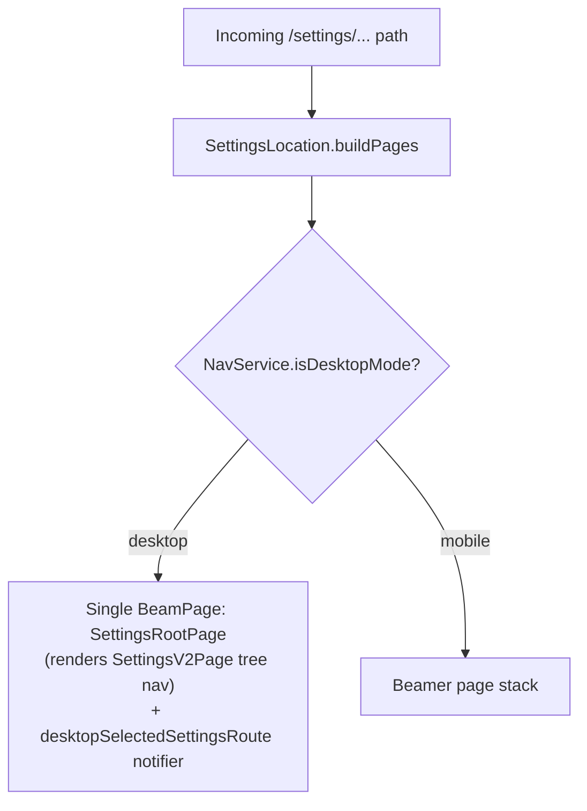
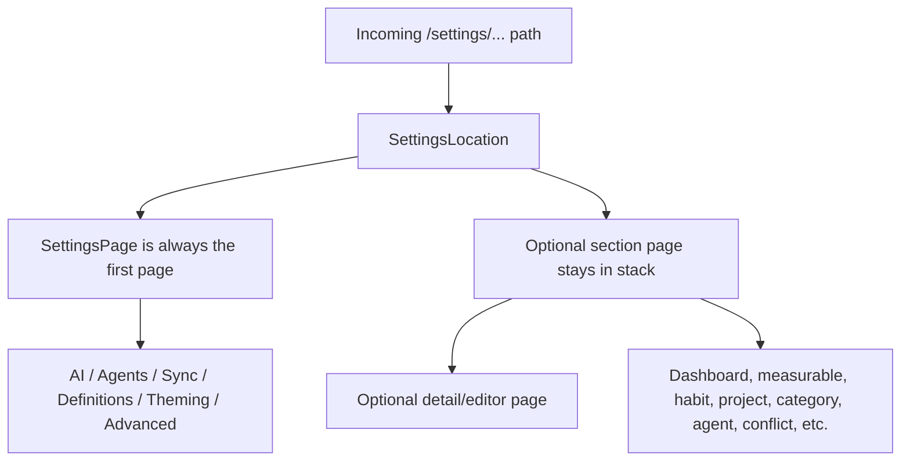
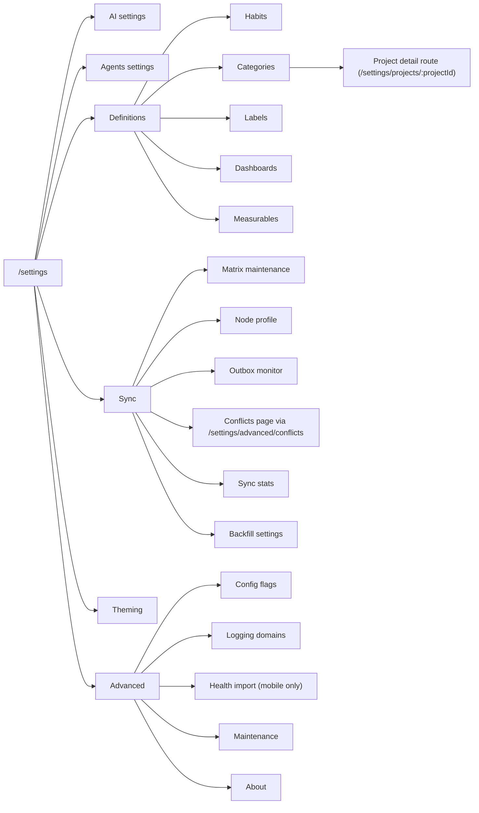
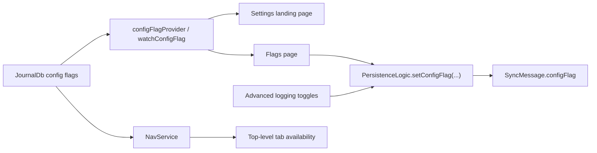
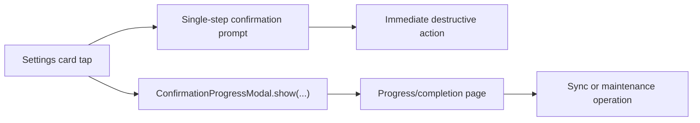

# Settings Feature

Settings is the app's control room. It mostly does not own the engines. It owns the switches, the route stack, the "are you sure?" moments, and a few utility pages that would otherwise be left wandering the halls.

If another feature needs a configuration surface, Settings is often where the user enters. That does not mean Settings owns the underlying domain. It usually means Settings owns the doorway and knows when to stop pretending it is the whole building.

## Core Job

In the current codebase, Settings does four concrete things:

1. Renders the `/settings` landing page and several section landing pages.
2. Assembles the Beamer stack for every `/settings/...` route in [`lib/beamer/locations/settings_location.dart`](../../beamer/locations/settings_location.dart).
3. Turns config flags into visible or hidden navigation.
4. Hosts a small set of actual settings-owned pages: theming, flags, advanced utilities, health import, about, and shared editor scaffolding for several definition types.

That last point matters. Settings is mostly a router, but not only a router.

## Ownership Boundaries

### Settings owns

- The landing page in [`ui/pages/settings_page.dart`](ui/pages/settings_page.dart)
- Route composition in [`lib/beamer/locations/settings_location.dart`](../../beamer/locations/settings_location.dart)
- Shared settings presentation widgets in [`ui/widgets/`](ui/widgets/)
- Shared list/detail scaffolding such as [`ui/pages/definitions_list_page.dart`](ui/pages/definitions_list_page.dart) and [`ui/widgets/entity_detail_card.dart`](ui/widgets/entity_detail_card.dart)
- Utility pages such as:
  - [`ui/pages/theming_page.dart`](ui/pages/theming_page.dart)
  - [`ui/pages/definitions_page.dart`](ui/pages/definitions_page.dart)
  - [`ui/pages/flags_page.dart`](ui/pages/flags_page.dart)
  - [`ui/pages/advanced_settings_page.dart`](ui/pages/advanced_settings_page.dart)
  - [`ui/pages/advanced/logging_settings_page.dart`](ui/pages/advanced/logging_settings_page.dart)
  - [`ui/pages/advanced/maintenance_page.dart`](ui/pages/advanced/maintenance_page.dart)
  - [`ui/pages/advanced/about_page.dart`](ui/pages/advanced/about_page.dart)
  - [`ui/pages/health_import_page.dart`](ui/pages/health_import_page.dart)
- The two-step destructive/long-running modal wrapper in [`ui/confirmation_progress_modal.dart`](ui/confirmation_progress_modal.dart)

### Settings routes into other features

- AI settings: [`lib/features/ai/ui/settings/ai_settings_page.dart`](../ai/ui/settings/ai_settings_page.dart)
- Agents: [`lib/features/agents/ui/`](../agents/ui/)
- Categories: [`lib/features/categories/ui/pages/`](../categories/ui/pages/)
- Labels: [`lib/features/labels/ui/pages/`](../labels/ui/pages/)
- Projects: [`lib/features/projects/ui/pages/`](../projects/ui/pages/)
- Sync: [`lib/features/sync/ui/`](../sync/ui/)

### Settings hosts pages that still depend on other feature logic

- Habit editing UI lives under Settings, but save/delete state comes from [`lib/features/habits/state/habit_settings_controller.dart`](../habits/state/habit_settings_controller.dart)
- Theming UI lives under Settings, but the real state machine is [`lib/features/theming/state/theming_controller.dart`](../theming/state/theming_controller.dart)
- Health import lives under Settings, but the implementation is [`lib/logic/health_import.dart`](../../logic/health_import.dart)

So yes, Settings is thin. Just not spiritually pure.

## Directory Shape

```text
lib/features/settings/
├── constants/
│   └── theming_settings_keys.dart
├── state/
│   └── zoom_controller.dart
├── widgetbook/
│   └── settings_widgetbook.dart
└── ui/
    ├── confirmation_progress_modal.dart
    ├── pages/
    │   ├── settings_page.dart
    │   ├── settings_root_page.dart
    │   ├── advanced/
    │   ├── dashboards/
    │   ├── habits/
    │   ├── measurables/
    │   ├── outbox/
    │   ├── advanced_settings_page.dart
    │   ├── definitions_list_page.dart
    │   ├── definitions_page.dart
    │   ├── flags_page.dart
    │   ├── form_text_field.dart
    │   ├── health_import_page.dart
    │   ├── sliver_box_adapter_page.dart
    │   └── theming_page.dart
    └── widgets/
        ├── dashboards/
        ├── form/
        ├── entity_detail_card.dart
        ├── settings_card.dart
        └── settings_icon.dart
```

The structure mirrors the actual role of the feature:

- `pages/` contains both landing pages and a few editors; `settings_root_page.dart` forks between the mobile single page and the desktop tree-nav layout
- `widgets/` keeps the settings area visually coherent
- `constants/` is tiny and currently only exposes theming preference keys

## Route Assembly

The canonical route owner is [`lib/beamer/locations/settings_location.dart`](../../beamer/locations/settings_location.dart).

`SettingsLocation.buildPages` has a hard desktop/mobile fork keyed on
`NavService.isDesktopMode`:



### Desktop (Settings V2 master/detail)

On desktop, `buildPages` pushes exactly **one** page —
[`SettingsRootPage`](ui/pages/settings_root_page.dart), which renders
[`SettingsV2Page`](../settings_v2/ui/pages/settings_v2_page.dart) (the
tree-nav master/detail UI in the separate
[`lib/features/settings_v2/`](../settings_v2/) feature). Instead of
stacking pages, it stores the sub-route in
`NavService.desktopSelectedSettingsRoute` and routes detail content into
the right-hand pane via that `ValueNotifier`. The stack model and stack
examples below apply to the mobile branch only.

### Mobile (page stack)

On mobile the important implementation detail is that Settings builds
*stacks*, not single pages. Parent pages stay in the Beamer stack for many
subroutes.



Concrete examples from the current implementation:

```text
/settings
  -> [SettingsPage]

/settings/sync/stats
  -> [SettingsPage, SyncSettingsPage, SyncStatsPage]

/settings/advanced/about
  -> [SettingsPage, AdvancedSettingsPage, AboutPage]

/settings/definitions
  -> [SettingsPage, DefinitionsPage]

/settings/dashboards/:dashboardId
  -> [SettingsPage, DashboardSettingsPage, EditDashboardPage]

/settings/categories/:categoryId
  -> [SettingsPage, CategoriesListPage, CategoryDetailsPage]
```

The Definitions hub is intentionally a flat sub-page rather than a stack
parent: tapping Habits, Categories, Labels, Dashboards, or Measurables
beams to the existing leaf URL (e.g. `/settings/categories`), which then
resolves into `[SettingsPage, CategoriesListPage]`. The hub is replaced
on navigation, not pushed underneath, so back from a leaf returns
straight to `/settings` instead of bouncing through Definitions.

That stacked model is why detail pages can feel like descendants of a section instead of random teleports. Beamer is doing real work here, which is nice for once.

## Runtime Topology



One slightly awkward but code-accurate detail: the Sync landing page links to conflicts through `/settings/advanced/conflicts`. The UI treats conflicts as sync-adjacent, the route still wears an Advanced nametag, and everyone is currently living with that arrangement.

## Landing Page Behavior

[`ui/pages/settings_page.dart`](ui/pages/settings_page.dart) is not a static list. It is assembled from live state:

- `configFlagProvider(enableWhatsNewFlag)` gates What's New at the root level; the Agents tile is always shown
- Habits and Dashboards gating moved into [`ui/pages/definitions_page.dart`](ui/pages/definitions_page.dart) — the root entry for Definitions is unconditional because Categories, Labels, and Measurables are always visible
- `configFlagProvider(enableMatrixFlag)` decides whether Sync is shown
- the Agents tile overlays a pending ritual indicator (`RitualPendingIndicator`)
- the What's New feature appears both as an app-bar action and as a settings card when enabled

The landing page is therefore equal parts navigation and feature census.

## Flags, Navigation, and Cross-Feature Side Effects

Settings is where feature flags become visible to users, but the effects are larger than the Settings UI itself.



This is why the flags page is not just a developer toy:

- toggling `enableHabitsPageFlag` or `enableDashboardsPageFlag` changes both Settings tiles and top-level navigation behavior
- toggling `enableMatrixFlag` changes visibility of Sync surfaces and also affects the Sync feature gate
- toggling `enableAiSummaryTtsFlag` shows or hides the local MLX Audio TTS button on task AI summaries
- logging flags influence subdomain logging pages under Advanced
- toggling a flag through Settings enqueues a `configFlag` sync message with the
  new boolean status; startup flag seeding does not enqueue anything, so devices
  do not overwrite each other just because an app session opened

The control panel is wired to actual breakers, not cardboard cutouts.

## Shared List and Detail Pattern

Dashboards, habits, and measurables all reuse the same broad pattern:

1. A list page wraps [`DefinitionsListPage<T>`](ui/pages/definitions_list_page.dart).
2. The list is fed by `notificationDrivenStream(...)` from `JournalDb` plus `UpdateNotifications`.
3. Search happens locally in the generic scaffold.
4. Tapping an item opens a detail editor page.
5. Saving or deleting goes through shared persistence or a feature-specific controller.

The shared create affordance for those list pages is `FloatingAddIcon`, which
now includes the bottom-navigation clearance wrapper. Dashboards, habits, and
measurables therefore stay above the floating app-shell nav without each page
inventing its own bottom offset.

### List pages

- [`ui/pages/dashboards/dashboards_page.dart`](ui/pages/dashboards/dashboards_page.dart)
- [`ui/pages/habits/habits_page.dart`](ui/pages/habits/habits_page.dart)
- [`ui/pages/measurables/measurables_page.dart`](ui/pages/measurables/measurables_page.dart)

### Detail/editor pages

- [`ui/pages/dashboards/dashboard_definition_page.dart`](ui/pages/dashboards/dashboard_definition_page.dart)
- [`ui/pages/habits/habit_details_page.dart`](ui/pages/habits/habit_details_page.dart)
- [`ui/pages/measurables/measurable_details_page.dart`](ui/pages/measurables/measurable_details_page.dart)

All detail editors render through the shared settings-detail kit
([`lib/widgets/settings/settings_detail_scaffold.dart`](../../widgets/settings/settings_detail_scaffold.dart)):
a `SettingsDetailScaffold` provides the header (back beams to the list
route), the Cmd/Ctrl+S save shortcut, and a sticky `SettingsFormActionBar`
with primary save (gated on the page's dirty state), secondary cancel, and —
in edit mode — a destructive delete that reuses each page's confirm flow.
Form rows are grouped into `SettingsFormSection` cards; the
FormBuilder-driven pages bridge into the design system via
[`ui/widgets/form/settings_form_text_field.dart`](ui/widgets/form/settings_form_text_field.dart)
and [`ui/widgets/form/form_switch.dart`](ui/widgets/form/form_switch.dart).
Visibility toggles share Active polarity (ON = visible) and private/active
switch rows carry explanatory subtitles.

The measurables editor exposes Favorite and Private switches and picks the
default aggregation type through a `SettingsPickerField` + single-page
modal; aggregation types always render their localized names (via
[`ui/aggregation_label.dart`](ui/aggregation_label.dart)), never raw enum
identifiers.

The dashboard editor keeps its chart machinery (`ChartMultiSelect` pickers,
reorderable `DashboardItemCard` list with swipe-to-dismiss and an explicit
drag handle) inside the charts section; chart rows title as
"Name — Localized aggregation". Save-and-copy-to-clipboard lives on the
action bar as a `DsGlassRoundButton` next to the destructive pill.

### Persistence split

- Dashboards and measurables save through [`lib/logic/persistence_logic.dart`](../../logic/persistence_logic.dart)
- Habits save through [`lib/features/habits/state/habit_settings_controller.dart`](../habits/state/habit_settings_controller.dart), which also schedules notifications

This is one of the more useful boundaries in the feature. Settings owns the editing shell, but it does not insist on owning every write path.

## Settings-Owned Utility Pages

### Theming

[`ui/pages/theming_page.dart`](ui/pages/theming_page.dart) is a thin view over [`lib/features/theming/state/theming_controller.dart`](../theming/state/theming_controller.dart).

It does three concrete things:

- switches `ThemeMode`
- selects light and dark theme names
- adapts the card styling to the currently active theme family

Theme selection is persisted in `SettingsDb`, and the theming controller also watches settings notifications so synced preference changes can be applied back into live state.

### Definitions

[`ui/pages/definitions_page.dart`](ui/pages/definitions_page.dart) is a flat hub that groups the entity-definition entry points (Habits, Categories, Labels, Dashboards, Measurables). It exists so the v1 root list reads as `AI · Agents · Sync · Definitions · Theming · Advanced` instead of fanning every entity type into a top-level row.

Each row beams to the existing leaf URL (`/settings/categories`, `/settings/labels`, …). Habits and Dashboards are still feature-flag-gated, but the gating now lives inside this hub rather than the root list.

### Flags

[`ui/pages/flags_page.dart`](ui/pages/flags_page.dart) renders a curated subset of config flags in a fixed order. It is intentionally not a raw dump of everything in the database.

Each visible flag has:

- a localized title
- a localized description
- a hand-picked icon
- a `Switch.adaptive` that writes back through `PersistenceLogic`, which updates
  the local `JournalDb` row and enqueues a `configFlag` sync message only when
  the flag status changed

The Flags entry is reached through Advanced; the `/settings/flags` URL itself is unchanged so existing deep links keep resolving.

### Advanced

[`ui/pages/advanced_settings_page.dart`](ui/pages/advanced_settings_page.dart) is the non-sync maintenance hub.

It currently links to:

- config flags (moved here from the v1 root list)
- logging domains
- health import on mobile only
- maintenance
- about

The tests enforce that sync-specific items no longer live here as cards, even if a few routes still pass through the Advanced namespace.

### Health import

[`ui/pages/health_import_page.dart`](ui/pages/health_import_page.dart) is a thin date-range launcher over [`lib/logic/health_import.dart`](../../logic/health_import.dart). In practice it is surfaced through the mobile-only Advanced entry point, even though the route itself still exists in the shared settings location.

### About

[`ui/pages/advanced/about_page.dart`](ui/pages/advanced/about_page.dart) is more than a static credits wall. It pulls:

- app version and build number from `PackageInfo`
- journal entry count from `JournalDb`
- flagged and task counts from shared widgets
- the Daily OS display name field, persisted through
  `DailyOsPreferencesController` into `SettingsDb` and read by the Daily OS
  Capture greeting

## Sync Surfaces From Settings

Settings does not implement sync itself, but it does define how sync is entered and how sync pages behave inside the settings namespace.

Key facts:

- the `/settings` landing page only shows Sync when `enableMatrixFlag` is on
- [`lib/features/sync/ui/widgets/sync_feature_gate.dart`](../sync/ui/widgets/sync_feature_gate.dart) guards sync pages and redirects back to `/settings` if sync is disabled
- the sync landing page is [`lib/features/sync/ui/sync_settings_page.dart`](../sync/ui/sync_settings_page.dart)
- sync maintenance, node profile, outbox, stats, and backfill each get their own leaf routes

This split keeps app-wide maintenance in Advanced and sync-specific maintenance with Sync, which is the correct kind of boring.

## Destructive and Long-Running Operations

Settings is where many "please do not tap this casually" actions live.

There are two common interaction patterns:



### Immediate confirmation flows

These actions run a single confirmation prompt and then act immediately, but
they do not all use the same confirmation widget:

- `showConfirmationModal(...)` is used for deleting editor and agent databases
  ([`ui/pages/advanced/maintenance_page.dart`](ui/pages/advanced/maintenance_page.dart)),
  deleting the sync database
  ([`lib/features/sync/ui/matrix_sync_maintenance_page.dart`](../sync/ui/matrix_sync_maintenance_page.dart)),
  and retrying or deleting outbox items
  ([`lib/features/sync/ui/pages/outbox/outbox_monitor_page.dart`](../sync/ui/pages/outbox/outbox_monitor_page.dart))
- `showModalActionSheet(...)` with a destructive `ModalSheetAction` is used for
  habit deletes
  ([`ui/pages/habits/habit_details_page.dart`](ui/pages/habits/habit_details_page.dart))
  and measurable deletes
  ([`ui/pages/measurables/measurable_details_page.dart`](ui/pages/measurables/measurable_details_page.dart))

### Confirmation + progress flows

Used by modals such as:

- [`lib/features/sync/ui/purge_modal.dart`](../sync/ui/purge_modal.dart)
- [`lib/features/sync/ui/fts5_recreate_modal.dart`](../sync/ui/fts5_recreate_modal.dart)
- [`lib/features/sync/ui/sync_modal.dart`](../sync/ui/sync_modal.dart)
- [`lib/features/sync/ui/sequence_log_populate_modal.dart`](../sync/ui/sequence_log_populate_modal.dart)

The shared wrapper lives in [`ui/confirmation_progress_modal.dart`](ui/confirmation_progress_modal.dart), catches exceptions, and optionally closes itself on completion.

## Route Inventory

This is the route shape that currently matters in practice:

- `/settings`
- `/settings/ai`
- `/settings/ai/profiles`
- `/settings/agents/...`
- `/settings/categories/...`
- `/settings/projects/...`
- `/settings/labels/...`
- `/settings/habits/...`
- `/settings/dashboards/...`
- `/settings/measurables/...`
- `/settings/sync`
- `/settings/sync/matrix/maintenance`
- `/settings/sync/node-profile`
- `/settings/sync/outbox`
- `/settings/sync/stats`
- `/settings/sync/backfill`
- `/settings/definitions`
- `/settings/theming`
- `/settings/flags`
- `/settings/health_import`
- `/settings/advanced`
- `/settings/advanced/logging_domains`
- `/settings/advanced/about`
- `/settings/advanced/conflicts/...`
- `/settings/advanced/maintenance`

The notable oddball is `/settings/projects/...`: there is no top-level Settings tile for projects, but the project **detail** route (`/settings/projects/:projectId`) still lives under the settings namespace because category and project management meet there. The project **create** flow does not — it lives under `ProjectsLocation` at `/projects/create`, and `SettingsLocation` explicitly excludes the reserved `create` slug so a stale `/settings/projects/create` deep link cannot render a detail page against a non-id slug.

## Notes For Future Changes

- Add new settings routes in [`lib/beamer/locations/settings_location.dart`](../../beamer/locations/settings_location.dart), not just in a tile callback.
- Decide explicitly whether a new page is:
  - a Settings-owned utility
  - a list/detail shell over another feature's data
  - a pure handoff into another feature
- If a surface is feature-gated, gate both the entry point and any leaf pages that should not remain reachable.
- Keep sync-specific repair tools with Sync unless they are truly app-wide.
- Reuse [`DefinitionsListPage<T>`](ui/pages/definitions_list_page.dart) and the existing card widgets before inventing another one-off admin list. Settings already has enough ways to make a form look earnest.
